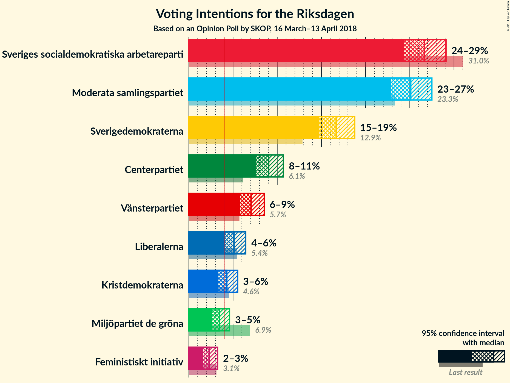
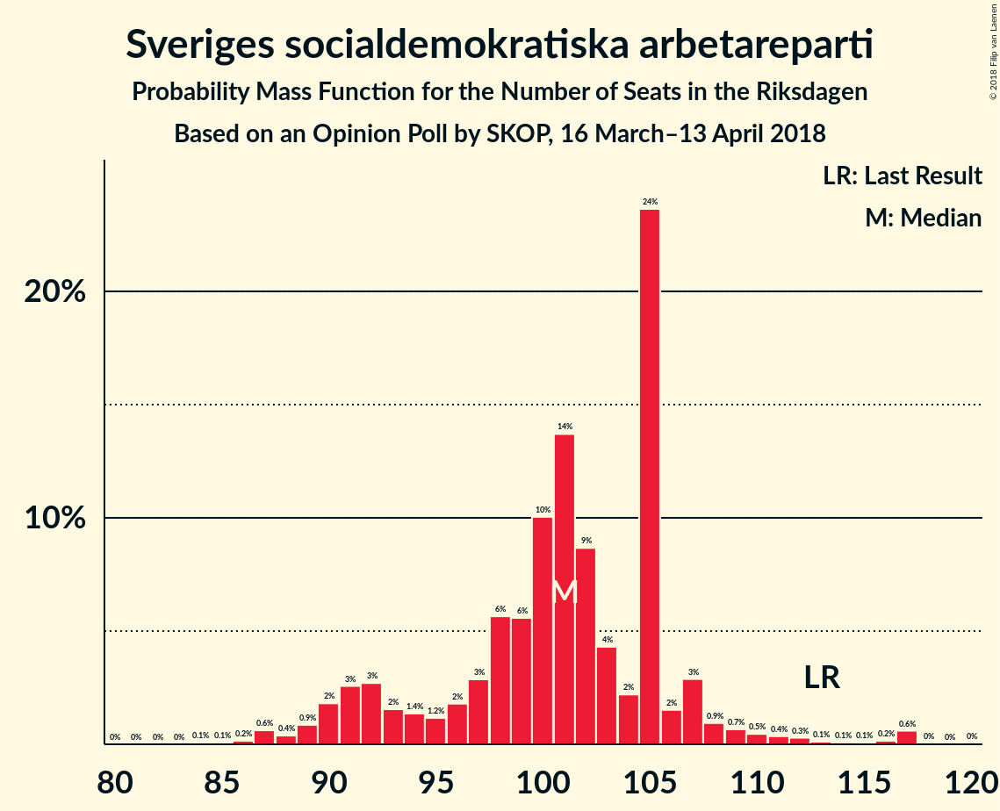
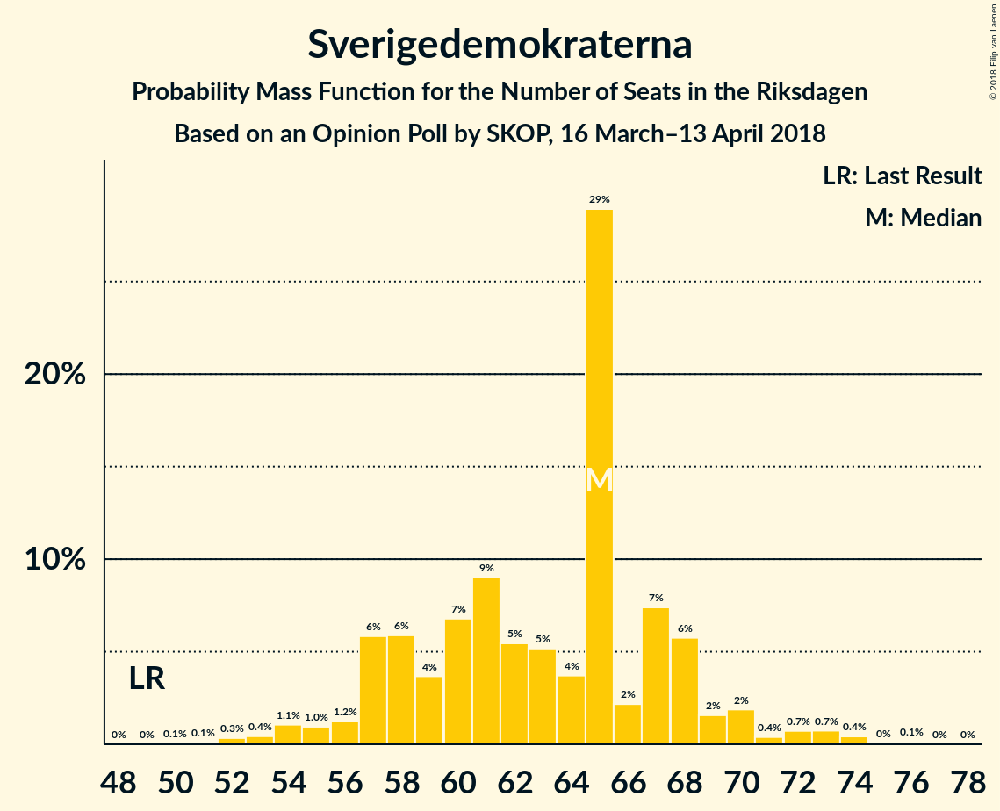

# Opinion Poll by SKOP, 16 March–13 April 2018

<a href="#voting-intentions">Voting Intentions</a> | <a href="#seats">Seats</a> | <a href="#coalitions">Coalitions</a> | <a href="#technical-information">Technical Information</a>

## Voting Intentions

### Confidence Intervals

| Party | Last Result | Poll Result | 80% Confidence Interval | 90% Confidence Interval | 95% Confidence Interval | 99% Confidence Interval |
|:-----:|:-----------:|:-----------:|:-----------------------:|:-----------------------:|:-----------------------:|:-----------------------:|
| Sveriges socialdemokratiska arbetareparti | 31.0% | 26.7% | 25.2–28.3% |24.7–28.7% |24.4–29.1% |23.7–29.9% |
| Moderata samlingspartiet | 23.3% | 25.1% | 23.6–26.7% |23.2–27.1% |22.9–27.5% |22.2–28.3% |
| Sverigedemokraterna | 12.9% | 16.7% | 15.4–18.0% |15.1–18.4% |14.8–18.8% |14.2–19.4% |
| Centerpartiet | 6.1% | 9.0% | 8.1–10.1% |7.8–10.4% |7.6–10.7% |7.2–11.2% |
| Vänsterpartiet | 5.7% | 7.0% | 6.2–8.0% |6.0–8.3% |5.8–8.5% |5.4–9.0% |
| Liberalerna | 5.4% | 5.1% | 4.4–6.0% |4.2–6.2% |4.1–6.4% |3.7–6.9% |
| Kristdemokraterna | 4.6% | 4.3% | 3.7–5.1% |3.5–5.3% |3.3–5.5% |3.0–5.9% |
| Miljöpartiet de gröna | 6.9% | 3.5% | 2.9–4.2% |2.8–4.4% |2.6–4.6% |2.4–5.0% |
| Feministiskt initiativ | 3.1% | 2.3% | 1.8–2.9% |1.7–3.1% |1.6–3.2% |1.4–3.6% |

*Note:* The poll result column reflects the actual value used in the calculations. Published results may vary slightly, and in addition be rounded to fewer digits.

## Seats

### Confidence Intervals

| Party | Last Result | Median | 80% Confidence Interval | 90% Confidence Interval | 95% Confidence Interval | 99% Confidence Interval |
|:-----:|:-----------:|:------:|:-----------------------:|:-----------------------:|:-----------------------:|:-----------------------:|
| <a href="#sveriges-socialdemokratiska-arbetareparti">Sveriges socialdemokratiska arbetareparti</a> | 113 | 99 | 92–104 |90–109 |88–111 |86–112 |
| <a href="#moderata-samlingspartiet">Moderata samlingspartiet</a> | 84 | 94 | 87–100 |85–102 |82–107 |81–110 |
| <a href="#sverigedemokraterna">Sverigedemokraterna</a> | 49 | 61 | 57–69 |55–69 |54–74 |53–76 |
| <a href="#centerpartiet">Centerpartiet</a> | 22 | 34 | 29–41 |29–42 |28–42 |27–43 |
| <a href="#vänsterpartiet">Vänsterpartiet</a> | 21 | 27 | 22–31 |20–31 |20–32 |20–34 |
| <a href="#liberalerna">Liberalerna</a> | 19 | 19 | 16–23 |16–24 |0–24 |0–27 |
| <a href="#kristdemokraterna">Kristdemokraterna</a> | 16 | 15 | 0–19 |0–19 |0–21 |0–21 |
| <a href="#miljöpartiet-de-gröna">Miljöpartiet de gröna</a> | 25 | 0 | 0–15 |0–16 |0–17 |0–18 |
| <a href="#feministiskt-initiativ">Feministiskt initiativ</a> | 0 | 0 | 0 |0 |0 |0 |

### Sveriges socialdemokratiska arbetareparti

*For a full overview of the results for this party, see the [Sveriges socialdemokratiska arbetareparti](party-sverigessocialdemokratiskaarbetareparti.html) page.*

| Number of Seats | Probability | Accumulated | Special Marks |
|:---------------:|:-----------:|:-----------:|:-------------:|
| 84 | 0.3% | 100% |  |
| 85 | 0% | 99.7% |  |
| 86 | 0.5% | 99.6% |  |
| 87 | 0.3% | 99.1% |  |
| 88 | 2% | 98.9% |  |
| 89 | 0.6% | 97% |  |
| 90 | 4% | 96% |  |
| 91 | 1.3% | 93% |  |
| 92 | 2% | 91% |  |
| 93 | 9% | 89% |  |
| 94 | 9% | 80% |  |
| 95 | 2% | 71% |  |
| 96 | 0.5% | 69% |  |
| 97 | 2% | 69% |  |
| 98 | 4% | 67% |  |
| 99 | 13% | 63% | Median |
| 100 | 24% | 50% |  |
| 101 | 10% | 26% |  |
| 102 | 2% | 16% |  |
| 103 | 2% | 13% |  |
| 104 | 2% | 11% |  |
| 105 | 0.6% | 9% |  |
| 106 | 0.7% | 8% |  |
| 107 | 0.2% | 8% |  |
| 108 | 0.7% | 7% |  |
| 109 | 3% | 7% |  |
| 110 | 0% | 4% |  |
| 111 | 2% | 4% |  |
| 112 | 1.4% | 2% |  |
| 113 | 0% | 0.3% | Last Result |
| 114 | 0.1% | 0.3% |  |
| 115 | 0.1% | 0.2% |  |
| 116 | 0.1% | 0.1% |  |
| 117 | 0% | 0% |  |

### Moderata samlingspartiet

*For a full overview of the results for this party, see the [Moderata samlingspartiet](party-moderatasamlingspartiet.html) page.*

| Number of Seats | Probability | Accumulated | Special Marks |
|:---------------:|:-----------:|:-----------:|:-------------:|
| 76 | 0% | 100% |  |
| 77 | 0% | 99.9% |  |
| 78 | 0.2% | 99.9% |  |
| 79 | 0% | 99.8% |  |
| 80 | 0% | 99.7% |  |
| 81 | 2% | 99.7% |  |
| 82 | 1.3% | 98% |  |
| 83 | 0.1% | 97% |  |
| 84 | 1.0% | 97% | Last Result |
| 85 | 3% | 96% |  |
| 86 | 0.6% | 92% |  |
| 87 | 2% | 92% |  |
| 88 | 2% | 90% |  |
| 89 | 2% | 87% |  |
| 90 | 16% | 86% |  |
| 91 | 0.8% | 69% |  |
| 92 | 4% | 69% |  |
| 93 | 2% | 64% |  |
| 94 | 14% | 62% | Median |
| 95 | 9% | 48% |  |
| 96 | 6% | 38% |  |
| 97 | 0.8% | 33% |  |
| 98 | 2% | 32% |  |
| 99 | 6% | 30% |  |
| 100 | 16% | 24% |  |
| 101 | 2% | 8% |  |
| 102 | 3% | 6% |  |
| 103 | 0.1% | 4% |  |
| 104 | 0.3% | 4% |  |
| 105 | 0.2% | 3% |  |
| 106 | 0.1% | 3% |  |
| 107 | 2% | 3% |  |
| 108 | 0.1% | 0.6% |  |
| 109 | 0% | 0.6% |  |
| 110 | 0.1% | 0.5% |  |
| 111 | 0% | 0.4% |  |
| 112 | 0.4% | 0.4% |  |
| 113 | 0% | 0% |  |

### Sverigedemokraterna

*For a full overview of the results for this party, see the [Sverigedemokraterna](party-sverigedemokraterna.html) page.*

| Number of Seats | Probability | Accumulated | Special Marks |
|:---------------:|:-----------:|:-----------:|:-------------:|
| 49 | 0% | 100% | Last Result |
| 50 | 0.2% | 100% |  |
| 51 | 0% | 99.8% |  |
| 52 | 0.2% | 99.7% |  |
| 53 | 2% | 99.5% |  |
| 54 | 3% | 98% |  |
| 55 | 0.3% | 95% |  |
| 56 | 2% | 95% |  |
| 57 | 3% | 93% |  |
| 58 | 10% | 89% |  |
| 59 | 9% | 80% |  |
| 60 | 19% | 70% |  |
| 61 | 2% | 52% | Median |
| 62 | 3% | 50% |  |
| 63 | 1.0% | 47% |  |
| 64 | 7% | 46% |  |
| 65 | 1.3% | 38% |  |
| 66 | 0.3% | 37% |  |
| 67 | 7% | 37% |  |
| 68 | 12% | 30% |  |
| 69 | 13% | 18% |  |
| 70 | 0.2% | 5% |  |
| 71 | 0.3% | 4% |  |
| 72 | 0.1% | 4% |  |
| 73 | 1.2% | 4% |  |
| 74 | 1.0% | 3% |  |
| 75 | 0.1% | 2% |  |
| 76 | 2% | 2% |  |
| 77 | 0% | 0% |  |

### Centerpartiet

*For a full overview of the results for this party, see the [Centerpartiet](party-centerpartiet.html) page.*

| Number of Seats | Probability | Accumulated | Special Marks |
|:---------------:|:-----------:|:-----------:|:-------------:|
| 22 | 0% | 100% | Last Result |
| 23 | 0% | 100% |  |
| 24 | 0.1% | 100% |  |
| 25 | 0.1% | 99.9% |  |
| 26 | 0.1% | 99.8% |  |
| 27 | 2% | 99.7% |  |
| 28 | 2% | 98% |  |
| 29 | 7% | 96% |  |
| 30 | 4% | 89% |  |
| 31 | 5% | 84% |  |
| 32 | 20% | 79% |  |
| 33 | 5% | 59% |  |
| 34 | 21% | 54% | Median |
| 35 | 2% | 33% |  |
| 36 | 4% | 32% |  |
| 37 | 14% | 28% |  |
| 38 | 2% | 14% |  |
| 39 | 0.4% | 12% |  |
| 40 | 0.8% | 11% |  |
| 41 | 0.5% | 10% |  |
| 42 | 9% | 10% |  |
| 43 | 0.7% | 0.8% |  |
| 44 | 0% | 0% |  |

### Vänsterpartiet

*For a full overview of the results for this party, see the [Vänsterpartiet](party-vänsterpartiet.html) page.*

| Number of Seats | Probability | Accumulated | Special Marks |
|:---------------:|:-----------:|:-----------:|:-------------:|
| 18 | 0.1% | 100% |  |
| 19 | 0% | 99.9% |  |
| 20 | 5% | 99.9% |  |
| 21 | 2% | 95% | Last Result |
| 22 | 6% | 93% |  |
| 23 | 13% | 87% |  |
| 24 | 5% | 74% |  |
| 25 | 5% | 69% |  |
| 26 | 13% | 64% |  |
| 27 | 13% | 51% | Median |
| 28 | 3% | 39% |  |
| 29 | 5% | 36% |  |
| 30 | 10% | 30% |  |
| 31 | 17% | 20% |  |
| 32 | 2% | 4% |  |
| 33 | 0.5% | 1.1% |  |
| 34 | 0.4% | 0.6% |  |
| 35 | 0.2% | 0.3% |  |
| 36 | 0% | 0% |  |

### Liberalerna

*For a full overview of the results for this party, see the [Liberalerna](party-liberalerna.html) page.*

| Number of Seats | Probability | Accumulated | Special Marks |
|:---------------:|:-----------:|:-----------:|:-------------:|
| 0 | 4% | 100% |  |
| 1 | 0% | 96% |  |
| 2 | 0% | 96% |  |
| 3 | 0% | 96% |  |
| 4 | 0% | 96% |  |
| 5 | 0% | 96% |  |
| 6 | 0% | 96% |  |
| 7 | 0% | 96% |  |
| 8 | 0% | 96% |  |
| 9 | 0% | 96% |  |
| 10 | 0% | 96% |  |
| 11 | 0% | 96% |  |
| 12 | 0% | 96% |  |
| 13 | 0% | 96% |  |
| 14 | 0% | 96% |  |
| 15 | 0.9% | 96% |  |
| 16 | 6% | 95% |  |
| 17 | 22% | 90% |  |
| 18 | 12% | 68% |  |
| 19 | 15% | 55% | Last Result, Median |
| 20 | 5% | 40% |  |
| 21 | 15% | 36% |  |
| 22 | 9% | 21% |  |
| 23 | 5% | 11% |  |
| 24 | 4% | 6% |  |
| 25 | 0.6% | 1.4% |  |
| 26 | 0.3% | 0.8% |  |
| 27 | 0.5% | 0.6% |  |
| 28 | 0% | 0% |  |

### Kristdemokraterna

*For a full overview of the results for this party, see the [Kristdemokraterna](party-kristdemokraterna.html) page.*

| Number of Seats | Probability | Accumulated | Special Marks |
|:---------------:|:-----------:|:-----------:|:-------------:|
| 0 | 38% | 100% |  |
| 1 | 0% | 62% |  |
| 2 | 0% | 62% |  |
| 3 | 0% | 62% |  |
| 4 | 0% | 62% |  |
| 5 | 0% | 62% |  |
| 6 | 0% | 62% |  |
| 7 | 0% | 62% |  |
| 8 | 0% | 62% |  |
| 9 | 0% | 62% |  |
| 10 | 0% | 62% |  |
| 11 | 0% | 62% |  |
| 12 | 0% | 62% |  |
| 13 | 0% | 62% |  |
| 14 | 0% | 62% |  |
| 15 | 15% | 62% | Median |
| 16 | 15% | 47% | Last Result |
| 17 | 3% | 32% |  |
| 18 | 17% | 29% |  |
| 19 | 7% | 12% |  |
| 20 | 0.7% | 4% |  |
| 21 | 3% | 4% |  |
| 22 | 0.2% | 0.3% |  |
| 23 | 0.1% | 0.1% |  |
| 24 | 0% | 0% |  |

### Miljöpartiet de gröna

*For a full overview of the results for this party, see the [Miljöpartiet de gröna](party-miljöpartietdegröna.html) page.*

| Number of Seats | Probability | Accumulated | Special Marks |
|:---------------:|:-----------:|:-----------:|:-------------:|
| 0 | 79% | 100% | Median |
| 1 | 0% | 21% |  |
| 2 | 0% | 21% |  |
| 3 | 0% | 21% |  |
| 4 | 0% | 21% |  |
| 5 | 0% | 21% |  |
| 6 | 0% | 21% |  |
| 7 | 0% | 21% |  |
| 8 | 0% | 21% |  |
| 9 | 0% | 21% |  |
| 10 | 0% | 21% |  |
| 11 | 0% | 21% |  |
| 12 | 0% | 21% |  |
| 13 | 0% | 21% |  |
| 14 | 3% | 21% |  |
| 15 | 12% | 18% |  |
| 16 | 2% | 6% |  |
| 17 | 3% | 4% |  |
| 18 | 0.6% | 1.0% |  |
| 19 | 0.1% | 0.4% |  |
| 20 | 0.3% | 0.4% |  |
| 21 | 0.1% | 0.1% |  |
| 22 | 0% | 0% |  |
| 23 | 0% | 0% |  |
| 24 | 0% | 0% |  |
| 25 | 0% | 0% | Last Result |

### Feministiskt initiativ

*For a full overview of the results for this party, see the [Feministiskt initiativ](party-feministisktinitiativ.html) page.*

| Number of Seats | Probability | Accumulated | Special Marks |
|:---------------:|:-----------:|:-----------:|:-------------:|
| 0 | 100% | 100% | Last Result, Median |

## Coalitions

### Confidence Intervals

| Coalition | Last Result | Median | Majority? | 80% Confidence Interval | 90% Confidence Interval | 95% Confidence Interval | 99% Confidence Interval |
|:---------:|:-----------:|:------:|:---------:|:-----------------------:|:-----------------------:|:-----------------------:|:-----------------------:|
| Moderata samlingspartiet – Centerpartiet – Liberalerna – Kristdemokraterna | 141 | 159 | 2% | 146–169 | 146–169 | 141–173 | 138–175 |
| Moderata samlingspartiet – Centerpartiet – Liberalerna | 125 | 149 | 0% | 137–157 | 135–159 | 131–162 | 125–163 |
| Moderata samlingspartiet – Centerpartiet – Kristdemokraterna | 122 | 138 | 0% | 127–151 | 127–151 | 125–152 | 121–155 |
| Sveriges socialdemokratiska arbetareparti – Vänsterpartiet – Miljöpartiet de gröna – Feministiskt initiativ | 159 | 129 | 0% | 120–136 | 120–139 | 117–144 | 113–147 |
| Sveriges socialdemokratiska arbetareparti – Vänsterpartiet – Miljöpartiet de gröna | 159 | 129 | 0% | 120–136 | 120–139 | 117–144 | 113–147 |
| Sveriges socialdemokratiska arbetareparti – Vänsterpartiet | 134 | 123 | 0% | 120–131 | 117–134 | 112–139 | 110–144 |
| Moderata samlingspartiet – Centerpartiet | 106 | 129 | 0% | 119–136 | 114–138 | 114–138 | 113–145 |

### Moderata samlingspartiet – Centerpartiet – Liberalerna – Kristdemokraterna

| Number of Seats | Probability | Accumulated | Special Marks |
|:---------------:|:-----------:|:-----------:|:-------------:|
| 132 | 0% | 100% |  |
| 133 | 0% | 99.9% |  |
| 134 | 0% | 99.9% |  |
| 135 | 0% | 99.9% |  |
| 136 | 0% | 99.9% |  |
| 137 | 0.3% | 99.9% |  |
| 138 | 2% | 99.6% |  |
| 139 | 0.1% | 98% |  |
| 140 | 0.1% | 98% |  |
| 141 | 0.6% | 98% | Last Result |
| 142 | 0.1% | 97% |  |
| 143 | 0.7% | 97% |  |
| 144 | 0.4% | 96% |  |
| 145 | 0.4% | 96% |  |
| 146 | 9% | 96% |  |
| 147 | 0.6% | 87% |  |
| 148 | 0.1% | 86% |  |
| 149 | 14% | 86% |  |
| 150 | 2% | 72% |  |
| 151 | 3% | 70% |  |
| 152 | 0.2% | 67% |  |
| 153 | 8% | 67% |  |
| 154 | 1.1% | 59% |  |
| 155 | 2% | 58% |  |
| 156 | 0.6% | 56% |  |
| 157 | 2% | 56% |  |
| 158 | 1.0% | 53% |  |
| 159 | 7% | 52% |  |
| 160 | 0.4% | 46% |  |
| 161 | 4% | 45% |  |
| 162 | 6% | 41% | Median |
| 163 | 1.1% | 35% |  |
| 164 | 7% | 34% |  |
| 165 | 2% | 27% |  |
| 166 | 0.1% | 25% |  |
| 167 | 2% | 25% |  |
| 168 | 9% | 23% |  |
| 169 | 9% | 14% |  |
| 170 | 1.1% | 4% |  |
| 171 | 0.1% | 3% |  |
| 172 | 0.5% | 3% |  |
| 173 | 1.1% | 3% |  |
| 174 | 0% | 2% |  |
| 175 | 1.4% | 2% | Majority |
| 176 | 0% | 0.2% |  |
| 177 | 0% | 0.2% |  |
| 178 | 0.1% | 0.2% |  |
| 179 | 0% | 0% |  |

### Moderata samlingspartiet – Centerpartiet – Liberalerna

| Number of Seats | Probability | Accumulated | Special Marks |
|:---------------:|:-----------:|:-----------:|:-------------:|
| 120 | 0.1% | 100% |  |
| 121 | 0% | 99.9% |  |
| 122 | 0% | 99.9% |  |
| 123 | 0% | 99.9% |  |
| 124 | 0.3% | 99.9% |  |
| 125 | 0.1% | 99.6% | Last Result |
| 126 | 0% | 99.4% |  |
| 127 | 0.1% | 99.4% |  |
| 128 | 0.1% | 99.3% |  |
| 129 | 0.2% | 99.2% |  |
| 130 | 0.4% | 99.0% |  |
| 131 | 1.2% | 98.6% |  |
| 132 | 0.5% | 97% |  |
| 133 | 0% | 97% |  |
| 134 | 0.2% | 97% |  |
| 135 | 5% | 97% |  |
| 136 | 0.6% | 92% |  |
| 137 | 4% | 91% |  |
| 138 | 2% | 87% |  |
| 139 | 2% | 85% |  |
| 140 | 1.0% | 83% |  |
| 141 | 1.1% | 82% |  |
| 142 | 3% | 81% |  |
| 143 | 3% | 77% |  |
| 144 | 1.3% | 74% |  |
| 145 | 4% | 73% |  |
| 146 | 13% | 69% |  |
| 147 | 0.3% | 55% | Median |
| 148 | 2% | 55% |  |
| 149 | 20% | 53% |  |
| 150 | 10% | 33% |  |
| 151 | 1.4% | 23% |  |
| 152 | 0.3% | 21% |  |
| 153 | 0.2% | 21% |  |
| 154 | 9% | 21% |  |
| 155 | 0.6% | 11% |  |
| 156 | 0.7% | 11% |  |
| 157 | 2% | 10% |  |
| 158 | 0.1% | 8% |  |
| 159 | 5% | 8% |  |
| 160 | 0.3% | 3% |  |
| 161 | 0.2% | 3% |  |
| 162 | 2% | 3% |  |
| 163 | 0.4% | 0.5% |  |
| 164 | 0% | 0.1% |  |
| 165 | 0% | 0.1% |  |
| 166 | 0% | 0.1% |  |
| 167 | 0.1% | 0.1% |  |
| 168 | 0% | 0% |  |

### Moderata samlingspartiet – Centerpartiet – Kristdemokraterna

| Number of Seats | Probability | Accumulated | Special Marks |
|:---------------:|:-----------:|:-----------:|:-------------:|
| 118 | 0.1% | 100% |  |
| 119 | 0% | 99.8% |  |
| 120 | 0.3% | 99.8% |  |
| 121 | 0.6% | 99.5% |  |
| 122 | 0.4% | 99.0% | Last Result |
| 123 | 0.2% | 98.6% |  |
| 124 | 0.3% | 98% |  |
| 125 | 0.9% | 98% |  |
| 126 | 0.2% | 97% |  |
| 127 | 8% | 97% |  |
| 128 | 1.3% | 89% |  |
| 129 | 0.8% | 88% |  |
| 130 | 4% | 87% |  |
| 131 | 2% | 83% |  |
| 132 | 13% | 81% |  |
| 133 | 3% | 68% |  |
| 134 | 1.1% | 65% |  |
| 135 | 0.2% | 64% |  |
| 136 | 2% | 64% |  |
| 137 | 8% | 62% |  |
| 138 | 4% | 54% |  |
| 139 | 0.3% | 50% |  |
| 140 | 6% | 49% |  |
| 141 | 2% | 43% |  |
| 142 | 3% | 41% |  |
| 143 | 4% | 38% | Median |
| 144 | 0.5% | 34% |  |
| 145 | 0.4% | 33% |  |
| 146 | 2% | 33% |  |
| 147 | 14% | 31% |  |
| 148 | 3% | 17% |  |
| 149 | 2% | 14% |  |
| 150 | 0.7% | 12% |  |
| 151 | 8% | 11% |  |
| 152 | 3% | 4% |  |
| 153 | 0.1% | 1.0% |  |
| 154 | 0.2% | 0.9% |  |
| 155 | 0.6% | 0.8% |  |
| 156 | 0.1% | 0.2% |  |
| 157 | 0% | 0.1% |  |
| 158 | 0% | 0.1% |  |
| 159 | 0% | 0.1% |  |
| 160 | 0% | 0% |  |

### Sveriges socialdemokratiska arbetareparti – Vänsterpartiet – Miljöpartiet de gröna – Feministiskt initiativ

| Number of Seats | Probability | Accumulated | Special Marks |
|:---------------:|:-----------:|:-----------:|:-------------:|
| 110 | 0.4% | 100% |  |
| 111 | 0% | 99.6% |  |
| 112 | 0% | 99.5% |  |
| 113 | 0.3% | 99.5% |  |
| 114 | 0% | 99.2% |  |
| 115 | 0% | 99.2% |  |
| 116 | 0.1% | 99.1% |  |
| 117 | 2% | 99.1% |  |
| 118 | 2% | 97% |  |
| 119 | 0.2% | 95% |  |
| 120 | 11% | 95% |  |
| 121 | 5% | 84% |  |
| 122 | 0.7% | 79% |  |
| 123 | 12% | 79% |  |
| 124 | 0.1% | 66% |  |
| 125 | 4% | 66% |  |
| 126 | 2% | 62% | Median |
| 127 | 4% | 60% |  |
| 128 | 5% | 56% |  |
| 129 | 4% | 51% |  |
| 130 | 5% | 47% |  |
| 131 | 16% | 42% |  |
| 132 | 2% | 26% |  |
| 133 | 0.6% | 23% |  |
| 134 | 2% | 23% |  |
| 135 | 9% | 21% |  |
| 136 | 3% | 12% |  |
| 137 | 0.7% | 9% |  |
| 138 | 0.4% | 8% |  |
| 139 | 3% | 8% |  |
| 140 | 0.1% | 5% |  |
| 141 | 0.1% | 5% |  |
| 142 | 1.1% | 5% |  |
| 143 | 1.1% | 4% |  |
| 144 | 2% | 3% |  |
| 145 | 0.3% | 1.0% |  |
| 146 | 0% | 0.7% |  |
| 147 | 0.5% | 0.7% |  |
| 148 | 0% | 0.2% |  |
| 149 | 0% | 0.2% |  |
| 150 | 0% | 0.1% |  |
| 151 | 0.1% | 0.1% |  |
| 152 | 0% | 0.1% |  |
| 153 | 0% | 0.1% |  |
| 154 | 0% | 0% |  |
| 155 | 0% | 0% |  |
| 156 | 0% | 0% |  |
| 157 | 0% | 0% |  |
| 158 | 0% | 0% |  |
| 159 | 0% | 0% | Last Result |

### Sveriges socialdemokratiska arbetareparti – Vänsterpartiet – Miljöpartiet de gröna

| Number of Seats | Probability | Accumulated | Special Marks |
|:---------------:|:-----------:|:-----------:|:-------------:|
| 110 | 0.4% | 100% |  |
| 111 | 0% | 99.6% |  |
| 112 | 0% | 99.5% |  |
| 113 | 0.3% | 99.5% |  |
| 114 | 0% | 99.2% |  |
| 115 | 0% | 99.2% |  |
| 116 | 0.1% | 99.1% |  |
| 117 | 2% | 99.0% |  |
| 118 | 2% | 97% |  |
| 119 | 0.2% | 95% |  |
| 120 | 11% | 95% |  |
| 121 | 5% | 84% |  |
| 122 | 0.7% | 79% |  |
| 123 | 12% | 79% |  |
| 124 | 0.1% | 66% |  |
| 125 | 4% | 66% |  |
| 126 | 2% | 62% | Median |
| 127 | 4% | 60% |  |
| 128 | 5% | 56% |  |
| 129 | 4% | 51% |  |
| 130 | 5% | 47% |  |
| 131 | 16% | 42% |  |
| 132 | 2% | 26% |  |
| 133 | 0.6% | 23% |  |
| 134 | 2% | 23% |  |
| 135 | 9% | 21% |  |
| 136 | 3% | 12% |  |
| 137 | 0.7% | 9% |  |
| 138 | 0.4% | 8% |  |
| 139 | 3% | 8% |  |
| 140 | 0.1% | 5% |  |
| 141 | 0.1% | 5% |  |
| 142 | 1.1% | 5% |  |
| 143 | 1.1% | 4% |  |
| 144 | 2% | 3% |  |
| 145 | 0.3% | 1.0% |  |
| 146 | 0% | 0.7% |  |
| 147 | 0.5% | 0.7% |  |
| 148 | 0% | 0.2% |  |
| 149 | 0% | 0.2% |  |
| 150 | 0% | 0.1% |  |
| 151 | 0.1% | 0.1% |  |
| 152 | 0% | 0.1% |  |
| 153 | 0% | 0.1% |  |
| 154 | 0% | 0% |  |
| 155 | 0% | 0% |  |
| 156 | 0% | 0% |  |
| 157 | 0% | 0% |  |
| 158 | 0% | 0% |  |
| 159 | 0% | 0% | Last Result |

### Sveriges socialdemokratiska arbetareparti – Vänsterpartiet

| Number of Seats | Probability | Accumulated | Special Marks |
|:---------------:|:-----------:|:-----------:|:-------------:|
| 108 | 0% | 100% |  |
| 109 | 0.1% | 99.9% |  |
| 110 | 2% | 99.9% |  |
| 111 | 0.1% | 98% |  |
| 112 | 0.4% | 98% |  |
| 113 | 0.4% | 97% |  |
| 114 | 0.1% | 97% |  |
| 115 | 0.5% | 97% |  |
| 116 | 0.2% | 97% |  |
| 117 | 4% | 96% |  |
| 118 | 2% | 93% |  |
| 119 | 0.3% | 91% |  |
| 120 | 18% | 90% |  |
| 121 | 5% | 72% |  |
| 122 | 5% | 67% |  |
| 123 | 13% | 62% |  |
| 124 | 0.1% | 49% |  |
| 125 | 3% | 49% |  |
| 126 | 3% | 46% | Median |
| 127 | 5% | 43% |  |
| 128 | 5% | 37% |  |
| 129 | 4% | 33% |  |
| 130 | 5% | 29% |  |
| 131 | 16% | 24% |  |
| 132 | 0.8% | 8% |  |
| 133 | 0.3% | 7% |  |
| 134 | 2% | 7% | Last Result |
| 135 | 1.0% | 5% |  |
| 136 | 0.2% | 4% |  |
| 137 | 0.6% | 4% |  |
| 138 | 0.3% | 3% |  |
| 139 | 1.0% | 3% |  |
| 140 | 0% | 2% |  |
| 141 | 0% | 2% |  |
| 142 | 0.1% | 2% |  |
| 143 | 0.1% | 1.4% |  |
| 144 | 1.3% | 1.4% |  |
| 145 | 0.1% | 0.1% |  |
| 146 | 0% | 0% |  |

### Moderata samlingspartiet – Centerpartiet

| Number of Seats | Probability | Accumulated | Special Marks |
|:---------------:|:-----------:|:-----------:|:-------------:|
| 106 | 0% | 100% | Last Result |
| 107 | 0% | 100% |  |
| 108 | 0.3% | 100% |  |
| 109 | 0% | 99.7% |  |
| 110 | 0% | 99.7% |  |
| 111 | 0% | 99.7% |  |
| 112 | 0.1% | 99.6% |  |
| 113 | 0.3% | 99.5% |  |
| 114 | 5% | 99.2% |  |
| 115 | 0.1% | 95% |  |
| 116 | 0.2% | 95% |  |
| 117 | 2% | 94% |  |
| 118 | 1.1% | 92% |  |
| 119 | 5% | 91% |  |
| 120 | 0.6% | 86% |  |
| 121 | 0.7% | 85% |  |
| 122 | 2% | 85% |  |
| 123 | 0.7% | 83% |  |
| 124 | 9% | 82% |  |
| 125 | 4% | 73% |  |
| 126 | 2% | 69% |  |
| 127 | 8% | 68% |  |
| 128 | 4% | 59% | Median |
| 129 | 9% | 55% |  |
| 130 | 3% | 46% |  |
| 131 | 2% | 43% |  |
| 132 | 20% | 40% |  |
| 133 | 0.7% | 21% |  |
| 134 | 0.2% | 20% |  |
| 135 | 0.1% | 20% |  |
| 136 | 11% | 20% |  |
| 137 | 3% | 9% |  |
| 138 | 4% | 6% |  |
| 139 | 0.4% | 2% |  |
| 140 | 0.1% | 2% |  |
| 141 | 0.6% | 2% |  |
| 142 | 0.1% | 1.0% |  |
| 143 | 0.1% | 0.9% |  |
| 144 | 0% | 0.8% |  |
| 145 | 0.3% | 0.7% |  |
| 146 | 0% | 0.4% |  |
| 147 | 0% | 0.4% |  |
| 148 | 0% | 0.4% |  |
| 149 | 0% | 0.4% |  |
| 150 | 0.4% | 0.4% |  |
| 151 | 0% | 0% |  |

## Technical Information

### Opinion Poll

+ **Polling firm:** SKOP
+ **Commissioner(s):** —
+ **Fieldwork period:** 16 March–13 April 2018

### Calculations

+ **Sample size:** 1350
+ **Simulations done:** 131,072
+ **Error estimate:** 2.16%

