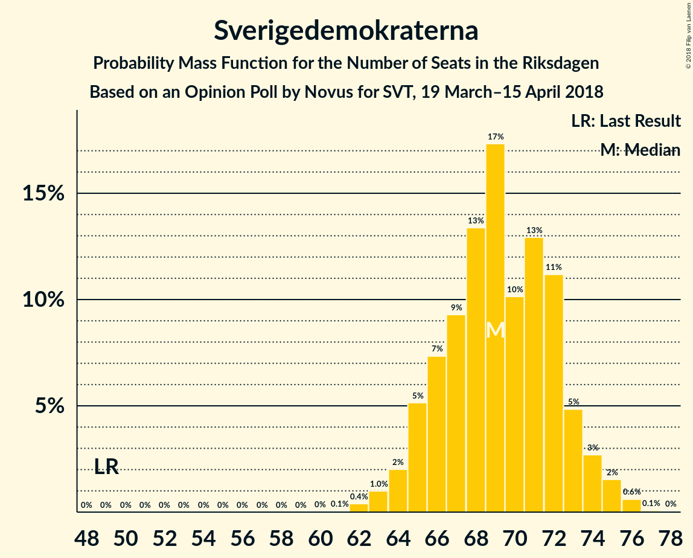
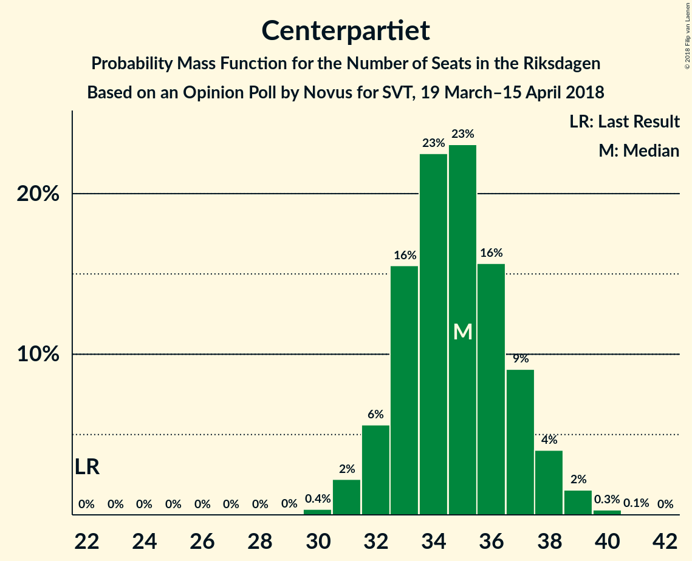
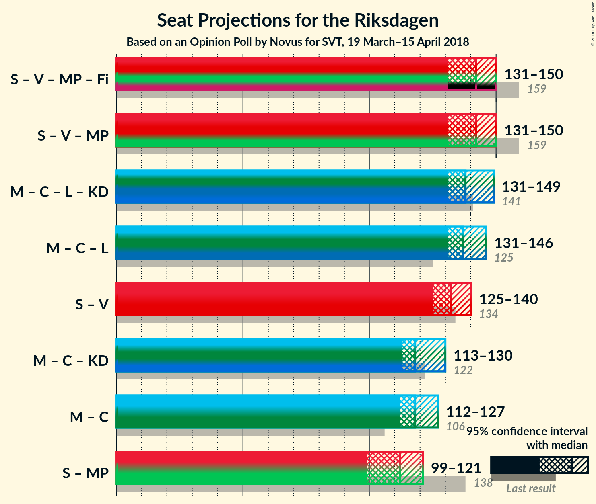

# Opinion Poll by Novus for SVT, 19 March–15 April 2018

<a href="#voting-intentions">Voting Intentions</a> | <a href="#seats">Seats</a> | <a href="#coalitions">Coalitions</a> | <a href="#technical-information">Technical Information</a>

## Voting Intentions

### Confidence Intervals

| Party | Last Result | Poll Result | 80% Confidence Interval | 90% Confidence Interval | 95% Confidence Interval | 99% Confidence Interval |
|:-----:|:-----------:|:-----------:|:-----------------------:|:-----------------------:|:-----------------------:|:-----------------------:|
| Sveriges socialdemokratiska arbetareparti | 31.0% | 26.9% | 26.1–27.7% |25.9–28.0% |25.7–28.2% |25.3–28.5% |
| Moderata samlingspartiet | 23.3% | 22.1% | 21.4–22.9% |21.1–23.1% |21.0–23.3% |20.6–23.7% |
| Sverigedemokraterna | 12.9% | 18.2% | 17.5–18.9% |17.3–19.1% |17.1–19.3% |16.8–19.7% |
| Centerpartiet | 6.1% | 9.2% | 8.7–9.8% |8.5–9.9% |8.4–10.0% |8.2–10.3% |
| Vänsterpartiet | 5.7% | 8.1% | 7.6–8.6% |7.5–8.8% |7.4–8.9% |7.1–9.2% |
| Liberalerna | 5.4% | 5.0% | 4.6–5.4% |4.5–5.5% |4.4–5.6% |4.2–5.9% |
| Miljöpartiet de gröna | 6.9% | 4.0% | 3.7–4.4% |3.6–4.5% |3.5–4.6% |3.3–4.8% |
| Kristdemokraterna | 4.6% | 3.5% | 3.2–3.9% |3.1–4.0% |3.0–4.1% |2.9–4.2% |

*Note:* The poll result column reflects the actual value used in the calculations. Published results may vary slightly, and in addition be rounded to fewer digits.

## Seats

### Confidence Intervals

| Party | Last Result | Median | 80% Confidence Interval | 90% Confidence Interval | 95% Confidence Interval | 99% Confidence Interval |
|:-----:|:-----------:|:------:|:-----------------------:|:-----------------------:|:-----------------------:|:-----------------------:|
| <a href="#sveriges-socialdemokratiska-arbetareparti">Sveriges socialdemokratiska arbetareparti</a> | 113 | 102 | 98–107 |97–108 |96–109 |93–111 |
| <a href="#moderata-samlingspartiet">Moderata samlingspartiet</a> | 84 | 84 | 80–88 |79–89 |78–90 |77–92 |
| <a href="#sverigedemokraterna">Sverigedemokraterna</a> | 49 | 69 | 66–72 |65–73 |64–74 |63–76 |
| <a href="#centerpartiet">Centerpartiet</a> | 22 | 35 | 33–37 |32–38 |31–38 |31–39 |
| <a href="#vänsterpartiet">Vänsterpartiet</a> | 21 | 30 | 28–34 |28–34 |27–35 |27–36 |
| <a href="#liberalerna">Liberalerna</a> | 19 | 19 | 17–21 |17–21 |16–22 |16–23 |
| <a href="#miljöpartiet-de-gröna">Miljöpartiet de gröna</a> | 25 | 15 | 0–17 |0–17 |0–17 |0–18 |
| <a href="#kristdemokraterna">Kristdemokraterna</a> | 16 | 0 | 0 |0–15 |0–15 |0–15 |

### Sveriges socialdemokratiska arbetareparti

*For a full overview of the results for this party, see the [Sveriges socialdemokratiska arbetareparti](party-sverigessocialdemokratiskaarbetareparti.html) page.*

| Number of Seats | Probability | Accumulated | Special Marks |
|:---------------:|:-----------:|:-----------:|:-------------:|
| 91 | 0.1% | 100% |  |
| 92 | 0.2% | 99.9% |  |
| 93 | 0.3% | 99.7% |  |
| 94 | 0.8% | 99.5% |  |
| 95 | 1.1% | 98.7% |  |
| 96 | 2% | 98% |  |
| 97 | 4% | 95% |  |
| 98 | 5% | 91% |  |
| 99 | 9% | 86% |  |
| 100 | 10% | 78% |  |
| 101 | 9% | 68% |  |
| 102 | 13% | 59% | Median |
| 103 | 10% | 46% |  |
| 104 | 9% | 36% |  |
| 105 | 9% | 27% |  |
| 106 | 6% | 18% |  |
| 107 | 5% | 12% |  |
| 108 | 2% | 7% |  |
| 109 | 3% | 5% |  |
| 110 | 1.0% | 2% |  |
| 111 | 0.3% | 0.5% |  |
| 112 | 0.2% | 0.3% |  |
| 113 | 0% | 0.1% | Last Result |
| 114 | 0% | 0% |  |

### Moderata samlingspartiet

*For a full overview of the results for this party, see the [Moderata samlingspartiet](party-moderatasamlingspartiet.html) page.*

| Number of Seats | Probability | Accumulated | Special Marks |
|:---------------:|:-----------:|:-----------:|:-------------:|
| 75 | 0.1% | 100% |  |
| 76 | 0.3% | 99.9% |  |
| 77 | 0.7% | 99.6% |  |
| 78 | 1.5% | 98.9% |  |
| 79 | 4% | 97% |  |
| 80 | 6% | 93% |  |
| 81 | 11% | 88% |  |
| 82 | 11% | 77% |  |
| 83 | 16% | 66% |  |
| 84 | 12% | 50% | Last Result, Median |
| 85 | 11% | 38% |  |
| 86 | 7% | 27% |  |
| 87 | 7% | 20% |  |
| 88 | 4% | 12% |  |
| 89 | 5% | 8% |  |
| 90 | 2% | 3% |  |
| 91 | 1.3% | 2% |  |
| 92 | 0.4% | 0.6% |  |
| 93 | 0.1% | 0.2% |  |
| 94 | 0.1% | 0.1% |  |
| 95 | 0% | 0% |  |

### Sverigedemokraterna

*For a full overview of the results for this party, see the [Sverigedemokraterna](party-sverigedemokraterna.html) page.*

| Number of Seats | Probability | Accumulated | Special Marks |
|:---------------:|:-----------:|:-----------:|:-------------:|
| 49 | 0% | 100% | Last Result |
| 50 | 0% | 100% |  |
| 51 | 0% | 100% |  |
| 52 | 0% | 100% |  |
| 53 | 0% | 100% |  |
| 54 | 0% | 100% |  |
| 55 | 0% | 100% |  |
| 56 | 0% | 100% |  |
| 57 | 0% | 100% |  |
| 58 | 0% | 100% |  |
| 59 | 0% | 100% |  |
| 60 | 0% | 100% |  |
| 61 | 0.1% | 100% |  |
| 62 | 0.4% | 99.9% |  |
| 63 | 1.0% | 99.5% |  |
| 64 | 2% | 98.5% |  |
| 65 | 5% | 97% |  |
| 66 | 7% | 91% |  |
| 67 | 9% | 84% |  |
| 68 | 13% | 75% |  |
| 69 | 17% | 61% | Median |
| 70 | 10% | 44% |  |
| 71 | 13% | 34% |  |
| 72 | 11% | 21% |  |
| 73 | 5% | 10% |  |
| 74 | 3% | 5% |  |
| 75 | 2% | 2% |  |
| 76 | 0.6% | 0.7% |  |
| 77 | 0.1% | 0.1% |  |
| 78 | 0% | 0% |  |

### Centerpartiet

*For a full overview of the results for this party, see the [Centerpartiet](party-centerpartiet.html) page.*

| Number of Seats | Probability | Accumulated | Special Marks |
|:---------------:|:-----------:|:-----------:|:-------------:|
| 22 | 0% | 100% | Last Result |
| 23 | 0% | 100% |  |
| 24 | 0% | 100% |  |
| 25 | 0% | 100% |  |
| 26 | 0% | 100% |  |
| 27 | 0% | 100% |  |
| 28 | 0% | 100% |  |
| 29 | 0% | 100% |  |
| 30 | 0.4% | 100% |  |
| 31 | 2% | 99.6% |  |
| 32 | 6% | 97% |  |
| 33 | 16% | 92% |  |
| 34 | 23% | 76% |  |
| 35 | 23% | 54% | Median |
| 36 | 16% | 31% |  |
| 37 | 9% | 15% |  |
| 38 | 4% | 6% |  |
| 39 | 2% | 2% |  |
| 40 | 0.3% | 0.4% |  |
| 41 | 0.1% | 0.1% |  |
| 42 | 0% | 0% |  |

### Vänsterpartiet

*For a full overview of the results for this party, see the [Vänsterpartiet](party-vänsterpartiet.html) page.*

| Number of Seats | Probability | Accumulated | Special Marks |
|:---------------:|:-----------:|:-----------:|:-------------:|
| 21 | 0% | 100% | Last Result |
| 22 | 0% | 100% |  |
| 23 | 0% | 100% |  |
| 24 | 0% | 100% |  |
| 25 | 0% | 100% |  |
| 26 | 0.2% | 100% |  |
| 27 | 3% | 99.8% |  |
| 28 | 12% | 97% |  |
| 29 | 23% | 85% |  |
| 30 | 20% | 62% | Median |
| 31 | 12% | 41% |  |
| 32 | 7% | 30% |  |
| 33 | 10% | 23% |  |
| 34 | 9% | 13% |  |
| 35 | 3% | 4% |  |
| 36 | 0.8% | 0.8% |  |
| 37 | 0% | 0% |  |

### Liberalerna

*For a full overview of the results for this party, see the [Liberalerna](party-liberalerna.html) page.*

| Number of Seats | Probability | Accumulated | Special Marks |
|:---------------:|:-----------:|:-----------:|:-------------:|
| 15 | 0.2% | 100% |  |
| 16 | 4% | 99.8% |  |
| 17 | 14% | 96% |  |
| 18 | 19% | 81% |  |
| 19 | 28% | 62% | Last Result, Median |
| 20 | 19% | 34% |  |
| 21 | 11% | 15% |  |
| 22 | 4% | 5% |  |
| 23 | 0.5% | 0.6% |  |
| 24 | 0.1% | 0.1% |  |
| 25 | 0% | 0% |  |

### Miljöpartiet de gröna

*For a full overview of the results for this party, see the [Miljöpartiet de gröna](party-miljöpartietdegröna.html) page.*

| Number of Seats | Probability | Accumulated | Special Marks |
|:---------------:|:-----------:|:-----------:|:-------------:|
| 0 | 46% | 100% |  |
| 1 | 0% | 54% |  |
| 2 | 0% | 54% |  |
| 3 | 0% | 54% |  |
| 4 | 0% | 54% |  |
| 5 | 0% | 54% |  |
| 6 | 0% | 54% |  |
| 7 | 0% | 54% |  |
| 8 | 0% | 54% |  |
| 9 | 0% | 54% |  |
| 10 | 0% | 54% |  |
| 11 | 0% | 54% |  |
| 12 | 0% | 54% |  |
| 13 | 0% | 54% |  |
| 14 | 0.3% | 54% |  |
| 15 | 16% | 53% | Median |
| 16 | 24% | 37% |  |
| 17 | 12% | 13% |  |
| 18 | 2% | 2% |  |
| 19 | 0.1% | 0.1% |  |
| 20 | 0% | 0% |  |
| 21 | 0% | 0% |  |
| 22 | 0% | 0% |  |
| 23 | 0% | 0% |  |
| 24 | 0% | 0% |  |
| 25 | 0% | 0% | Last Result |

### Kristdemokraterna

*For a full overview of the results for this party, see the [Kristdemokraterna](party-kristdemokraterna.html) page.*

| Number of Seats | Probability | Accumulated | Special Marks |
|:---------------:|:-----------:|:-----------:|:-------------:|
| 0 | 94% | 100% | Median |
| 1 | 0% | 6% |  |
| 2 | 0% | 6% |  |
| 3 | 0% | 6% |  |
| 4 | 0% | 6% |  |
| 5 | 0% | 6% |  |
| 6 | 0% | 6% |  |
| 7 | 0% | 6% |  |
| 8 | 0% | 6% |  |
| 9 | 0% | 6% |  |
| 10 | 0% | 6% |  |
| 11 | 0% | 6% |  |
| 12 | 0% | 6% |  |
| 13 | 0% | 6% |  |
| 14 | 0.8% | 6% |  |
| 15 | 5% | 5% |  |
| 16 | 0.4% | 0.5% | Last Result |
| 17 | 0.1% | 0.1% |  |
| 18 | 0% | 0% |  |

## Coalitions

### Confidence Intervals

| Coalition | Last Result | Median | Majority? | 80% Confidence Interval | 90% Confidence Interval | 95% Confidence Interval | 99% Confidence Interval |
|:---------:|:-----------:|:------:|:---------:|:-----------------------:|:-----------------------:|:-----------------------:|:-----------------------:|
| Sveriges socialdemokratiska arbetareparti – Vänsterpartiet – Miljöpartiet de gröna | 159 | 142 | 0% | 134–148 | 132–149 | 131–150 | 128–152 |
| Moderata samlingspartiet – Centerpartiet – Liberalerna – Kristdemokraterna | 141 | 138 | 0% | 133–145 | 132–147 | 131–149 | 130–151 |
| Moderata samlingspartiet – Centerpartiet – Liberalerna | 125 | 137 | 0% | 133–143 | 132–145 | 131–146 | 128–148 |
| Sveriges socialdemokratiska arbetareparti – Vänsterpartiet | 134 | 132 | 0% | 127–139 | 126–140 | 125–140 | 123–142 |
| Moderata samlingspartiet – Centerpartiet – Kristdemokraterna | 122 | 118 | 0% | 115–126 | 114–128 | 113–130 | 112–133 |
| Moderata samlingspartiet – Centerpartiet | 106 | 118 | 0% | 114–124 | 113–126 | 112–127 | 110–128 |
| Sveriges socialdemokratiska arbetareparti – Miljöpartiet de gröna | 138 | 112 | 0% | 102–119 | 101–120 | 99–121 | 97–122 |

