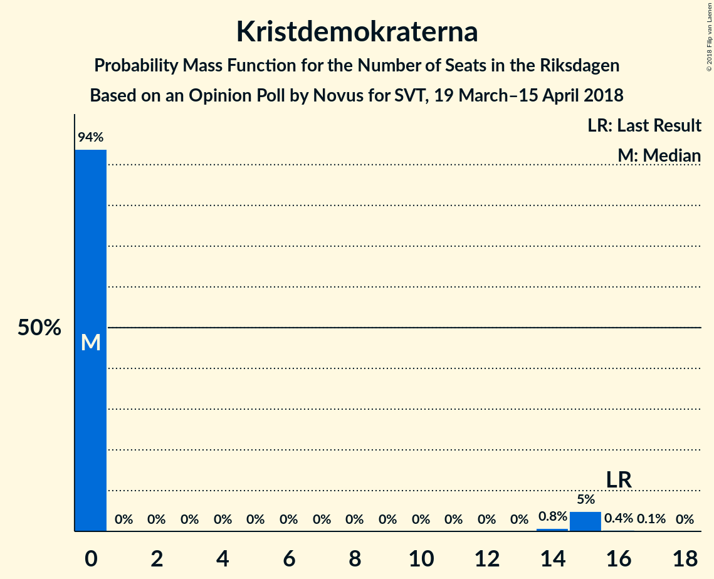

# Opinion Poll by Novus for SVT, 19 March–15 April 2018

<a href="#voting-intentions">Voting Intentions</a> | <a href="#seats">Seats</a> | <a href="#coalitions">Coalitions</a> | <a href="#technical-information">Technical Information</a>

## Voting Intentions

### Confidence Intervals

| Party | Last Result | Poll Result | 80% Confidence Interval | 90% Confidence Interval | 95% Confidence Interval | 99% Confidence Interval |
|:-----:|:-----------:|:-----------:|:-----------------------:|:-----------------------:|:-----------------------:|:-----------------------:|
| Sveriges socialdemokratiska arbetareparti | 31.0% | 26.9% | 26.1–27.7% |25.9–28.0% |25.7–28.2% |25.3–28.5% |
| Moderata samlingspartiet | 23.3% | 22.1% | 21.4–22.9% |21.1–23.1% |21.0–23.3% |20.6–23.7% |
| Sverigedemokraterna | 12.9% | 18.2% | 17.5–18.9% |17.3–19.1% |17.1–19.3% |16.8–19.7% |
| Centerpartiet | 6.1% | 9.2% | 8.7–9.8% |8.5–9.9% |8.4–10.0% |8.2–10.3% |
| Vänsterpartiet | 5.7% | 8.1% | 7.6–8.6% |7.5–8.8% |7.4–8.9% |7.1–9.2% |
| Liberalerna | 5.4% | 5.0% | 4.6–5.4% |4.5–5.5% |4.4–5.6% |4.2–5.9% |
| Miljöpartiet de gröna | 6.9% | 4.0% | 3.7–4.4% |3.6–4.5% |3.5–4.6% |3.3–4.8% |
| Kristdemokraterna | 4.6% | 3.5% | 3.2–3.9% |3.1–4.0% |3.0–4.1% |2.9–4.2% |

*Note:* The poll result column reflects the actual value used in the calculations. Published results may vary slightly, and in addition be rounded to fewer digits.

## Seats

### Confidence Intervals

| Party | Last Result | Median | 80% Confidence Interval | 90% Confidence Interval | 95% Confidence Interval | 99% Confidence Interval |
|:-----:|:-----------:|:------:|:-----------------------:|:-----------------------:|:-----------------------:|:-----------------------:|
| <a href="#sveriges-socialdemokratiska-arbetareparti">Sveriges socialdemokratiska arbetareparti</a> | 113 | 102 | 98–107 |96–108 |94–109 |93–111 |
| <a href="#moderata-samlingspartiet">Moderata samlingspartiet</a> | 84 | 84 | 80–89 |79–89 |78–89 |77–91 |
| <a href="#sverigedemokraterna">Sverigedemokraterna</a> | 49 | 69 | 66–72 |65–73 |64–75 |62–76 |
| <a href="#centerpartiet">Centerpartiet</a> | 22 | 35 | 32–37 |32–38 |31–38 |30–39 |
| <a href="#vänsterpartiet">Vänsterpartiet</a> | 21 | 30 | 29–33 |28–34 |28–34 |27–35 |
| <a href="#liberalerna">Liberalerna</a> | 19 | 19 | 17–21 |16–21 |16–21 |16–22 |
| <a href="#miljöpartiet-de-gröna">Miljöpartiet de gröna</a> | 25 | 0 | 0–16 |0–16 |0–17 |0–18 |
| <a href="#kristdemokraterna">Kristdemokraterna</a> | 16 | 0 | 0 |0–15 |0–15 |0–15 |

### Sveriges socialdemokratiska arbetareparti

*For a full overview of the results for this party, see the [Sveriges socialdemokratiska arbetareparti](party-sverigessocialdemokratiskaarbetareparti.html) page.*

| Number of Seats | Probability | Accumulated | Special Marks |
|:---------------:|:-----------:|:-----------:|:-------------:|
| 91 | 0% | 100% |  |
| 92 | 0.1% | 99.9% |  |
| 93 | 0.7% | 99.9% |  |
| 94 | 2% | 99.2% |  |
| 95 | 0.6% | 97% |  |
| 96 | 3% | 97% |  |
| 97 | 3% | 93% |  |
| 98 | 3% | 91% |  |
| 99 | 13% | 87% |  |
| 100 | 8% | 74% |  |
| 101 | 7% | 66% |  |
| 102 | 9% | 59% | Median |
| 103 | 7% | 50% |  |
| 104 | 6% | 43% |  |
| 105 | 19% | 37% |  |
| 106 | 8% | 18% |  |
| 107 | 0.7% | 10% |  |
| 108 | 5% | 10% |  |
| 109 | 3% | 5% |  |
| 110 | 0.2% | 1.4% |  |
| 111 | 1.1% | 1.2% |  |
| 112 | 0.1% | 0.2% |  |
| 113 | 0% | 0.1% | Last Result |
| 114 | 0% | 0% |  |

### Moderata samlingspartiet

*For a full overview of the results for this party, see the [Moderata samlingspartiet](party-moderatasamlingspartiet.html) page.*

| Number of Seats | Probability | Accumulated | Special Marks |
|:---------------:|:-----------:|:-----------:|:-------------:|
| 75 | 0% | 100% |  |
| 76 | 0.3% | 99.9% |  |
| 77 | 0.2% | 99.6% |  |
| 78 | 2% | 99.4% |  |
| 79 | 5% | 97% |  |
| 80 | 11% | 92% |  |
| 81 | 7% | 81% |  |
| 82 | 8% | 75% |  |
| 83 | 12% | 67% |  |
| 84 | 13% | 55% | Last Result, Median |
| 85 | 4% | 42% |  |
| 86 | 6% | 38% |  |
| 87 | 9% | 32% |  |
| 88 | 5% | 22% |  |
| 89 | 16% | 18% |  |
| 90 | 1.2% | 2% |  |
| 91 | 0.7% | 1.0% |  |
| 92 | 0.2% | 0.4% |  |
| 93 | 0.1% | 0.2% |  |
| 94 | 0% | 0.1% |  |
| 95 | 0% | 0% |  |

### Sverigedemokraterna

*For a full overview of the results for this party, see the [Sverigedemokraterna](party-sverigedemokraterna.html) page.*

| Number of Seats | Probability | Accumulated | Special Marks |
|:---------------:|:-----------:|:-----------:|:-------------:|
| 49 | 0% | 100% | Last Result |
| 50 | 0% | 100% |  |
| 51 | 0% | 100% |  |
| 52 | 0% | 100% |  |
| 53 | 0% | 100% |  |
| 54 | 0% | 100% |  |
| 55 | 0% | 100% |  |
| 56 | 0% | 100% |  |
| 57 | 0% | 100% |  |
| 58 | 0% | 100% |  |
| 59 | 0% | 100% |  |
| 60 | 0% | 100% |  |
| 61 | 0% | 100% |  |
| 62 | 0.6% | 99.9% |  |
| 63 | 1.2% | 99.3% |  |
| 64 | 3% | 98% |  |
| 65 | 2% | 95% |  |
| 66 | 6% | 94% |  |
| 67 | 9% | 88% |  |
| 68 | 14% | 79% |  |
| 69 | 28% | 65% | Median |
| 70 | 14% | 36% |  |
| 71 | 5% | 23% |  |
| 72 | 9% | 17% |  |
| 73 | 4% | 8% |  |
| 74 | 0.8% | 4% |  |
| 75 | 3% | 4% |  |
| 76 | 0.9% | 1.0% |  |
| 77 | 0.1% | 0.1% |  |
| 78 | 0% | 0% |  |

### Centerpartiet

*For a full overview of the results for this party, see the [Centerpartiet](party-centerpartiet.html) page.*

| Number of Seats | Probability | Accumulated | Special Marks |
|:---------------:|:-----------:|:-----------:|:-------------:|
| 22 | 0% | 100% | Last Result |
| 23 | 0% | 100% |  |
| 24 | 0% | 100% |  |
| 25 | 0% | 100% |  |
| 26 | 0% | 100% |  |
| 27 | 0% | 100% |  |
| 28 | 0% | 100% |  |
| 29 | 0.1% | 100% |  |
| 30 | 0.4% | 99.9% |  |
| 31 | 3% | 99.5% |  |
| 32 | 10% | 96% |  |
| 33 | 15% | 87% |  |
| 34 | 19% | 72% |  |
| 35 | 14% | 52% | Median |
| 36 | 19% | 39% |  |
| 37 | 15% | 20% |  |
| 38 | 4% | 5% |  |
| 39 | 1.0% | 1.4% |  |
| 40 | 0.3% | 0.4% |  |
| 41 | 0.1% | 0.1% |  |
| 42 | 0% | 0% |  |

### Vänsterpartiet

*For a full overview of the results for this party, see the [Vänsterpartiet](party-vänsterpartiet.html) page.*

| Number of Seats | Probability | Accumulated | Special Marks |
|:---------------:|:-----------:|:-----------:|:-------------:|
| 21 | 0% | 100% | Last Result |
| 22 | 0% | 100% |  |
| 23 | 0% | 100% |  |
| 24 | 0% | 100% |  |
| 25 | 0% | 100% |  |
| 26 | 0.1% | 100% |  |
| 27 | 2% | 99.9% |  |
| 28 | 7% | 98% |  |
| 29 | 26% | 90% |  |
| 30 | 26% | 65% | Median |
| 31 | 16% | 39% |  |
| 32 | 7% | 22% |  |
| 33 | 10% | 16% |  |
| 34 | 4% | 6% |  |
| 35 | 2% | 2% |  |
| 36 | 0.2% | 0.2% |  |
| 37 | 0% | 0% |  |

### Liberalerna

*For a full overview of the results for this party, see the [Liberalerna](party-liberalerna.html) page.*

| Number of Seats | Probability | Accumulated | Special Marks |
|:---------------:|:-----------:|:-----------:|:-------------:|
| 15 | 0.1% | 100% |  |
| 16 | 5% | 99.9% |  |
| 17 | 14% | 95% |  |
| 18 | 12% | 81% |  |
| 19 | 25% | 69% | Last Result, Median |
| 20 | 34% | 44% |  |
| 21 | 8% | 10% |  |
| 22 | 2% | 2% |  |
| 23 | 0.4% | 0.5% |  |
| 24 | 0.1% | 0.1% |  |
| 25 | 0% | 0% |  |

### Miljöpartiet de gröna

*For a full overview of the results for this party, see the [Miljöpartiet de gröna](party-miljöpartietdegröna.html) page.*

| Number of Seats | Probability | Accumulated | Special Marks |
|:---------------:|:-----------:|:-----------:|:-------------:|
| 0 | 52% | 100% | Median |
| 1 | 0% | 48% |  |
| 2 | 0% | 48% |  |
| 3 | 0% | 48% |  |
| 4 | 0% | 48% |  |
| 5 | 0% | 48% |  |
| 6 | 0% | 48% |  |
| 7 | 0% | 48% |  |
| 8 | 0% | 48% |  |
| 9 | 0% | 48% |  |
| 10 | 0% | 48% |  |
| 11 | 0% | 48% |  |
| 12 | 0% | 48% |  |
| 13 | 0% | 48% |  |
| 14 | 0% | 48% |  |
| 15 | 13% | 48% |  |
| 16 | 30% | 35% |  |
| 17 | 3% | 5% |  |
| 18 | 2% | 2% |  |
| 19 | 0% | 0% |  |
| 20 | 0% | 0% |  |
| 21 | 0% | 0% |  |
| 22 | 0% | 0% |  |
| 23 | 0% | 0% |  |
| 24 | 0% | 0% |  |
| 25 | 0% | 0% | Last Result |

### Kristdemokraterna

*For a full overview of the results for this party, see the [Kristdemokraterna](party-kristdemokraterna.html) page.*

| Number of Seats | Probability | Accumulated | Special Marks |
|:---------------:|:-----------:|:-----------:|:-------------:|
| 0 | 90% | 100% | Median |
| 1 | 0% | 10% |  |
| 2 | 0% | 10% |  |
| 3 | 0% | 10% |  |
| 4 | 0% | 10% |  |
| 5 | 0% | 10% |  |
| 6 | 0% | 10% |  |
| 7 | 0% | 10% |  |
| 8 | 0% | 10% |  |
| 9 | 0% | 10% |  |
| 10 | 0% | 10% |  |
| 11 | 0% | 10% |  |
| 12 | 0% | 10% |  |
| 13 | 0% | 10% |  |
| 14 | 0.2% | 10% |  |
| 15 | 9% | 10% |  |
| 16 | 0.2% | 0.3% | Last Result |
| 17 | 0.1% | 0.1% |  |
| 18 | 0% | 0% |  |

## Coalitions

### Confidence Intervals

| Coalition | Last Result | Median | Majority? | 80% Confidence Interval | 90% Confidence Interval | 95% Confidence Interval | 99% Confidence Interval |
|:---------:|:-----------:|:------:|:---------:|:-----------------------:|:-----------------------:|:-----------------------:|:-----------------------:|
| Sveriges socialdemokratiska arbetareparti – Vänsterpartiet – Miljöpartiet de gröna | 159 | 140 | 0% | 134–149 | 130–150 | 130–151 | 129–151 |
| Moderata samlingspartiet – Centerpartiet – Liberalerna – Kristdemokraterna | 141 | 139 | 0% | 133–145 | 132–149 | 131–149 | 130–150 |
| Moderata samlingspartiet – Centerpartiet – Liberalerna | 125 | 136 | 0% | 132–145 | 131–145 | 130–146 | 128–148 |
| Sveriges socialdemokratiska arbetareparti – Vänsterpartiet | 134 | 134 | 0% | 128–139 | 127–140 | 125–141 | 123–142 |
| Moderata samlingspartiet – Centerpartiet – Kristdemokraterna | 122 | 119 | 0% | 114–126 | 114–129 | 113–129 | 111–132 |
| Moderata samlingspartiet – Centerpartiet | 106 | 118 | 0% | 114–125 | 113–126 | 111–126 | 110–128 |

### Sveriges socialdemokratiska arbetareparti – Vänsterpartiet – Miljöpartiet de gröna

| Number of Seats | Probability | Accumulated | Special Marks |
|:---------------:|:-----------:|:-----------:|:-------------:|
| 127 | 0% | 100% |  |
| 128 | 0.2% | 99.9% |  |
| 129 | 0.5% | 99.7% |  |
| 130 | 5% | 99.2% |  |
| 131 | 1.0% | 94% |  |
| 132 | 0.2% | 93% | Median |
| 133 | 0.9% | 93% |  |
| 134 | 9% | 92% |  |
| 135 | 13% | 83% |  |
| 136 | 7% | 70% |  |
| 137 | 2% | 63% |  |
| 138 | 2% | 60% |  |
| 139 | 5% | 58% |  |
| 140 | 6% | 54% |  |
| 141 | 2% | 48% |  |
| 142 | 2% | 46% |  |
| 143 | 2% | 44% |  |
| 144 | 13% | 42% |  |
| 145 | 6% | 30% |  |
| 146 | 6% | 23% |  |
| 147 | 3% | 17% |  |
| 148 | 3% | 14% |  |
| 149 | 4% | 11% |  |
| 150 | 5% | 7% |  |
| 151 | 2% | 3% |  |
| 152 | 0.2% | 0.3% |  |
| 153 | 0% | 0.1% |  |
| 154 | 0% | 0.1% |  |
| 155 | 0% | 0% |  |
| 156 | 0% | 0% |  |
| 157 | 0% | 0% |  |
| 158 | 0% | 0% |  |
| 159 | 0% | 0% | Last Result |

### Moderata samlingspartiet – Centerpartiet – Liberalerna – Kristdemokraterna

| Number of Seats | Probability | Accumulated | Special Marks |
|:---------------:|:-----------:|:-----------:|:-------------:|
| 127 | 0% | 100% |  |
| 128 | 0% | 99.9% |  |
| 129 | 0.1% | 99.9% |  |
| 130 | 2% | 99.8% |  |
| 131 | 1.1% | 98% |  |
| 132 | 6% | 97% |  |
| 133 | 9% | 91% |  |
| 134 | 5% | 82% |  |
| 135 | 5% | 78% |  |
| 136 | 16% | 72% |  |
| 137 | 2% | 57% |  |
| 138 | 1.2% | 54% | Median |
| 139 | 7% | 53% |  |
| 140 | 2% | 47% |  |
| 141 | 4% | 45% | Last Result |
| 142 | 4% | 41% |  |
| 143 | 2% | 37% |  |
| 144 | 6% | 35% |  |
| 145 | 19% | 29% |  |
| 146 | 2% | 9% |  |
| 147 | 1.0% | 8% |  |
| 148 | 1.2% | 7% |  |
| 149 | 5% | 6% |  |
| 150 | 0.1% | 0.6% |  |
| 151 | 0.3% | 0.5% |  |
| 152 | 0% | 0.2% |  |
| 153 | 0% | 0.1% |  |
| 154 | 0% | 0.1% |  |
| 155 | 0.1% | 0.1% |  |
| 156 | 0% | 0% |  |

### Moderata samlingspartiet – Centerpartiet – Liberalerna

| Number of Seats | Probability | Accumulated | Special Marks |
|:---------------:|:-----------:|:-----------:|:-------------:|
| 125 | 0.1% | 100% | Last Result |
| 126 | 0% | 99.9% |  |
| 127 | 0.1% | 99.9% |  |
| 128 | 1.0% | 99.8% |  |
| 129 | 0.1% | 98.9% |  |
| 130 | 4% | 98.7% |  |
| 131 | 2% | 95% |  |
| 132 | 6% | 93% |  |
| 133 | 9% | 87% |  |
| 134 | 10% | 78% |  |
| 135 | 5% | 68% |  |
| 136 | 16% | 63% |  |
| 137 | 2% | 47% |  |
| 138 | 1.3% | 44% | Median |
| 139 | 7% | 43% |  |
| 140 | 2% | 37% |  |
| 141 | 4% | 35% |  |
| 142 | 4% | 31% |  |
| 143 | 2% | 27% |  |
| 144 | 6% | 26% |  |
| 145 | 17% | 20% |  |
| 146 | 0.7% | 3% |  |
| 147 | 0.6% | 2% |  |
| 148 | 1.1% | 1.2% |  |
| 149 | 0.1% | 0.1% |  |
| 150 | 0% | 0% |  |

### Sveriges socialdemokratiska arbetareparti – Vänsterpartiet

| Number of Seats | Probability | Accumulated | Special Marks |
|:---------------:|:-----------:|:-----------:|:-------------:|
| 121 | 0% | 100% |  |
| 122 | 0.1% | 99.9% |  |
| 123 | 0.7% | 99.9% |  |
| 124 | 0.6% | 99.1% |  |
| 125 | 2% | 98.5% |  |
| 126 | 0.4% | 97% |  |
| 127 | 3% | 96% |  |
| 128 | 8% | 93% |  |
| 129 | 11% | 85% |  |
| 130 | 12% | 74% |  |
| 131 | 4% | 62% |  |
| 132 | 3% | 58% | Median |
| 133 | 2% | 55% |  |
| 134 | 16% | 53% | Last Result |
| 135 | 15% | 37% |  |
| 136 | 7% | 22% |  |
| 137 | 2% | 14% |  |
| 138 | 2% | 12% |  |
| 139 | 4% | 10% |  |
| 140 | 3% | 6% |  |
| 141 | 2% | 3% |  |
| 142 | 1.0% | 1.1% |  |
| 143 | 0.1% | 0.1% |  |
| 144 | 0% | 0.1% |  |
| 145 | 0% | 0.1% |  |
| 146 | 0% | 0% |  |

### Moderata samlingspartiet – Centerpartiet – Kristdemokraterna

| Number of Seats | Probability | Accumulated | Special Marks |
|:---------------:|:-----------:|:-----------:|:-------------:|
| 110 | 0.1% | 100% |  |
| 111 | 0.7% | 99.9% |  |
| 112 | 0.2% | 99.1% |  |
| 113 | 3% | 98.9% |  |
| 114 | 7% | 96% |  |
| 115 | 6% | 89% |  |
| 116 | 11% | 83% |  |
| 117 | 10% | 72% |  |
| 118 | 8% | 62% |  |
| 119 | 7% | 54% | Median |
| 120 | 1.3% | 48% |  |
| 121 | 2% | 46% |  |
| 122 | 3% | 44% | Last Result |
| 123 | 4% | 41% |  |
| 124 | 7% | 37% |  |
| 125 | 11% | 30% |  |
| 126 | 9% | 18% |  |
| 127 | 3% | 10% |  |
| 128 | 0.8% | 7% |  |
| 129 | 5% | 6% |  |
| 130 | 0.1% | 0.9% |  |
| 131 | 0.1% | 0.8% |  |
| 132 | 0.3% | 0.7% |  |
| 133 | 0.3% | 0.4% |  |
| 134 | 0% | 0.1% |  |
| 135 | 0% | 0.1% |  |
| 136 | 0% | 0.1% |  |
| 137 | 0% | 0.1% |  |
| 138 | 0% | 0% |  |

### Moderata samlingspartiet – Centerpartiet

| Number of Seats | Probability | Accumulated | Special Marks |
|:---------------:|:-----------:|:-----------:|:-------------:|
| 106 | 0% | 100% | Last Result |
| 107 | 0% | 100% |  |
| 108 | 0% | 100% |  |
| 109 | 0.3% | 99.9% |  |
| 110 | 0.4% | 99.6% |  |
| 111 | 3% | 99.2% |  |
| 112 | 1.4% | 96% |  |
| 113 | 4% | 95% |  |
| 114 | 12% | 91% |  |
| 115 | 6% | 80% |  |
| 116 | 11% | 74% |  |
| 117 | 10% | 63% |  |
| 118 | 8% | 53% |  |
| 119 | 7% | 44% | Median |
| 120 | 1.3% | 38% |  |
| 121 | 2% | 36% |  |
| 122 | 3% | 34% |  |
| 123 | 4% | 31% |  |
| 124 | 7% | 27% |  |
| 125 | 11% | 20% |  |
| 126 | 7% | 9% |  |
| 127 | 2% | 2% |  |
| 128 | 0.5% | 0.7% |  |
| 129 | 0.2% | 0.2% |  |
| 130 | 0% | 0% |  |

## Technical Information

### Opinion Poll

+ **Polling firm:** Novus
+ **Commissioner(s):** SVT
+ **Fieldwork period:** 19 March–15 April 2018

### Calculations

+ **Sample size:** 4927
+ **Simulations done:** 131,072
+ **Error estimate:** 0.44%

