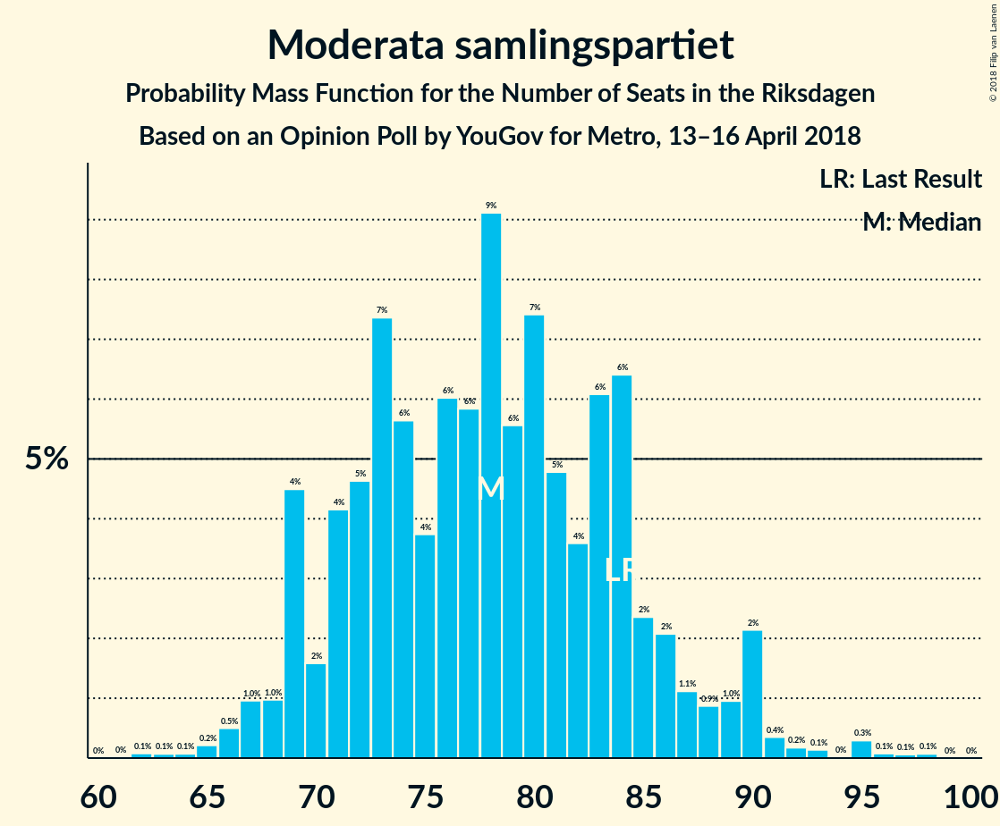
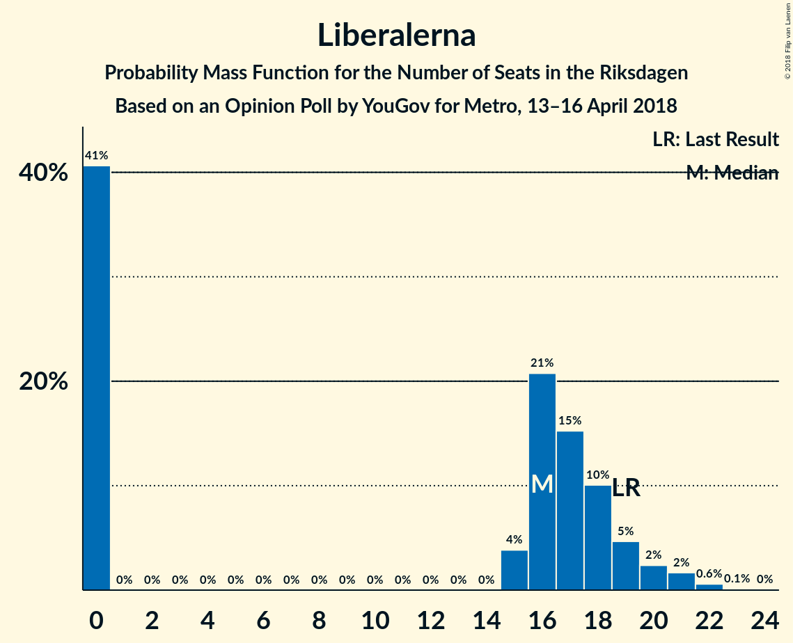

# Opinion Poll by YouGov for Metro, 13–16 April 2018

<a href="#voting-intentions">Voting Intentions</a> | <a href="#seats">Seats</a> | <a href="#coalitions">Coalitions</a> | <a href="#technical-information">Technical Information</a>

## Voting Intentions

### Confidence Intervals

| Party | Last Result | Poll Result | 80% Confidence Interval | 90% Confidence Interval | 95% Confidence Interval | 99% Confidence Interval |
|:-----:|:-----------:|:-----------:|:-----------------------:|:-----------------------:|:-----------------------:|:-----------------------:|
| Sveriges socialdemokratiska arbetareparti | 31.0% | 23.3% | 22.0–24.7% |21.6–25.1% |21.2–25.5% |20.6–26.2% |
| Sverigedemokraterna | 12.9% | 22.1% | 20.8–23.5% |20.4–23.9% |20.1–24.2% |19.4–24.9% |
| Moderata samlingspartiet | 23.3% | 19.9% | 18.6–21.2% |18.3–21.6% |18.0–21.9% |17.4–22.6% |
| Centerpartiet | 6.1% | 8.9% | 8.0–9.9% |7.8–10.2% |7.5–10.4% |7.1–10.9% |
| Vänsterpartiet | 5.7% | 8.5% | 7.6–9.5% |7.4–9.7% |7.2–10.0% |6.8–10.5% |
| Liberalerna | 5.4% | 4.0% | 3.4–4.7% |3.3–4.9% |3.1–5.1% |2.9–5.5% |
| Miljöpartiet de gröna | 6.9% | 3.9% | 3.3–4.6% |3.2–4.8% |3.0–5.0% |2.8–5.3% |
| Kristdemokraterna | 4.6% | 3.2% | 2.7–3.8% |2.5–4.0% |2.4–4.2% |2.2–4.5% |
| Feministiskt initiativ | 3.1% | 2.6% | 2.1–3.2% |2.0–3.4% |1.9–3.5% |1.7–3.8% |

*Note:* The poll result column reflects the actual value used in the calculations. Published results may vary slightly, and in addition be rounded to fewer digits.

## Seats

### Confidence Intervals

| Party | Last Result | Median | 80% Confidence Interval | 90% Confidence Interval | 95% Confidence Interval | 99% Confidence Interval |
|:-----:|:-----------:|:------:|:-----------------------:|:-----------------------:|:-----------------------:|:-----------------------:|
| <a href="#sveriges-socialdemokratiska-arbetareparti">Sveriges socialdemokratiska arbetareparti</a> | 113 | 94 | 94 |89–94 |89–94 |87–94 |
| <a href="#sverigedemokraterna">Sverigedemokraterna</a> | 49 | 82 | 82 |77–82 |77–82 |77–85 |
| <a href="#moderata-samlingspartiet">Moderata samlingspartiet</a> | 84 | 80 | 80 |66–80 |66–80 |66–80 |
| <a href="#centerpartiet">Centerpartiet</a> | 22 | 36 | 36 |36–37 |36–37 |35–37 |
| <a href="#vänsterpartiet">Vänsterpartiet</a> | 21 | 39 | 39 |31–39 |31–39 |29–39 |
| <a href="#liberalerna">Liberalerna</a> | 19 | 0 | 0 |0–15 |0–15 |0–20 |
| <a href="#miljöpartiet-de-gröna">Miljöpartiet de gröna</a> | 25 | 18 | 18 |17–18 |17–18 |0–18 |
| <a href="#kristdemokraterna">Kristdemokraterna</a> | 16 | 0 | 0 |0 |0 |0 |
| <a href="#feministiskt-initiativ">Feministiskt initiativ</a> | 0 | 0 | 0 |0 |0 |0 |

### Sveriges socialdemokratiska arbetareparti

*For a full overview of the results for this party, see the [Sveriges socialdemokratiska arbetareparti](party-sverigessocialdemokratiskaarbetareparti.html) page.*

| Number of Seats | Probability | Accumulated | Special Marks |
|:---------------:|:-----------:|:-----------:|:-------------:|
| 87 | 1.4% | 100% |  |
| 88 | 0% | 98.6% |  |
| 89 | 6% | 98.5% |  |
| 90 | 0% | 92% |  |
| 91 | 0% | 92% |  |
| 92 | 0% | 92% |  |
| 93 | 0% | 92% |  |
| 94 | 92% | 92% | Median |
| 95 | 0% | 0% |  |
| 96 | 0% | 0% |  |
| 97 | 0% | 0% |  |
| 98 | 0% | 0% |  |
| 99 | 0% | 0% |  |
| 100 | 0% | 0% |  |
| 101 | 0% | 0% |  |
| 102 | 0% | 0% |  |
| 103 | 0% | 0% |  |
| 104 | 0% | 0% |  |
| 105 | 0% | 0% |  |
| 106 | 0% | 0% |  |
| 107 | 0% | 0% |  |
| 108 | 0% | 0% |  |
| 109 | 0% | 0% |  |
| 110 | 0% | 0% |  |
| 111 | 0% | 0% |  |
| 112 | 0% | 0% |  |
| 113 | 0% | 0% | Last Result |

### Sverigedemokraterna

*For a full overview of the results for this party, see the [Sverigedemokraterna](party-sverigedemokraterna.html) page.*

| Number of Seats | Probability | Accumulated | Special Marks |
|:---------------:|:-----------:|:-----------:|:-------------:|
| 49 | 0% | 100% | Last Result |
| 50 | 0% | 100% |  |
| 51 | 0% | 100% |  |
| 52 | 0% | 100% |  |
| 53 | 0% | 100% |  |
| 54 | 0% | 100% |  |
| 55 | 0% | 100% |  |
| 56 | 0% | 100% |  |
| 57 | 0% | 100% |  |
| 58 | 0% | 100% |  |
| 59 | 0% | 100% |  |
| 60 | 0% | 100% |  |
| 61 | 0% | 100% |  |
| 62 | 0% | 100% |  |
| 63 | 0% | 100% |  |
| 64 | 0% | 100% |  |
| 65 | 0% | 100% |  |
| 66 | 0% | 100% |  |
| 67 | 0% | 100% |  |
| 68 | 0% | 100% |  |
| 69 | 0% | 100% |  |
| 70 | 0% | 100% |  |
| 71 | 0% | 100% |  |
| 72 | 0% | 100% |  |
| 73 | 0% | 100% |  |
| 74 | 0% | 100% |  |
| 75 | 0% | 100% |  |
| 76 | 0% | 100% |  |
| 77 | 6% | 100% |  |
| 78 | 0% | 94% |  |
| 79 | 0% | 94% |  |
| 80 | 0% | 94% |  |
| 81 | 0% | 94% |  |
| 82 | 92% | 94% | Median |
| 83 | 0% | 1.4% |  |
| 84 | 0% | 1.4% |  |
| 85 | 1.3% | 1.4% |  |
| 86 | 0% | 0.1% |  |
| 87 | 0% | 0.1% |  |
| 88 | 0% | 0.1% |  |
| 89 | 0.1% | 0.1% |  |
| 90 | 0% | 0% |  |

### Moderata samlingspartiet

*For a full overview of the results for this party, see the [Moderata samlingspartiet](party-moderatasamlingspartiet.html) page.*

| Number of Seats | Probability | Accumulated | Special Marks |
|:---------------:|:-----------:|:-----------:|:-------------:|
| 66 | 6% | 100% |  |
| 67 | 0% | 94% |  |
| 68 | 0% | 94% |  |
| 69 | 0% | 94% |  |
| 70 | 0% | 94% |  |
| 71 | 0% | 94% |  |
| 72 | 0% | 94% |  |
| 73 | 0% | 94% |  |
| 74 | 0% | 94% |  |
| 75 | 0.1% | 94% |  |
| 76 | 1.3% | 94% |  |
| 77 | 0% | 92% |  |
| 78 | 0% | 92% |  |
| 79 | 0% | 92% |  |
| 80 | 92% | 92% | Median |
| 81 | 0% | 0% |  |
| 82 | 0% | 0% |  |
| 83 | 0% | 0% |  |
| 84 | 0% | 0% | Last Result |

### Centerpartiet

*For a full overview of the results for this party, see the [Centerpartiet](party-centerpartiet.html) page.*

| Number of Seats | Probability | Accumulated | Special Marks |
|:---------------:|:-----------:|:-----------:|:-------------:|
| 22 | 0% | 100% | Last Result |
| 23 | 0% | 100% |  |
| 24 | 0% | 100% |  |
| 25 | 0% | 100% |  |
| 26 | 0% | 100% |  |
| 27 | 0% | 100% |  |
| 28 | 0% | 100% |  |
| 29 | 0% | 100% |  |
| 30 | 0% | 100% |  |
| 31 | 0.1% | 100% |  |
| 32 | 0% | 99.9% |  |
| 33 | 0% | 99.9% |  |
| 34 | 0% | 99.9% |  |
| 35 | 1.3% | 99.9% |  |
| 36 | 92% | 98.6% | Median |
| 37 | 6% | 6% |  |
| 38 | 0% | 0.1% |  |
| 39 | 0% | 0.1% |  |
| 40 | 0% | 0.1% |  |
| 41 | 0% | 0.1% |  |
| 42 | 0% | 0.1% |  |
| 43 | 0% | 0.1% |  |
| 44 | 0% | 0.1% |  |
| 45 | 0.1% | 0.1% |  |
| 46 | 0% | 0% |  |

### Vänsterpartiet

*For a full overview of the results for this party, see the [Vänsterpartiet](party-vänsterpartiet.html) page.*

| Number of Seats | Probability | Accumulated | Special Marks |
|:---------------:|:-----------:|:-----------:|:-------------:|
| 21 | 0% | 100% | Last Result |
| 22 | 0% | 100% |  |
| 23 | 0% | 100% |  |
| 24 | 0% | 100% |  |
| 25 | 0% | 100% |  |
| 26 | 0% | 100% |  |
| 27 | 0% | 100% |  |
| 28 | 0% | 100% |  |
| 29 | 1.3% | 100% |  |
| 30 | 0% | 98.7% |  |
| 31 | 6% | 98.7% |  |
| 32 | 0% | 93% |  |
| 33 | 0% | 93% |  |
| 34 | 0% | 93% |  |
| 35 | 0.1% | 93% |  |
| 36 | 0% | 92% |  |
| 37 | 0% | 92% |  |
| 38 | 0% | 92% |  |
| 39 | 92% | 92% | Median |
| 40 | 0% | 0% |  |

### Liberalerna

*For a full overview of the results for this party, see the [Liberalerna](party-liberalerna.html) page.*

| Number of Seats | Probability | Accumulated | Special Marks |
|:---------------:|:-----------:|:-----------:|:-------------:|
| 0 | 92% | 100% | Median |
| 1 | 0% | 8% |  |
| 2 | 0% | 8% |  |
| 3 | 0% | 8% |  |
| 4 | 0% | 8% |  |
| 5 | 0% | 8% |  |
| 6 | 0% | 8% |  |
| 7 | 0% | 8% |  |
| 8 | 0% | 8% |  |
| 9 | 0% | 8% |  |
| 10 | 0% | 8% |  |
| 11 | 0% | 8% |  |
| 12 | 0% | 8% |  |
| 13 | 0% | 8% |  |
| 14 | 0% | 8% |  |
| 15 | 6% | 8% |  |
| 16 | 0% | 1.3% |  |
| 17 | 0% | 1.3% |  |
| 18 | 0% | 1.3% |  |
| 19 | 0% | 1.3% | Last Result |
| 20 | 1.3% | 1.3% |  |
| 21 | 0% | 0% |  |

### Miljöpartiet de gröna

*For a full overview of the results for this party, see the [Miljöpartiet de gröna](party-miljöpartietdegröna.html) page.*

| Number of Seats | Probability | Accumulated | Special Marks |
|:---------------:|:-----------:|:-----------:|:-------------:|
| 0 | 1.5% | 100% |  |
| 1 | 0% | 98.5% |  |
| 2 | 0% | 98.5% |  |
| 3 | 0% | 98.5% |  |
| 4 | 0% | 98.5% |  |
| 5 | 0% | 98.5% |  |
| 6 | 0% | 98.5% |  |
| 7 | 0% | 98.5% |  |
| 8 | 0% | 98.5% |  |
| 9 | 0% | 98.5% |  |
| 10 | 0% | 98.5% |  |
| 11 | 0% | 98.5% |  |
| 12 | 0% | 98.5% |  |
| 13 | 0% | 98.5% |  |
| 14 | 0% | 98.5% |  |
| 15 | 0% | 98.5% |  |
| 16 | 0% | 98.5% |  |
| 17 | 6% | 98.5% |  |
| 18 | 92% | 92% | Median |
| 19 | 0% | 0% |  |
| 20 | 0% | 0% |  |
| 21 | 0% | 0% |  |
| 22 | 0% | 0% |  |
| 23 | 0% | 0% |  |
| 24 | 0% | 0% |  |
| 25 | 0% | 0% | Last Result |

### Kristdemokraterna

*For a full overview of the results for this party, see the [Kristdemokraterna](party-kristdemokraterna.html) page.*

| Number of Seats | Probability | Accumulated | Special Marks |
|:---------------:|:-----------:|:-----------:|:-------------:|
| 0 | 99.9% | 100% | Median |
| 1 | 0% | 0.1% |  |
| 2 | 0% | 0.1% |  |
| 3 | 0% | 0.1% |  |
| 4 | 0% | 0.1% |  |
| 5 | 0% | 0.1% |  |
| 6 | 0% | 0.1% |  |
| 7 | 0% | 0.1% |  |
| 8 | 0% | 0.1% |  |
| 9 | 0% | 0.1% |  |
| 10 | 0% | 0.1% |  |
| 11 | 0% | 0.1% |  |
| 12 | 0% | 0.1% |  |
| 13 | 0% | 0.1% |  |
| 14 | 0% | 0.1% |  |
| 15 | 0% | 0.1% |  |
| 16 | 0% | 0.1% | Last Result |
| 17 | 0% | 0.1% |  |
| 18 | 0.1% | 0.1% |  |
| 19 | 0% | 0% |  |

### Feministiskt initiativ

*For a full overview of the results for this party, see the [Feministiskt initiativ](party-feministisktinitiativ.html) page.*

| Number of Seats | Probability | Accumulated | Special Marks |
|:---------------:|:-----------:|:-----------:|:-------------:|
| 0 | 100% | 100% | Last Result, Median |

## Coalitions

### Confidence Intervals

| Coalition | Last Result | Median | Majority? | 80% Confidence Interval | 90% Confidence Interval | 95% Confidence Interval | 99% Confidence Interval |
|:---------:|:-----------:|:------:|:---------:|:-----------------------:|:-----------------------:|:-----------------------:|:-----------------------:|
| Sveriges socialdemokratiska arbetareparti – Vänsterpartiet – Miljöpartiet de gröna – Feministiskt initiativ | 159 | 151 | 0% | 151 | 137–151 | 137–151 | 116–151 |
| Sveriges socialdemokratiska arbetareparti – Vänsterpartiet – Miljöpartiet de gröna | 159 | 151 | 0% | 151 | 137–151 | 137–151 | 116–151 |
| Sveriges socialdemokratiska arbetareparti – Vänsterpartiet | 134 | 133 | 0% | 133 | 120–133 | 120–133 | 116–133 |
| Moderata samlingspartiet – Centerpartiet – Liberalerna – Kristdemokraterna | 141 | 116 | 0% | 116 | 116–118 | 116–118 | 116–131 |
| Moderata samlingspartiet – Centerpartiet – Liberalerna | 125 | 116 | 0% | 116 | 116–118 | 116–118 | 116–131 |
| Moderata samlingspartiet – Centerpartiet – Kristdemokraterna | 122 | 116 | 0% | 116 | 103–116 | 103–116 | 103–116 |
| Moderata samlingspartiet – Centerpartiet | 106 | 116 | 0% | 116 | 103–116 | 103–116 | 103–116 |

### Sveriges socialdemokratiska arbetareparti – Vänsterpartiet – Miljöpartiet de gröna – Feministiskt initiativ

| Number of Seats | Probability | Accumulated | Special Marks |
|:---------------:|:-----------:|:-----------:|:-------------:|
| 116 | 1.3% | 100% |  |
| 117 | 0% | 98.7% |  |
| 118 | 0% | 98.7% |  |
| 119 | 0% | 98.7% |  |
| 120 | 0% | 98.7% |  |
| 121 | 0% | 98.7% |  |
| 122 | 0.1% | 98.7% |  |
| 123 | 0% | 98.6% |  |
| 124 | 0% | 98.6% |  |
| 125 | 0% | 98.6% |  |
| 126 | 0.1% | 98.6% |  |
| 127 | 0% | 98.5% |  |
| 128 | 0% | 98.5% |  |
| 129 | 0% | 98.5% |  |
| 130 | 0% | 98.5% |  |
| 131 | 0% | 98.5% |  |
| 132 | 0% | 98.5% |  |
| 133 | 0% | 98.5% |  |
| 134 | 0% | 98.5% |  |
| 135 | 0% | 98.5% |  |
| 136 | 0% | 98.5% |  |
| 137 | 6% | 98.5% |  |
| 138 | 0% | 92% |  |
| 139 | 0% | 92% |  |
| 140 | 0% | 92% |  |
| 141 | 0% | 92% |  |
| 142 | 0% | 92% |  |
| 143 | 0% | 92% |  |
| 144 | 0% | 92% |  |
| 145 | 0% | 92% |  |
| 146 | 0% | 92% |  |
| 147 | 0% | 92% |  |
| 148 | 0% | 92% |  |
| 149 | 0% | 92% |  |
| 150 | 0% | 92% |  |
| 151 | 92% | 92% | Median |
| 152 | 0% | 0% |  |
| 153 | 0% | 0% |  |
| 154 | 0% | 0% |  |
| 155 | 0% | 0% |  |
| 156 | 0% | 0% |  |
| 157 | 0% | 0% |  |
| 158 | 0% | 0% |  |
| 159 | 0% | 0% | Last Result |

### Sveriges socialdemokratiska arbetareparti – Vänsterpartiet – Miljöpartiet de gröna

| Number of Seats | Probability | Accumulated | Special Marks |
|:---------------:|:-----------:|:-----------:|:-------------:|
| 116 | 1.3% | 100% |  |
| 117 | 0% | 98.7% |  |
| 118 | 0% | 98.7% |  |
| 119 | 0% | 98.7% |  |
| 120 | 0% | 98.7% |  |
| 121 | 0% | 98.7% |  |
| 122 | 0.1% | 98.7% |  |
| 123 | 0% | 98.6% |  |
| 124 | 0% | 98.6% |  |
| 125 | 0% | 98.6% |  |
| 126 | 0.1% | 98.6% |  |
| 127 | 0% | 98.5% |  |
| 128 | 0% | 98.5% |  |
| 129 | 0% | 98.5% |  |
| 130 | 0% | 98.5% |  |
| 131 | 0% | 98.5% |  |
| 132 | 0% | 98.5% |  |
| 133 | 0% | 98.5% |  |
| 134 | 0% | 98.5% |  |
| 135 | 0% | 98.5% |  |
| 136 | 0% | 98.5% |  |
| 137 | 6% | 98.5% |  |
| 138 | 0% | 92% |  |
| 139 | 0% | 92% |  |
| 140 | 0% | 92% |  |
| 141 | 0% | 92% |  |
| 142 | 0% | 92% |  |
| 143 | 0% | 92% |  |
| 144 | 0% | 92% |  |
| 145 | 0% | 92% |  |
| 146 | 0% | 92% |  |
| 147 | 0% | 92% |  |
| 148 | 0% | 92% |  |
| 149 | 0% | 92% |  |
| 150 | 0% | 92% |  |
| 151 | 92% | 92% | Median |
| 152 | 0% | 0% |  |
| 153 | 0% | 0% |  |
| 154 | 0% | 0% |  |
| 155 | 0% | 0% |  |
| 156 | 0% | 0% |  |
| 157 | 0% | 0% |  |
| 158 | 0% | 0% |  |
| 159 | 0% | 0% | Last Result |

### Sveriges socialdemokratiska arbetareparti – Vänsterpartiet

| Number of Seats | Probability | Accumulated | Special Marks |
|:---------------:|:-----------:|:-----------:|:-------------:|
| 116 | 1.3% | 100% |  |
| 117 | 0% | 98.7% |  |
| 118 | 0% | 98.7% |  |
| 119 | 0% | 98.7% |  |
| 120 | 6% | 98.7% |  |
| 121 | 0% | 93% |  |
| 122 | 0.1% | 93% |  |
| 123 | 0% | 92% |  |
| 124 | 0% | 92% |  |
| 125 | 0% | 92% |  |
| 126 | 0% | 92% |  |
| 127 | 0% | 92% |  |
| 128 | 0% | 92% |  |
| 129 | 0% | 92% |  |
| 130 | 0% | 92% |  |
| 131 | 0% | 92% |  |
| 132 | 0% | 92% |  |
| 133 | 92% | 92% | Median |
| 134 | 0% | 0% | Last Result |

### Moderata samlingspartiet – Centerpartiet – Liberalerna – Kristdemokraterna

| Number of Seats | Probability | Accumulated | Special Marks |
|:---------------:|:-----------:|:-----------:|:-------------:|
| 116 | 92% | 100% | Median |
| 117 | 0% | 8% |  |
| 118 | 6% | 8% |  |
| 119 | 0% | 1.5% |  |
| 120 | 0% | 1.5% |  |
| 121 | 0% | 1.5% |  |
| 122 | 0% | 1.5% |  |
| 123 | 0% | 1.5% |  |
| 124 | 0% | 1.5% |  |
| 125 | 0.1% | 1.5% |  |
| 126 | 0% | 1.4% |  |
| 127 | 0% | 1.4% |  |
| 128 | 0% | 1.4% |  |
| 129 | 0% | 1.4% |  |
| 130 | 0% | 1.4% |  |
| 131 | 1.3% | 1.4% |  |
| 132 | 0% | 0.1% |  |
| 133 | 0% | 0.1% |  |
| 134 | 0% | 0.1% |  |
| 135 | 0% | 0.1% |  |
| 136 | 0% | 0.1% |  |
| 137 | 0% | 0.1% |  |
| 138 | 0.1% | 0.1% |  |
| 139 | 0% | 0% |  |
| 140 | 0% | 0% |  |
| 141 | 0% | 0% | Last Result |

### Moderata samlingspartiet – Centerpartiet – Liberalerna

| Number of Seats | Probability | Accumulated | Special Marks |
|:---------------:|:-----------:|:-----------:|:-------------:|
| 116 | 92% | 100% | Median |
| 117 | 0% | 8% |  |
| 118 | 6% | 8% |  |
| 119 | 0% | 1.5% |  |
| 120 | 0.1% | 1.5% |  |
| 121 | 0% | 1.4% |  |
| 122 | 0% | 1.4% |  |
| 123 | 0% | 1.4% |  |
| 124 | 0% | 1.4% |  |
| 125 | 0.1% | 1.4% | Last Result |
| 126 | 0% | 1.3% |  |
| 127 | 0% | 1.3% |  |
| 128 | 0% | 1.3% |  |
| 129 | 0% | 1.3% |  |
| 130 | 0% | 1.3% |  |
| 131 | 1.3% | 1.3% |  |
| 132 | 0% | 0% |  |

### Moderata samlingspartiet – Centerpartiet – Kristdemokraterna

| Number of Seats | Probability | Accumulated | Special Marks |
|:---------------:|:-----------:|:-----------:|:-------------:|
| 103 | 6% | 100% |  |
| 104 | 0% | 94% |  |
| 105 | 0% | 94% |  |
| 106 | 0% | 94% |  |
| 107 | 0% | 94% |  |
| 108 | 0% | 94% |  |
| 109 | 0% | 94% |  |
| 110 | 0% | 94% |  |
| 111 | 1.3% | 94% |  |
| 112 | 0% | 93% |  |
| 113 | 0% | 93% |  |
| 114 | 0% | 93% |  |
| 115 | 0% | 93% |  |
| 116 | 92% | 93% | Median |
| 117 | 0% | 0.1% |  |
| 118 | 0% | 0.1% |  |
| 119 | 0% | 0.1% |  |
| 120 | 0% | 0.1% |  |
| 121 | 0% | 0.1% |  |
| 122 | 0% | 0.1% | Last Result |
| 123 | 0% | 0.1% |  |
| 124 | 0% | 0.1% |  |
| 125 | 0% | 0.1% |  |
| 126 | 0% | 0.1% |  |
| 127 | 0% | 0.1% |  |
| 128 | 0% | 0.1% |  |
| 129 | 0% | 0.1% |  |
| 130 | 0% | 0.1% |  |
| 131 | 0% | 0.1% |  |
| 132 | 0% | 0.1% |  |
| 133 | 0% | 0.1% |  |
| 134 | 0% | 0.1% |  |
| 135 | 0% | 0.1% |  |
| 136 | 0% | 0.1% |  |
| 137 | 0% | 0.1% |  |
| 138 | 0.1% | 0.1% |  |
| 139 | 0% | 0% |  |

### Moderata samlingspartiet – Centerpartiet

| Number of Seats | Probability | Accumulated | Special Marks |
|:---------------:|:-----------:|:-----------:|:-------------:|
| 103 | 6% | 100% |  |
| 104 | 0% | 94% |  |
| 105 | 0% | 94% |  |
| 106 | 0% | 94% | Last Result |
| 107 | 0% | 94% |  |
| 108 | 0% | 94% |  |
| 109 | 0% | 94% |  |
| 110 | 0% | 94% |  |
| 111 | 1.3% | 94% |  |
| 112 | 0% | 92% |  |
| 113 | 0% | 92% |  |
| 114 | 0% | 92% |  |
| 115 | 0% | 92% |  |
| 116 | 92% | 92% | Median |
| 117 | 0% | 0.1% |  |
| 118 | 0% | 0.1% |  |
| 119 | 0% | 0.1% |  |
| 120 | 0.1% | 0.1% |  |
| 121 | 0% | 0% |  |

## Technical Information

### Opinion Poll

+ **Polling firm:** YouGov
+ **Commissioner(s):** Metro
+ **Fieldwork period:** 13–16 April 2018

### Calculations

+ **Sample size:** 1545
+ **Simulations done:** 1,024
+ **Error estimate:** 1.71%

