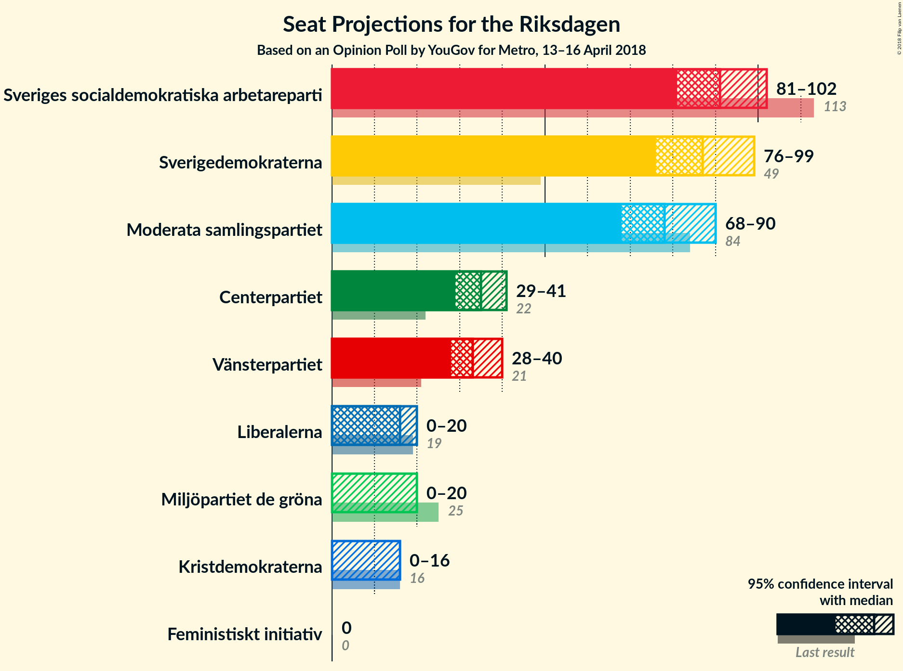
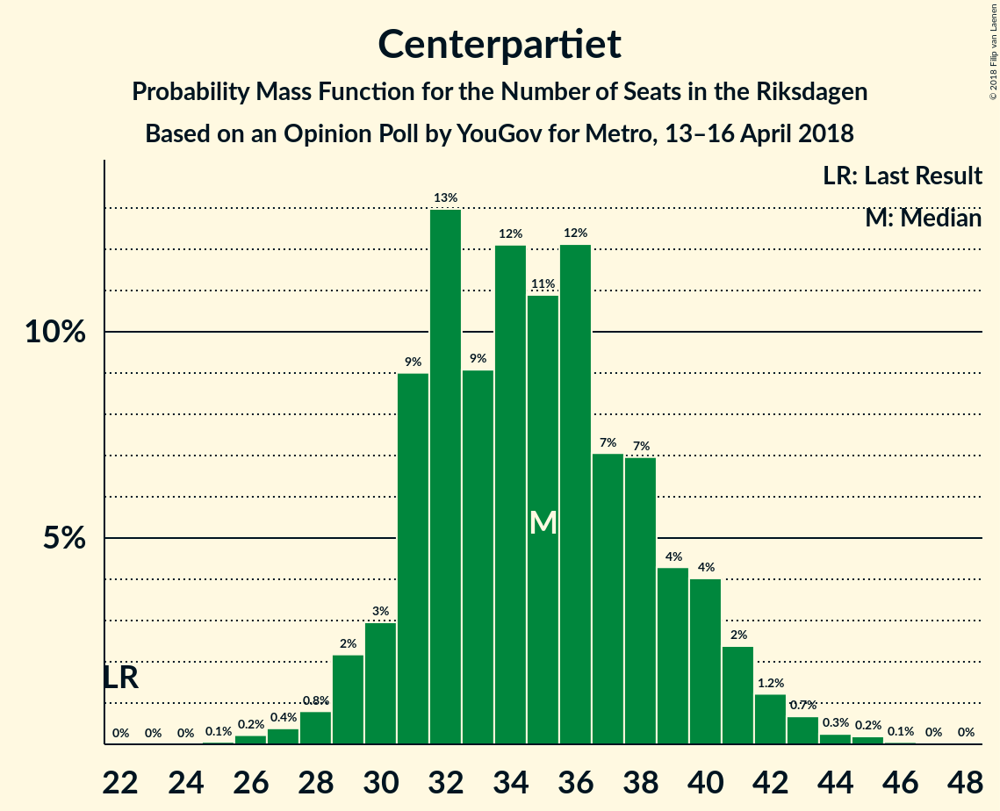

# Opinion Poll by YouGov for Metro, 13–16 April 2018

<a href="#voting-intentions">Voting Intentions</a> | <a href="#seats">Seats</a> | <a href="#coalitions">Coalitions</a> | <a href="#technical-information">Technical Information</a>

## Voting Intentions

### Confidence Intervals

| Party | Last Result | Poll Result | 80% Confidence Interval | 90% Confidence Interval | 95% Confidence Interval | 99% Confidence Interval |
|:-----:|:-----------:|:-----------:|:-----------------------:|:-----------------------:|:-----------------------:|:-----------------------:|
| Sveriges socialdemokratiska arbetareparti | 31.0% | 23.3% | 22.0–24.7% |21.6–25.1% |21.2–25.5% |20.6–26.2% |
| Sverigedemokraterna | 12.9% | 22.1% | 20.8–23.5% |20.4–23.9% |20.1–24.2% |19.4–24.9% |
| Moderata samlingspartiet | 23.3% | 19.9% | 18.6–21.2% |18.3–21.6% |18.0–21.9% |17.4–22.6% |
| Centerpartiet | 6.1% | 8.9% | 8.0–9.9% |7.8–10.2% |7.5–10.4% |7.1–10.9% |
| Vänsterpartiet | 5.7% | 8.5% | 7.6–9.5% |7.4–9.7% |7.2–10.0% |6.8–10.5% |
| Liberalerna | 5.4% | 4.0% | 3.4–4.7% |3.3–4.9% |3.1–5.1% |2.9–5.5% |
| Miljöpartiet de gröna | 6.9% | 3.9% | 3.3–4.6% |3.2–4.8% |3.0–5.0% |2.8–5.3% |
| Kristdemokraterna | 4.6% | 3.2% | 2.7–3.8% |2.5–4.0% |2.4–4.2% |2.2–4.5% |
| Feministiskt initiativ | 3.1% | 2.6% | 2.1–3.2% |2.0–3.4% |1.9–3.5% |1.7–3.8% |

*Note:* The poll result column reflects the actual value used in the calculations. Published results may vary slightly, and in addition be rounded to fewer digits.

## Seats

### Confidence Intervals

| Party | Last Result | Median | 80% Confidence Interval | 90% Confidence Interval | 95% Confidence Interval | 99% Confidence Interval |
|:-----:|:-----------:|:------:|:-----------------------:|:-----------------------:|:-----------------------:|:-----------------------:|
| <a href="#sveriges-socialdemokratiska-arbetareparti">Sveriges socialdemokratiska arbetareparti</a> | 113 | 91 | 85–98 |83–100 |81–102 |79–105 |
| <a href="#sverigedemokraterna">Sverigedemokraterna</a> | 49 | 87 | 79–95 |77–98 |76–99 |73–101 |
| <a href="#moderata-samlingspartiet">Moderata samlingspartiet</a> | 84 | 78 | 71–85 |69–88 |68–90 |66–95 |
| <a href="#centerpartiet">Centerpartiet</a> | 22 | 35 | 31–39 |30–40 |29–41 |27–44 |
| <a href="#vänsterpartiet">Vänsterpartiet</a> | 21 | 33 | 29–38 |28–39 |28–40 |26–42 |
| <a href="#liberalerna">Liberalerna</a> | 19 | 16 | 0–18 |0–19 |0–20 |0–22 |
| <a href="#miljöpartiet-de-gröna">Miljöpartiet de gröna</a> | 25 | 0 | 0–18 |0–19 |0–20 |0–21 |
| <a href="#kristdemokraterna">Kristdemokraterna</a> | 16 | 0 | 0 |0 |0–16 |0–17 |
| <a href="#feministiskt-initiativ">Feministiskt initiativ</a> | 0 | 0 | 0 |0 |0 |0 |

### Sveriges socialdemokratiska arbetareparti

*For a full overview of the results for this party, see the [Sveriges socialdemokratiska arbetareparti](party-sverigessocialdemokratiskaarbetareparti.html) page.*

| Number of Seats | Probability | Accumulated | Special Marks |
|:---------------:|:-----------:|:-----------:|:-------------:|
| 75 | 0% | 100% |  |
| 76 | 0.1% | 99.9% |  |
| 77 | 0.2% | 99.8% |  |
| 78 | 0.1% | 99.7% |  |
| 79 | 0.7% | 99.6% |  |
| 80 | 0.7% | 98.9% |  |
| 81 | 2% | 98% |  |
| 82 | 1.3% | 97% |  |
| 83 | 2% | 95% |  |
| 84 | 2% | 94% |  |
| 85 | 7% | 92% |  |
| 86 | 3% | 85% |  |
| 87 | 7% | 82% |  |
| 88 | 5% | 75% |  |
| 89 | 6% | 70% |  |
| 90 | 4% | 64% |  |
| 91 | 10% | 60% | Median |
| 92 | 9% | 50% |  |
| 93 | 5% | 41% |  |
| 94 | 8% | 36% |  |
| 95 | 8% | 29% |  |
| 96 | 3% | 20% |  |
| 97 | 6% | 18% |  |
| 98 | 4% | 12% |  |
| 99 | 2% | 8% |  |
| 100 | 0.9% | 6% |  |
| 101 | 2% | 5% |  |
| 102 | 1.0% | 3% |  |
| 103 | 0.5% | 2% |  |
| 104 | 0.7% | 2% |  |
| 105 | 0.3% | 0.8% |  |
| 106 | 0.1% | 0.5% |  |
| 107 | 0.2% | 0.3% |  |
| 108 | 0.1% | 0.2% |  |
| 109 | 0% | 0.1% |  |
| 110 | 0% | 0.1% |  |
| 111 | 0% | 0% |  |
| 112 | 0% | 0% |  |
| 113 | 0% | 0% | Last Result |

### Sverigedemokraterna

*For a full overview of the results for this party, see the [Sverigedemokraterna](party-sverigedemokraterna.html) page.*

| Number of Seats | Probability | Accumulated | Special Marks |
|:---------------:|:-----------:|:-----------:|:-------------:|
| 49 | 0% | 100% | Last Result |
| 50 | 0% | 100% |  |
| 51 | 0% | 100% |  |
| 52 | 0% | 100% |  |
| 53 | 0% | 100% |  |
| 54 | 0% | 100% |  |
| 55 | 0% | 100% |  |
| 56 | 0% | 100% |  |
| 57 | 0% | 100% |  |
| 58 | 0% | 100% |  |
| 59 | 0% | 100% |  |
| 60 | 0% | 100% |  |
| 61 | 0% | 100% |  |
| 62 | 0% | 100% |  |
| 63 | 0% | 100% |  |
| 64 | 0% | 100% |  |
| 65 | 0% | 100% |  |
| 66 | 0% | 100% |  |
| 67 | 0% | 100% |  |
| 68 | 0% | 100% |  |
| 69 | 0% | 100% |  |
| 70 | 0% | 100% |  |
| 71 | 0.1% | 100% |  |
| 72 | 0.3% | 99.9% |  |
| 73 | 0.4% | 99.6% |  |
| 74 | 0.4% | 99.3% |  |
| 75 | 1.0% | 98.9% |  |
| 76 | 2% | 98% |  |
| 77 | 2% | 96% |  |
| 78 | 2% | 94% |  |
| 79 | 3% | 92% |  |
| 80 | 2% | 89% |  |
| 81 | 4% | 87% |  |
| 82 | 5% | 83% |  |
| 83 | 7% | 78% |  |
| 84 | 3% | 71% |  |
| 85 | 8% | 68% |  |
| 86 | 6% | 60% |  |
| 87 | 9% | 55% | Median |
| 88 | 8% | 45% |  |
| 89 | 4% | 37% |  |
| 90 | 7% | 33% |  |
| 91 | 2% | 26% |  |
| 92 | 3% | 24% |  |
| 93 | 6% | 21% |  |
| 94 | 4% | 15% |  |
| 95 | 3% | 11% |  |
| 96 | 2% | 8% |  |
| 97 | 1.5% | 7% |  |
| 98 | 3% | 5% |  |
| 99 | 1.0% | 3% |  |
| 100 | 1.1% | 2% |  |
| 101 | 0.3% | 0.7% |  |
| 102 | 0.3% | 0.4% |  |
| 103 | 0.1% | 0.2% |  |
| 104 | 0% | 0.1% |  |
| 105 | 0% | 0% |  |

### Moderata samlingspartiet

*For a full overview of the results for this party, see the [Moderata samlingspartiet](party-moderatasamlingspartiet.html) page.*

| Number of Seats | Probability | Accumulated | Special Marks |
|:---------------:|:-----------:|:-----------:|:-------------:|
| 62 | 0.1% | 100% |  |
| 63 | 0.1% | 99.9% |  |
| 64 | 0.1% | 99.8% |  |
| 65 | 0.2% | 99.8% |  |
| 66 | 0.5% | 99.5% |  |
| 67 | 1.0% | 99.0% |  |
| 68 | 1.0% | 98% |  |
| 69 | 4% | 97% |  |
| 70 | 2% | 93% |  |
| 71 | 4% | 91% |  |
| 72 | 5% | 87% |  |
| 73 | 7% | 82% |  |
| 74 | 6% | 75% |  |
| 75 | 4% | 69% |  |
| 76 | 6% | 66% |  |
| 77 | 6% | 59% |  |
| 78 | 9% | 54% | Median |
| 79 | 6% | 45% |  |
| 80 | 7% | 39% |  |
| 81 | 5% | 32% |  |
| 82 | 4% | 27% |  |
| 83 | 6% | 23% |  |
| 84 | 6% | 17% | Last Result |
| 85 | 2% | 11% |  |
| 86 | 2% | 8% |  |
| 87 | 1.1% | 6% |  |
| 88 | 0.9% | 5% |  |
| 89 | 1.0% | 4% |  |
| 90 | 2% | 3% |  |
| 91 | 0.4% | 1.2% |  |
| 92 | 0.2% | 0.8% |  |
| 93 | 0.1% | 0.7% |  |
| 94 | 0% | 0.5% |  |
| 95 | 0.3% | 0.5% |  |
| 96 | 0.1% | 0.2% |  |
| 97 | 0.1% | 0.1% |  |
| 98 | 0.1% | 0.1% |  |
| 99 | 0% | 0% |  |

### Centerpartiet

*For a full overview of the results for this party, see the [Centerpartiet](party-centerpartiet.html) page.*

| Number of Seats | Probability | Accumulated | Special Marks |
|:---------------:|:-----------:|:-----------:|:-------------:|
| 22 | 0% | 100% | Last Result |
| 23 | 0% | 100% |  |
| 24 | 0% | 100% |  |
| 25 | 0.1% | 100% |  |
| 26 | 0.2% | 99.9% |  |
| 27 | 0.4% | 99.7% |  |
| 28 | 0.8% | 99.3% |  |
| 29 | 2% | 98.5% |  |
| 30 | 3% | 96% |  |
| 31 | 9% | 93% |  |
| 32 | 13% | 84% |  |
| 33 | 9% | 71% |  |
| 34 | 12% | 62% |  |
| 35 | 11% | 50% | Median |
| 36 | 12% | 39% |  |
| 37 | 7% | 27% |  |
| 38 | 7% | 20% |  |
| 39 | 4% | 13% |  |
| 40 | 4% | 9% |  |
| 41 | 2% | 5% |  |
| 42 | 1.2% | 2% |  |
| 43 | 0.7% | 1.2% |  |
| 44 | 0.3% | 0.6% |  |
| 45 | 0.2% | 0.3% |  |
| 46 | 0.1% | 0.1% |  |
| 47 | 0% | 0.1% |  |
| 48 | 0% | 0% |  |

### Vänsterpartiet

*For a full overview of the results for this party, see the [Vänsterpartiet](party-vänsterpartiet.html) page.*

| Number of Seats | Probability | Accumulated | Special Marks |
|:---------------:|:-----------:|:-----------:|:-------------:|
| 21 | 0% | 100% | Last Result |
| 22 | 0% | 100% |  |
| 23 | 0% | 100% |  |
| 24 | 0% | 100% |  |
| 25 | 0.4% | 100% |  |
| 26 | 0.3% | 99.6% |  |
| 27 | 1.1% | 99.3% |  |
| 28 | 4% | 98% |  |
| 29 | 6% | 94% |  |
| 30 | 5% | 88% |  |
| 31 | 7% | 83% |  |
| 32 | 16% | 76% |  |
| 33 | 17% | 60% | Median |
| 34 | 10% | 43% |  |
| 35 | 5% | 34% |  |
| 36 | 11% | 29% |  |
| 37 | 8% | 18% |  |
| 38 | 3% | 10% |  |
| 39 | 3% | 7% |  |
| 40 | 1.5% | 4% |  |
| 41 | 1.1% | 2% |  |
| 42 | 0.8% | 1.2% |  |
| 43 | 0.2% | 0.3% |  |
| 44 | 0.1% | 0.1% |  |
| 45 | 0% | 0.1% |  |
| 46 | 0% | 0% |  |

### Liberalerna

*For a full overview of the results for this party, see the [Liberalerna](party-liberalerna.html) page.*

| Number of Seats | Probability | Accumulated | Special Marks |
|:---------------:|:-----------:|:-----------:|:-------------:|
| 0 | 41% | 100% |  |
| 1 | 0% | 59% |  |
| 2 | 0% | 59% |  |
| 3 | 0% | 59% |  |
| 4 | 0% | 59% |  |
| 5 | 0% | 59% |  |
| 6 | 0% | 59% |  |
| 7 | 0% | 59% |  |
| 8 | 0% | 59% |  |
| 9 | 0% | 59% |  |
| 10 | 0% | 59% |  |
| 11 | 0% | 59% |  |
| 12 | 0% | 59% |  |
| 13 | 0% | 59% |  |
| 14 | 0% | 59% |  |
| 15 | 4% | 59% |  |
| 16 | 21% | 56% | Median |
| 17 | 15% | 35% |  |
| 18 | 10% | 20% |  |
| 19 | 5% | 9% | Last Result |
| 20 | 2% | 5% |  |
| 21 | 2% | 2% |  |
| 22 | 0.6% | 0.7% |  |
| 23 | 0.1% | 0.1% |  |
| 24 | 0% | 0% |  |

### Miljöpartiet de gröna

*For a full overview of the results for this party, see the [Miljöpartiet de gröna](party-miljöpartietdegröna.html) page.*

| Number of Seats | Probability | Accumulated | Special Marks |
|:---------------:|:-----------:|:-----------:|:-------------:|
| 0 | 57% | 100% | Median |
| 1 | 0% | 43% |  |
| 2 | 0% | 43% |  |
| 3 | 0% | 43% |  |
| 4 | 0% | 43% |  |
| 5 | 0% | 43% |  |
| 6 | 0% | 43% |  |
| 7 | 0% | 43% |  |
| 8 | 0% | 43% |  |
| 9 | 0% | 43% |  |
| 10 | 0% | 43% |  |
| 11 | 0% | 43% |  |
| 12 | 0% | 43% |  |
| 13 | 0% | 43% |  |
| 14 | 0% | 43% |  |
| 15 | 3% | 43% |  |
| 16 | 10% | 40% |  |
| 17 | 13% | 30% |  |
| 18 | 9% | 17% |  |
| 19 | 5% | 8% |  |
| 20 | 2% | 3% |  |
| 21 | 0.3% | 0.7% |  |
| 22 | 0.3% | 0.5% |  |
| 23 | 0.2% | 0.2% |  |
| 24 | 0% | 0% |  |
| 25 | 0% | 0% | Last Result |

### Kristdemokraterna

*For a full overview of the results for this party, see the [Kristdemokraterna](party-kristdemokraterna.html) page.*

| Number of Seats | Probability | Accumulated | Special Marks |
|:---------------:|:-----------:|:-----------:|:-------------:|
| 0 | 95% | 100% | Median |
| 1 | 0% | 5% |  |
| 2 | 0% | 5% |  |
| 3 | 0% | 5% |  |
| 4 | 0% | 5% |  |
| 5 | 0% | 5% |  |
| 6 | 0% | 5% |  |
| 7 | 0% | 5% |  |
| 8 | 0% | 5% |  |
| 9 | 0% | 5% |  |
| 10 | 0% | 5% |  |
| 11 | 0% | 5% |  |
| 12 | 0% | 5% |  |
| 13 | 0% | 5% |  |
| 14 | 0.1% | 5% |  |
| 15 | 2% | 5% |  |
| 16 | 2% | 3% | Last Result |
| 17 | 0.8% | 1.1% |  |
| 18 | 0.3% | 0.4% |  |
| 19 | 0.1% | 0.1% |  |
| 20 | 0% | 0% |  |

### Feministiskt initiativ

*For a full overview of the results for this party, see the [Feministiskt initiativ](party-feministisktinitiativ.html) page.*

| Number of Seats | Probability | Accumulated | Special Marks |
|:---------------:|:-----------:|:-----------:|:-------------:|
| 0 | 99.7% | 100% | Last Result, Median |
| 1 | 0% | 0.3% |  |
| 2 | 0% | 0.3% |  |
| 3 | 0% | 0.3% |  |
| 4 | 0% | 0.3% |  |
| 5 | 0% | 0.3% |  |
| 6 | 0% | 0.3% |  |
| 7 | 0% | 0.3% |  |
| 8 | 0% | 0.3% |  |
| 9 | 0% | 0.3% |  |
| 10 | 0% | 0.3% |  |
| 11 | 0% | 0.3% |  |
| 12 | 0% | 0.3% |  |
| 13 | 0% | 0.3% |  |
| 14 | 0% | 0.3% |  |
| 15 | 0% | 0.3% |  |
| 16 | 0.2% | 0.2% |  |
| 17 | 0% | 0.1% |  |
| 18 | 0% | 0% |  |

## Coalitions

### Confidence Intervals

| Coalition | Last Result | Median | Majority? | 80% Confidence Interval | 90% Confidence Interval | 95% Confidence Interval | 99% Confidence Interval |
|:---------:|:-----------:|:------:|:---------:|:-----------------------:|:-----------------------:|:-----------------------:|:-----------------------:|
| Sveriges socialdemokratiska arbetareparti – Vänsterpartiet – Miljöpartiet de gröna – Feministiskt initiativ | 159 | 131 | 0% | 120–145 | 119–147 | 117–151 | 113–153 |
| Sveriges socialdemokratiska arbetareparti – Vänsterpartiet – Miljöpartiet de gröna | 159 | 130 | 0% | 120–145 | 119–147 | 117–151 | 113–153 |
| Moderata samlingspartiet – Centerpartiet – Liberalerna – Kristdemokraterna | 141 | 124 | 0% | 113–134 | 110–137 | 108–140 | 103–145 |
| Sveriges socialdemokratiska arbetareparti – Vänsterpartiet | 134 | 125 | 0% | 116–133 | 114–136 | 112–138 | 108–143 |
| Moderata samlingspartiet – Centerpartiet – Liberalerna | 125 | 124 | 0% | 112–134 | 109–136 | 108–138 | 101–144 |
| Moderata samlingspartiet – Centerpartiet – Kristdemokraterna | 122 | 113 | 0% | 104–124 | 101–127 | 101–129 | 97–135 |
| Moderata samlingspartiet – Centerpartiet | 106 | 112 | 0% | 104–121 | 101–125 | 100–128 | 97–131 |
| Sveriges socialdemokratiska arbetareparti – Miljöpartiet de gröna | 138 | 98 | 0% | 88–112 | 86–115 | 85–116 | 81–118 |

