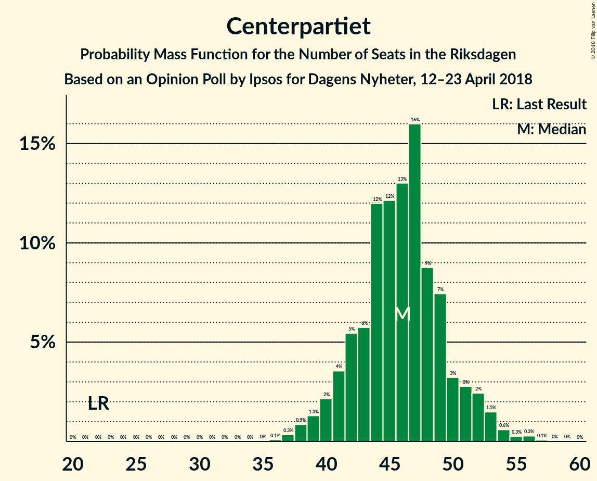

# Opinion Poll by Ipsos for Dagens Nyheter, 12–23 April 2018

<a href="#voting-intentions">Voting Intentions</a> | <a href="#seats">Seats</a> | <a href="#coalitions">Coalitions</a> | <a href="#technical-information">Technical Information</a>

## Voting Intentions

### Confidence Intervals

| Party | Last Result | Poll Result | 80% Confidence Interval | 90% Confidence Interval | 95% Confidence Interval | 99% Confidence Interval |
|:-----:|:-----------:|:-----------:|:-----------------------:|:-----------------------:|:-----------------------:|:-----------------------:|
| Sveriges socialdemokratiska arbetareparti | 31.0% | 26.0% | 24.6–27.5% |24.2–27.9% |23.9–28.3% |23.2–29.0% |
| Moderata samlingspartiet | 23.3% | 21.0% | 19.7–22.4% |19.3–22.8% |19.0–23.1% |18.4–23.8% |
| Sverigedemokraterna | 12.9% | 17.0% | 15.8–18.3% |15.5–18.6% |15.2–18.9% |14.6–19.6% |
| Centerpartiet | 6.1% | 12.0% | 11.0–13.1% |10.7–13.4% |10.5–13.7% |10.0–14.3% |
| Vänsterpartiet | 5.7% | 8.0% | 7.2–9.0% |6.9–9.2% |6.7–9.5% |6.4–10.0% |
| Liberalerna | 5.4% | 5.0% | 4.3–5.8% |4.1–6.0% |4.0–6.2% |3.7–6.6% |
| Miljöpartiet de gröna | 6.9% | 4.0% | 3.4–4.7% |3.3–4.9% |3.1–5.1% |2.9–5.5% |
| Kristdemokraterna | 4.6% | 3.0% | 2.5–3.7% |2.4–3.8% |2.3–4.0% |2.0–4.3% |
| Feministiskt initiativ | 3.1% | 2.0% | 1.6–2.6% |1.5–2.7% |1.4–2.9% |1.3–3.2% |

*Note:* The poll result column reflects the actual value used in the calculations. Published results may vary slightly, and in addition be rounded to fewer digits.

## Seats

### Confidence Intervals

| Party | Last Result | Median | 80% Confidence Interval | 90% Confidence Interval | 95% Confidence Interval | 99% Confidence Interval |
|:-----:|:-----------:|:------:|:-----------------------:|:-----------------------:|:-----------------------:|:-----------------------:|
| <a href="#sveriges-socialdemokratiska-arbetareparti">Sveriges socialdemokratiska arbetareparti</a> | 113 | 103 | 95–106 |93–106 |90–108 |86–112 |
| <a href="#moderata-samlingspartiet">Moderata samlingspartiet</a> | 84 | 82 | 75–85 |73–88 |72–89 |69–92 |
| <a href="#sverigedemokraterna">Sverigedemokraterna</a> | 49 | 65 | 59–69 |59–71 |57–72 |56–75 |
| <a href="#centerpartiet">Centerpartiet</a> | 22 | 46 | 42–49 |41–51 |40–52 |38–56 |
| <a href="#vänsterpartiet">Vänsterpartiet</a> | 21 | 31 | 28–34 |26–35 |26–36 |24–38 |
| <a href="#liberalerna">Liberalerna</a> | 19 | 18 | 16–22 |16–23 |0–24 |0–25 |
| <a href="#miljöpartiet-de-gröna">Miljöpartiet de gröna</a> | 25 | 0 | 0–17 |0–18 |0–19 |0–20 |
| <a href="#kristdemokraterna">Kristdemokraterna</a> | 16 | 0 | 0 |0 |0 |0–16 |
| <a href="#feministiskt-initiativ">Feministiskt initiativ</a> | 0 | 0 | 0 |0 |0 |0 |

### Sveriges socialdemokratiska arbetareparti

*For a full overview of the results for this party, see the [Sveriges socialdemokratiska arbetareparti](party-sverigessocialdemokratiskaarbetareparti.html) page.*

| Number of Seats | Probability | Accumulated | Special Marks |
|:---------------:|:-----------:|:-----------:|:-------------:|
| 84 | 0% | 100% |  |
| 85 | 0.2% | 99.9% |  |
| 86 | 0.5% | 99.8% |  |
| 87 | 0.1% | 99.2% |  |
| 88 | 0.5% | 99.1% |  |
| 89 | 1.1% | 98.6% |  |
| 90 | 0.6% | 98% |  |
| 91 | 0.8% | 97% |  |
| 92 | 1.2% | 96% |  |
| 93 | 3% | 95% |  |
| 94 | 2% | 92% |  |
| 95 | 3% | 90% |  |
| 96 | 4% | 87% |  |
| 97 | 3% | 83% |  |
| 98 | 6% | 80% |  |
| 99 | 3% | 74% |  |
| 100 | 6% | 71% |  |
| 101 | 8% | 65% |  |
| 102 | 3% | 56% |  |
| 103 | 28% | 54% | Median |
| 104 | 3% | 26% |  |
| 105 | 2% | 23% |  |
| 106 | 18% | 21% |  |
| 107 | 0.6% | 4% |  |
| 108 | 0.6% | 3% |  |
| 109 | 0.8% | 2% |  |
| 110 | 0.4% | 2% |  |
| 111 | 0.1% | 1.3% |  |
| 112 | 0.7% | 1.2% |  |
| 113 | 0.1% | 0.5% | Last Result |
| 114 | 0.2% | 0.4% |  |
| 115 | 0.1% | 0.2% |  |
| 116 | 0% | 0.1% |  |
| 117 | 0.1% | 0.1% |  |
| 118 | 0% | 0% |  |

### Moderata samlingspartiet

*For a full overview of the results for this party, see the [Moderata samlingspartiet](party-moderatasamlingspartiet.html) page.*

| Number of Seats | Probability | Accumulated | Special Marks |
|:---------------:|:-----------:|:-----------:|:-------------:|
| 66 | 0% | 100% |  |
| 67 | 0.1% | 99.9% |  |
| 68 | 0.1% | 99.9% |  |
| 69 | 0.8% | 99.7% |  |
| 70 | 0.2% | 98.9% |  |
| 71 | 0.8% | 98.7% |  |
| 72 | 0.6% | 98% |  |
| 73 | 3% | 97% |  |
| 74 | 1.1% | 94% |  |
| 75 | 6% | 93% |  |
| 76 | 4% | 87% |  |
| 77 | 5% | 83% |  |
| 78 | 7% | 77% |  |
| 79 | 6% | 70% |  |
| 80 | 3% | 65% |  |
| 81 | 6% | 62% |  |
| 82 | 17% | 56% | Median |
| 83 | 3% | 39% |  |
| 84 | 4% | 36% | Last Result |
| 85 | 23% | 32% |  |
| 86 | 2% | 9% |  |
| 87 | 1.1% | 7% |  |
| 88 | 3% | 6% |  |
| 89 | 1.4% | 3% |  |
| 90 | 0.4% | 2% |  |
| 91 | 0.3% | 1.1% |  |
| 92 | 0.5% | 0.8% |  |
| 93 | 0.1% | 0.3% |  |
| 94 | 0.1% | 0.2% |  |
| 95 | 0% | 0.1% |  |
| 96 | 0% | 0.1% |  |
| 97 | 0% | 0% |  |

### Sverigedemokraterna

*For a full overview of the results for this party, see the [Sverigedemokraterna](party-sverigedemokraterna.html) page.*

| Number of Seats | Probability | Accumulated | Special Marks |
|:---------------:|:-----------:|:-----------:|:-------------:|
| 49 | 0% | 100% | Last Result |
| 50 | 0% | 100% |  |
| 51 | 0% | 100% |  |
| 52 | 0% | 100% |  |
| 53 | 0% | 100% |  |
| 54 | 0.1% | 100% |  |
| 55 | 0.1% | 99.8% |  |
| 56 | 0.7% | 99.8% |  |
| 57 | 2% | 99.1% |  |
| 58 | 1.2% | 97% |  |
| 59 | 7% | 96% |  |
| 60 | 2% | 89% |  |
| 61 | 3% | 87% |  |
| 62 | 8% | 85% |  |
| 63 | 2% | 77% |  |
| 64 | 6% | 75% |  |
| 65 | 25% | 68% | Median |
| 66 | 7% | 43% |  |
| 67 | 4% | 36% |  |
| 68 | 21% | 32% |  |
| 69 | 3% | 11% |  |
| 70 | 2% | 9% |  |
| 71 | 2% | 7% |  |
| 72 | 2% | 4% |  |
| 73 | 0.3% | 2% |  |
| 74 | 1.1% | 2% |  |
| 75 | 0.5% | 0.9% |  |
| 76 | 0.1% | 0.4% |  |
| 77 | 0.1% | 0.3% |  |
| 78 | 0.1% | 0.1% |  |
| 79 | 0% | 0% |  |

### Centerpartiet

*For a full overview of the results for this party, see the [Centerpartiet](party-centerpartiet.html) page.*

| Number of Seats | Probability | Accumulated | Special Marks |
|:---------------:|:-----------:|:-----------:|:-------------:|
| 22 | 0% | 100% | Last Result |
| 23 | 0% | 100% |  |
| 24 | 0% | 100% |  |
| 25 | 0% | 100% |  |
| 26 | 0% | 100% |  |
| 27 | 0% | 100% |  |
| 28 | 0% | 100% |  |
| 29 | 0% | 100% |  |
| 30 | 0% | 100% |  |
| 31 | 0% | 100% |  |
| 32 | 0% | 100% |  |
| 33 | 0% | 100% |  |
| 34 | 0% | 100% |  |
| 35 | 0% | 100% |  |
| 36 | 0.1% | 100% |  |
| 37 | 0.1% | 99.8% |  |
| 38 | 0.3% | 99.8% |  |
| 39 | 1.5% | 99.4% |  |
| 40 | 2% | 98% |  |
| 41 | 4% | 96% |  |
| 42 | 9% | 92% |  |
| 43 | 7% | 84% |  |
| 44 | 8% | 77% |  |
| 45 | 5% | 69% |  |
| 46 | 18% | 64% | Median |
| 47 | 25% | 46% |  |
| 48 | 9% | 21% |  |
| 49 | 4% | 12% |  |
| 50 | 2% | 8% |  |
| 51 | 3% | 6% |  |
| 52 | 1.5% | 3% |  |
| 53 | 0.7% | 2% |  |
| 54 | 0.4% | 1.3% |  |
| 55 | 0.3% | 0.9% |  |
| 56 | 0.4% | 0.5% |  |
| 57 | 0.1% | 0.1% |  |
| 58 | 0% | 0.1% |  |
| 59 | 0% | 0% |  |

### Vänsterpartiet

*For a full overview of the results for this party, see the [Vänsterpartiet](party-vänsterpartiet.html) page.*

| Number of Seats | Probability | Accumulated | Special Marks |
|:---------------:|:-----------:|:-----------:|:-------------:|
| 21 | 0% | 100% | Last Result |
| 22 | 0% | 100% |  |
| 23 | 0.1% | 100% |  |
| 24 | 0.6% | 99.9% |  |
| 25 | 2% | 99.3% |  |
| 26 | 4% | 98% |  |
| 27 | 2% | 93% |  |
| 28 | 6% | 91% |  |
| 29 | 21% | 85% |  |
| 30 | 9% | 65% |  |
| 31 | 31% | 56% | Median |
| 32 | 4% | 24% |  |
| 33 | 10% | 20% |  |
| 34 | 2% | 10% |  |
| 35 | 5% | 8% |  |
| 36 | 2% | 3% |  |
| 37 | 1.3% | 2% |  |
| 38 | 0.3% | 0.5% |  |
| 39 | 0.1% | 0.2% |  |
| 40 | 0% | 0.1% |  |
| 41 | 0.1% | 0.1% |  |
| 42 | 0% | 0% |  |

### Liberalerna

*For a full overview of the results for this party, see the [Liberalerna](party-liberalerna.html) page.*

| Number of Seats | Probability | Accumulated | Special Marks |
|:---------------:|:-----------:|:-----------:|:-------------:|
| 0 | 3% | 100% |  |
| 1 | 0% | 97% |  |
| 2 | 0% | 97% |  |
| 3 | 0% | 97% |  |
| 4 | 0% | 97% |  |
| 5 | 0% | 97% |  |
| 6 | 0% | 97% |  |
| 7 | 0% | 97% |  |
| 8 | 0% | 97% |  |
| 9 | 0% | 97% |  |
| 10 | 0% | 97% |  |
| 11 | 0% | 97% |  |
| 12 | 0% | 97% |  |
| 13 | 0% | 97% |  |
| 14 | 0% | 97% |  |
| 15 | 0.6% | 97% |  |
| 16 | 8% | 97% |  |
| 17 | 7% | 89% |  |
| 18 | 44% | 83% | Median |
| 19 | 9% | 38% | Last Result |
| 20 | 4% | 29% |  |
| 21 | 10% | 25% |  |
| 22 | 6% | 15% |  |
| 23 | 5% | 9% |  |
| 24 | 3% | 5% |  |
| 25 | 1.1% | 1.4% |  |
| 26 | 0.2% | 0.3% |  |
| 27 | 0% | 0.1% |  |
| 28 | 0% | 0% |  |

### Miljöpartiet de gröna

*For a full overview of the results for this party, see the [Miljöpartiet de gröna](party-miljöpartietdegröna.html) page.*

| Number of Seats | Probability | Accumulated | Special Marks |
|:---------------:|:-----------:|:-----------:|:-------------:|
| 0 | 63% | 100% | Median |
| 1 | 0% | 37% |  |
| 2 | 0% | 37% |  |
| 3 | 0% | 37% |  |
| 4 | 0% | 37% |  |
| 5 | 0% | 37% |  |
| 6 | 0% | 37% |  |
| 7 | 0% | 37% |  |
| 8 | 0% | 37% |  |
| 9 | 0% | 37% |  |
| 10 | 0% | 37% |  |
| 11 | 0% | 37% |  |
| 12 | 0% | 37% |  |
| 13 | 0% | 37% |  |
| 14 | 0% | 37% |  |
| 15 | 5% | 37% |  |
| 16 | 10% | 32% |  |
| 17 | 13% | 22% |  |
| 18 | 5% | 9% |  |
| 19 | 2% | 3% |  |
| 20 | 1.1% | 2% |  |
| 21 | 0.4% | 0.4% |  |
| 22 | 0% | 0.1% |  |
| 23 | 0% | 0% |  |
| 24 | 0% | 0% |  |
| 25 | 0% | 0% | Last Result |

### Kristdemokraterna

*For a full overview of the results for this party, see the [Kristdemokraterna](party-kristdemokraterna.html) page.*

| Number of Seats | Probability | Accumulated | Special Marks |
|:---------------:|:-----------:|:-----------:|:-------------:|
| 0 | 98.8% | 100% | Median |
| 1 | 0% | 1.2% |  |
| 2 | 0% | 1.2% |  |
| 3 | 0% | 1.2% |  |
| 4 | 0% | 1.2% |  |
| 5 | 0% | 1.2% |  |
| 6 | 0% | 1.2% |  |
| 7 | 0% | 1.2% |  |
| 8 | 0% | 1.2% |  |
| 9 | 0% | 1.2% |  |
| 10 | 0% | 1.2% |  |
| 11 | 0% | 1.2% |  |
| 12 | 0% | 1.2% |  |
| 13 | 0% | 1.2% |  |
| 14 | 0% | 1.2% |  |
| 15 | 0.4% | 1.2% |  |
| 16 | 0.6% | 0.8% | Last Result |
| 17 | 0.2% | 0.3% |  |
| 18 | 0% | 0.1% |  |
| 19 | 0% | 0% |  |

### Feministiskt initiativ

*For a full overview of the results for this party, see the [Feministiskt initiativ](party-feministisktinitiativ.html) page.*

| Number of Seats | Probability | Accumulated | Special Marks |
|:---------------:|:-----------:|:-----------:|:-------------:|
| 0 | 100% | 100% | Last Result, Median |

## Coalitions

### Confidence Intervals

| Coalition | Last Result | Median | Majority? | 80% Confidence Interval | 90% Confidence Interval | 95% Confidence Interval | 99% Confidence Interval |
|:---------:|:-----------:|:------:|:---------:|:-----------------------:|:-----------------------:|:-----------------------:|:-----------------------:|
| Moderata samlingspartiet – Centerpartiet – Liberalerna – Kristdemokraterna | 141 | 146 | 0% | 137–152 | 135–155 | 133–156 | 128–162 |
| Moderata samlingspartiet – Centerpartiet – Liberalerna | 125 | 146 | 0% | 137–152 | 135–154 | 133–156 | 128–161 |
| Sveriges socialdemokratiska arbetareparti – Vänsterpartiet – Miljöpartiet de gröna – Feministiskt initiativ | 159 | 135 | 0% | 133–149 | 129–149 | 127–150 | 122–154 |
| Sveriges socialdemokratiska arbetareparti – Vänsterpartiet – Miljöpartiet de gröna | 159 | 135 | 0% | 133–149 | 129–149 | 127–150 | 122–154 |
| Sveriges socialdemokratiska arbetareparti – Vänsterpartiet | 134 | 134 | 0% | 123–136 | 121–137 | 119–141 | 116–146 |
| Moderata samlingspartiet – Centerpartiet – Kristdemokraterna | 122 | 128 | 0% | 120–132 | 117–136 | 116–138 | 113–142 |
| Moderata samlingspartiet – Centerpartiet | 106 | 128 | 0% | 120–132 | 117–136 | 116–137 | 113–141 |

### Moderata samlingspartiet – Centerpartiet – Liberalerna – Kristdemokraterna

| Number of Seats | Probability | Accumulated | Special Marks |
|:---------------:|:-----------:|:-----------:|:-------------:|
| 121 | 0% | 100% |  |
| 122 | 0% | 99.9% |  |
| 123 | 0% | 99.9% |  |
| 124 | 0% | 99.9% |  |
| 125 | 0.2% | 99.9% |  |
| 126 | 0% | 99.7% |  |
| 127 | 0.1% | 99.7% |  |
| 128 | 0.4% | 99.6% |  |
| 129 | 0.2% | 99.2% |  |
| 130 | 0.1% | 99.1% |  |
| 131 | 0.4% | 99.0% |  |
| 132 | 0.4% | 98.6% |  |
| 133 | 2% | 98% |  |
| 134 | 0.5% | 97% |  |
| 135 | 2% | 96% |  |
| 136 | 3% | 94% |  |
| 137 | 2% | 91% |  |
| 138 | 3% | 90% |  |
| 139 | 2% | 87% |  |
| 140 | 2% | 84% |  |
| 141 | 7% | 82% | Last Result |
| 142 | 5% | 75% |  |
| 143 | 3% | 70% |  |
| 144 | 2% | 67% |  |
| 145 | 4% | 66% |  |
| 146 | 18% | 61% | Median |
| 147 | 3% | 43% |  |
| 148 | 2% | 41% |  |
| 149 | 3% | 38% |  |
| 150 | 23% | 36% |  |
| 151 | 2% | 12% |  |
| 152 | 0.9% | 11% |  |
| 153 | 1.0% | 10% |  |
| 154 | 3% | 9% |  |
| 155 | 2% | 6% |  |
| 156 | 1.1% | 4% |  |
| 157 | 0.6% | 2% |  |
| 158 | 0.4% | 2% |  |
| 159 | 0.6% | 1.5% |  |
| 160 | 0.2% | 0.9% |  |
| 161 | 0.1% | 0.7% |  |
| 162 | 0.4% | 0.5% |  |
| 163 | 0% | 0.1% |  |
| 164 | 0% | 0.1% |  |
| 165 | 0% | 0.1% |  |
| 166 | 0% | 0% |  |

### Moderata samlingspartiet – Centerpartiet – Liberalerna

| Number of Seats | Probability | Accumulated | Special Marks |
|:---------------:|:-----------:|:-----------:|:-------------:|
| 121 | 0% | 100% |  |
| 122 | 0% | 99.9% |  |
| 123 | 0% | 99.9% |  |
| 124 | 0% | 99.9% |  |
| 125 | 0.2% | 99.9% | Last Result |
| 126 | 0% | 99.7% |  |
| 127 | 0.1% | 99.6% |  |
| 128 | 0.4% | 99.6% |  |
| 129 | 0.2% | 99.2% |  |
| 130 | 0.1% | 99.0% |  |
| 131 | 0.4% | 98.9% |  |
| 132 | 0.5% | 98% |  |
| 133 | 2% | 98% |  |
| 134 | 0.6% | 96% |  |
| 135 | 2% | 96% |  |
| 136 | 3% | 94% |  |
| 137 | 2% | 91% |  |
| 138 | 3% | 89% |  |
| 139 | 2% | 86% |  |
| 140 | 2% | 84% |  |
| 141 | 8% | 82% |  |
| 142 | 5% | 74% |  |
| 143 | 3% | 69% |  |
| 144 | 2% | 66% |  |
| 145 | 4% | 64% |  |
| 146 | 18% | 60% | Median |
| 147 | 3% | 42% |  |
| 148 | 2% | 40% |  |
| 149 | 2% | 37% |  |
| 150 | 23% | 35% |  |
| 151 | 2% | 12% |  |
| 152 | 0.9% | 10% |  |
| 153 | 0.9% | 9% |  |
| 154 | 3% | 8% |  |
| 155 | 2% | 5% |  |
| 156 | 1.1% | 3% |  |
| 157 | 0.5% | 2% |  |
| 158 | 0.3% | 1.5% |  |
| 159 | 0.4% | 1.2% |  |
| 160 | 0.2% | 0.7% |  |
| 161 | 0.1% | 0.5% |  |
| 162 | 0.4% | 0.4% |  |
| 163 | 0% | 0% |  |

### Sveriges socialdemokratiska arbetareparti – Vänsterpartiet – Miljöpartiet de gröna – Feministiskt initiativ

| Number of Seats | Probability | Accumulated | Special Marks |
|:---------------:|:-----------:|:-----------:|:-------------:|
| 119 | 0.1% | 100% |  |
| 120 | 0.1% | 99.9% |  |
| 121 | 0.1% | 99.8% |  |
| 122 | 0.4% | 99.7% |  |
| 123 | 0.4% | 99.3% |  |
| 124 | 0.3% | 98.8% |  |
| 125 | 0.5% | 98.5% |  |
| 126 | 0.4% | 98% |  |
| 127 | 0.7% | 98% |  |
| 128 | 1.2% | 97% |  |
| 129 | 1.2% | 96% |  |
| 130 | 3% | 95% |  |
| 131 | 0.8% | 92% |  |
| 132 | 0.5% | 91% |  |
| 133 | 5% | 91% |  |
| 134 | 24% | 86% | Median |
| 135 | 18% | 63% |  |
| 136 | 4% | 44% |  |
| 137 | 2% | 40% |  |
| 138 | 2% | 38% |  |
| 139 | 4% | 36% |  |
| 140 | 2% | 32% |  |
| 141 | 0.9% | 30% |  |
| 142 | 2% | 29% |  |
| 143 | 4% | 28% |  |
| 144 | 2% | 24% |  |
| 145 | 2% | 22% |  |
| 146 | 0.8% | 21% |  |
| 147 | 2% | 20% |  |
| 148 | 4% | 18% |  |
| 149 | 10% | 13% |  |
| 150 | 2% | 4% |  |
| 151 | 0.2% | 2% |  |
| 152 | 0.4% | 2% |  |
| 153 | 0.5% | 1.5% |  |
| 154 | 0.7% | 1.0% |  |
| 155 | 0.1% | 0.3% |  |
| 156 | 0% | 0.2% |  |
| 157 | 0.1% | 0.2% |  |
| 158 | 0% | 0.1% |  |
| 159 | 0% | 0.1% | Last Result |
| 160 | 0% | 0.1% |  |
| 161 | 0% | 0% |  |

### Sveriges socialdemokratiska arbetareparti – Vänsterpartiet – Miljöpartiet de gröna

| Number of Seats | Probability | Accumulated | Special Marks |
|:---------------:|:-----------:|:-----------:|:-------------:|
| 119 | 0.1% | 100% |  |
| 120 | 0.1% | 99.9% |  |
| 121 | 0.1% | 99.8% |  |
| 122 | 0.4% | 99.7% |  |
| 123 | 0.4% | 99.3% |  |
| 124 | 0.3% | 98.8% |  |
| 125 | 0.5% | 98.5% |  |
| 126 | 0.4% | 98% |  |
| 127 | 0.7% | 98% |  |
| 128 | 1.2% | 97% |  |
| 129 | 1.2% | 96% |  |
| 130 | 3% | 95% |  |
| 131 | 0.8% | 92% |  |
| 132 | 0.5% | 91% |  |
| 133 | 5% | 91% |  |
| 134 | 24% | 86% | Median |
| 135 | 18% | 63% |  |
| 136 | 4% | 44% |  |
| 137 | 2% | 40% |  |
| 138 | 2% | 38% |  |
| 139 | 4% | 36% |  |
| 140 | 2% | 32% |  |
| 141 | 0.9% | 30% |  |
| 142 | 2% | 29% |  |
| 143 | 4% | 28% |  |
| 144 | 2% | 24% |  |
| 145 | 2% | 22% |  |
| 146 | 0.8% | 21% |  |
| 147 | 2% | 20% |  |
| 148 | 4% | 18% |  |
| 149 | 10% | 13% |  |
| 150 | 2% | 4% |  |
| 151 | 0.2% | 2% |  |
| 152 | 0.4% | 2% |  |
| 153 | 0.5% | 1.5% |  |
| 154 | 0.7% | 1.0% |  |
| 155 | 0.1% | 0.3% |  |
| 156 | 0% | 0.2% |  |
| 157 | 0.1% | 0.2% |  |
| 158 | 0% | 0.1% |  |
| 159 | 0% | 0.1% | Last Result |
| 160 | 0% | 0.1% |  |
| 161 | 0% | 0% |  |

### Sveriges socialdemokratiska arbetareparti – Vänsterpartiet

| Number of Seats | Probability | Accumulated | Special Marks |
|:---------------:|:-----------:|:-----------:|:-------------:|
| 113 | 0% | 100% |  |
| 114 | 0% | 99.9% |  |
| 115 | 0.3% | 99.9% |  |
| 116 | 0.4% | 99.6% |  |
| 117 | 0.6% | 99.2% |  |
| 118 | 1.0% | 98.6% |  |
| 119 | 0.9% | 98% |  |
| 120 | 0.6% | 97% |  |
| 121 | 1.1% | 96% |  |
| 122 | 2% | 95% |  |
| 123 | 3% | 93% |  |
| 124 | 2% | 90% |  |
| 125 | 3% | 88% |  |
| 126 | 2% | 85% |  |
| 127 | 1.4% | 83% |  |
| 128 | 2% | 81% |  |
| 129 | 2% | 79% |  |
| 130 | 6% | 77% |  |
| 131 | 3% | 71% |  |
| 132 | 8% | 68% |  |
| 133 | 7% | 60% |  |
| 134 | 24% | 53% | Last Result, Median |
| 135 | 18% | 29% |  |
| 136 | 5% | 11% |  |
| 137 | 1.3% | 6% |  |
| 138 | 0.7% | 5% |  |
| 139 | 1.3% | 4% |  |
| 140 | 0.3% | 3% |  |
| 141 | 0.4% | 3% |  |
| 142 | 0.6% | 2% |  |
| 143 | 0.6% | 2% |  |
| 144 | 0.4% | 1.2% |  |
| 145 | 0.2% | 0.8% |  |
| 146 | 0.2% | 0.6% |  |
| 147 | 0.3% | 0.4% |  |
| 148 | 0% | 0.1% |  |
| 149 | 0% | 0.1% |  |
| 150 | 0% | 0% |  |

### Moderata samlingspartiet – Centerpartiet – Kristdemokraterna

| Number of Seats | Probability | Accumulated | Special Marks |
|:---------------:|:-----------:|:-----------:|:-------------:|
| 110 | 0% | 100% |  |
| 111 | 0.1% | 99.9% |  |
| 112 | 0.2% | 99.8% |  |
| 113 | 0.3% | 99.7% |  |
| 114 | 0.1% | 99.4% |  |
| 115 | 0.2% | 99.3% |  |
| 116 | 2% | 99.0% |  |
| 117 | 3% | 97% |  |
| 118 | 0.8% | 94% |  |
| 119 | 2% | 93% |  |
| 120 | 10% | 91% |  |
| 121 | 1.4% | 81% |  |
| 122 | 3% | 80% | Last Result |
| 123 | 6% | 76% |  |
| 124 | 4% | 70% |  |
| 125 | 4% | 67% |  |
| 126 | 3% | 63% |  |
| 127 | 2% | 60% |  |
| 128 | 18% | 58% | Median |
| 129 | 4% | 41% |  |
| 130 | 2% | 37% |  |
| 131 | 2% | 35% |  |
| 132 | 24% | 34% |  |
| 133 | 0.5% | 10% |  |
| 134 | 2% | 9% |  |
| 135 | 0.8% | 7% |  |
| 136 | 3% | 6% |  |
| 137 | 0.5% | 3% |  |
| 138 | 1.2% | 3% |  |
| 139 | 0.3% | 1.5% |  |
| 140 | 0.1% | 1.2% |  |
| 141 | 0.5% | 1.1% |  |
| 142 | 0.2% | 0.5% |  |
| 143 | 0% | 0.3% |  |
| 144 | 0.1% | 0.3% |  |
| 145 | 0.1% | 0.2% |  |
| 146 | 0% | 0.1% |  |
| 147 | 0% | 0.1% |  |
| 148 | 0% | 0.1% |  |
| 149 | 0% | 0% |  |

### Moderata samlingspartiet – Centerpartiet

| Number of Seats | Probability | Accumulated | Special Marks |
|:---------------:|:-----------:|:-----------:|:-------------:|
| 106 | 0% | 100% | Last Result |
| 107 | 0% | 100% |  |
| 108 | 0% | 100% |  |
| 109 | 0.1% | 100% |  |
| 110 | 0% | 99.9% |  |
| 111 | 0.1% | 99.9% |  |
| 112 | 0.2% | 99.8% |  |
| 113 | 0.3% | 99.6% |  |
| 114 | 0.2% | 99.3% |  |
| 115 | 0.3% | 99.1% |  |
| 116 | 3% | 98.8% |  |
| 117 | 3% | 96% |  |
| 118 | 0.9% | 93% |  |
| 119 | 2% | 92% |  |
| 120 | 10% | 90% |  |
| 121 | 1.4% | 80% |  |
| 122 | 3% | 79% |  |
| 123 | 6% | 75% |  |
| 124 | 4% | 69% |  |
| 125 | 4% | 66% |  |
| 126 | 3% | 62% |  |
| 127 | 2% | 59% |  |
| 128 | 18% | 57% | Median |
| 129 | 4% | 39% |  |
| 130 | 1.5% | 36% |  |
| 131 | 2% | 34% |  |
| 132 | 24% | 33% |  |
| 133 | 0.5% | 9% |  |
| 134 | 2% | 8% |  |
| 135 | 0.7% | 6% |  |
| 136 | 3% | 6% |  |
| 137 | 0.5% | 3% |  |
| 138 | 1.1% | 2% |  |
| 139 | 0.2% | 1.0% |  |
| 140 | 0.1% | 0.8% |  |
| 141 | 0.5% | 0.8% |  |
| 142 | 0.1% | 0.2% |  |
| 143 | 0% | 0.1% |  |
| 144 | 0% | 0.1% |  |
| 145 | 0% | 0.1% |  |
| 146 | 0% | 0% |  |

## Technical Information

### Opinion Poll

+ **Polling firm:** Ipsos
+ **Commissioner(s):** Dagens Nyheter
+ **Fieldwork period:** 12–23 April 2018

### Calculations

+ **Sample size:** 1526
+ **Simulations done:** 524,288
+ **Error estimate:** 1.04%

