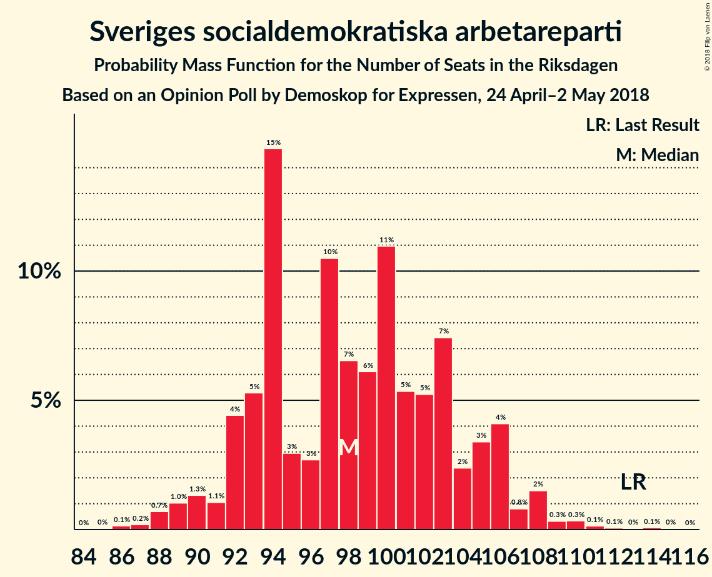
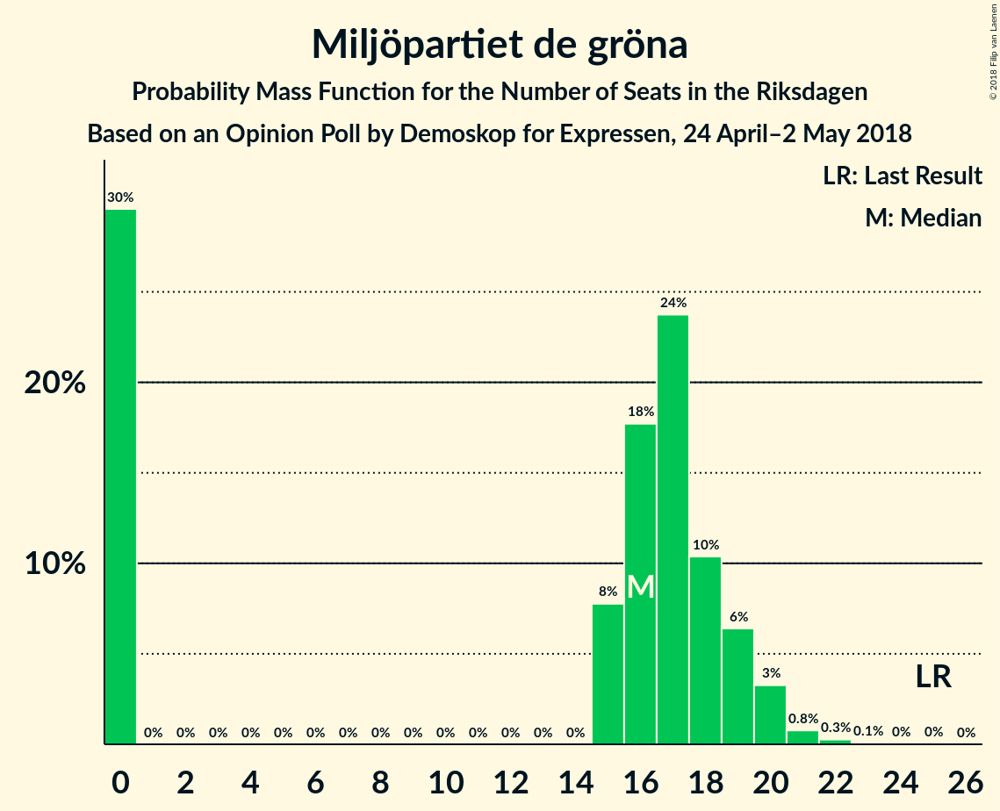

# Opinion Poll by Demoskop for Expressen, 24 April–2 May 2018

<a href="#voting-intentions">Voting Intentions</a> | <a href="#seats">Seats</a> | <a href="#coalitions">Coalitions</a> | <a href="#technical-information">Technical Information</a>

## Voting Intentions

### Confidence Intervals

| Party | Last Result | Poll Result | 80% Confidence Interval | 90% Confidence Interval | 95% Confidence Interval | 99% Confidence Interval |
|:-----:|:-----------:|:-----------:|:-----------------------:|:-----------------------:|:-----------------------:|:-----------------------:|
| Sveriges socialdemokratiska arbetareparti | 31.0% | 26.3% | 24.9–27.7% |24.5–28.1% |24.2–28.5% |23.6–29.2% |
| Moderata samlingspartiet | 23.3% | 22.3% | 21.0–23.7% |20.6–24.1% |20.3–24.4% |19.7–25.1% |
| Sverigedemokraterna | 12.9% | 19.4% | 18.2–20.7% |17.8–21.1% |17.5–21.4% |17.0–22.0% |
| Centerpartiet | 6.1% | 9.1% | 8.2–10.1% |8.0–10.4% |7.8–10.6% |7.4–11.1% |
| Vänsterpartiet | 5.7% | 7.7% | 6.9–8.6% |6.7–8.9% |6.5–9.1% |6.1–9.6% |
| Liberalerna | 5.4% | 4.9% | 4.3–5.7% |4.1–5.9% |4.0–6.1% |3.7–6.5% |
| Miljöpartiet de gröna | 6.9% | 4.4% | 3.8–5.1% |3.6–5.3% |3.5–5.5% |3.2–5.9% |
| Kristdemokraterna | 4.6% | 2.9% | 2.4–3.5% |2.3–3.7% |2.2–3.8% |2.0–4.1% |
| Feministiskt initiativ | 3.1% | 1.5% | 1.2–2.0% |1.1–2.1% |1.0–2.2% |0.9–2.4% |

*Note:* The poll result column reflects the actual value used in the calculations. Published results may vary slightly, and in addition be rounded to fewer digits.

## Seats

### Confidence Intervals

| Party | Last Result | Median | 80% Confidence Interval | 90% Confidence Interval | 95% Confidence Interval | 99% Confidence Interval |
|:-----:|:-----------:|:------:|:-----------------------:|:-----------------------:|:-----------------------:|:-----------------------:|
| <a href="#sveriges-socialdemokratiska-arbetareparti">Sveriges socialdemokratiska arbetareparti</a> | 113 | 98 | 93–105 |92–106 |90–108 |88–110 |
| <a href="#moderata-samlingspartiet">Moderata samlingspartiet</a> | 84 | 85 | 78–88 |77–90 |75–92 |73–95 |
| <a href="#sverigedemokraterna">Sverigedemokraterna</a> | 49 | 73 | 68–78 |67–80 |65–80 |63–83 |
| <a href="#centerpartiet">Centerpartiet</a> | 22 | 34 | 31–38 |30–38 |29–39 |28–42 |
| <a href="#vänsterpartiet">Vänsterpartiet</a> | 21 | 29 | 26–32 |25–33 |25–34 |23–36 |
| <a href="#liberalerna">Liberalerna</a> | 19 | 18 | 16–21 |16–22 |15–22 |0–24 |
| <a href="#miljöpartiet-de-gröna">Miljöpartiet de gröna</a> | 25 | 16 | 0–19 |0–19 |0–20 |0–21 |
| <a href="#kristdemokraterna">Kristdemokraterna</a> | 16 | 0 | 0 |0 |0 |0–15 |
| <a href="#feministiskt-initiativ">Feministiskt initiativ</a> | 0 | 0 | 0 |0 |0 |0 |

### Sveriges socialdemokratiska arbetareparti

*For a full overview of the results for this party, see the [Sveriges socialdemokratiska arbetareparti](party-sverigessocialdemokratiskaarbetareparti.html) page.*

| Number of Seats | Probability | Accumulated | Special Marks |
|:---------------:|:-----------:|:-----------:|:-------------:|
| 85 | 0% | 100% |  |
| 86 | 0.1% | 99.9% |  |
| 87 | 0.2% | 99.8% |  |
| 88 | 0.7% | 99.6% |  |
| 89 | 1.0% | 98.9% |  |
| 90 | 1.3% | 98% |  |
| 91 | 1.1% | 97% |  |
| 92 | 4% | 95% |  |
| 93 | 5% | 91% |  |
| 94 | 15% | 86% |  |
| 95 | 3% | 71% |  |
| 96 | 3% | 68% |  |
| 97 | 10% | 65% |  |
| 98 | 7% | 55% | Median |
| 99 | 6% | 48% |  |
| 100 | 11% | 42% |  |
| 101 | 5% | 31% |  |
| 102 | 5% | 26% |  |
| 103 | 7% | 21% |  |
| 104 | 2% | 13% |  |
| 105 | 3% | 11% |  |
| 106 | 4% | 7% |  |
| 107 | 0.8% | 3% |  |
| 108 | 2% | 3% |  |
| 109 | 0.3% | 1.1% |  |
| 110 | 0.3% | 0.7% |  |
| 111 | 0.1% | 0.4% |  |
| 112 | 0.1% | 0.2% |  |
| 113 | 0% | 0.2% | Last Result |
| 114 | 0.1% | 0.1% |  |
| 115 | 0% | 0.1% |  |
| 116 | 0% | 0% |  |

### Moderata samlingspartiet

*For a full overview of the results for this party, see the [Moderata samlingspartiet](party-moderatasamlingspartiet.html) page.*

| Number of Seats | Probability | Accumulated | Special Marks |
|:---------------:|:-----------:|:-----------:|:-------------:|
| 71 | 0% | 100% |  |
| 72 | 0.2% | 99.9% |  |
| 73 | 0.6% | 99.8% |  |
| 74 | 0.4% | 99.2% |  |
| 75 | 1.4% | 98.8% |  |
| 76 | 0.6% | 97% |  |
| 77 | 2% | 97% |  |
| 78 | 7% | 95% |  |
| 79 | 3% | 88% |  |
| 80 | 4% | 85% |  |
| 81 | 8% | 81% |  |
| 82 | 6% | 73% |  |
| 83 | 10% | 67% |  |
| 84 | 5% | 57% | Last Result |
| 85 | 15% | 51% | Median |
| 86 | 10% | 36% |  |
| 87 | 11% | 26% |  |
| 88 | 7% | 15% |  |
| 89 | 4% | 9% |  |
| 90 | 2% | 5% |  |
| 91 | 1.1% | 4% |  |
| 92 | 0.4% | 3% |  |
| 93 | 0.8% | 2% |  |
| 94 | 0.3% | 1.4% |  |
| 95 | 0.8% | 1.1% |  |
| 96 | 0.1% | 0.2% |  |
| 97 | 0% | 0.1% |  |
| 98 | 0.1% | 0.1% |  |
| 99 | 0% | 0% |  |

### Sverigedemokraterna

*For a full overview of the results for this party, see the [Sverigedemokraterna](party-sverigedemokraterna.html) page.*

| Number of Seats | Probability | Accumulated | Special Marks |
|:---------------:|:-----------:|:-----------:|:-------------:|
| 49 | 0% | 100% | Last Result |
| 50 | 0% | 100% |  |
| 51 | 0% | 100% |  |
| 52 | 0% | 100% |  |
| 53 | 0% | 100% |  |
| 54 | 0% | 100% |  |
| 55 | 0% | 100% |  |
| 56 | 0% | 100% |  |
| 57 | 0% | 100% |  |
| 58 | 0% | 100% |  |
| 59 | 0% | 100% |  |
| 60 | 0.1% | 100% |  |
| 61 | 0.1% | 99.9% |  |
| 62 | 0.2% | 99.9% |  |
| 63 | 0.4% | 99.7% |  |
| 64 | 0.8% | 99.3% |  |
| 65 | 2% | 98.5% |  |
| 66 | 1.3% | 97% |  |
| 67 | 5% | 96% |  |
| 68 | 3% | 91% |  |
| 69 | 7% | 87% |  |
| 70 | 8% | 81% |  |
| 71 | 10% | 73% |  |
| 72 | 9% | 63% |  |
| 73 | 6% | 55% | Median |
| 74 | 13% | 49% |  |
| 75 | 8% | 36% |  |
| 76 | 6% | 27% |  |
| 77 | 10% | 22% |  |
| 78 | 3% | 12% |  |
| 79 | 1.2% | 9% |  |
| 80 | 6% | 8% |  |
| 81 | 0.6% | 2% |  |
| 82 | 0.9% | 2% |  |
| 83 | 0.3% | 0.7% |  |
| 84 | 0.2% | 0.4% |  |
| 85 | 0.1% | 0.2% |  |
| 86 | 0% | 0.2% |  |
| 87 | 0.1% | 0.1% |  |
| 88 | 0% | 0.1% |  |
| 89 | 0% | 0% |  |

### Centerpartiet

*For a full overview of the results for this party, see the [Centerpartiet](party-centerpartiet.html) page.*

| Number of Seats | Probability | Accumulated | Special Marks |
|:---------------:|:-----------:|:-----------:|:-------------:|
| 22 | 0% | 100% | Last Result |
| 23 | 0% | 100% |  |
| 24 | 0% | 100% |  |
| 25 | 0% | 100% |  |
| 26 | 0.1% | 100% |  |
| 27 | 0.2% | 99.9% |  |
| 28 | 0.8% | 99.7% |  |
| 29 | 3% | 98.9% |  |
| 30 | 4% | 96% |  |
| 31 | 4% | 92% |  |
| 32 | 6% | 88% |  |
| 33 | 16% | 82% |  |
| 34 | 26% | 66% | Median |
| 35 | 17% | 39% |  |
| 36 | 7% | 23% |  |
| 37 | 4% | 15% |  |
| 38 | 6% | 11% |  |
| 39 | 3% | 5% |  |
| 40 | 1.0% | 2% |  |
| 41 | 0.5% | 1.1% |  |
| 42 | 0.3% | 0.6% |  |
| 43 | 0.2% | 0.3% |  |
| 44 | 0.1% | 0.2% |  |
| 45 | 0% | 0% |  |

### Vänsterpartiet

*For a full overview of the results for this party, see the [Vänsterpartiet](party-vänsterpartiet.html) page.*

| Number of Seats | Probability | Accumulated | Special Marks |
|:---------------:|:-----------:|:-----------:|:-------------:|
| 21 | 0% | 100% | Last Result |
| 22 | 0.2% | 100% |  |
| 23 | 0.7% | 99.8% |  |
| 24 | 1.4% | 99.1% |  |
| 25 | 3% | 98% |  |
| 26 | 11% | 95% |  |
| 27 | 19% | 84% |  |
| 28 | 7% | 65% |  |
| 29 | 21% | 58% | Median |
| 30 | 18% | 37% |  |
| 31 | 5% | 18% |  |
| 32 | 5% | 13% |  |
| 33 | 5% | 8% |  |
| 34 | 1.3% | 3% |  |
| 35 | 0.9% | 1.5% |  |
| 36 | 0.3% | 0.5% |  |
| 37 | 0.1% | 0.2% |  |
| 38 | 0.1% | 0.1% |  |
| 39 | 0% | 0% |  |

### Liberalerna

*For a full overview of the results for this party, see the [Liberalerna](party-liberalerna.html) page.*

| Number of Seats | Probability | Accumulated | Special Marks |
|:---------------:|:-----------:|:-----------:|:-------------:|
| 0 | 2% | 100% |  |
| 1 | 0% | 98% |  |
| 2 | 0% | 98% |  |
| 3 | 0% | 98% |  |
| 4 | 0% | 98% |  |
| 5 | 0% | 98% |  |
| 6 | 0% | 98% |  |
| 7 | 0% | 98% |  |
| 8 | 0% | 98% |  |
| 9 | 0% | 98% |  |
| 10 | 0% | 98% |  |
| 11 | 0% | 98% |  |
| 12 | 0% | 98% |  |
| 13 | 0% | 98% |  |
| 14 | 0% | 98% |  |
| 15 | 2% | 98% |  |
| 16 | 7% | 96% |  |
| 17 | 14% | 89% |  |
| 18 | 26% | 75% | Median |
| 19 | 11% | 49% | Last Result |
| 20 | 11% | 38% |  |
| 21 | 18% | 26% |  |
| 22 | 6% | 9% |  |
| 23 | 1.5% | 2% |  |
| 24 | 0.7% | 1.0% |  |
| 25 | 0.2% | 0.3% |  |
| 26 | 0.1% | 0.1% |  |
| 27 | 0% | 0% |  |

### Miljöpartiet de gröna

*For a full overview of the results for this party, see the [Miljöpartiet de gröna](party-miljöpartietdegröna.html) page.*

| Number of Seats | Probability | Accumulated | Special Marks |
|:---------------:|:-----------:|:-----------:|:-------------:|
| 0 | 30% | 100% |  |
| 1 | 0% | 70% |  |
| 2 | 0% | 70% |  |
| 3 | 0% | 70% |  |
| 4 | 0% | 70% |  |
| 5 | 0% | 70% |  |
| 6 | 0% | 70% |  |
| 7 | 0% | 70% |  |
| 8 | 0% | 70% |  |
| 9 | 0% | 70% |  |
| 10 | 0% | 70% |  |
| 11 | 0% | 70% |  |
| 12 | 0% | 70% |  |
| 13 | 0% | 70% |  |
| 14 | 0% | 70% |  |
| 15 | 8% | 70% |  |
| 16 | 18% | 63% | Median |
| 17 | 24% | 45% |  |
| 18 | 10% | 21% |  |
| 19 | 6% | 11% |  |
| 20 | 3% | 4% |  |
| 21 | 0.8% | 1.1% |  |
| 22 | 0.3% | 0.4% |  |
| 23 | 0.1% | 0.1% |  |
| 24 | 0% | 0% |  |
| 25 | 0% | 0% | Last Result |

### Kristdemokraterna

*For a full overview of the results for this party, see the [Kristdemokraterna](party-kristdemokraterna.html) page.*

| Number of Seats | Probability | Accumulated | Special Marks |
|:---------------:|:-----------:|:-----------:|:-------------:|
| 0 | 99.4% | 100% | Median |
| 1 | 0% | 0.6% |  |
| 2 | 0% | 0.6% |  |
| 3 | 0% | 0.6% |  |
| 4 | 0% | 0.6% |  |
| 5 | 0% | 0.6% |  |
| 6 | 0% | 0.6% |  |
| 7 | 0% | 0.6% |  |
| 8 | 0% | 0.6% |  |
| 9 | 0% | 0.6% |  |
| 10 | 0% | 0.6% |  |
| 11 | 0% | 0.6% |  |
| 12 | 0% | 0.6% |  |
| 13 | 0% | 0.6% |  |
| 14 | 0.1% | 0.6% |  |
| 15 | 0.3% | 0.5% |  |
| 16 | 0.2% | 0.2% | Last Result |
| 17 | 0% | 0.1% |  |
| 18 | 0% | 0% |  |

### Feministiskt initiativ

*For a full overview of the results for this party, see the [Feministiskt initiativ](party-feministisktinitiativ.html) page.*

| Number of Seats | Probability | Accumulated | Special Marks |
|:---------------:|:-----------:|:-----------:|:-------------:|
| 0 | 100% | 100% | Last Result, Median |

## Coalitions

### Confidence Intervals

| Coalition | Last Result | Median | Majority? | 80% Confidence Interval | 90% Confidence Interval | 95% Confidence Interval | 99% Confidence Interval |
|:---------:|:-----------:|:------:|:---------:|:-----------------------:|:-----------------------:|:-----------------------:|:-----------------------:|
| Sveriges socialdemokratiska arbetareparti – Vänsterpartiet – Miljöpartiet de gröna – Feministiskt initiativ | 159 | 139 | 0% | 130–148 | 130–149 | 128–152 | 122–155 |
| Sveriges socialdemokratiska arbetareparti – Vänsterpartiet – Miljöpartiet de gröna | 159 | 139 | 0% | 130–148 | 130–149 | 128–152 | 122–155 |
| Moderata samlingspartiet – Centerpartiet – Liberalerna – Kristdemokraterna | 141 | 137 | 0% | 131–142 | 128–145 | 126–147 | 120–151 |
| Moderata samlingspartiet – Centerpartiet – Liberalerna | 125 | 137 | 0% | 130–142 | 128–145 | 126–146 | 119–150 |
| Sveriges socialdemokratiska arbetareparti – Vänsterpartiet | 134 | 127 | 0% | 121–134 | 119–136 | 118–138 | 115–141 |
| Moderata samlingspartiet – Centerpartiet – Kristdemokraterna | 122 | 119 | 0% | 112–124 | 110–126 | 109–128 | 107–132 |
| Moderata samlingspartiet – Centerpartiet | 106 | 119 | 0% | 112–123 | 110–126 | 109–128 | 107–131 |
| Sveriges socialdemokratiska arbetareparti – Miljöpartiet de gröna | 138 | 111 | 0% | 100–119 | 100–120 | 97–122 | 94–126 |

