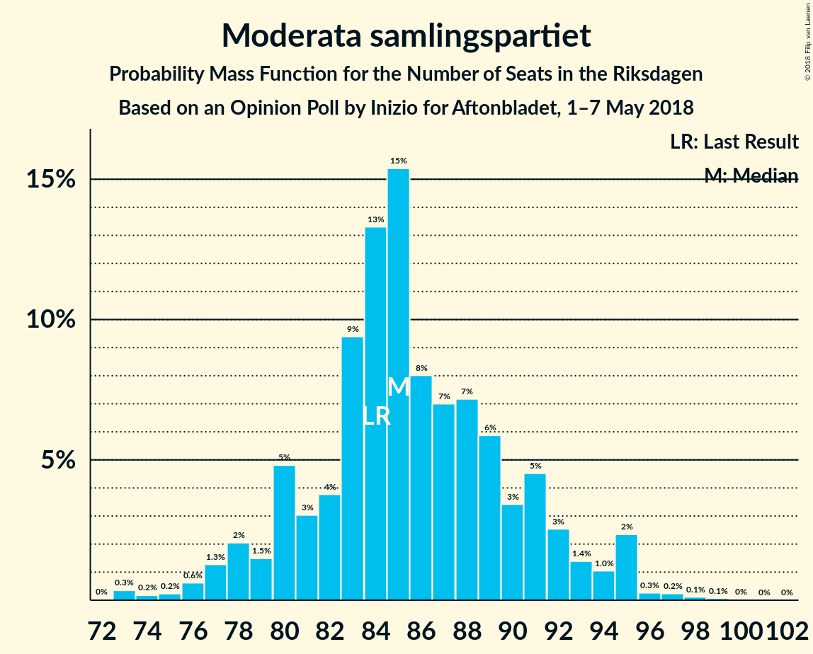
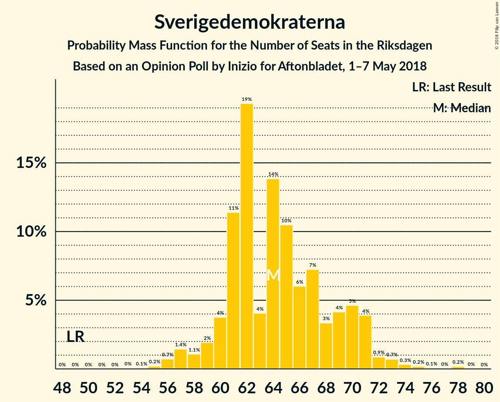
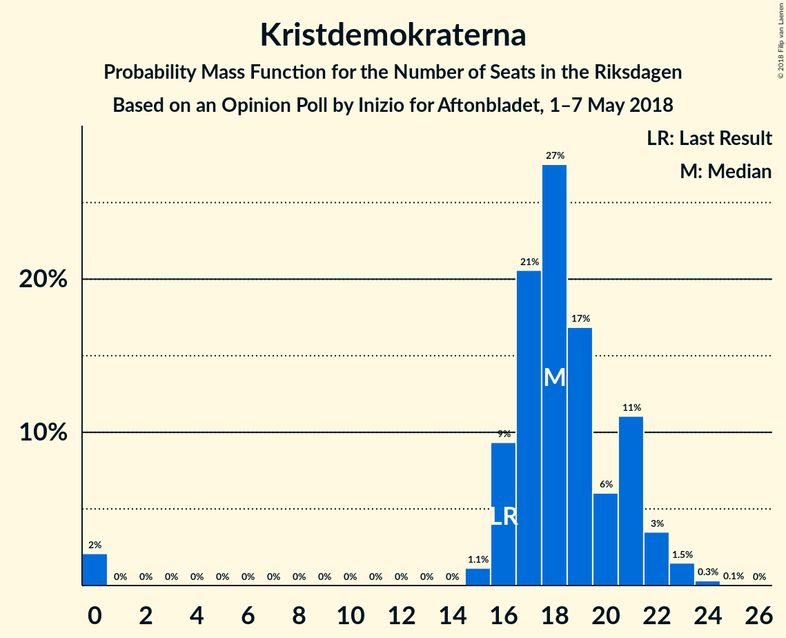
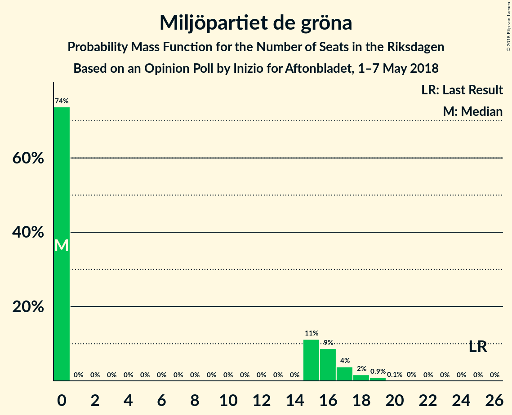
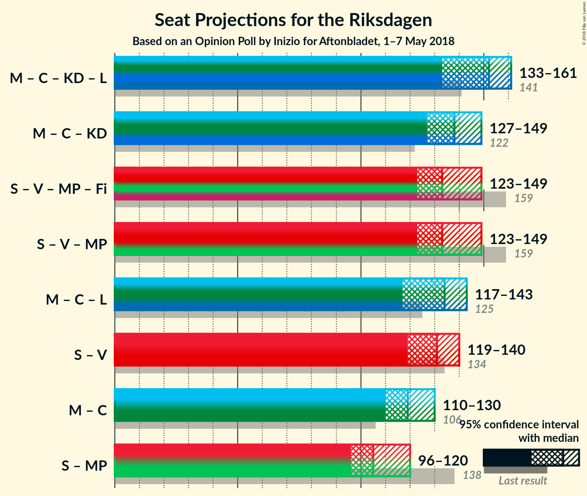

# Opinion Poll by Inizio for Aftonbladet, 1–7 May 2018

<a href="#voting-intentions">Voting Intentions</a> | <a href="#seats">Seats</a> | <a href="#coalitions">Coalitions</a> | <a href="#technical-information">Technical Information</a>

## Voting Intentions

### Confidence Intervals

| Party | Last Result | Poll Result | 80% Confidence Interval | 90% Confidence Interval | 95% Confidence Interval | 99% Confidence Interval |
|:-----:|:-----------:|:-----------:|:-----------------------:|:-----------------------:|:-----------------------:|:-----------------------:|
| Sveriges socialdemokratiska arbetareparti | 31.0% | 26.6% | 25.4–27.8% |25.1–28.2% |24.8–28.5% |24.2–29.1% |
| Moderata samlingspartiet | 23.3% | 22.4% | 21.3–23.6% |21.0–23.9% |20.7–24.2% |20.2–24.8% |
| Sverigedemokraterna | 12.9% | 16.9% | 15.9–18.0% |15.7–18.3% |15.4–18.5% |15.0–19.0% |
| Centerpartiet | 6.1% | 9.0% | 8.3–9.8% |8.1–10.1% |7.9–10.3% |7.6–10.7% |
| Vänsterpartiet | 5.7% | 7.4% | 6.7–8.2% |6.6–8.4% |6.4–8.6% |6.1–8.9% |
| Kristdemokraterna | 4.6% | 4.8% | 4.3–5.4% |4.1–5.6% |4.0–5.8% |3.7–6.1% |
| Liberalerna | 5.4% | 4.2% | 3.7–4.8% |3.6–5.0% |3.5–5.1% |3.2–5.4% |
| Miljöpartiet de gröna | 6.9% | 3.8% | 3.3–4.4% |3.2–4.6% |3.1–4.7% |2.9–5.0% |
| Feministiskt initiativ | 3.1% | 2.5% | 2.1–3.0% |2.0–3.1% |1.9–3.2% |1.8–3.5% |

*Note:* The poll result column reflects the actual value used in the calculations. Published results may vary slightly, and in addition be rounded to fewer digits.

## Seats

### Confidence Intervals

| Party | Last Result | Median | 80% Confidence Interval | 90% Confidence Interval | 95% Confidence Interval | 99% Confidence Interval |
|:-----:|:-----------:|:------:|:-----------------------:|:-----------------------:|:-----------------------:|:-----------------------:|
| <a href="#sveriges-socialdemokratiska-arbetareparti">Sveriges socialdemokratiska arbetareparti</a> | 113 | 102 | 96–107 |94–109 |93–111 |91–114 |
| <a href="#moderata-samlingspartiet">Moderata samlingspartiet</a> | 84 | 85 | 80–89 |80–92 |78–93 |73–97 |
| <a href="#sverigedemokraterna">Sverigedemokraterna</a> | 49 | 63 | 61–70 |60–71 |57–71 |56–75 |
| <a href="#centerpartiet">Centerpartiet</a> | 22 | 35 | 32–38 |30–39 |29–40 |28–41 |
| <a href="#vänsterpartiet">Vänsterpartiet</a> | 21 | 29 | 26–31 |25–32 |24–32 |22–34 |
| <a href="#kristdemokraterna">Kristdemokraterna</a> | 16 | 18 | 17–21 |16–21 |0–22 |0–23 |
| <a href="#liberalerna">Liberalerna</a> | 19 | 16 | 0–18 |0–19 |0–20 |0–20 |
| <a href="#miljöpartiet-de-gröna">Miljöpartiet de gröna</a> | 25 | 0 | 0–16 |0–17 |0–18 |0–19 |
| <a href="#feministiskt-initiativ">Feministiskt initiativ</a> | 0 | 0 | 0 |0 |0 |0 |

### Sveriges socialdemokratiska arbetareparti

*For a full overview of the results for this party, see the [Sveriges socialdemokratiska arbetareparti](party-sverigessocialdemokratiskaarbetareparti.html) page.*

| Number of Seats | Probability | Accumulated | Special Marks |
|:---------------:|:-----------:|:-----------:|:-------------:|
| 87 | 0% | 100% |  |
| 88 | 0.1% | 99.9% |  |
| 89 | 0.1% | 99.9% |  |
| 90 | 0.1% | 99.7% |  |
| 91 | 1.2% | 99.6% |  |
| 92 | 0.6% | 98% |  |
| 93 | 2% | 98% |  |
| 94 | 2% | 96% |  |
| 95 | 2% | 93% |  |
| 96 | 2% | 91% |  |
| 97 | 4% | 89% |  |
| 98 | 10% | 85% |  |
| 99 | 6% | 75% |  |
| 100 | 14% | 69% |  |
| 101 | 3% | 55% |  |
| 102 | 21% | 53% | Median |
| 103 | 7% | 32% |  |
| 104 | 3% | 24% |  |
| 105 | 9% | 22% |  |
| 106 | 2% | 13% |  |
| 107 | 2% | 11% |  |
| 108 | 3% | 9% |  |
| 109 | 2% | 6% |  |
| 110 | 0.9% | 4% |  |
| 111 | 0.8% | 3% |  |
| 112 | 0.4% | 2% |  |
| 113 | 1.2% | 2% | Last Result |
| 114 | 0.5% | 0.7% |  |
| 115 | 0% | 0.3% |  |
| 116 | 0.1% | 0.2% |  |
| 117 | 0.1% | 0.2% |  |
| 118 | 0% | 0% |  |

### Moderata samlingspartiet

*For a full overview of the results for this party, see the [Moderata samlingspartiet](party-moderatasamlingspartiet.html) page.*

| Number of Seats | Probability | Accumulated | Special Marks |
|:---------------:|:-----------:|:-----------:|:-------------:|
| 73 | 0.7% | 100% |  |
| 74 | 0.1% | 99.3% |  |
| 75 | 0.3% | 99.2% |  |
| 76 | 0.7% | 98.9% |  |
| 77 | 0.6% | 98% |  |
| 78 | 1.3% | 98% |  |
| 79 | 0.7% | 96% |  |
| 80 | 6% | 96% |  |
| 81 | 4% | 89% |  |
| 82 | 3% | 85% |  |
| 83 | 4% | 83% |  |
| 84 | 10% | 78% | Last Result |
| 85 | 25% | 69% | Median |
| 86 | 11% | 44% |  |
| 87 | 5% | 33% |  |
| 88 | 9% | 28% |  |
| 89 | 9% | 18% |  |
| 90 | 3% | 10% |  |
| 91 | 1.1% | 7% |  |
| 92 | 2% | 6% |  |
| 93 | 2% | 4% |  |
| 94 | 0.5% | 2% |  |
| 95 | 0.4% | 1.3% |  |
| 96 | 0.3% | 0.9% |  |
| 97 | 0.3% | 0.5% |  |
| 98 | 0.1% | 0.3% |  |
| 99 | 0% | 0.1% |  |
| 100 | 0.1% | 0.1% |  |
| 101 | 0% | 0% |  |

### Sverigedemokraterna

*For a full overview of the results for this party, see the [Sverigedemokraterna](party-sverigedemokraterna.html) page.*

| Number of Seats | Probability | Accumulated | Special Marks |
|:---------------:|:-----------:|:-----------:|:-------------:|
| 49 | 0% | 100% | Last Result |
| 50 | 0% | 100% |  |
| 51 | 0% | 100% |  |
| 52 | 0% | 100% |  |
| 53 | 0% | 100% |  |
| 54 | 0.1% | 100% |  |
| 55 | 0.2% | 99.9% |  |
| 56 | 1.0% | 99.7% |  |
| 57 | 1.3% | 98.7% |  |
| 58 | 0.9% | 97% |  |
| 59 | 1.3% | 96% |  |
| 60 | 4% | 95% |  |
| 61 | 15% | 91% |  |
| 62 | 23% | 76% |  |
| 63 | 5% | 54% | Median |
| 64 | 6% | 49% |  |
| 65 | 10% | 42% |  |
| 66 | 5% | 32% |  |
| 67 | 5% | 27% |  |
| 68 | 3% | 22% |  |
| 69 | 6% | 19% |  |
| 70 | 4% | 12% |  |
| 71 | 6% | 8% |  |
| 72 | 0.7% | 2% |  |
| 73 | 0.3% | 1.5% |  |
| 74 | 0.5% | 1.2% |  |
| 75 | 0.2% | 0.7% |  |
| 76 | 0.1% | 0.5% |  |
| 77 | 0% | 0.4% |  |
| 78 | 0.3% | 0.4% |  |
| 79 | 0% | 0% |  |

### Centerpartiet

*For a full overview of the results for this party, see the [Centerpartiet](party-centerpartiet.html) page.*

| Number of Seats | Probability | Accumulated | Special Marks |
|:---------------:|:-----------:|:-----------:|:-------------:|
| 22 | 0% | 100% | Last Result |
| 23 | 0% | 100% |  |
| 24 | 0% | 100% |  |
| 25 | 0% | 100% |  |
| 26 | 0% | 100% |  |
| 27 | 0.2% | 100% |  |
| 28 | 0.9% | 99.7% |  |
| 29 | 2% | 98.8% |  |
| 30 | 2% | 97% |  |
| 31 | 4% | 95% |  |
| 32 | 5% | 91% |  |
| 33 | 11% | 86% |  |
| 34 | 15% | 75% |  |
| 35 | 25% | 60% | Median |
| 36 | 11% | 35% |  |
| 37 | 15% | 25% |  |
| 38 | 5% | 10% |  |
| 39 | 2% | 5% |  |
| 40 | 2% | 3% |  |
| 41 | 1.1% | 1.4% |  |
| 42 | 0.1% | 0.3% |  |
| 43 | 0.1% | 0.2% |  |
| 44 | 0% | 0% |  |

### Vänsterpartiet

*For a full overview of the results for this party, see the [Vänsterpartiet](party-vänsterpartiet.html) page.*

| Number of Seats | Probability | Accumulated | Special Marks |
|:---------------:|:-----------:|:-----------:|:-------------:|
| 21 | 0% | 100% | Last Result |
| 22 | 0.5% | 100% |  |
| 23 | 0.9% | 99.4% |  |
| 24 | 2% | 98.5% |  |
| 25 | 3% | 96% |  |
| 26 | 11% | 93% |  |
| 27 | 12% | 82% |  |
| 28 | 17% | 71% |  |
| 29 | 20% | 54% | Median |
| 30 | 9% | 34% |  |
| 31 | 20% | 25% |  |
| 32 | 3% | 5% |  |
| 33 | 1.4% | 2% |  |
| 34 | 0.6% | 1.1% |  |
| 35 | 0.3% | 0.5% |  |
| 36 | 0.1% | 0.2% |  |
| 37 | 0% | 0% |  |

### Kristdemokraterna

*For a full overview of the results for this party, see the [Kristdemokraterna](party-kristdemokraterna.html) page.*

| Number of Seats | Probability | Accumulated | Special Marks |
|:---------------:|:-----------:|:-----------:|:-------------:|
| 0 | 3% | 100% |  |
| 1 | 0% | 97% |  |
| 2 | 0% | 97% |  |
| 3 | 0% | 97% |  |
| 4 | 0% | 97% |  |
| 5 | 0% | 97% |  |
| 6 | 0% | 97% |  |
| 7 | 0% | 97% |  |
| 8 | 0% | 97% |  |
| 9 | 0% | 97% |  |
| 10 | 0% | 97% |  |
| 11 | 0% | 97% |  |
| 12 | 0% | 97% |  |
| 13 | 0% | 97% |  |
| 14 | 0% | 97% |  |
| 15 | 0.9% | 97% |  |
| 16 | 5% | 96% | Last Result |
| 17 | 15% | 91% |  |
| 18 | 35% | 76% | Median |
| 19 | 16% | 41% |  |
| 20 | 5% | 25% |  |
| 21 | 16% | 20% |  |
| 22 | 2% | 4% |  |
| 23 | 1.3% | 2% |  |
| 24 | 0.1% | 0.2% |  |
| 25 | 0.1% | 0.1% |  |
| 26 | 0% | 0% |  |

### Liberalerna

*For a full overview of the results for this party, see the [Liberalerna](party-liberalerna.html) page.*

| Number of Seats | Probability | Accumulated | Special Marks |
|:---------------:|:-----------:|:-----------:|:-------------:|
| 0 | 27% | 100% |  |
| 1 | 0% | 73% |  |
| 2 | 0% | 73% |  |
| 3 | 0% | 73% |  |
| 4 | 0% | 73% |  |
| 5 | 0% | 73% |  |
| 6 | 0% | 73% |  |
| 7 | 0% | 73% |  |
| 8 | 0% | 73% |  |
| 9 | 0% | 73% |  |
| 10 | 0% | 73% |  |
| 11 | 0% | 73% |  |
| 12 | 0% | 73% |  |
| 13 | 0% | 73% |  |
| 14 | 0% | 73% |  |
| 15 | 6% | 73% |  |
| 16 | 23% | 67% | Median |
| 17 | 15% | 44% |  |
| 18 | 22% | 29% |  |
| 19 | 5% | 8% | Last Result |
| 20 | 2% | 3% |  |
| 21 | 0.3% | 0.4% |  |
| 22 | 0.1% | 0.1% |  |
| 23 | 0% | 0% |  |

### Miljöpartiet de gröna

*For a full overview of the results for this party, see the [Miljöpartiet de gröna](party-miljöpartietdegröna.html) page.*

| Number of Seats | Probability | Accumulated | Special Marks |
|:---------------:|:-----------:|:-----------:|:-------------:|
| 0 | 75% | 100% | Median |
| 1 | 0% | 25% |  |
| 2 | 0% | 25% |  |
| 3 | 0% | 25% |  |
| 4 | 0% | 25% |  |
| 5 | 0% | 25% |  |
| 6 | 0% | 25% |  |
| 7 | 0% | 25% |  |
| 8 | 0% | 25% |  |
| 9 | 0% | 25% |  |
| 10 | 0% | 25% |  |
| 11 | 0% | 25% |  |
| 12 | 0% | 25% |  |
| 13 | 0% | 25% |  |
| 14 | 0% | 25% |  |
| 15 | 8% | 25% |  |
| 16 | 9% | 17% |  |
| 17 | 4% | 8% |  |
| 18 | 2% | 3% |  |
| 19 | 1.3% | 1.3% |  |
| 20 | 0% | 0.1% |  |
| 21 | 0% | 0% |  |
| 22 | 0% | 0% |  |
| 23 | 0% | 0% |  |
| 24 | 0% | 0% |  |
| 25 | 0% | 0% | Last Result |

### Feministiskt initiativ

*For a full overview of the results for this party, see the [Feministiskt initiativ](party-feministisktinitiativ.html) page.*

| Number of Seats | Probability | Accumulated | Special Marks |
|:---------------:|:-----------:|:-----------:|:-------------:|
| 0 | 100% | 100% | Last Result, Median |

## Coalitions

### Confidence Intervals

| Coalition | Last Result | Median | Majority? | 80% Confidence Interval | 90% Confidence Interval | 95% Confidence Interval | 99% Confidence Interval |
|:---------:|:-----------:|:------:|:---------:|:-----------------------:|:-----------------------:|:-----------------------:|:-----------------------:|
| Moderata samlingspartiet – Centerpartiet – Kristdemokraterna – Liberalerna | 141 | 152 | 0% | 139–159 | 138–160 | 133–161 | 130–163 |
| Sveriges socialdemokratiska arbetareparti – Vänsterpartiet – Miljöpartiet de gröna – Feministiskt initiativ | 159 | 132 | 0% | 128–143 | 126–146 | 123–150 | 121–154 |
| Sveriges socialdemokratiska arbetareparti – Vänsterpartiet – Miljöpartiet de gröna | 159 | 132 | 0% | 128–143 | 126–146 | 123–150 | 121–154 |
| Moderata samlingspartiet – Centerpartiet – Kristdemokraterna | 122 | 138 | 0% | 132–144 | 129–145 | 127–147 | 121–151 |
| Moderata samlingspartiet – Centerpartiet – Liberalerna | 125 | 135 | 0% | 122–141 | 119–141 | 116–143 | 114–145 |
| Sveriges socialdemokratiska arbetareparti – Vänsterpartiet | 134 | 130 | 0% | 123–136 | 121–139 | 119–140 | 117–144 |
| Moderata samlingspartiet – Centerpartiet | 106 | 120 | 0% | 114–125 | 113–127 | 111–129 | 108–134 |
| Sveriges socialdemokratiska arbetareparti – Miljöpartiet de gröna | 138 | 103 | 0% | 98–115 | 97–118 | 95–120 | 93–127 |

### Moderata samlingspartiet – Centerpartiet – Kristdemokraterna – Liberalerna

| Number of Seats | Probability | Accumulated | Special Marks |
|:---------------:|:-----------:|:-----------:|:-------------:|
| 120 | 0% | 100% |  |
| 121 | 0% | 99.9% |  |
| 122 | 0% | 99.9% |  |
| 123 | 0% | 99.9% |  |
| 124 | 0.1% | 99.9% |  |
| 125 | 0% | 99.9% |  |
| 126 | 0% | 99.8% |  |
| 127 | 0% | 99.8% |  |
| 128 | 0.1% | 99.8% |  |
| 129 | 0% | 99.7% |  |
| 130 | 0.4% | 99.6% |  |
| 131 | 0.4% | 99.3% |  |
| 132 | 0.6% | 98.9% |  |
| 133 | 1.2% | 98% |  |
| 134 | 0.1% | 97% |  |
| 135 | 0.5% | 97% |  |
| 136 | 0.9% | 96% |  |
| 137 | 0.3% | 96% |  |
| 138 | 5% | 95% |  |
| 139 | 1.4% | 90% |  |
| 140 | 1.5% | 89% |  |
| 141 | 1.5% | 87% | Last Result |
| 142 | 0.9% | 86% |  |
| 143 | 2% | 85% |  |
| 144 | 9% | 83% |  |
| 145 | 3% | 75% |  |
| 146 | 2% | 72% |  |
| 147 | 2% | 70% |  |
| 148 | 2% | 69% |  |
| 149 | 2% | 66% |  |
| 150 | 10% | 65% |  |
| 151 | 2% | 55% |  |
| 152 | 3% | 53% |  |
| 153 | 1.3% | 50% |  |
| 154 | 4% | 49% | Median |
| 155 | 2% | 45% |  |
| 156 | 21% | 43% |  |
| 157 | 3% | 22% |  |
| 158 | 1.0% | 19% |  |
| 159 | 11% | 18% |  |
| 160 | 3% | 6% |  |
| 161 | 2% | 4% |  |
| 162 | 1.3% | 2% |  |
| 163 | 0.4% | 0.8% |  |
| 164 | 0.2% | 0.4% |  |
| 165 | 0.1% | 0.2% |  |
| 166 | 0% | 0.1% |  |
| 167 | 0% | 0% |  |

### Sveriges socialdemokratiska arbetareparti – Vänsterpartiet – Miljöpartiet de gröna – Feministiskt initiativ

| Number of Seats | Probability | Accumulated | Special Marks |
|:---------------:|:-----------:|:-----------:|:-------------:|
| 119 | 0% | 100% |  |
| 120 | 0.1% | 99.9% |  |
| 121 | 0.8% | 99.9% |  |
| 122 | 0.4% | 99.1% |  |
| 123 | 1.3% | 98.7% |  |
| 124 | 1.0% | 97% |  |
| 125 | 1.0% | 96% |  |
| 126 | 1.4% | 95% |  |
| 127 | 3% | 94% |  |
| 128 | 7% | 91% |  |
| 129 | 8% | 84% |  |
| 130 | 8% | 76% |  |
| 131 | 16% | 68% | Median |
| 132 | 7% | 53% |  |
| 133 | 1.5% | 45% |  |
| 134 | 8% | 44% |  |
| 135 | 3% | 36% |  |
| 136 | 3% | 33% |  |
| 137 | 2% | 30% |  |
| 138 | 2% | 28% |  |
| 139 | 4% | 26% |  |
| 140 | 4% | 22% |  |
| 141 | 5% | 18% |  |
| 142 | 1.4% | 12% |  |
| 143 | 2% | 11% |  |
| 144 | 1.3% | 8% |  |
| 145 | 1.1% | 7% |  |
| 146 | 1.1% | 6% |  |
| 147 | 0.7% | 5% |  |
| 148 | 1.0% | 4% |  |
| 149 | 0.2% | 3% |  |
| 150 | 2% | 3% |  |
| 151 | 0.2% | 1.3% |  |
| 152 | 0.3% | 1.1% |  |
| 153 | 0.1% | 0.7% |  |
| 154 | 0.3% | 0.7% |  |
| 155 | 0.2% | 0.3% |  |
| 156 | 0.1% | 0.2% |  |
| 157 | 0% | 0.1% |  |
| 158 | 0% | 0.1% |  |
| 159 | 0% | 0% | Last Result |

### Sveriges socialdemokratiska arbetareparti – Vänsterpartiet – Miljöpartiet de gröna

| Number of Seats | Probability | Accumulated | Special Marks |
|:---------------:|:-----------:|:-----------:|:-------------:|
| 119 | 0% | 100% |  |
| 120 | 0.1% | 99.9% |  |
| 121 | 0.8% | 99.9% |  |
| 122 | 0.4% | 99.1% |  |
| 123 | 1.3% | 98.7% |  |
| 124 | 1.0% | 97% |  |
| 125 | 1.0% | 96% |  |
| 126 | 1.4% | 95% |  |
| 127 | 3% | 94% |  |
| 128 | 7% | 91% |  |
| 129 | 8% | 84% |  |
| 130 | 8% | 76% |  |
| 131 | 16% | 68% | Median |
| 132 | 7% | 53% |  |
| 133 | 1.5% | 45% |  |
| 134 | 8% | 44% |  |
| 135 | 3% | 36% |  |
| 136 | 3% | 33% |  |
| 137 | 2% | 30% |  |
| 138 | 2% | 28% |  |
| 139 | 4% | 26% |  |
| 140 | 4% | 22% |  |
| 141 | 5% | 18% |  |
| 142 | 1.4% | 12% |  |
| 143 | 2% | 11% |  |
| 144 | 1.3% | 8% |  |
| 145 | 1.1% | 7% |  |
| 146 | 1.1% | 6% |  |
| 147 | 0.7% | 5% |  |
| 148 | 1.0% | 4% |  |
| 149 | 0.2% | 3% |  |
| 150 | 2% | 3% |  |
| 151 | 0.2% | 1.3% |  |
| 152 | 0.3% | 1.1% |  |
| 153 | 0.1% | 0.7% |  |
| 154 | 0.3% | 0.7% |  |
| 155 | 0.2% | 0.3% |  |
| 156 | 0.1% | 0.2% |  |
| 157 | 0% | 0.1% |  |
| 158 | 0% | 0.1% |  |
| 159 | 0% | 0% | Last Result |

### Moderata samlingspartiet – Centerpartiet – Kristdemokraterna

| Number of Seats | Probability | Accumulated | Special Marks |
|:---------------:|:-----------:|:-----------:|:-------------:|
| 118 | 0.1% | 100% |  |
| 119 | 0% | 99.9% |  |
| 120 | 0.1% | 99.9% |  |
| 121 | 0.4% | 99.7% |  |
| 122 | 0.2% | 99.3% | Last Result |
| 123 | 0.3% | 99.1% |  |
| 124 | 0.1% | 98.8% |  |
| 125 | 0.2% | 98.7% |  |
| 126 | 0.5% | 98% |  |
| 127 | 1.2% | 98% |  |
| 128 | 0.7% | 97% |  |
| 129 | 1.5% | 96% |  |
| 130 | 1.2% | 95% |  |
| 131 | 1.3% | 93% |  |
| 132 | 3% | 92% |  |
| 133 | 9% | 89% |  |
| 134 | 2% | 80% |  |
| 135 | 5% | 78% |  |
| 136 | 3% | 73% |  |
| 137 | 3% | 70% |  |
| 138 | 21% | 67% | Median |
| 139 | 3% | 45% |  |
| 140 | 10% | 43% |  |
| 141 | 2% | 33% |  |
| 142 | 3% | 31% |  |
| 143 | 12% | 29% |  |
| 144 | 9% | 16% |  |
| 145 | 3% | 7% |  |
| 146 | 1.2% | 4% |  |
| 147 | 0.7% | 3% |  |
| 148 | 0.7% | 2% |  |
| 149 | 0.1% | 2% |  |
| 150 | 0.7% | 1.4% |  |
| 151 | 0.4% | 0.7% |  |
| 152 | 0% | 0.3% |  |
| 153 | 0% | 0.3% |  |
| 154 | 0.1% | 0.2% |  |
| 155 | 0.1% | 0.1% |  |
| 156 | 0% | 0.1% |  |
| 157 | 0% | 0% |  |

### Moderata samlingspartiet – Centerpartiet – Liberalerna

| Number of Seats | Probability | Accumulated | Special Marks |
|:---------------:|:-----------:|:-----------:|:-------------:|
| 112 | 0% | 100% |  |
| 113 | 0.1% | 99.9% |  |
| 114 | 2% | 99.8% |  |
| 115 | 0.3% | 98% |  |
| 116 | 0.8% | 98% |  |
| 117 | 0.2% | 97% |  |
| 118 | 0.5% | 97% |  |
| 119 | 4% | 96% |  |
| 120 | 1.0% | 92% |  |
| 121 | 0.9% | 91% |  |
| 122 | 1.2% | 90% |  |
| 123 | 8% | 89% |  |
| 124 | 2% | 81% |  |
| 125 | 1.2% | 80% | Last Result |
| 126 | 2% | 78% |  |
| 127 | 3% | 77% |  |
| 128 | 1.2% | 74% |  |
| 129 | 3% | 72% |  |
| 130 | 2% | 69% |  |
| 131 | 7% | 67% |  |
| 132 | 2% | 60% |  |
| 133 | 3% | 58% |  |
| 134 | 4% | 55% |  |
| 135 | 8% | 51% |  |
| 136 | 2% | 44% | Median |
| 137 | 4% | 42% |  |
| 138 | 16% | 38% |  |
| 139 | 4% | 23% |  |
| 140 | 3% | 19% |  |
| 141 | 11% | 16% |  |
| 142 | 1.3% | 5% |  |
| 143 | 2% | 3% |  |
| 144 | 0.3% | 1.4% |  |
| 145 | 0.6% | 1.1% |  |
| 146 | 0.1% | 0.5% |  |
| 147 | 0.1% | 0.4% |  |
| 148 | 0.1% | 0.3% |  |
| 149 | 0.1% | 0.2% |  |
| 150 | 0% | 0.1% |  |
| 151 | 0% | 0% |  |

### Sveriges socialdemokratiska arbetareparti – Vänsterpartiet

| Number of Seats | Probability | Accumulated | Special Marks |
|:---------------:|:-----------:|:-----------:|:-------------:|
| 113 | 0% | 100% |  |
| 114 | 0% | 99.9% |  |
| 115 | 0.2% | 99.9% |  |
| 116 | 0.1% | 99.7% |  |
| 117 | 1.1% | 99.6% |  |
| 118 | 0.9% | 98.5% |  |
| 119 | 0.4% | 98% |  |
| 120 | 1.2% | 97% |  |
| 121 | 1.4% | 96% |  |
| 122 | 1.3% | 95% |  |
| 123 | 3% | 93% |  |
| 124 | 3% | 90% |  |
| 125 | 2% | 87% |  |
| 126 | 6% | 84% |  |
| 127 | 4% | 78% |  |
| 128 | 8% | 74% |  |
| 129 | 10% | 66% |  |
| 130 | 8% | 55% |  |
| 131 | 16% | 47% | Median |
| 132 | 8% | 31% |  |
| 133 | 2% | 23% |  |
| 134 | 7% | 21% | Last Result |
| 135 | 3% | 15% |  |
| 136 | 2% | 12% |  |
| 137 | 2% | 10% |  |
| 138 | 1.1% | 8% |  |
| 139 | 2% | 7% |  |
| 140 | 3% | 5% |  |
| 141 | 0.3% | 2% |  |
| 142 | 0.5% | 2% |  |
| 143 | 0.5% | 1.0% |  |
| 144 | 0.1% | 0.5% |  |
| 145 | 0.1% | 0.5% |  |
| 146 | 0% | 0.4% |  |
| 147 | 0.2% | 0.4% |  |
| 148 | 0% | 0.2% |  |
| 149 | 0.1% | 0.1% |  |
| 150 | 0% | 0.1% |  |
| 151 | 0% | 0.1% |  |
| 152 | 0% | 0% |  |

### Moderata samlingspartiet – Centerpartiet

| Number of Seats | Probability | Accumulated | Special Marks |
|:---------------:|:-----------:|:-----------:|:-------------:|
| 105 | 0.2% | 100% |  |
| 106 | 0% | 99.8% | Last Result |
| 107 | 0.1% | 99.7% |  |
| 108 | 0.5% | 99.6% |  |
| 109 | 0.5% | 99.1% |  |
| 110 | 0.6% | 98.6% |  |
| 111 | 2% | 98% |  |
| 112 | 0.6% | 96% |  |
| 113 | 2% | 96% |  |
| 114 | 7% | 93% |  |
| 115 | 4% | 87% |  |
| 116 | 5% | 83% |  |
| 117 | 3% | 78% |  |
| 118 | 4% | 75% |  |
| 119 | 12% | 71% |  |
| 120 | 18% | 59% | Median |
| 121 | 4% | 42% |  |
| 122 | 3% | 37% |  |
| 123 | 11% | 35% |  |
| 124 | 3% | 24% |  |
| 125 | 11% | 21% |  |
| 126 | 3% | 10% |  |
| 127 | 3% | 7% |  |
| 128 | 1.1% | 4% |  |
| 129 | 0.9% | 3% |  |
| 130 | 0.4% | 2% |  |
| 131 | 0.9% | 2% |  |
| 132 | 0.1% | 0.9% |  |
| 133 | 0.2% | 0.8% |  |
| 134 | 0.2% | 0.6% |  |
| 135 | 0.1% | 0.5% |  |
| 136 | 0.1% | 0.4% |  |
| 137 | 0% | 0.3% |  |
| 138 | 0.3% | 0.3% |  |
| 139 | 0% | 0% |  |

### Sveriges socialdemokratiska arbetareparti – Miljöpartiet de gröna

| Number of Seats | Probability | Accumulated | Special Marks |
|:---------------:|:-----------:|:-----------:|:-------------:|
| 92 | 0.1% | 100% |  |
| 93 | 0.9% | 99.9% |  |
| 94 | 0.8% | 99.0% |  |
| 95 | 0.8% | 98% |  |
| 96 | 0.8% | 97% |  |
| 97 | 3% | 97% |  |
| 98 | 7% | 94% |  |
| 99 | 3% | 87% |  |
| 100 | 8% | 83% |  |
| 101 | 2% | 75% |  |
| 102 | 20% | 73% | Median |
| 103 | 7% | 53% |  |
| 104 | 2% | 47% |  |
| 105 | 8% | 45% |  |
| 106 | 2% | 37% |  |
| 107 | 3% | 34% |  |
| 108 | 4% | 32% |  |
| 109 | 3% | 28% |  |
| 110 | 2% | 25% |  |
| 111 | 2% | 23% |  |
| 112 | 0.8% | 21% |  |
| 113 | 3% | 20% |  |
| 114 | 3% | 17% |  |
| 115 | 5% | 14% |  |
| 116 | 2% | 9% |  |
| 117 | 0.6% | 6% |  |
| 118 | 2% | 6% |  |
| 119 | 1.3% | 4% |  |
| 120 | 0.6% | 3% |  |
| 121 | 0.7% | 2% |  |
| 122 | 0.8% | 2% |  |
| 123 | 0.1% | 0.9% |  |
| 124 | 0.1% | 0.8% |  |
| 125 | 0.1% | 0.7% |  |
| 126 | 0.1% | 0.6% |  |
| 127 | 0.3% | 0.5% |  |
| 128 | 0.1% | 0.2% |  |
| 129 | 0% | 0.1% |  |
| 130 | 0% | 0% |  |
| 131 | 0% | 0% |  |
| 132 | 0% | 0% |  |
| 133 | 0% | 0% |  |
| 134 | 0% | 0% |  |
| 135 | 0% | 0% |  |
| 136 | 0% | 0% |  |
| 137 | 0% | 0% |  |
| 138 | 0% | 0% | Last Result |

## Technical Information

### Opinion Poll

+ **Polling firm:** Inizio
+ **Commissioner(s):** Aftonbladet
+ **Fieldwork period:** 1–7 May 2018

### Calculations

+ **Sample size:** 2253
+ **Simulations done:** 524,288
+ **Error estimate:** 0.76%

