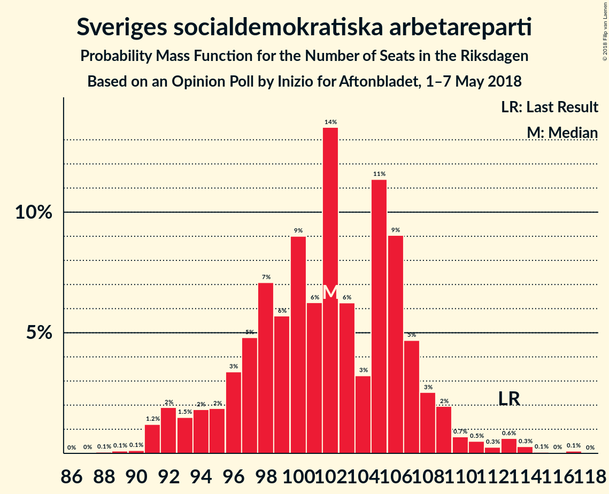

# Opinion Poll by Inizio for Aftonbladet, 1–7 May 2018

<a href="#voting-intentions">Voting Intentions</a> | <a href="#seats">Seats</a> | <a href="#coalitions">Coalitions</a> | <a href="#technical-information">Technical Information</a>

## Voting Intentions

### Confidence Intervals

| Party | Last Result | Poll Result | 80% Confidence Interval | 90% Confidence Interval | 95% Confidence Interval | 99% Confidence Interval |
|:-----:|:-----------:|:-----------:|:-----------------------:|:-----------------------:|:-----------------------:|:-----------------------:|
| Sveriges socialdemokratiska arbetareparti | 31.0% | 26.6% | 25.4–27.8% |25.1–28.2% |24.8–28.5% |24.2–29.1% |
| Moderata samlingspartiet | 23.3% | 22.4% | 21.3–23.6% |21.0–23.9% |20.7–24.2% |20.2–24.8% |
| Sverigedemokraterna | 12.9% | 16.9% | 15.9–18.0% |15.7–18.3% |15.4–18.5% |15.0–19.0% |
| Centerpartiet | 6.1% | 9.0% | 8.3–9.8% |8.1–10.1% |7.9–10.3% |7.6–10.7% |
| Vänsterpartiet | 5.7% | 7.4% | 6.7–8.2% |6.6–8.4% |6.4–8.6% |6.1–8.9% |
| Kristdemokraterna | 4.6% | 4.8% | 4.3–5.4% |4.1–5.6% |4.0–5.8% |3.7–6.1% |
| Liberalerna | 5.4% | 4.2% | 3.7–4.8% |3.6–5.0% |3.5–5.1% |3.2–5.4% |
| Miljöpartiet de gröna | 6.9% | 3.8% | 3.3–4.4% |3.2–4.6% |3.1–4.7% |2.9–5.0% |
| Feministiskt initiativ | 3.1% | 2.5% | 2.1–3.0% |2.0–3.1% |1.9–3.2% |1.8–3.5% |

*Note:* The poll result column reflects the actual value used in the calculations. Published results may vary slightly, and in addition be rounded to fewer digits.

## Seats

### Confidence Intervals

| Party | Last Result | Median | 80% Confidence Interval | 90% Confidence Interval | 95% Confidence Interval | 99% Confidence Interval |
|:-----:|:-----------:|:------:|:-----------------------:|:-----------------------:|:-----------------------:|:-----------------------:|
| <a href="#sveriges-socialdemokratiska-arbetareparti">Sveriges socialdemokratiska arbetareparti</a> | 113 | 102 | 96–107 |94–108 |92–110 |91–114 |
| <a href="#moderata-samlingspartiet">Moderata samlingspartiet</a> | 84 | 85 | 80–91 |79–93 |77–95 |74–96 |
| <a href="#sverigedemokraterna">Sverigedemokraterna</a> | 49 | 64 | 61–70 |59–71 |58–71 |56–74 |
| <a href="#centerpartiet">Centerpartiet</a> | 22 | 35 | 31–37 |30–38 |29–39 |28–41 |
| <a href="#vänsterpartiet">Vänsterpartiet</a> | 21 | 29 | 26–31 |25–31 |24–32 |23–35 |
| <a href="#kristdemokraterna">Kristdemokraterna</a> | 16 | 18 | 16–21 |16–22 |15–22 |0–23 |
| <a href="#liberalerna">Liberalerna</a> | 19 | 16 | 0–18 |0–19 |0–19 |0–20 |
| <a href="#miljöpartiet-de-gröna">Miljöpartiet de gröna</a> | 25 | 0 | 0–16 |0–17 |0–18 |0–19 |
| <a href="#feministiskt-initiativ">Feministiskt initiativ</a> | 0 | 0 | 0 |0 |0 |0 |

### Sveriges socialdemokratiska arbetareparti

*For a full overview of the results for this party, see the [Sveriges socialdemokratiska arbetareparti](party-sverigessocialdemokratiskaarbetareparti.html) page.*

| Number of Seats | Probability | Accumulated | Special Marks |
|:---------------:|:-----------:|:-----------:|:-------------:|
| 87 | 0% | 100% |  |
| 88 | 0.1% | 99.9% |  |
| 89 | 0.1% | 99.9% |  |
| 90 | 0.1% | 99.8% |  |
| 91 | 1.2% | 99.7% |  |
| 92 | 2% | 98% |  |
| 93 | 1.5% | 97% |  |
| 94 | 2% | 95% |  |
| 95 | 2% | 93% |  |
| 96 | 3% | 91% |  |
| 97 | 5% | 88% |  |
| 98 | 7% | 83% |  |
| 99 | 6% | 76% |  |
| 100 | 9% | 70% |  |
| 101 | 6% | 61% |  |
| 102 | 14% | 55% | Median |
| 103 | 6% | 42% |  |
| 104 | 3% | 35% |  |
| 105 | 11% | 32% |  |
| 106 | 9% | 21% |  |
| 107 | 5% | 12% |  |
| 108 | 3% | 7% |  |
| 109 | 2% | 5% |  |
| 110 | 0.7% | 3% |  |
| 111 | 0.5% | 2% |  |
| 112 | 0.3% | 1.4% |  |
| 113 | 0.6% | 1.1% | Last Result |
| 114 | 0.3% | 0.5% |  |
| 115 | 0.1% | 0.2% |  |
| 116 | 0% | 0.2% |  |
| 117 | 0.1% | 0.1% |  |
| 118 | 0% | 0% |  |

### Moderata samlingspartiet

*For a full overview of the results for this party, see the [Moderata samlingspartiet](party-moderatasamlingspartiet.html) page.*

| Number of Seats | Probability | Accumulated | Special Marks |
|:---------------:|:-----------:|:-----------:|:-------------:|
| 73 | 0.3% | 100% |  |
| 74 | 0.2% | 99.6% |  |
| 75 | 0.2% | 99.4% |  |
| 76 | 0.6% | 99.2% |  |
| 77 | 1.3% | 98.6% |  |
| 78 | 2% | 97% |  |
| 79 | 1.5% | 95% |  |
| 80 | 5% | 94% |  |
| 81 | 3% | 89% |  |
| 82 | 4% | 86% |  |
| 83 | 9% | 82% |  |
| 84 | 13% | 73% | Last Result |
| 85 | 15% | 59% | Median |
| 86 | 8% | 44% |  |
| 87 | 7% | 36% |  |
| 88 | 7% | 29% |  |
| 89 | 6% | 22% |  |
| 90 | 3% | 16% |  |
| 91 | 5% | 13% |  |
| 92 | 3% | 8% |  |
| 93 | 1.4% | 6% |  |
| 94 | 1.0% | 4% |  |
| 95 | 2% | 3% |  |
| 96 | 0.3% | 0.7% |  |
| 97 | 0.2% | 0.5% |  |
| 98 | 0.1% | 0.2% |  |
| 99 | 0.1% | 0.1% |  |
| 100 | 0% | 0.1% |  |
| 101 | 0% | 0% |  |

### Sverigedemokraterna

*For a full overview of the results for this party, see the [Sverigedemokraterna](party-sverigedemokraterna.html) page.*

| Number of Seats | Probability | Accumulated | Special Marks |
|:---------------:|:-----------:|:-----------:|:-------------:|
| 49 | 0% | 100% | Last Result |
| 50 | 0% | 100% |  |
| 51 | 0% | 100% |  |
| 52 | 0% | 100% |  |
| 53 | 0% | 100% |  |
| 54 | 0.1% | 100% |  |
| 55 | 0.2% | 99.9% |  |
| 56 | 0.7% | 99.7% |  |
| 57 | 1.4% | 99.0% |  |
| 58 | 1.1% | 98% |  |
| 59 | 2% | 96% |  |
| 60 | 4% | 95% |  |
| 61 | 11% | 91% |  |
| 62 | 19% | 79% |  |
| 63 | 4% | 60% |  |
| 64 | 14% | 56% | Median |
| 65 | 10% | 42% |  |
| 66 | 6% | 32% |  |
| 67 | 7% | 26% |  |
| 68 | 3% | 18% |  |
| 69 | 4% | 15% |  |
| 70 | 5% | 11% |  |
| 71 | 4% | 6% |  |
| 72 | 0.9% | 2% |  |
| 73 | 0.7% | 1.5% |  |
| 74 | 0.3% | 0.8% |  |
| 75 | 0.2% | 0.5% |  |
| 76 | 0.1% | 0.3% |  |
| 77 | 0% | 0.2% |  |
| 78 | 0.2% | 0.2% |  |
| 79 | 0% | 0% |  |

### Centerpartiet

*For a full overview of the results for this party, see the [Centerpartiet](party-centerpartiet.html) page.*

| Number of Seats | Probability | Accumulated | Special Marks |
|:---------------:|:-----------:|:-----------:|:-------------:|
| 22 | 0% | 100% | Last Result |
| 23 | 0% | 100% |  |
| 24 | 0% | 100% |  |
| 25 | 0% | 100% |  |
| 26 | 0% | 100% |  |
| 27 | 0.2% | 100% |  |
| 28 | 0.9% | 99.8% |  |
| 29 | 3% | 98.9% |  |
| 30 | 2% | 96% |  |
| 31 | 4% | 94% |  |
| 32 | 8% | 90% |  |
| 33 | 9% | 82% |  |
| 34 | 22% | 72% |  |
| 35 | 20% | 51% | Median |
| 36 | 9% | 30% |  |
| 37 | 14% | 21% |  |
| 38 | 4% | 8% |  |
| 39 | 2% | 4% |  |
| 40 | 1.3% | 2% |  |
| 41 | 0.7% | 1.0% |  |
| 42 | 0.2% | 0.3% |  |
| 43 | 0.1% | 0.1% |  |
| 44 | 0% | 0% |  |

### Vänsterpartiet

*For a full overview of the results for this party, see the [Vänsterpartiet](party-vänsterpartiet.html) page.*

| Number of Seats | Probability | Accumulated | Special Marks |
|:---------------:|:-----------:|:-----------:|:-------------:|
| 21 | 0% | 100% | Last Result |
| 22 | 0.4% | 100% |  |
| 23 | 0.8% | 99.6% |  |
| 24 | 3% | 98.8% |  |
| 25 | 4% | 96% |  |
| 26 | 10% | 92% |  |
| 27 | 17% | 82% |  |
| 28 | 15% | 65% |  |
| 29 | 18% | 51% | Median |
| 30 | 16% | 32% |  |
| 31 | 12% | 16% |  |
| 32 | 2% | 5% |  |
| 33 | 1.2% | 2% |  |
| 34 | 0.5% | 1.2% |  |
| 35 | 0.5% | 0.7% |  |
| 36 | 0.1% | 0.1% |  |
| 37 | 0% | 0% |  |

### Kristdemokraterna

*For a full overview of the results for this party, see the [Kristdemokraterna](party-kristdemokraterna.html) page.*

| Number of Seats | Probability | Accumulated | Special Marks |
|:---------------:|:-----------:|:-----------:|:-------------:|
| 0 | 2% | 100% |  |
| 1 | 0% | 98% |  |
| 2 | 0% | 98% |  |
| 3 | 0% | 98% |  |
| 4 | 0% | 98% |  |
| 5 | 0% | 98% |  |
| 6 | 0% | 98% |  |
| 7 | 0% | 98% |  |
| 8 | 0% | 98% |  |
| 9 | 0% | 98% |  |
| 10 | 0% | 98% |  |
| 11 | 0% | 98% |  |
| 12 | 0% | 98% |  |
| 13 | 0% | 98% |  |
| 14 | 0% | 98% |  |
| 15 | 1.1% | 98% |  |
| 16 | 9% | 97% | Last Result |
| 17 | 21% | 87% |  |
| 18 | 27% | 67% | Median |
| 19 | 17% | 39% |  |
| 20 | 6% | 22% |  |
| 21 | 11% | 16% |  |
| 22 | 3% | 5% |  |
| 23 | 1.5% | 2% |  |
| 24 | 0.3% | 0.4% |  |
| 25 | 0.1% | 0.1% |  |
| 26 | 0% | 0% |  |

### Liberalerna

*For a full overview of the results for this party, see the [Liberalerna](party-liberalerna.html) page.*

| Number of Seats | Probability | Accumulated | Special Marks |
|:---------------:|:-----------:|:-----------:|:-------------:|
| 0 | 27% | 100% |  |
| 1 | 0% | 73% |  |
| 2 | 0% | 73% |  |
| 3 | 0% | 73% |  |
| 4 | 0% | 73% |  |
| 5 | 0% | 73% |  |
| 6 | 0% | 73% |  |
| 7 | 0% | 73% |  |
| 8 | 0% | 73% |  |
| 9 | 0% | 73% |  |
| 10 | 0% | 73% |  |
| 11 | 0% | 73% |  |
| 12 | 0% | 73% |  |
| 13 | 0% | 73% |  |
| 14 | 0% | 73% |  |
| 15 | 7% | 73% |  |
| 16 | 22% | 65% | Median |
| 17 | 21% | 43% |  |
| 18 | 17% | 22% |  |
| 19 | 4% | 6% | Last Result |
| 20 | 2% | 2% |  |
| 21 | 0.3% | 0.4% |  |
| 22 | 0.1% | 0.1% |  |
| 23 | 0% | 0% |  |

### Miljöpartiet de gröna

*For a full overview of the results for this party, see the [Miljöpartiet de gröna](party-miljöpartietdegröna.html) page.*

| Number of Seats | Probability | Accumulated | Special Marks |
|:---------------:|:-----------:|:-----------:|:-------------:|
| 0 | 74% | 100% | Median |
| 1 | 0% | 26% |  |
| 2 | 0% | 26% |  |
| 3 | 0% | 26% |  |
| 4 | 0% | 26% |  |
| 5 | 0% | 26% |  |
| 6 | 0% | 26% |  |
| 7 | 0% | 26% |  |
| 8 | 0% | 26% |  |
| 9 | 0% | 26% |  |
| 10 | 0% | 26% |  |
| 11 | 0% | 26% |  |
| 12 | 0% | 26% |  |
| 13 | 0% | 26% |  |
| 14 | 0% | 26% |  |
| 15 | 11% | 26% |  |
| 16 | 9% | 15% |  |
| 17 | 4% | 6% |  |
| 18 | 2% | 3% |  |
| 19 | 0.9% | 1.0% |  |
| 20 | 0.1% | 0.1% |  |
| 21 | 0% | 0% |  |
| 22 | 0% | 0% |  |
| 23 | 0% | 0% |  |
| 24 | 0% | 0% |  |
| 25 | 0% | 0% | Last Result |

### Feministiskt initiativ

*For a full overview of the results for this party, see the [Feministiskt initiativ](party-feministisktinitiativ.html) page.*

| Number of Seats | Probability | Accumulated | Special Marks |
|:---------------:|:-----------:|:-----------:|:-------------:|
| 0 | 100% | 100% | Last Result, Median |

## Coalitions

### Confidence Intervals

| Coalition | Last Result | Median | Majority? | 80% Confidence Interval | 90% Confidence Interval | 95% Confidence Interval | 99% Confidence Interval |
|:---------:|:-----------:|:------:|:---------:|:-----------------------:|:-----------------------:|:-----------------------:|:-----------------------:|
| Moderata samlingspartiet – Centerpartiet – Kristdemokraterna – Liberalerna | 141 | 152 | 0% | 140–159 | 138–160 | 133–161 | 130–164 |
| Moderata samlingspartiet – Centerpartiet – Kristdemokraterna | 122 | 138 | 0% | 131–146 | 129–148 | 127–149 | 121–151 |
| Sveriges socialdemokratiska arbetareparti – Vänsterpartiet – Miljöpartiet de gröna – Feministiskt initiativ | 159 | 133 | 0% | 128–143 | 126–146 | 123–149 | 121–154 |
| Sveriges socialdemokratiska arbetareparti – Vänsterpartiet – Miljöpartiet de gröna | 159 | 133 | 0% | 128–143 | 126–146 | 123–149 | 121–154 |
| Moderata samlingspartiet – Centerpartiet – Liberalerna | 125 | 134 | 0% | 123–141 | 119–142 | 117–143 | 114–146 |
| Sveriges socialdemokratiska arbetareparti – Vänsterpartiet | 134 | 131 | 0% | 123–137 | 122–138 | 119–140 | 117–143 |
| Moderata samlingspartiet – Centerpartiet | 106 | 119 | 0% | 114–127 | 112–129 | 110–130 | 108–134 |
| Sveriges socialdemokratiska arbetareparti – Miljöpartiet de gröna | 138 | 105 | 0% | 99–115 | 97–118 | 96–120 | 93–124 |

### Moderata samlingspartiet – Centerpartiet – Kristdemokraterna – Liberalerna

| Number of Seats | Probability | Accumulated | Special Marks |
|:---------------:|:-----------:|:-----------:|:-------------:|
| 123 | 0% | 100% |  |
| 124 | 0% | 99.9% |  |
| 125 | 0% | 99.9% |  |
| 126 | 0% | 99.9% |  |
| 127 | 0.1% | 99.9% |  |
| 128 | 0.1% | 99.7% |  |
| 129 | 0.1% | 99.6% |  |
| 130 | 0.2% | 99.6% |  |
| 131 | 0.2% | 99.4% |  |
| 132 | 0.3% | 99.2% |  |
| 133 | 1.5% | 98.8% |  |
| 134 | 0.1% | 97% |  |
| 135 | 0.6% | 97% |  |
| 136 | 0.6% | 97% |  |
| 137 | 0.5% | 96% |  |
| 138 | 3% | 95% |  |
| 139 | 2% | 93% |  |
| 140 | 1.1% | 91% |  |
| 141 | 2% | 90% | Last Result |
| 142 | 1.1% | 88% |  |
| 143 | 2% | 87% |  |
| 144 | 5% | 85% |  |
| 145 | 3% | 80% |  |
| 146 | 4% | 78% |  |
| 147 | 5% | 73% |  |
| 148 | 4% | 69% |  |
| 149 | 3% | 64% |  |
| 150 | 7% | 62% |  |
| 151 | 2% | 54% |  |
| 152 | 14% | 52% |  |
| 153 | 2% | 38% |  |
| 154 | 4% | 36% | Median |
| 155 | 3% | 32% |  |
| 156 | 11% | 29% |  |
| 157 | 3% | 18% |  |
| 158 | 0.8% | 15% |  |
| 159 | 8% | 14% |  |
| 160 | 2% | 6% |  |
| 161 | 1.4% | 4% |  |
| 162 | 1.3% | 2% |  |
| 163 | 0.6% | 1.1% |  |
| 164 | 0.2% | 0.5% |  |
| 165 | 0.2% | 0.3% |  |
| 166 | 0% | 0.1% |  |
| 167 | 0% | 0% |  |

### Moderata samlingspartiet – Centerpartiet – Kristdemokraterna

| Number of Seats | Probability | Accumulated | Special Marks |
|:---------------:|:-----------:|:-----------:|:-------------:|
| 117 | 0% | 100% |  |
| 118 | 0.1% | 99.9% |  |
| 119 | 0% | 99.8% |  |
| 120 | 0.1% | 99.8% |  |
| 121 | 0.2% | 99.7% |  |
| 122 | 0.1% | 99.5% | Last Result |
| 123 | 0.2% | 99.3% |  |
| 124 | 0.2% | 99.1% |  |
| 125 | 0.5% | 98.9% |  |
| 126 | 0.6% | 98% |  |
| 127 | 1.0% | 98% |  |
| 128 | 0.8% | 97% |  |
| 129 | 1.4% | 96% |  |
| 130 | 3% | 95% |  |
| 131 | 2% | 91% |  |
| 132 | 3% | 89% |  |
| 133 | 7% | 87% |  |
| 134 | 2% | 79% |  |
| 135 | 12% | 77% |  |
| 136 | 8% | 66% |  |
| 137 | 4% | 58% |  |
| 138 | 12% | 54% | Median |
| 139 | 4% | 42% |  |
| 140 | 6% | 38% |  |
| 141 | 4% | 32% |  |
| 142 | 2% | 28% |  |
| 143 | 7% | 26% |  |
| 144 | 5% | 18% |  |
| 145 | 2% | 13% |  |
| 146 | 1.0% | 11% |  |
| 147 | 4% | 10% |  |
| 148 | 3% | 5% |  |
| 149 | 0.7% | 3% |  |
| 150 | 1.1% | 2% |  |
| 151 | 0.3% | 0.8% |  |
| 152 | 0.1% | 0.4% |  |
| 153 | 0.1% | 0.3% |  |
| 154 | 0.1% | 0.2% |  |
| 155 | 0% | 0.1% |  |
| 156 | 0% | 0% |  |

### Sveriges socialdemokratiska arbetareparti – Vänsterpartiet – Miljöpartiet de gröna – Feministiskt initiativ

| Number of Seats | Probability | Accumulated | Special Marks |
|:---------------:|:-----------:|:-----------:|:-------------:|
| 119 | 0.1% | 100% |  |
| 120 | 0.1% | 99.9% |  |
| 121 | 0.8% | 99.8% |  |
| 122 | 0.5% | 99.0% |  |
| 123 | 1.1% | 98% |  |
| 124 | 0.9% | 97% |  |
| 125 | 1.3% | 96% |  |
| 126 | 2% | 95% |  |
| 127 | 3% | 93% |  |
| 128 | 6% | 90% |  |
| 129 | 7% | 84% |  |
| 130 | 4% | 78% |  |
| 131 | 10% | 73% | Median |
| 132 | 7% | 64% |  |
| 133 | 9% | 57% |  |
| 134 | 5% | 48% |  |
| 135 | 7% | 43% |  |
| 136 | 3% | 36% |  |
| 137 | 8% | 32% |  |
| 138 | 2% | 25% |  |
| 139 | 3% | 23% |  |
| 140 | 3% | 20% |  |
| 141 | 5% | 17% |  |
| 142 | 1.0% | 11% |  |
| 143 | 2% | 11% |  |
| 144 | 1.1% | 9% |  |
| 145 | 2% | 8% |  |
| 146 | 0.9% | 6% |  |
| 147 | 0.6% | 5% |  |
| 148 | 2% | 4% |  |
| 149 | 0.3% | 3% |  |
| 150 | 1.2% | 2% |  |
| 151 | 0.3% | 1.3% |  |
| 152 | 0.3% | 1.0% |  |
| 153 | 0.1% | 0.7% |  |
| 154 | 0.4% | 0.6% |  |
| 155 | 0.1% | 0.2% |  |
| 156 | 0% | 0.1% |  |
| 157 | 0% | 0.1% |  |
| 158 | 0% | 0.1% |  |
| 159 | 0% | 0% | Last Result |

### Sveriges socialdemokratiska arbetareparti – Vänsterpartiet – Miljöpartiet de gröna

| Number of Seats | Probability | Accumulated | Special Marks |
|:---------------:|:-----------:|:-----------:|:-------------:|
| 119 | 0.1% | 100% |  |
| 120 | 0.1% | 99.9% |  |
| 121 | 0.8% | 99.8% |  |
| 122 | 0.5% | 99.0% |  |
| 123 | 1.1% | 98% |  |
| 124 | 0.9% | 97% |  |
| 125 | 1.3% | 96% |  |
| 126 | 2% | 95% |  |
| 127 | 3% | 93% |  |
| 128 | 6% | 90% |  |
| 129 | 7% | 84% |  |
| 130 | 4% | 78% |  |
| 131 | 10% | 73% | Median |
| 132 | 7% | 64% |  |
| 133 | 9% | 57% |  |
| 134 | 5% | 48% |  |
| 135 | 7% | 43% |  |
| 136 | 3% | 36% |  |
| 137 | 8% | 32% |  |
| 138 | 2% | 25% |  |
| 139 | 3% | 23% |  |
| 140 | 3% | 20% |  |
| 141 | 5% | 17% |  |
| 142 | 1.0% | 11% |  |
| 143 | 2% | 11% |  |
| 144 | 1.1% | 9% |  |
| 145 | 2% | 8% |  |
| 146 | 0.9% | 6% |  |
| 147 | 0.6% | 5% |  |
| 148 | 2% | 4% |  |
| 149 | 0.3% | 3% |  |
| 150 | 1.2% | 2% |  |
| 151 | 0.3% | 1.3% |  |
| 152 | 0.3% | 1.0% |  |
| 153 | 0.1% | 0.7% |  |
| 154 | 0.4% | 0.6% |  |
| 155 | 0.1% | 0.2% |  |
| 156 | 0% | 0.1% |  |
| 157 | 0% | 0.1% |  |
| 158 | 0% | 0.1% |  |
| 159 | 0% | 0% | Last Result |

### Moderata samlingspartiet – Centerpartiet – Liberalerna

| Number of Seats | Probability | Accumulated | Special Marks |
|:---------------:|:-----------:|:-----------:|:-------------:|
| 111 | 0% | 100% |  |
| 112 | 0% | 99.9% |  |
| 113 | 0.1% | 99.9% |  |
| 114 | 0.9% | 99.8% |  |
| 115 | 0.2% | 98.9% |  |
| 116 | 0.5% | 98.7% |  |
| 117 | 1.2% | 98% |  |
| 118 | 0.6% | 97% |  |
| 119 | 2% | 96% |  |
| 120 | 0.8% | 94% |  |
| 121 | 2% | 93% |  |
| 122 | 0.9% | 91% |  |
| 123 | 4% | 90% |  |
| 124 | 1.2% | 86% |  |
| 125 | 2% | 85% | Last Result |
| 126 | 2% | 83% |  |
| 127 | 3% | 81% |  |
| 128 | 5% | 78% |  |
| 129 | 5% | 73% |  |
| 130 | 4% | 68% |  |
| 131 | 4% | 63% |  |
| 132 | 3% | 59% |  |
| 133 | 3% | 56% |  |
| 134 | 8% | 53% |  |
| 135 | 12% | 45% |  |
| 136 | 4% | 33% | Median |
| 137 | 4% | 30% |  |
| 138 | 9% | 25% |  |
| 139 | 2% | 17% |  |
| 140 | 2% | 14% |  |
| 141 | 6% | 12% |  |
| 142 | 3% | 6% |  |
| 143 | 1.4% | 3% |  |
| 144 | 0.3% | 2% |  |
| 145 | 1.2% | 2% |  |
| 146 | 0.1% | 0.6% |  |
| 147 | 0.2% | 0.4% |  |
| 148 | 0.1% | 0.2% |  |
| 149 | 0.1% | 0.1% |  |
| 150 | 0% | 0.1% |  |
| 151 | 0% | 0% |  |

### Sveriges socialdemokratiska arbetareparti – Vänsterpartiet

| Number of Seats | Probability | Accumulated | Special Marks |
|:---------------:|:-----------:|:-----------:|:-------------:|
| 113 | 0% | 100% |  |
| 114 | 0% | 99.9% |  |
| 115 | 0.2% | 99.9% |  |
| 116 | 0.1% | 99.7% |  |
| 117 | 0.7% | 99.7% |  |
| 118 | 1.1% | 99.0% |  |
| 119 | 0.8% | 98% |  |
| 120 | 0.8% | 97% |  |
| 121 | 1.2% | 96% |  |
| 122 | 4% | 95% |  |
| 123 | 3% | 91% |  |
| 124 | 3% | 88% |  |
| 125 | 3% | 85% |  |
| 126 | 6% | 82% |  |
| 127 | 4% | 76% |  |
| 128 | 7% | 72% |  |
| 129 | 8% | 65% |  |
| 130 | 6% | 57% |  |
| 131 | 10% | 51% | Median |
| 132 | 8% | 41% |  |
| 133 | 9% | 33% |  |
| 134 | 4% | 24% | Last Result |
| 135 | 7% | 20% |  |
| 136 | 3% | 13% |  |
| 137 | 5% | 10% |  |
| 138 | 1.0% | 6% |  |
| 139 | 2% | 5% |  |
| 140 | 2% | 3% |  |
| 141 | 0.4% | 1.4% |  |
| 142 | 0.3% | 1.1% |  |
| 143 | 0.3% | 0.7% |  |
| 144 | 0.1% | 0.5% |  |
| 145 | 0.1% | 0.4% |  |
| 146 | 0.1% | 0.3% |  |
| 147 | 0.1% | 0.2% |  |
| 148 | 0% | 0.1% |  |
| 149 | 0% | 0.1% |  |
| 150 | 0% | 0% |  |

### Moderata samlingspartiet – Centerpartiet

| Number of Seats | Probability | Accumulated | Special Marks |
|:---------------:|:-----------:|:-----------:|:-------------:|
| 105 | 0.2% | 100% |  |
| 106 | 0.1% | 99.8% | Last Result |
| 107 | 0.1% | 99.7% |  |
| 108 | 0.4% | 99.6% |  |
| 109 | 0.7% | 99.1% |  |
| 110 | 1.0% | 98% |  |
| 111 | 2% | 97% |  |
| 112 | 1.0% | 96% |  |
| 113 | 3% | 95% |  |
| 114 | 6% | 92% |  |
| 115 | 4% | 86% |  |
| 116 | 4% | 82% |  |
| 117 | 5% | 78% |  |
| 118 | 15% | 74% |  |
| 119 | 10% | 59% |  |
| 120 | 11% | 49% | Median |
| 121 | 5% | 39% |  |
| 122 | 3% | 34% |  |
| 123 | 6% | 31% |  |
| 124 | 4% | 25% |  |
| 125 | 6% | 21% |  |
| 126 | 2% | 15% |  |
| 127 | 3% | 12% |  |
| 128 | 4% | 10% |  |
| 129 | 3% | 5% |  |
| 130 | 1.5% | 3% |  |
| 131 | 0.6% | 1.4% |  |
| 132 | 0.1% | 0.8% |  |
| 133 | 0.1% | 0.6% |  |
| 134 | 0.2% | 0.6% |  |
| 135 | 0.1% | 0.4% |  |
| 136 | 0.1% | 0.2% |  |
| 137 | 0% | 0.2% |  |
| 138 | 0.1% | 0.2% |  |
| 139 | 0% | 0% |  |

### Sveriges socialdemokratiska arbetareparti – Miljöpartiet de gröna

| Number of Seats | Probability | Accumulated | Special Marks |
|:---------------:|:-----------:|:-----------:|:-------------:|
| 92 | 0.2% | 100% |  |
| 93 | 0.6% | 99.8% |  |
| 94 | 0.6% | 99.2% |  |
| 95 | 0.7% | 98.7% |  |
| 96 | 1.1% | 98% |  |
| 97 | 2% | 97% |  |
| 98 | 4% | 95% |  |
| 99 | 4% | 91% |  |
| 100 | 5% | 87% |  |
| 101 | 5% | 82% |  |
| 102 | 12% | 76% | Median |
| 103 | 5% | 64% |  |
| 104 | 3% | 59% |  |
| 105 | 11% | 57% |  |
| 106 | 9% | 46% |  |
| 107 | 6% | 37% |  |
| 108 | 4% | 30% |  |
| 109 | 3% | 27% |  |
| 110 | 2% | 24% |  |
| 111 | 3% | 23% |  |
| 112 | 2% | 20% |  |
| 113 | 4% | 18% |  |
| 114 | 2% | 14% |  |
| 115 | 4% | 12% |  |
| 116 | 2% | 8% |  |
| 117 | 0.6% | 6% |  |
| 118 | 1.1% | 6% |  |
| 119 | 2% | 5% |  |
| 120 | 0.6% | 3% |  |
| 121 | 0.4% | 2% |  |
| 122 | 0.7% | 2% |  |
| 123 | 0.4% | 1.1% |  |
| 124 | 0.1% | 0.6% |  |
| 125 | 0.1% | 0.5% |  |
| 126 | 0% | 0.4% |  |
| 127 | 0.2% | 0.3% |  |
| 128 | 0.1% | 0.1% |  |
| 129 | 0% | 0.1% |  |
| 130 | 0% | 0% |  |
| 131 | 0% | 0% |  |
| 132 | 0% | 0% |  |
| 133 | 0% | 0% |  |
| 134 | 0% | 0% |  |
| 135 | 0% | 0% |  |
| 136 | 0% | 0% |  |
| 137 | 0% | 0% |  |
| 138 | 0% | 0% | Last Result |

## Technical Information

### Opinion Poll

+ **Polling firm:** Inizio
+ **Commissioner(s):** Aftonbladet
+ **Fieldwork period:** 1–7 May 2018

### Calculations

+ **Sample size:** 2253
+ **Simulations done:** 1,048,576
+ **Error estimate:** 1.10%

