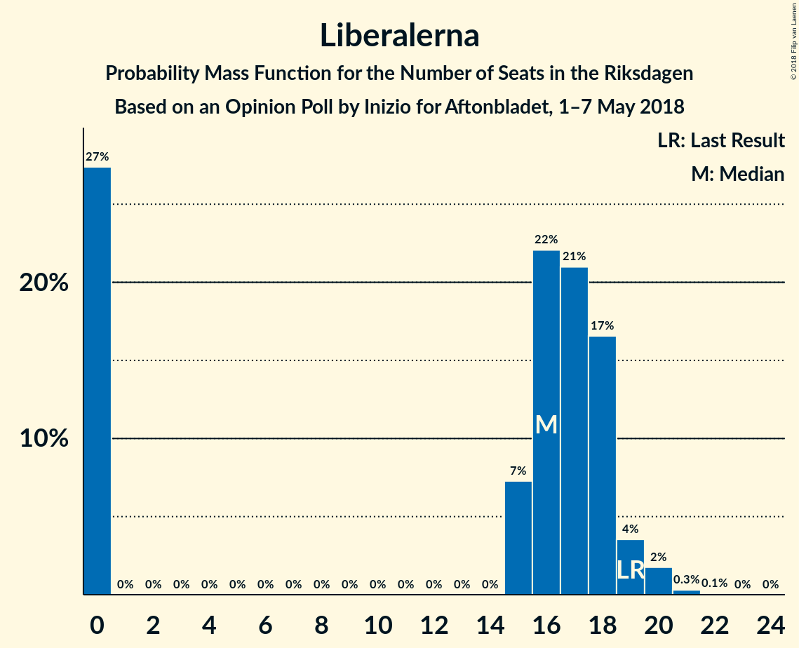

# Opinion Poll by Inizio for Aftonbladet, 1–7 May 2018

<a href="#voting-intentions">Voting Intentions</a> | <a href="#seats">Seats</a> | <a href="#coalitions">Coalitions</a> | <a href="#technical-information">Technical Information</a>

## Voting Intentions

### Confidence Intervals

| Party | Last Result | Poll Result | 80% Confidence Interval | 90% Confidence Interval | 95% Confidence Interval | 99% Confidence Interval |
|:-----:|:-----------:|:-----------:|:-----------------------:|:-----------------------:|:-----------------------:|:-----------------------:|
| Sveriges socialdemokratiska arbetareparti | 31.0% | 26.6% | 25.4–27.8% |25.1–28.2% |24.8–28.5% |24.2–29.1% |
| Moderata samlingspartiet | 23.3% | 22.4% | 21.3–23.6% |21.0–23.9% |20.7–24.2% |20.2–24.8% |
| Sverigedemokraterna | 12.9% | 16.9% | 15.9–18.0% |15.7–18.3% |15.4–18.5% |15.0–19.0% |
| Centerpartiet | 6.1% | 9.0% | 8.3–9.8% |8.1–10.1% |7.9–10.3% |7.6–10.7% |
| Vänsterpartiet | 5.7% | 7.4% | 6.7–8.2% |6.6–8.4% |6.4–8.6% |6.1–8.9% |
| Kristdemokraterna | 4.6% | 4.8% | 4.3–5.4% |4.1–5.6% |4.0–5.8% |3.7–6.1% |
| Liberalerna | 5.4% | 4.2% | 3.7–4.8% |3.6–5.0% |3.5–5.1% |3.2–5.4% |
| Miljöpartiet de gröna | 6.9% | 3.8% | 3.3–4.4% |3.2–4.6% |3.1–4.7% |2.9–5.0% |
| Feministiskt initiativ | 3.1% | 2.5% | 2.1–3.0% |2.0–3.1% |1.9–3.2% |1.8–3.5% |

*Note:* The poll result column reflects the actual value used in the calculations. Published results may vary slightly, and in addition be rounded to fewer digits.

## Seats

### Confidence Intervals

| Party | Last Result | Median | 80% Confidence Interval | 90% Confidence Interval | 95% Confidence Interval | 99% Confidence Interval |
|:-----:|:-----------:|:------:|:-----------------------:|:-----------------------:|:-----------------------:|:-----------------------:|
| <a href="#sveriges-socialdemokratiska-arbetareparti">Sveriges socialdemokratiska arbetareparti</a> | 113 | 100 | 100–102 |100–102 |100–102 |97–102 |
| <a href="#moderata-samlingspartiet">Moderata samlingspartiet</a> | 84 | 85 | 85–90 |85–90 |85–90 |85–90 |
| <a href="#sverigedemokraterna">Sverigedemokraterna</a> | 49 | 65 | 65–69 |65–69 |65–69 |64–69 |
| <a href="#centerpartiet">Centerpartiet</a> | 22 | 36 | 33–36 |33–36 |33–36 |28–36 |
| <a href="#vänsterpartiet">Vänsterpartiet</a> | 21 | 28 | 28–32 |28–32 |28–32 |28–32 |
| <a href="#kristdemokraterna">Kristdemokraterna</a> | 16 | 19 | 19–23 |19–23 |19–23 |19–23 |
| <a href="#liberalerna">Liberalerna</a> | 19 | 16 | 0–16 |0–16 |0–16 |0–16 |
| <a href="#miljöpartiet-de-gröna">Miljöpartiet de gröna</a> | 25 | 0 | 0 |0 |0 |0–20 |
| <a href="#feministiskt-initiativ">Feministiskt initiativ</a> | 0 | 0 | N/A |N/A |N/A |N/A |

### Sveriges socialdemokratiska arbetareparti

*For a full overview of the results for this party, see the [Sveriges socialdemokratiska arbetareparti](party-sverigessocialdemokratiskaarbetareparti.html) page.*

| Number of Seats | Probability | Accumulated | Special Marks |
|:---------------:|:-----------:|:-----------:|:-------------:|
| 93 | 0.1% | 100% |  |
| 94 | 0% | 99.9% |  |
| 95 | 0% | 99.9% |  |
| 96 | 0% | 99.9% |  |
| 97 | 13% | 99.9% |  |
| 98 | 0% | 87% |  |
| 99 | 0% | 87% |  |
| 100 | 87% | 87% | Median |
| 101 | 0% | 0% |  |
| 102 | 0% | 0% |  |
| 103 | 0% | 0% |  |
| 104 | 0% | 0% |  |
| 105 | 0% | 0% |  |
| 106 | 0% | 0% |  |
| 107 | 0% | 0% |  |
| 108 | 0% | 0% |  |
| 109 | 0% | 0% |  |
| 110 | 0% | 0% |  |
| 111 | 0% | 0% |  |
| 112 | 0% | 0% |  |
| 113 | 0% | 0% | Last Result |

### Moderata samlingspartiet

*For a full overview of the results for this party, see the [Moderata samlingspartiet](party-moderatasamlingspartiet.html) page.*

| Number of Seats | Probability | Accumulated | Special Marks |
|:---------------:|:-----------:|:-----------:|:-------------:|
| 80 | 0.1% | 100% |  |
| 81 | 0% | 99.9% |  |
| 82 | 0% | 99.9% |  |
| 83 | 0% | 99.9% |  |
| 84 | 0% | 99.9% | Last Result |
| 85 | 99.9% | 99.9% | Median |
| 86 | 0% | 0% |  |

### Sverigedemokraterna

*For a full overview of the results for this party, see the [Sverigedemokraterna](party-sverigedemokraterna.html) page.*

| Number of Seats | Probability | Accumulated | Special Marks |
|:---------------:|:-----------:|:-----------:|:-------------:|
| 49 | 0% | 100% | Last Result |
| 50 | 0% | 100% |  |
| 51 | 0% | 100% |  |
| 52 | 0% | 100% |  |
| 53 | 0% | 100% |  |
| 54 | 0% | 100% |  |
| 55 | 0% | 100% |  |
| 56 | 0% | 100% |  |
| 57 | 0% | 100% |  |
| 58 | 0% | 100% |  |
| 59 | 0% | 100% |  |
| 60 | 0% | 100% |  |
| 61 | 0.1% | 100% |  |
| 62 | 0% | 99.9% |  |
| 63 | 0% | 99.9% |  |
| 64 | 13% | 99.9% |  |
| 65 | 87% | 87% | Median |
| 66 | 0% | 0% |  |

### Centerpartiet

*For a full overview of the results for this party, see the [Centerpartiet](party-centerpartiet.html) page.*

| Number of Seats | Probability | Accumulated | Special Marks |
|:---------------:|:-----------:|:-----------:|:-------------:|
| 22 | 0% | 100% | Last Result |
| 23 | 0% | 100% |  |
| 24 | 0% | 100% |  |
| 25 | 0% | 100% |  |
| 26 | 0% | 100% |  |
| 27 | 0% | 100% |  |
| 28 | 13% | 100% |  |
| 29 | 0% | 87% |  |
| 30 | 0% | 87% |  |
| 31 | 0% | 87% |  |
| 32 | 0% | 87% |  |
| 33 | 0% | 87% |  |
| 34 | 0% | 87% |  |
| 35 | 0% | 87% |  |
| 36 | 87% | 87% | Median |
| 37 | 0% | 0.1% |  |
| 38 | 0% | 0.1% |  |
| 39 | 0% | 0.1% |  |
| 40 | 0% | 0.1% |  |
| 41 | 0% | 0.1% |  |
| 42 | 0% | 0.1% |  |
| 43 | 0% | 0.1% |  |
| 44 | 0% | 0.1% |  |
| 45 | 0.1% | 0.1% |  |
| 46 | 0% | 0% |  |

### Vänsterpartiet

*For a full overview of the results for this party, see the [Vänsterpartiet](party-vänsterpartiet.html) page.*

| Number of Seats | Probability | Accumulated | Special Marks |
|:---------------:|:-----------:|:-----------:|:-------------:|
| 21 | 0% | 100% | Last Result |
| 22 | 0% | 100% |  |
| 23 | 0% | 100% |  |
| 24 | 0% | 100% |  |
| 25 | 0% | 100% |  |
| 26 | 0% | 100% |  |
| 27 | 0% | 100% |  |
| 28 | 87% | 100% | Median |
| 29 | 0% | 13% |  |
| 30 | 0% | 13% |  |
| 31 | 0% | 13% |  |
| 32 | 13% | 13% |  |
| 33 | 0% | 0% |  |

### Kristdemokraterna

*For a full overview of the results for this party, see the [Kristdemokraterna](party-kristdemokraterna.html) page.*

| Number of Seats | Probability | Accumulated | Special Marks |
|:---------------:|:-----------:|:-----------:|:-------------:|
| 16 | 0% | 100% | Last Result |
| 17 | 0% | 100% |  |
| 18 | 0% | 100% |  |
| 19 | 87% | 100% | Median |
| 20 | 0% | 13% |  |
| 21 | 0% | 13% |  |
| 22 | 0% | 13% |  |
| 23 | 13% | 13% |  |
| 24 | 0% | 0% |  |

### Liberalerna

*For a full overview of the results for this party, see the [Liberalerna](party-liberalerna.html) page.*

| Number of Seats | Probability | Accumulated | Special Marks |
|:---------------:|:-----------:|:-----------:|:-------------:|
| 0 | 13% | 100% |  |
| 1 | 0% | 87% |  |
| 2 | 0% | 87% |  |
| 3 | 0% | 87% |  |
| 4 | 0% | 87% |  |
| 5 | 0% | 87% |  |
| 6 | 0% | 87% |  |
| 7 | 0% | 87% |  |
| 8 | 0% | 87% |  |
| 9 | 0% | 87% |  |
| 10 | 0% | 87% |  |
| 11 | 0% | 87% |  |
| 12 | 0% | 87% |  |
| 13 | 0% | 87% |  |
| 14 | 0% | 87% |  |
| 15 | 0.1% | 87% |  |
| 16 | 87% | 87% | Median |
| 17 | 0% | 0% |  |
| 18 | 0% | 0% |  |
| 19 | 0% | 0% | Last Result |

### Miljöpartiet de gröna

*For a full overview of the results for this party, see the [Miljöpartiet de gröna](party-miljöpartietdegröna.html) page.*

| Number of Seats | Probability | Accumulated | Special Marks |
|:---------------:|:-----------:|:-----------:|:-------------:|
| 0 | 87% | 100% | Median |
| 1 | 0% | 13% |  |
| 2 | 0% | 13% |  |
| 3 | 0% | 13% |  |
| 4 | 0% | 13% |  |
| 5 | 0% | 13% |  |
| 6 | 0% | 13% |  |
| 7 | 0% | 13% |  |
| 8 | 0% | 13% |  |
| 9 | 0% | 13% |  |
| 10 | 0% | 13% |  |
| 11 | 0% | 13% |  |
| 12 | 0% | 13% |  |
| 13 | 0% | 13% |  |
| 14 | 0% | 13% |  |
| 15 | 0% | 13% |  |
| 16 | 0% | 13% |  |
| 17 | 0% | 13% |  |
| 18 | 0% | 13% |  |
| 19 | 0% | 13% |  |
| 20 | 13% | 13% |  |
| 21 | 0% | 0% |  |
| 22 | 0% | 0% |  |
| 23 | 0% | 0% |  |
| 24 | 0% | 0% |  |
| 25 | 0% | 0% | Last Result |

### Feministiskt initiativ

*For a full overview of the results for this party, see the [Feministiskt initiativ](party-feministisktinitiativ.html) page.*

| Number of Seats | Probability | Accumulated | Special Marks |
|:---------------:|:-----------:|:-----------:|:-------------:|
| 0 | 100% | 100% | Last Result, Median |

## Coalitions

### Confidence Intervals

| Coalition | Last Result | Median | Majority? | 80% Confidence Interval | 90% Confidence Interval | 95% Confidence Interval | 99% Confidence Interval |
|:---------:|:-----------:|:------:|:---------:|:-----------------------:|:-----------------------:|:-----------------------:|:-----------------------:|
| Moderata samlingspartiet – Centerpartiet – Kristdemokraterna – Liberalerna | 141 | 156 | 0% | 136–156 | 136–156 | 136–156 | 136–156 |
| Sveriges socialdemokratiska arbetareparti – Vänsterpartiet – Miljöpartiet de gröna – Feministiskt initiativ | 159 | 128 | 0% | 128–149 | 128–149 | 128–149 | 128–149 |
| Sveriges socialdemokratiska arbetareparti – Vänsterpartiet – Miljöpartiet de gröna | 159 | 128 | 0% | 128–149 | 128–149 | 128–149 | 128–149 |
| Moderata samlingspartiet – Centerpartiet – Kristdemokraterna | 122 | 140 | 0% | 136–140 | 136–140 | 136–140 | 136–140 |
| Moderata samlingspartiet – Centerpartiet – Liberalerna | 125 | 137 | 0% | 113–137 | 113–137 | 113–137 | 113–137 |
| Sveriges socialdemokratiska arbetareparti – Vänsterpartiet | 134 | 128 | 0% | 128–129 | 128–129 | 128–129 | 128–129 |
| Moderata samlingspartiet – Centerpartiet | 106 | 121 | 0% | 113–121 | 113–121 | 113–121 | 113–121 |

### Moderata samlingspartiet – Centerpartiet – Kristdemokraterna – Liberalerna

| Number of Seats | Probability | Accumulated | Special Marks |
|:---------------:|:-----------:|:-----------:|:-------------:|
| 136 | 13% | 100% |  |
| 137 | 0% | 87% |  |
| 138 | 0% | 87% |  |
| 139 | 0% | 87% |  |
| 140 | 0% | 87% |  |
| 141 | 0% | 87% | Last Result |
| 142 | 0% | 87% |  |
| 143 | 0% | 87% |  |
| 144 | 0% | 87% |  |
| 145 | 0% | 87% |  |
| 146 | 0% | 87% |  |
| 147 | 0% | 87% |  |
| 148 | 0% | 87% |  |
| 149 | 0% | 87% |  |
| 150 | 0% | 87% |  |
| 151 | 0% | 87% |  |
| 152 | 0% | 87% |  |
| 153 | 0% | 87% |  |
| 154 | 0% | 87% |  |
| 155 | 0% | 87% |  |
| 156 | 87% | 87% | Median |
| 157 | 0% | 0.1% |  |
| 158 | 0% | 0.1% |  |
| 159 | 0% | 0.1% |  |
| 160 | 0% | 0.1% |  |
| 161 | 0% | 0.1% |  |
| 162 | 0% | 0.1% |  |
| 163 | 0.1% | 0.1% |  |
| 164 | 0% | 0% |  |

### Sveriges socialdemokratiska arbetareparti – Vänsterpartiet – Miljöpartiet de gröna – Feministiskt initiativ

| Number of Seats | Probability | Accumulated | Special Marks |
|:---------------:|:-----------:|:-----------:|:-------------:|
| 125 | 0.1% | 100% |  |
| 126 | 0% | 99.9% |  |
| 127 | 0% | 99.9% |  |
| 128 | 87% | 99.9% | Median |
| 129 | 0% | 13% |  |
| 130 | 0% | 13% |  |
| 131 | 0% | 13% |  |
| 132 | 0% | 13% |  |
| 133 | 0% | 13% |  |
| 134 | 0% | 13% |  |
| 135 | 0% | 13% |  |
| 136 | 0% | 13% |  |
| 137 | 0% | 13% |  |
| 138 | 0% | 13% |  |
| 139 | 0% | 13% |  |
| 140 | 0% | 13% |  |
| 141 | 0% | 13% |  |
| 142 | 0% | 13% |  |
| 143 | 0% | 13% |  |
| 144 | 0% | 13% |  |
| 145 | 0% | 13% |  |
| 146 | 0% | 13% |  |
| 147 | 0% | 13% |  |
| 148 | 0% | 13% |  |
| 149 | 13% | 13% |  |
| 150 | 0% | 0% |  |
| 151 | 0% | 0% |  |
| 152 | 0% | 0% |  |
| 153 | 0% | 0% |  |
| 154 | 0% | 0% |  |
| 155 | 0% | 0% |  |
| 156 | 0% | 0% |  |
| 157 | 0% | 0% |  |
| 158 | 0% | 0% |  |
| 159 | 0% | 0% | Last Result |

### Sveriges socialdemokratiska arbetareparti – Vänsterpartiet – Miljöpartiet de gröna

| Number of Seats | Probability | Accumulated | Special Marks |
|:---------------:|:-----------:|:-----------:|:-------------:|
| 125 | 0.1% | 100% |  |
| 126 | 0% | 99.9% |  |
| 127 | 0% | 99.9% |  |
| 128 | 87% | 99.9% | Median |
| 129 | 0% | 13% |  |
| 130 | 0% | 13% |  |
| 131 | 0% | 13% |  |
| 132 | 0% | 13% |  |
| 133 | 0% | 13% |  |
| 134 | 0% | 13% |  |
| 135 | 0% | 13% |  |
| 136 | 0% | 13% |  |
| 137 | 0% | 13% |  |
| 138 | 0% | 13% |  |
| 139 | 0% | 13% |  |
| 140 | 0% | 13% |  |
| 141 | 0% | 13% |  |
| 142 | 0% | 13% |  |
| 143 | 0% | 13% |  |
| 144 | 0% | 13% |  |
| 145 | 0% | 13% |  |
| 146 | 0% | 13% |  |
| 147 | 0% | 13% |  |
| 148 | 0% | 13% |  |
| 149 | 13% | 13% |  |
| 150 | 0% | 0% |  |
| 151 | 0% | 0% |  |
| 152 | 0% | 0% |  |
| 153 | 0% | 0% |  |
| 154 | 0% | 0% |  |
| 155 | 0% | 0% |  |
| 156 | 0% | 0% |  |
| 157 | 0% | 0% |  |
| 158 | 0% | 0% |  |
| 159 | 0% | 0% | Last Result |

### Moderata samlingspartiet – Centerpartiet – Kristdemokraterna

| Number of Seats | Probability | Accumulated | Special Marks |
|:---------------:|:-----------:|:-----------:|:-------------:|
| 122 | 0% | 100% | Last Result |
| 123 | 0% | 100% |  |
| 124 | 0% | 100% |  |
| 125 | 0% | 100% |  |
| 126 | 0% | 100% |  |
| 127 | 0% | 100% |  |
| 128 | 0% | 100% |  |
| 129 | 0% | 100% |  |
| 130 | 0% | 100% |  |
| 131 | 0% | 100% |  |
| 132 | 0% | 100% |  |
| 133 | 0% | 100% |  |
| 134 | 0% | 100% |  |
| 135 | 0% | 100% |  |
| 136 | 13% | 100% |  |
| 137 | 0% | 87% |  |
| 138 | 0% | 87% |  |
| 139 | 0% | 87% |  |
| 140 | 87% | 87% | Median |
| 141 | 0% | 0.1% |  |
| 142 | 0% | 0.1% |  |
| 143 | 0% | 0.1% |  |
| 144 | 0% | 0.1% |  |
| 145 | 0% | 0.1% |  |
| 146 | 0% | 0.1% |  |
| 147 | 0% | 0.1% |  |
| 148 | 0.1% | 0.1% |  |
| 149 | 0% | 0% |  |

### Moderata samlingspartiet – Centerpartiet – Liberalerna

| Number of Seats | Probability | Accumulated | Special Marks |
|:---------------:|:-----------:|:-----------:|:-------------:|
| 113 | 13% | 100% |  |
| 114 | 0% | 87% |  |
| 115 | 0% | 87% |  |
| 116 | 0% | 87% |  |
| 117 | 0% | 87% |  |
| 118 | 0% | 87% |  |
| 119 | 0% | 87% |  |
| 120 | 0% | 87% |  |
| 121 | 0% | 87% |  |
| 122 | 0% | 87% |  |
| 123 | 0% | 87% |  |
| 124 | 0% | 87% |  |
| 125 | 0% | 87% | Last Result |
| 126 | 0% | 87% |  |
| 127 | 0% | 87% |  |
| 128 | 0% | 87% |  |
| 129 | 0% | 87% |  |
| 130 | 0% | 87% |  |
| 131 | 0% | 87% |  |
| 132 | 0% | 87% |  |
| 133 | 0% | 87% |  |
| 134 | 0% | 87% |  |
| 135 | 0% | 87% |  |
| 136 | 0% | 87% |  |
| 137 | 87% | 87% | Median |
| 138 | 0% | 0.1% |  |
| 139 | 0% | 0.1% |  |
| 140 | 0.1% | 0.1% |  |
| 141 | 0% | 0% |  |

### Sveriges socialdemokratiska arbetareparti – Vänsterpartiet

| Number of Seats | Probability | Accumulated | Special Marks |
|:---------------:|:-----------:|:-----------:|:-------------:|
| 125 | 0.1% | 100% |  |
| 126 | 0% | 99.9% |  |
| 127 | 0% | 99.9% |  |
| 128 | 87% | 99.9% | Median |
| 129 | 13% | 13% |  |
| 130 | 0% | 0% |  |
| 131 | 0% | 0% |  |
| 132 | 0% | 0% |  |
| 133 | 0% | 0% |  |
| 134 | 0% | 0% | Last Result |

### Moderata samlingspartiet – Centerpartiet

| Number of Seats | Probability | Accumulated | Special Marks |
|:---------------:|:-----------:|:-----------:|:-------------:|
| 106 | 0% | 100% | Last Result |
| 107 | 0% | 100% |  |
| 108 | 0% | 100% |  |
| 109 | 0% | 100% |  |
| 110 | 0% | 100% |  |
| 111 | 0% | 100% |  |
| 112 | 0% | 100% |  |
| 113 | 13% | 100% |  |
| 114 | 0% | 87% |  |
| 115 | 0% | 87% |  |
| 116 | 0% | 87% |  |
| 117 | 0% | 87% |  |
| 118 | 0% | 87% |  |
| 119 | 0% | 87% |  |
| 120 | 0% | 87% |  |
| 121 | 87% | 87% | Median |
| 122 | 0% | 0.1% |  |
| 123 | 0% | 0.1% |  |
| 124 | 0% | 0.1% |  |
| 125 | 0.1% | 0.1% |  |
| 126 | 0% | 0% |  |

## Technical Information

### Opinion Poll

+ **Polling firm:** Inizio
+ **Commissioner(s):** Aftonbladet
+ **Fieldwork period:** 1–7 May 2018

### Calculations

+ **Sample size:** 2253
+ **Simulations done:** 64
+ **Error estimate:** 2.42%

