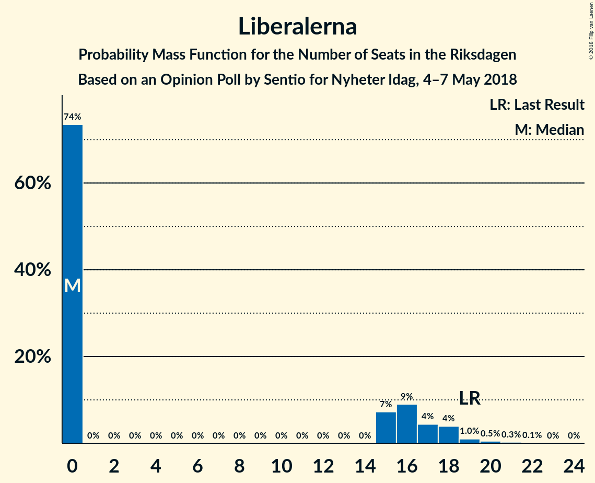
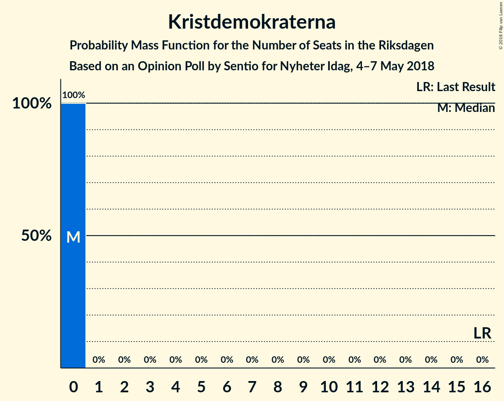

# Opinion Poll by Sentio for Nyheter Idag, 4–7 May 2018

<a href="#voting-intentions">Voting Intentions</a> | <a href="#seats">Seats</a> | <a href="#coalitions">Coalitions</a> | <a href="#technical-information">Technical Information</a>

## Voting Intentions

### Confidence Intervals

| Party | Last Result | Poll Result | 80% Confidence Interval | 90% Confidence Interval | 95% Confidence Interval | 99% Confidence Interval |
|:-----:|:-----------:|:-----------:|:-----------------------:|:-----------------------:|:-----------------------:|:-----------------------:|
| Sveriges socialdemokratiska arbetareparti | 31.0% | 25.3% | 23.6–27.2% |23.2–27.7% |22.8–28.1% |22.0–29.0% |
| Sverigedemokraterna | 12.9% | 23.1% | 21.4–24.8% |21.0–25.3% |20.6–25.8% |19.8–26.6% |
| Moderata samlingspartiet | 23.3% | 20.4% | 18.8–22.1% |18.4–22.6% |18.0–23.0% |17.3–23.8% |
| Vänsterpartiet | 5.7% | 9.2% | 8.1–10.5% |7.8–10.8% |7.6–11.2% |7.1–11.8% |
| Centerpartiet | 6.1% | 7.6% | 6.6–8.8% |6.4–9.1% |6.1–9.4% |5.7–10.0% |
| Miljöpartiet de gröna | 6.9% | 4.4% | 3.6–5.3% |3.4–5.6% |3.3–5.8% |2.9–6.3% |
| Liberalerna | 5.4% | 3.7% | 3.0–4.5% |2.8–4.8% |2.7–5.0% |2.4–5.5% |
| Feministiskt initiativ | 3.1% | 2.2% | 1.7–2.9% |1.6–3.1% |1.4–3.3% |1.2–3.7% |
| Kristdemokraterna | 4.6% | 2.1% | 1.6–2.8% |1.5–3.0% |1.4–3.2% |1.2–3.5% |

*Note:* The poll result column reflects the actual value used in the calculations. Published results may vary slightly, and in addition be rounded to fewer digits.

## Seats

### Confidence Intervals

| Party | Last Result | Median | 80% Confidence Interval | 90% Confidence Interval | 95% Confidence Interval | 99% Confidence Interval |
|:-----:|:-----------:|:------:|:-----------------------:|:-----------------------:|:-----------------------:|:-----------------------:|
| <a href="#sveriges-socialdemokratiska-arbetareparti">Sveriges socialdemokratiska arbetareparti</a> | 113 | 98 | 90–102 |89–104 |88–107 |84–114 |
| <a href="#sverigedemokraterna">Sverigedemokraterna</a> | 49 | 87 | 84–96 |81–97 |80–99 |76–104 |
| <a href="#moderata-samlingspartiet">Moderata samlingspartiet</a> | 84 | 79 | 73–89 |71–89 |68–89 |67–90 |
| <a href="#vänsterpartiet">Vänsterpartiet</a> | 21 | 37 | 33–39 |32–40 |31–42 |27–43 |
| <a href="#centerpartiet">Centerpartiet</a> | 22 | 30 | 25–32 |24–34 |24–36 |21–38 |
| <a href="#miljöpartiet-de-gröna">Miljöpartiet de gröna</a> | 25 | 17 | 0–19 |0–20 |0–21 |0–23 |
| <a href="#liberalerna">Liberalerna</a> | 19 | 0 | 0–17 |0–18 |0–18 |0–20 |
| <a href="#feministiskt-initiativ">Feministiskt initiativ</a> | 0 | 0 | 0 |0 |0 |0 |
| <a href="#kristdemokraterna">Kristdemokraterna</a> | 16 | 0 | 0 |0 |0 |0 |

### Sveriges socialdemokratiska arbetareparti

*For a full overview of the results for this party, see the [Sveriges socialdemokratiska arbetareparti](party-sverigessocialdemokratiskaarbetareparti.html) page.*

| Number of Seats | Probability | Accumulated | Special Marks |
|:---------------:|:-----------:|:-----------:|:-------------:|
| 79 | 0% | 100% |  |
| 80 | 0% | 99.9% |  |
| 81 | 0.1% | 99.9% |  |
| 82 | 0% | 99.8% |  |
| 83 | 0.3% | 99.8% |  |
| 84 | 0.2% | 99.5% |  |
| 85 | 0.8% | 99.3% |  |
| 86 | 0.4% | 98.5% |  |
| 87 | 0.5% | 98% |  |
| 88 | 2% | 98% |  |
| 89 | 1.2% | 96% |  |
| 90 | 6% | 94% |  |
| 91 | 0.9% | 88% |  |
| 92 | 2% | 87% |  |
| 93 | 3% | 85% |  |
| 94 | 1.4% | 82% |  |
| 95 | 3% | 81% |  |
| 96 | 8% | 77% |  |
| 97 | 7% | 69% |  |
| 98 | 37% | 62% | Median |
| 99 | 1.3% | 25% |  |
| 100 | 4% | 24% |  |
| 101 | 7% | 19% |  |
| 102 | 2% | 12% |  |
| 103 | 3% | 10% |  |
| 104 | 2% | 6% |  |
| 105 | 0.6% | 4% |  |
| 106 | 0.8% | 3% |  |
| 107 | 1.0% | 3% |  |
| 108 | 0.3% | 2% |  |
| 109 | 0.2% | 1.3% |  |
| 110 | 0.1% | 1.1% |  |
| 111 | 0.2% | 1.0% |  |
| 112 | 0.1% | 0.8% |  |
| 113 | 0.1% | 0.7% | Last Result |
| 114 | 0.4% | 0.6% |  |
| 115 | 0.2% | 0.2% |  |
| 116 | 0% | 0.1% |  |
| 117 | 0% | 0% |  |

### Sverigedemokraterna

*For a full overview of the results for this party, see the [Sverigedemokraterna](party-sverigedemokraterna.html) page.*

| Number of Seats | Probability | Accumulated | Special Marks |
|:---------------:|:-----------:|:-----------:|:-------------:|
| 49 | 0% | 100% | Last Result |
| 50 | 0% | 100% |  |
| 51 | 0% | 100% |  |
| 52 | 0% | 100% |  |
| 53 | 0% | 100% |  |
| 54 | 0% | 100% |  |
| 55 | 0% | 100% |  |
| 56 | 0% | 100% |  |
| 57 | 0% | 100% |  |
| 58 | 0% | 100% |  |
| 59 | 0% | 100% |  |
| 60 | 0% | 100% |  |
| 61 | 0% | 100% |  |
| 62 | 0% | 100% |  |
| 63 | 0% | 100% |  |
| 64 | 0% | 100% |  |
| 65 | 0% | 100% |  |
| 66 | 0% | 100% |  |
| 67 | 0% | 100% |  |
| 68 | 0% | 100% |  |
| 69 | 0% | 100% |  |
| 70 | 0% | 100% |  |
| 71 | 0% | 100% |  |
| 72 | 0% | 100% |  |
| 73 | 0% | 100% |  |
| 74 | 0.1% | 99.9% |  |
| 75 | 0.1% | 99.8% |  |
| 76 | 0.4% | 99.7% |  |
| 77 | 0.3% | 99.3% |  |
| 78 | 0.4% | 99.0% |  |
| 79 | 0.3% | 98.6% |  |
| 80 | 2% | 98% |  |
| 81 | 1.1% | 96% |  |
| 82 | 2% | 95% |  |
| 83 | 3% | 93% |  |
| 84 | 4% | 90% |  |
| 85 | 0.3% | 87% |  |
| 86 | 32% | 86% |  |
| 87 | 6% | 54% | Median |
| 88 | 1.1% | 49% |  |
| 89 | 10% | 47% |  |
| 90 | 6% | 38% |  |
| 91 | 6% | 31% |  |
| 92 | 0.5% | 25% |  |
| 93 | 3% | 25% |  |
| 94 | 0.3% | 22% |  |
| 95 | 9% | 22% |  |
| 96 | 7% | 13% |  |
| 97 | 0.3% | 5% |  |
| 98 | 1.5% | 5% |  |
| 99 | 2% | 3% |  |
| 100 | 0.3% | 2% |  |
| 101 | 0.4% | 2% |  |
| 102 | 0.2% | 1.2% |  |
| 103 | 0% | 1.0% |  |
| 104 | 0.5% | 1.0% |  |
| 105 | 0.3% | 0.5% |  |
| 106 | 0% | 0.1% |  |
| 107 | 0% | 0.1% |  |
| 108 | 0% | 0.1% |  |
| 109 | 0.1% | 0.1% |  |
| 110 | 0% | 0% |  |

### Moderata samlingspartiet

*For a full overview of the results for this party, see the [Moderata samlingspartiet](party-moderatasamlingspartiet.html) page.*

| Number of Seats | Probability | Accumulated | Special Marks |
|:---------------:|:-----------:|:-----------:|:-------------:|
| 63 | 0% | 100% |  |
| 64 | 0.1% | 99.9% |  |
| 65 | 0.1% | 99.9% |  |
| 66 | 0.1% | 99.8% |  |
| 67 | 0.3% | 99.7% |  |
| 68 | 2% | 99.4% |  |
| 69 | 0.9% | 97% |  |
| 70 | 0.5% | 97% |  |
| 71 | 4% | 96% |  |
| 72 | 1.0% | 92% |  |
| 73 | 4% | 91% |  |
| 74 | 1.0% | 87% |  |
| 75 | 9% | 86% |  |
| 76 | 6% | 77% |  |
| 77 | 0.9% | 72% |  |
| 78 | 8% | 71% |  |
| 79 | 30% | 62% | Median |
| 80 | 1.0% | 33% |  |
| 81 | 9% | 31% |  |
| 82 | 2% | 23% |  |
| 83 | 2% | 21% |  |
| 84 | 3% | 19% | Last Result |
| 85 | 3% | 17% |  |
| 86 | 2% | 14% |  |
| 87 | 0.4% | 12% |  |
| 88 | 1.4% | 12% |  |
| 89 | 9% | 10% |  |
| 90 | 0.9% | 1.3% |  |
| 91 | 0.1% | 0.4% |  |
| 92 | 0.1% | 0.3% |  |
| 93 | 0% | 0.2% |  |
| 94 | 0.1% | 0.2% |  |
| 95 | 0% | 0.1% |  |
| 96 | 0% | 0% |  |

### Vänsterpartiet

*For a full overview of the results for this party, see the [Vänsterpartiet](party-vänsterpartiet.html) page.*

| Number of Seats | Probability | Accumulated | Special Marks |
|:---------------:|:-----------:|:-----------:|:-------------:|
| 21 | 0% | 100% | Last Result |
| 22 | 0% | 100% |  |
| 23 | 0% | 100% |  |
| 24 | 0% | 100% |  |
| 25 | 0% | 100% |  |
| 26 | 0.1% | 99.9% |  |
| 27 | 0.3% | 99.8% |  |
| 28 | 0.4% | 99.5% |  |
| 29 | 0.5% | 99.0% |  |
| 30 | 0.4% | 98.6% |  |
| 31 | 1.1% | 98% |  |
| 32 | 6% | 97% |  |
| 33 | 5% | 91% |  |
| 34 | 3% | 86% |  |
| 35 | 4% | 83% |  |
| 36 | 20% | 79% |  |
| 37 | 38% | 59% | Median |
| 38 | 9% | 21% |  |
| 39 | 7% | 12% |  |
| 40 | 1.2% | 5% |  |
| 41 | 0.9% | 4% |  |
| 42 | 2% | 3% |  |
| 43 | 0.2% | 0.7% |  |
| 44 | 0.1% | 0.5% |  |
| 45 | 0.1% | 0.4% |  |
| 46 | 0% | 0.2% |  |
| 47 | 0% | 0.2% |  |
| 48 | 0.1% | 0.2% |  |
| 49 | 0% | 0% |  |

### Centerpartiet

*For a full overview of the results for this party, see the [Centerpartiet](party-centerpartiet.html) page.*

| Number of Seats | Probability | Accumulated | Special Marks |
|:---------------:|:-----------:|:-----------:|:-------------:|
| 20 | 0.1% | 100% |  |
| 21 | 0.5% | 99.8% |  |
| 22 | 0.3% | 99.3% | Last Result |
| 23 | 0.4% | 99.0% |  |
| 24 | 8% | 98.7% |  |
| 25 | 2% | 91% |  |
| 26 | 10% | 89% |  |
| 27 | 2% | 79% |  |
| 28 | 9% | 77% |  |
| 29 | 5% | 68% |  |
| 30 | 15% | 63% | Median |
| 31 | 4% | 48% |  |
| 32 | 34% | 44% |  |
| 33 | 1.2% | 10% |  |
| 34 | 6% | 9% |  |
| 35 | 0.6% | 3% |  |
| 36 | 2% | 3% |  |
| 37 | 0.3% | 1.0% |  |
| 38 | 0.4% | 0.7% |  |
| 39 | 0.1% | 0.3% |  |
| 40 | 0.1% | 0.2% |  |
| 41 | 0% | 0.1% |  |
| 42 | 0% | 0% |  |

### Miljöpartiet de gröna

*For a full overview of the results for this party, see the [Miljöpartiet de gröna](party-miljöpartietdegröna.html) page.*

| Number of Seats | Probability | Accumulated | Special Marks |
|:---------------:|:-----------:|:-----------:|:-------------:|
| 0 | 22% | 100% |  |
| 1 | 0% | 78% |  |
| 2 | 0% | 78% |  |
| 3 | 0% | 78% |  |
| 4 | 0% | 78% |  |
| 5 | 0% | 78% |  |
| 6 | 0% | 78% |  |
| 7 | 0% | 78% |  |
| 8 | 0% | 78% |  |
| 9 | 0% | 78% |  |
| 10 | 0% | 78% |  |
| 11 | 0% | 78% |  |
| 12 | 0% | 78% |  |
| 13 | 0% | 78% |  |
| 14 | 0% | 78% |  |
| 15 | 0.9% | 78% |  |
| 16 | 7% | 77% |  |
| 17 | 34% | 70% | Median |
| 18 | 22% | 35% |  |
| 19 | 6% | 13% |  |
| 20 | 3% | 7% |  |
| 21 | 2% | 4% |  |
| 22 | 1.2% | 2% |  |
| 23 | 0.6% | 0.9% |  |
| 24 | 0.2% | 0.3% |  |
| 25 | 0.1% | 0.2% | Last Result |
| 26 | 0% | 0% |  |

### Liberalerna

*For a full overview of the results for this party, see the [Liberalerna](party-liberalerna.html) page.*

| Number of Seats | Probability | Accumulated | Special Marks |
|:---------------:|:-----------:|:-----------:|:-------------:|
| 0 | 79% | 100% | Median |
| 1 | 0% | 21% |  |
| 2 | 0% | 21% |  |
| 3 | 0% | 21% |  |
| 4 | 0% | 21% |  |
| 5 | 0% | 21% |  |
| 6 | 0% | 21% |  |
| 7 | 0% | 21% |  |
| 8 | 0% | 21% |  |
| 9 | 0% | 21% |  |
| 10 | 0% | 21% |  |
| 11 | 0% | 21% |  |
| 12 | 0% | 21% |  |
| 13 | 0% | 21% |  |
| 14 | 0% | 21% |  |
| 15 | 1.3% | 21% |  |
| 16 | 7% | 20% |  |
| 17 | 4% | 14% |  |
| 18 | 8% | 9% |  |
| 19 | 1.2% | 2% | Last Result |
| 20 | 0.3% | 0.6% |  |
| 21 | 0.2% | 0.3% |  |
| 22 | 0.1% | 0.1% |  |
| 23 | 0% | 0% |  |

### Feministiskt initiativ

*For a full overview of the results for this party, see the [Feministiskt initiativ](party-feministisktinitiativ.html) page.*

| Number of Seats | Probability | Accumulated | Special Marks |
|:---------------:|:-----------:|:-----------:|:-------------:|
| 0 | 100% | 100% | Last Result, Median |

### Kristdemokraterna

*For a full overview of the results for this party, see the [Kristdemokraterna](party-kristdemokraterna.html) page.*

| Number of Seats | Probability | Accumulated | Special Marks |
|:---------------:|:-----------:|:-----------:|:-------------:|
| 0 | 100% | 100% | Median |
| 1 | 0% | 0% |  |
| 2 | 0% | 0% |  |
| 3 | 0% | 0% |  |
| 4 | 0% | 0% |  |
| 5 | 0% | 0% |  |
| 6 | 0% | 0% |  |
| 7 | 0% | 0% |  |
| 8 | 0% | 0% |  |
| 9 | 0% | 0% |  |
| 10 | 0% | 0% |  |
| 11 | 0% | 0% |  |
| 12 | 0% | 0% |  |
| 13 | 0% | 0% |  |
| 14 | 0% | 0% |  |
| 15 | 0% | 0% |  |
| 16 | 0% | 0% | Last Result |

## Coalitions

### Confidence Intervals

| Coalition | Last Result | Median | Majority? | 80% Confidence Interval | 90% Confidence Interval | 95% Confidence Interval | 99% Confidence Interval |
|:---------:|:-----------:|:------:|:---------:|:-----------------------:|:-----------------------:|:-----------------------:|:-----------------------:|
| Sveriges socialdemokratiska arbetareparti – Vänsterpartiet – Miljöpartiet de gröna – Feministiskt initiativ | 159 | 151 | 0% | 135–155 | 134–156 | 133–157 | 126–164 |
| Sveriges socialdemokratiska arbetareparti – Vänsterpartiet – Miljöpartiet de gröna | 159 | 151 | 0% | 135–155 | 134–156 | 133–157 | 126–164 |
| Sveriges socialdemokratiska arbetareparti – Vänsterpartiet | 134 | 135 | 0% | 124–139 | 122–142 | 121–144 | 118–152 |
| Moderata samlingspartiet – Centerpartiet – Liberalerna – Kristdemokraterna | 141 | 111 | 0% | 103–122 | 103–125 | 103–128 | 98–133 |
| Moderata samlingspartiet – Centerpartiet – Liberalerna | 125 | 111 | 0% | 103–122 | 103–125 | 103–128 | 98–133 |
| Sveriges socialdemokratiska arbetareparti – Miljöpartiet de gröna | 138 | 114 | 0% | 98–119 | 97–119 | 97–122 | 91–127 |
| Moderata samlingspartiet – Centerpartiet – Kristdemokraterna | 122 | 111 | 0% | 103–119 | 99–119 | 96–120 | 93–125 |
| Moderata samlingspartiet – Centerpartiet | 106 | 111 | 0% | 103–119 | 99–119 | 96–120 | 93–125 |

### Sveriges socialdemokratiska arbetareparti – Vänsterpartiet – Miljöpartiet de gröna – Feministiskt initiativ

| Number of Seats | Probability | Accumulated | Special Marks |
|:---------------:|:-----------:|:-----------:|:-------------:|
| 120 | 0.2% | 100% |  |
| 121 | 0% | 99.8% |  |
| 122 | 0% | 99.8% |  |
| 123 | 0% | 99.8% |  |
| 124 | 0.2% | 99.8% |  |
| 125 | 0% | 99.6% |  |
| 126 | 0.1% | 99.6% |  |
| 127 | 0.1% | 99.4% |  |
| 128 | 0% | 99.3% |  |
| 129 | 0.5% | 99.3% |  |
| 130 | 0.5% | 98.8% |  |
| 131 | 0.3% | 98% |  |
| 132 | 0.4% | 98% |  |
| 133 | 0.3% | 98% |  |
| 134 | 7% | 97% |  |
| 135 | 3% | 90% |  |
| 136 | 1.3% | 88% |  |
| 137 | 2% | 86% |  |
| 138 | 3% | 84% |  |
| 139 | 1.1% | 82% |  |
| 140 | 6% | 80% |  |
| 141 | 2% | 75% |  |
| 142 | 3% | 73% |  |
| 143 | 2% | 70% |  |
| 144 | 3% | 68% |  |
| 145 | 0.3% | 65% |  |
| 146 | 1.2% | 65% |  |
| 147 | 0.6% | 64% |  |
| 148 | 2% | 63% |  |
| 149 | 2% | 61% |  |
| 150 | 0.5% | 59% |  |
| 151 | 10% | 58% |  |
| 152 | 31% | 49% | Median |
| 153 | 1.2% | 18% |  |
| 154 | 2% | 16% |  |
| 155 | 7% | 14% |  |
| 156 | 4% | 7% |  |
| 157 | 0.9% | 3% |  |
| 158 | 0.7% | 2% |  |
| 159 | 0% | 2% | Last Result |
| 160 | 0.4% | 1.5% |  |
| 161 | 0.3% | 1.1% |  |
| 162 | 0.2% | 0.8% |  |
| 163 | 0% | 0.6% |  |
| 164 | 0.1% | 0.5% |  |
| 165 | 0% | 0.5% |  |
| 166 | 0.1% | 0.5% |  |
| 167 | 0.3% | 0.4% |  |
| 168 | 0% | 0.1% |  |
| 169 | 0% | 0% |  |

### Sveriges socialdemokratiska arbetareparti – Vänsterpartiet – Miljöpartiet de gröna

| Number of Seats | Probability | Accumulated | Special Marks |
|:---------------:|:-----------:|:-----------:|:-------------:|
| 120 | 0.2% | 100% |  |
| 121 | 0% | 99.8% |  |
| 122 | 0% | 99.8% |  |
| 123 | 0% | 99.8% |  |
| 124 | 0.2% | 99.8% |  |
| 125 | 0% | 99.6% |  |
| 126 | 0.1% | 99.6% |  |
| 127 | 0.1% | 99.4% |  |
| 128 | 0% | 99.3% |  |
| 129 | 0.5% | 99.3% |  |
| 130 | 0.5% | 98.8% |  |
| 131 | 0.3% | 98% |  |
| 132 | 0.4% | 98% |  |
| 133 | 0.3% | 98% |  |
| 134 | 7% | 97% |  |
| 135 | 3% | 90% |  |
| 136 | 1.3% | 88% |  |
| 137 | 2% | 86% |  |
| 138 | 3% | 84% |  |
| 139 | 1.1% | 81% |  |
| 140 | 6% | 80% |  |
| 141 | 2% | 75% |  |
| 142 | 3% | 73% |  |
| 143 | 2% | 70% |  |
| 144 | 3% | 68% |  |
| 145 | 0.3% | 65% |  |
| 146 | 1.2% | 65% |  |
| 147 | 0.6% | 64% |  |
| 148 | 2% | 63% |  |
| 149 | 2% | 61% |  |
| 150 | 0.5% | 59% |  |
| 151 | 10% | 58% |  |
| 152 | 31% | 49% | Median |
| 153 | 1.2% | 18% |  |
| 154 | 2% | 16% |  |
| 155 | 7% | 14% |  |
| 156 | 4% | 7% |  |
| 157 | 0.9% | 3% |  |
| 158 | 0.7% | 2% |  |
| 159 | 0% | 2% | Last Result |
| 160 | 0.4% | 1.5% |  |
| 161 | 0.3% | 1.1% |  |
| 162 | 0.2% | 0.7% |  |
| 163 | 0% | 0.6% |  |
| 164 | 0.1% | 0.5% |  |
| 165 | 0% | 0.5% |  |
| 166 | 0.1% | 0.5% |  |
| 167 | 0.3% | 0.4% |  |
| 168 | 0% | 0.1% |  |
| 169 | 0% | 0% |  |

### Sveriges socialdemokratiska arbetareparti – Vänsterpartiet

| Number of Seats | Probability | Accumulated | Special Marks |
|:---------------:|:-----------:|:-----------:|:-------------:|
| 112 | 0.1% | 100% |  |
| 113 | 0% | 99.9% |  |
| 114 | 0% | 99.9% |  |
| 115 | 0% | 99.9% |  |
| 116 | 0.1% | 99.8% |  |
| 117 | 0.1% | 99.8% |  |
| 118 | 0.2% | 99.7% |  |
| 119 | 1.1% | 99.5% |  |
| 120 | 0.4% | 98% |  |
| 121 | 2% | 98% |  |
| 122 | 5% | 96% |  |
| 123 | 0.5% | 91% |  |
| 124 | 1.0% | 91% |  |
| 125 | 2% | 90% |  |
| 126 | 0.6% | 87% |  |
| 127 | 0.7% | 87% |  |
| 128 | 3% | 86% |  |
| 129 | 0.9% | 84% |  |
| 130 | 1.4% | 83% |  |
| 131 | 1.1% | 81% |  |
| 132 | 3% | 80% |  |
| 133 | 12% | 77% |  |
| 134 | 8% | 65% | Last Result |
| 135 | 32% | 57% | Median |
| 136 | 2% | 25% |  |
| 137 | 7% | 23% |  |
| 138 | 5% | 16% |  |
| 139 | 4% | 12% |  |
| 140 | 0.5% | 8% |  |
| 141 | 2% | 8% |  |
| 142 | 2% | 6% |  |
| 143 | 0.2% | 4% |  |
| 144 | 2% | 3% |  |
| 145 | 0.5% | 2% |  |
| 146 | 0.1% | 1.4% |  |
| 147 | 0.1% | 1.3% |  |
| 148 | 0.2% | 1.2% |  |
| 149 | 0.2% | 1.0% |  |
| 150 | 0.1% | 0.7% |  |
| 151 | 0.1% | 0.7% |  |
| 152 | 0.1% | 0.6% |  |
| 153 | 0.4% | 0.5% |  |
| 154 | 0% | 0.1% |  |
| 155 | 0% | 0.1% |  |
| 156 | 0% | 0.1% |  |
| 157 | 0% | 0% |  |

### Moderata samlingspartiet – Centerpartiet – Liberalerna – Kristdemokraterna

| Number of Seats | Probability | Accumulated | Special Marks |
|:---------------:|:-----------:|:-----------:|:-------------:|
| 93 | 0% | 100% |  |
| 94 | 0.1% | 99.9% |  |
| 95 | 0% | 99.9% |  |
| 96 | 0.1% | 99.9% |  |
| 97 | 0% | 99.7% |  |
| 98 | 0.3% | 99.7% |  |
| 99 | 0.6% | 99.4% |  |
| 100 | 0.3% | 98.8% |  |
| 101 | 0.2% | 98.5% |  |
| 102 | 0.7% | 98% |  |
| 103 | 10% | 98% |  |
| 104 | 0.4% | 88% |  |
| 105 | 7% | 87% |  |
| 106 | 0.5% | 80% |  |
| 107 | 4% | 80% |  |
| 108 | 1.4% | 76% |  |
| 109 | 2% | 74% | Median |
| 110 | 0.9% | 72% |  |
| 111 | 32% | 71% |  |
| 112 | 3% | 39% |  |
| 113 | 0.7% | 37% |  |
| 114 | 3% | 36% |  |
| 115 | 0.9% | 33% |  |
| 116 | 1.2% | 32% |  |
| 117 | 1.0% | 31% |  |
| 118 | 2% | 30% |  |
| 119 | 9% | 28% |  |
| 120 | 3% | 19% |  |
| 121 | 1.1% | 16% |  |
| 122 | 5% | 14% |  |
| 123 | 3% | 9% |  |
| 124 | 0.9% | 6% |  |
| 125 | 2% | 5% |  |
| 126 | 0.1% | 4% |  |
| 127 | 0.3% | 4% |  |
| 128 | 2% | 3% |  |
| 129 | 0.2% | 1.2% |  |
| 130 | 0.3% | 1.0% |  |
| 131 | 0.1% | 0.8% |  |
| 132 | 0.1% | 0.7% |  |
| 133 | 0.3% | 0.6% |  |
| 134 | 0.1% | 0.3% |  |
| 135 | 0% | 0.3% |  |
| 136 | 0.2% | 0.3% |  |
| 137 | 0% | 0.1% |  |
| 138 | 0% | 0.1% |  |
| 139 | 0% | 0% |  |
| 140 | 0% | 0% |  |
| 141 | 0% | 0% | Last Result |

### Moderata samlingspartiet – Centerpartiet – Liberalerna

| Number of Seats | Probability | Accumulated | Special Marks |
|:---------------:|:-----------:|:-----------:|:-------------:|
| 93 | 0% | 100% |  |
| 94 | 0.1% | 99.9% |  |
| 95 | 0% | 99.9% |  |
| 96 | 0.1% | 99.9% |  |
| 97 | 0% | 99.7% |  |
| 98 | 0.3% | 99.7% |  |
| 99 | 0.6% | 99.4% |  |
| 100 | 0.3% | 98.8% |  |
| 101 | 0.2% | 98.5% |  |
| 102 | 0.7% | 98% |  |
| 103 | 10% | 98% |  |
| 104 | 0.4% | 88% |  |
| 105 | 7% | 87% |  |
| 106 | 0.5% | 80% |  |
| 107 | 4% | 80% |  |
| 108 | 1.4% | 76% |  |
| 109 | 2% | 74% | Median |
| 110 | 0.9% | 72% |  |
| 111 | 32% | 71% |  |
| 112 | 3% | 39% |  |
| 113 | 0.7% | 37% |  |
| 114 | 3% | 36% |  |
| 115 | 0.9% | 33% |  |
| 116 | 1.2% | 32% |  |
| 117 | 1.0% | 31% |  |
| 118 | 2% | 30% |  |
| 119 | 9% | 28% |  |
| 120 | 3% | 19% |  |
| 121 | 1.1% | 16% |  |
| 122 | 5% | 14% |  |
| 123 | 3% | 9% |  |
| 124 | 0.9% | 6% |  |
| 125 | 2% | 5% | Last Result |
| 126 | 0.1% | 4% |  |
| 127 | 0.3% | 4% |  |
| 128 | 2% | 3% |  |
| 129 | 0.2% | 1.2% |  |
| 130 | 0.3% | 1.0% |  |
| 131 | 0.1% | 0.8% |  |
| 132 | 0.1% | 0.7% |  |
| 133 | 0.3% | 0.6% |  |
| 134 | 0.1% | 0.3% |  |
| 135 | 0% | 0.3% |  |
| 136 | 0.2% | 0.3% |  |
| 137 | 0% | 0.1% |  |
| 138 | 0% | 0.1% |  |
| 139 | 0% | 0% |  |

### Sveriges socialdemokratiska arbetareparti – Miljöpartiet de gröna

| Number of Seats | Probability | Accumulated | Special Marks |
|:---------------:|:-----------:|:-----------:|:-------------:|
| 87 | 0% | 100% |  |
| 88 | 0.2% | 99.9% |  |
| 89 | 0.1% | 99.8% |  |
| 90 | 0.2% | 99.7% |  |
| 91 | 0.3% | 99.5% |  |
| 92 | 0.3% | 99.2% |  |
| 93 | 0.4% | 98.9% |  |
| 94 | 0.1% | 98% |  |
| 95 | 0.4% | 98% |  |
| 96 | 0.2% | 98% |  |
| 97 | 3% | 98% |  |
| 98 | 8% | 95% |  |
| 99 | 0.3% | 87% |  |
| 100 | 0.5% | 87% |  |
| 101 | 0.2% | 86% |  |
| 102 | 2% | 86% |  |
| 103 | 3% | 84% |  |
| 104 | 4% | 81% |  |
| 105 | 1.1% | 77% |  |
| 106 | 2% | 76% |  |
| 107 | 1.0% | 74% |  |
| 108 | 6% | 73% |  |
| 109 | 1.1% | 67% |  |
| 110 | 2% | 66% |  |
| 111 | 1.5% | 65% |  |
| 112 | 3% | 63% |  |
| 113 | 2% | 60% |  |
| 114 | 8% | 58% |  |
| 115 | 30% | 50% | Median |
| 116 | 4% | 19% |  |
| 117 | 3% | 16% |  |
| 118 | 2% | 13% |  |
| 119 | 7% | 11% |  |
| 120 | 0.7% | 4% |  |
| 121 | 0.4% | 3% |  |
| 122 | 0.7% | 3% |  |
| 123 | 0.9% | 2% |  |
| 124 | 0.2% | 1.1% |  |
| 125 | 0.2% | 0.9% |  |
| 126 | 0.1% | 0.8% |  |
| 127 | 0.2% | 0.7% |  |
| 128 | 0.3% | 0.4% |  |
| 129 | 0% | 0.2% |  |
| 130 | 0% | 0.1% |  |
| 131 | 0.1% | 0.1% |  |
| 132 | 0% | 0.1% |  |
| 133 | 0% | 0% |  |
| 134 | 0% | 0% |  |
| 135 | 0% | 0% |  |
| 136 | 0% | 0% |  |
| 137 | 0% | 0% |  |
| 138 | 0% | 0% | Last Result |

### Moderata samlingspartiet – Centerpartiet – Kristdemokraterna

| Number of Seats | Probability | Accumulated | Special Marks |
|:---------------:|:-----------:|:-----------:|:-------------:|
| 89 | 0% | 100% |  |
| 90 | 0% | 99.9% |  |
| 91 | 0.2% | 99.9% |  |
| 92 | 0% | 99.7% |  |
| 93 | 1.1% | 99.7% |  |
| 94 | 0.4% | 98.6% |  |
| 95 | 0.1% | 98% |  |
| 96 | 1.1% | 98% |  |
| 97 | 0.4% | 97% |  |
| 98 | 0.9% | 97% |  |
| 99 | 0.9% | 96% |  |
| 100 | 0.4% | 95% |  |
| 101 | 1.1% | 94% |  |
| 102 | 0.9% | 93% |  |
| 103 | 13% | 92% |  |
| 104 | 6% | 80% |  |
| 105 | 7% | 74% |  |
| 106 | 1.4% | 67% |  |
| 107 | 6% | 65% |  |
| 108 | 2% | 59% |  |
| 109 | 2% | 57% | Median |
| 110 | 2% | 55% |  |
| 111 | 32% | 53% |  |
| 112 | 3% | 21% |  |
| 113 | 0.7% | 18% |  |
| 114 | 2% | 18% |  |
| 115 | 0.4% | 15% |  |
| 116 | 1.1% | 15% |  |
| 117 | 0.8% | 14% |  |
| 118 | 2% | 13% |  |
| 119 | 8% | 11% |  |
| 120 | 0.3% | 3% |  |
| 121 | 0.9% | 2% |  |
| 122 | 0.2% | 2% | Last Result |
| 123 | 0% | 1.4% |  |
| 124 | 0% | 1.3% |  |
| 125 | 1.2% | 1.3% |  |
| 126 | 0% | 0.2% |  |
| 127 | 0% | 0.1% |  |
| 128 | 0% | 0.1% |  |
| 129 | 0% | 0% |  |

### Moderata samlingspartiet – Centerpartiet

| Number of Seats | Probability | Accumulated | Special Marks |
|:---------------:|:-----------:|:-----------:|:-------------:|
| 89 | 0% | 100% |  |
| 90 | 0% | 99.9% |  |
| 91 | 0.2% | 99.9% |  |
| 92 | 0% | 99.7% |  |
| 93 | 1.1% | 99.7% |  |
| 94 | 0.4% | 98.6% |  |
| 95 | 0.1% | 98% |  |
| 96 | 1.1% | 98% |  |
| 97 | 0.4% | 97% |  |
| 98 | 0.9% | 97% |  |
| 99 | 0.9% | 96% |  |
| 100 | 0.4% | 95% |  |
| 101 | 1.1% | 94% |  |
| 102 | 0.9% | 93% |  |
| 103 | 13% | 92% |  |
| 104 | 6% | 80% |  |
| 105 | 7% | 74% |  |
| 106 | 1.4% | 67% | Last Result |
| 107 | 6% | 65% |  |
| 108 | 2% | 59% |  |
| 109 | 2% | 57% | Median |
| 110 | 2% | 55% |  |
| 111 | 32% | 53% |  |
| 112 | 3% | 21% |  |
| 113 | 0.7% | 18% |  |
| 114 | 2% | 18% |  |
| 115 | 0.4% | 15% |  |
| 116 | 1.1% | 15% |  |
| 117 | 0.8% | 14% |  |
| 118 | 2% | 13% |  |
| 119 | 8% | 11% |  |
| 120 | 0.3% | 3% |  |
| 121 | 0.9% | 2% |  |
| 122 | 0.2% | 2% |  |
| 123 | 0% | 1.4% |  |
| 124 | 0% | 1.3% |  |
| 125 | 1.2% | 1.3% |  |
| 126 | 0% | 0.1% |  |
| 127 | 0% | 0.1% |  |
| 128 | 0% | 0.1% |  |
| 129 | 0% | 0% |  |

## Technical Information

### Opinion Poll

+ **Polling firm:** Sentio
+ **Commissioner(s):** Nyheter Idag
+ **Fieldwork period:** 4–7 May 2018

### Calculations

+ **Sample size:** 1010
+ **Simulations done:** 262,144
+ **Error estimate:** 1.71%

