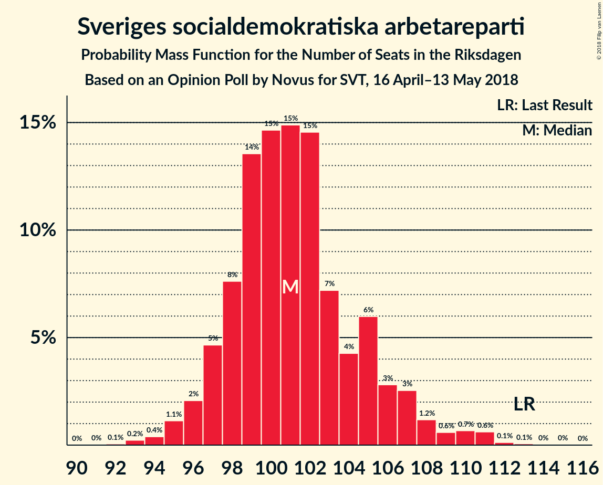
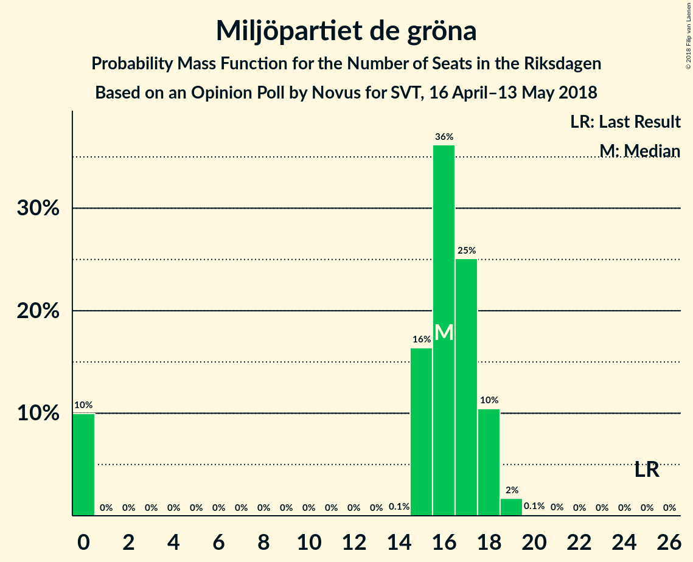
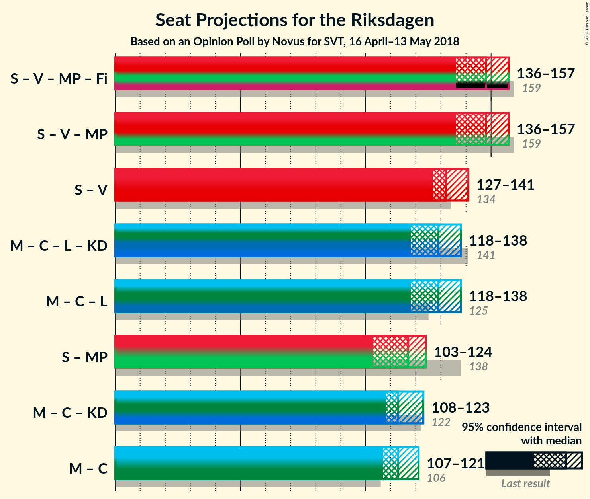

# Opinion Poll by Novus for SVT, 16 April–13 May 2018

<a href="#voting-intentions">Voting Intentions</a> | <a href="#seats">Seats</a> | <a href="#coalitions">Coalitions</a> | <a href="#technical-information">Technical Information</a>

## Voting Intentions

### Confidence Intervals

| Party | Last Result | Poll Result | 80% Confidence Interval | 90% Confidence Interval | 95% Confidence Interval | 99% Confidence Interval |
|:-----:|:-----------:|:-----------:|:-----------------------:|:-----------------------:|:-----------------------:|:-----------------------:|
| Sveriges socialdemokratiska arbetareparti | 31.0% | 26.9% | 26.1–27.7% |25.9–27.9% |25.7–28.1% |25.3–28.5% |
| Moderata samlingspartiet | 23.3% | 20.6% | 19.9–21.3% |19.7–21.5% |19.5–21.7% |19.2–22.1% |
| Sverigedemokraterna | 12.9% | 19.2% | 18.5–19.9% |18.3–20.1% |18.2–20.3% |17.8–20.6% |
| Centerpartiet | 6.1% | 9.4% | 8.9–9.9% |8.8–10.1% |8.6–10.2% |8.4–10.5% |
| Vänsterpartiet | 5.7% | 8.4% | 7.9–8.9% |7.8–9.1% |7.7–9.2% |7.5–9.4% |
| Liberalerna | 5.4% | 4.4% | 4.0–4.8% |3.9–4.9% |3.9–5.0% |3.7–5.2% |
| Miljöpartiet de gröna | 6.9% | 4.3% | 3.9–4.7% |3.9–4.8% |3.8–4.9% |3.6–5.1% |
| Kristdemokraterna | 4.6% | 3.5% | 3.2–3.9% |3.1–4.0% |3.0–4.0% |2.9–4.2% |

*Note:* The poll result column reflects the actual value used in the calculations. Published results may vary slightly, and in addition be rounded to fewer digits.

## Seats

### Confidence Intervals

| Party | Last Result | Median | 80% Confidence Interval | 90% Confidence Interval | 95% Confidence Interval | 99% Confidence Interval |
|:-----:|:-----------:|:------:|:-----------------------:|:-----------------------:|:-----------------------:|:-----------------------:|
| <a href="#sveriges-socialdemokratiska-arbetareparti">Sveriges socialdemokratiska arbetareparti</a> | 113 | 101 | 98–105 |97–107 |96–108 |94–111 |
| <a href="#moderata-samlingspartiet">Moderata samlingspartiet</a> | 84 | 78 | 75–81 |74–82 |73–83 |71–86 |
| <a href="#sverigedemokraterna">Sverigedemokraterna</a> | 49 | 72 | 70–75 |69–77 |68–78 |67–80 |
| <a href="#centerpartiet">Centerpartiet</a> | 22 | 36 | 33–38 |33–38 |32–39 |32–40 |
| <a href="#vänsterpartiet">Vänsterpartiet</a> | 21 | 32 | 30–33 |30–34 |29–35 |28–36 |
| <a href="#liberalerna">Liberalerna</a> | 19 | 16 | 15–18 |0–18 |0–19 |0–20 |
| <a href="#miljöpartiet-de-gröna">Miljöpartiet de gröna</a> | 25 | 16 | 14–18 |0–18 |0–18 |0–19 |
| <a href="#kristdemokraterna">Kristdemokraterna</a> | 16 | 0 | 0 |0 |0–14 |0–15 |

### Sveriges socialdemokratiska arbetareparti

*For a full overview of the results for this party, see the [Sveriges socialdemokratiska arbetareparti](party-sverigessocialdemokratiskaarbetareparti.html) page.*

| Number of Seats | Probability | Accumulated | Special Marks |
|:---------------:|:-----------:|:-----------:|:-------------:|
| 92 | 0.1% | 100% |  |
| 93 | 0.2% | 99.9% |  |
| 94 | 0.4% | 99.7% |  |
| 95 | 1.1% | 99.3% |  |
| 96 | 2% | 98% |  |
| 97 | 5% | 96% |  |
| 98 | 8% | 91% |  |
| 99 | 14% | 84% |  |
| 100 | 15% | 70% |  |
| 101 | 15% | 56% | Median |
| 102 | 15% | 41% |  |
| 103 | 7% | 26% |  |
| 104 | 4% | 19% |  |
| 105 | 6% | 15% |  |
| 106 | 3% | 9% |  |
| 107 | 3% | 6% |  |
| 108 | 1.2% | 3% |  |
| 109 | 0.6% | 2% |  |
| 110 | 0.7% | 2% |  |
| 111 | 0.6% | 0.9% |  |
| 112 | 0.1% | 0.3% |  |
| 113 | 0.1% | 0.1% | Last Result |
| 114 | 0% | 0.1% |  |
| 115 | 0% | 0% |  |

### Moderata samlingspartiet

*For a full overview of the results for this party, see the [Moderata samlingspartiet](party-moderatasamlingspartiet.html) page.*

| Number of Seats | Probability | Accumulated | Special Marks |
|:---------------:|:-----------:|:-----------:|:-------------:|
| 69 | 0% | 100% |  |
| 70 | 0.2% | 99.9% |  |
| 71 | 0.3% | 99.7% |  |
| 72 | 0.8% | 99.5% |  |
| 73 | 2% | 98.7% |  |
| 74 | 7% | 97% |  |
| 75 | 8% | 90% |  |
| 76 | 15% | 82% |  |
| 77 | 16% | 67% |  |
| 78 | 16% | 50% | Median |
| 79 | 9% | 35% |  |
| 80 | 14% | 25% |  |
| 81 | 4% | 11% |  |
| 82 | 4% | 7% |  |
| 83 | 2% | 4% |  |
| 84 | 0.6% | 2% | Last Result |
| 85 | 0.8% | 1.4% |  |
| 86 | 0.3% | 0.6% |  |
| 87 | 0.2% | 0.3% |  |
| 88 | 0.1% | 0.1% |  |
| 89 | 0% | 0% |  |

### Sverigedemokraterna

*For a full overview of the results for this party, see the [Sverigedemokraterna](party-sverigedemokraterna.html) page.*

| Number of Seats | Probability | Accumulated | Special Marks |
|:---------------:|:-----------:|:-----------:|:-------------:|
| 49 | 0% | 100% | Last Result |
| 50 | 0% | 100% |  |
| 51 | 0% | 100% |  |
| 52 | 0% | 100% |  |
| 53 | 0% | 100% |  |
| 54 | 0% | 100% |  |
| 55 | 0% | 100% |  |
| 56 | 0% | 100% |  |
| 57 | 0% | 100% |  |
| 58 | 0% | 100% |  |
| 59 | 0% | 100% |  |
| 60 | 0% | 100% |  |
| 61 | 0% | 100% |  |
| 62 | 0% | 100% |  |
| 63 | 0% | 100% |  |
| 64 | 0% | 100% |  |
| 65 | 0.1% | 100% |  |
| 66 | 0.3% | 99.8% |  |
| 67 | 1.0% | 99.6% |  |
| 68 | 2% | 98.6% |  |
| 69 | 4% | 97% |  |
| 70 | 11% | 92% |  |
| 71 | 16% | 81% |  |
| 72 | 20% | 65% | Median |
| 73 | 21% | 45% |  |
| 74 | 10% | 24% |  |
| 75 | 6% | 15% |  |
| 76 | 3% | 9% |  |
| 77 | 2% | 5% |  |
| 78 | 1.0% | 3% |  |
| 79 | 0.9% | 2% |  |
| 80 | 0.4% | 0.7% |  |
| 81 | 0.2% | 0.3% |  |
| 82 | 0.1% | 0.1% |  |
| 83 | 0% | 0.1% |  |
| 84 | 0% | 0% |  |

### Centerpartiet

*For a full overview of the results for this party, see the [Centerpartiet](party-centerpartiet.html) page.*

| Number of Seats | Probability | Accumulated | Special Marks |
|:---------------:|:-----------:|:-----------:|:-------------:|
| 22 | 0% | 100% | Last Result |
| 23 | 0% | 100% |  |
| 24 | 0% | 100% |  |
| 25 | 0% | 100% |  |
| 26 | 0% | 100% |  |
| 27 | 0% | 100% |  |
| 28 | 0% | 100% |  |
| 29 | 0% | 100% |  |
| 30 | 0% | 100% |  |
| 31 | 0.3% | 100% |  |
| 32 | 2% | 99.6% |  |
| 33 | 9% | 97% |  |
| 34 | 15% | 88% |  |
| 35 | 21% | 73% |  |
| 36 | 27% | 52% | Median |
| 37 | 14% | 24% |  |
| 38 | 6% | 11% |  |
| 39 | 4% | 5% |  |
| 40 | 1.1% | 1.3% |  |
| 41 | 0.1% | 0.2% |  |
| 42 | 0.1% | 0.1% |  |
| 43 | 0% | 0% |  |

### Vänsterpartiet

*For a full overview of the results for this party, see the [Vänsterpartiet](party-vänsterpartiet.html) page.*

| Number of Seats | Probability | Accumulated | Special Marks |
|:---------------:|:-----------:|:-----------:|:-------------:|
| 21 | 0% | 100% | Last Result |
| 22 | 0% | 100% |  |
| 23 | 0% | 100% |  |
| 24 | 0% | 100% |  |
| 25 | 0% | 100% |  |
| 26 | 0% | 100% |  |
| 27 | 0.1% | 100% |  |
| 28 | 0.5% | 99.9% |  |
| 29 | 3% | 99.4% |  |
| 30 | 19% | 96% |  |
| 31 | 25% | 77% |  |
| 32 | 25% | 53% | Median |
| 33 | 20% | 27% |  |
| 34 | 5% | 8% |  |
| 35 | 2% | 3% |  |
| 36 | 0.5% | 0.7% |  |
| 37 | 0.1% | 0.2% |  |
| 38 | 0% | 0% |  |

### Liberalerna

*For a full overview of the results for this party, see the [Liberalerna](party-liberalerna.html) page.*

| Number of Seats | Probability | Accumulated | Special Marks |
|:---------------:|:-----------:|:-----------:|:-------------:|
| 0 | 8% | 100% |  |
| 1 | 0% | 92% |  |
| 2 | 0% | 92% |  |
| 3 | 0% | 92% |  |
| 4 | 0% | 92% |  |
| 5 | 0% | 92% |  |
| 6 | 0% | 92% |  |
| 7 | 0% | 92% |  |
| 8 | 0% | 92% |  |
| 9 | 0% | 92% |  |
| 10 | 0% | 92% |  |
| 11 | 0% | 92% |  |
| 12 | 0% | 92% |  |
| 13 | 0% | 92% |  |
| 14 | 0.1% | 92% |  |
| 15 | 11% | 92% |  |
| 16 | 32% | 82% | Median |
| 17 | 32% | 49% |  |
| 18 | 14% | 18% |  |
| 19 | 4% | 4% | Last Result |
| 20 | 0.6% | 0.6% |  |
| 21 | 0% | 0% |  |

### Miljöpartiet de gröna

*For a full overview of the results for this party, see the [Miljöpartiet de gröna](party-miljöpartietdegröna.html) page.*

| Number of Seats | Probability | Accumulated | Special Marks |
|:---------------:|:-----------:|:-----------:|:-------------:|
| 0 | 10% | 100% |  |
| 1 | 0% | 90% |  |
| 2 | 0% | 90% |  |
| 3 | 0% | 90% |  |
| 4 | 0% | 90% |  |
| 5 | 0% | 90% |  |
| 6 | 0% | 90% |  |
| 7 | 0% | 90% |  |
| 8 | 0% | 90% |  |
| 9 | 0% | 90% |  |
| 10 | 0% | 90% |  |
| 11 | 0% | 90% |  |
| 12 | 0% | 90% |  |
| 13 | 0% | 90% |  |
| 14 | 0.1% | 90% |  |
| 15 | 16% | 90% |  |
| 16 | 36% | 74% | Median |
| 17 | 25% | 37% |  |
| 18 | 10% | 12% |  |
| 19 | 2% | 2% |  |
| 20 | 0.1% | 0.1% |  |
| 21 | 0% | 0% |  |
| 22 | 0% | 0% |  |
| 23 | 0% | 0% |  |
| 24 | 0% | 0% |  |
| 25 | 0% | 0% | Last Result |

### Kristdemokraterna

*For a full overview of the results for this party, see the [Kristdemokraterna](party-kristdemokraterna.html) page.*

| Number of Seats | Probability | Accumulated | Special Marks |
|:---------------:|:-----------:|:-----------:|:-------------:|
| 0 | 97% | 100% | Median |
| 1 | 0% | 3% |  |
| 2 | 0% | 3% |  |
| 3 | 0% | 3% |  |
| 4 | 0% | 3% |  |
| 5 | 0% | 3% |  |
| 6 | 0% | 3% |  |
| 7 | 0% | 3% |  |
| 8 | 0% | 3% |  |
| 9 | 0% | 3% |  |
| 10 | 0% | 3% |  |
| 11 | 0% | 3% |  |
| 12 | 0% | 3% |  |
| 13 | 0% | 3% |  |
| 14 | 0.2% | 3% |  |
| 15 | 2% | 2% |  |
| 16 | 0.4% | 0.5% | Last Result |
| 17 | 0% | 0% |  |

## Coalitions

### Confidence Intervals

| Coalition | Last Result | Median | Majority? | 80% Confidence Interval | 90% Confidence Interval | 95% Confidence Interval | 99% Confidence Interval |
|:---------:|:-----------:|:------:|:---------:|:-----------------------:|:-----------------------:|:-----------------------:|:-----------------------:|
| Sveriges socialdemokratiska arbetareparti – Vänsterpartiet – Miljöpartiet de gröna | 159 | 148 | 0% | 142–152 | 138–155 | 136–157 | 133–159 |
| Sveriges socialdemokratiska arbetareparti – Vänsterpartiet | 134 | 132 | 0% | 129–138 | 128–139 | 127–141 | 124–145 |
| Moderata samlingspartiet – Centerpartiet – Liberalerna – Kristdemokraterna | 141 | 129 | 0% | 124–134 | 119–137 | 118–138 | 115–143 |
| Moderata samlingspartiet – Centerpartiet – Liberalerna | 125 | 129 | 0% | 124–133 | 119–135 | 118–138 | 114–139 |
| Sveriges socialdemokratiska arbetareparti – Miljöpartiet de gröna | 138 | 117 | 0% | 111–121 | 105–122 | 103–124 | 101–126 |
| Moderata samlingspartiet – Centerpartiet – Kristdemokraterna | 122 | 113 | 0% | 110–118 | 109–121 | 108–123 | 107–127 |
| Moderata samlingspartiet – Centerpartiet | 106 | 113 | 0% | 109–118 | 108–119 | 107–121 | 105–123 |

### Sveriges socialdemokratiska arbetareparti – Vänsterpartiet – Miljöpartiet de gröna

| Number of Seats | Probability | Accumulated | Special Marks |
|:---------------:|:-----------:|:-----------:|:-------------:|
| 130 | 0% | 100% |  |
| 131 | 0.1% | 99.9% |  |
| 132 | 0.2% | 99.8% |  |
| 133 | 0.3% | 99.7% |  |
| 134 | 0.5% | 99.3% |  |
| 135 | 1.1% | 98.9% |  |
| 136 | 1.0% | 98% |  |
| 137 | 0.6% | 97% |  |
| 138 | 2% | 96% |  |
| 139 | 2% | 95% |  |
| 140 | 0.9% | 92% |  |
| 141 | 1.0% | 91% |  |
| 142 | 0.9% | 90% |  |
| 143 | 1.3% | 90% |  |
| 144 | 3% | 88% |  |
| 145 | 6% | 85% |  |
| 146 | 7% | 79% |  |
| 147 | 16% | 72% |  |
| 148 | 14% | 56% |  |
| 149 | 15% | 42% | Median |
| 150 | 9% | 27% |  |
| 151 | 6% | 18% |  |
| 152 | 4% | 13% |  |
| 153 | 2% | 8% |  |
| 154 | 0.9% | 7% |  |
| 155 | 2% | 6% |  |
| 156 | 0.9% | 4% |  |
| 157 | 1.1% | 3% |  |
| 158 | 1.1% | 2% |  |
| 159 | 0.4% | 0.7% | Last Result |
| 160 | 0.2% | 0.2% |  |
| 161 | 0.1% | 0.1% |  |
| 162 | 0% | 0% |  |

### Sveriges socialdemokratiska arbetareparti – Vänsterpartiet

| Number of Seats | Probability | Accumulated | Special Marks |
|:---------------:|:-----------:|:-----------:|:-------------:|
| 122 | 0.1% | 100% |  |
| 123 | 0.2% | 99.9% |  |
| 124 | 0.3% | 99.7% |  |
| 125 | 0.5% | 99.4% |  |
| 126 | 0.5% | 98.9% |  |
| 127 | 1.3% | 98% |  |
| 128 | 3% | 97% |  |
| 129 | 9% | 94% |  |
| 130 | 11% | 86% |  |
| 131 | 11% | 75% |  |
| 132 | 17% | 64% |  |
| 133 | 15% | 47% | Median |
| 134 | 8% | 32% | Last Result |
| 135 | 6% | 24% |  |
| 136 | 4% | 17% |  |
| 137 | 2% | 13% |  |
| 138 | 3% | 12% |  |
| 139 | 4% | 9% |  |
| 140 | 2% | 5% |  |
| 141 | 1.1% | 3% |  |
| 142 | 0.6% | 2% |  |
| 143 | 0.3% | 1.4% |  |
| 144 | 0.5% | 1.1% |  |
| 145 | 0.1% | 0.6% |  |
| 146 | 0.3% | 0.4% |  |
| 147 | 0% | 0.1% |  |
| 148 | 0% | 0.1% |  |
| 149 | 0% | 0% |  |

### Moderata samlingspartiet – Centerpartiet – Liberalerna – Kristdemokraterna

| Number of Seats | Probability | Accumulated | Special Marks |
|:---------------:|:-----------:|:-----------:|:-------------:|
| 113 | 0.3% | 100% |  |
| 114 | 0.1% | 99.7% |  |
| 115 | 0.6% | 99.6% |  |
| 116 | 0.5% | 98.9% |  |
| 117 | 0.2% | 98% |  |
| 118 | 2% | 98% |  |
| 119 | 2% | 96% |  |
| 120 | 0.2% | 95% |  |
| 121 | 0.8% | 94% |  |
| 122 | 0.2% | 94% |  |
| 123 | 2% | 93% |  |
| 124 | 2% | 92% |  |
| 125 | 3% | 90% |  |
| 126 | 6% | 87% |  |
| 127 | 7% | 81% |  |
| 128 | 18% | 75% |  |
| 129 | 17% | 57% |  |
| 130 | 6% | 40% | Median |
| 131 | 10% | 34% |  |
| 132 | 8% | 23% |  |
| 133 | 5% | 15% |  |
| 134 | 3% | 10% |  |
| 135 | 1.0% | 8% |  |
| 136 | 1.5% | 7% |  |
| 137 | 1.0% | 5% |  |
| 138 | 2% | 4% |  |
| 139 | 0.7% | 2% |  |
| 140 | 0.3% | 2% |  |
| 141 | 0.6% | 1.3% | Last Result |
| 142 | 0.2% | 0.7% |  |
| 143 | 0.3% | 0.5% |  |
| 144 | 0.1% | 0.3% |  |
| 145 | 0.1% | 0.2% |  |
| 146 | 0% | 0.1% |  |
| 147 | 0% | 0% |  |

### Moderata samlingspartiet – Centerpartiet – Liberalerna

| Number of Seats | Probability | Accumulated | Special Marks |
|:---------------:|:-----------:|:-----------:|:-------------:|
| 110 | 0% | 100% |  |
| 111 | 0.1% | 99.9% |  |
| 112 | 0% | 99.9% |  |
| 113 | 0.3% | 99.8% |  |
| 114 | 0.1% | 99.5% |  |
| 115 | 0.7% | 99.4% |  |
| 116 | 0.5% | 98.7% |  |
| 117 | 0.3% | 98% |  |
| 118 | 2% | 98% |  |
| 119 | 2% | 96% |  |
| 120 | 0.3% | 94% |  |
| 121 | 1.1% | 94% |  |
| 122 | 0.4% | 93% |  |
| 123 | 2% | 92% |  |
| 124 | 2% | 90% |  |
| 125 | 3% | 89% | Last Result |
| 126 | 6% | 86% |  |
| 127 | 7% | 80% |  |
| 128 | 18% | 73% |  |
| 129 | 17% | 54% |  |
| 130 | 6% | 37% | Median |
| 131 | 10% | 31% |  |
| 132 | 8% | 21% |  |
| 133 | 5% | 13% |  |
| 134 | 3% | 8% |  |
| 135 | 0.9% | 6% |  |
| 136 | 1.2% | 5% |  |
| 137 | 0.8% | 3% |  |
| 138 | 2% | 3% |  |
| 139 | 0.6% | 0.9% |  |
| 140 | 0.1% | 0.3% |  |
| 141 | 0.1% | 0.2% |  |
| 142 | 0.1% | 0.1% |  |
| 143 | 0% | 0% |  |

### Sveriges socialdemokratiska arbetareparti – Miljöpartiet de gröna

| Number of Seats | Probability | Accumulated | Special Marks |
|:---------------:|:-----------:|:-----------:|:-------------:|
| 98 | 0% | 100% |  |
| 99 | 0.1% | 99.9% |  |
| 100 | 0.2% | 99.9% |  |
| 101 | 0.2% | 99.6% |  |
| 102 | 1.0% | 99.4% |  |
| 103 | 1.4% | 98% |  |
| 104 | 1.0% | 97% |  |
| 105 | 2% | 96% |  |
| 106 | 0.8% | 94% |  |
| 107 | 1.1% | 93% |  |
| 108 | 0.8% | 92% |  |
| 109 | 0.7% | 91% |  |
| 110 | 0.7% | 91% |  |
| 111 | 2% | 90% |  |
| 112 | 2% | 89% |  |
| 113 | 3% | 86% |  |
| 114 | 8% | 83% |  |
| 115 | 11% | 75% |  |
| 116 | 13% | 65% |  |
| 117 | 17% | 52% | Median |
| 118 | 11% | 34% |  |
| 119 | 7% | 23% |  |
| 120 | 6% | 16% |  |
| 121 | 3% | 11% |  |
| 122 | 3% | 7% |  |
| 123 | 2% | 5% |  |
| 124 | 1.1% | 3% |  |
| 125 | 1.1% | 2% |  |
| 126 | 0.4% | 0.7% |  |
| 127 | 0.2% | 0.3% |  |
| 128 | 0.1% | 0.1% |  |
| 129 | 0% | 0% |  |
| 130 | 0% | 0% |  |
| 131 | 0% | 0% |  |
| 132 | 0% | 0% |  |
| 133 | 0% | 0% |  |
| 134 | 0% | 0% |  |
| 135 | 0% | 0% |  |
| 136 | 0% | 0% |  |
| 137 | 0% | 0% |  |
| 138 | 0% | 0% | Last Result |

### Moderata samlingspartiet – Centerpartiet – Kristdemokraterna

| Number of Seats | Probability | Accumulated | Special Marks |
|:---------------:|:-----------:|:-----------:|:-------------:|
| 105 | 0.1% | 100% |  |
| 106 | 0.3% | 99.8% |  |
| 107 | 2% | 99.6% |  |
| 108 | 2% | 98% |  |
| 109 | 5% | 96% |  |
| 110 | 7% | 91% |  |
| 111 | 10% | 84% |  |
| 112 | 20% | 74% |  |
| 113 | 8% | 53% |  |
| 114 | 12% | 46% | Median |
| 115 | 12% | 34% |  |
| 116 | 3% | 21% |  |
| 117 | 4% | 18% |  |
| 118 | 5% | 14% |  |
| 119 | 3% | 9% |  |
| 120 | 1.1% | 6% |  |
| 121 | 2% | 5% |  |
| 122 | 0.8% | 4% | Last Result |
| 123 | 0.8% | 3% |  |
| 124 | 0.4% | 2% |  |
| 125 | 0.3% | 2% |  |
| 126 | 0.6% | 1.3% |  |
| 127 | 0.3% | 0.7% |  |
| 128 | 0.1% | 0.4% |  |
| 129 | 0.1% | 0.3% |  |
| 130 | 0% | 0.2% |  |
| 131 | 0% | 0.2% |  |
| 132 | 0% | 0.1% |  |
| 133 | 0% | 0.1% |  |
| 134 | 0.1% | 0.1% |  |
| 135 | 0% | 0% |  |

### Moderata samlingspartiet – Centerpartiet

| Number of Seats | Probability | Accumulated | Special Marks |
|:---------------:|:-----------:|:-----------:|:-------------:|
| 103 | 0.2% | 100% |  |
| 104 | 0.1% | 99.8% |  |
| 105 | 0.2% | 99.7% |  |
| 106 | 0.6% | 99.4% | Last Result |
| 107 | 2% | 98.9% |  |
| 108 | 2% | 97% |  |
| 109 | 5% | 95% |  |
| 110 | 7% | 89% |  |
| 111 | 10% | 82% |  |
| 112 | 21% | 72% |  |
| 113 | 8% | 51% |  |
| 114 | 12% | 43% | Median |
| 115 | 12% | 31% |  |
| 116 | 3% | 19% |  |
| 117 | 4% | 16% |  |
| 118 | 5% | 11% |  |
| 119 | 3% | 7% |  |
| 120 | 1.0% | 4% |  |
| 121 | 1.4% | 3% |  |
| 122 | 0.7% | 2% |  |
| 123 | 0.6% | 1.1% |  |
| 124 | 0.2% | 0.5% |  |
| 125 | 0.1% | 0.2% |  |
| 126 | 0.1% | 0.2% |  |
| 127 | 0% | 0% |  |

## Technical Information

### Opinion Poll

+ **Polling firm:** Novus
+ **Commissioner(s):** SVT
+ **Fieldwork period:** 16 April–13 May 2018

### Calculations

+ **Sample size:** 5306
+ **Simulations done:** 1,048,576
+ **Error estimate:** 0.59%

