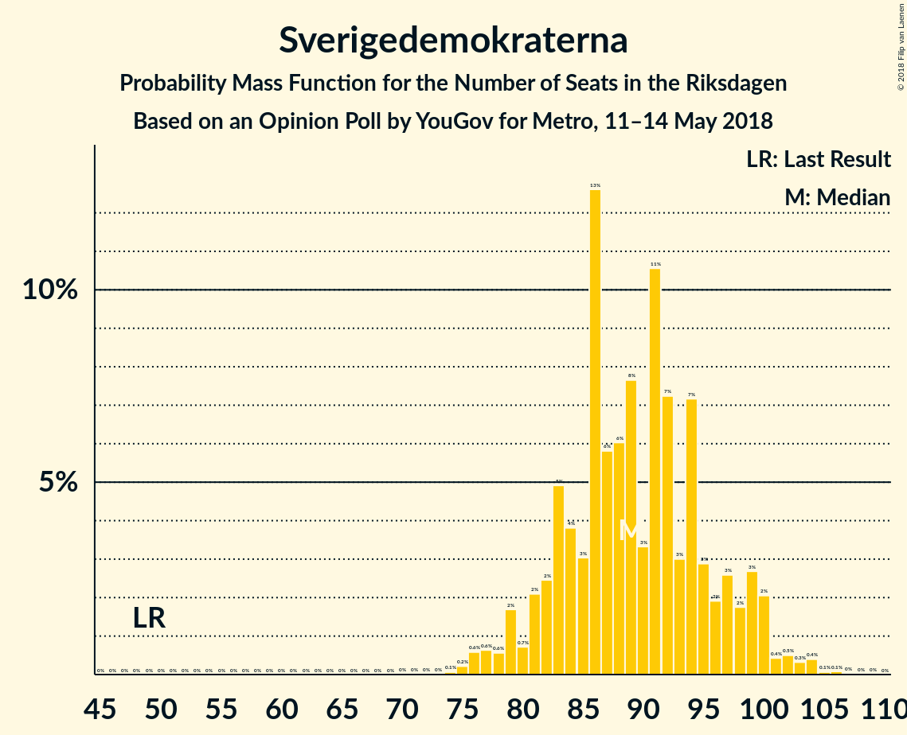
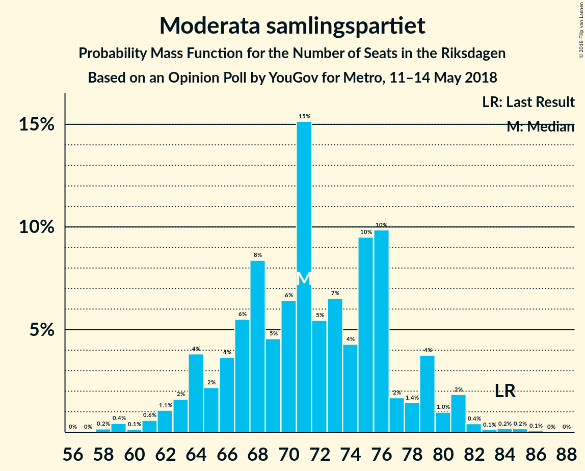
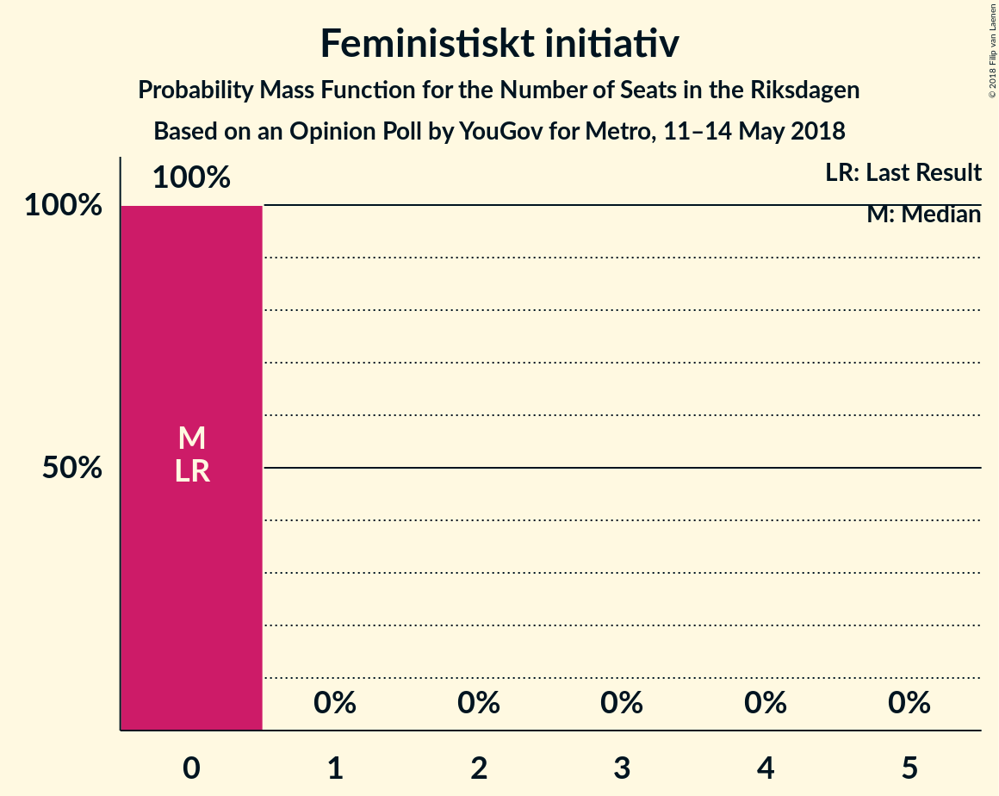
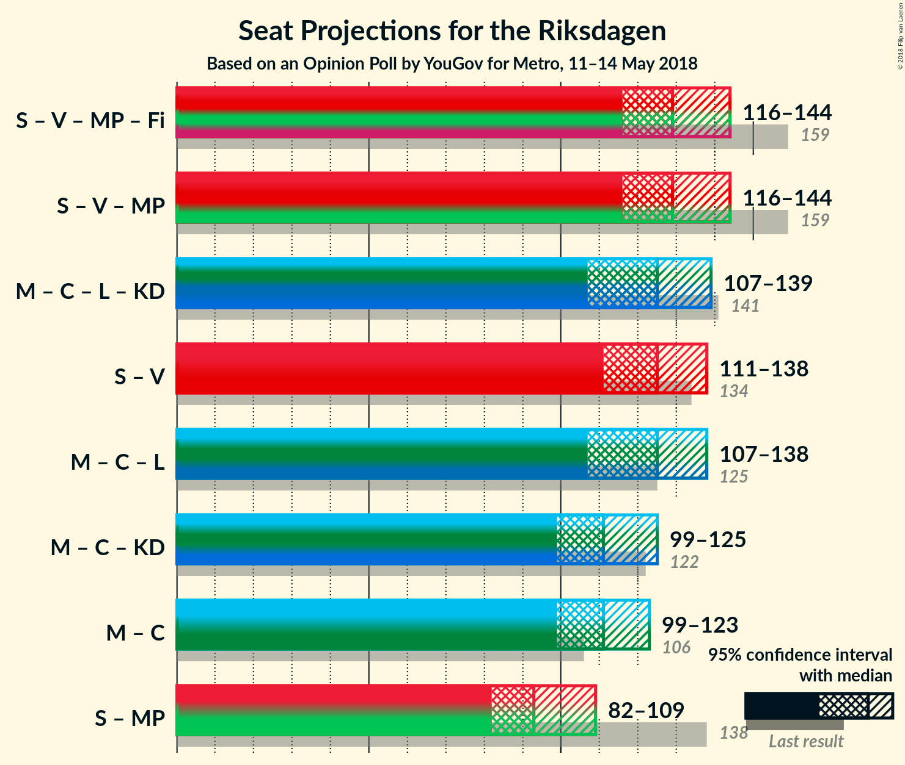

# Opinion Poll by YouGov for Metro, 11–14 May 2018

<a href="#voting-intentions">Voting Intentions</a> | <a href="#seats">Seats</a> | <a href="#coalitions">Coalitions</a> | <a href="#technical-information">Technical Information</a>

## Voting Intentions

### Confidence Intervals

| Party | Last Result | Poll Result | 80% Confidence Interval | 90% Confidence Interval | 95% Confidence Interval | 99% Confidence Interval |
|:-----:|:-----------:|:-----------:|:-----------------------:|:-----------------------:|:-----------------------:|:-----------------------:|
| Sveriges socialdemokratiska arbetareparti | 31.0% | 23.0% | 21.7–24.5% |21.3–24.9% |21.0–25.2% |20.4–25.9% |
| Sverigedemokraterna | 12.9% | 23.0% | 21.7–24.5% |21.3–24.9% |21.0–25.2% |20.4–25.9% |
| Moderata samlingspartiet | 23.3% | 18.3% | 17.1–19.6% |16.8–20.0% |16.4–20.3% |15.9–21.0% |
| Centerpartiet | 6.1% | 10.1% | 9.2–11.2% |8.9–11.5% |8.7–11.7% |8.3–12.3% |
| Vänsterpartiet | 5.7% | 9.0% | 8.1–10.0% |7.9–10.3% |7.7–10.5% |7.3–11.1% |
| Liberalerna | 5.4% | 4.2% | 3.6–4.9% |3.4–5.2% |3.3–5.3% |3.0–5.7% |
| Miljöpartiet de gröna | 6.9% | 3.6% | 3.1–4.3% |2.9–4.5% |2.8–4.7% |2.5–5.0% |
| Kristdemokraterna | 4.6% | 3.0% | 2.5–3.7% |2.4–3.9% |2.3–4.0% |2.1–4.3% |
| Feministiskt initiativ | 3.1% | 1.8% | 1.4–2.3% |1.3–2.4% |1.2–2.6% |1.1–2.9% |

*Note:* The poll result column reflects the actual value used in the calculations. Published results may vary slightly, and in addition be rounded to fewer digits.

## Seats

### Confidence Intervals

| Party | Last Result | Median | 80% Confidence Interval | 90% Confidence Interval | 95% Confidence Interval | 99% Confidence Interval |
|:-----:|:-----------:|:------:|:-----------------------:|:-----------------------:|:-----------------------:|:-----------------------:|
| <a href="#sveriges-socialdemokratiska-arbetareparti">Sveriges socialdemokratiska arbetareparti</a> | 113 | 88 | 83–97 |81–98 |80–101 |77–102 |
| <a href="#sverigedemokraterna">Sverigedemokraterna</a> | 49 | 91 | 82–99 |78–101 |77–102 |75–105 |
| <a href="#moderata-samlingspartiet">Moderata samlingspartiet</a> | 84 | 69 | 65–77 |63–79 |62–81 |59–82 |
| <a href="#centerpartiet">Centerpartiet</a> | 22 | 39 | 35–45 |34–48 |33–48 |31–49 |
| <a href="#vänsterpartiet">Vänsterpartiet</a> | 21 | 34 | 31–40 |30–42 |29–43 |28–43 |
| <a href="#liberalerna">Liberalerna</a> | 19 | 16 | 0–19 |0–20 |0–20 |0–22 |
| <a href="#miljöpartiet-de-gröna">Miljöpartiet de gröna</a> | 25 | 0 | 0–17 |0–17 |0–18 |0–20 |
| <a href="#kristdemokraterna">Kristdemokraterna</a> | 16 | 0 | 0 |0 |0–16 |0–18 |
| <a href="#feministiskt-initiativ">Feministiskt initiativ</a> | 0 | 0 | 0 |0 |0 |0 |

### Sveriges socialdemokratiska arbetareparti

*For a full overview of the results for this party, see the [Sveriges socialdemokratiska arbetareparti](party-sverigessocialdemokratiskaarbetareparti.html) page.*

| Number of Seats | Probability | Accumulated | Special Marks |
|:---------------:|:-----------:|:-----------:|:-------------:|
| 74 | 0% | 100% |  |
| 75 | 0.2% | 99.9% |  |
| 76 | 0.1% | 99.7% |  |
| 77 | 0.3% | 99.6% |  |
| 78 | 0.3% | 99.3% |  |
| 79 | 0.7% | 99.0% |  |
| 80 | 1.2% | 98% |  |
| 81 | 3% | 97% |  |
| 82 | 3% | 94% |  |
| 83 | 16% | 91% |  |
| 84 | 6% | 75% |  |
| 85 | 2% | 69% |  |
| 86 | 7% | 67% |  |
| 87 | 6% | 60% |  |
| 88 | 5% | 54% | Median |
| 89 | 5% | 49% |  |
| 90 | 7% | 44% |  |
| 91 | 7% | 36% |  |
| 92 | 3% | 29% |  |
| 93 | 3% | 26% |  |
| 94 | 4% | 23% |  |
| 95 | 7% | 19% |  |
| 96 | 2% | 12% |  |
| 97 | 4% | 11% |  |
| 98 | 2% | 7% |  |
| 99 | 1.3% | 5% |  |
| 100 | 0.9% | 4% |  |
| 101 | 2% | 3% |  |
| 102 | 0.2% | 0.6% |  |
| 103 | 0.1% | 0.4% |  |
| 104 | 0.1% | 0.4% |  |
| 105 | 0% | 0.3% |  |
| 106 | 0% | 0.3% |  |
| 107 | 0% | 0.2% |  |
| 108 | 0.2% | 0.2% |  |
| 109 | 0% | 0% |  |
| 110 | 0% | 0% |  |
| 111 | 0% | 0% |  |
| 112 | 0% | 0% |  |
| 113 | 0% | 0% | Last Result |

### Sverigedemokraterna

*For a full overview of the results for this party, see the [Sverigedemokraterna](party-sverigedemokraterna.html) page.*

| Number of Seats | Probability | Accumulated | Special Marks |
|:---------------:|:-----------:|:-----------:|:-------------:|
| 49 | 0% | 100% | Last Result |
| 50 | 0% | 100% |  |
| 51 | 0% | 100% |  |
| 52 | 0% | 100% |  |
| 53 | 0% | 100% |  |
| 54 | 0% | 100% |  |
| 55 | 0% | 100% |  |
| 56 | 0% | 100% |  |
| 57 | 0% | 100% |  |
| 58 | 0% | 100% |  |
| 59 | 0% | 100% |  |
| 60 | 0% | 100% |  |
| 61 | 0% | 100% |  |
| 62 | 0% | 100% |  |
| 63 | 0% | 100% |  |
| 64 | 0% | 100% |  |
| 65 | 0% | 100% |  |
| 66 | 0% | 100% |  |
| 67 | 0% | 100% |  |
| 68 | 0% | 100% |  |
| 69 | 0% | 100% |  |
| 70 | 0% | 100% |  |
| 71 | 0% | 100% |  |
| 72 | 0% | 100% |  |
| 73 | 0% | 99.9% |  |
| 74 | 0% | 99.9% |  |
| 75 | 0.5% | 99.9% |  |
| 76 | 0.7% | 99.3% |  |
| 77 | 3% | 98.7% |  |
| 78 | 1.1% | 96% |  |
| 79 | 2% | 95% |  |
| 80 | 1.2% | 93% |  |
| 81 | 1.2% | 92% |  |
| 82 | 4% | 91% |  |
| 83 | 5% | 86% |  |
| 84 | 6% | 81% |  |
| 85 | 3% | 75% |  |
| 86 | 5% | 72% |  |
| 87 | 2% | 67% |  |
| 88 | 5% | 65% |  |
| 89 | 7% | 61% |  |
| 90 | 2% | 54% |  |
| 91 | 4% | 52% | Median |
| 92 | 17% | 48% |  |
| 93 | 3% | 31% |  |
| 94 | 2% | 28% |  |
| 95 | 4% | 26% |  |
| 96 | 4% | 22% |  |
| 97 | 1.2% | 18% |  |
| 98 | 3% | 17% |  |
| 99 | 6% | 14% |  |
| 100 | 3% | 8% |  |
| 101 | 2% | 5% |  |
| 102 | 2% | 3% |  |
| 103 | 0.3% | 1.1% |  |
| 104 | 0.2% | 0.8% |  |
| 105 | 0.2% | 0.6% |  |
| 106 | 0.3% | 0.4% |  |
| 107 | 0.1% | 0.1% |  |
| 108 | 0% | 0% |  |

### Moderata samlingspartiet

*For a full overview of the results for this party, see the [Moderata samlingspartiet](party-moderatasamlingspartiet.html) page.*

| Number of Seats | Probability | Accumulated | Special Marks |
|:---------------:|:-----------:|:-----------:|:-------------:|
| 57 | 0% | 100% |  |
| 58 | 0% | 99.9% |  |
| 59 | 1.1% | 99.9% |  |
| 60 | 0.1% | 98.9% |  |
| 61 | 0.9% | 98.7% |  |
| 62 | 0.9% | 98% |  |
| 63 | 4% | 97% |  |
| 64 | 1.1% | 93% |  |
| 65 | 4% | 92% |  |
| 66 | 3% | 89% |  |
| 67 | 7% | 86% |  |
| 68 | 22% | 79% |  |
| 69 | 9% | 58% | Median |
| 70 | 2% | 49% |  |
| 71 | 7% | 46% |  |
| 72 | 8% | 39% |  |
| 73 | 6% | 31% |  |
| 74 | 6% | 26% |  |
| 75 | 5% | 19% |  |
| 76 | 4% | 15% |  |
| 77 | 2% | 11% |  |
| 78 | 2% | 9% |  |
| 79 | 2% | 6% |  |
| 80 | 0.6% | 4% |  |
| 81 | 2% | 4% |  |
| 82 | 1.2% | 2% |  |
| 83 | 0% | 0.3% |  |
| 84 | 0% | 0.3% | Last Result |
| 85 | 0.1% | 0.2% |  |
| 86 | 0% | 0.1% |  |
| 87 | 0% | 0.1% |  |
| 88 | 0% | 0% |  |

### Centerpartiet

*For a full overview of the results for this party, see the [Centerpartiet](party-centerpartiet.html) page.*

| Number of Seats | Probability | Accumulated | Special Marks |
|:---------------:|:-----------:|:-----------:|:-------------:|
| 22 | 0% | 100% | Last Result |
| 23 | 0% | 100% |  |
| 24 | 0% | 100% |  |
| 25 | 0% | 100% |  |
| 26 | 0% | 100% |  |
| 27 | 0% | 100% |  |
| 28 | 0% | 100% |  |
| 29 | 0% | 100% |  |
| 30 | 0.2% | 99.9% |  |
| 31 | 0.6% | 99.7% |  |
| 32 | 0.2% | 99.1% |  |
| 33 | 3% | 98.9% |  |
| 34 | 1.3% | 96% |  |
| 35 | 7% | 94% |  |
| 36 | 6% | 88% |  |
| 37 | 10% | 82% |  |
| 38 | 7% | 72% |  |
| 39 | 20% | 65% | Median |
| 40 | 9% | 44% |  |
| 41 | 7% | 36% |  |
| 42 | 7% | 28% |  |
| 43 | 2% | 22% |  |
| 44 | 8% | 20% |  |
| 45 | 2% | 11% |  |
| 46 | 4% | 9% |  |
| 47 | 0.4% | 6% |  |
| 48 | 4% | 5% |  |
| 49 | 1.2% | 1.4% |  |
| 50 | 0.1% | 0.2% |  |
| 51 | 0.1% | 0.1% |  |
| 52 | 0% | 0% |  |

### Vänsterpartiet

*For a full overview of the results for this party, see the [Vänsterpartiet](party-vänsterpartiet.html) page.*

| Number of Seats | Probability | Accumulated | Special Marks |
|:---------------:|:-----------:|:-----------:|:-------------:|
| 21 | 0% | 100% | Last Result |
| 22 | 0% | 100% |  |
| 23 | 0% | 100% |  |
| 24 | 0% | 100% |  |
| 25 | 0.1% | 100% |  |
| 26 | 0.1% | 99.9% |  |
| 27 | 0.3% | 99.9% |  |
| 28 | 1.3% | 99.5% |  |
| 29 | 2% | 98% |  |
| 30 | 4% | 97% |  |
| 31 | 5% | 92% |  |
| 32 | 11% | 87% |  |
| 33 | 8% | 76% |  |
| 34 | 20% | 68% | Median |
| 35 | 6% | 48% |  |
| 36 | 7% | 42% |  |
| 37 | 12% | 36% |  |
| 38 | 7% | 24% |  |
| 39 | 5% | 17% |  |
| 40 | 4% | 12% |  |
| 41 | 2% | 8% |  |
| 42 | 2% | 6% |  |
| 43 | 4% | 4% |  |
| 44 | 0.2% | 0.4% |  |
| 45 | 0.1% | 0.2% |  |
| 46 | 0% | 0.1% |  |
| 47 | 0% | 0% |  |

### Liberalerna

*For a full overview of the results for this party, see the [Liberalerna](party-liberalerna.html) page.*

| Number of Seats | Probability | Accumulated | Special Marks |
|:---------------:|:-----------:|:-----------:|:-------------:|
| 0 | 31% | 100% |  |
| 1 | 0% | 69% |  |
| 2 | 0% | 69% |  |
| 3 | 0% | 69% |  |
| 4 | 0% | 69% |  |
| 5 | 0% | 69% |  |
| 6 | 0% | 69% |  |
| 7 | 0% | 69% |  |
| 8 | 0% | 69% |  |
| 9 | 0% | 69% |  |
| 10 | 0% | 69% |  |
| 11 | 0% | 69% |  |
| 12 | 0% | 69% |  |
| 13 | 0% | 69% |  |
| 14 | 0% | 69% |  |
| 15 | 6% | 69% |  |
| 16 | 27% | 64% | Median |
| 17 | 15% | 37% |  |
| 18 | 8% | 22% |  |
| 19 | 8% | 14% | Last Result |
| 20 | 4% | 6% |  |
| 21 | 1.1% | 2% |  |
| 22 | 0.6% | 1.0% |  |
| 23 | 0.3% | 0.4% |  |
| 24 | 0.1% | 0.1% |  |
| 25 | 0% | 0% |  |

### Miljöpartiet de gröna

*For a full overview of the results for this party, see the [Miljöpartiet de gröna](party-miljöpartietdegröna.html) page.*

| Number of Seats | Probability | Accumulated | Special Marks |
|:---------------:|:-----------:|:-----------:|:-------------:|
| 0 | 66% | 100% | Median |
| 1 | 0% | 34% |  |
| 2 | 0% | 34% |  |
| 3 | 0% | 34% |  |
| 4 | 0% | 34% |  |
| 5 | 0% | 34% |  |
| 6 | 0% | 34% |  |
| 7 | 0% | 34% |  |
| 8 | 0% | 34% |  |
| 9 | 0% | 34% |  |
| 10 | 0% | 34% |  |
| 11 | 0% | 34% |  |
| 12 | 0% | 34% |  |
| 13 | 0% | 34% |  |
| 14 | 0% | 34% |  |
| 15 | 4% | 34% |  |
| 16 | 5% | 29% |  |
| 17 | 21% | 24% |  |
| 18 | 2% | 3% |  |
| 19 | 0.4% | 1.0% |  |
| 20 | 0.5% | 0.5% |  |
| 21 | 0.1% | 0.1% |  |
| 22 | 0% | 0% |  |
| 23 | 0% | 0% |  |
| 24 | 0% | 0% |  |
| 25 | 0% | 0% | Last Result |

### Kristdemokraterna

*For a full overview of the results for this party, see the [Kristdemokraterna](party-kristdemokraterna.html) page.*

| Number of Seats | Probability | Accumulated | Special Marks |
|:---------------:|:-----------:|:-----------:|:-------------:|
| 0 | 97% | 100% | Median |
| 1 | 0% | 3% |  |
| 2 | 0% | 3% |  |
| 3 | 0% | 3% |  |
| 4 | 0% | 3% |  |
| 5 | 0% | 3% |  |
| 6 | 0% | 3% |  |
| 7 | 0% | 3% |  |
| 8 | 0% | 3% |  |
| 9 | 0% | 3% |  |
| 10 | 0% | 3% |  |
| 11 | 0% | 3% |  |
| 12 | 0% | 3% |  |
| 13 | 0% | 3% |  |
| 14 | 0% | 3% |  |
| 15 | 0.2% | 3% |  |
| 16 | 2% | 3% | Last Result |
| 17 | 1.1% | 2% |  |
| 18 | 0.5% | 0.5% |  |
| 19 | 0% | 0% |  |

### Feministiskt initiativ

*For a full overview of the results for this party, see the [Feministiskt initiativ](party-feministisktinitiativ.html) page.*

| Number of Seats | Probability | Accumulated | Special Marks |
|:---------------:|:-----------:|:-----------:|:-------------:|
| 0 | 100% | 100% | Last Result, Median |

## Coalitions

### Confidence Intervals

| Coalition | Last Result | Median | Majority? | 80% Confidence Interval | 90% Confidence Interval | 95% Confidence Interval | 99% Confidence Interval |
|:---------:|:-----------:|:------:|:---------:|:-----------------------:|:-----------------------:|:-----------------------:|:-----------------------:|
| Sveriges socialdemokratiska arbetareparti – Vänsterpartiet – Miljöpartiet de gröna – Feministiskt initiativ | 159 | 129 | 0% | 119–139 | 118–144 | 115–145 | 112–151 |
| Sveriges socialdemokratiska arbetareparti – Vänsterpartiet – Miljöpartiet de gröna | 159 | 129 | 0% | 119–139 | 118–144 | 115–145 | 112–151 |
| Moderata samlingspartiet – Centerpartiet – Liberalerna – Kristdemokraterna | 141 | 123 | 0% | 112–133 | 107–139 | 106–139 | 103–143 |
| Moderata samlingspartiet – Centerpartiet – Liberalerna | 125 | 123 | 0% | 110–132 | 106–139 | 106–139 | 102–143 |
| Sveriges socialdemokratiska arbetareparti – Vänsterpartiet | 134 | 124 | 0% | 117–133 | 116–138 | 114–138 | 110–139 |
| Moderata samlingspartiet – Centerpartiet – Kristdemokraterna | 122 | 109 | 0% | 103–120 | 101–123 | 99–126 | 94–130 |
| Moderata samlingspartiet – Centerpartiet | 106 | 109 | 0% | 103–120 | 101–122 | 99–123 | 94–127 |
| Sveriges socialdemokratiska arbetareparti – Miljöpartiet de gröna | 138 | 94 | 0% | 84–106 | 82–109 | 81–111 | 78–116 |

### Sveriges socialdemokratiska arbetareparti – Vänsterpartiet – Miljöpartiet de gröna – Feministiskt initiativ

| Number of Seats | Probability | Accumulated | Special Marks |
|:---------------:|:-----------:|:-----------:|:-------------:|
| 109 | 0% | 100% |  |
| 110 | 0.2% | 99.9% |  |
| 111 | 0.1% | 99.8% |  |
| 112 | 0.8% | 99.7% |  |
| 113 | 0.5% | 98.9% |  |
| 114 | 0.6% | 98% |  |
| 115 | 0.4% | 98% |  |
| 116 | 2% | 97% |  |
| 117 | 0.8% | 96% |  |
| 118 | 4% | 95% |  |
| 119 | 2% | 91% |  |
| 120 | 6% | 89% |  |
| 121 | 2% | 83% |  |
| 122 | 3% | 81% | Median |
| 123 | 1.0% | 78% |  |
| 124 | 3% | 77% |  |
| 125 | 6% | 74% |  |
| 126 | 7% | 68% |  |
| 127 | 3% | 61% |  |
| 128 | 6% | 58% |  |
| 129 | 4% | 52% |  |
| 130 | 3% | 48% |  |
| 131 | 1.2% | 44% |  |
| 132 | 3% | 43% |  |
| 133 | 2% | 40% |  |
| 134 | 15% | 38% |  |
| 135 | 3% | 23% |  |
| 136 | 2% | 20% |  |
| 137 | 1.1% | 18% |  |
| 138 | 6% | 17% |  |
| 139 | 0.9% | 11% |  |
| 140 | 0.7% | 10% |  |
| 141 | 2% | 9% |  |
| 142 | 0.1% | 8% |  |
| 143 | 2% | 8% |  |
| 144 | 3% | 6% |  |
| 145 | 1.0% | 3% |  |
| 146 | 0.3% | 2% |  |
| 147 | 0.1% | 1.5% |  |
| 148 | 0.1% | 1.4% |  |
| 149 | 0.1% | 1.3% |  |
| 150 | 0.3% | 1.2% |  |
| 151 | 0.8% | 0.9% |  |
| 152 | 0% | 0.1% |  |
| 153 | 0% | 0.1% |  |
| 154 | 0% | 0% |  |
| 155 | 0% | 0% |  |
| 156 | 0% | 0% |  |
| 157 | 0% | 0% |  |
| 158 | 0% | 0% |  |
| 159 | 0% | 0% | Last Result |

### Sveriges socialdemokratiska arbetareparti – Vänsterpartiet – Miljöpartiet de gröna

| Number of Seats | Probability | Accumulated | Special Marks |
|:---------------:|:-----------:|:-----------:|:-------------:|
| 109 | 0% | 100% |  |
| 110 | 0.2% | 99.9% |  |
| 111 | 0.1% | 99.8% |  |
| 112 | 0.8% | 99.7% |  |
| 113 | 0.5% | 98.9% |  |
| 114 | 0.6% | 98% |  |
| 115 | 0.4% | 98% |  |
| 116 | 2% | 97% |  |
| 117 | 0.8% | 96% |  |
| 118 | 4% | 95% |  |
| 119 | 2% | 91% |  |
| 120 | 6% | 89% |  |
| 121 | 2% | 83% |  |
| 122 | 3% | 81% | Median |
| 123 | 1.0% | 78% |  |
| 124 | 3% | 77% |  |
| 125 | 6% | 74% |  |
| 126 | 7% | 68% |  |
| 127 | 3% | 61% |  |
| 128 | 6% | 58% |  |
| 129 | 4% | 52% |  |
| 130 | 3% | 48% |  |
| 131 | 1.2% | 44% |  |
| 132 | 3% | 43% |  |
| 133 | 2% | 40% |  |
| 134 | 15% | 38% |  |
| 135 | 3% | 23% |  |
| 136 | 2% | 20% |  |
| 137 | 1.1% | 18% |  |
| 138 | 6% | 17% |  |
| 139 | 0.9% | 11% |  |
| 140 | 0.7% | 10% |  |
| 141 | 2% | 9% |  |
| 142 | 0.1% | 8% |  |
| 143 | 2% | 8% |  |
| 144 | 3% | 6% |  |
| 145 | 1.0% | 3% |  |
| 146 | 0.3% | 2% |  |
| 147 | 0.1% | 1.5% |  |
| 148 | 0.1% | 1.4% |  |
| 149 | 0.1% | 1.3% |  |
| 150 | 0.3% | 1.2% |  |
| 151 | 0.8% | 0.9% |  |
| 152 | 0% | 0.1% |  |
| 153 | 0% | 0.1% |  |
| 154 | 0% | 0% |  |
| 155 | 0% | 0% |  |
| 156 | 0% | 0% |  |
| 157 | 0% | 0% |  |
| 158 | 0% | 0% |  |
| 159 | 0% | 0% | Last Result |

### Moderata samlingspartiet – Centerpartiet – Liberalerna – Kristdemokraterna

| Number of Seats | Probability | Accumulated | Special Marks |
|:---------------:|:-----------:|:-----------:|:-------------:|
| 98 | 0.1% | 100% |  |
| 99 | 0% | 99.9% |  |
| 100 | 0% | 99.9% |  |
| 101 | 0% | 99.9% |  |
| 102 | 0.3% | 99.9% |  |
| 103 | 0.3% | 99.5% |  |
| 104 | 0.1% | 99.3% |  |
| 105 | 0.5% | 99.1% |  |
| 106 | 3% | 98.6% |  |
| 107 | 2% | 96% |  |
| 108 | 0.3% | 94% |  |
| 109 | 3% | 94% |  |
| 110 | 0.6% | 91% |  |
| 111 | 0.5% | 91% |  |
| 112 | 5% | 90% |  |
| 113 | 3% | 85% |  |
| 114 | 0.8% | 83% |  |
| 115 | 3% | 82% |  |
| 116 | 1.0% | 79% |  |
| 117 | 4% | 78% |  |
| 118 | 0.8% | 74% |  |
| 119 | 2% | 73% |  |
| 120 | 8% | 71% |  |
| 121 | 1.3% | 62% |  |
| 122 | 2% | 61% |  |
| 123 | 17% | 59% |  |
| 124 | 3% | 42% | Median |
| 125 | 4% | 38% |  |
| 126 | 3% | 34% |  |
| 127 | 4% | 31% |  |
| 128 | 1.0% | 27% |  |
| 129 | 5% | 26% |  |
| 130 | 4% | 21% |  |
| 131 | 4% | 17% |  |
| 132 | 3% | 14% |  |
| 133 | 2% | 11% |  |
| 134 | 0.9% | 9% |  |
| 135 | 0.9% | 8% |  |
| 136 | 0.4% | 7% |  |
| 137 | 0.2% | 7% |  |
| 138 | 0.8% | 7% |  |
| 139 | 4% | 6% |  |
| 140 | 0.2% | 2% |  |
| 141 | 0.4% | 2% | Last Result |
| 142 | 0.1% | 2% |  |
| 143 | 1.0% | 1.4% |  |
| 144 | 0.1% | 0.4% |  |
| 145 | 0.1% | 0.3% |  |
| 146 | 0% | 0.2% |  |
| 147 | 0.2% | 0.2% |  |
| 148 | 0% | 0% |  |

### Moderata samlingspartiet – Centerpartiet – Liberalerna

| Number of Seats | Probability | Accumulated | Special Marks |
|:---------------:|:-----------:|:-----------:|:-------------:|
| 98 | 0.1% | 100% |  |
| 99 | 0% | 99.9% |  |
| 100 | 0% | 99.9% |  |
| 101 | 0.1% | 99.8% |  |
| 102 | 0.3% | 99.8% |  |
| 103 | 0.4% | 99.4% |  |
| 104 | 0.3% | 99.0% |  |
| 105 | 0.8% | 98.7% |  |
| 106 | 3% | 98% |  |
| 107 | 2% | 95% |  |
| 108 | 0.3% | 93% |  |
| 109 | 3% | 93% |  |
| 110 | 0.6% | 90% |  |
| 111 | 0.6% | 90% |  |
| 112 | 5% | 89% |  |
| 113 | 3% | 84% |  |
| 114 | 0.9% | 82% |  |
| 115 | 3% | 81% |  |
| 116 | 1.1% | 77% |  |
| 117 | 4% | 76% |  |
| 118 | 0.9% | 72% |  |
| 119 | 2% | 71% |  |
| 120 | 8% | 69% |  |
| 121 | 2% | 61% |  |
| 122 | 2% | 59% |  |
| 123 | 17% | 57% |  |
| 124 | 3% | 40% | Median |
| 125 | 5% | 37% | Last Result |
| 126 | 3% | 32% |  |
| 127 | 4% | 29% |  |
| 128 | 1.0% | 24% |  |
| 129 | 5% | 23% |  |
| 130 | 3% | 19% |  |
| 131 | 3% | 15% |  |
| 132 | 3% | 12% |  |
| 133 | 2% | 9% |  |
| 134 | 0.8% | 7% |  |
| 135 | 0.8% | 7% |  |
| 136 | 0.4% | 6% |  |
| 137 | 0.1% | 5% |  |
| 138 | 0.4% | 5% |  |
| 139 | 4% | 5% |  |
| 140 | 0.2% | 1.3% |  |
| 141 | 0.4% | 1.1% |  |
| 142 | 0.1% | 0.7% |  |
| 143 | 0.4% | 0.5% |  |
| 144 | 0.1% | 0.2% |  |
| 145 | 0.1% | 0.1% |  |
| 146 | 0% | 0% |  |

### Sveriges socialdemokratiska arbetareparti – Vänsterpartiet

| Number of Seats | Probability | Accumulated | Special Marks |
|:---------------:|:-----------:|:-----------:|:-------------:|
| 106 | 0.1% | 100% |  |
| 107 | 0.1% | 99.9% |  |
| 108 | 0.2% | 99.8% |  |
| 109 | 0.1% | 99.6% |  |
| 110 | 0.3% | 99.5% |  |
| 111 | 0.1% | 99.2% |  |
| 112 | 1.0% | 99.1% |  |
| 113 | 0.6% | 98% |  |
| 114 | 0.9% | 98% |  |
| 115 | 2% | 97% |  |
| 116 | 2% | 95% |  |
| 117 | 15% | 93% |  |
| 118 | 5% | 77% |  |
| 119 | 3% | 73% |  |
| 120 | 9% | 70% |  |
| 121 | 3% | 60% |  |
| 122 | 3% | 57% | Median |
| 123 | 1.3% | 54% |  |
| 124 | 4% | 52% |  |
| 125 | 7% | 48% |  |
| 126 | 9% | 42% |  |
| 127 | 3% | 33% |  |
| 128 | 9% | 30% |  |
| 129 | 4% | 20% |  |
| 130 | 3% | 16% |  |
| 131 | 0.6% | 13% |  |
| 132 | 3% | 13% |  |
| 133 | 1.0% | 10% |  |
| 134 | 2% | 9% | Last Result |
| 135 | 0.3% | 7% |  |
| 136 | 0.5% | 7% |  |
| 137 | 0.5% | 7% |  |
| 138 | 6% | 6% |  |
| 139 | 0.1% | 0.5% |  |
| 140 | 0.1% | 0.4% |  |
| 141 | 0.1% | 0.3% |  |
| 142 | 0% | 0.3% |  |
| 143 | 0% | 0.3% |  |
| 144 | 0% | 0.2% |  |
| 145 | 0.1% | 0.2% |  |
| 146 | 0.1% | 0.1% |  |
| 147 | 0% | 0% |  |

### Moderata samlingspartiet – Centerpartiet – Kristdemokraterna

| Number of Seats | Probability | Accumulated | Special Marks |
|:---------------:|:-----------:|:-----------:|:-------------:|
| 93 | 0% | 100% |  |
| 94 | 0.7% | 99.9% |  |
| 95 | 0.1% | 99.3% |  |
| 96 | 0.2% | 99.1% |  |
| 97 | 0.1% | 98.9% |  |
| 98 | 0.9% | 98.8% |  |
| 99 | 1.1% | 98% |  |
| 100 | 0.5% | 97% |  |
| 101 | 4% | 96% |  |
| 102 | 2% | 92% |  |
| 103 | 1.4% | 91% |  |
| 104 | 0.9% | 89% |  |
| 105 | 4% | 89% |  |
| 106 | 5% | 84% |  |
| 107 | 17% | 79% |  |
| 108 | 7% | 62% | Median |
| 109 | 5% | 55% |  |
| 110 | 2% | 50% |  |
| 111 | 2% | 48% |  |
| 112 | 12% | 45% |  |
| 113 | 5% | 33% |  |
| 114 | 4% | 28% |  |
| 115 | 3% | 24% |  |
| 116 | 2% | 21% |  |
| 117 | 2% | 19% |  |
| 118 | 0.7% | 17% |  |
| 119 | 3% | 17% |  |
| 120 | 5% | 14% |  |
| 121 | 0.9% | 9% |  |
| 122 | 2% | 8% | Last Result |
| 123 | 2% | 6% |  |
| 124 | 0.4% | 4% |  |
| 125 | 0.7% | 4% |  |
| 126 | 0.6% | 3% |  |
| 127 | 1.1% | 2% |  |
| 128 | 0.4% | 1.1% |  |
| 129 | 0.2% | 0.7% |  |
| 130 | 0.1% | 0.5% |  |
| 131 | 0% | 0.5% |  |
| 132 | 0% | 0.4% |  |
| 133 | 0.3% | 0.4% |  |
| 134 | 0.1% | 0.1% |  |
| 135 | 0% | 0% |  |

### Moderata samlingspartiet – Centerpartiet

| Number of Seats | Probability | Accumulated | Special Marks |
|:---------------:|:-----------:|:-----------:|:-------------:|
| 93 | 0% | 100% |  |
| 94 | 0.7% | 99.9% |  |
| 95 | 0.1% | 99.2% |  |
| 96 | 0.2% | 99.1% |  |
| 97 | 0.1% | 98.9% |  |
| 98 | 1.2% | 98.7% |  |
| 99 | 1.2% | 98% |  |
| 100 | 0.6% | 96% |  |
| 101 | 4% | 96% |  |
| 102 | 2% | 92% |  |
| 103 | 2% | 90% |  |
| 104 | 1.2% | 89% |  |
| 105 | 5% | 87% |  |
| 106 | 5% | 82% | Last Result |
| 107 | 17% | 77% |  |
| 108 | 7% | 60% | Median |
| 109 | 5% | 53% |  |
| 110 | 2% | 47% |  |
| 111 | 3% | 45% |  |
| 112 | 12% | 43% |  |
| 113 | 5% | 30% |  |
| 114 | 4% | 25% |  |
| 115 | 3% | 21% |  |
| 116 | 1.5% | 18% |  |
| 117 | 2% | 17% |  |
| 118 | 0.7% | 15% |  |
| 119 | 3% | 14% |  |
| 120 | 5% | 11% |  |
| 121 | 0.7% | 6% |  |
| 122 | 1.1% | 6% |  |
| 123 | 2% | 4% |  |
| 124 | 0.4% | 2% |  |
| 125 | 0.6% | 2% |  |
| 126 | 0.1% | 1.4% |  |
| 127 | 1.0% | 1.2% |  |
| 128 | 0.1% | 0.2% |  |
| 129 | 0% | 0.1% |  |
| 130 | 0% | 0.1% |  |
| 131 | 0% | 0.1% |  |
| 132 | 0% | 0.1% |  |
| 133 | 0% | 0.1% |  |
| 134 | 0.1% | 0.1% |  |
| 135 | 0% | 0% |  |

### Sveriges socialdemokratiska arbetareparti – Miljöpartiet de gröna

| Number of Seats | Probability | Accumulated | Special Marks |
|:---------------:|:-----------:|:-----------:|:-------------:|
| 75 | 0% | 100% |  |
| 76 | 0.1% | 99.9% |  |
| 77 | 0.2% | 99.9% |  |
| 78 | 0.2% | 99.6% |  |
| 79 | 0.5% | 99.4% |  |
| 80 | 0.2% | 98.9% |  |
| 81 | 3% | 98.7% |  |
| 82 | 3% | 96% |  |
| 83 | 1.5% | 93% |  |
| 84 | 5% | 92% |  |
| 85 | 1.4% | 87% |  |
| 86 | 7% | 86% |  |
| 87 | 5% | 79% |  |
| 88 | 1.4% | 74% | Median |
| 89 | 5% | 73% |  |
| 90 | 6% | 68% |  |
| 91 | 4% | 61% |  |
| 92 | 3% | 57% |  |
| 93 | 2% | 54% |  |
| 94 | 2% | 52% |  |
| 95 | 6% | 50% |  |
| 96 | 1.4% | 44% |  |
| 97 | 4% | 42% |  |
| 98 | 2% | 38% |  |
| 99 | 1.0% | 35% |  |
| 100 | 15% | 34% |  |
| 101 | 3% | 19% |  |
| 102 | 0.4% | 16% |  |
| 103 | 3% | 15% |  |
| 104 | 1.2% | 12% |  |
| 105 | 0.5% | 11% |  |
| 106 | 0.7% | 11% |  |
| 107 | 3% | 10% |  |
| 108 | 2% | 7% |  |
| 109 | 0.6% | 6% |  |
| 110 | 0.5% | 5% |  |
| 111 | 2% | 4% |  |
| 112 | 0.9% | 2% |  |
| 113 | 0% | 1.1% |  |
| 114 | 0% | 1.0% |  |
| 115 | 0% | 1.0% |  |
| 116 | 0.9% | 1.0% |  |
| 117 | 0.1% | 0.1% |  |
| 118 | 0% | 0% |  |
| 119 | 0% | 0% |  |
| 120 | 0% | 0% |  |
| 121 | 0% | 0% |  |
| 122 | 0% | 0% |  |
| 123 | 0% | 0% |  |
| 124 | 0% | 0% |  |
| 125 | 0% | 0% |  |
| 126 | 0% | 0% |  |
| 127 | 0% | 0% |  |
| 128 | 0% | 0% |  |
| 129 | 0% | 0% |  |
| 130 | 0% | 0% |  |
| 131 | 0% | 0% |  |
| 132 | 0% | 0% |  |
| 133 | 0% | 0% |  |
| 134 | 0% | 0% |  |
| 135 | 0% | 0% |  |
| 136 | 0% | 0% |  |
| 137 | 0% | 0% |  |
| 138 | 0% | 0% | Last Result |

## Technical Information

### Opinion Poll

+ **Polling firm:** YouGov
+ **Commissioner(s):** Metro
+ **Fieldwork period:** 11–14 May 2018

### Calculations

+ **Sample size:** 1523
+ **Simulations done:** 262,144
+ **Error estimate:** 1.91%

