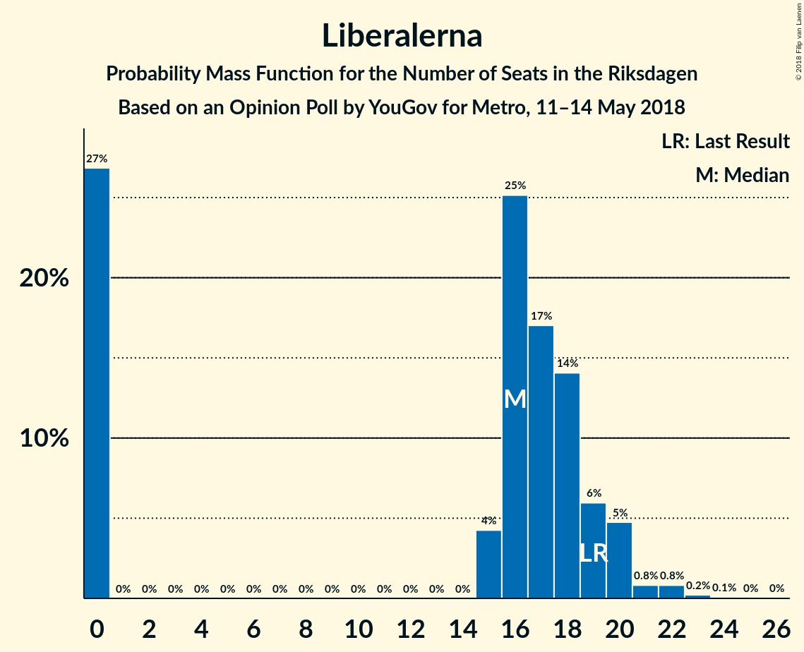
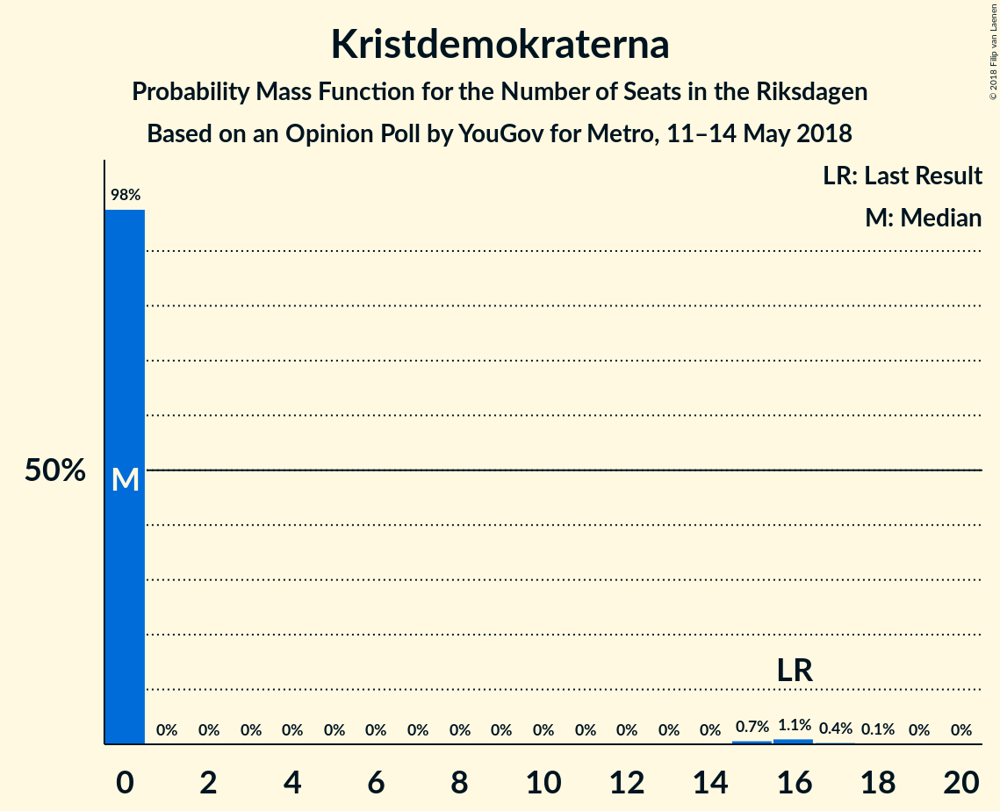

# Opinion Poll by YouGov for Metro, 11–14 May 2018

<a href="#voting-intentions">Voting Intentions</a> | <a href="#seats">Seats</a> | <a href="#coalitions">Coalitions</a> | <a href="#technical-information">Technical Information</a>

## Voting Intentions

### Confidence Intervals

| Party | Last Result | Poll Result | 80% Confidence Interval | 90% Confidence Interval | 95% Confidence Interval | 99% Confidence Interval |
|:-----:|:-----------:|:-----------:|:-----------------------:|:-----------------------:|:-----------------------:|:-----------------------:|
| Sveriges socialdemokratiska arbetareparti | 31.0% | 23.0% | 21.7–24.5% |21.3–24.9% |21.0–25.2% |20.4–25.9% |
| Sverigedemokraterna | 12.9% | 23.0% | 21.7–24.5% |21.3–24.9% |21.0–25.2% |20.4–25.9% |
| Moderata samlingspartiet | 23.3% | 18.3% | 17.1–19.6% |16.8–20.0% |16.4–20.3% |15.9–21.0% |
| Centerpartiet | 6.1% | 10.1% | 9.2–11.2% |8.9–11.5% |8.7–11.7% |8.3–12.3% |
| Vänsterpartiet | 5.7% | 9.0% | 8.1–10.0% |7.9–10.3% |7.7–10.5% |7.3–11.1% |
| Liberalerna | 5.4% | 4.2% | 3.6–4.9% |3.4–5.2% |3.3–5.3% |3.0–5.7% |
| Miljöpartiet de gröna | 6.9% | 3.6% | 3.1–4.3% |2.9–4.5% |2.8–4.7% |2.5–5.0% |
| Kristdemokraterna | 4.6% | 3.0% | 2.5–3.7% |2.4–3.9% |2.3–4.0% |2.1–4.3% |
| Feministiskt initiativ | 3.1% | 1.8% | 1.4–2.3% |1.3–2.4% |1.2–2.6% |1.1–2.9% |

*Note:* The poll result column reflects the actual value used in the calculations. Published results may vary slightly, and in addition be rounded to fewer digits.

## Seats

### Confidence Intervals

| Party | Last Result | Median | 80% Confidence Interval | 90% Confidence Interval | 95% Confidence Interval | 99% Confidence Interval |
|:-----:|:-----------:|:------:|:-----------------------:|:-----------------------:|:-----------------------:|:-----------------------:|
| <a href="#sveriges-socialdemokratiska-arbetareparti">Sveriges socialdemokratiska arbetareparti</a> | 113 | 90 | 87–99 |87–99 |86–99 |86–99 |
| <a href="#sverigedemokraterna">Sverigedemokraterna</a> | 49 | 88 | 80–107 |74–107 |74–107 |69–107 |
| <a href="#moderata-samlingspartiet">Moderata samlingspartiet</a> | 84 | 68 | 65–77 |64–77 |62–77 |59–77 |
| <a href="#centerpartiet">Centerpartiet</a> | 22 | 42 | 39–46 |38–46 |38–46 |37–46 |
| <a href="#vänsterpartiet">Vänsterpartiet</a> | 21 | 39 | 30–40 |27–40 |27–43 |27–43 |
| <a href="#liberalerna">Liberalerna</a> | 19 | 0 | 0–16 |0–19 |0–21 |0–21 |
| <a href="#miljöpartiet-de-gröna">Miljöpartiet de gröna</a> | 25 | 0 | 0 |0–17 |0–19 |0–19 |
| <a href="#kristdemokraterna">Kristdemokraterna</a> | 16 | 0 | 0–16 |0–16 |0–16 |0–16 |
| <a href="#feministiskt-initiativ">Feministiskt initiativ</a> | 0 | 0 | 0 |0 |0 |0 |

### Sveriges socialdemokratiska arbetareparti

*For a full overview of the results for this party, see the [Sveriges socialdemokratiska arbetareparti](party-sverigessocialdemokratiskaarbetareparti.html) page.*

| Number of Seats | Probability | Accumulated | Special Marks |
|:---------------:|:-----------:|:-----------:|:-------------:|
| 76 | 0.2% | 100% |  |
| 77 | 0% | 99.8% |  |
| 78 | 0% | 99.8% |  |
| 79 | 0% | 99.8% |  |
| 80 | 0% | 99.8% |  |
| 81 | 0% | 99.8% |  |
| 82 | 0% | 99.8% |  |
| 83 | 0% | 99.7% |  |
| 84 | 0.1% | 99.7% |  |
| 85 | 0% | 99.6% |  |
| 86 | 3% | 99.6% |  |
| 87 | 29% | 97% |  |
| 88 | 3% | 68% |  |
| 89 | 13% | 65% |  |
| 90 | 2% | 52% | Median |
| 91 | 0% | 49% |  |
| 92 | 0% | 49% |  |
| 93 | 0% | 49% |  |
| 94 | 0% | 49% |  |
| 95 | 0.1% | 49% |  |
| 96 | 5% | 49% |  |
| 97 | 11% | 44% |  |
| 98 | 0% | 33% |  |
| 99 | 33% | 33% |  |
| 100 | 0% | 0.1% |  |
| 101 | 0% | 0.1% |  |
| 102 | 0% | 0.1% |  |
| 103 | 0% | 0.1% |  |
| 104 | 0.1% | 0.1% |  |
| 105 | 0% | 0% |  |
| 106 | 0% | 0% |  |
| 107 | 0% | 0% |  |
| 108 | 0% | 0% |  |
| 109 | 0% | 0% |  |
| 110 | 0% | 0% |  |
| 111 | 0% | 0% |  |
| 112 | 0% | 0% |  |
| 113 | 0% | 0% | Last Result |

### Sverigedemokraterna

*For a full overview of the results for this party, see the [Sverigedemokraterna](party-sverigedemokraterna.html) page.*

| Number of Seats | Probability | Accumulated | Special Marks |
|:---------------:|:-----------:|:-----------:|:-------------:|
| 49 | 0% | 100% | Last Result |
| 50 | 0% | 100% |  |
| 51 | 0% | 100% |  |
| 52 | 0% | 100% |  |
| 53 | 0% | 100% |  |
| 54 | 0% | 100% |  |
| 55 | 0% | 100% |  |
| 56 | 0% | 100% |  |
| 57 | 0% | 100% |  |
| 58 | 0% | 100% |  |
| 59 | 0% | 100% |  |
| 60 | 0% | 100% |  |
| 61 | 0% | 100% |  |
| 62 | 0% | 100% |  |
| 63 | 0% | 100% |  |
| 64 | 0% | 100% |  |
| 65 | 0% | 100% |  |
| 66 | 0% | 100% |  |
| 67 | 0% | 100% |  |
| 68 | 0% | 100% |  |
| 69 | 2% | 100% |  |
| 70 | 0% | 98% |  |
| 71 | 0% | 98% |  |
| 72 | 0% | 98% |  |
| 73 | 0% | 98% |  |
| 74 | 3% | 98% |  |
| 75 | 0% | 95% |  |
| 76 | 0% | 95% |  |
| 77 | 0% | 95% |  |
| 78 | 0% | 95% |  |
| 79 | 0% | 95% |  |
| 80 | 34% | 95% |  |
| 81 | 0.3% | 61% |  |
| 82 | 0% | 61% |  |
| 83 | 0% | 61% |  |
| 84 | 0% | 61% |  |
| 85 | 0% | 61% |  |
| 86 | 3% | 61% |  |
| 87 | 0% | 58% |  |
| 88 | 30% | 58% | Median |
| 89 | 0.7% | 28% |  |
| 90 | 0% | 28% |  |
| 91 | 0% | 28% |  |
| 92 | 0.1% | 28% |  |
| 93 | 0% | 27% |  |
| 94 | 0.1% | 27% |  |
| 95 | 3% | 27% |  |
| 96 | 11% | 24% |  |
| 97 | 0% | 13% |  |
| 98 | 0% | 13% |  |
| 99 | 0% | 13% |  |
| 100 | 0% | 13% |  |
| 101 | 0% | 13% |  |
| 102 | 0% | 13% |  |
| 103 | 0% | 13% |  |
| 104 | 0% | 13% |  |
| 105 | 0% | 13% |  |
| 106 | 0% | 13% |  |
| 107 | 13% | 13% |  |
| 108 | 0% | 0% |  |

### Moderata samlingspartiet

*For a full overview of the results for this party, see the [Moderata samlingspartiet](party-moderatasamlingspartiet.html) page.*

| Number of Seats | Probability | Accumulated | Special Marks |
|:---------------:|:-----------:|:-----------:|:-------------:|
| 55 | 0.2% | 100% |  |
| 56 | 0% | 99.8% |  |
| 57 | 0.1% | 99.8% |  |
| 58 | 0% | 99.7% |  |
| 59 | 0.2% | 99.7% |  |
| 60 | 0% | 99.5% |  |
| 61 | 0% | 99.4% |  |
| 62 | 3% | 99.4% |  |
| 63 | 0% | 97% |  |
| 64 | 3% | 97% |  |
| 65 | 14% | 94% |  |
| 66 | 3% | 80% |  |
| 67 | 2% | 78% |  |
| 68 | 28% | 75% | Median |
| 69 | 0.7% | 47% |  |
| 70 | 0% | 46% |  |
| 71 | 0% | 46% |  |
| 72 | 5% | 46% |  |
| 73 | 0% | 41% |  |
| 74 | 0% | 41% |  |
| 75 | 0.1% | 41% |  |
| 76 | 0% | 41% |  |
| 77 | 41% | 41% |  |
| 78 | 0% | 0% |  |
| 79 | 0% | 0% |  |
| 80 | 0% | 0% |  |
| 81 | 0% | 0% |  |
| 82 | 0% | 0% |  |
| 83 | 0% | 0% |  |
| 84 | 0% | 0% | Last Result |

### Centerpartiet

*For a full overview of the results for this party, see the [Centerpartiet](party-centerpartiet.html) page.*

| Number of Seats | Probability | Accumulated | Special Marks |
|:---------------:|:-----------:|:-----------:|:-------------:|
| 22 | 0% | 100% | Last Result |
| 23 | 0% | 100% |  |
| 24 | 0% | 100% |  |
| 25 | 0% | 100% |  |
| 26 | 0% | 100% |  |
| 27 | 0% | 100% |  |
| 28 | 0% | 100% |  |
| 29 | 0% | 100% |  |
| 30 | 0% | 100% |  |
| 31 | 0.1% | 100% |  |
| 32 | 0% | 99.9% |  |
| 33 | 0% | 99.9% |  |
| 34 | 0% | 99.8% |  |
| 35 | 0% | 99.8% |  |
| 36 | 0.2% | 99.8% |  |
| 37 | 0.7% | 99.6% |  |
| 38 | 5% | 98.9% |  |
| 39 | 13% | 94% |  |
| 40 | 9% | 80% |  |
| 41 | 2% | 72% |  |
| 42 | 28% | 69% | Median |
| 43 | 11% | 41% |  |
| 44 | 0% | 30% |  |
| 45 | 0% | 30% |  |
| 46 | 30% | 30% |  |
| 47 | 0% | 0.1% |  |
| 48 | 0% | 0.1% |  |
| 49 | 0.1% | 0.1% |  |
| 50 | 0% | 0% |  |

### Vänsterpartiet

*For a full overview of the results for this party, see the [Vänsterpartiet](party-vänsterpartiet.html) page.*

| Number of Seats | Probability | Accumulated | Special Marks |
|:---------------:|:-----------:|:-----------:|:-------------:|
| 21 | 0% | 100% | Last Result |
| 22 | 0% | 100% |  |
| 23 | 0% | 100% |  |
| 24 | 0.1% | 100% |  |
| 25 | 0% | 99.9% |  |
| 26 | 0% | 99.9% |  |
| 27 | 5% | 99.9% |  |
| 28 | 0% | 95% |  |
| 29 | 3% | 95% |  |
| 30 | 13% | 92% |  |
| 31 | 4% | 78% |  |
| 32 | 3% | 75% |  |
| 33 | 0.1% | 72% |  |
| 34 | 0% | 72% |  |
| 35 | 0% | 72% |  |
| 36 | 11% | 72% |  |
| 37 | 0% | 61% |  |
| 38 | 0% | 61% |  |
| 39 | 30% | 61% | Median |
| 40 | 28% | 31% |  |
| 41 | 0% | 3% |  |
| 42 | 0% | 3% |  |
| 43 | 3% | 3% |  |
| 44 | 0% | 0.1% |  |
| 45 | 0% | 0.1% |  |
| 46 | 0% | 0.1% |  |
| 47 | 0.1% | 0.1% |  |
| 48 | 0% | 0% |  |

### Liberalerna

*For a full overview of the results for this party, see the [Liberalerna](party-liberalerna.html) page.*

| Number of Seats | Probability | Accumulated | Special Marks |
|:---------------:|:-----------:|:-----------:|:-------------:|
| 0 | 57% | 100% | Median |
| 1 | 0% | 43% |  |
| 2 | 0% | 43% |  |
| 3 | 0% | 43% |  |
| 4 | 0% | 43% |  |
| 5 | 0% | 43% |  |
| 6 | 0% | 43% |  |
| 7 | 0% | 43% |  |
| 8 | 0% | 43% |  |
| 9 | 0% | 43% |  |
| 10 | 0% | 43% |  |
| 11 | 0% | 43% |  |
| 12 | 0% | 43% |  |
| 13 | 0% | 43% |  |
| 14 | 0% | 43% |  |
| 15 | 0.4% | 43% |  |
| 16 | 34% | 42% |  |
| 17 | 0.3% | 8% |  |
| 18 | 2% | 8% |  |
| 19 | 3% | 5% | Last Result |
| 20 | 0% | 3% |  |
| 21 | 3% | 3% |  |
| 22 | 0% | 0.1% |  |
| 23 | 0.1% | 0.1% |  |
| 24 | 0% | 0% |  |

### Miljöpartiet de gröna

*For a full overview of the results for this party, see the [Miljöpartiet de gröna](party-miljöpartietdegröna.html) page.*

| Number of Seats | Probability | Accumulated | Special Marks |
|:---------------:|:-----------:|:-----------:|:-------------:|
| 0 | 94% | 100% | Median |
| 1 | 0% | 6% |  |
| 2 | 0% | 6% |  |
| 3 | 0% | 6% |  |
| 4 | 0% | 6% |  |
| 5 | 0% | 6% |  |
| 6 | 0% | 6% |  |
| 7 | 0% | 6% |  |
| 8 | 0% | 6% |  |
| 9 | 0% | 6% |  |
| 10 | 0% | 6% |  |
| 11 | 0% | 6% |  |
| 12 | 0% | 6% |  |
| 13 | 0% | 6% |  |
| 14 | 0% | 6% |  |
| 15 | 0% | 6% |  |
| 16 | 0.5% | 6% |  |
| 17 | 2% | 6% |  |
| 18 | 0.2% | 3% |  |
| 19 | 3% | 3% |  |
| 20 | 0% | 0% |  |
| 21 | 0% | 0% |  |
| 22 | 0% | 0% |  |
| 23 | 0% | 0% |  |
| 24 | 0% | 0% |  |
| 25 | 0% | 0% | Last Result |

### Kristdemokraterna

*For a full overview of the results for this party, see the [Kristdemokraterna](party-kristdemokraterna.html) page.*

| Number of Seats | Probability | Accumulated | Special Marks |
|:---------------:|:-----------:|:-----------:|:-------------:|
| 0 | 69% | 100% | Median |
| 1 | 0% | 31% |  |
| 2 | 0% | 31% |  |
| 3 | 0% | 31% |  |
| 4 | 0% | 31% |  |
| 5 | 0% | 31% |  |
| 6 | 0% | 31% |  |
| 7 | 0% | 31% |  |
| 8 | 0% | 31% |  |
| 9 | 0% | 31% |  |
| 10 | 0% | 31% |  |
| 11 | 0% | 31% |  |
| 12 | 0% | 31% |  |
| 13 | 0% | 31% |  |
| 14 | 0% | 31% |  |
| 15 | 3% | 31% |  |
| 16 | 28% | 29% | Last Result |
| 17 | 0.2% | 0.4% |  |
| 18 | 0.2% | 0.2% |  |
| 19 | 0% | 0% |  |

### Feministiskt initiativ

*For a full overview of the results for this party, see the [Feministiskt initiativ](party-feministisktinitiativ.html) page.*

| Number of Seats | Probability | Accumulated | Special Marks |
|:---------------:|:-----------:|:-----------:|:-------------:|
| 0 | 100% | 100% | Last Result, Median |

## Coalitions

### Confidence Intervals

| Coalition | Last Result | Median | Majority? | 80% Confidence Interval | 90% Confidence Interval | 95% Confidence Interval | 99% Confidence Interval |
|:---------:|:-----------:|:------:|:---------:|:-----------------------:|:-----------------------:|:-----------------------:|:-----------------------:|
| Sveriges socialdemokratiska arbetareparti – Vänsterpartiet – Miljöpartiet de gröna – Feministiskt initiativ | 159 | 127 | 0% | 119–138 | 119–139 | 117–142 | 117–142 |
| Sveriges socialdemokratiska arbetareparti – Vänsterpartiet – Miljöpartiet de gröna | 159 | 127 | 0% | 119–138 | 119–139 | 117–142 | 117–142 |
| Sveriges socialdemokratiska arbetareparti – Vänsterpartiet | 134 | 127 | 0% | 119–138 | 117–138 | 117–142 | 117–142 |
| Moderata samlingspartiet – Centerpartiet – Liberalerna – Kristdemokraterna | 141 | 123 | 0% | 104–142 | 104–142 | 102–142 | 102–142 |
| Moderata samlingspartiet – Centerpartiet – Liberalerna | 125 | 123 | 0% | 104–126 | 104–128 | 102–128 | 102–128 |
| Moderata samlingspartiet – Centerpartiet – Kristdemokraterna | 122 | 123 | 0% | 104–126 | 102–126 | 102–126 | 102–126 |
| Moderata samlingspartiet – Centerpartiet | 106 | 110 | 0% | 104–123 | 102–123 | 102–123 | 99–123 |

### Sveriges socialdemokratiska arbetareparti – Vänsterpartiet – Miljöpartiet de gröna – Feministiskt initiativ

| Number of Seats | Probability | Accumulated | Special Marks |
|:---------------:|:-----------:|:-----------:|:-------------:|
| 117 | 3% | 100% |  |
| 118 | 0.7% | 97% |  |
| 119 | 13% | 97% |  |
| 120 | 0% | 83% |  |
| 121 | 0% | 83% |  |
| 122 | 0% | 83% |  |
| 123 | 5% | 83% |  |
| 124 | 0.2% | 78% |  |
| 125 | 0% | 78% |  |
| 126 | 0% | 78% |  |
| 127 | 28% | 78% |  |
| 128 | 0% | 50% |  |
| 129 | 0% | 50% | Median |
| 130 | 0% | 49% |  |
| 131 | 0% | 49% |  |
| 132 | 0% | 49% |  |
| 133 | 11% | 49% |  |
| 134 | 0.1% | 38% |  |
| 135 | 0.3% | 38% |  |
| 136 | 3% | 38% |  |
| 137 | 0% | 35% |  |
| 138 | 30% | 35% |  |
| 139 | 2% | 5% |  |
| 140 | 0% | 3% |  |
| 141 | 0% | 3% |  |
| 142 | 3% | 3% |  |
| 143 | 0% | 0.1% |  |
| 144 | 0.1% | 0.1% |  |
| 145 | 0% | 0% |  |
| 146 | 0% | 0% |  |
| 147 | 0% | 0% |  |
| 148 | 0% | 0% |  |
| 149 | 0% | 0% |  |
| 150 | 0% | 0% |  |
| 151 | 0% | 0% |  |
| 152 | 0% | 0% |  |
| 153 | 0% | 0% |  |
| 154 | 0% | 0% |  |
| 155 | 0% | 0% |  |
| 156 | 0% | 0% |  |
| 157 | 0% | 0% |  |
| 158 | 0% | 0% |  |
| 159 | 0% | 0% | Last Result |

### Sveriges socialdemokratiska arbetareparti – Vänsterpartiet – Miljöpartiet de gröna

| Number of Seats | Probability | Accumulated | Special Marks |
|:---------------:|:-----------:|:-----------:|:-------------:|
| 117 | 3% | 100% |  |
| 118 | 0.7% | 97% |  |
| 119 | 13% | 97% |  |
| 120 | 0% | 83% |  |
| 121 | 0% | 83% |  |
| 122 | 0% | 83% |  |
| 123 | 5% | 83% |  |
| 124 | 0.2% | 78% |  |
| 125 | 0% | 78% |  |
| 126 | 0% | 78% |  |
| 127 | 28% | 78% |  |
| 128 | 0% | 50% |  |
| 129 | 0% | 50% | Median |
| 130 | 0% | 49% |  |
| 131 | 0% | 49% |  |
| 132 | 0% | 49% |  |
| 133 | 11% | 49% |  |
| 134 | 0.1% | 38% |  |
| 135 | 0.3% | 38% |  |
| 136 | 3% | 38% |  |
| 137 | 0% | 35% |  |
| 138 | 30% | 35% |  |
| 139 | 2% | 5% |  |
| 140 | 0% | 3% |  |
| 141 | 0% | 3% |  |
| 142 | 3% | 3% |  |
| 143 | 0% | 0.1% |  |
| 144 | 0.1% | 0.1% |  |
| 145 | 0% | 0% |  |
| 146 | 0% | 0% |  |
| 147 | 0% | 0% |  |
| 148 | 0% | 0% |  |
| 149 | 0% | 0% |  |
| 150 | 0% | 0% |  |
| 151 | 0% | 0% |  |
| 152 | 0% | 0% |  |
| 153 | 0% | 0% |  |
| 154 | 0% | 0% |  |
| 155 | 0% | 0% |  |
| 156 | 0% | 0% |  |
| 157 | 0% | 0% |  |
| 158 | 0% | 0% |  |
| 159 | 0% | 0% | Last Result |

### Sveriges socialdemokratiska arbetareparti – Vänsterpartiet

| Number of Seats | Probability | Accumulated | Special Marks |
|:---------------:|:-----------:|:-----------:|:-------------:|
| 108 | 0.2% | 100% |  |
| 109 | 0% | 99.8% |  |
| 110 | 0% | 99.8% |  |
| 111 | 0% | 99.8% |  |
| 112 | 0% | 99.8% |  |
| 113 | 0% | 99.8% |  |
| 114 | 0% | 99.8% |  |
| 115 | 0% | 99.8% |  |
| 116 | 0% | 99.8% |  |
| 117 | 6% | 99.7% |  |
| 118 | 0.7% | 94% |  |
| 119 | 14% | 93% |  |
| 120 | 0% | 80% |  |
| 121 | 0% | 80% |  |
| 122 | 2% | 80% |  |
| 123 | 5% | 77% |  |
| 124 | 0% | 72% |  |
| 125 | 0% | 72% |  |
| 126 | 0% | 72% |  |
| 127 | 28% | 72% |  |
| 128 | 0% | 44% |  |
| 129 | 0% | 44% | Median |
| 130 | 0% | 44% |  |
| 131 | 0% | 44% |  |
| 132 | 0% | 44% |  |
| 133 | 11% | 44% |  |
| 134 | 0.1% | 33% | Last Result |
| 135 | 0% | 33% |  |
| 136 | 0% | 33% |  |
| 137 | 0% | 33% |  |
| 138 | 30% | 33% |  |
| 139 | 0% | 3% |  |
| 140 | 0% | 3% |  |
| 141 | 0% | 3% |  |
| 142 | 3% | 3% |  |
| 143 | 0% | 0.1% |  |
| 144 | 0.1% | 0.1% |  |
| 145 | 0% | 0% |  |

### Moderata samlingspartiet – Centerpartiet – Liberalerna – Kristdemokraterna

| Number of Seats | Probability | Accumulated | Special Marks |
|:---------------:|:-----------:|:-----------:|:-------------:|
| 102 | 3% | 100% |  |
| 103 | 0% | 97% |  |
| 104 | 13% | 97% |  |
| 105 | 0% | 84% |  |
| 106 | 0% | 84% |  |
| 107 | 0% | 84% |  |
| 108 | 0% | 84% |  |
| 109 | 0% | 84% |  |
| 110 | 0% | 84% | Median |
| 111 | 0% | 84% |  |
| 112 | 0% | 84% |  |
| 113 | 0% | 84% |  |
| 114 | 0% | 84% |  |
| 115 | 0% | 84% |  |
| 116 | 0% | 84% |  |
| 117 | 0% | 84% |  |
| 118 | 0% | 84% |  |
| 119 | 0% | 84% |  |
| 120 | 11% | 84% |  |
| 121 | 3% | 72% |  |
| 122 | 0.7% | 70% |  |
| 123 | 30% | 69% |  |
| 124 | 0.3% | 39% |  |
| 125 | 0% | 39% |  |
| 126 | 2% | 39% |  |
| 127 | 0% | 36% |  |
| 128 | 5% | 36% |  |
| 129 | 0% | 31% |  |
| 130 | 0% | 31% |  |
| 131 | 0% | 31% |  |
| 132 | 0% | 31% |  |
| 133 | 0.2% | 31% |  |
| 134 | 0% | 31% |  |
| 135 | 0% | 31% |  |
| 136 | 0% | 31% |  |
| 137 | 0% | 31% |  |
| 138 | 0% | 31% |  |
| 139 | 0% | 31% |  |
| 140 | 3% | 31% |  |
| 141 | 0% | 28% | Last Result |
| 142 | 28% | 28% |  |
| 143 | 0% | 0% |  |

### Moderata samlingspartiet – Centerpartiet – Liberalerna

| Number of Seats | Probability | Accumulated | Special Marks |
|:---------------:|:-----------:|:-----------:|:-------------:|
| 102 | 3% | 100% |  |
| 103 | 0% | 97% |  |
| 104 | 13% | 97% |  |
| 105 | 0% | 84% |  |
| 106 | 0.2% | 84% |  |
| 107 | 0% | 83% |  |
| 108 | 0% | 83% |  |
| 109 | 0% | 83% |  |
| 110 | 0% | 83% | Median |
| 111 | 0% | 83% |  |
| 112 | 0% | 83% |  |
| 113 | 0% | 83% |  |
| 114 | 0% | 83% |  |
| 115 | 0% | 83% |  |
| 116 | 0.2% | 83% |  |
| 117 | 0% | 83% |  |
| 118 | 0% | 83% |  |
| 119 | 0% | 83% |  |
| 120 | 11% | 83% |  |
| 121 | 3% | 72% |  |
| 122 | 0.7% | 69% |  |
| 123 | 30% | 69% |  |
| 124 | 0.1% | 39% |  |
| 125 | 3% | 39% | Last Result |
| 126 | 31% | 36% |  |
| 127 | 0% | 5% |  |
| 128 | 5% | 5% |  |
| 129 | 0% | 0% |  |

### Moderata samlingspartiet – Centerpartiet – Kristdemokraterna

| Number of Seats | Probability | Accumulated | Special Marks |
|:---------------:|:-----------:|:-----------:|:-------------:|
| 97 | 0.1% | 100% |  |
| 98 | 0% | 99.9% |  |
| 99 | 0% | 99.9% |  |
| 100 | 0% | 99.9% |  |
| 101 | 0% | 99.9% |  |
| 102 | 5% | 99.9% |  |
| 103 | 0% | 94% |  |
| 104 | 13% | 94% |  |
| 105 | 0.1% | 81% |  |
| 106 | 0.7% | 81% |  |
| 107 | 0% | 80% |  |
| 108 | 2% | 80% |  |
| 109 | 0.3% | 78% |  |
| 110 | 0% | 77% | Median |
| 111 | 0% | 77% |  |
| 112 | 5% | 77% |  |
| 113 | 0% | 72% |  |
| 114 | 0% | 72% |  |
| 115 | 0% | 72% |  |
| 116 | 0.2% | 72% |  |
| 117 | 0% | 72% |  |
| 118 | 0% | 72% |  |
| 119 | 3% | 72% |  |
| 120 | 11% | 69% |  |
| 121 | 0% | 58% |  |
| 122 | 0% | 58% | Last Result |
| 123 | 30% | 58% |  |
| 124 | 0.1% | 28% |  |
| 125 | 0% | 28% |  |
| 126 | 28% | 28% |  |
| 127 | 0% | 0% |  |

### Moderata samlingspartiet – Centerpartiet

| Number of Seats | Probability | Accumulated | Special Marks |
|:---------------:|:-----------:|:-----------:|:-------------:|
| 91 | 0.2% | 100% |  |
| 92 | 0% | 99.8% |  |
| 93 | 0% | 99.8% |  |
| 94 | 0% | 99.8% |  |
| 95 | 0% | 99.8% |  |
| 96 | 0% | 99.8% |  |
| 97 | 0.1% | 99.7% |  |
| 98 | 0% | 99.6% |  |
| 99 | 0.2% | 99.6% |  |
| 100 | 0% | 99.4% |  |
| 101 | 0% | 99.4% |  |
| 102 | 5% | 99.4% |  |
| 103 | 0% | 94% |  |
| 104 | 16% | 94% |  |
| 105 | 0.1% | 78% |  |
| 106 | 0.7% | 78% | Last Result |
| 107 | 0% | 77% |  |
| 108 | 2% | 77% |  |
| 109 | 0% | 75% |  |
| 110 | 28% | 75% | Median |
| 111 | 0% | 46% |  |
| 112 | 5% | 46% |  |
| 113 | 0% | 41% |  |
| 114 | 0% | 41% |  |
| 115 | 0% | 41% |  |
| 116 | 0% | 41% |  |
| 117 | 0% | 41% |  |
| 118 | 0% | 41% |  |
| 119 | 0% | 41% |  |
| 120 | 11% | 41% |  |
| 121 | 0% | 30% |  |
| 122 | 0% | 30% |  |
| 123 | 30% | 30% |  |
| 124 | 0.1% | 0.1% |  |
| 125 | 0% | 0% |  |

## Technical Information

### Opinion Poll

+ **Polling firm:** YouGov
+ **Commissioner(s):** Metro
+ **Fieldwork period:** 11–14 May 2018

### Calculations

+ **Sample size:** 1523
+ **Simulations done:** 1,024
+ **Error estimate:** 2.48%

