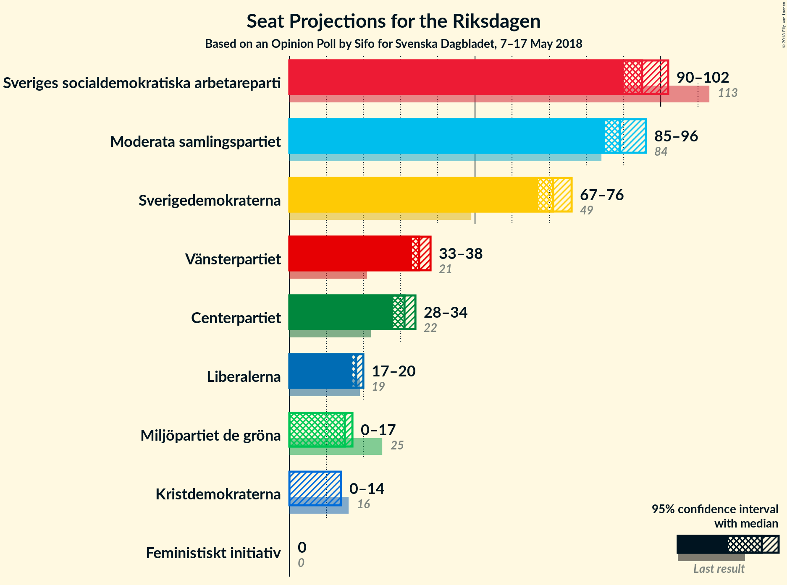
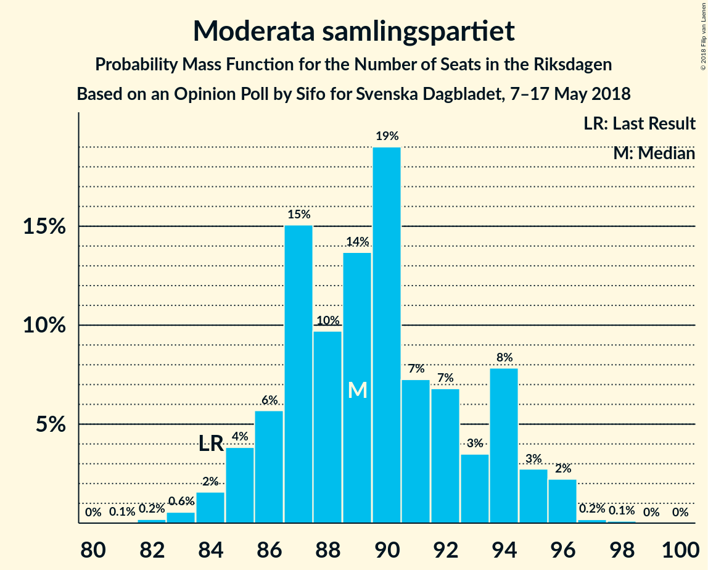

# Opinion Poll by Sifo for Svenska Dagbladet, 7–17 May 2018

<a href="#voting-intentions">Voting Intentions</a> | <a href="#seats">Seats</a> | <a href="#coalitions">Coalitions</a> | <a href="#technical-information">Technical Information</a>

## Voting Intentions

### Confidence Intervals

| Party | Last Result | Poll Result | 80% Confidence Interval | 90% Confidence Interval | 95% Confidence Interval | 99% Confidence Interval |
|:-----:|:-----------:|:-----------:|:-----------------------:|:-----------------------:|:-----------------------:|:-----------------------:|
| Sveriges socialdemokratiska arbetareparti | 31.0% | 25.2% | 24.6–25.8% |24.4–26.0% |24.2–26.1% |24.0–26.4% |
| Moderata samlingspartiet | 23.3% | 23.6% | 23.0–24.2% |22.8–24.4% |22.7–24.5% |22.4–24.8% |
| Sverigedemokraterna | 12.9% | 18.7% | 18.1–19.3% |18.0–19.4% |17.8–19.5% |17.6–19.8% |
| Vänsterpartiet | 5.7% | 9.3% | 8.9–9.7% |8.8–9.8% |8.7–9.9% |8.5–10.2% |
| Centerpartiet | 6.1% | 8.1% | 7.7–8.5% |7.6–8.6% |7.5–8.7% |7.3–8.9% |
| Liberalerna | 5.4% | 4.8% | 4.5–5.1% |4.4–5.2% |4.3–5.3% |4.2–5.4% |
| Miljöpartiet de gröna | 6.9% | 4.0% | 3.7–4.3% |3.7–4.4% |3.6–4.5% |3.5–4.6% |
| Kristdemokraterna | 4.6% | 3.5% | 3.2–3.8% |3.2–3.9% |3.1–3.9% |3.0–4.1% |
| Feministiskt initiativ | 3.1% | 1.6% | 1.4–1.8% |1.4–1.8% |1.3–1.9% |1.3–2.0% |

*Note:* The poll result column reflects the actual value used in the calculations. Published results may vary slightly, and in addition be rounded to fewer digits.

## Seats

### Confidence Intervals

| Party | Last Result | Median | 80% Confidence Interval | 90% Confidence Interval | 95% Confidence Interval | 99% Confidence Interval |
|:-----:|:-----------:|:------:|:-----------------------:|:-----------------------:|:-----------------------:|:-----------------------:|
| <a href="#sveriges-socialdemokratiska-arbetareparti">Sveriges socialdemokratiska arbetareparti</a> | 113 | 95 | 93–100 |92–100 |90–101 |89–101 |
| <a href="#moderata-samlingspartiet">Moderata samlingspartiet</a> | 84 | 90 | 86–95 |85–96 |84–96 |84–96 |
| <a href="#sverigedemokraterna">Sverigedemokraterna</a> | 49 | 69 | 67–73 |67–74 |67–74 |66–76 |
| <a href="#vänsterpartiet">Vänsterpartiet</a> | 21 | 35 | 34–37 |33–37 |33–38 |32–39 |
| <a href="#centerpartiet">Centerpartiet</a> | 22 | 30 | 29–32 |28–32 |28–33 |27–34 |
| <a href="#liberalerna">Liberalerna</a> | 19 | 18 | 17–20 |17–20 |17–21 |16–21 |
| <a href="#miljöpartiet-de-gröna">Miljöpartiet de gröna</a> | 25 | 15 | 0–16 |0–16 |0–16 |0–17 |
| <a href="#kristdemokraterna">Kristdemokraterna</a> | 16 | 0 | 0 |0 |0 |0–14 |
| <a href="#feministiskt-initiativ">Feministiskt initiativ</a> | 0 | 0 | 0 |0 |0 |0 |

### Sveriges socialdemokratiska arbetareparti

*For a full overview of the results for this party, see the [Sveriges socialdemokratiska arbetareparti](party-sverigessocialdemokratiskaarbetareparti.html) page.*

| Number of Seats | Probability | Accumulated | Special Marks |
|:---------------:|:-----------:|:-----------:|:-------------:|
| 88 | 0% | 100% |  |
| 89 | 2% | 99.9% |  |
| 90 | 2% | 98% |  |
| 91 | 0.6% | 96% |  |
| 92 | 3% | 96% |  |
| 93 | 14% | 93% |  |
| 94 | 9% | 79% |  |
| 95 | 27% | 70% | Median |
| 96 | 16% | 43% |  |
| 97 | 9% | 27% |  |
| 98 | 6% | 18% |  |
| 99 | 2% | 12% |  |
| 100 | 7% | 10% |  |
| 101 | 3% | 3% |  |
| 102 | 0.5% | 0.5% |  |
| 103 | 0% | 0% |  |
| 104 | 0% | 0% |  |
| 105 | 0% | 0% |  |
| 106 | 0% | 0% |  |
| 107 | 0% | 0% |  |
| 108 | 0% | 0% |  |
| 109 | 0% | 0% |  |
| 110 | 0% | 0% |  |
| 111 | 0% | 0% |  |
| 112 | 0% | 0% |  |
| 113 | 0% | 0% | Last Result |

### Moderata samlingspartiet

*For a full overview of the results for this party, see the [Moderata samlingspartiet](party-moderatasamlingspartiet.html) page.*

| Number of Seats | Probability | Accumulated | Special Marks |
|:---------------:|:-----------:|:-----------:|:-------------:|
| 83 | 0.4% | 100% |  |
| 84 | 3% | 99.6% | Last Result |
| 85 | 2% | 96% |  |
| 86 | 9% | 94% |  |
| 87 | 3% | 85% |  |
| 88 | 8% | 82% |  |
| 89 | 13% | 74% |  |
| 90 | 33% | 60% | Median |
| 91 | 5% | 27% |  |
| 92 | 3% | 22% |  |
| 93 | 4% | 18% |  |
| 94 | 3% | 14% |  |
| 95 | 5% | 11% |  |
| 96 | 5% | 6% |  |
| 97 | 0.1% | 0.3% |  |
| 98 | 0.2% | 0.2% |  |
| 99 | 0% | 0% |  |

### Sverigedemokraterna

*For a full overview of the results for this party, see the [Sverigedemokraterna](party-sverigedemokraterna.html) page.*

| Number of Seats | Probability | Accumulated | Special Marks |
|:---------------:|:-----------:|:-----------:|:-------------:|
| 49 | 0% | 100% | Last Result |
| 50 | 0% | 100% |  |
| 51 | 0% | 100% |  |
| 52 | 0% | 100% |  |
| 53 | 0% | 100% |  |
| 54 | 0% | 100% |  |
| 55 | 0% | 100% |  |
| 56 | 0% | 100% |  |
| 57 | 0% | 100% |  |
| 58 | 0% | 100% |  |
| 59 | 0% | 100% |  |
| 60 | 0% | 100% |  |
| 61 | 0% | 100% |  |
| 62 | 0% | 100% |  |
| 63 | 0% | 100% |  |
| 64 | 0% | 100% |  |
| 65 | 0.1% | 100% |  |
| 66 | 2% | 99.8% |  |
| 67 | 18% | 98% |  |
| 68 | 23% | 80% |  |
| 69 | 10% | 57% | Median |
| 70 | 9% | 47% |  |
| 71 | 12% | 38% |  |
| 72 | 12% | 26% |  |
| 73 | 7% | 14% |  |
| 74 | 5% | 7% |  |
| 75 | 0.8% | 2% |  |
| 76 | 0.6% | 0.9% |  |
| 77 | 0.2% | 0.3% |  |
| 78 | 0% | 0% |  |

### Vänsterpartiet

*For a full overview of the results for this party, see the [Vänsterpartiet](party-vänsterpartiet.html) page.*

| Number of Seats | Probability | Accumulated | Special Marks |
|:---------------:|:-----------:|:-----------:|:-------------:|
| 21 | 0% | 100% | Last Result |
| 22 | 0% | 100% |  |
| 23 | 0% | 100% |  |
| 24 | 0% | 100% |  |
| 25 | 0% | 100% |  |
| 26 | 0% | 100% |  |
| 27 | 0% | 100% |  |
| 28 | 0% | 100% |  |
| 29 | 0% | 100% |  |
| 30 | 0% | 100% |  |
| 31 | 0.1% | 100% |  |
| 32 | 2% | 99.9% |  |
| 33 | 4% | 98% |  |
| 34 | 11% | 95% |  |
| 35 | 59% | 83% | Median |
| 36 | 13% | 25% |  |
| 37 | 8% | 12% |  |
| 38 | 1.4% | 3% |  |
| 39 | 2% | 2% |  |
| 40 | 0.3% | 0.3% |  |
| 41 | 0% | 0% |  |

### Centerpartiet

*For a full overview of the results for this party, see the [Centerpartiet](party-centerpartiet.html) page.*

| Number of Seats | Probability | Accumulated | Special Marks |
|:---------------:|:-----------:|:-----------:|:-------------:|
| 22 | 0% | 100% | Last Result |
| 23 | 0% | 100% |  |
| 24 | 0% | 100% |  |
| 25 | 0% | 100% |  |
| 26 | 0.1% | 100% |  |
| 27 | 0.6% | 99.9% |  |
| 28 | 9% | 99.3% |  |
| 29 | 28% | 91% |  |
| 30 | 21% | 62% | Median |
| 31 | 23% | 42% |  |
| 32 | 14% | 18% |  |
| 33 | 3% | 4% |  |
| 34 | 1.4% | 1.5% |  |
| 35 | 0.1% | 0.1% |  |
| 36 | 0% | 0% |  |

### Liberalerna

*For a full overview of the results for this party, see the [Liberalerna](party-liberalerna.html) page.*

| Number of Seats | Probability | Accumulated | Special Marks |
|:---------------:|:-----------:|:-----------:|:-------------:|
| 15 | 0.2% | 100% |  |
| 16 | 1.3% | 99.7% |  |
| 17 | 35% | 98% |  |
| 18 | 37% | 63% | Median |
| 19 | 13% | 26% | Last Result |
| 20 | 9% | 13% |  |
| 21 | 4% | 4% |  |
| 22 | 0.1% | 0.1% |  |
| 23 | 0% | 0% |  |

### Miljöpartiet de gröna

*For a full overview of the results for this party, see the [Miljöpartiet de gröna](party-miljöpartietdegröna.html) page.*

| Number of Seats | Probability | Accumulated | Special Marks |
|:---------------:|:-----------:|:-----------:|:-------------:|
| 0 | 33% | 100% |  |
| 1 | 0% | 67% |  |
| 2 | 0% | 67% |  |
| 3 | 0% | 67% |  |
| 4 | 0% | 67% |  |
| 5 | 0% | 67% |  |
| 6 | 0% | 67% |  |
| 7 | 0% | 67% |  |
| 8 | 0% | 67% |  |
| 9 | 0% | 67% |  |
| 10 | 0% | 67% |  |
| 11 | 0% | 67% |  |
| 12 | 0% | 67% |  |
| 13 | 0% | 67% |  |
| 14 | 0% | 67% |  |
| 15 | 51% | 67% | Median |
| 16 | 16% | 17% |  |
| 17 | 0.9% | 1.0% |  |
| 18 | 0.1% | 0.1% |  |
| 19 | 0% | 0% |  |
| 20 | 0% | 0% |  |
| 21 | 0% | 0% |  |
| 22 | 0% | 0% |  |
| 23 | 0% | 0% |  |
| 24 | 0% | 0% |  |
| 25 | 0% | 0% | Last Result |

### Kristdemokraterna

*For a full overview of the results for this party, see the [Kristdemokraterna](party-kristdemokraterna.html) page.*

| Number of Seats | Probability | Accumulated | Special Marks |
|:---------------:|:-----------:|:-----------:|:-------------:|
| 0 | 98% | 100% | Median |
| 1 | 0% | 2% |  |
| 2 | 0% | 2% |  |
| 3 | 0% | 2% |  |
| 4 | 0% | 2% |  |
| 5 | 0% | 2% |  |
| 6 | 0% | 2% |  |
| 7 | 0% | 2% |  |
| 8 | 0% | 2% |  |
| 9 | 0% | 2% |  |
| 10 | 0% | 2% |  |
| 11 | 0% | 2% |  |
| 12 | 0% | 2% |  |
| 13 | 0% | 2% |  |
| 14 | 1.4% | 2% |  |
| 15 | 0.3% | 0.3% |  |
| 16 | 0% | 0% | Last Result |

### Feministiskt initiativ

*For a full overview of the results for this party, see the [Feministiskt initiativ](party-feministisktinitiativ.html) page.*

| Number of Seats | Probability | Accumulated | Special Marks |
|:---------------:|:-----------:|:-----------:|:-------------:|
| 0 | 100% | 100% | Last Result, Median |

## Coalitions

### Confidence Intervals

| Coalition | Last Result | Median | Majority? | 80% Confidence Interval | 90% Confidence Interval | 95% Confidence Interval | 99% Confidence Interval |
|:---------:|:-----------:|:------:|:---------:|:-----------------------:|:-----------------------:|:-----------------------:|:-----------------------:|
| Sveriges socialdemokratiska arbetareparti – Vänsterpartiet – Miljöpartiet de gröna – Feministiskt initiativ | 159 | 143 | 0% | 133–146 | 132–147 | 131–147 | 129–148 |
| Sveriges socialdemokratiska arbetareparti – Vänsterpartiet – Miljöpartiet de gröna | 159 | 143 | 0% | 133–146 | 132–147 | 131–147 | 129–148 |
| Moderata samlingspartiet – Centerpartiet – Liberalerna – Kristdemokraterna | 141 | 137 | 0% | 134–145 | 132–146 | 131–146 | 131–148 |
| Moderata samlingspartiet – Centerpartiet – Liberalerna | 125 | 136 | 0% | 134–144 | 131–146 | 131–146 | 131–147 |
| Sveriges socialdemokratiska arbetareparti – Vänsterpartiet | 134 | 130 | 0% | 127–135 | 127–136 | 125–137 | 121–139 |
| Moderata samlingspartiet – Centerpartiet – Kristdemokraterna | 122 | 119 | 0% | 116–126 | 114–128 | 114–128 | 113–129 |
| Moderata samlingspartiet – Centerpartiet | 106 | 119 | 0% | 116–125 | 114–127 | 114–128 | 113–129 |
| Sveriges socialdemokratiska arbetareparti – Miljöpartiet de gröna | 138 | 108 | 0% | 97–111 | 96–112 | 96–112 | 94–113 |

### Sveriges socialdemokratiska arbetareparti – Vänsterpartiet – Miljöpartiet de gröna – Feministiskt initiativ

| Number of Seats | Probability | Accumulated | Special Marks |
|:---------------:|:-----------:|:-----------:|:-------------:|
| 124 | 0.3% | 100% |  |
| 125 | 0% | 99.7% |  |
| 126 | 0% | 99.7% |  |
| 127 | 0% | 99.7% |  |
| 128 | 0.1% | 99.7% |  |
| 129 | 0.2% | 99.6% |  |
| 130 | 0.4% | 99.4% |  |
| 131 | 2% | 99.0% |  |
| 132 | 6% | 97% |  |
| 133 | 7% | 91% |  |
| 134 | 6% | 85% |  |
| 135 | 5% | 79% |  |
| 136 | 5% | 74% |  |
| 137 | 2% | 69% |  |
| 138 | 0.7% | 67% |  |
| 139 | 1.0% | 67% |  |
| 140 | 0.4% | 66% |  |
| 141 | 1.3% | 65% |  |
| 142 | 5% | 64% |  |
| 143 | 13% | 59% |  |
| 144 | 1.3% | 46% |  |
| 145 | 30% | 45% | Median |
| 146 | 8% | 14% |  |
| 147 | 5% | 6% |  |
| 148 | 1.2% | 2% |  |
| 149 | 0.3% | 0.4% |  |
| 150 | 0% | 0.1% |  |
| 151 | 0% | 0% |  |
| 152 | 0% | 0% |  |
| 153 | 0% | 0% |  |
| 154 | 0% | 0% |  |
| 155 | 0% | 0% |  |
| 156 | 0% | 0% |  |
| 157 | 0% | 0% |  |
| 158 | 0% | 0% |  |
| 159 | 0% | 0% | Last Result |

### Sveriges socialdemokratiska arbetareparti – Vänsterpartiet – Miljöpartiet de gröna

| Number of Seats | Probability | Accumulated | Special Marks |
|:---------------:|:-----------:|:-----------:|:-------------:|
| 124 | 0.3% | 100% |  |
| 125 | 0% | 99.7% |  |
| 126 | 0% | 99.7% |  |
| 127 | 0% | 99.7% |  |
| 128 | 0.1% | 99.7% |  |
| 129 | 0.2% | 99.6% |  |
| 130 | 0.4% | 99.4% |  |
| 131 | 2% | 99.0% |  |
| 132 | 6% | 97% |  |
| 133 | 7% | 91% |  |
| 134 | 6% | 85% |  |
| 135 | 5% | 79% |  |
| 136 | 5% | 74% |  |
| 137 | 2% | 69% |  |
| 138 | 0.7% | 67% |  |
| 139 | 1.0% | 67% |  |
| 140 | 0.4% | 66% |  |
| 141 | 1.3% | 65% |  |
| 142 | 5% | 64% |  |
| 143 | 13% | 59% |  |
| 144 | 1.3% | 46% |  |
| 145 | 30% | 45% | Median |
| 146 | 8% | 14% |  |
| 147 | 5% | 6% |  |
| 148 | 1.2% | 2% |  |
| 149 | 0.3% | 0.4% |  |
| 150 | 0% | 0.1% |  |
| 151 | 0% | 0% |  |
| 152 | 0% | 0% |  |
| 153 | 0% | 0% |  |
| 154 | 0% | 0% |  |
| 155 | 0% | 0% |  |
| 156 | 0% | 0% |  |
| 157 | 0% | 0% |  |
| 158 | 0% | 0% |  |
| 159 | 0% | 0% | Last Result |

### Moderata samlingspartiet – Centerpartiet – Liberalerna – Kristdemokraterna

| Number of Seats | Probability | Accumulated | Special Marks |
|:---------------:|:-----------:|:-----------:|:-------------:|
| 131 | 4% | 100% |  |
| 132 | 2% | 96% |  |
| 133 | 2% | 94% |  |
| 134 | 6% | 92% |  |
| 135 | 8% | 86% |  |
| 136 | 27% | 78% |  |
| 137 | 2% | 50% |  |
| 138 | 1.5% | 48% | Median |
| 139 | 14% | 46% |  |
| 140 | 2% | 32% |  |
| 141 | 5% | 31% | Last Result |
| 142 | 2% | 25% |  |
| 143 | 11% | 23% |  |
| 144 | 1.3% | 12% |  |
| 145 | 4% | 11% |  |
| 146 | 5% | 7% |  |
| 147 | 0.9% | 2% |  |
| 148 | 0.2% | 0.6% |  |
| 149 | 0.1% | 0.5% |  |
| 150 | 0% | 0.3% |  |
| 151 | 0% | 0.3% |  |
| 152 | 0% | 0.3% |  |
| 153 | 0.3% | 0.3% |  |
| 154 | 0% | 0% |  |

### Moderata samlingspartiet – Centerpartiet – Liberalerna

| Number of Seats | Probability | Accumulated | Special Marks |
|:---------------:|:-----------:|:-----------:|:-------------:|
| 125 | 0% | 100% | Last Result |
| 126 | 0% | 100% |  |
| 127 | 0% | 100% |  |
| 128 | 0% | 100% |  |
| 129 | 0% | 100% |  |
| 130 | 0.2% | 100% |  |
| 131 | 5% | 99.8% |  |
| 132 | 2% | 95% |  |
| 133 | 2% | 93% |  |
| 134 | 6% | 91% |  |
| 135 | 8% | 85% |  |
| 136 | 27% | 77% |  |
| 137 | 2% | 49% |  |
| 138 | 2% | 47% | Median |
| 139 | 14% | 45% |  |
| 140 | 2% | 31% |  |
| 141 | 5% | 29% |  |
| 142 | 2% | 24% |  |
| 143 | 11% | 21% |  |
| 144 | 1.1% | 10% |  |
| 145 | 3% | 9% |  |
| 146 | 5% | 6% |  |
| 147 | 0.9% | 1.2% |  |
| 148 | 0.1% | 0.3% |  |
| 149 | 0.1% | 0.1% |  |
| 150 | 0% | 0% |  |

### Sveriges socialdemokratiska arbetareparti – Vänsterpartiet

| Number of Seats | Probability | Accumulated | Special Marks |
|:---------------:|:-----------:|:-----------:|:-------------:|
| 121 | 1.1% | 100% |  |
| 122 | 0% | 98.9% |  |
| 123 | 0.3% | 98.8% |  |
| 124 | 0.9% | 98.5% |  |
| 125 | 0.8% | 98% |  |
| 126 | 0.8% | 97% |  |
| 127 | 7% | 96% |  |
| 128 | 12% | 89% |  |
| 129 | 7% | 77% |  |
| 130 | 27% | 70% | Median |
| 131 | 11% | 44% |  |
| 132 | 8% | 33% |  |
| 133 | 7% | 24% |  |
| 134 | 6% | 17% | Last Result |
| 135 | 5% | 12% |  |
| 136 | 4% | 7% |  |
| 137 | 2% | 3% |  |
| 138 | 0.5% | 1.2% |  |
| 139 | 0.4% | 0.7% |  |
| 140 | 0.2% | 0.3% |  |
| 141 | 0.1% | 0.1% |  |
| 142 | 0% | 0% |  |

### Moderata samlingspartiet – Centerpartiet – Kristdemokraterna

| Number of Seats | Probability | Accumulated | Special Marks |
|:---------------:|:-----------:|:-----------:|:-------------:|
| 112 | 0.1% | 100% |  |
| 113 | 2% | 99.9% |  |
| 114 | 4% | 98% |  |
| 115 | 2% | 94% |  |
| 116 | 6% | 92% |  |
| 117 | 7% | 86% |  |
| 118 | 5% | 79% |  |
| 119 | 24% | 74% |  |
| 120 | 5% | 49% | Median |
| 121 | 18% | 45% |  |
| 122 | 5% | 27% | Last Result |
| 123 | 2% | 23% |  |
| 124 | 5% | 21% |  |
| 125 | 6% | 16% |  |
| 126 | 3% | 10% |  |
| 127 | 0.5% | 7% |  |
| 128 | 5% | 6% |  |
| 129 | 0.8% | 1.3% |  |
| 130 | 0.1% | 0.5% |  |
| 131 | 0.1% | 0.4% |  |
| 132 | 0% | 0.3% |  |
| 133 | 0% | 0.3% |  |
| 134 | 0% | 0.3% |  |
| 135 | 0.3% | 0.3% |  |
| 136 | 0% | 0% |  |

### Moderata samlingspartiet – Centerpartiet

| Number of Seats | Probability | Accumulated | Special Marks |
|:---------------:|:-----------:|:-----------:|:-------------:|
| 106 | 0% | 100% | Last Result |
| 107 | 0% | 100% |  |
| 108 | 0% | 100% |  |
| 109 | 0% | 100% |  |
| 110 | 0% | 100% |  |
| 111 | 0% | 100% |  |
| 112 | 0.1% | 100% |  |
| 113 | 2% | 99.9% |  |
| 114 | 5% | 98% |  |
| 115 | 2% | 93% |  |
| 116 | 6% | 91% |  |
| 117 | 7% | 85% |  |
| 118 | 5% | 78% |  |
| 119 | 24% | 73% |  |
| 120 | 5% | 48% | Median |
| 121 | 18% | 43% |  |
| 122 | 5% | 26% |  |
| 123 | 2% | 21% |  |
| 124 | 5% | 19% |  |
| 125 | 6% | 14% |  |
| 126 | 3% | 8% |  |
| 127 | 0.5% | 5% |  |
| 128 | 4% | 5% |  |
| 129 | 0.7% | 0.8% |  |
| 130 | 0% | 0.1% |  |
| 131 | 0.1% | 0.1% |  |
| 132 | 0% | 0% |  |

### Sveriges socialdemokratiska arbetareparti – Miljöpartiet de gröna

| Number of Seats | Probability | Accumulated | Special Marks |
|:---------------:|:-----------:|:-----------:|:-------------:|
| 92 | 0.3% | 100% |  |
| 93 | 0% | 99.7% |  |
| 94 | 0.8% | 99.6% |  |
| 95 | 0.3% | 98.8% |  |
| 96 | 6% | 98.5% |  |
| 97 | 9% | 92% |  |
| 98 | 5% | 84% |  |
| 99 | 2% | 79% |  |
| 100 | 7% | 78% |  |
| 101 | 3% | 71% |  |
| 102 | 0.5% | 68% |  |
| 103 | 0% | 67% |  |
| 104 | 2% | 67% |  |
| 105 | 0.2% | 66% |  |
| 106 | 2% | 66% |  |
| 107 | 1.4% | 63% |  |
| 108 | 15% | 62% |  |
| 109 | 2% | 48% |  |
| 110 | 32% | 45% | Median |
| 111 | 7% | 14% |  |
| 112 | 4% | 6% |  |
| 113 | 2% | 2% |  |
| 114 | 0.4% | 0.4% |  |
| 115 | 0.1% | 0.1% |  |
| 116 | 0% | 0% |  |
| 117 | 0% | 0% |  |
| 118 | 0% | 0% |  |
| 119 | 0% | 0% |  |
| 120 | 0% | 0% |  |
| 121 | 0% | 0% |  |
| 122 | 0% | 0% |  |
| 123 | 0% | 0% |  |
| 124 | 0% | 0% |  |
| 125 | 0% | 0% |  |
| 126 | 0% | 0% |  |
| 127 | 0% | 0% |  |
| 128 | 0% | 0% |  |
| 129 | 0% | 0% |  |
| 130 | 0% | 0% |  |
| 131 | 0% | 0% |  |
| 132 | 0% | 0% |  |
| 133 | 0% | 0% |  |
| 134 | 0% | 0% |  |
| 135 | 0% | 0% |  |
| 136 | 0% | 0% |  |
| 137 | 0% | 0% |  |
| 138 | 0% | 0% | Last Result |

## Technical Information

### Opinion Poll

+ **Polling firm:** Sifo
+ **Commissioner(s):** Svenska Dagbladet
+ **Fieldwork period:** 7–17 May 2018

### Calculations

+ **Sample size:** 8259
+ **Simulations done:** 262,144
+ **Error estimate:** 0.61%

