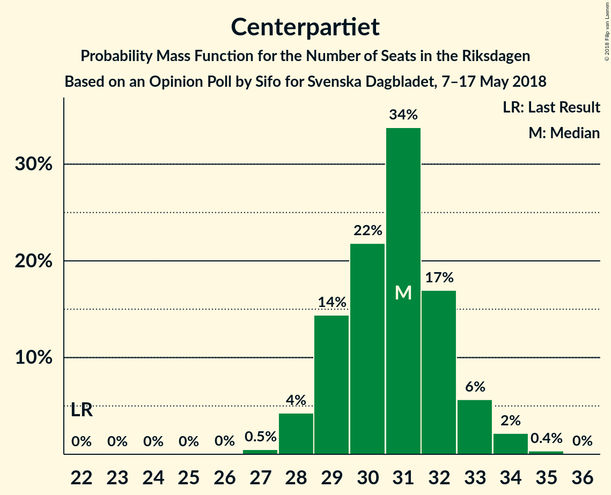
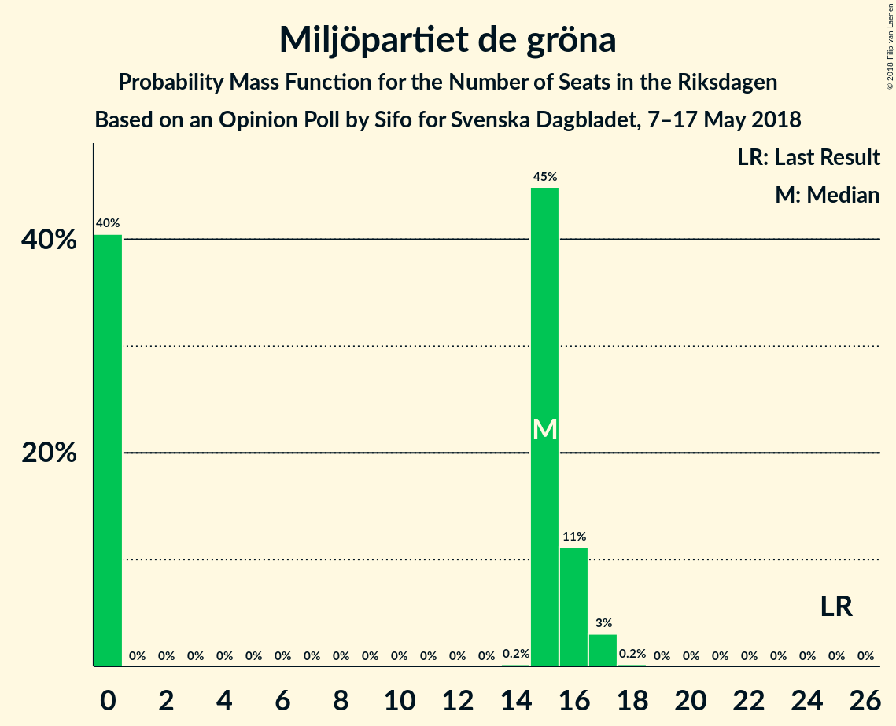

# Opinion Poll by Sifo for Svenska Dagbladet, 7–17 May 2018

<a href="#voting-intentions">Voting Intentions</a> | <a href="#seats">Seats</a> | <a href="#coalitions">Coalitions</a> | <a href="#technical-information">Technical Information</a>

## Voting Intentions

### Confidence Intervals

| Party | Last Result | Poll Result | 80% Confidence Interval | 90% Confidence Interval | 95% Confidence Interval | 99% Confidence Interval |
|:-----:|:-----------:|:-----------:|:-----------------------:|:-----------------------:|:-----------------------:|:-----------------------:|
| Sveriges socialdemokratiska arbetareparti | 31.0% | 25.2% | 24.6–25.8% |24.4–26.0% |24.2–26.1% |24.0–26.4% |
| Moderata samlingspartiet | 23.3% | 23.6% | 23.0–24.2% |22.8–24.4% |22.7–24.5% |22.4–24.8% |
| Sverigedemokraterna | 12.9% | 18.7% | 18.1–19.3% |18.0–19.4% |17.8–19.5% |17.6–19.8% |
| Vänsterpartiet | 5.7% | 9.3% | 8.9–9.7% |8.8–9.8% |8.7–9.9% |8.5–10.2% |
| Centerpartiet | 6.1% | 8.1% | 7.7–8.5% |7.6–8.6% |7.5–8.7% |7.3–8.9% |
| Liberalerna | 5.4% | 4.8% | 4.5–5.1% |4.4–5.2% |4.3–5.3% |4.2–5.4% |
| Miljöpartiet de gröna | 6.9% | 4.0% | 3.7–4.3% |3.7–4.4% |3.6–4.5% |3.5–4.6% |
| Kristdemokraterna | 4.6% | 3.5% | 3.2–3.8% |3.2–3.9% |3.1–3.9% |3.0–4.1% |
| Feministiskt initiativ | 3.1% | 1.6% | 1.4–1.8% |1.4–1.8% |1.3–1.9% |1.3–2.0% |

*Note:* The poll result column reflects the actual value used in the calculations. Published results may vary slightly, and in addition be rounded to fewer digits.

## Seats

### Confidence Intervals

| Party | Last Result | Median | 80% Confidence Interval | 90% Confidence Interval | 95% Confidence Interval | 99% Confidence Interval |
|:-----:|:-----------:|:------:|:-----------------------:|:-----------------------:|:-----------------------:|:-----------------------:|
| <a href="#sveriges-socialdemokratiska-arbetareparti">Sveriges socialdemokratiska arbetareparti</a> | 113 | 100 | 94–101 |93–101 |93–101 |91–101 |
| <a href="#moderata-samlingspartiet">Moderata samlingspartiet</a> | 84 | 90 | 89–90 |88–91 |85–92 |85–92 |
| <a href="#sverigedemokraterna">Sverigedemokraterna</a> | 49 | 73 | 66–73 |66–73 |66–74 |66–77 |
| <a href="#vänsterpartiet">Vänsterpartiet</a> | 21 | 36 | 36–37 |36–37 |31–37 |30–40 |
| <a href="#centerpartiet">Centerpartiet</a> | 22 | 28 | 28–30 |28–32 |28–33 |27–34 |
| <a href="#liberalerna">Liberalerna</a> | 19 | 22 | 16–22 |16–22 |16–22 |16–22 |
| <a href="#miljöpartiet-de-gröna">Miljöpartiet de gröna</a> | 25 | 0 | 0 |0 |0–17 |0–17 |
| <a href="#kristdemokraterna">Kristdemokraterna</a> | 16 | 0 | 0–16 |0–16 |0–16 |0–16 |
| <a href="#feministiskt-initiativ">Feministiskt initiativ</a> | 0 | 0 | 0 |0 |0 |0 |

### Sveriges socialdemokratiska arbetareparti

*For a full overview of the results for this party, see the [Sveriges socialdemokratiska arbetareparti](party-sverigessocialdemokratiskaarbetareparti.html) page.*

| Number of Seats | Probability | Accumulated | Special Marks |
|:---------------:|:-----------:|:-----------:|:-------------:|
| 91 | 1.2% | 100% |  |
| 92 | 0% | 98.8% |  |
| 93 | 7% | 98.7% |  |
| 94 | 15% | 92% |  |
| 95 | 1.4% | 77% |  |
| 96 | 0% | 76% |  |
| 97 | 0.2% | 76% |  |
| 98 | 2% | 76% |  |
| 99 | 0% | 73% |  |
| 100 | 50% | 73% | Median |
| 101 | 23% | 23% |  |
| 102 | 0.2% | 0.2% |  |
| 103 | 0% | 0% |  |
| 104 | 0% | 0% |  |
| 105 | 0% | 0% |  |
| 106 | 0% | 0% |  |
| 107 | 0% | 0% |  |
| 108 | 0% | 0% |  |
| 109 | 0% | 0% |  |
| 110 | 0% | 0% |  |
| 111 | 0% | 0% |  |
| 112 | 0% | 0% |  |
| 113 | 0% | 0% | Last Result |

### Moderata samlingspartiet

*For a full overview of the results for this party, see the [Moderata samlingspartiet](party-moderatasamlingspartiet.html) page.*

| Number of Seats | Probability | Accumulated | Special Marks |
|:---------------:|:-----------:|:-----------:|:-------------:|
| 84 | 0.3% | 100% | Last Result |
| 85 | 3% | 99.7% |  |
| 86 | 0.2% | 97% |  |
| 87 | 1.4% | 97% |  |
| 88 | 1.4% | 96% |  |
| 89 | 23% | 94% |  |
| 90 | 65% | 71% | Median |
| 91 | 4% | 7% |  |
| 92 | 2% | 3% |  |
| 93 | 0.1% | 0.1% |  |
| 94 | 0% | 0% |  |

### Sverigedemokraterna

*For a full overview of the results for this party, see the [Sverigedemokraterna](party-sverigedemokraterna.html) page.*

| Number of Seats | Probability | Accumulated | Special Marks |
|:---------------:|:-----------:|:-----------:|:-------------:|
| 49 | 0% | 100% | Last Result |
| 50 | 0% | 100% |  |
| 51 | 0% | 100% |  |
| 52 | 0% | 100% |  |
| 53 | 0% | 100% |  |
| 54 | 0% | 100% |  |
| 55 | 0% | 100% |  |
| 56 | 0% | 100% |  |
| 57 | 0% | 100% |  |
| 58 | 0% | 100% |  |
| 59 | 0% | 100% |  |
| 60 | 0% | 100% |  |
| 61 | 0% | 100% |  |
| 62 | 0% | 100% |  |
| 63 | 0% | 100% |  |
| 64 | 0% | 100% |  |
| 65 | 0% | 100% |  |
| 66 | 14% | 100% |  |
| 67 | 0% | 86% |  |
| 68 | 4% | 86% |  |
| 69 | 0% | 82% |  |
| 70 | 0.5% | 82% |  |
| 71 | 26% | 81% |  |
| 72 | 0% | 55% |  |
| 73 | 51% | 55% | Median |
| 74 | 2% | 4% |  |
| 75 | 0% | 2% |  |
| 76 | 0.2% | 2% |  |
| 77 | 1.3% | 2% |  |
| 78 | 0.3% | 0.4% |  |
| 79 | 0% | 0% |  |

### Vänsterpartiet

*For a full overview of the results for this party, see the [Vänsterpartiet](party-vänsterpartiet.html) page.*

| Number of Seats | Probability | Accumulated | Special Marks |
|:---------------:|:-----------:|:-----------:|:-------------:|
| 21 | 0% | 100% | Last Result |
| 22 | 0% | 100% |  |
| 23 | 0% | 100% |  |
| 24 | 0% | 100% |  |
| 25 | 0% | 100% |  |
| 26 | 0% | 100% |  |
| 27 | 0% | 100% |  |
| 28 | 0% | 100% |  |
| 29 | 0% | 100% |  |
| 30 | 0.8% | 100% |  |
| 31 | 3% | 99.2% |  |
| 32 | 0% | 96% |  |
| 33 | 0% | 96% |  |
| 34 | 0.1% | 96% |  |
| 35 | 0% | 96% |  |
| 36 | 57% | 96% | Median |
| 37 | 37% | 39% |  |
| 38 | 0.2% | 2% |  |
| 39 | 0.3% | 2% |  |
| 40 | 1.3% | 2% |  |
| 41 | 0.2% | 0.2% |  |
| 42 | 0% | 0% |  |

### Centerpartiet

*For a full overview of the results for this party, see the [Centerpartiet](party-centerpartiet.html) page.*

| Number of Seats | Probability | Accumulated | Special Marks |
|:---------------:|:-----------:|:-----------:|:-------------:|
| 22 | 0% | 100% | Last Result |
| 23 | 0% | 100% |  |
| 24 | 0% | 100% |  |
| 25 | 0% | 100% |  |
| 26 | 0% | 100% |  |
| 27 | 2% | 100% |  |
| 28 | 50% | 98% | Median |
| 29 | 27% | 47% |  |
| 30 | 14% | 20% |  |
| 31 | 0.4% | 6% |  |
| 32 | 2% | 6% |  |
| 33 | 3% | 3% |  |
| 34 | 0.3% | 0.7% |  |
| 35 | 0% | 0.4% |  |
| 36 | 0.4% | 0.4% |  |
| 37 | 0% | 0% |  |

### Liberalerna

*For a full overview of the results for this party, see the [Liberalerna](party-liberalerna.html) page.*

| Number of Seats | Probability | Accumulated | Special Marks |
|:---------------:|:-----------:|:-----------:|:-------------:|
| 15 | 0.1% | 100% |  |
| 16 | 18% | 99.8% |  |
| 17 | 2% | 82% |  |
| 18 | 0.4% | 80% |  |
| 19 | 4% | 79% | Last Result |
| 20 | 0% | 76% |  |
| 21 | 0% | 76% |  |
| 22 | 76% | 76% | Median |
| 23 | 0% | 0% |  |

### Miljöpartiet de gröna

*For a full overview of the results for this party, see the [Miljöpartiet de gröna](party-miljöpartietdegröna.html) page.*

| Number of Seats | Probability | Accumulated | Special Marks |
|:---------------:|:-----------:|:-----------:|:-------------:|
| 0 | 96% | 100% | Median |
| 1 | 0% | 4% |  |
| 2 | 0% | 4% |  |
| 3 | 0% | 4% |  |
| 4 | 0% | 4% |  |
| 5 | 0% | 4% |  |
| 6 | 0% | 4% |  |
| 7 | 0% | 4% |  |
| 8 | 0% | 4% |  |
| 9 | 0% | 4% |  |
| 10 | 0% | 4% |  |
| 11 | 0% | 4% |  |
| 12 | 0% | 4% |  |
| 13 | 0% | 4% |  |
| 14 | 0% | 4% |  |
| 15 | 0% | 4% |  |
| 16 | 0.1% | 4% |  |
| 17 | 4% | 4% |  |
| 18 | 0% | 0.1% |  |
| 19 | 0% | 0% |  |
| 20 | 0% | 0% |  |
| 21 | 0% | 0% |  |
| 22 | 0% | 0% |  |
| 23 | 0% | 0% |  |
| 24 | 0% | 0% |  |
| 25 | 0% | 0% | Last Result |

### Kristdemokraterna

*For a full overview of the results for this party, see the [Kristdemokraterna](party-kristdemokraterna.html) page.*

| Number of Seats | Probability | Accumulated | Special Marks |
|:---------------:|:-----------:|:-----------:|:-------------:|
| 0 | 81% | 100% | Median |
| 1 | 0% | 19% |  |
| 2 | 0% | 19% |  |
| 3 | 0% | 19% |  |
| 4 | 0% | 19% |  |
| 5 | 0% | 19% |  |
| 6 | 0% | 19% |  |
| 7 | 0% | 19% |  |
| 8 | 0% | 19% |  |
| 9 | 0% | 19% |  |
| 10 | 0% | 19% |  |
| 11 | 0% | 19% |  |
| 12 | 0% | 19% |  |
| 13 | 0% | 19% |  |
| 14 | 0% | 19% |  |
| 15 | 0.4% | 19% |  |
| 16 | 18% | 18% | Last Result |
| 17 | 0% | 0% |  |

### Feministiskt initiativ

*For a full overview of the results for this party, see the [Feministiskt initiativ](party-feministisktinitiativ.html) page.*

| Number of Seats | Probability | Accumulated | Special Marks |
|:---------------:|:-----------:|:-----------:|:-------------:|
| 0 | 100% | 100% | Last Result, Median |

## Coalitions

### Confidence Intervals

| Coalition | Last Result | Median | Majority? | 80% Confidence Interval | 90% Confidence Interval | 95% Confidence Interval | 99% Confidence Interval |
|:---------:|:-----------:|:------:|:---------:|:-----------------------:|:-----------------------:|:-----------------------:|:-----------------------:|
| Moderata samlingspartiet – Centerpartiet – Liberalerna – Kristdemokraterna | 141 | 140 | 0% | 140–152 | 138–152 | 137–152 | 137–152 |
| Moderata samlingspartiet – Centerpartiet – Liberalerna | 125 | 140 | 0% | 136–140 | 136–140 | 136–141 | 136–141 |
| Sveriges socialdemokratiska arbetareparti – Vänsterpartiet – Miljöpartiet de gröna – Feministiskt initiativ | 159 | 136 | 0% | 131–138 | 131–138 | 129–141 | 129–141 |
| Sveriges socialdemokratiska arbetareparti – Vänsterpartiet – Miljöpartiet de gröna | 159 | 136 | 0% | 131–138 | 131–138 | 129–141 | 129–141 |
| Sveriges socialdemokratiska arbetareparti – Vänsterpartiet | 134 | 136 | 0% | 131–138 | 129–138 | 124–138 | 121–138 |
| Moderata samlingspartiet – Centerpartiet – Kristdemokraterna | 122 | 118 | 0% | 118–136 | 118–136 | 118–136 | 118–136 |
| Moderata samlingspartiet – Centerpartiet | 106 | 118 | 0% | 118–120 | 118–120 | 118–120 | 118–122 |

### Moderata samlingspartiet – Centerpartiet – Liberalerna – Kristdemokraterna

| Number of Seats | Probability | Accumulated | Special Marks |
|:---------------:|:-----------:|:-----------:|:-------------:|
| 135 | 0.2% | 100% |  |
| 136 | 0.1% | 99.8% |  |
| 137 | 4% | 99.7% |  |
| 138 | 1.2% | 95% |  |
| 139 | 0.2% | 94% |  |
| 140 | 73% | 94% | Median |
| 141 | 2% | 21% | Last Result |
| 142 | 0% | 19% |  |
| 143 | 0% | 19% |  |
| 144 | 0% | 19% |  |
| 145 | 0% | 19% |  |
| 146 | 0% | 19% |  |
| 147 | 0% | 19% |  |
| 148 | 0% | 19% |  |
| 149 | 0% | 19% |  |
| 150 | 0% | 19% |  |
| 151 | 0% | 19% |  |
| 152 | 18% | 19% |  |
| 153 | 0% | 0.4% |  |
| 154 | 0% | 0.4% |  |
| 155 | 0% | 0.4% |  |
| 156 | 0.4% | 0.4% |  |
| 157 | 0% | 0% |  |

### Moderata samlingspartiet – Centerpartiet – Liberalerna

| Number of Seats | Probability | Accumulated | Special Marks |
|:---------------:|:-----------:|:-----------:|:-------------:|
| 125 | 0% | 100% | Last Result |
| 126 | 0% | 100% |  |
| 127 | 0% | 100% |  |
| 128 | 0% | 100% |  |
| 129 | 0% | 100% |  |
| 130 | 0% | 100% |  |
| 131 | 0% | 100% |  |
| 132 | 0% | 100% |  |
| 133 | 0% | 100% |  |
| 134 | 0% | 100% |  |
| 135 | 0.2% | 100% |  |
| 136 | 18% | 99.8% |  |
| 137 | 4% | 82% |  |
| 138 | 1.2% | 77% |  |
| 139 | 0.2% | 76% |  |
| 140 | 73% | 76% | Median |
| 141 | 3% | 3% |  |
| 142 | 0% | 0% |  |

### Sveriges socialdemokratiska arbetareparti – Vänsterpartiet – Miljöpartiet de gröna – Feministiskt initiativ

| Number of Seats | Probability | Accumulated | Special Marks |
|:---------------:|:-----------:|:-----------:|:-------------:|
| 122 | 0.4% | 100% |  |
| 123 | 0% | 99.6% |  |
| 124 | 0% | 99.6% |  |
| 125 | 0% | 99.6% |  |
| 126 | 0% | 99.6% |  |
| 127 | 0% | 99.6% |  |
| 128 | 0% | 99.6% |  |
| 129 | 4% | 99.6% |  |
| 130 | 0% | 95% |  |
| 131 | 14% | 95% |  |
| 132 | 0% | 81% |  |
| 133 | 0.4% | 81% |  |
| 134 | 2% | 81% |  |
| 135 | 1.4% | 79% |  |
| 136 | 50% | 77% | Median |
| 137 | 0% | 27% |  |
| 138 | 24% | 27% |  |
| 139 | 0% | 3% |  |
| 140 | 0.2% | 3% |  |
| 141 | 3% | 3% |  |
| 142 | 0.3% | 0.4% |  |
| 143 | 0% | 0.2% |  |
| 144 | 0% | 0.1% |  |
| 145 | 0.1% | 0.1% |  |
| 146 | 0% | 0% |  |
| 147 | 0% | 0% |  |
| 148 | 0% | 0% |  |
| 149 | 0% | 0% |  |
| 150 | 0% | 0% |  |
| 151 | 0% | 0% |  |
| 152 | 0% | 0% |  |
| 153 | 0% | 0% |  |
| 154 | 0% | 0% |  |
| 155 | 0% | 0% |  |
| 156 | 0% | 0% |  |
| 157 | 0% | 0% |  |
| 158 | 0% | 0% |  |
| 159 | 0% | 0% | Last Result |

### Sveriges socialdemokratiska arbetareparti – Vänsterpartiet – Miljöpartiet de gröna

| Number of Seats | Probability | Accumulated | Special Marks |
|:---------------:|:-----------:|:-----------:|:-------------:|
| 122 | 0.4% | 100% |  |
| 123 | 0% | 99.6% |  |
| 124 | 0% | 99.6% |  |
| 125 | 0% | 99.6% |  |
| 126 | 0% | 99.6% |  |
| 127 | 0% | 99.6% |  |
| 128 | 0% | 99.6% |  |
| 129 | 4% | 99.6% |  |
| 130 | 0% | 95% |  |
| 131 | 14% | 95% |  |
| 132 | 0% | 81% |  |
| 133 | 0.4% | 81% |  |
| 134 | 2% | 81% |  |
| 135 | 1.4% | 79% |  |
| 136 | 50% | 77% | Median |
| 137 | 0% | 27% |  |
| 138 | 24% | 27% |  |
| 139 | 0% | 3% |  |
| 140 | 0.2% | 3% |  |
| 141 | 3% | 3% |  |
| 142 | 0.3% | 0.4% |  |
| 143 | 0% | 0.2% |  |
| 144 | 0% | 0.1% |  |
| 145 | 0.1% | 0.1% |  |
| 146 | 0% | 0% |  |
| 147 | 0% | 0% |  |
| 148 | 0% | 0% |  |
| 149 | 0% | 0% |  |
| 150 | 0% | 0% |  |
| 151 | 0% | 0% |  |
| 152 | 0% | 0% |  |
| 153 | 0% | 0% |  |
| 154 | 0% | 0% |  |
| 155 | 0% | 0% |  |
| 156 | 0% | 0% |  |
| 157 | 0% | 0% |  |
| 158 | 0% | 0% |  |
| 159 | 0% | 0% | Last Result |

### Sveriges socialdemokratiska arbetareparti – Vänsterpartiet

| Number of Seats | Probability | Accumulated | Special Marks |
|:---------------:|:-----------:|:-----------:|:-------------:|
| 121 | 0.8% | 100% |  |
| 122 | 0.4% | 99.2% |  |
| 123 | 0% | 98.8% |  |
| 124 | 3% | 98.8% |  |
| 125 | 0.3% | 96% |  |
| 126 | 0% | 96% |  |
| 127 | 0% | 96% |  |
| 128 | 0% | 96% |  |
| 129 | 4% | 96% |  |
| 130 | 0% | 92% |  |
| 131 | 14% | 92% |  |
| 132 | 0% | 78% |  |
| 133 | 0.4% | 78% |  |
| 134 | 2% | 77% | Last Result |
| 135 | 1.4% | 75% |  |
| 136 | 50% | 73% | Median |
| 137 | 0% | 23% |  |
| 138 | 23% | 23% |  |
| 139 | 0% | 0.2% |  |
| 140 | 0.2% | 0.2% |  |
| 141 | 0% | 0% |  |

### Moderata samlingspartiet – Centerpartiet – Kristdemokraterna

| Number of Seats | Probability | Accumulated | Special Marks |
|:---------------:|:-----------:|:-----------:|:-------------:|
| 117 | 0.2% | 100% |  |
| 118 | 76% | 99.8% | Median |
| 119 | 3% | 24% |  |
| 120 | 1.4% | 21% |  |
| 121 | 0.5% | 19% |  |
| 122 | 0.1% | 19% | Last Result |
| 123 | 0% | 19% |  |
| 124 | 0% | 19% |  |
| 125 | 0% | 19% |  |
| 126 | 0% | 19% |  |
| 127 | 0% | 19% |  |
| 128 | 0% | 19% |  |
| 129 | 0% | 19% |  |
| 130 | 0% | 19% |  |
| 131 | 0% | 19% |  |
| 132 | 0% | 19% |  |
| 133 | 0% | 19% |  |
| 134 | 0% | 19% |  |
| 135 | 0% | 19% |  |
| 136 | 18% | 19% |  |
| 137 | 0% | 0.4% |  |
| 138 | 0.4% | 0.4% |  |
| 139 | 0% | 0% |  |

### Moderata samlingspartiet – Centerpartiet

| Number of Seats | Probability | Accumulated | Special Marks |
|:---------------:|:-----------:|:-----------:|:-------------:|
| 106 | 0% | 100% | Last Result |
| 107 | 0% | 100% |  |
| 108 | 0% | 100% |  |
| 109 | 0% | 100% |  |
| 110 | 0% | 100% |  |
| 111 | 0% | 100% |  |
| 112 | 0% | 100% |  |
| 113 | 0% | 100% |  |
| 114 | 0% | 100% |  |
| 115 | 0% | 100% |  |
| 116 | 0% | 100% |  |
| 117 | 0.2% | 100% |  |
| 118 | 76% | 99.8% | Median |
| 119 | 3% | 24% |  |
| 120 | 20% | 21% |  |
| 121 | 0.5% | 1.0% |  |
| 122 | 0.1% | 0.5% |  |
| 123 | 0.4% | 0.4% |  |
| 124 | 0% | 0% |  |

## Technical Information

### Opinion Poll

+ **Polling firm:** Sifo
+ **Commissioner(s):** Svenska Dagbladet
+ **Fieldwork period:** 7–17 May 2018

### Calculations

+ **Sample size:** 8259
+ **Simulations done:** 1,024
+ **Error estimate:** 1.33%

