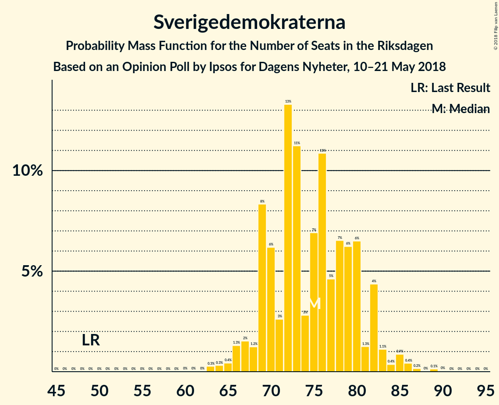
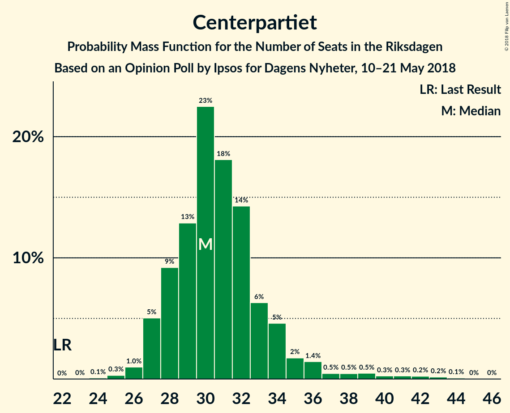
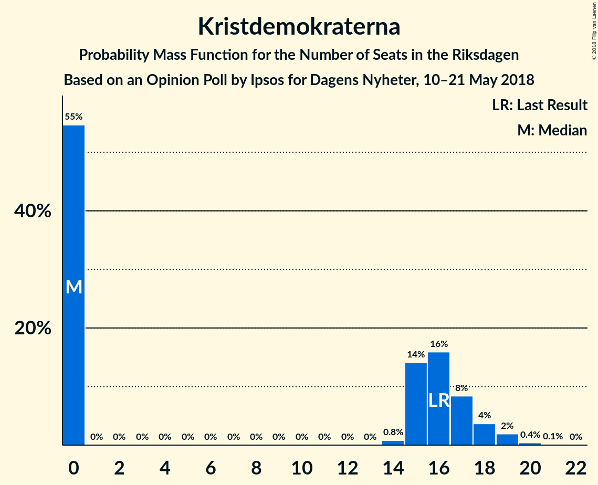

# Opinion Poll by Ipsos for Dagens Nyheter, 10–21 May 2018

<a href="#voting-intentions">Voting Intentions</a> | <a href="#seats">Seats</a> | <a href="#coalitions">Coalitions</a> | <a href="#technical-information">Technical Information</a>

## Voting Intentions

### Confidence Intervals

| Party | Last Result | Poll Result | 80% Confidence Interval | 90% Confidence Interval | 95% Confidence Interval | 99% Confidence Interval |
|:-----:|:-----------:|:-----------:|:-----------------------:|:-----------------------:|:-----------------------:|:-----------------------:|
| Sveriges socialdemokratiska arbetareparti | 31.0% | 23.8% | 22.5–25.1% |22.2–25.5% |21.9–25.8% |21.3–26.4% |
| Moderata samlingspartiet | 23.3% | 21.8% | 20.6–23.1% |20.2–23.4% |19.9–23.7% |19.4–24.4% |
| Sverigedemokraterna | 12.9% | 19.8% | 18.6–21.0% |18.3–21.4% |18.0–21.7% |17.5–22.3% |
| Centerpartiet | 6.1% | 8.9% | 8.1–9.8% |7.9–10.1% |7.7–10.3% |7.3–10.8% |
| Vänsterpartiet | 5.7% | 8.9% | 8.1–9.8% |7.9–10.1% |7.7–10.3% |7.3–10.8% |
| Liberalerna | 5.4% | 5.0% | 4.3–5.7% |4.2–5.9% |4.0–6.1% |3.8–6.4% |
| Miljöpartiet de gröna | 6.9% | 4.0% | 3.4–4.6% |3.3–4.8% |3.2–5.0% |2.9–5.3% |
| Kristdemokraterna | 4.6% | 4.0% | 3.4–4.6% |3.3–4.8% |3.2–5.0% |2.9–5.3% |
| Feministiskt initiativ | 3.1% | 2.0% | 1.6–2.5% |1.5–2.6% |1.4–2.7% |1.3–3.0% |

*Note:* The poll result column reflects the actual value used in the calculations. Published results may vary slightly, and in addition be rounded to fewer digits.

## Seats

### Confidence Intervals

| Party | Last Result | Median | 80% Confidence Interval | 90% Confidence Interval | 95% Confidence Interval | 99% Confidence Interval |
|:-----:|:-----------:|:------:|:-----------------------:|:-----------------------:|:-----------------------:|:-----------------------:|
| <a href="#sveriges-socialdemokratiska-arbetareparti">Sveriges socialdemokratiska arbetareparti</a> | 113 | 87 | 79–97 |79–97 |79–97 |79–99 |
| <a href="#moderata-samlingspartiet">Moderata samlingspartiet</a> | 84 | 76 | 71–85 |71–92 |71–92 |71–92 |
| <a href="#sverigedemokraterna">Sverigedemokraterna</a> | 49 | 73 | 71–77 |71–80 |71–80 |70–80 |
| <a href="#centerpartiet">Centerpartiet</a> | 22 | 33 | 27–36 |26–37 |26–37 |26–42 |
| <a href="#vänsterpartiet">Vänsterpartiet</a> | 21 | 40 | 33–40 |27–43 |27–43 |26–43 |
| <a href="#liberalerna">Liberalerna</a> | 19 | 19 | 16–22 |0–22 |0–22 |0–25 |
| <a href="#miljöpartiet-de-gröna">Miljöpartiet de gröna</a> | 25 | 15 | 0–15 |0–20 |0–20 |0–20 |
| <a href="#kristdemokraterna">Kristdemokraterna</a> | 16 | 16 | 0–18 |0–19 |0–19 |0–19 |
| <a href="#feministiskt-initiativ">Feministiskt initiativ</a> | 0 | 0 | 0 |0 |0 |0 |

### Sveriges socialdemokratiska arbetareparti

*For a full overview of the results for this party, see the [Sveriges socialdemokratiska arbetareparti](party-sverigessocialdemokratiskaarbetareparti.html) page.*

| Number of Seats | Probability | Accumulated | Special Marks |
|:---------------:|:-----------:|:-----------:|:-------------:|
| 79 | 13% | 100% |  |
| 80 | 0% | 87% |  |
| 81 | 0.4% | 87% |  |
| 82 | 0% | 87% |  |
| 83 | 10% | 87% |  |
| 84 | 0% | 77% |  |
| 85 | 0.9% | 77% |  |
| 86 | 0% | 76% |  |
| 87 | 42% | 76% | Median |
| 88 | 0% | 34% |  |
| 89 | 0% | 34% |  |
| 90 | 0.3% | 34% |  |
| 91 | 6% | 33% |  |
| 92 | 0% | 27% |  |
| 93 | 0% | 27% |  |
| 94 | 6% | 27% |  |
| 95 | 0% | 21% |  |
| 96 | 0% | 21% |  |
| 97 | 19% | 21% |  |
| 98 | 0.1% | 2% |  |
| 99 | 2% | 2% |  |
| 100 | 0% | 0.2% |  |
| 101 | 0% | 0.2% |  |
| 102 | 0% | 0.2% |  |
| 103 | 0% | 0.2% |  |
| 104 | 0% | 0.2% |  |
| 105 | 0% | 0.2% |  |
| 106 | 0% | 0.2% |  |
| 107 | 0.2% | 0.2% |  |
| 108 | 0% | 0% |  |
| 109 | 0% | 0% |  |
| 110 | 0% | 0% |  |
| 111 | 0% | 0% |  |
| 112 | 0% | 0% |  |
| 113 | 0% | 0% | Last Result |

### Moderata samlingspartiet

*For a full overview of the results for this party, see the [Moderata samlingspartiet](party-moderatasamlingspartiet.html) page.*

| Number of Seats | Probability | Accumulated | Special Marks |
|:---------------:|:-----------:|:-----------:|:-------------:|
| 68 | 0.1% | 100% |  |
| 69 | 0% | 99.9% |  |
| 70 | 0% | 99.9% |  |
| 71 | 42% | 99.9% |  |
| 72 | 0% | 58% |  |
| 73 | 0% | 58% |  |
| 74 | 0.8% | 58% |  |
| 75 | 0.1% | 57% |  |
| 76 | 13% | 57% | Median |
| 77 | 0.7% | 44% |  |
| 78 | 6% | 44% |  |
| 79 | 0% | 38% |  |
| 80 | 0.2% | 38% |  |
| 81 | 0% | 38% |  |
| 82 | 0% | 38% |  |
| 83 | 2% | 38% |  |
| 84 | 0% | 35% | Last Result |
| 85 | 26% | 35% |  |
| 86 | 0% | 10% |  |
| 87 | 0% | 10% |  |
| 88 | 0% | 10% |  |
| 89 | 0% | 10% |  |
| 90 | 0% | 10% |  |
| 91 | 0% | 10% |  |
| 92 | 10% | 10% |  |
| 93 | 0% | 0% |  |

### Sverigedemokraterna

*For a full overview of the results for this party, see the [Sverigedemokraterna](party-sverigedemokraterna.html) page.*

| Number of Seats | Probability | Accumulated | Special Marks |
|:---------------:|:-----------:|:-----------:|:-------------:|
| 49 | 0% | 100% | Last Result |
| 50 | 0% | 100% |  |
| 51 | 0% | 100% |  |
| 52 | 0% | 100% |  |
| 53 | 0% | 100% |  |
| 54 | 0% | 100% |  |
| 55 | 0% | 100% |  |
| 56 | 0% | 100% |  |
| 57 | 0% | 100% |  |
| 58 | 0% | 100% |  |
| 59 | 0% | 100% |  |
| 60 | 0% | 100% |  |
| 61 | 0% | 100% |  |
| 62 | 0% | 100% |  |
| 63 | 0% | 100% |  |
| 64 | 0% | 100% |  |
| 65 | 0% | 100% |  |
| 66 | 0% | 100% |  |
| 67 | 0% | 100% |  |
| 68 | 0% | 100% |  |
| 69 | 0% | 99.9% |  |
| 70 | 2% | 99.9% |  |
| 71 | 42% | 98% |  |
| 72 | 0% | 56% |  |
| 73 | 7% | 56% | Median |
| 74 | 0.2% | 49% |  |
| 75 | 13% | 49% |  |
| 76 | 19% | 36% |  |
| 77 | 10% | 17% |  |
| 78 | 0.4% | 6% |  |
| 79 | 0% | 6% |  |
| 80 | 6% | 6% |  |
| 81 | 0% | 0.1% |  |
| 82 | 0% | 0.1% |  |
| 83 | 0.1% | 0.1% |  |
| 84 | 0% | 0% |  |

### Centerpartiet

*For a full overview of the results for this party, see the [Centerpartiet](party-centerpartiet.html) page.*

| Number of Seats | Probability | Accumulated | Special Marks |
|:---------------:|:-----------:|:-----------:|:-------------:|
| 22 | 0% | 100% | Last Result |
| 23 | 0% | 100% |  |
| 24 | 0% | 100% |  |
| 25 | 0% | 100% |  |
| 26 | 6% | 100% |  |
| 27 | 15% | 94% |  |
| 28 | 0.9% | 80% |  |
| 29 | 0.7% | 79% |  |
| 30 | 0% | 78% |  |
| 31 | 0% | 78% |  |
| 32 | 0% | 78% |  |
| 33 | 42% | 78% | Median |
| 34 | 10% | 36% |  |
| 35 | 0% | 26% |  |
| 36 | 19% | 26% |  |
| 37 | 6% | 7% |  |
| 38 | 0% | 1.1% |  |
| 39 | 0.2% | 1.1% |  |
| 40 | 0% | 0.9% |  |
| 41 | 0% | 0.9% |  |
| 42 | 0.8% | 0.9% |  |
| 43 | 0% | 0% |  |

### Vänsterpartiet

*For a full overview of the results for this party, see the [Vänsterpartiet](party-vänsterpartiet.html) page.*

| Number of Seats | Probability | Accumulated | Special Marks |
|:---------------:|:-----------:|:-----------:|:-------------:|
| 21 | 0% | 100% | Last Result |
| 22 | 0% | 100% |  |
| 23 | 0% | 100% |  |
| 24 | 0% | 100% |  |
| 25 | 0% | 100% |  |
| 26 | 0.8% | 100% |  |
| 27 | 6% | 99.2% |  |
| 28 | 0% | 94% |  |
| 29 | 0.1% | 94% |  |
| 30 | 0.2% | 93% |  |
| 31 | 0% | 93% |  |
| 32 | 1.1% | 93% |  |
| 33 | 6% | 92% |  |
| 34 | 2% | 87% |  |
| 35 | 0% | 85% |  |
| 36 | 19% | 85% |  |
| 37 | 13% | 65% |  |
| 38 | 0% | 53% |  |
| 39 | 0% | 53% |  |
| 40 | 43% | 53% | Median |
| 41 | 0.1% | 10% |  |
| 42 | 0% | 10% |  |
| 43 | 10% | 10% |  |
| 44 | 0% | 0% |  |

### Liberalerna

*For a full overview of the results for this party, see the [Liberalerna](party-liberalerna.html) page.*

| Number of Seats | Probability | Accumulated | Special Marks |
|:---------------:|:-----------:|:-----------:|:-------------:|
| 0 | 6% | 100% |  |
| 1 | 0% | 94% |  |
| 2 | 0% | 94% |  |
| 3 | 0% | 94% |  |
| 4 | 0% | 94% |  |
| 5 | 0% | 94% |  |
| 6 | 0% | 94% |  |
| 7 | 0% | 94% |  |
| 8 | 0% | 94% |  |
| 9 | 0% | 94% |  |
| 10 | 0% | 94% |  |
| 11 | 0% | 94% |  |
| 12 | 0% | 94% |  |
| 13 | 0% | 94% |  |
| 14 | 0% | 94% |  |
| 15 | 0% | 94% |  |
| 16 | 42% | 94% |  |
| 17 | 0.1% | 52% |  |
| 18 | 0% | 52% |  |
| 19 | 22% | 52% | Last Result, Median |
| 20 | 15% | 30% |  |
| 21 | 1.0% | 14% |  |
| 22 | 13% | 13% |  |
| 23 | 0% | 0.9% |  |
| 24 | 0% | 0.9% |  |
| 25 | 0.8% | 0.9% |  |
| 26 | 0% | 0% |  |

### Miljöpartiet de gröna

*For a full overview of the results for this party, see the [Miljöpartiet de gröna](party-miljöpartietdegröna.html) page.*

| Number of Seats | Probability | Accumulated | Special Marks |
|:---------------:|:-----------:|:-----------:|:-------------:|
| 0 | 31% | 100% |  |
| 1 | 0% | 69% |  |
| 2 | 0% | 69% |  |
| 3 | 0% | 69% |  |
| 4 | 0% | 69% |  |
| 5 | 0% | 69% |  |
| 6 | 0% | 69% |  |
| 7 | 0% | 69% |  |
| 8 | 0% | 69% |  |
| 9 | 0% | 69% |  |
| 10 | 0% | 69% |  |
| 11 | 0% | 69% |  |
| 12 | 0% | 69% |  |
| 13 | 0% | 69% |  |
| 14 | 0.1% | 69% |  |
| 15 | 61% | 69% | Median |
| 16 | 0% | 8% |  |
| 17 | 2% | 8% |  |
| 18 | 0% | 6% |  |
| 19 | 0% | 6% |  |
| 20 | 6% | 6% |  |
| 21 | 0% | 0.3% |  |
| 22 | 0% | 0.2% |  |
| 23 | 0.2% | 0.2% |  |
| 24 | 0% | 0% |  |
| 25 | 0% | 0% | Last Result |

### Kristdemokraterna

*For a full overview of the results for this party, see the [Kristdemokraterna](party-kristdemokraterna.html) page.*

| Number of Seats | Probability | Accumulated | Special Marks |
|:---------------:|:-----------:|:-----------:|:-------------:|
| 0 | 37% | 100% |  |
| 1 | 0% | 63% |  |
| 2 | 0% | 63% |  |
| 3 | 0% | 63% |  |
| 4 | 0% | 63% |  |
| 5 | 0% | 63% |  |
| 6 | 0% | 63% |  |
| 7 | 0% | 63% |  |
| 8 | 0% | 63% |  |
| 9 | 0% | 63% |  |
| 10 | 0% | 63% |  |
| 11 | 0% | 63% |  |
| 12 | 0% | 63% |  |
| 13 | 0% | 63% |  |
| 14 | 0% | 63% |  |
| 15 | 0.1% | 63% |  |
| 16 | 43% | 63% | Last Result, Median |
| 17 | 2% | 20% |  |
| 18 | 13% | 19% |  |
| 19 | 6% | 6% |  |
| 20 | 0% | 0% |  |

### Feministiskt initiativ

*For a full overview of the results for this party, see the [Feministiskt initiativ](party-feministisktinitiativ.html) page.*

| Number of Seats | Probability | Accumulated | Special Marks |
|:---------------:|:-----------:|:-----------:|:-------------:|
| 0 | 100% | 100% | Last Result, Median |

## Coalitions

### Confidence Intervals

| Coalition | Last Result | Median | Majority? | 80% Confidence Interval | 90% Confidence Interval | 95% Confidence Interval | 99% Confidence Interval |
|:---------:|:-----------:|:------:|:---------:|:-----------------------:|:-----------------------:|:-----------------------:|:-----------------------:|
| Moderata samlingspartiet – Centerpartiet – Liberalerna – Kristdemokraterna | 141 | 136 | 0% | 135–146 | 130–146 | 130–146 | 129–155 |
| Moderata samlingspartiet – Centerpartiet – Liberalerna | 125 | 125 | 0% | 120–140 | 111–146 | 111–146 | 111–146 |
| Sveriges socialdemokratiska arbetareparti – Vänsterpartiet – Miljöpartiet de gröna – Feministiskt initiativ | 159 | 139 | 0% | 126–142 | 126–142 | 126–142 | 117–150 |
| Sveriges socialdemokratiska arbetareparti – Vänsterpartiet – Miljöpartiet de gröna | 159 | 139 | 0% | 126–142 | 126–142 | 126–142 | 117–150 |
| Sveriges socialdemokratiska arbetareparti – Vänsterpartiet | 134 | 127 | 0% | 116–133 | 116–133 | 116–133 | 109–133 |
| Moderata samlingspartiet – Centerpartiet – Kristdemokraterna | 122 | 120 | 0% | 120–126 | 115–130 | 115–130 | 110–133 |
| Moderata samlingspartiet – Centerpartiet | 106 | 104 | 0% | 103–121 | 103–126 | 103–126 | 103–126 |

### Moderata samlingspartiet – Centerpartiet – Liberalerna – Kristdemokraterna

| Number of Seats | Probability | Accumulated | Special Marks |
|:---------------:|:-----------:|:-----------:|:-------------:|
| 119 | 0.1% | 100% |  |
| 120 | 0% | 99.9% |  |
| 121 | 0% | 99.9% |  |
| 122 | 0% | 99.9% |  |
| 123 | 0% | 99.9% |  |
| 124 | 0% | 99.9% |  |
| 125 | 0% | 99.9% |  |
| 126 | 0% | 99.9% |  |
| 127 | 0% | 99.9% |  |
| 128 | 0% | 99.9% |  |
| 129 | 2% | 99.9% |  |
| 130 | 6% | 98% |  |
| 131 | 0.3% | 92% |  |
| 132 | 0% | 92% |  |
| 133 | 0% | 92% |  |
| 134 | 0% | 92% |  |
| 135 | 6% | 92% |  |
| 136 | 42% | 86% |  |
| 137 | 0% | 44% |  |
| 138 | 0.2% | 44% |  |
| 139 | 0% | 44% |  |
| 140 | 19% | 44% |  |
| 141 | 0% | 25% | Last Result |
| 142 | 0% | 25% |  |
| 143 | 13% | 25% |  |
| 144 | 0% | 12% | Median |
| 145 | 0% | 12% |  |
| 146 | 10% | 12% |  |
| 147 | 0% | 2% |  |
| 148 | 0% | 2% |  |
| 149 | 0% | 2% |  |
| 150 | 0.4% | 2% |  |
| 151 | 0% | 2% |  |
| 152 | 0.8% | 2% |  |
| 153 | 0% | 0.9% |  |
| 154 | 0% | 0.9% |  |
| 155 | 0.8% | 0.9% |  |
| 156 | 0% | 0% |  |

### Moderata samlingspartiet – Centerpartiet – Liberalerna

| Number of Seats | Probability | Accumulated | Special Marks |
|:---------------:|:-----------:|:-----------:|:-------------:|
| 111 | 6% | 100% |  |
| 112 | 0% | 94% |  |
| 113 | 0% | 94% |  |
| 114 | 0% | 94% |  |
| 115 | 0% | 94% |  |
| 116 | 0.1% | 94% |  |
| 117 | 0% | 94% |  |
| 118 | 0% | 94% |  |
| 119 | 0.1% | 94% |  |
| 120 | 42% | 94% |  |
| 121 | 0% | 52% |  |
| 122 | 0% | 52% |  |
| 123 | 0% | 52% |  |
| 124 | 0% | 52% |  |
| 125 | 13% | 52% | Last Result |
| 126 | 0% | 40% |  |
| 127 | 0.7% | 40% |  |
| 128 | 0% | 39% | Median |
| 129 | 2% | 39% |  |
| 130 | 0% | 37% |  |
| 131 | 0.2% | 37% |  |
| 132 | 0.4% | 37% |  |
| 133 | 0% | 36% |  |
| 134 | 0% | 36% |  |
| 135 | 7% | 36% |  |
| 136 | 0% | 30% |  |
| 137 | 0% | 30% |  |
| 138 | 1.0% | 30% |  |
| 139 | 0% | 29% |  |
| 140 | 19% | 29% |  |
| 141 | 0% | 10% |  |
| 142 | 0% | 10% |  |
| 143 | 0% | 10% |  |
| 144 | 0.1% | 10% |  |
| 145 | 0% | 10% |  |
| 146 | 10% | 10% |  |
| 147 | 0% | 0% |  |

### Sveriges socialdemokratiska arbetareparti – Vänsterpartiet – Miljöpartiet de gröna – Feministiskt initiativ

| Number of Seats | Probability | Accumulated | Special Marks |
|:---------------:|:-----------:|:-----------:|:-------------:|
| 117 | 0.8% | 100% |  |
| 118 | 0% | 99.2% |  |
| 119 | 0% | 99.2% |  |
| 120 | 0% | 99.2% |  |
| 121 | 0.4% | 99.2% |  |
| 122 | 0% | 98.8% |  |
| 123 | 0% | 98.7% |  |
| 124 | 0.8% | 98.7% |  |
| 125 | 0% | 98% |  |
| 126 | 10% | 98% |  |
| 127 | 0% | 88% |  |
| 128 | 0% | 88% |  |
| 129 | 0% | 88% |  |
| 130 | 0% | 88% |  |
| 131 | 13% | 88% |  |
| 132 | 0% | 75% |  |
| 133 | 19% | 75% |  |
| 134 | 0% | 56% |  |
| 135 | 0.1% | 56% |  |
| 136 | 0% | 56% |  |
| 137 | 0.2% | 56% |  |
| 138 | 0% | 56% |  |
| 139 | 6% | 56% |  |
| 140 | 0% | 50% |  |
| 141 | 6% | 50% |  |
| 142 | 42% | 44% | Median |
| 143 | 0% | 2% |  |
| 144 | 0% | 2% |  |
| 145 | 0.2% | 2% |  |
| 146 | 0% | 2% |  |
| 147 | 0% | 2% |  |
| 148 | 0% | 2% |  |
| 149 | 0% | 2% |  |
| 150 | 2% | 2% |  |
| 151 | 0% | 0.1% |  |
| 152 | 0% | 0.1% |  |
| 153 | 0% | 0.1% |  |
| 154 | 0% | 0.1% |  |
| 155 | 0% | 0.1% |  |
| 156 | 0% | 0.1% |  |
| 157 | 0% | 0.1% |  |
| 158 | 0% | 0.1% |  |
| 159 | 0.1% | 0.1% | Last Result |
| 160 | 0% | 0% |  |

### Sveriges socialdemokratiska arbetareparti – Vänsterpartiet – Miljöpartiet de gröna

| Number of Seats | Probability | Accumulated | Special Marks |
|:---------------:|:-----------:|:-----------:|:-------------:|
| 117 | 0.8% | 100% |  |
| 118 | 0% | 99.2% |  |
| 119 | 0% | 99.2% |  |
| 120 | 0% | 99.2% |  |
| 121 | 0.4% | 99.2% |  |
| 122 | 0% | 98.8% |  |
| 123 | 0% | 98.7% |  |
| 124 | 0.8% | 98.7% |  |
| 125 | 0% | 98% |  |
| 126 | 10% | 98% |  |
| 127 | 0% | 88% |  |
| 128 | 0% | 88% |  |
| 129 | 0% | 88% |  |
| 130 | 0% | 88% |  |
| 131 | 13% | 88% |  |
| 132 | 0% | 75% |  |
| 133 | 19% | 75% |  |
| 134 | 0% | 56% |  |
| 135 | 0.1% | 56% |  |
| 136 | 0% | 56% |  |
| 137 | 0.2% | 56% |  |
| 138 | 0% | 56% |  |
| 139 | 6% | 56% |  |
| 140 | 0% | 50% |  |
| 141 | 6% | 50% |  |
| 142 | 42% | 44% | Median |
| 143 | 0% | 2% |  |
| 144 | 0% | 2% |  |
| 145 | 0.2% | 2% |  |
| 146 | 0% | 2% |  |
| 147 | 0% | 2% |  |
| 148 | 0% | 2% |  |
| 149 | 0% | 2% |  |
| 150 | 2% | 2% |  |
| 151 | 0% | 0.1% |  |
| 152 | 0% | 0.1% |  |
| 153 | 0% | 0.1% |  |
| 154 | 0% | 0.1% |  |
| 155 | 0% | 0.1% |  |
| 156 | 0% | 0.1% |  |
| 157 | 0% | 0.1% |  |
| 158 | 0% | 0.1% |  |
| 159 | 0.1% | 0.1% | Last Result |
| 160 | 0% | 0% |  |

### Sveriges socialdemokratiska arbetareparti – Vänsterpartiet

| Number of Seats | Probability | Accumulated | Special Marks |
|:---------------:|:-----------:|:-----------:|:-------------:|
| 109 | 0.8% | 100% |  |
| 110 | 0% | 99.2% |  |
| 111 | 0% | 99.2% |  |
| 112 | 0% | 99.2% |  |
| 113 | 0% | 99.2% |  |
| 114 | 0% | 99.2% |  |
| 115 | 0% | 99.2% |  |
| 116 | 13% | 99.2% |  |
| 117 | 0.8% | 87% |  |
| 118 | 0% | 86% |  |
| 119 | 0% | 86% |  |
| 120 | 0% | 86% |  |
| 121 | 6% | 86% |  |
| 122 | 0.3% | 80% |  |
| 123 | 0% | 79% |  |
| 124 | 6% | 79% |  |
| 125 | 0% | 74% |  |
| 126 | 10% | 74% |  |
| 127 | 42% | 64% | Median |
| 128 | 0% | 22% |  |
| 129 | 0% | 22% |  |
| 130 | 0% | 22% |  |
| 131 | 0.7% | 22% |  |
| 132 | 0% | 21% |  |
| 133 | 21% | 21% |  |
| 134 | 0% | 0.3% | Last Result |
| 135 | 0% | 0.3% |  |
| 136 | 0% | 0.3% |  |
| 137 | 0.2% | 0.3% |  |
| 138 | 0% | 0.1% |  |
| 139 | 0.1% | 0.1% |  |
| 140 | 0% | 0% |  |

### Moderata samlingspartiet – Centerpartiet – Kristdemokraterna

| Number of Seats | Probability | Accumulated | Special Marks |
|:---------------:|:-----------:|:-----------:|:-------------:|
| 102 | 0.1% | 100% |  |
| 103 | 0% | 99.9% |  |
| 104 | 0% | 99.9% |  |
| 105 | 0% | 99.9% |  |
| 106 | 0% | 99.9% |  |
| 107 | 0% | 99.9% |  |
| 108 | 0% | 99.9% |  |
| 109 | 0% | 99.9% |  |
| 110 | 2% | 99.9% |  |
| 111 | 0.1% | 98% |  |
| 112 | 0% | 98% |  |
| 113 | 0% | 98% |  |
| 114 | 0% | 98% |  |
| 115 | 6% | 98% |  |
| 116 | 0% | 92% |  |
| 117 | 0% | 92% |  |
| 118 | 0% | 92% |  |
| 119 | 0.2% | 92% |  |
| 120 | 42% | 92% |  |
| 121 | 32% | 50% |  |
| 122 | 0.7% | 18% | Last Result |
| 123 | 0% | 17% |  |
| 124 | 0% | 17% |  |
| 125 | 0% | 17% | Median |
| 126 | 10% | 17% |  |
| 127 | 0% | 8% |  |
| 128 | 0% | 8% |  |
| 129 | 0% | 8% |  |
| 130 | 6% | 8% |  |
| 131 | 0% | 1.3% |  |
| 132 | 0% | 1.3% |  |
| 133 | 0.8% | 1.3% |  |
| 134 | 0.4% | 0.5% |  |
| 135 | 0.1% | 0.1% |  |
| 136 | 0% | 0% |  |

### Moderata samlingspartiet – Centerpartiet

| Number of Seats | Probability | Accumulated | Special Marks |
|:---------------:|:-----------:|:-----------:|:-------------:|
| 96 | 0.1% | 100% |  |
| 97 | 0% | 99.9% |  |
| 98 | 0% | 99.9% |  |
| 99 | 0% | 99.9% |  |
| 100 | 0% | 99.9% |  |
| 101 | 0% | 99.9% |  |
| 102 | 0.1% | 99.9% |  |
| 103 | 13% | 99.8% |  |
| 104 | 42% | 87% |  |
| 105 | 0% | 45% |  |
| 106 | 0.7% | 45% | Last Result |
| 107 | 0% | 45% |  |
| 108 | 0% | 45% |  |
| 109 | 0% | 45% | Median |
| 110 | 2% | 45% |  |
| 111 | 6% | 42% |  |
| 112 | 0% | 37% |  |
| 113 | 0.8% | 37% |  |
| 114 | 0% | 36% |  |
| 115 | 6% | 36% |  |
| 116 | 1.2% | 30% |  |
| 117 | 0% | 29% |  |
| 118 | 0% | 29% |  |
| 119 | 0.2% | 29% |  |
| 120 | 0% | 29% |  |
| 121 | 19% | 29% |  |
| 122 | 0% | 10% |  |
| 123 | 0% | 10% |  |
| 124 | 0% | 10% |  |
| 125 | 0% | 10% |  |
| 126 | 10% | 10% |  |
| 127 | 0% | 0% |  |

## Technical Information

### Opinion Poll

+ **Polling firm:** Ipsos
+ **Commissioner(s):** Dagens Nyheter
+ **Fieldwork period:** 10–21 May 2018

### Calculations

+ **Sample size:** 1818
+ **Simulations done:** 1,024
+ **Error estimate:** 1.92%

