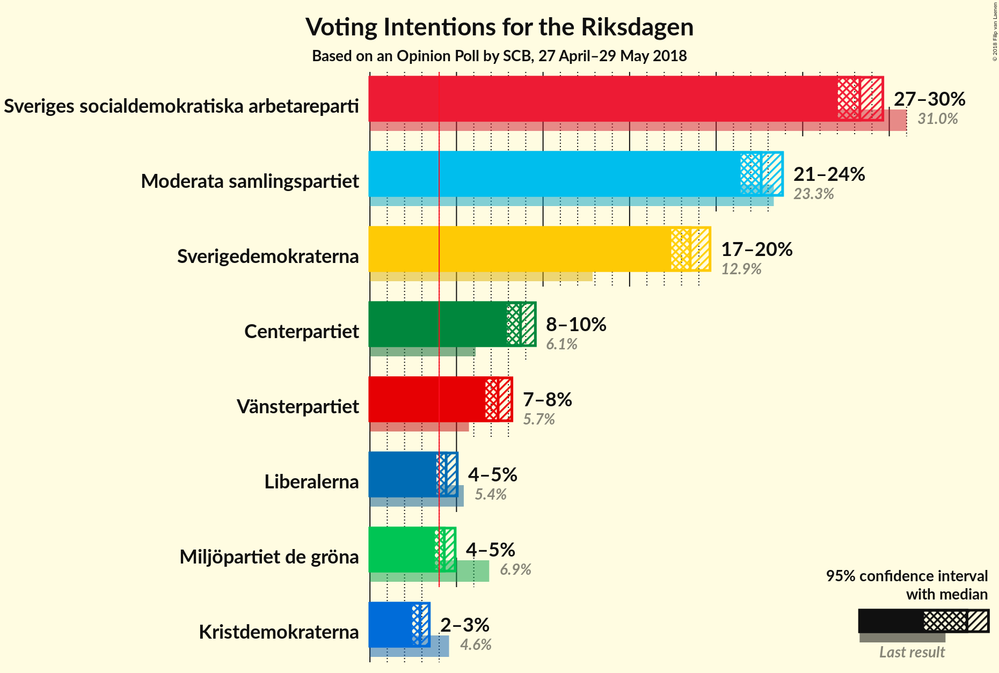
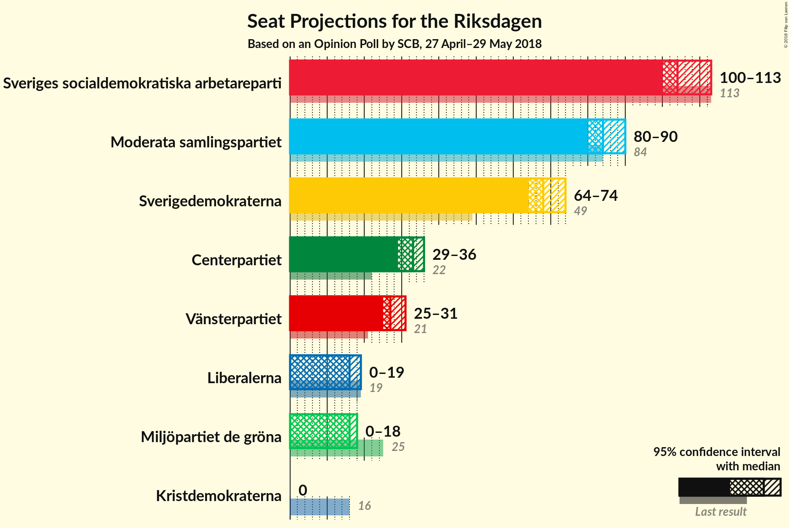

# Opinion Poll by SCB, 27 April–29 May 2018

<a href="#voting-intentions">Voting Intentions</a> | <a href="#seats">Seats</a> | <a href="#coalitions">Coalitions</a> | <a href="#technical-information">Technical Information</a>

## Voting Intentions

### Confidence Intervals

| Party | Last Result | Poll Result | 80% Confidence Interval | 90% Confidence Interval | 95% Confidence Interval | 99% Confidence Interval |
|:-----:|:-----------:|:-----------:|:-----------------------:|:-----------------------:|:-----------------------:|:-----------------------:|
| Sveriges socialdemokratiska arbetareparti | 31.0% | 28.3% | 27.5–29.2% |27.2–29.4% |27.0–29.6% |26.6–30.0% |
| Moderata samlingspartiet | 23.3% | 22.6% | 21.8–23.4% |21.6–23.6% |21.4–23.8% |21.0–24.2% |
| Sverigedemokraterna | 12.9% | 18.5% | 17.8–19.3% |17.6–19.5% |17.4–19.6% |17.1–20.0% |
| Centerpartiet | 6.1% | 8.7% | 8.2–9.3% |8.0–9.4% |7.9–9.6% |7.7–9.8% |
| Vänsterpartiet | 5.7% | 7.4% | 6.9–7.9% |6.8–8.1% |6.7–8.2% |6.5–8.5% |
| Liberalerna | 5.4% | 4.4% | N/A |N/A |N/A |N/A |
| Miljöpartiet de gröna | 6.9% | 4.3% | 3.9–4.7% |3.8–4.8% |3.7–4.9% |3.6–5.1% |
| Kristdemokraterna | 4.6% | 2.9% | 2.6–3.2% |2.5–3.3% |2.4–3.4% |2.3–3.6% |

*Note:* The poll result column reflects the actual value used in the calculations. Published results may vary slightly, and in addition be rounded to fewer digits.

## Seats

### Confidence Intervals

| Party | Last Result | Median | 80% Confidence Interval | 90% Confidence Interval | 95% Confidence Interval | 99% Confidence Interval |
|:-----:|:-----------:|:------:|:-----------------------:|:-----------------------:|:-----------------------:|:-----------------------:|
| <a href="#sveriges-socialdemokratiska-arbetareparti">Sveriges socialdemokratiska arbetareparti</a> | 113 | 107 | 107–111 |106–111 |102–114 |102–114 |
| <a href="#moderata-samlingspartiet">Moderata samlingspartiet</a> | 84 | 84 | 82–84 |82–84 |81–94 |80–95 |
| <a href="#sverigedemokraterna">Sverigedemokraterna</a> | 49 | 71 | 64–71 |64–72 |64–79 |64–79 |
| <a href="#centerpartiet">Centerpartiet</a> | 22 | 35 | 30–35 |30–35 |30–36 |30–36 |
| <a href="#vänsterpartiet">Vänsterpartiet</a> | 21 | 32 | 26–32 |26–32 |25–32 |24–32 |
| <a href="#liberalerna">Liberalerna</a> | 19 | N/A | N/A |N/A |N/A |N/A |
| <a href="#miljöpartiet-de-gröna">Miljöpartiet de gröna</a> | 25 | 0 | 0–17 |0–17 |0–19 |0–19 |
| <a href="#kristdemokraterna">Kristdemokraterna</a> | 16 | 0 | 0 |0 |0 |0 |

