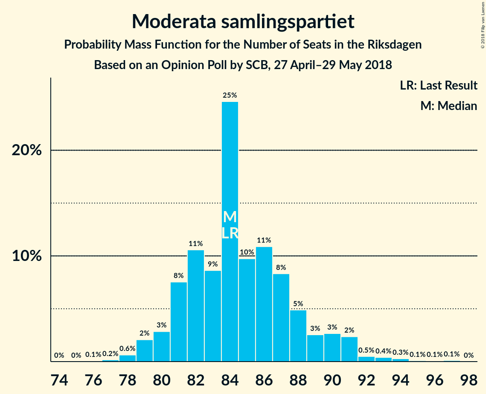

# Opinion Poll by SCB, 27 April–29 May 2018

<a href="#voting-intentions">Voting Intentions</a> | <a href="#seats">Seats</a> | <a href="#coalitions">Coalitions</a> | <a href="#technical-information">Technical Information</a>

## Voting Intentions

### Confidence Intervals

| Party | Last Result | Poll Result | 80% Confidence Interval | 90% Confidence Interval | 95% Confidence Interval | 99% Confidence Interval |
|:-----:|:-----------:|:-----------:|:-----------------------:|:-----------------------:|:-----------------------:|:-----------------------:|
| Sveriges socialdemokratiska arbetareparti | 31.0% | 28.3% | 27.5–29.2% |27.2–29.4% |27.0–29.6% |26.6–30.0% |
| Moderata samlingspartiet | 23.3% | 22.6% | 21.8–23.4% |21.6–23.6% |21.4–23.8% |21.0–24.2% |
| Sverigedemokraterna | 12.9% | 18.5% | 17.8–19.3% |17.6–19.5% |17.4–19.6% |17.1–20.0% |
| Centerpartiet | 6.1% | 8.7% | 8.2–9.3% |8.0–9.4% |7.9–9.6% |7.7–9.8% |
| Vänsterpartiet | 5.7% | 7.4% | 6.9–7.9% |6.8–8.1% |6.7–8.2% |6.5–8.5% |
| Liberalerna | 5.4% | 4.4% | 4.0–4.8% |3.9–4.9% |3.8–5.0% |3.7–5.2% |
| Miljöpartiet de gröna | 6.9% | 4.3% | 3.9–4.7% |3.8–4.8% |3.7–4.9% |3.6–5.1% |
| Kristdemokraterna | 4.6% | 2.9% | 2.6–3.2% |2.5–3.3% |2.4–3.4% |2.3–3.6% |

*Note:* The poll result column reflects the actual value used in the calculations. Published results may vary slightly, and in addition be rounded to fewer digits.

## Seats

### Confidence Intervals

| Party | Last Result | Median | 80% Confidence Interval | 90% Confidence Interval | 95% Confidence Interval | 99% Confidence Interval |
|:-----:|:-----------:|:------:|:-----------------------:|:-----------------------:|:-----------------------:|:-----------------------:|
| <a href="#sveriges-socialdemokratiska-arbetareparti">Sveriges socialdemokratiska arbetareparti</a> | 113 | 107 | 107–111 |106–111 |102–114 |102–114 |
| <a href="#moderata-samlingspartiet">Moderata samlingspartiet</a> | 84 | 84 | 82–84 |82–84 |81–94 |80–95 |
| <a href="#sverigedemokraterna">Sverigedemokraterna</a> | 49 | 71 | 64–71 |64–72 |64–79 |64–79 |
| <a href="#centerpartiet">Centerpartiet</a> | 22 | 35 | 30–35 |30–35 |30–36 |30–36 |
| <a href="#vänsterpartiet">Vänsterpartiet</a> | 21 | 32 | 26–32 |26–32 |25–32 |24–32 |
| <a href="#liberalerna">Liberalerna</a> | 19 | 20 | 19–20 |15–20 |0–20 |0–20 |
| <a href="#miljöpartiet-de-gröna">Miljöpartiet de gröna</a> | 25 | 0 | 0–17 |0–17 |0–19 |0–19 |
| <a href="#kristdemokraterna">Kristdemokraterna</a> | 16 | 0 | 0 |0 |0 |0 |

### Sveriges socialdemokratiska arbetareparti

*For a full overview of the results for this party, see the [Sveriges socialdemokratiska arbetareparti](party-sverigessocialdemokratiskaarbetareparti.html) page.*

| Number of Seats | Probability | Accumulated | Special Marks |
|:---------------:|:-----------:|:-----------:|:-------------:|
| 96 | 0.1% | 100% |  |
| 97 | 0% | 99.9% |  |
| 98 | 0.2% | 99.9% |  |
| 99 | 0% | 99.7% |  |
| 100 | 0% | 99.7% |  |
| 101 | 0% | 99.6% |  |
| 102 | 3% | 99.6% |  |
| 103 | 1.1% | 97% |  |
| 104 | 0% | 96% |  |
| 105 | 0.1% | 96% |  |
| 106 | 2% | 96% |  |
| 107 | 57% | 94% | Median |
| 108 | 0% | 37% |  |
| 109 | 0.6% | 37% |  |
| 110 | 0.1% | 36% |  |
| 111 | 33% | 36% |  |
| 112 | 0% | 3% |  |
| 113 | 0.1% | 3% | Last Result |
| 114 | 2% | 3% |  |
| 115 | 0.1% | 0.2% |  |
| 116 | 0% | 0.1% |  |
| 117 | 0% | 0.1% |  |
| 118 | 0% | 0.1% |  |
| 119 | 0% | 0.1% |  |
| 120 | 0% | 0.1% |  |
| 121 | 0% | 0% |  |

### Moderata samlingspartiet

*For a full overview of the results for this party, see the [Moderata samlingspartiet](party-moderatasamlingspartiet.html) page.*

| Number of Seats | Probability | Accumulated | Special Marks |
|:---------------:|:-----------:|:-----------:|:-------------:|
| 78 | 0% | 100% |  |
| 79 | 0.2% | 99.9% |  |
| 80 | 2% | 99.8% |  |
| 81 | 3% | 98% |  |
| 82 | 34% | 95% |  |
| 83 | 0.2% | 62% |  |
| 84 | 58% | 62% | Last Result, Median |
| 85 | 0% | 4% |  |
| 86 | 0% | 4% |  |
| 87 | 0% | 4% |  |
| 88 | 0% | 4% |  |
| 89 | 1.0% | 4% |  |
| 90 | 0.1% | 3% |  |
| 91 | 0% | 3% |  |
| 92 | 0.1% | 3% |  |
| 93 | 0.1% | 3% |  |
| 94 | 0% | 3% |  |
| 95 | 2% | 2% |  |
| 96 | 0% | 0% |  |

### Sverigedemokraterna

*For a full overview of the results for this party, see the [Sverigedemokraterna](party-sverigedemokraterna.html) page.*

| Number of Seats | Probability | Accumulated | Special Marks |
|:---------------:|:-----------:|:-----------:|:-------------:|
| 49 | 0% | 100% | Last Result |
| 50 | 0% | 100% |  |
| 51 | 0% | 100% |  |
| 52 | 0% | 100% |  |
| 53 | 0% | 100% |  |
| 54 | 0% | 100% |  |
| 55 | 0% | 100% |  |
| 56 | 0% | 100% |  |
| 57 | 0% | 100% |  |
| 58 | 0% | 100% |  |
| 59 | 0% | 100% |  |
| 60 | 0% | 100% |  |
| 61 | 0% | 100% |  |
| 62 | 0.1% | 100% |  |
| 63 | 0.2% | 99.9% |  |
| 64 | 33% | 99.7% |  |
| 65 | 0.2% | 66% |  |
| 66 | 0.1% | 66% |  |
| 67 | 0.2% | 66% |  |
| 68 | 3% | 66% |  |
| 69 | 0% | 63% |  |
| 70 | 0.1% | 63% |  |
| 71 | 57% | 63% | Median |
| 72 | 2% | 6% |  |
| 73 | 0.1% | 4% |  |
| 74 | 0% | 4% |  |
| 75 | 0% | 4% |  |
| 76 | 1.0% | 4% |  |
| 77 | 0% | 3% |  |
| 78 | 0% | 3% |  |
| 79 | 3% | 3% |  |
| 80 | 0% | 0% |  |

### Centerpartiet

*For a full overview of the results for this party, see the [Centerpartiet](party-centerpartiet.html) page.*

| Number of Seats | Probability | Accumulated | Special Marks |
|:---------------:|:-----------:|:-----------:|:-------------:|
| 22 | 0% | 100% | Last Result |
| 23 | 0% | 100% |  |
| 24 | 0% | 100% |  |
| 25 | 0% | 100% |  |
| 26 | 0% | 100% |  |
| 27 | 0% | 100% |  |
| 28 | 0% | 100% |  |
| 29 | 0.1% | 100% |  |
| 30 | 36% | 99.9% |  |
| 31 | 0.1% | 64% |  |
| 32 | 0.3% | 64% |  |
| 33 | 2% | 63% |  |
| 34 | 0% | 62% |  |
| 35 | 57% | 62% | Median |
| 36 | 4% | 5% |  |
| 37 | 0.2% | 0.3% |  |
| 38 | 0.2% | 0.2% |  |
| 39 | 0% | 0% |  |

### Vänsterpartiet

*For a full overview of the results for this party, see the [Vänsterpartiet](party-vänsterpartiet.html) page.*

| Number of Seats | Probability | Accumulated | Special Marks |
|:---------------:|:-----------:|:-----------:|:-------------:|
| 21 | 0% | 100% | Last Result |
| 22 | 0% | 100% |  |
| 23 | 0% | 100% |  |
| 24 | 2% | 100% |  |
| 25 | 3% | 98% |  |
| 26 | 34% | 96% |  |
| 27 | 0.1% | 62% |  |
| 28 | 0.1% | 62% |  |
| 29 | 0.1% | 61% |  |
| 30 | 3% | 61% |  |
| 31 | 0.2% | 59% |  |
| 32 | 58% | 58% | Median |
| 33 | 0% | 0.2% |  |
| 34 | 0.2% | 0.2% |  |
| 35 | 0% | 0% |  |

### Liberalerna

*For a full overview of the results for this party, see the [Liberalerna](party-liberalerna.html) page.*

| Number of Seats | Probability | Accumulated | Special Marks |
|:---------------:|:-----------:|:-----------:|:-------------:|
| 0 | 4% | 100% |  |
| 1 | 0% | 96% |  |
| 2 | 0% | 96% |  |
| 3 | 0% | 96% |  |
| 4 | 0% | 96% |  |
| 5 | 0% | 96% |  |
| 6 | 0% | 96% |  |
| 7 | 0% | 96% |  |
| 8 | 0% | 96% |  |
| 9 | 0% | 96% |  |
| 10 | 0% | 96% |  |
| 11 | 0% | 96% |  |
| 12 | 0% | 96% |  |
| 13 | 0% | 96% |  |
| 14 | 0% | 96% |  |
| 15 | 2% | 96% |  |
| 16 | 0.1% | 95% |  |
| 17 | 0.3% | 95% |  |
| 18 | 0.7% | 94% |  |
| 19 | 36% | 94% | Last Result |
| 20 | 57% | 58% | Median |
| 21 | 0.1% | 0.1% |  |
| 22 | 0% | 0% |  |

### Miljöpartiet de gröna

*For a full overview of the results for this party, see the [Miljöpartiet de gröna](party-miljöpartietdegröna.html) page.*

| Number of Seats | Probability | Accumulated | Special Marks |
|:---------------:|:-----------:|:-----------:|:-------------:|
| 0 | 61% | 100% | Median |
| 1 | 0% | 39% |  |
| 2 | 0% | 39% |  |
| 3 | 0% | 39% |  |
| 4 | 0% | 39% |  |
| 5 | 0% | 39% |  |
| 6 | 0% | 39% |  |
| 7 | 0% | 39% |  |
| 8 | 0% | 39% |  |
| 9 | 0% | 39% |  |
| 10 | 0% | 39% |  |
| 11 | 0% | 39% |  |
| 12 | 0% | 39% |  |
| 13 | 0% | 39% |  |
| 14 | 0% | 39% |  |
| 15 | 0% | 39% |  |
| 16 | 3% | 39% |  |
| 17 | 34% | 37% |  |
| 18 | 0.3% | 3% |  |
| 19 | 3% | 3% |  |
| 20 | 0.1% | 0.1% |  |
| 21 | 0% | 0% |  |
| 22 | 0% | 0% |  |
| 23 | 0% | 0% |  |
| 24 | 0% | 0% |  |
| 25 | 0% | 0% | Last Result |

### Kristdemokraterna

*For a full overview of the results for this party, see the [Kristdemokraterna](party-kristdemokraterna.html) page.*

| Number of Seats | Probability | Accumulated | Special Marks |
|:---------------:|:-----------:|:-----------:|:-------------:|
| 0 | 100% | 100% | Median |
| 1 | 0% | 0% |  |
| 2 | 0% | 0% |  |
| 3 | 0% | 0% |  |
| 4 | 0% | 0% |  |
| 5 | 0% | 0% |  |
| 6 | 0% | 0% |  |
| 7 | 0% | 0% |  |
| 8 | 0% | 0% |  |
| 9 | 0% | 0% |  |
| 10 | 0% | 0% |  |
| 11 | 0% | 0% |  |
| 12 | 0% | 0% |  |
| 13 | 0% | 0% |  |
| 14 | 0% | 0% |  |
| 15 | 0% | 0% |  |
| 16 | 0% | 0% | Last Result |

## Coalitions

### Confidence Intervals

| Coalition | Last Result | Median | Majority? | 80% Confidence Interval | 90% Confidence Interval | 95% Confidence Interval | 99% Confidence Interval |
|:---------:|:-----------:|:------:|:---------:|:-----------------------:|:-----------------------:|:-----------------------:|:-----------------------:|
| Sveriges socialdemokratiska arbetareparti – Moderata samlingspartiet | 197 | 191 | 100% | 191–193 | 191–193 | 183–209 | 183–209 |
| Sveriges socialdemokratiska arbetareparti – Vänsterpartiet – Miljöpartiet de gröna | 159 | 139 | 0% | 139–154 | 139–154 | 139–154 | 135–154 |
| Sveriges socialdemokratiska arbetareparti – Vänsterpartiet | 134 | 139 | 0% | 137–139 | 135–139 | 132–139 | 130–139 |
| Moderata samlingspartiet – Centerpartiet – Liberalerna – Kristdemokraterna | 141 | 139 | 0% | 131–139 | 131–139 | 130–139 | 122–139 |
| Moderata samlingspartiet – Centerpartiet – Liberalerna | 125 | 139 | 0% | 131–139 | 131–139 | 130–139 | 122–139 |
| Moderata samlingspartiet – Centerpartiet – Kristdemokraterna | 122 | 119 | 0% | 112–119 | 112–119 | 111–131 | 111–131 |
| Moderata samlingspartiet – Centerpartiet | 106 | 119 | 0% | 112–119 | 112–119 | 111–131 | 111–131 |
| Sveriges socialdemokratiska arbetareparti – Miljöpartiet de gröna | 138 | 107 | 0% | 107–128 | 107–128 | 107–128 | 107–128 |

### Sveriges socialdemokratiska arbetareparti – Moderata samlingspartiet

| Number of Seats | Probability | Accumulated | Special Marks |
|:---------------:|:-----------:|:-----------:|:-------------:|
| 179 | 0% | 100% |  |
| 180 | 0% | 99.9% |  |
| 181 | 0.2% | 99.9% |  |
| 182 | 0% | 99.7% |  |
| 183 | 3% | 99.7% |  |
| 184 | 0% | 97% |  |
| 185 | 0% | 97% |  |
| 186 | 2% | 97% |  |
| 187 | 0.1% | 95% |  |
| 188 | 0.1% | 95% |  |
| 189 | 0% | 95% |  |
| 190 | 0% | 95% |  |
| 191 | 57% | 95% | Median |
| 192 | 1.0% | 38% |  |
| 193 | 34% | 37% |  |
| 194 | 0% | 3% |  |
| 195 | 0.1% | 3% |  |
| 196 | 0.1% | 3% |  |
| 197 | 0% | 3% | Last Result |
| 198 | 0% | 3% |  |
| 199 | 0% | 3% |  |
| 200 | 0.1% | 3% |  |
| 201 | 0% | 3% |  |
| 202 | 0% | 3% |  |
| 203 | 0% | 3% |  |
| 204 | 0% | 3% |  |
| 205 | 0% | 3% |  |
| 206 | 0% | 3% |  |
| 207 | 0% | 3% |  |
| 208 | 0% | 3% |  |
| 209 | 2% | 3% |  |
| 210 | 0% | 0% |  |

### Sveriges socialdemokratiska arbetareparti – Vänsterpartiet – Miljöpartiet de gröna

| Number of Seats | Probability | Accumulated | Special Marks |
|:---------------:|:-----------:|:-----------:|:-------------:|
| 135 | 0.6% | 100% |  |
| 136 | 0% | 99.4% |  |
| 137 | 0% | 99.4% |  |
| 138 | 0% | 99.4% |  |
| 139 | 60% | 99.3% | Median |
| 140 | 0% | 40% |  |
| 141 | 0.1% | 40% |  |
| 142 | 0% | 40% |  |
| 143 | 0% | 39% |  |
| 144 | 0.1% | 39% |  |
| 145 | 0.1% | 39% |  |
| 146 | 2% | 39% |  |
| 147 | 0.2% | 38% |  |
| 148 | 0.1% | 37% |  |
| 149 | 0% | 37% |  |
| 150 | 0.1% | 37% |  |
| 151 | 4% | 37% |  |
| 152 | 0.1% | 34% |  |
| 153 | 0% | 34% |  |
| 154 | 33% | 34% |  |
| 155 | 0% | 0.1% |  |
| 156 | 0% | 0.1% |  |
| 157 | 0% | 0.1% |  |
| 158 | 0.1% | 0.1% |  |
| 159 | 0% | 0% | Last Result |

### Sveriges socialdemokratiska arbetareparti – Vänsterpartiet

| Number of Seats | Probability | Accumulated | Special Marks |
|:---------------:|:-----------:|:-----------:|:-------------:|
| 123 | 0% | 100% |  |
| 124 | 0% | 99.9% |  |
| 125 | 0% | 99.9% |  |
| 126 | 0% | 99.9% |  |
| 127 | 0.1% | 99.9% |  |
| 128 | 0.1% | 99.8% |  |
| 129 | 0.2% | 99.8% |  |
| 130 | 2% | 99.6% |  |
| 131 | 0% | 98% |  |
| 132 | 3% | 98% |  |
| 133 | 0.1% | 95% |  |
| 134 | 0% | 95% | Last Result |
| 135 | 2% | 95% |  |
| 136 | 0% | 94% |  |
| 137 | 33% | 94% |  |
| 138 | 0% | 60% |  |
| 139 | 60% | 60% | Median |
| 140 | 0% | 0.4% |  |
| 141 | 0.1% | 0.4% |  |
| 142 | 0.1% | 0.3% |  |
| 143 | 0% | 0.2% |  |
| 144 | 0.1% | 0.2% |  |
| 145 | 0% | 0.1% |  |
| 146 | 0% | 0.1% |  |
| 147 | 0% | 0% |  |

### Moderata samlingspartiet – Centerpartiet – Liberalerna – Kristdemokraterna

| Number of Seats | Probability | Accumulated | Special Marks |
|:---------------:|:-----------:|:-----------:|:-------------:|
| 119 | 0.1% | 100% |  |
| 120 | 0% | 99.9% |  |
| 121 | 0% | 99.9% |  |
| 122 | 0.9% | 99.9% |  |
| 123 | 0% | 99.0% |  |
| 124 | 0% | 99.0% |  |
| 125 | 0% | 98.9% |  |
| 126 | 0.1% | 98.9% |  |
| 127 | 0.1% | 98.9% |  |
| 128 | 0% | 98.8% |  |
| 129 | 0.1% | 98.8% |  |
| 130 | 3% | 98.7% |  |
| 131 | 38% | 96% |  |
| 132 | 0% | 59% |  |
| 133 | 0% | 59% |  |
| 134 | 0.1% | 59% |  |
| 135 | 0.7% | 58% |  |
| 136 | 0.1% | 58% |  |
| 137 | 0% | 58% |  |
| 138 | 0% | 58% |  |
| 139 | 57% | 58% | Median |
| 140 | 0% | 0.4% |  |
| 141 | 0% | 0.4% | Last Result |
| 142 | 0.2% | 0.4% |  |
| 143 | 0% | 0.2% |  |
| 144 | 0% | 0.2% |  |
| 145 | 0% | 0.2% |  |
| 146 | 0% | 0.2% |  |
| 147 | 0% | 0.1% |  |
| 148 | 0% | 0.1% |  |
| 149 | 0.1% | 0.1% |  |
| 150 | 0% | 0% |  |

### Moderata samlingspartiet – Centerpartiet – Liberalerna

| Number of Seats | Probability | Accumulated | Special Marks |
|:---------------:|:-----------:|:-----------:|:-------------:|
| 119 | 0.1% | 100% |  |
| 120 | 0% | 99.9% |  |
| 121 | 0% | 99.9% |  |
| 122 | 0.9% | 99.9% |  |
| 123 | 0% | 99.0% |  |
| 124 | 0% | 99.0% |  |
| 125 | 0% | 98.9% | Last Result |
| 126 | 0.1% | 98.9% |  |
| 127 | 0.1% | 98.9% |  |
| 128 | 0% | 98.8% |  |
| 129 | 0.1% | 98.8% |  |
| 130 | 3% | 98.7% |  |
| 131 | 38% | 96% |  |
| 132 | 0% | 59% |  |
| 133 | 0% | 59% |  |
| 134 | 0.1% | 59% |  |
| 135 | 0.7% | 58% |  |
| 136 | 0.1% | 58% |  |
| 137 | 0% | 58% |  |
| 138 | 0% | 58% |  |
| 139 | 57% | 58% | Median |
| 140 | 0% | 0.4% |  |
| 141 | 0% | 0.4% |  |
| 142 | 0.2% | 0.4% |  |
| 143 | 0% | 0.2% |  |
| 144 | 0% | 0.2% |  |
| 145 | 0% | 0.2% |  |
| 146 | 0% | 0.2% |  |
| 147 | 0% | 0.1% |  |
| 148 | 0% | 0.1% |  |
| 149 | 0.1% | 0.1% |  |
| 150 | 0% | 0% |  |

### Moderata samlingspartiet – Centerpartiet – Kristdemokraterna

| Number of Seats | Probability | Accumulated | Special Marks |
|:---------------:|:-----------:|:-----------:|:-------------:|
| 109 | 0.1% | 100% |  |
| 110 | 0% | 99.9% |  |
| 111 | 3% | 99.9% |  |
| 112 | 33% | 97% |  |
| 113 | 0% | 64% |  |
| 114 | 0.1% | 64% |  |
| 115 | 0.3% | 64% |  |
| 116 | 2% | 63% |  |
| 117 | 0.5% | 62% |  |
| 118 | 0% | 61% |  |
| 119 | 57% | 61% | Median |
| 120 | 0% | 4% |  |
| 121 | 0% | 4% |  |
| 122 | 1.0% | 4% | Last Result |
| 123 | 0% | 3% |  |
| 124 | 0.1% | 3% |  |
| 125 | 0.1% | 3% |  |
| 126 | 0% | 3% |  |
| 127 | 0% | 3% |  |
| 128 | 0% | 3% |  |
| 129 | 0% | 3% |  |
| 130 | 0% | 3% |  |
| 131 | 3% | 3% |  |
| 132 | 0% | 0% |  |

### Moderata samlingspartiet – Centerpartiet

| Number of Seats | Probability | Accumulated | Special Marks |
|:---------------:|:-----------:|:-----------:|:-------------:|
| 106 | 0% | 100% | Last Result |
| 107 | 0% | 100% |  |
| 108 | 0% | 100% |  |
| 109 | 0.1% | 100% |  |
| 110 | 0% | 99.9% |  |
| 111 | 3% | 99.9% |  |
| 112 | 33% | 97% |  |
| 113 | 0% | 64% |  |
| 114 | 0.1% | 64% |  |
| 115 | 0.3% | 64% |  |
| 116 | 2% | 63% |  |
| 117 | 0.5% | 62% |  |
| 118 | 0% | 61% |  |
| 119 | 57% | 61% | Median |
| 120 | 0% | 4% |  |
| 121 | 0% | 4% |  |
| 122 | 1.0% | 4% |  |
| 123 | 0% | 3% |  |
| 124 | 0.1% | 3% |  |
| 125 | 0.1% | 3% |  |
| 126 | 0% | 3% |  |
| 127 | 0% | 3% |  |
| 128 | 0% | 3% |  |
| 129 | 0% | 3% |  |
| 130 | 0% | 3% |  |
| 131 | 3% | 3% |  |
| 132 | 0% | 0% |  |

### Sveriges socialdemokratiska arbetareparti – Miljöpartiet de gröna

| Number of Seats | Probability | Accumulated | Special Marks |
|:---------------:|:-----------:|:-----------:|:-------------:|
| 103 | 0.1% | 100% |  |
| 104 | 0% | 99.9% |  |
| 105 | 0% | 99.9% |  |
| 106 | 0% | 99.9% |  |
| 107 | 57% | 99.9% | Median |
| 108 | 0% | 43% |  |
| 109 | 0.5% | 43% |  |
| 110 | 0.1% | 42% |  |
| 111 | 0% | 42% |  |
| 112 | 0% | 42% |  |
| 113 | 0% | 42% |  |
| 114 | 3% | 42% |  |
| 115 | 0.1% | 39% |  |
| 116 | 0.2% | 39% |  |
| 117 | 0% | 39% |  |
| 118 | 0% | 39% |  |
| 119 | 0.9% | 39% |  |
| 120 | 0.1% | 38% |  |
| 121 | 3% | 38% |  |
| 122 | 2% | 35% |  |
| 123 | 0.1% | 34% |  |
| 124 | 0.1% | 34% |  |
| 125 | 0% | 34% |  |
| 126 | 0.1% | 34% |  |
| 127 | 0% | 34% |  |
| 128 | 33% | 34% |  |
| 129 | 0.1% | 0.1% |  |
| 130 | 0% | 0% |  |
| 131 | 0% | 0% |  |
| 132 | 0% | 0% |  |
| 133 | 0% | 0% |  |
| 134 | 0% | 0% |  |
| 135 | 0% | 0% |  |
| 136 | 0% | 0% |  |
| 137 | 0% | 0% |  |
| 138 | 0% | 0% | Last Result |

## Technical Information

### Opinion Poll

+ **Polling firm:** SCB
+ **Commissioner(s):** —
+ **Fieldwork period:** 27 April–29 May 2018

### Calculations

+ **Sample size:** 4632
+ **Simulations done:** 1,024
+ **Error estimate:** 2.03%

