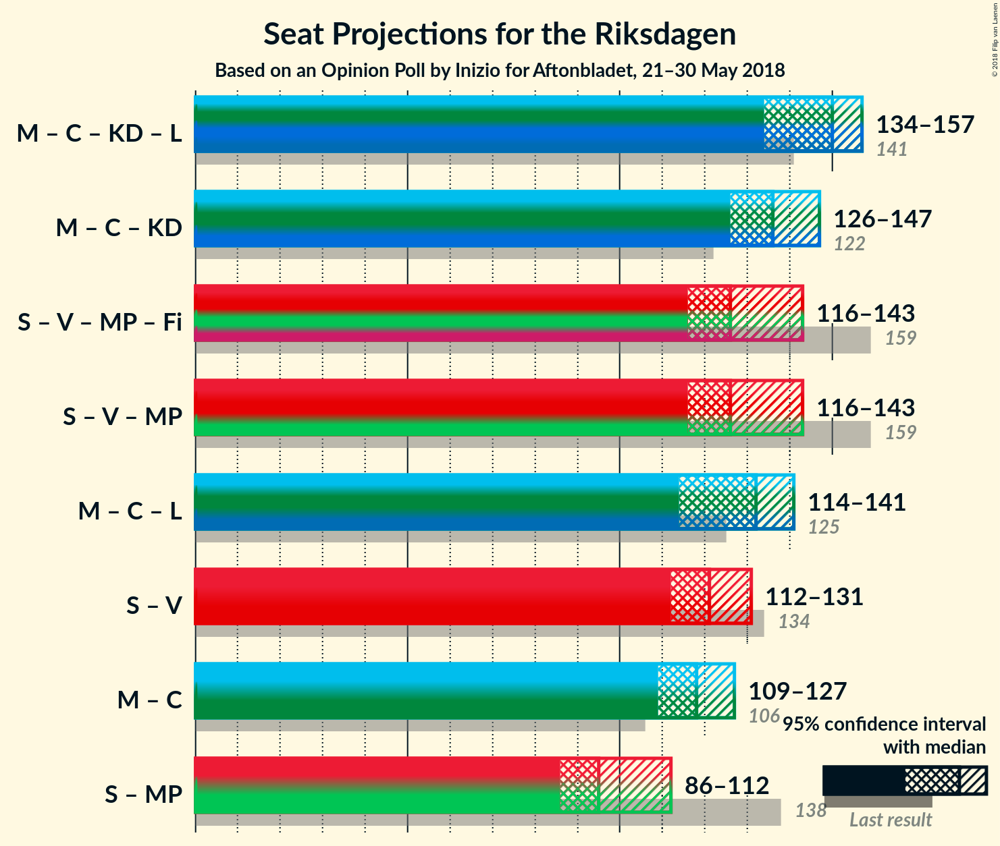

# Opinion Poll by Inizio for Aftonbladet, 21–30 May 2018

<a href="#voting-intentions">Voting Intentions</a> | <a href="#seats">Seats</a> | <a href="#coalitions">Coalitions</a> | <a href="#technical-information">Technical Information</a>

## Voting Intentions

### Confidence Intervals

| Party | Last Result | Poll Result | 80% Confidence Interval | 90% Confidence Interval | 95% Confidence Interval | 99% Confidence Interval |
|:-----:|:-----------:|:-----------:|:-----------------------:|:-----------------------:|:-----------------------:|:-----------------------:|
| Sveriges socialdemokratiska arbetareparti | 31.0% | 24.5% | 23.2–25.8% |22.9–26.1% |22.6–26.5% |22.1–27.0% |
| Moderata samlingspartiet | 23.3% | 22.0% | 20.9–23.2% |20.4–23.6% |20.2–23.9% |19.6–24.4% |
| Sverigedemokraterna | 12.9% | 19.5% | 18.4–20.7% |18.0–21.0% |17.8–21.3% |17.3–21.8% |
| Centerpartiet | 6.1% | 9.5% | 8.6–10.4% |8.5–10.7% |8.2–10.8% |8.0–11.4% |
| Vänsterpartiet | 5.7% | 8.2% | 7.4–9.1% |7.1–9.3% |7.0–9.5% |6.7–9.9% |
| Kristdemokraterna | 4.6% | 4.9% | 4.3–5.6% |4.1–5.8% |4.0–6.0% |3.7–6.3% |
| Folkpartiet liberalerna | 5.4% | 4.3% | 3.7–4.9% |3.6–5.2% |3.4–5.3% |3.2–5.6% |
| Miljöpartiet de gröna | 6.9% | 3.9% | 3.3–4.5% |3.2–4.7% |3.0–4.8% |2.9–5.2% |
| Feministiskt initiativ | 3.1% | 1.5% | 1.1–1.9% |1.1–2.1% |1.0–2.2% |1.0–2.3% |

*Note:* The poll result column reflects the actual value used in the calculations. Published results may vary slightly, and in addition be rounded to fewer digits.

## Seats

### Confidence Intervals

| Party | Last Result | Median | 80% Confidence Interval | 90% Confidence Interval | 95% Confidence Interval | 99% Confidence Interval |
|:-----:|:-----------:|:------:|:-----------------------:|:-----------------------:|:-----------------------:|:-----------------------:|
| <a href="#sveriges-socialdemokratiska-arbetareparti">Sveriges socialdemokratiska arbetareparti</a> | 113 | N/A | N/A |N/A |N/A |N/A |
| <a href="#moderata-samlingspartiet">Moderata samlingspartiet</a> | 84 | N/A | N/A |N/A |N/A |N/A |
| <a href="#sverigedemokraterna">Sverigedemokraterna</a> | 49 | N/A | N/A |N/A |N/A |N/A |
| <a href="#centerpartiet">Centerpartiet</a> | 22 | N/A | N/A |N/A |N/A |N/A |
| <a href="#vänsterpartiet">Vänsterpartiet</a> | 21 | N/A | N/A |N/A |N/A |N/A |
| <a href="#kristdemokraterna">Kristdemokraterna</a> | 16 | N/A | N/A |N/A |N/A |N/A |
| <a href="#folkpartiet-liberalerna">Folkpartiet liberalerna</a> | 19 | N/A | N/A |N/A |N/A |N/A |
| <a href="#miljöpartiet-de-gröna">Miljöpartiet de gröna</a> | 25 | N/A | N/A |N/A |N/A |N/A |
| <a href="#feministiskt-initiativ">Feministiskt initiativ</a> | 0 | N/A | N/A |N/A |N/A |N/A |

## Coalitions

## Technical Information

### Opinion Poll

+ **Polling firm:** Inizio
+ **Commissioner(s):** Aftonbladet
+ **Fieldwork period:** 21–30 May 2018

### Calculations

+ **Sample size:** 2116
+ **Simulations done:** 0
+ **Error estimate:** 100.00%

