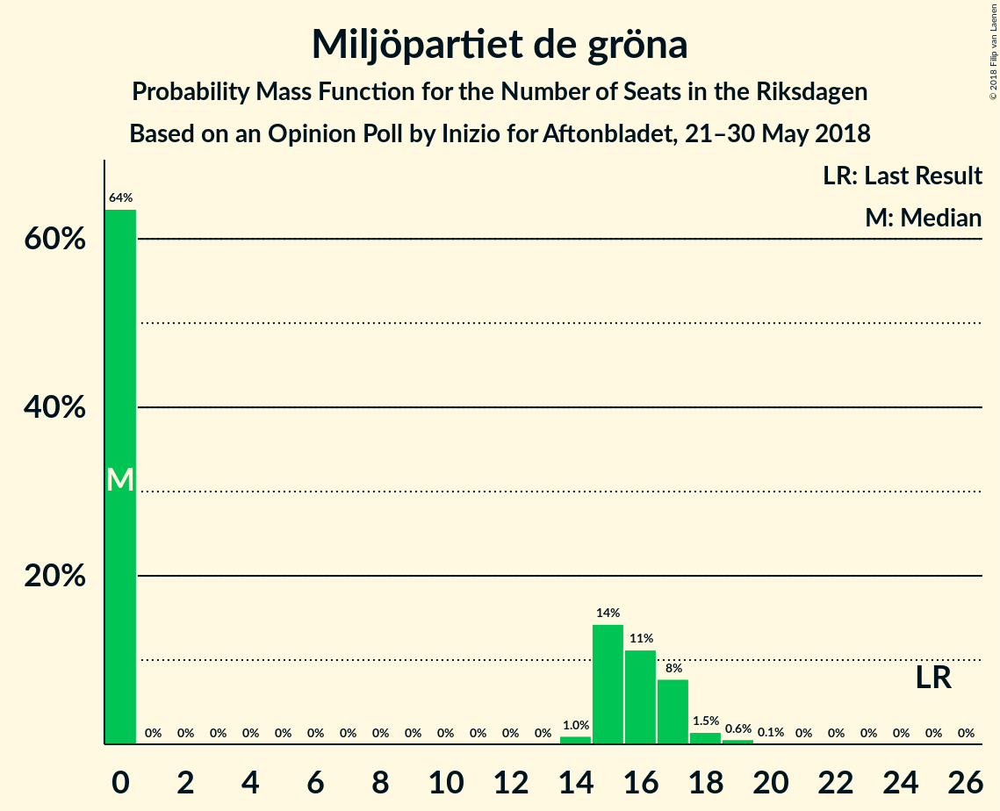

# Opinion Poll by Inizio for Aftonbladet, 21–30 May 2018

<a href="#voting-intentions">Voting Intentions</a> | <a href="#seats">Seats</a> | <a href="#coalitions">Coalitions</a> | <a href="#technical-information">Technical Information</a>

## Voting Intentions

### Confidence Intervals

| Party | Last Result | Poll Result | 80% Confidence Interval | 90% Confidence Interval | 95% Confidence Interval | 99% Confidence Interval |
|:-----:|:-----------:|:-----------:|:-----------------------:|:-----------------------:|:-----------------------:|:-----------------------:|
| Sveriges socialdemokratiska arbetareparti | 31.0% | 24.5% | 23.3–25.7% |23.0–26.1% |22.7–26.4% |22.1–27.0% |
| Moderata samlingspartiet | 23.3% | 22.0% | 20.9–23.2% |20.5–23.5% |20.3–23.8% |19.7–24.4% |
| Sverigedemokraterna | 12.9% | 19.5% | 18.4–20.6% |18.1–20.9% |17.8–21.2% |17.3–21.8% |
| Centerpartiet | 6.1% | 9.5% | 8.7–10.4% |8.5–10.6% |8.3–10.8% |8.0–11.3% |
| Vänsterpartiet | 5.7% | 8.2% | 7.5–9.0% |7.3–9.2% |7.1–9.4% |6.8–9.8% |
| Kristdemokraterna | 4.6% | 4.9% | 4.4–5.6% |4.2–5.8% |4.1–5.9% |3.8–6.3% |
| Liberalerna | 5.4% | 4.3% | 3.8–4.9% |3.6–5.1% |3.5–5.3% |3.3–5.6% |
| Miljöpartiet de gröna | 6.9% | 3.9% | 3.4–4.5% |3.2–4.6% |3.1–4.8% |2.9–5.1% |
| Feministiskt initiativ | 3.1% | 1.5% | 1.2–1.9% |1.1–2.0% |1.1–2.1% |0.9–2.3% |

*Note:* The poll result column reflects the actual value used in the calculations. Published results may vary slightly, and in addition be rounded to fewer digits.

## Seats

### Confidence Intervals

| Party | Last Result | Median | 80% Confidence Interval | 90% Confidence Interval | 95% Confidence Interval | 99% Confidence Interval |
|:-----:|:-----------:|:------:|:-----------------------:|:-----------------------:|:-----------------------:|:-----------------------:|
| <a href="#sveriges-socialdemokratiska-arbetareparti">Sveriges socialdemokratiska arbetareparti</a> | 113 | 89 | 87–96 |86–98 |84–100 |82–104 |
| <a href="#moderata-samlingspartiet">Moderata samlingspartiet</a> | 84 | 79 | 76–84 |76–86 |76–89 |74–94 |
| <a href="#sverigedemokraterna">Sverigedemokraterna</a> | 49 | 72 | 69–76 |66–78 |66–79 |64–82 |
| <a href="#centerpartiet">Centerpartiet</a> | 22 | 36 | 32–39 |31–39 |31–40 |29–43 |
| <a href="#vänsterpartiet">Vänsterpartiet</a> | 21 | 31 | 28–33 |28–34 |27–34 |26–36 |
| <a href="#kristdemokraterna">Kristdemokraterna</a> | 16 | 18 | 16–20 |16–22 |16–22 |0–24 |
| <a href="#liberalerna">Liberalerna</a> | 19 | 17 | 0–18 |0–19 |0–19 |0–20 |
| <a href="#miljöpartiet-de-gröna">Miljöpartiet de gröna</a> | 25 | 0 | 0–16 |0–17 |0–17 |0–18 |
| <a href="#feministiskt-initiativ">Feministiskt initiativ</a> | 0 | 0 | 0 |0 |0 |0 |

### Sveriges socialdemokratiska arbetareparti

*For a full overview of the results for this party, see the [Sveriges socialdemokratiska arbetareparti](party-sverigessocialdemokratiskaarbetareparti.html) page.*

| Number of Seats | Probability | Accumulated | Special Marks |
|:---------------:|:-----------:|:-----------:|:-------------:|
| 79 | 0.1% | 100% |  |
| 80 | 0.1% | 99.9% |  |
| 81 | 0.1% | 99.8% |  |
| 82 | 0.3% | 99.7% |  |
| 83 | 1.2% | 99.4% |  |
| 84 | 0.8% | 98% |  |
| 85 | 2% | 97% |  |
| 86 | 4% | 95% |  |
| 87 | 10% | 92% |  |
| 88 | 2% | 82% |  |
| 89 | 35% | 80% | Median |
| 90 | 10% | 45% |  |
| 91 | 12% | 35% |  |
| 92 | 2% | 22% |  |
| 93 | 4% | 21% |  |
| 94 | 1.2% | 17% |  |
| 95 | 2% | 16% |  |
| 96 | 6% | 14% |  |
| 97 | 3% | 9% |  |
| 98 | 1.4% | 6% |  |
| 99 | 1.0% | 4% |  |
| 100 | 1.3% | 3% |  |
| 101 | 1.1% | 2% |  |
| 102 | 0.3% | 0.9% |  |
| 103 | 0% | 0.6% |  |
| 104 | 0.2% | 0.6% |  |
| 105 | 0.3% | 0.4% |  |
| 106 | 0% | 0% |  |
| 107 | 0% | 0% |  |
| 108 | 0% | 0% |  |
| 109 | 0% | 0% |  |
| 110 | 0% | 0% |  |
| 111 | 0% | 0% |  |
| 112 | 0% | 0% |  |
| 113 | 0% | 0% | Last Result |

### Moderata samlingspartiet

*For a full overview of the results for this party, see the [Moderata samlingspartiet](party-moderatasamlingspartiet.html) page.*

| Number of Seats | Probability | Accumulated | Special Marks |
|:---------------:|:-----------:|:-----------:|:-------------:|
| 69 | 0% | 100% |  |
| 70 | 0.1% | 99.9% |  |
| 71 | 0.1% | 99.9% |  |
| 72 | 0.1% | 99.8% |  |
| 73 | 0.2% | 99.7% |  |
| 74 | 0.7% | 99.5% |  |
| 75 | 0.6% | 98.9% |  |
| 76 | 17% | 98% |  |
| 77 | 5% | 81% |  |
| 78 | 26% | 76% |  |
| 79 | 13% | 50% | Median |
| 80 | 7% | 37% |  |
| 81 | 9% | 30% |  |
| 82 | 6% | 21% |  |
| 83 | 1.3% | 15% |  |
| 84 | 6% | 13% | Last Result |
| 85 | 1.2% | 7% |  |
| 86 | 2% | 6% |  |
| 87 | 0.4% | 4% |  |
| 88 | 0.8% | 4% |  |
| 89 | 0.6% | 3% |  |
| 90 | 0.4% | 2% |  |
| 91 | 0.7% | 2% |  |
| 92 | 0.1% | 1.1% |  |
| 93 | 0.1% | 0.9% |  |
| 94 | 0.4% | 0.8% |  |
| 95 | 0% | 0.4% |  |
| 96 | 0.3% | 0.3% |  |
| 97 | 0% | 0% |  |

### Sverigedemokraterna

*For a full overview of the results for this party, see the [Sverigedemokraterna](party-sverigedemokraterna.html) page.*

| Number of Seats | Probability | Accumulated | Special Marks |
|:---------------:|:-----------:|:-----------:|:-------------:|
| 49 | 0% | 100% | Last Result |
| 50 | 0% | 100% |  |
| 51 | 0% | 100% |  |
| 52 | 0% | 100% |  |
| 53 | 0% | 100% |  |
| 54 | 0% | 100% |  |
| 55 | 0% | 100% |  |
| 56 | 0% | 100% |  |
| 57 | 0% | 100% |  |
| 58 | 0% | 100% |  |
| 59 | 0% | 100% |  |
| 60 | 0% | 100% |  |
| 61 | 0.1% | 100% |  |
| 62 | 0.1% | 99.9% |  |
| 63 | 0.1% | 99.8% |  |
| 64 | 1.1% | 99.7% |  |
| 65 | 0.5% | 98.6% |  |
| 66 | 3% | 98% |  |
| 67 | 2% | 95% |  |
| 68 | 1.3% | 93% |  |
| 69 | 15% | 91% |  |
| 70 | 11% | 76% |  |
| 71 | 5% | 65% |  |
| 72 | 11% | 60% | Median |
| 73 | 5% | 48% |  |
| 74 | 2% | 44% |  |
| 75 | 23% | 42% |  |
| 76 | 11% | 19% |  |
| 77 | 3% | 8% |  |
| 78 | 0.8% | 5% |  |
| 79 | 2% | 4% |  |
| 80 | 2% | 2% |  |
| 81 | 0.1% | 0.7% |  |
| 82 | 0.4% | 0.6% |  |
| 83 | 0.1% | 0.2% |  |
| 84 | 0.1% | 0.2% |  |
| 85 | 0% | 0.1% |  |
| 86 | 0.1% | 0.1% |  |
| 87 | 0% | 0% |  |

### Centerpartiet

*For a full overview of the results for this party, see the [Centerpartiet](party-centerpartiet.html) page.*

| Number of Seats | Probability | Accumulated | Special Marks |
|:---------------:|:-----------:|:-----------:|:-------------:|
| 22 | 0% | 100% | Last Result |
| 23 | 0% | 100% |  |
| 24 | 0% | 100% |  |
| 25 | 0% | 100% |  |
| 26 | 0% | 100% |  |
| 27 | 0% | 100% |  |
| 28 | 0% | 100% |  |
| 29 | 0.7% | 99.9% |  |
| 30 | 1.0% | 99.3% |  |
| 31 | 7% | 98% |  |
| 32 | 3% | 91% |  |
| 33 | 4% | 89% |  |
| 34 | 7% | 84% |  |
| 35 | 25% | 77% |  |
| 36 | 7% | 52% | Median |
| 37 | 6% | 45% |  |
| 38 | 23% | 39% |  |
| 39 | 12% | 16% |  |
| 40 | 2% | 4% |  |
| 41 | 0.6% | 2% |  |
| 42 | 0.4% | 1.2% |  |
| 43 | 0.6% | 0.7% |  |
| 44 | 0% | 0.1% |  |
| 45 | 0% | 0% |  |

### Vänsterpartiet

*For a full overview of the results for this party, see the [Vänsterpartiet](party-vänsterpartiet.html) page.*

| Number of Seats | Probability | Accumulated | Special Marks |
|:---------------:|:-----------:|:-----------:|:-------------:|
| 21 | 0% | 100% | Last Result |
| 22 | 0% | 100% |  |
| 23 | 0.1% | 100% |  |
| 24 | 0.1% | 99.9% |  |
| 25 | 0.2% | 99.8% |  |
| 26 | 2% | 99.6% |  |
| 27 | 2% | 98% |  |
| 28 | 6% | 95% |  |
| 29 | 20% | 89% |  |
| 30 | 12% | 69% |  |
| 31 | 8% | 57% | Median |
| 32 | 28% | 49% |  |
| 33 | 14% | 21% |  |
| 34 | 4% | 6% |  |
| 35 | 1.3% | 2% |  |
| 36 | 0.6% | 1.1% |  |
| 37 | 0.3% | 0.5% |  |
| 38 | 0.1% | 0.2% |  |
| 39 | 0.1% | 0.1% |  |
| 40 | 0% | 0% |  |

### Kristdemokraterna

*For a full overview of the results for this party, see the [Kristdemokraterna](party-kristdemokraterna.html) page.*

| Number of Seats | Probability | Accumulated | Special Marks |
|:---------------:|:-----------:|:-----------:|:-------------:|
| 0 | 1.1% | 100% |  |
| 1 | 0% | 98.9% |  |
| 2 | 0% | 98.9% |  |
| 3 | 0% | 98.9% |  |
| 4 | 0% | 98.9% |  |
| 5 | 0% | 98.9% |  |
| 6 | 0% | 98.9% |  |
| 7 | 0% | 98.9% |  |
| 8 | 0% | 98.9% |  |
| 9 | 0% | 98.9% |  |
| 10 | 0% | 98.9% |  |
| 11 | 0% | 98.9% |  |
| 12 | 0% | 98.9% |  |
| 13 | 0% | 98.9% |  |
| 14 | 0% | 98.9% |  |
| 15 | 1.3% | 98.9% |  |
| 16 | 9% | 98% | Last Result |
| 17 | 7% | 88% |  |
| 18 | 37% | 81% | Median |
| 19 | 5% | 44% |  |
| 20 | 32% | 39% |  |
| 21 | 1.4% | 7% |  |
| 22 | 4% | 6% |  |
| 23 | 0.7% | 1.3% |  |
| 24 | 0.6% | 0.7% |  |
| 25 | 0% | 0% |  |

### Liberalerna

*For a full overview of the results for this party, see the [Liberalerna](party-liberalerna.html) page.*

| Number of Seats | Probability | Accumulated | Special Marks |
|:---------------:|:-----------:|:-----------:|:-------------:|
| 0 | 13% | 100% |  |
| 1 | 0% | 87% |  |
| 2 | 0% | 87% |  |
| 3 | 0% | 87% |  |
| 4 | 0% | 87% |  |
| 5 | 0% | 87% |  |
| 6 | 0% | 87% |  |
| 7 | 0% | 87% |  |
| 8 | 0% | 87% |  |
| 9 | 0% | 87% |  |
| 10 | 0% | 87% |  |
| 11 | 0% | 87% |  |
| 12 | 0% | 87% |  |
| 13 | 0% | 87% |  |
| 14 | 0.2% | 87% |  |
| 15 | 7% | 87% |  |
| 16 | 17% | 80% |  |
| 17 | 48% | 63% | Median |
| 18 | 6% | 15% |  |
| 19 | 8% | 10% | Last Result |
| 20 | 2% | 2% |  |
| 21 | 0.1% | 0.2% |  |
| 22 | 0.1% | 0.1% |  |
| 23 | 0% | 0% |  |

### Miljöpartiet de gröna

*For a full overview of the results for this party, see the [Miljöpartiet de gröna](party-miljöpartietdegröna.html) page.*

| Number of Seats | Probability | Accumulated | Special Marks |
|:---------------:|:-----------:|:-----------:|:-------------:|
| 0 | 60% | 100% | Median |
| 1 | 0% | 40% |  |
| 2 | 0% | 40% |  |
| 3 | 0% | 40% |  |
| 4 | 0% | 40% |  |
| 5 | 0% | 40% |  |
| 6 | 0% | 40% |  |
| 7 | 0% | 40% |  |
| 8 | 0% | 40% |  |
| 9 | 0% | 40% |  |
| 10 | 0% | 40% |  |
| 11 | 0% | 40% |  |
| 12 | 0% | 40% |  |
| 13 | 0% | 40% |  |
| 14 | 0.4% | 40% |  |
| 15 | 9% | 40% |  |
| 16 | 26% | 31% |  |
| 17 | 4% | 5% |  |
| 18 | 1.0% | 1.4% |  |
| 19 | 0.2% | 0.3% |  |
| 20 | 0.1% | 0.1% |  |
| 21 | 0% | 0% |  |
| 22 | 0% | 0% |  |
| 23 | 0% | 0% |  |
| 24 | 0% | 0% |  |
| 25 | 0% | 0% | Last Result |

### Feministiskt initiativ

*For a full overview of the results for this party, see the [Feministiskt initiativ](party-feministisktinitiativ.html) page.*

| Number of Seats | Probability | Accumulated | Special Marks |
|:---------------:|:-----------:|:-----------:|:-------------:|
| 0 | 100% | 100% | Last Result, Median |

## Coalitions

### Confidence Intervals

| Coalition | Last Result | Median | Majority? | 80% Confidence Interval | 90% Confidence Interval | 95% Confidence Interval | 99% Confidence Interval |
|:---------:|:-----------:|:------:|:---------:|:-----------------------:|:-----------------------:|:-----------------------:|:-----------------------:|
| Moderata samlingspartiet – Centerpartiet – Kristdemokraterna – Liberalerna | 141 | 150 | 0% | 142–153 | 136–155 | 136–156 | 129–162 |
| Moderata samlingspartiet – Centerpartiet – Kristdemokraterna | 122 | 135 | 0% | 129–139 | 128–142 | 128–147 | 119–152 |
| Sveriges socialdemokratiska arbetareparti – Vänsterpartiet – Miljöpartiet de gröna – Feministiskt initiativ | 159 | 127 | 0% | 120–136 | 119–141 | 118–143 | 115–148 |
| Sveriges socialdemokratiska arbetareparti – Vänsterpartiet – Miljöpartiet de gröna | 159 | 127 | 0% | 120–136 | 119–141 | 118–143 | 115–148 |
| Moderata samlingspartiet – Centerpartiet – Liberalerna | 125 | 132 | 0% | 124–135 | 118–137 | 116–138 | 112–143 |
| Sveriges socialdemokratiska arbetareparti – Vänsterpartiet | 134 | 121 | 0% | 116–128 | 115–129 | 114–131 | 110–136 |
| Moderata samlingspartiet – Centerpartiet | 106 | 116 | 0% | 111–119 | 111–124 | 111–126 | 108–133 |

### Moderata samlingspartiet – Centerpartiet – Kristdemokraterna – Liberalerna

| Number of Seats | Probability | Accumulated | Special Marks |
|:---------------:|:-----------:|:-----------:|:-------------:|
| 125 | 0% | 100% |  |
| 126 | 0% | 99.9% |  |
| 127 | 0% | 99.9% |  |
| 128 | 0% | 99.9% |  |
| 129 | 0.5% | 99.9% |  |
| 130 | 0.5% | 99.4% |  |
| 131 | 0.1% | 98.9% |  |
| 132 | 0% | 98.9% |  |
| 133 | 0.1% | 98.9% |  |
| 134 | 0.7% | 98.8% |  |
| 135 | 0.1% | 98% |  |
| 136 | 3% | 98% |  |
| 137 | 0.4% | 95% |  |
| 138 | 0.3% | 94% |  |
| 139 | 0.6% | 94% |  |
| 140 | 0.8% | 93% |  |
| 141 | 3% | 93% | Last Result |
| 142 | 1.2% | 90% |  |
| 143 | 0.8% | 89% |  |
| 144 | 5% | 88% |  |
| 145 | 3% | 83% |  |
| 146 | 19% | 80% |  |
| 147 | 4% | 61% |  |
| 148 | 1.0% | 57% |  |
| 149 | 5% | 56% |  |
| 150 | 2% | 51% | Median |
| 151 | 1.2% | 49% |  |
| 152 | 4% | 48% |  |
| 153 | 36% | 43% |  |
| 154 | 1.5% | 8% |  |
| 155 | 2% | 6% |  |
| 156 | 3% | 5% |  |
| 157 | 0.9% | 2% |  |
| 158 | 0.1% | 1.1% |  |
| 159 | 0.1% | 1.0% |  |
| 160 | 0.2% | 1.0% |  |
| 161 | 0.2% | 0.8% |  |
| 162 | 0.3% | 0.7% |  |
| 163 | 0.2% | 0.4% |  |
| 164 | 0.1% | 0.2% |  |
| 165 | 0% | 0% |  |

### Moderata samlingspartiet – Centerpartiet – Kristdemokraterna

| Number of Seats | Probability | Accumulated | Special Marks |
|:---------------:|:-----------:|:-----------:|:-------------:|
| 116 | 0% | 100% |  |
| 117 | 0% | 99.9% |  |
| 118 | 0.2% | 99.9% |  |
| 119 | 0.2% | 99.7% |  |
| 120 | 0.1% | 99.5% |  |
| 121 | 0% | 99.4% |  |
| 122 | 0.2% | 99.4% | Last Result |
| 123 | 0.1% | 99.2% |  |
| 124 | 0.7% | 99.0% |  |
| 125 | 0.1% | 98% |  |
| 126 | 0.4% | 98% |  |
| 127 | 0.1% | 98% |  |
| 128 | 4% | 98% |  |
| 129 | 21% | 94% |  |
| 130 | 6% | 74% |  |
| 131 | 0.5% | 67% |  |
| 132 | 0.8% | 67% |  |
| 133 | 6% | 66% | Median |
| 134 | 8% | 60% |  |
| 135 | 3% | 51% |  |
| 136 | 34% | 48% |  |
| 137 | 2% | 14% |  |
| 138 | 0.4% | 12% |  |
| 139 | 2% | 11% |  |
| 140 | 0.7% | 10% |  |
| 141 | 4% | 9% |  |
| 142 | 1.2% | 5% |  |
| 143 | 0.4% | 4% |  |
| 144 | 0.3% | 4% |  |
| 145 | 0.2% | 3% |  |
| 146 | 0.4% | 3% |  |
| 147 | 1.0% | 3% |  |
| 148 | 0.8% | 2% |  |
| 149 | 0.2% | 0.8% |  |
| 150 | 0% | 0.5% |  |
| 151 | 0% | 0.5% |  |
| 152 | 0% | 0.5% |  |
| 153 | 0% | 0.5% |  |
| 154 | 0.2% | 0.5% |  |
| 155 | 0.3% | 0.3% |  |
| 156 | 0% | 0% |  |

### Sveriges socialdemokratiska arbetareparti – Vänsterpartiet – Miljöpartiet de gröna – Feministiskt initiativ

| Number of Seats | Probability | Accumulated | Special Marks |
|:---------------:|:-----------:|:-----------:|:-------------:|
| 110 | 0% | 100% |  |
| 111 | 0% | 99.9% |  |
| 112 | 0.1% | 99.9% |  |
| 113 | 0.1% | 99.8% |  |
| 114 | 0.1% | 99.7% |  |
| 115 | 0.3% | 99.6% |  |
| 116 | 0.1% | 99.3% |  |
| 117 | 1.1% | 99.2% |  |
| 118 | 3% | 98% |  |
| 119 | 2% | 95% |  |
| 120 | 5% | 94% | Median |
| 121 | 22% | 89% |  |
| 122 | 1.0% | 67% |  |
| 123 | 0.9% | 66% |  |
| 124 | 12% | 65% |  |
| 125 | 1.1% | 53% |  |
| 126 | 1.3% | 52% |  |
| 127 | 1.2% | 51% |  |
| 128 | 4% | 50% |  |
| 129 | 4% | 46% |  |
| 130 | 6% | 42% |  |
| 131 | 3% | 37% |  |
| 132 | 5% | 34% |  |
| 133 | 0.6% | 28% |  |
| 134 | 14% | 28% |  |
| 135 | 1.3% | 14% |  |
| 136 | 4% | 13% |  |
| 137 | 0.2% | 9% |  |
| 138 | 2% | 9% |  |
| 139 | 0.3% | 7% |  |
| 140 | 1.1% | 7% |  |
| 141 | 1.3% | 5% |  |
| 142 | 0.4% | 4% |  |
| 143 | 3% | 4% |  |
| 144 | 0.1% | 1.0% |  |
| 145 | 0.2% | 0.9% |  |
| 146 | 0.2% | 0.7% |  |
| 147 | 0% | 0.5% |  |
| 148 | 0% | 0.5% |  |
| 149 | 0.5% | 0.5% |  |
| 150 | 0% | 0% |  |
| 151 | 0% | 0% |  |
| 152 | 0% | 0% |  |
| 153 | 0% | 0% |  |
| 154 | 0% | 0% |  |
| 155 | 0% | 0% |  |
| 156 | 0% | 0% |  |
| 157 | 0% | 0% |  |
| 158 | 0% | 0% |  |
| 159 | 0% | 0% | Last Result |

### Sveriges socialdemokratiska arbetareparti – Vänsterpartiet – Miljöpartiet de gröna

| Number of Seats | Probability | Accumulated | Special Marks |
|:---------------:|:-----------:|:-----------:|:-------------:|
| 110 | 0% | 100% |  |
| 111 | 0% | 99.9% |  |
| 112 | 0.1% | 99.9% |  |
| 113 | 0.1% | 99.8% |  |
| 114 | 0.1% | 99.7% |  |
| 115 | 0.3% | 99.6% |  |
| 116 | 0.1% | 99.3% |  |
| 117 | 1.1% | 99.2% |  |
| 118 | 3% | 98% |  |
| 119 | 2% | 95% |  |
| 120 | 5% | 94% | Median |
| 121 | 22% | 89% |  |
| 122 | 1.0% | 67% |  |
| 123 | 0.9% | 66% |  |
| 124 | 12% | 65% |  |
| 125 | 1.1% | 53% |  |
| 126 | 1.3% | 52% |  |
| 127 | 1.2% | 51% |  |
| 128 | 4% | 50% |  |
| 129 | 4% | 46% |  |
| 130 | 6% | 42% |  |
| 131 | 3% | 37% |  |
| 132 | 5% | 34% |  |
| 133 | 0.6% | 28% |  |
| 134 | 14% | 28% |  |
| 135 | 1.3% | 14% |  |
| 136 | 4% | 13% |  |
| 137 | 0.2% | 9% |  |
| 138 | 2% | 9% |  |
| 139 | 0.3% | 7% |  |
| 140 | 1.1% | 7% |  |
| 141 | 1.3% | 5% |  |
| 142 | 0.4% | 4% |  |
| 143 | 3% | 4% |  |
| 144 | 0.1% | 1.0% |  |
| 145 | 0.2% | 0.9% |  |
| 146 | 0.2% | 0.7% |  |
| 147 | 0% | 0.5% |  |
| 148 | 0% | 0.5% |  |
| 149 | 0.5% | 0.5% |  |
| 150 | 0% | 0% |  |
| 151 | 0% | 0% |  |
| 152 | 0% | 0% |  |
| 153 | 0% | 0% |  |
| 154 | 0% | 0% |  |
| 155 | 0% | 0% |  |
| 156 | 0% | 0% |  |
| 157 | 0% | 0% |  |
| 158 | 0% | 0% |  |
| 159 | 0% | 0% | Last Result |

### Moderata samlingspartiet – Centerpartiet – Liberalerna

| Number of Seats | Probability | Accumulated | Special Marks |
|:---------------:|:-----------:|:-----------:|:-------------:|
| 109 | 0.2% | 100% |  |
| 110 | 0% | 99.8% |  |
| 111 | 0% | 99.8% |  |
| 112 | 0.4% | 99.7% |  |
| 113 | 0% | 99.3% |  |
| 114 | 0.4% | 99.3% |  |
| 115 | 0.1% | 98.9% |  |
| 116 | 3% | 98.8% |  |
| 117 | 0.6% | 96% |  |
| 118 | 0.7% | 95% |  |
| 119 | 1.1% | 94% |  |
| 120 | 0.3% | 93% |  |
| 121 | 1.4% | 93% |  |
| 122 | 0.3% | 92% |  |
| 123 | 0.4% | 91% |  |
| 124 | 1.2% | 91% |  |
| 125 | 0.8% | 90% | Last Result |
| 126 | 2% | 89% |  |
| 127 | 5% | 87% |  |
| 128 | 18% | 82% |  |
| 129 | 6% | 64% |  |
| 130 | 2% | 57% |  |
| 131 | 4% | 55% |  |
| 132 | 3% | 51% | Median |
| 133 | 25% | 48% |  |
| 134 | 2% | 23% |  |
| 135 | 15% | 21% |  |
| 136 | 1.2% | 6% |  |
| 137 | 1.2% | 5% |  |
| 138 | 2% | 4% |  |
| 139 | 0.6% | 2% |  |
| 140 | 0.1% | 1.4% |  |
| 141 | 0.3% | 1.3% |  |
| 142 | 0.1% | 1.0% |  |
| 143 | 0.5% | 0.9% |  |
| 144 | 0.1% | 0.4% |  |
| 145 | 0.1% | 0.3% |  |
| 146 | 0.1% | 0.2% |  |
| 147 | 0.1% | 0.2% |  |
| 148 | 0.1% | 0.1% |  |
| 149 | 0% | 0% |  |

### Sveriges socialdemokratiska arbetareparti – Vänsterpartiet

| Number of Seats | Probability | Accumulated | Special Marks |
|:---------------:|:-----------:|:-----------:|:-------------:|
| 107 | 0.1% | 100% |  |
| 108 | 0.1% | 99.9% |  |
| 109 | 0% | 99.9% |  |
| 110 | 0.4% | 99.9% |  |
| 111 | 0.5% | 99.5% |  |
| 112 | 0.5% | 99.0% |  |
| 113 | 0.6% | 98% |  |
| 114 | 2% | 98% |  |
| 115 | 5% | 96% |  |
| 116 | 4% | 91% |  |
| 117 | 2% | 87% |  |
| 118 | 17% | 85% |  |
| 119 | 2% | 68% |  |
| 120 | 9% | 66% | Median |
| 121 | 23% | 57% |  |
| 122 | 1.3% | 34% |  |
| 123 | 2% | 33% |  |
| 124 | 14% | 31% |  |
| 125 | 1.1% | 18% |  |
| 126 | 2% | 16% |  |
| 127 | 3% | 15% |  |
| 128 | 4% | 11% |  |
| 129 | 3% | 8% |  |
| 130 | 0.6% | 5% |  |
| 131 | 2% | 4% |  |
| 132 | 0.8% | 2% |  |
| 133 | 0.1% | 1.2% |  |
| 134 | 0.5% | 1.1% | Last Result |
| 135 | 0.1% | 0.6% |  |
| 136 | 0.1% | 0.5% |  |
| 137 | 0% | 0.4% |  |
| 138 | 0.4% | 0.4% |  |
| 139 | 0% | 0% |  |

### Moderata samlingspartiet – Centerpartiet

| Number of Seats | Probability | Accumulated | Special Marks |
|:---------------:|:-----------:|:-----------:|:-------------:|
| 102 | 0.1% | 100% |  |
| 103 | 0% | 99.9% |  |
| 104 | 0.2% | 99.9% |  |
| 105 | 0% | 99.7% |  |
| 106 | 0.1% | 99.7% | Last Result |
| 107 | 0% | 99.6% |  |
| 108 | 0.5% | 99.6% |  |
| 109 | 0.9% | 99.1% |  |
| 110 | 0.7% | 98% |  |
| 111 | 16% | 98% |  |
| 112 | 7% | 81% |  |
| 113 | 9% | 74% |  |
| 114 | 4% | 65% |  |
| 115 | 3% | 61% | Median |
| 116 | 30% | 58% |  |
| 117 | 3% | 28% |  |
| 118 | 12% | 25% |  |
| 119 | 4% | 13% |  |
| 120 | 0.6% | 8% |  |
| 121 | 2% | 8% |  |
| 122 | 0.5% | 6% |  |
| 123 | 0.3% | 6% |  |
| 124 | 0.6% | 5% |  |
| 125 | 0.4% | 5% |  |
| 126 | 2% | 4% |  |
| 127 | 0.2% | 2% |  |
| 128 | 0.5% | 2% |  |
| 129 | 0.4% | 2% |  |
| 130 | 0.2% | 1.1% |  |
| 131 | 0.4% | 0.9% |  |
| 132 | 0% | 0.5% |  |
| 133 | 0.2% | 0.5% |  |
| 134 | 0% | 0.3% |  |
| 135 | 0% | 0.3% |  |
| 136 | 0% | 0.3% |  |
| 137 | 0.3% | 0.3% |  |
| 138 | 0% | 0% |  |

## Technical Information

### Opinion Poll

+ **Polling firm:** Inizio
+ **Commissioner(s):** Aftonbladet
+ **Fieldwork period:** 21–30 May 2018

### Calculations

+ **Sample size:** 2116
+ **Simulations done:** 262,144
+ **Error estimate:** 0.85%

