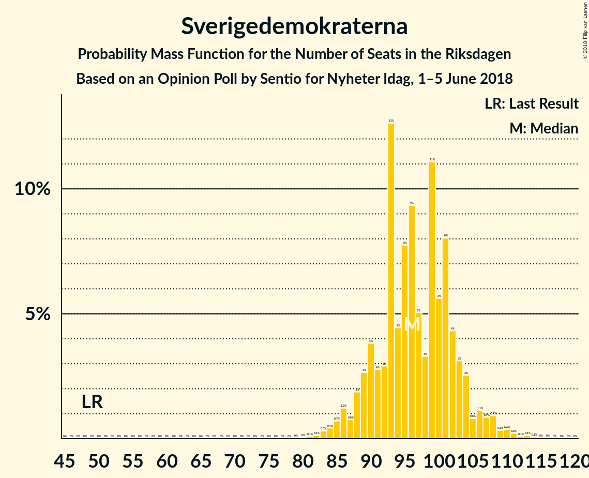
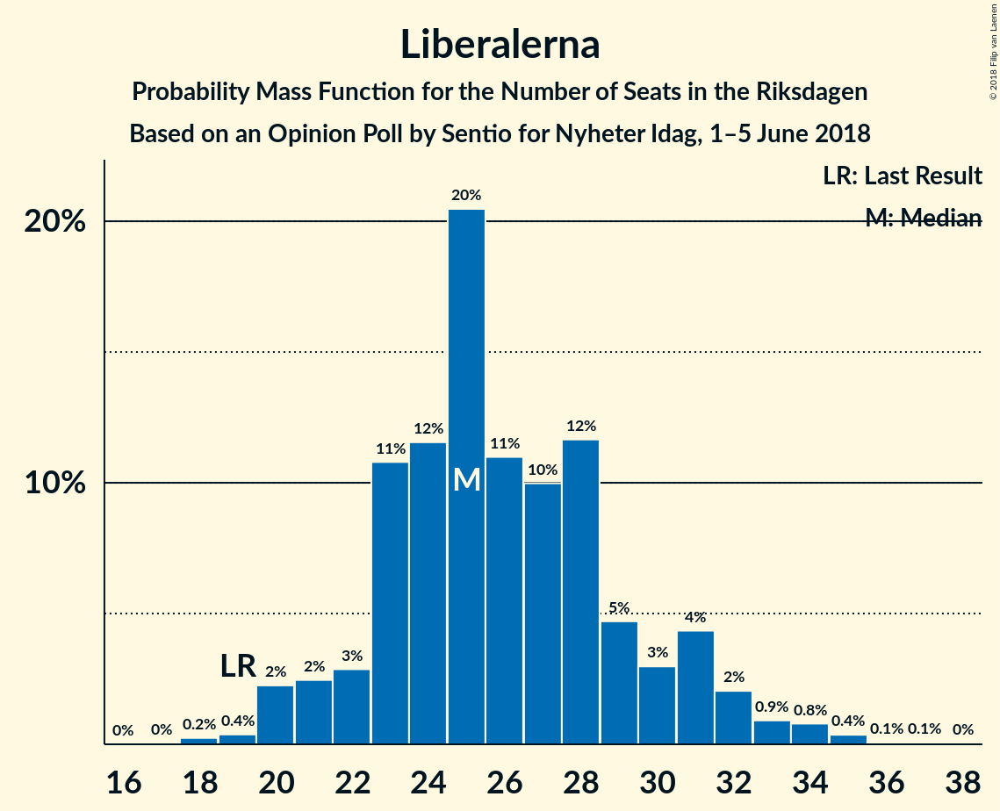
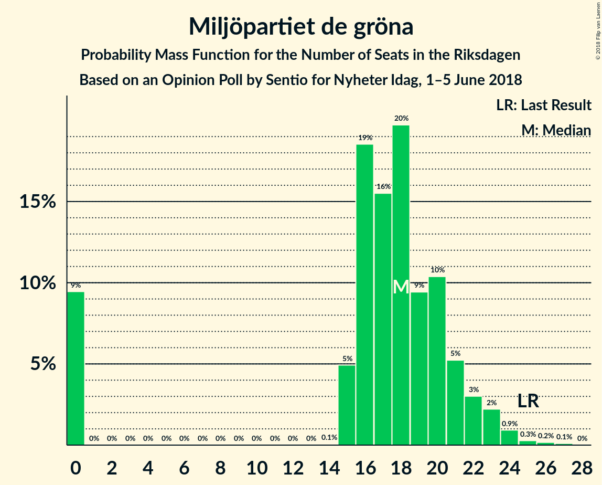

# Opinion Poll by Sentio for Nyheter Idag, 1–5 June 2018

<a href="#voting-intentions">Voting Intentions</a> | <a href="#seats">Seats</a> | <a href="#coalitions">Coalitions</a> | <a href="#technical-information">Technical Information</a>

## Voting Intentions

### Confidence Intervals

| Party | Last Result | Poll Result | 80% Confidence Interval | 90% Confidence Interval | 95% Confidence Interval | 99% Confidence Interval |
|:-----:|:-----------:|:-----------:|:-----------------------:|:-----------------------:|:-----------------------:|:-----------------------:|
| Sverigedemokraterna | 12.9% | 26.1% | 24.4–27.9% |23.9–28.5% |23.5–28.9% |22.7–29.8% |
| Sveriges socialdemokratiska arbetareparti | 31.0% | 21.7% | 20.1–23.5% |19.7–23.9% |19.3–24.4% |18.5–25.2% |
| Moderata samlingspartiet | 23.3% | 17.1% | 15.7–18.7% |15.3–19.2% |14.9–19.6% |14.3–20.4% |
| Vänsterpartiet | 5.7% | 9.7% | 8.6–11.0% |8.2–11.3% |8.0–11.7% |7.5–12.3% |
| Centerpartiet | 6.1% | 7.2% | 6.2–8.3% |6.0–8.7% |5.7–8.9% |5.3–9.5% |
| Liberalerna | 5.4% | 7.0% | 6.0–8.1% |5.8–8.4% |5.5–8.7% |5.1–9.3% |
| Miljöpartiet de gröna | 6.9% | 4.8% | 4.0–5.8% |3.8–6.0% |3.6–6.3% |3.3–6.8% |
| Kristdemokraterna | 4.6% | 3.3% | 2.7–4.1% |2.5–4.4% |2.3–4.6% |2.1–5.0% |
| Feministiskt initiativ | 3.1% | 0.6% | 0.4–1.1% |0.3–1.2% |0.3–1.3% |0.2–1.6% |

*Note:* The poll result column reflects the actual value used in the calculations. Published results may vary slightly, and in addition be rounded to fewer digits.

## Seats

### Confidence Intervals

| Party | Last Result | Median | 80% Confidence Interval | 90% Confidence Interval | 95% Confidence Interval | 99% Confidence Interval |
|:-----:|:-----------:|:------:|:-----------------------:|:-----------------------:|:-----------------------:|:-----------------------:|
| <a href="#sverigedemokraterna">Sverigedemokraterna</a> | 49 | 101 | 91–101 |91–101 |88–101 |85–107 |
| <a href="#sveriges-socialdemokratiska-arbetareparti">Sveriges socialdemokratiska arbetareparti</a> | 113 | 83 | 80–83 |80–83 |79–85 |74–88 |
| <a href="#moderata-samlingspartiet">Moderata samlingspartiet</a> | 84 | 65 | 64–66 |55–68 |54–69 |54–76 |
| <a href="#vänsterpartiet">Vänsterpartiet</a> | 21 | 36 | 34–37 |33–40 |32–42 |28–46 |
| <a href="#centerpartiet">Centerpartiet</a> | 22 | 23 | 23–31 |22–33 |21–33 |20–35 |
| <a href="#liberalerna">Liberalerna</a> | 19 | 24 | 24–27 |24–28 |23–29 |21–33 |
| <a href="#miljöpartiet-de-gröna">Miljöpartiet de gröna</a> | 25 | 17 | 16–18 |16–21 |0–24 |0–24 |
| <a href="#kristdemokraterna">Kristdemokraterna</a> | 16 | 0 | 0 |0–14 |0–15 |0–18 |
| <a href="#feministiskt-initiativ">Feministiskt initiativ</a> | 0 | 0 | 0 |0 |0 |0 |

### Sverigedemokraterna

*For a full overview of the results for this party, see the [Sverigedemokraterna](party-sverigedemokraterna.html) page.*

| Number of Seats | Probability | Accumulated | Special Marks |
|:---------------:|:-----------:|:-----------:|:-------------:|
| 49 | 0% | 100% | Last Result |
| 50 | 0% | 100% |  |
| 51 | 0% | 100% |  |
| 52 | 0% | 100% |  |
| 53 | 0% | 100% |  |
| 54 | 0% | 100% |  |
| 55 | 0% | 100% |  |
| 56 | 0% | 100% |  |
| 57 | 0% | 100% |  |
| 58 | 0% | 100% |  |
| 59 | 0% | 100% |  |
| 60 | 0% | 100% |  |
| 61 | 0% | 100% |  |
| 62 | 0% | 100% |  |
| 63 | 0% | 100% |  |
| 64 | 0% | 100% |  |
| 65 | 0% | 100% |  |
| 66 | 0% | 100% |  |
| 67 | 0% | 100% |  |
| 68 | 0% | 100% |  |
| 69 | 0% | 100% |  |
| 70 | 0% | 100% |  |
| 71 | 0% | 100% |  |
| 72 | 0% | 100% |  |
| 73 | 0% | 100% |  |
| 74 | 0% | 100% |  |
| 75 | 0% | 100% |  |
| 76 | 0% | 100% |  |
| 77 | 0% | 100% |  |
| 78 | 0% | 100% |  |
| 79 | 0% | 100% |  |
| 80 | 0.1% | 100% |  |
| 81 | 0% | 99.9% |  |
| 82 | 0.2% | 99.9% |  |
| 83 | 0% | 99.7% |  |
| 84 | 0.1% | 99.7% |  |
| 85 | 0.7% | 99.6% |  |
| 86 | 0.1% | 98.9% |  |
| 87 | 0.1% | 98.8% |  |
| 88 | 1.4% | 98.8% |  |
| 89 | 2% | 97% |  |
| 90 | 0.2% | 96% |  |
| 91 | 9% | 95% |  |
| 92 | 2% | 86% |  |
| 93 | 1.3% | 84% |  |
| 94 | 2% | 83% |  |
| 95 | 0.9% | 81% |  |
| 96 | 5% | 80% |  |
| 97 | 0.7% | 75% |  |
| 98 | 0.2% | 75% |  |
| 99 | 6% | 74% |  |
| 100 | 1.3% | 68% |  |
| 101 | 65% | 67% | Median |
| 102 | 0% | 2% |  |
| 103 | 0.2% | 1.5% |  |
| 104 | 0.2% | 1.3% |  |
| 105 | 0.1% | 1.1% |  |
| 106 | 0.2% | 1.0% |  |
| 107 | 0.6% | 0.8% |  |
| 108 | 0% | 0.2% |  |
| 109 | 0% | 0.1% |  |
| 110 | 0% | 0.1% |  |
| 111 | 0% | 0.1% |  |
| 112 | 0% | 0.1% |  |
| 113 | 0% | 0.1% |  |
| 114 | 0% | 0.1% |  |
| 115 | 0% | 0.1% |  |
| 116 | 0% | 0.1% |  |
| 117 | 0% | 0% |  |

### Sveriges socialdemokratiska arbetareparti

*For a full overview of the results for this party, see the [Sveriges socialdemokratiska arbetareparti](party-sverigessocialdemokratiskaarbetareparti.html) page.*

| Number of Seats | Probability | Accumulated | Special Marks |
|:---------------:|:-----------:|:-----------:|:-------------:|
| 66 | 0.1% | 100% |  |
| 67 | 0% | 99.9% |  |
| 68 | 0.1% | 99.9% |  |
| 69 | 0.2% | 99.8% |  |
| 70 | 0% | 99.6% |  |
| 71 | 0% | 99.6% |  |
| 72 | 0% | 99.6% |  |
| 73 | 0% | 99.5% |  |
| 74 | 0.1% | 99.5% |  |
| 75 | 0% | 99.5% |  |
| 76 | 0.2% | 99.4% |  |
| 77 | 0.2% | 99.2% |  |
| 78 | 1.3% | 99.0% |  |
| 79 | 0.9% | 98% |  |
| 80 | 13% | 97% |  |
| 81 | 8% | 84% |  |
| 82 | 4% | 76% |  |
| 83 | 69% | 72% | Median |
| 84 | 0.1% | 3% |  |
| 85 | 0.4% | 3% |  |
| 86 | 2% | 2% |  |
| 87 | 0.1% | 0.7% |  |
| 88 | 0.1% | 0.6% |  |
| 89 | 0.3% | 0.5% |  |
| 90 | 0% | 0.2% |  |
| 91 | 0.1% | 0.2% |  |
| 92 | 0% | 0% |  |
| 93 | 0% | 0% |  |
| 94 | 0% | 0% |  |
| 95 | 0% | 0% |  |
| 96 | 0% | 0% |  |
| 97 | 0% | 0% |  |
| 98 | 0% | 0% |  |
| 99 | 0% | 0% |  |
| 100 | 0% | 0% |  |
| 101 | 0% | 0% |  |
| 102 | 0% | 0% |  |
| 103 | 0% | 0% |  |
| 104 | 0% | 0% |  |
| 105 | 0% | 0% |  |
| 106 | 0% | 0% |  |
| 107 | 0% | 0% |  |
| 108 | 0% | 0% |  |
| 109 | 0% | 0% |  |
| 110 | 0% | 0% |  |
| 111 | 0% | 0% |  |
| 112 | 0% | 0% |  |
| 113 | 0% | 0% | Last Result |

### Moderata samlingspartiet

*For a full overview of the results for this party, see the [Moderata samlingspartiet](party-moderatasamlingspartiet.html) page.*

| Number of Seats | Probability | Accumulated | Special Marks |
|:---------------:|:-----------:|:-----------:|:-------------:|
| 53 | 0% | 100% |  |
| 54 | 5% | 99.9% |  |
| 55 | 0.6% | 95% |  |
| 56 | 2% | 95% |  |
| 57 | 1.0% | 93% |  |
| 58 | 0.2% | 92% |  |
| 59 | 0.2% | 92% |  |
| 60 | 0.3% | 92% |  |
| 61 | 0% | 91% |  |
| 62 | 0.3% | 91% |  |
| 63 | 0.1% | 91% |  |
| 64 | 13% | 91% |  |
| 65 | 66% | 78% | Median |
| 66 | 5% | 13% |  |
| 67 | 2% | 8% |  |
| 68 | 2% | 6% |  |
| 69 | 1.2% | 4% |  |
| 70 | 0.1% | 2% |  |
| 71 | 0.1% | 2% |  |
| 72 | 0% | 2% |  |
| 73 | 0% | 2% |  |
| 74 | 0.1% | 2% |  |
| 75 | 0.1% | 2% |  |
| 76 | 2% | 2% |  |
| 77 | 0.1% | 0.1% |  |
| 78 | 0% | 0% |  |
| 79 | 0% | 0% |  |
| 80 | 0% | 0% |  |
| 81 | 0% | 0% |  |
| 82 | 0% | 0% |  |
| 83 | 0% | 0% |  |
| 84 | 0% | 0% | Last Result |

### Vänsterpartiet

*For a full overview of the results for this party, see the [Vänsterpartiet](party-vänsterpartiet.html) page.*

| Number of Seats | Probability | Accumulated | Special Marks |
|:---------------:|:-----------:|:-----------:|:-------------:|
| 21 | 0% | 100% | Last Result |
| 22 | 0% | 100% |  |
| 23 | 0% | 100% |  |
| 24 | 0% | 100% |  |
| 25 | 0% | 100% |  |
| 26 | 0% | 100% |  |
| 27 | 0.1% | 100% |  |
| 28 | 2% | 99.9% |  |
| 29 | 0% | 98% |  |
| 30 | 0.1% | 98% |  |
| 31 | 0.2% | 98% |  |
| 32 | 1.1% | 98% |  |
| 33 | 7% | 97% |  |
| 34 | 5% | 90% |  |
| 35 | 3% | 85% |  |
| 36 | 67% | 82% | Median |
| 37 | 6% | 14% |  |
| 38 | 0.7% | 8% |  |
| 39 | 0.4% | 8% |  |
| 40 | 4% | 7% |  |
| 41 | 0.2% | 3% |  |
| 42 | 1.2% | 3% |  |
| 43 | 0.2% | 2% |  |
| 44 | 0.2% | 2% |  |
| 45 | 0% | 1.4% |  |
| 46 | 1.2% | 1.4% |  |
| 47 | 0.1% | 0.1% |  |
| 48 | 0.1% | 0.1% |  |
| 49 | 0% | 0% |  |

### Centerpartiet

*For a full overview of the results for this party, see the [Centerpartiet](party-centerpartiet.html) page.*

| Number of Seats | Probability | Accumulated | Special Marks |
|:---------------:|:-----------:|:-----------:|:-------------:|
| 18 | 0.1% | 100% |  |
| 19 | 0.1% | 99.9% |  |
| 20 | 0.7% | 99.8% |  |
| 21 | 3% | 99.2% |  |
| 22 | 2% | 96% | Last Result |
| 23 | 66% | 94% | Median |
| 24 | 0.6% | 29% |  |
| 25 | 0.4% | 28% |  |
| 26 | 0.6% | 28% |  |
| 27 | 7% | 27% |  |
| 28 | 1.4% | 20% |  |
| 29 | 3% | 19% |  |
| 30 | 4% | 16% |  |
| 31 | 6% | 13% |  |
| 32 | 0.2% | 6% |  |
| 33 | 5% | 6% |  |
| 34 | 0.2% | 2% |  |
| 35 | 1.3% | 1.3% |  |
| 36 | 0% | 0.1% |  |
| 37 | 0% | 0% |  |

### Liberalerna

*For a full overview of the results for this party, see the [Liberalerna](party-liberalerna.html) page.*

| Number of Seats | Probability | Accumulated | Special Marks |
|:---------------:|:-----------:|:-----------:|:-------------:|
| 18 | 0% | 100% |  |
| 19 | 0.1% | 99.9% | Last Result |
| 20 | 0.1% | 99.8% |  |
| 21 | 0.4% | 99.7% |  |
| 22 | 1.4% | 99.3% |  |
| 23 | 1.4% | 98% |  |
| 24 | 69% | 97% | Median |
| 25 | 8% | 28% |  |
| 26 | 9% | 19% |  |
| 27 | 2% | 11% |  |
| 28 | 5% | 9% |  |
| 29 | 2% | 4% |  |
| 30 | 1.0% | 2% |  |
| 31 | 0.2% | 0.9% |  |
| 32 | 0.1% | 0.7% |  |
| 33 | 0.3% | 0.6% |  |
| 34 | 0.1% | 0.3% |  |
| 35 | 0.1% | 0.2% |  |
| 36 | 0.1% | 0.1% |  |
| 37 | 0% | 0% |  |

### Miljöpartiet de gröna

*For a full overview of the results for this party, see the [Miljöpartiet de gröna](party-miljöpartietdegröna.html) page.*

| Number of Seats | Probability | Accumulated | Special Marks |
|:---------------:|:-----------:|:-----------:|:-------------:|
| 0 | 3% | 100% |  |
| 1 | 0% | 97% |  |
| 2 | 0% | 97% |  |
| 3 | 0% | 97% |  |
| 4 | 0% | 97% |  |
| 5 | 0% | 97% |  |
| 6 | 0% | 97% |  |
| 7 | 0% | 97% |  |
| 8 | 0% | 97% |  |
| 9 | 0% | 97% |  |
| 10 | 0% | 97% |  |
| 11 | 0% | 97% |  |
| 12 | 0% | 97% |  |
| 13 | 0% | 97% |  |
| 14 | 0.1% | 97% |  |
| 15 | 0.6% | 97% |  |
| 16 | 12% | 97% |  |
| 17 | 68% | 84% | Median |
| 18 | 7% | 16% |  |
| 19 | 3% | 10% |  |
| 20 | 0.5% | 7% |  |
| 21 | 2% | 6% |  |
| 22 | 2% | 5% |  |
| 23 | 0.2% | 3% |  |
| 24 | 2% | 3% |  |
| 25 | 0% | 0.3% | Last Result |
| 26 | 0.2% | 0.3% |  |
| 27 | 0.1% | 0.1% |  |
| 28 | 0% | 0% |  |

### Kristdemokraterna

*For a full overview of the results for this party, see the [Kristdemokraterna](party-kristdemokraterna.html) page.*

| Number of Seats | Probability | Accumulated | Special Marks |
|:---------------:|:-----------:|:-----------:|:-------------:|
| 0 | 93% | 100% | Median |
| 1 | 0% | 7% |  |
| 2 | 0% | 7% |  |
| 3 | 0% | 7% |  |
| 4 | 0% | 7% |  |
| 5 | 0% | 7% |  |
| 6 | 0% | 7% |  |
| 7 | 0% | 7% |  |
| 8 | 0% | 7% |  |
| 9 | 0% | 7% |  |
| 10 | 0% | 7% |  |
| 11 | 0% | 7% |  |
| 12 | 0% | 7% |  |
| 13 | 0% | 7% |  |
| 14 | 4% | 7% |  |
| 15 | 0.3% | 3% |  |
| 16 | 1.2% | 2% | Last Result |
| 17 | 0.2% | 1.1% |  |
| 18 | 0.7% | 1.0% |  |
| 19 | 0.1% | 0.2% |  |
| 20 | 0.2% | 0.2% |  |
| 21 | 0% | 0% |  |

### Feministiskt initiativ

*For a full overview of the results for this party, see the [Feministiskt initiativ](party-feministisktinitiativ.html) page.*

| Number of Seats | Probability | Accumulated | Special Marks |
|:---------------:|:-----------:|:-----------:|:-------------:|
| 0 | 100% | 100% | Last Result, Median |

## Coalitions

### Confidence Intervals

| Coalition | Last Result | Median | Majority? | 80% Confidence Interval | 90% Confidence Interval | 95% Confidence Interval | 99% Confidence Interval |
|:---------:|:-----------:|:------:|:---------:|:-----------------------:|:-----------------------:|:-----------------------:|:-----------------------:|
| Sveriges socialdemokratiska arbetareparti – Moderata samlingspartiet | 197 | 148 | 0% | 144–148 | 135–150 | 134–152 | 134–158 |
| Sveriges socialdemokratiska arbetareparti – Vänsterpartiet – Miljöpartiet de gröna – Feministiskt initiativ | 159 | 136 | 0% | 133–136 | 129–139 | 126–142 | 119–145 |
| Sveriges socialdemokratiska arbetareparti – Vänsterpartiet – Miljöpartiet de gröna | 159 | 136 | 0% | 133–136 | 129–139 | 126–142 | 119–145 |
| Moderata samlingspartiet – Centerpartiet – Liberalerna – Kristdemokraterna | 141 | 112 | 0% | 112–124 | 112–125 | 112–127 | 105–136 |
| Moderata samlingspartiet – Centerpartiet – Liberalerna | 125 | 112 | 0% | 112–122 | 110–125 | 108–126 | 99–128 |
| Sveriges socialdemokratiska arbetareparti – Vänsterpartiet | 134 | 119 | 0% | 115–119 | 113–121 | 112–123 | 108–128 |
| Sveriges socialdemokratiska arbetareparti – Miljöpartiet de gröna | 138 | 100 | 0% | 96–100 | 95–104 | 85–106 | 80–107 |
| Moderata samlingspartiet – Centerpartiet – Kristdemokraterna | 122 | 88 | 0% | 88–98 | 88–99 | 88–101 | 79–111 |
| Moderata samlingspartiet – Centerpartiet | 106 | 88 | 0% | 88–97 | 85–97 | 83–99 | 77–101 |

### Sveriges socialdemokratiska arbetareparti – Moderata samlingspartiet

| Number of Seats | Probability | Accumulated | Special Marks |
|:---------------:|:-----------:|:-----------:|:-------------:|
| 123 | 0.1% | 100% |  |
| 124 | 0% | 99.9% |  |
| 125 | 0% | 99.9% |  |
| 126 | 0% | 99.9% |  |
| 127 | 0% | 99.9% |  |
| 128 | 0% | 99.9% |  |
| 129 | 0% | 99.8% |  |
| 130 | 0% | 99.8% |  |
| 131 | 0.1% | 99.8% |  |
| 132 | 0.1% | 99.7% |  |
| 133 | 0% | 99.6% |  |
| 134 | 4% | 99.6% |  |
| 135 | 0.1% | 95% |  |
| 136 | 0.3% | 95% |  |
| 137 | 0.2% | 95% |  |
| 138 | 2% | 94% |  |
| 139 | 0.4% | 92% |  |
| 140 | 0.2% | 92% |  |
| 141 | 0.1% | 92% |  |
| 142 | 0.2% | 92% |  |
| 143 | 0.7% | 91% |  |
| 144 | 7% | 91% |  |
| 145 | 5% | 84% |  |
| 146 | 0.2% | 79% |  |
| 147 | 4% | 79% |  |
| 148 | 67% | 74% | Median |
| 149 | 0.1% | 7% |  |
| 150 | 3% | 7% |  |
| 151 | 0.7% | 4% |  |
| 152 | 1.3% | 4% |  |
| 153 | 0% | 2% |  |
| 154 | 0.1% | 2% |  |
| 155 | 0.1% | 2% |  |
| 156 | 0% | 2% |  |
| 157 | 0% | 2% |  |
| 158 | 2% | 2% |  |
| 159 | 0.1% | 0.3% |  |
| 160 | 0% | 0.2% |  |
| 161 | 0% | 0.2% |  |
| 162 | 0.2% | 0.2% |  |
| 163 | 0% | 0% |  |
| 164 | 0% | 0% |  |
| 165 | 0% | 0% |  |
| 166 | 0% | 0% |  |
| 167 | 0% | 0% |  |
| 168 | 0% | 0% |  |
| 169 | 0% | 0% |  |
| 170 | 0% | 0% |  |
| 171 | 0% | 0% |  |
| 172 | 0% | 0% |  |
| 173 | 0% | 0% |  |
| 174 | 0% | 0% |  |
| 175 | 0% | 0% | Majority |
| 176 | 0% | 0% |  |
| 177 | 0% | 0% |  |
| 178 | 0% | 0% |  |
| 179 | 0% | 0% |  |
| 180 | 0% | 0% |  |
| 181 | 0% | 0% |  |
| 182 | 0% | 0% |  |
| 183 | 0% | 0% |  |
| 184 | 0% | 0% |  |
| 185 | 0% | 0% |  |
| 186 | 0% | 0% |  |
| 187 | 0% | 0% |  |
| 188 | 0% | 0% |  |
| 189 | 0% | 0% |  |
| 190 | 0% | 0% |  |
| 191 | 0% | 0% |  |
| 192 | 0% | 0% |  |
| 193 | 0% | 0% |  |
| 194 | 0% | 0% |  |
| 195 | 0% | 0% |  |
| 196 | 0% | 0% |  |
| 197 | 0% | 0% | Last Result |

### Sveriges socialdemokratiska arbetareparti – Vänsterpartiet – Miljöpartiet de gröna – Feministiskt initiativ

| Number of Seats | Probability | Accumulated | Special Marks |
|:---------------:|:-----------:|:-----------:|:-------------:|
| 113 | 0.1% | 100% |  |
| 114 | 0% | 99.9% |  |
| 115 | 0% | 99.9% |  |
| 116 | 0% | 99.9% |  |
| 117 | 0% | 99.8% |  |
| 118 | 0.3% | 99.8% |  |
| 119 | 0.1% | 99.6% |  |
| 120 | 0.6% | 99.5% |  |
| 121 | 0.2% | 98.9% |  |
| 122 | 0.1% | 98.7% |  |
| 123 | 0.1% | 98.6% |  |
| 124 | 0% | 98.6% |  |
| 125 | 0% | 98.5% |  |
| 126 | 1.2% | 98.5% |  |
| 127 | 0.2% | 97% |  |
| 128 | 0.8% | 97% |  |
| 129 | 5% | 96% |  |
| 130 | 0.2% | 92% |  |
| 131 | 0.2% | 92% |  |
| 132 | 0.1% | 91% |  |
| 133 | 13% | 91% |  |
| 134 | 1.4% | 79% |  |
| 135 | 2% | 77% |  |
| 136 | 67% | 75% | Median |
| 137 | 0.7% | 9% |  |
| 138 | 3% | 8% |  |
| 139 | 0.8% | 5% |  |
| 140 | 0.1% | 4% |  |
| 141 | 0% | 4% |  |
| 142 | 2% | 4% |  |
| 143 | 0.1% | 2% |  |
| 144 | 0.2% | 2% |  |
| 145 | 1.3% | 1.4% |  |
| 146 | 0% | 0.1% |  |
| 147 | 0% | 0.1% |  |
| 148 | 0% | 0.1% |  |
| 149 | 0% | 0.1% |  |
| 150 | 0% | 0.1% |  |
| 151 | 0% | 0% |  |
| 152 | 0% | 0% |  |
| 153 | 0% | 0% |  |
| 154 | 0% | 0% |  |
| 155 | 0% | 0% |  |
| 156 | 0% | 0% |  |
| 157 | 0% | 0% |  |
| 158 | 0% | 0% |  |
| 159 | 0% | 0% | Last Result |

### Sveriges socialdemokratiska arbetareparti – Vänsterpartiet – Miljöpartiet de gröna

| Number of Seats | Probability | Accumulated | Special Marks |
|:---------------:|:-----------:|:-----------:|:-------------:|
| 113 | 0.1% | 100% |  |
| 114 | 0% | 99.9% |  |
| 115 | 0% | 99.9% |  |
| 116 | 0% | 99.9% |  |
| 117 | 0% | 99.8% |  |
| 118 | 0.3% | 99.8% |  |
| 119 | 0.1% | 99.6% |  |
| 120 | 0.6% | 99.5% |  |
| 121 | 0.2% | 98.9% |  |
| 122 | 0.1% | 98.7% |  |
| 123 | 0.1% | 98.6% |  |
| 124 | 0% | 98.6% |  |
| 125 | 0% | 98.5% |  |
| 126 | 1.2% | 98.5% |  |
| 127 | 0.2% | 97% |  |
| 128 | 0.8% | 97% |  |
| 129 | 5% | 96% |  |
| 130 | 0.2% | 92% |  |
| 131 | 0.2% | 92% |  |
| 132 | 0.1% | 91% |  |
| 133 | 13% | 91% |  |
| 134 | 1.4% | 79% |  |
| 135 | 2% | 77% |  |
| 136 | 67% | 75% | Median |
| 137 | 0.7% | 9% |  |
| 138 | 3% | 8% |  |
| 139 | 0.8% | 5% |  |
| 140 | 0.1% | 4% |  |
| 141 | 0% | 4% |  |
| 142 | 2% | 4% |  |
| 143 | 0.1% | 2% |  |
| 144 | 0.2% | 2% |  |
| 145 | 1.3% | 1.4% |  |
| 146 | 0% | 0.1% |  |
| 147 | 0% | 0.1% |  |
| 148 | 0% | 0.1% |  |
| 149 | 0% | 0.1% |  |
| 150 | 0% | 0.1% |  |
| 151 | 0% | 0% |  |
| 152 | 0% | 0% |  |
| 153 | 0% | 0% |  |
| 154 | 0% | 0% |  |
| 155 | 0% | 0% |  |
| 156 | 0% | 0% |  |
| 157 | 0% | 0% |  |
| 158 | 0% | 0% |  |
| 159 | 0% | 0% | Last Result |

### Moderata samlingspartiet – Centerpartiet – Liberalerna – Kristdemokraterna

| Number of Seats | Probability | Accumulated | Special Marks |
|:---------------:|:-----------:|:-----------:|:-------------:|
| 99 | 0% | 100% |  |
| 100 | 0% | 99.9% |  |
| 101 | 0% | 99.9% |  |
| 102 | 0% | 99.9% |  |
| 103 | 0% | 99.9% |  |
| 104 | 0.1% | 99.9% |  |
| 105 | 0.5% | 99.8% |  |
| 106 | 0% | 99.4% |  |
| 107 | 0.1% | 99.3% |  |
| 108 | 0.5% | 99.2% |  |
| 109 | 0% | 98.8% |  |
| 110 | 0.1% | 98.8% |  |
| 111 | 0.1% | 98.7% |  |
| 112 | 65% | 98.6% | Median |
| 113 | 0.5% | 33% |  |
| 114 | 0.2% | 33% |  |
| 115 | 4% | 33% |  |
| 116 | 0.2% | 29% |  |
| 117 | 6% | 28% |  |
| 118 | 0.1% | 22% |  |
| 119 | 0.1% | 22% |  |
| 120 | 4% | 22% |  |
| 121 | 0.4% | 18% |  |
| 122 | 2% | 18% |  |
| 123 | 2% | 15% |  |
| 124 | 5% | 13% |  |
| 125 | 5% | 8% |  |
| 126 | 1.3% | 4% |  |
| 127 | 0.1% | 3% |  |
| 128 | 0.9% | 2% |  |
| 129 | 0% | 2% |  |
| 130 | 0.2% | 2% |  |
| 131 | 0.1% | 1.3% |  |
| 132 | 0.1% | 1.2% |  |
| 133 | 0.2% | 1.1% |  |
| 134 | 0.1% | 1.0% |  |
| 135 | 0.1% | 0.9% |  |
| 136 | 0.6% | 0.9% |  |
| 137 | 0.2% | 0.2% |  |
| 138 | 0% | 0.1% |  |
| 139 | 0% | 0.1% |  |
| 140 | 0% | 0.1% |  |
| 141 | 0% | 0.1% | Last Result |
| 142 | 0% | 0% |  |

### Moderata samlingspartiet – Centerpartiet – Liberalerna

| Number of Seats | Probability | Accumulated | Special Marks |
|:---------------:|:-----------:|:-----------:|:-------------:|
| 97 | 0.1% | 100% |  |
| 98 | 0% | 99.9% |  |
| 99 | 0.7% | 99.9% |  |
| 100 | 0% | 99.2% |  |
| 101 | 0% | 99.2% |  |
| 102 | 0% | 99.2% |  |
| 103 | 0% | 99.2% |  |
| 104 | 0.1% | 99.2% |  |
| 105 | 0.5% | 99.0% |  |
| 106 | 0.6% | 98.6% |  |
| 107 | 0.2% | 98% |  |
| 108 | 0.5% | 98% |  |
| 109 | 0.1% | 97% |  |
| 110 | 4% | 97% |  |
| 111 | 0.1% | 93% |  |
| 112 | 66% | 93% | Median |
| 113 | 0.6% | 27% |  |
| 114 | 0.1% | 27% |  |
| 115 | 3% | 27% |  |
| 116 | 0.2% | 23% |  |
| 117 | 6% | 23% |  |
| 118 | 0.7% | 17% |  |
| 119 | 0.1% | 16% |  |
| 120 | 4% | 16% |  |
| 121 | 0.4% | 12% |  |
| 122 | 2% | 12% |  |
| 123 | 2% | 10% |  |
| 124 | 0.1% | 7% |  |
| 125 | 5% | 7% | Last Result |
| 126 | 1.2% | 3% |  |
| 127 | 0% | 1.4% |  |
| 128 | 0.9% | 1.4% |  |
| 129 | 0% | 0.4% |  |
| 130 | 0.1% | 0.4% |  |
| 131 | 0% | 0.4% |  |
| 132 | 0% | 0.4% |  |
| 133 | 0.1% | 0.3% |  |
| 134 | 0.1% | 0.2% |  |
| 135 | 0% | 0.2% |  |
| 136 | 0% | 0.2% |  |
| 137 | 0.2% | 0.2% |  |
| 138 | 0% | 0% |  |

### Sveriges socialdemokratiska arbetareparti – Vänsterpartiet

| Number of Seats | Probability | Accumulated | Special Marks |
|:---------------:|:-----------:|:-----------:|:-------------:|
| 101 | 0.1% | 100% |  |
| 102 | 0% | 99.9% |  |
| 103 | 0% | 99.9% |  |
| 104 | 0% | 99.8% |  |
| 105 | 0.2% | 99.8% |  |
| 106 | 0% | 99.7% |  |
| 107 | 0.1% | 99.6% |  |
| 108 | 0.2% | 99.6% |  |
| 109 | 0.1% | 99.4% |  |
| 110 | 0.2% | 99.3% |  |
| 111 | 0.1% | 99.1% |  |
| 112 | 2% | 99.0% |  |
| 113 | 5% | 97% |  |
| 114 | 1.4% | 93% |  |
| 115 | 5% | 92% |  |
| 116 | 2% | 87% |  |
| 117 | 7% | 84% |  |
| 118 | 5% | 78% |  |
| 119 | 65% | 73% | Median |
| 120 | 1.0% | 8% |  |
| 121 | 3% | 7% |  |
| 122 | 0.1% | 4% |  |
| 123 | 1.4% | 4% |  |
| 124 | 0.3% | 2% |  |
| 125 | 0% | 2% |  |
| 126 | 1.2% | 2% |  |
| 127 | 0.1% | 0.6% |  |
| 128 | 0.2% | 0.6% |  |
| 129 | 0.2% | 0.3% |  |
| 130 | 0% | 0.1% |  |
| 131 | 0% | 0.1% |  |
| 132 | 0% | 0.1% |  |
| 133 | 0% | 0.1% |  |
| 134 | 0% | 0.1% | Last Result |
| 135 | 0% | 0.1% |  |
| 136 | 0% | 0% |  |

### Sveriges socialdemokratiska arbetareparti – Miljöpartiet de gröna

| Number of Seats | Probability | Accumulated | Special Marks |
|:---------------:|:-----------:|:-----------:|:-------------:|
| 72 | 0% | 100% |  |
| 73 | 0% | 99.9% |  |
| 74 | 0% | 99.9% |  |
| 75 | 0% | 99.9% |  |
| 76 | 0% | 99.9% |  |
| 77 | 0% | 99.9% |  |
| 78 | 0% | 99.9% |  |
| 79 | 0% | 99.9% |  |
| 80 | 1.2% | 99.9% |  |
| 81 | 0.1% | 98.7% |  |
| 82 | 0.7% | 98.6% |  |
| 83 | 0.1% | 98% |  |
| 84 | 0% | 98% |  |
| 85 | 0.4% | 98% |  |
| 86 | 0.1% | 97% |  |
| 87 | 0.1% | 97% |  |
| 88 | 0.1% | 97% |  |
| 89 | 0.1% | 97% |  |
| 90 | 0.1% | 97% |  |
| 91 | 0.2% | 97% |  |
| 92 | 0.1% | 97% |  |
| 93 | 0% | 97% |  |
| 94 | 1.2% | 97% |  |
| 95 | 0.7% | 95% |  |
| 96 | 10% | 95% |  |
| 97 | 0.2% | 84% |  |
| 98 | 3% | 84% |  |
| 99 | 5% | 81% |  |
| 100 | 67% | 77% | Median |
| 101 | 1.0% | 10% |  |
| 102 | 2% | 9% |  |
| 103 | 2% | 7% |  |
| 104 | 0.7% | 5% |  |
| 105 | 1.4% | 4% |  |
| 106 | 0.6% | 3% |  |
| 107 | 2% | 2% |  |
| 108 | 0.1% | 0.3% |  |
| 109 | 0.1% | 0.2% |  |
| 110 | 0.1% | 0.1% |  |
| 111 | 0% | 0% |  |
| 112 | 0% | 0% |  |
| 113 | 0% | 0% |  |
| 114 | 0% | 0% |  |
| 115 | 0% | 0% |  |
| 116 | 0% | 0% |  |
| 117 | 0% | 0% |  |
| 118 | 0% | 0% |  |
| 119 | 0% | 0% |  |
| 120 | 0% | 0% |  |
| 121 | 0% | 0% |  |
| 122 | 0% | 0% |  |
| 123 | 0% | 0% |  |
| 124 | 0% | 0% |  |
| 125 | 0% | 0% |  |
| 126 | 0% | 0% |  |
| 127 | 0% | 0% |  |
| 128 | 0% | 0% |  |
| 129 | 0% | 0% |  |
| 130 | 0% | 0% |  |
| 131 | 0% | 0% |  |
| 132 | 0% | 0% |  |
| 133 | 0% | 0% |  |
| 134 | 0% | 0% |  |
| 135 | 0% | 0% |  |
| 136 | 0% | 0% |  |
| 137 | 0% | 0% |  |
| 138 | 0% | 0% | Last Result |

### Moderata samlingspartiet – Centerpartiet – Kristdemokraterna

| Number of Seats | Probability | Accumulated | Special Marks |
|:---------------:|:-----------:|:-----------:|:-------------:|
| 78 | 0.1% | 100% |  |
| 79 | 0.6% | 99.9% |  |
| 80 | 0.1% | 99.3% |  |
| 81 | 0.1% | 99.2% |  |
| 82 | 0% | 99.1% |  |
| 83 | 0.6% | 99.1% |  |
| 84 | 0.1% | 98% |  |
| 85 | 0.2% | 98% |  |
| 86 | 0.2% | 98% |  |
| 87 | 0.2% | 98% |  |
| 88 | 65% | 98% | Median |
| 89 | 3% | 32% |  |
| 90 | 0% | 30% |  |
| 91 | 6% | 30% |  |
| 92 | 0.5% | 23% |  |
| 93 | 2% | 23% |  |
| 94 | 1.5% | 21% |  |
| 95 | 0.1% | 19% |  |
| 96 | 3% | 19% |  |
| 97 | 6% | 16% |  |
| 98 | 0.9% | 10% |  |
| 99 | 6% | 9% |  |
| 100 | 0.1% | 3% |  |
| 101 | 1.3% | 3% |  |
| 102 | 0% | 2% |  |
| 103 | 0.1% | 2% |  |
| 104 | 0.1% | 1.4% |  |
| 105 | 0% | 1.4% |  |
| 106 | 0.3% | 1.3% |  |
| 107 | 0.1% | 1.1% |  |
| 108 | 0% | 1.0% |  |
| 109 | 0.2% | 1.0% |  |
| 110 | 0% | 0.8% |  |
| 111 | 0.6% | 0.8% |  |
| 112 | 0.1% | 0.2% |  |
| 113 | 0% | 0.1% |  |
| 114 | 0% | 0.1% |  |
| 115 | 0% | 0% |  |
| 116 | 0% | 0% |  |
| 117 | 0% | 0% |  |
| 118 | 0% | 0% |  |
| 119 | 0% | 0% |  |
| 120 | 0% | 0% |  |
| 121 | 0% | 0% |  |
| 122 | 0% | 0% | Last Result |

### Moderata samlingspartiet – Centerpartiet

| Number of Seats | Probability | Accumulated | Special Marks |
|:---------------:|:-----------:|:-----------:|:-------------:|
| 76 | 0.1% | 100% |  |
| 77 | 0.6% | 99.9% |  |
| 78 | 0.1% | 99.2% |  |
| 79 | 0.6% | 99.2% |  |
| 80 | 0.1% | 98.5% |  |
| 81 | 0.2% | 98% |  |
| 82 | 0% | 98% |  |
| 83 | 1.1% | 98% |  |
| 84 | 0.1% | 97% |  |
| 85 | 5% | 97% |  |
| 86 | 0.2% | 92% |  |
| 87 | 0.2% | 92% |  |
| 88 | 65% | 92% | Median |
| 89 | 3% | 26% |  |
| 90 | 0% | 24% |  |
| 91 | 6% | 24% |  |
| 92 | 0.6% | 17% |  |
| 93 | 2% | 17% |  |
| 94 | 1.5% | 14% |  |
| 95 | 0.1% | 13% |  |
| 96 | 3% | 13% |  |
| 97 | 6% | 10% |  |
| 98 | 0.9% | 4% |  |
| 99 | 1.4% | 3% |  |
| 100 | 0% | 2% |  |
| 101 | 1.3% | 2% |  |
| 102 | 0% | 0.4% |  |
| 103 | 0% | 0.4% |  |
| 104 | 0% | 0.4% |  |
| 105 | 0% | 0.4% |  |
| 106 | 0.2% | 0.4% | Last Result |
| 107 | 0% | 0.2% |  |
| 108 | 0% | 0.2% |  |
| 109 | 0.2% | 0.2% |  |
| 110 | 0% | 0% |  |

## Technical Information

### Opinion Poll

+ **Polling firm:** Sentio
+ **Commissioner(s):** Nyheter Idag
+ **Fieldwork period:** 1–5 June 2018

### Calculations

+ **Sample size:** 1004
+ **Simulations done:** 32,768
+ **Error estimate:** 2.99%

