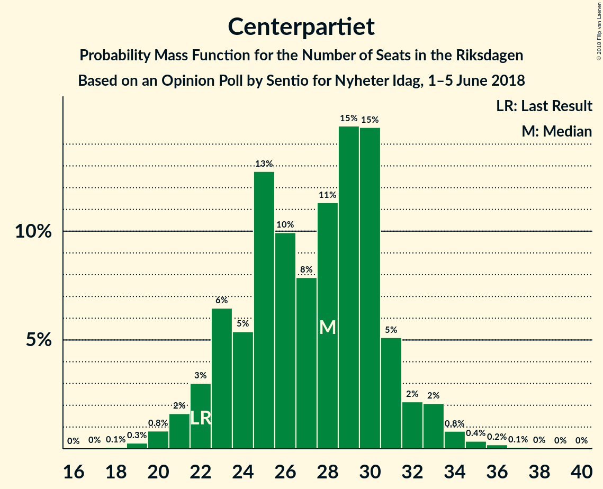

# Opinion Poll by Sentio for Nyheter Idag, 1–5 June 2018

<a href="#voting-intentions">Voting Intentions</a> | <a href="#seats">Seats</a> | <a href="#coalitions">Coalitions</a> | <a href="#technical-information">Technical Information</a>

## Voting Intentions

### Confidence Intervals

| Party | Last Result | Poll Result | 80% Confidence Interval | 90% Confidence Interval | 95% Confidence Interval | 99% Confidence Interval |
|:-----:|:-----------:|:-----------:|:-----------------------:|:-----------------------:|:-----------------------:|:-----------------------:|
| Sverigedemokraterna | 12.9% | 26.1% | 24.4–27.9% |23.9–28.5% |23.5–28.9% |22.7–29.8% |
| Sveriges socialdemokratiska arbetareparti | 31.0% | 21.7% | 20.1–23.5% |19.7–23.9% |19.3–24.4% |18.5–25.2% |
| Moderata samlingspartiet | 23.3% | 17.1% | 15.7–18.7% |15.3–19.2% |14.9–19.6% |14.3–20.4% |
| Vänsterpartiet | 5.7% | 9.7% | 8.6–11.0% |8.2–11.3% |8.0–11.7% |7.5–12.3% |
| Centerpartiet | 6.1% | 7.2% | 6.2–8.3% |6.0–8.7% |5.7–8.9% |5.3–9.5% |
| Liberalerna | 5.4% | 7.0% | 6.0–8.1% |5.8–8.4% |5.5–8.7% |5.1–9.3% |
| Miljöpartiet de gröna | 6.9% | 4.8% | 4.0–5.8% |3.8–6.0% |3.6–6.3% |3.3–6.8% |
| Kristdemokraterna | 4.6% | 3.3% | 2.7–4.1% |2.5–4.4% |2.3–4.6% |2.1–5.0% |
| Feministiskt initiativ | 3.1% | 0.6% | 0.4–1.1% |0.3–1.2% |0.3–1.3% |0.2–1.6% |

*Note:* The poll result column reflects the actual value used in the calculations. Published results may vary slightly, and in addition be rounded to fewer digits.

## Seats

### Confidence Intervals

| Party | Last Result | Median | 80% Confidence Interval | 90% Confidence Interval | 95% Confidence Interval | 99% Confidence Interval |
|:-----:|:-----------:|:------:|:-----------------------:|:-----------------------:|:-----------------------:|:-----------------------:|
| <a href="#sverigedemokraterna">Sverigedemokraterna</a> | 49 | 99 | 91–104 |89–107 |88–108 |84–113 |
| <a href="#sveriges-socialdemokratiska-arbetareparti">Sveriges socialdemokratiska arbetareparti</a> | 113 | 82 | 73–88 |72–89 |71–91 |68–92 |
| <a href="#moderata-samlingspartiet">Moderata samlingspartiet</a> | 84 | 64 | 59–69 |55–72 |54–73 |53–76 |
| <a href="#vänsterpartiet">Vänsterpartiet</a> | 21 | 36 | 31–40 |29–41 |29–43 |27–46 |
| <a href="#centerpartiet">Centerpartiet</a> | 22 | 25 | 22–31 |21–33 |21–34 |20–36 |
| <a href="#liberalerna">Liberalerna</a> | 19 | 24 | 23–28 |22–30 |20–31 |19–34 |
| <a href="#miljöpartiet-de-gröna">Miljöpartiet de gröna</a> | 25 | 17 | 16–20 |0–22 |0–23 |0–27 |
| <a href="#kristdemokraterna">Kristdemokraterna</a> | 16 | 0 | 0–15 |0–16 |0–16 |0–18 |
| <a href="#feministiskt-initiativ">Feministiskt initiativ</a> | 0 | 0 | 0 |0 |0 |0 |

### Sverigedemokraterna

*For a full overview of the results for this party, see the [Sverigedemokraterna](party-sverigedemokraterna.html) page.*

| Number of Seats | Probability | Accumulated | Special Marks |
|:---------------:|:-----------:|:-----------:|:-------------:|
| 49 | 0% | 100% | Last Result |
| 50 | 0% | 100% |  |
| 51 | 0% | 100% |  |
| 52 | 0% | 100% |  |
| 53 | 0% | 100% |  |
| 54 | 0% | 100% |  |
| 55 | 0% | 100% |  |
| 56 | 0% | 100% |  |
| 57 | 0% | 100% |  |
| 58 | 0% | 100% |  |
| 59 | 0% | 100% |  |
| 60 | 0% | 100% |  |
| 61 | 0% | 100% |  |
| 62 | 0% | 100% |  |
| 63 | 0% | 100% |  |
| 64 | 0% | 100% |  |
| 65 | 0% | 100% |  |
| 66 | 0% | 100% |  |
| 67 | 0% | 100% |  |
| 68 | 0% | 100% |  |
| 69 | 0% | 100% |  |
| 70 | 0% | 100% |  |
| 71 | 0% | 100% |  |
| 72 | 0% | 100% |  |
| 73 | 0% | 100% |  |
| 74 | 0% | 100% |  |
| 75 | 0% | 100% |  |
| 76 | 0% | 100% |  |
| 77 | 0% | 100% |  |
| 78 | 0% | 100% |  |
| 79 | 0% | 100% |  |
| 80 | 0.1% | 100% |  |
| 81 | 0.1% | 99.9% |  |
| 82 | 0.2% | 99.8% |  |
| 83 | 0.1% | 99.7% |  |
| 84 | 0.1% | 99.6% |  |
| 85 | 0.5% | 99.5% |  |
| 86 | 0.8% | 99.0% |  |
| 87 | 0.6% | 98% |  |
| 88 | 1.1% | 98% |  |
| 89 | 2% | 96% |  |
| 90 | 2% | 94% |  |
| 91 | 5% | 93% |  |
| 92 | 6% | 88% |  |
| 93 | 0.8% | 82% |  |
| 94 | 5% | 81% |  |
| 95 | 2% | 76% |  |
| 96 | 8% | 74% |  |
| 97 | 1.1% | 66% |  |
| 98 | 6% | 65% |  |
| 99 | 12% | 60% | Median |
| 100 | 2% | 47% |  |
| 101 | 29% | 45% |  |
| 102 | 5% | 17% |  |
| 103 | 1.4% | 12% |  |
| 104 | 1.1% | 10% |  |
| 105 | 0.4% | 9% |  |
| 106 | 1.1% | 9% |  |
| 107 | 4% | 8% |  |
| 108 | 3% | 4% |  |
| 109 | 0.1% | 0.8% |  |
| 110 | 0.1% | 0.8% |  |
| 111 | 0.1% | 0.7% |  |
| 112 | 0.1% | 0.6% |  |
| 113 | 0.3% | 0.6% |  |
| 114 | 0.3% | 0.3% |  |
| 115 | 0% | 0% |  |

### Sveriges socialdemokratiska arbetareparti

*For a full overview of the results for this party, see the [Sveriges socialdemokratiska arbetareparti](party-sverigessocialdemokratiskaarbetareparti.html) page.*

| Number of Seats | Probability | Accumulated | Special Marks |
|:---------------:|:-----------:|:-----------:|:-------------:|
| 64 | 0.1% | 100% |  |
| 65 | 0% | 99.9% |  |
| 66 | 0% | 99.9% |  |
| 67 | 0.3% | 99.9% |  |
| 68 | 0.1% | 99.6% |  |
| 69 | 0.2% | 99.4% |  |
| 70 | 0.5% | 99.2% |  |
| 71 | 3% | 98.7% |  |
| 72 | 5% | 96% |  |
| 73 | 1.4% | 91% |  |
| 74 | 2% | 89% |  |
| 75 | 1.2% | 87% |  |
| 76 | 2% | 86% |  |
| 77 | 4% | 84% |  |
| 78 | 2% | 80% |  |
| 79 | 5% | 79% |  |
| 80 | 14% | 73% |  |
| 81 | 6% | 59% |  |
| 82 | 3% | 53% | Median |
| 83 | 31% | 50% |  |
| 84 | 1.5% | 19% |  |
| 85 | 4% | 17% |  |
| 86 | 2% | 13% |  |
| 87 | 1.2% | 12% |  |
| 88 | 2% | 11% |  |
| 89 | 6% | 9% |  |
| 90 | 0.2% | 3% |  |
| 91 | 2% | 3% |  |
| 92 | 0.5% | 0.8% |  |
| 93 | 0.1% | 0.4% |  |
| 94 | 0% | 0.2% |  |
| 95 | 0% | 0.2% |  |
| 96 | 0.1% | 0.2% |  |
| 97 | 0% | 0.1% |  |
| 98 | 0% | 0.1% |  |
| 99 | 0% | 0.1% |  |
| 100 | 0.1% | 0.1% |  |
| 101 | 0% | 0% |  |
| 102 | 0% | 0% |  |
| 103 | 0% | 0% |  |
| 104 | 0% | 0% |  |
| 105 | 0% | 0% |  |
| 106 | 0% | 0% |  |
| 107 | 0% | 0% |  |
| 108 | 0% | 0% |  |
| 109 | 0% | 0% |  |
| 110 | 0% | 0% |  |
| 111 | 0% | 0% |  |
| 112 | 0% | 0% |  |
| 113 | 0% | 0% | Last Result |

### Moderata samlingspartiet

*For a full overview of the results for this party, see the [Moderata samlingspartiet](party-moderatasamlingspartiet.html) page.*

| Number of Seats | Probability | Accumulated | Special Marks |
|:---------------:|:-----------:|:-----------:|:-------------:|
| 50 | 0% | 100% |  |
| 51 | 0.1% | 99.9% |  |
| 52 | 0.3% | 99.9% |  |
| 53 | 0.5% | 99.6% |  |
| 54 | 2% | 99.1% |  |
| 55 | 2% | 97% |  |
| 56 | 0.9% | 95% |  |
| 57 | 0.7% | 94% |  |
| 58 | 1.4% | 93% |  |
| 59 | 4% | 91% |  |
| 60 | 3% | 88% |  |
| 61 | 11% | 84% |  |
| 62 | 7% | 73% |  |
| 63 | 9% | 66% |  |
| 64 | 8% | 57% | Median |
| 65 | 30% | 49% |  |
| 66 | 3% | 19% |  |
| 67 | 2% | 17% |  |
| 68 | 1.3% | 15% |  |
| 69 | 6% | 14% |  |
| 70 | 1.2% | 8% |  |
| 71 | 2% | 7% |  |
| 72 | 0.8% | 5% |  |
| 73 | 3% | 4% |  |
| 74 | 0.2% | 2% |  |
| 75 | 0.3% | 1.4% |  |
| 76 | 0.8% | 1.1% |  |
| 77 | 0.1% | 0.3% |  |
| 78 | 0% | 0.1% |  |
| 79 | 0.1% | 0.1% |  |
| 80 | 0% | 0% |  |
| 81 | 0% | 0% |  |
| 82 | 0% | 0% |  |
| 83 | 0% | 0% |  |
| 84 | 0% | 0% | Last Result |

### Vänsterpartiet

*For a full overview of the results for this party, see the [Vänsterpartiet](party-vänsterpartiet.html) page.*

| Number of Seats | Probability | Accumulated | Special Marks |
|:---------------:|:-----------:|:-----------:|:-------------:|
| 21 | 0% | 100% | Last Result |
| 22 | 0% | 100% |  |
| 23 | 0% | 100% |  |
| 24 | 0% | 100% |  |
| 25 | 0% | 100% |  |
| 26 | 0% | 100% |  |
| 27 | 0.5% | 100% |  |
| 28 | 2% | 99.4% |  |
| 29 | 7% | 98% |  |
| 30 | 0.2% | 90% |  |
| 31 | 5% | 90% |  |
| 32 | 2% | 85% |  |
| 33 | 4% | 83% |  |
| 34 | 6% | 79% |  |
| 35 | 13% | 73% |  |
| 36 | 35% | 60% | Median |
| 37 | 8% | 25% |  |
| 38 | 1.2% | 17% |  |
| 39 | 4% | 16% |  |
| 40 | 3% | 12% |  |
| 41 | 5% | 9% |  |
| 42 | 1.3% | 4% |  |
| 43 | 1.1% | 3% |  |
| 44 | 0.4% | 1.4% |  |
| 45 | 0.1% | 1.0% |  |
| 46 | 0.7% | 0.9% |  |
| 47 | 0.1% | 0.2% |  |
| 48 | 0.1% | 0.2% |  |
| 49 | 0% | 0.1% |  |
| 50 | 0.1% | 0.1% |  |
| 51 | 0% | 0% |  |

### Centerpartiet

*For a full overview of the results for this party, see the [Centerpartiet](party-centerpartiet.html) page.*

| Number of Seats | Probability | Accumulated | Special Marks |
|:---------------:|:-----------:|:-----------:|:-------------:|
| 18 | 0.1% | 100% |  |
| 19 | 0.3% | 99.9% |  |
| 20 | 0.6% | 99.6% |  |
| 21 | 4% | 99.0% |  |
| 22 | 7% | 95% | Last Result |
| 23 | 30% | 88% |  |
| 24 | 3% | 58% |  |
| 25 | 7% | 55% | Median |
| 26 | 5% | 47% |  |
| 27 | 16% | 42% |  |
| 28 | 4% | 26% |  |
| 29 | 4% | 22% |  |
| 30 | 4% | 19% |  |
| 31 | 9% | 15% |  |
| 32 | 1.4% | 7% |  |
| 33 | 2% | 5% |  |
| 34 | 0.9% | 3% |  |
| 35 | 1.5% | 2% |  |
| 36 | 0.3% | 0.5% |  |
| 37 | 0.1% | 0.2% |  |
| 38 | 0.1% | 0.1% |  |
| 39 | 0% | 0% |  |

### Liberalerna

*For a full overview of the results for this party, see the [Liberalerna](party-liberalerna.html) page.*

| Number of Seats | Probability | Accumulated | Special Marks |
|:---------------:|:-----------:|:-----------:|:-------------:|
| 18 | 0% | 100% |  |
| 19 | 0.6% | 99.9% | Last Result |
| 20 | 2% | 99.3% |  |
| 21 | 2% | 97% |  |
| 22 | 2% | 95% |  |
| 23 | 11% | 93% |  |
| 24 | 34% | 83% | Median |
| 25 | 23% | 49% |  |
| 26 | 10% | 26% |  |
| 27 | 4% | 16% |  |
| 28 | 4% | 13% |  |
| 29 | 3% | 9% |  |
| 30 | 2% | 6% |  |
| 31 | 2% | 4% |  |
| 32 | 0.5% | 2% |  |
| 33 | 0.4% | 1.2% |  |
| 34 | 0.5% | 0.8% |  |
| 35 | 0.2% | 0.4% |  |
| 36 | 0.1% | 0.2% |  |
| 37 | 0% | 0.1% |  |
| 38 | 0.1% | 0.1% |  |
| 39 | 0% | 0% |  |

### Miljöpartiet de gröna

*For a full overview of the results for this party, see the [Miljöpartiet de gröna](party-miljöpartietdegröna.html) page.*

| Number of Seats | Probability | Accumulated | Special Marks |
|:---------------:|:-----------:|:-----------:|:-------------:|
| 0 | 6% | 100% |  |
| 1 | 0% | 94% |  |
| 2 | 0% | 94% |  |
| 3 | 0% | 94% |  |
| 4 | 0% | 94% |  |
| 5 | 0% | 94% |  |
| 6 | 0% | 94% |  |
| 7 | 0% | 94% |  |
| 8 | 0% | 94% |  |
| 9 | 0% | 94% |  |
| 10 | 0% | 94% |  |
| 11 | 0% | 94% |  |
| 12 | 0% | 94% |  |
| 13 | 0% | 94% |  |
| 14 | 0% | 94% |  |
| 15 | 2% | 94% |  |
| 16 | 11% | 92% |  |
| 17 | 41% | 82% | Median |
| 18 | 12% | 40% |  |
| 19 | 12% | 29% |  |
| 20 | 7% | 16% |  |
| 21 | 4% | 9% |  |
| 22 | 2% | 5% |  |
| 23 | 0.6% | 3% |  |
| 24 | 1.5% | 2% |  |
| 25 | 0.1% | 0.8% | Last Result |
| 26 | 0.1% | 0.7% |  |
| 27 | 0.5% | 0.5% |  |
| 28 | 0% | 0% |  |

### Kristdemokraterna

*For a full overview of the results for this party, see the [Kristdemokraterna](party-kristdemokraterna.html) page.*

| Number of Seats | Probability | Accumulated | Special Marks |
|:---------------:|:-----------:|:-----------:|:-------------:|
| 0 | 85% | 100% | Median |
| 1 | 0% | 15% |  |
| 2 | 0% | 15% |  |
| 3 | 0% | 15% |  |
| 4 | 0% | 15% |  |
| 5 | 0% | 15% |  |
| 6 | 0% | 15% |  |
| 7 | 0% | 15% |  |
| 8 | 0% | 15% |  |
| 9 | 0% | 15% |  |
| 10 | 0% | 15% |  |
| 11 | 0% | 15% |  |
| 12 | 0% | 15% |  |
| 13 | 0% | 15% |  |
| 14 | 3% | 15% |  |
| 15 | 3% | 12% |  |
| 16 | 7% | 9% | Last Result |
| 17 | 0.7% | 2% |  |
| 18 | 0.4% | 0.8% |  |
| 19 | 0.3% | 0.4% |  |
| 20 | 0.1% | 0.1% |  |
| 21 | 0% | 0% |  |

### Feministiskt initiativ

*For a full overview of the results for this party, see the [Feministiskt initiativ](party-feministisktinitiativ.html) page.*

| Number of Seats | Probability | Accumulated | Special Marks |
|:---------------:|:-----------:|:-----------:|:-------------:|
| 0 | 100% | 100% | Last Result, Median |

## Coalitions

### Confidence Intervals

| Coalition | Last Result | Median | Majority? | 80% Confidence Interval | 90% Confidence Interval | 95% Confidence Interval | 99% Confidence Interval |
|:---------:|:-----------:|:------:|:---------:|:-----------------------:|:-----------------------:|:-----------------------:|:-----------------------:|
| Sverigedemokraterna – Moderata samlingspartiet | 133 | 164 | 2% | 153–166 | 150–169 | 147–172 | 143–181 |
| Sveriges socialdemokratiska arbetareparti – Moderata samlingspartiet | 197 | 148 | 0% | 134–152 | 134–154 | 131–155 | 129–162 |
| Sveriges socialdemokratiska arbetareparti – Vänsterpartiet – Miljöpartiet de gröna – Feministiskt initiativ | 159 | 135 | 0% | 126–138 | 123–143 | 115–145 | 110–147 |
| Sveriges socialdemokratiska arbetareparti – Vänsterpartiet – Miljöpartiet de gröna | 159 | 135 | 0% | 126–138 | 123–143 | 115–145 | 110–147 |
| Moderata samlingspartiet – Centerpartiet – Liberalerna – Kristdemokraterna | 141 | 115 | 0% | 111–126 | 108–130 | 105–130 | 104–137 |
| Moderata samlingspartiet – Centerpartiet – Liberalerna | 125 | 112 | 0% | 108–123 | 106–126 | 105–130 | 101–133 |
| Sveriges socialdemokratiska arbetareparti – Vänsterpartiet | 134 | 118 | 0% | 110–121 | 107–125 | 107–127 | 101–130 |
| Sveriges socialdemokratiska arbetareparti – Miljöpartiet de gröna | 138 | 100 | 0% | 90–106 | 86–107 | 80–109 | 76–111 |
| Moderata samlingspartiet – Centerpartiet – Kristdemokraterna | 122 | 90 | 0% | 85–100 | 83–104 | 82–106 | 79–111 |
| Moderata samlingspartiet – Centerpartiet | 106 | 88 | 0% | 84–97 | 82–99 | 82–101 | 77–105 |

### Sverigedemokraterna – Moderata samlingspartiet

| Number of Seats | Probability | Accumulated | Special Marks |
|:---------------:|:-----------:|:-----------:|:-------------:|
| 133 | 0% | 100% | Last Result |
| 134 | 0% | 100% |  |
| 135 | 0% | 100% |  |
| 136 | 0% | 100% |  |
| 137 | 0% | 100% |  |
| 138 | 0% | 100% |  |
| 139 | 0% | 100% |  |
| 140 | 0% | 100% |  |
| 141 | 0.1% | 99.9% |  |
| 142 | 0% | 99.8% |  |
| 143 | 0.3% | 99.8% |  |
| 144 | 0.3% | 99.5% |  |
| 145 | 0.1% | 99.2% |  |
| 146 | 0.2% | 99.1% |  |
| 147 | 2% | 98.9% |  |
| 148 | 0.4% | 97% |  |
| 149 | 0.8% | 97% |  |
| 150 | 3% | 96% |  |
| 151 | 0.7% | 93% |  |
| 152 | 2% | 93% |  |
| 153 | 2% | 90% |  |
| 154 | 2% | 88% |  |
| 155 | 3% | 87% |  |
| 156 | 2% | 84% |  |
| 157 | 4% | 82% |  |
| 158 | 2% | 78% |  |
| 159 | 2% | 77% |  |
| 160 | 9% | 75% |  |
| 161 | 1.5% | 66% |  |
| 162 | 7% | 64% |  |
| 163 | 8% | 58% | Median |
| 164 | 0.8% | 50% |  |
| 165 | 6% | 49% |  |
| 166 | 34% | 43% |  |
| 167 | 1.1% | 10% |  |
| 168 | 0.8% | 9% |  |
| 169 | 3% | 8% |  |
| 170 | 0.5% | 5% |  |
| 171 | 0.6% | 4% |  |
| 172 | 1.2% | 4% |  |
| 173 | 0.1% | 2% |  |
| 174 | 0.2% | 2% |  |
| 175 | 0.8% | 2% | Majority |
| 176 | 0.1% | 1.3% |  |
| 177 | 0% | 1.3% |  |
| 178 | 0.6% | 1.3% |  |
| 179 | 0% | 0.6% |  |
| 180 | 0% | 0.6% |  |
| 181 | 0.5% | 0.6% |  |
| 182 | 0% | 0.1% |  |
| 183 | 0% | 0% |  |

### Sveriges socialdemokratiska arbetareparti – Moderata samlingspartiet

| Number of Seats | Probability | Accumulated | Special Marks |
|:---------------:|:-----------:|:-----------:|:-------------:|
| 123 | 0.1% | 100% |  |
| 124 | 0% | 99.8% |  |
| 125 | 0% | 99.8% |  |
| 126 | 0.1% | 99.8% |  |
| 127 | 0.1% | 99.7% |  |
| 128 | 0.1% | 99.6% |  |
| 129 | 0.6% | 99.5% |  |
| 130 | 0.1% | 99.0% |  |
| 131 | 2% | 98.9% |  |
| 132 | 1.0% | 97% |  |
| 133 | 0.6% | 96% |  |
| 134 | 9% | 96% |  |
| 135 | 0.7% | 87% |  |
| 136 | 0.6% | 86% |  |
| 137 | 0.7% | 86% |  |
| 138 | 5% | 85% |  |
| 139 | 2% | 79% |  |
| 140 | 3% | 78% |  |
| 141 | 5% | 74% |  |
| 142 | 0.8% | 70% |  |
| 143 | 1.5% | 69% |  |
| 144 | 7% | 68% |  |
| 145 | 3% | 61% |  |
| 146 | 2% | 57% | Median |
| 147 | 2% | 56% |  |
| 148 | 30% | 53% |  |
| 149 | 5% | 24% |  |
| 150 | 3% | 19% |  |
| 151 | 1.2% | 16% |  |
| 152 | 9% | 15% |  |
| 153 | 0.5% | 6% |  |
| 154 | 3% | 5% |  |
| 155 | 0.4% | 3% |  |
| 156 | 0.2% | 2% |  |
| 157 | 0.1% | 2% |  |
| 158 | 0.9% | 2% |  |
| 159 | 0.1% | 1.1% |  |
| 160 | 0.1% | 1.1% |  |
| 161 | 0% | 1.0% |  |
| 162 | 0.8% | 1.0% |  |
| 163 | 0% | 0.2% |  |
| 164 | 0.1% | 0.2% |  |
| 165 | 0% | 0.1% |  |
| 166 | 0% | 0.1% |  |
| 167 | 0.1% | 0.1% |  |
| 168 | 0% | 0% |  |
| 169 | 0% | 0% |  |
| 170 | 0% | 0% |  |
| 171 | 0% | 0% |  |
| 172 | 0% | 0% |  |
| 173 | 0% | 0% |  |
| 174 | 0% | 0% |  |
| 175 | 0% | 0% | Majority |
| 176 | 0% | 0% |  |
| 177 | 0% | 0% |  |
| 178 | 0% | 0% |  |
| 179 | 0% | 0% |  |
| 180 | 0% | 0% |  |
| 181 | 0% | 0% |  |
| 182 | 0% | 0% |  |
| 183 | 0% | 0% |  |
| 184 | 0% | 0% |  |
| 185 | 0% | 0% |  |
| 186 | 0% | 0% |  |
| 187 | 0% | 0% |  |
| 188 | 0% | 0% |  |
| 189 | 0% | 0% |  |
| 190 | 0% | 0% |  |
| 191 | 0% | 0% |  |
| 192 | 0% | 0% |  |
| 193 | 0% | 0% |  |
| 194 | 0% | 0% |  |
| 195 | 0% | 0% |  |
| 196 | 0% | 0% |  |
| 197 | 0% | 0% | Last Result |

### Sveriges socialdemokratiska arbetareparti – Vänsterpartiet – Miljöpartiet de gröna – Feministiskt initiativ

| Number of Seats | Probability | Accumulated | Special Marks |
|:---------------:|:-----------:|:-----------:|:-------------:|
| 109 | 0% | 100% |  |
| 110 | 0.6% | 99.9% |  |
| 111 | 0% | 99.4% |  |
| 112 | 0% | 99.3% |  |
| 113 | 1.0% | 99.3% |  |
| 114 | 0.2% | 98% |  |
| 115 | 0.8% | 98% |  |
| 116 | 0.1% | 97% |  |
| 117 | 0.5% | 97% |  |
| 118 | 0.2% | 97% |  |
| 119 | 0.2% | 97% |  |
| 120 | 0.6% | 96% |  |
| 121 | 0.4% | 96% |  |
| 122 | 0.1% | 95% |  |
| 123 | 2% | 95% |  |
| 124 | 0.2% | 93% |  |
| 125 | 0.2% | 93% |  |
| 126 | 7% | 93% |  |
| 127 | 0.6% | 86% |  |
| 128 | 3% | 85% |  |
| 129 | 2% | 82% |  |
| 130 | 1.1% | 80% |  |
| 131 | 2% | 79% |  |
| 132 | 4% | 77% |  |
| 133 | 7% | 73% |  |
| 134 | 8% | 66% |  |
| 135 | 14% | 58% | Median |
| 136 | 32% | 44% |  |
| 137 | 1.2% | 12% |  |
| 138 | 2% | 11% |  |
| 139 | 1.0% | 9% |  |
| 140 | 0.5% | 8% |  |
| 141 | 0.3% | 8% |  |
| 142 | 2% | 8% |  |
| 143 | 1.4% | 6% |  |
| 144 | 0.9% | 4% |  |
| 145 | 1.4% | 4% |  |
| 146 | 0.1% | 2% |  |
| 147 | 2% | 2% |  |
| 148 | 0.1% | 0.3% |  |
| 149 | 0% | 0.1% |  |
| 150 | 0% | 0.1% |  |
| 151 | 0% | 0.1% |  |
| 152 | 0% | 0.1% |  |
| 153 | 0% | 0% |  |
| 154 | 0% | 0% |  |
| 155 | 0% | 0% |  |
| 156 | 0% | 0% |  |
| 157 | 0% | 0% |  |
| 158 | 0% | 0% |  |
| 159 | 0% | 0% | Last Result |

### Sveriges socialdemokratiska arbetareparti – Vänsterpartiet – Miljöpartiet de gröna

| Number of Seats | Probability | Accumulated | Special Marks |
|:---------------:|:-----------:|:-----------:|:-------------:|
| 109 | 0% | 100% |  |
| 110 | 0.6% | 99.9% |  |
| 111 | 0% | 99.4% |  |
| 112 | 0% | 99.3% |  |
| 113 | 1.0% | 99.3% |  |
| 114 | 0.2% | 98% |  |
| 115 | 0.8% | 98% |  |
| 116 | 0.1% | 97% |  |
| 117 | 0.5% | 97% |  |
| 118 | 0.2% | 97% |  |
| 119 | 0.2% | 97% |  |
| 120 | 0.6% | 96% |  |
| 121 | 0.4% | 96% |  |
| 122 | 0.1% | 95% |  |
| 123 | 2% | 95% |  |
| 124 | 0.2% | 93% |  |
| 125 | 0.2% | 93% |  |
| 126 | 7% | 93% |  |
| 127 | 0.6% | 86% |  |
| 128 | 3% | 85% |  |
| 129 | 2% | 82% |  |
| 130 | 1.1% | 80% |  |
| 131 | 2% | 79% |  |
| 132 | 4% | 77% |  |
| 133 | 7% | 73% |  |
| 134 | 8% | 66% |  |
| 135 | 14% | 58% | Median |
| 136 | 32% | 44% |  |
| 137 | 1.2% | 12% |  |
| 138 | 2% | 11% |  |
| 139 | 1.0% | 9% |  |
| 140 | 0.5% | 8% |  |
| 141 | 0.3% | 8% |  |
| 142 | 2% | 8% |  |
| 143 | 1.4% | 6% |  |
| 144 | 0.9% | 4% |  |
| 145 | 1.4% | 4% |  |
| 146 | 0.1% | 2% |  |
| 147 | 2% | 2% |  |
| 148 | 0.1% | 0.3% |  |
| 149 | 0% | 0.1% |  |
| 150 | 0% | 0.1% |  |
| 151 | 0% | 0.1% |  |
| 152 | 0% | 0.1% |  |
| 153 | 0% | 0% |  |
| 154 | 0% | 0% |  |
| 155 | 0% | 0% |  |
| 156 | 0% | 0% |  |
| 157 | 0% | 0% |  |
| 158 | 0% | 0% |  |
| 159 | 0% | 0% | Last Result |

### Moderata samlingspartiet – Centerpartiet – Liberalerna – Kristdemokraterna

| Number of Seats | Probability | Accumulated | Special Marks |
|:---------------:|:-----------:|:-----------:|:-------------:|
| 100 | 0.1% | 100% |  |
| 101 | 0.1% | 99.9% |  |
| 102 | 0.1% | 99.8% |  |
| 103 | 0.1% | 99.8% |  |
| 104 | 0.3% | 99.7% |  |
| 105 | 3% | 99.4% |  |
| 106 | 0.2% | 96% |  |
| 107 | 0.5% | 96% |  |
| 108 | 5% | 96% |  |
| 109 | 0.2% | 91% |  |
| 110 | 0.2% | 90% |  |
| 111 | 0.4% | 90% |  |
| 112 | 33% | 90% |  |
| 113 | 0.5% | 57% | Median |
| 114 | 2% | 56% |  |
| 115 | 9% | 54% |  |
| 116 | 1.2% | 45% |  |
| 117 | 3% | 44% |  |
| 118 | 4% | 41% |  |
| 119 | 5% | 36% |  |
| 120 | 4% | 31% |  |
| 121 | 0.5% | 28% |  |
| 122 | 3% | 27% |  |
| 123 | 2% | 24% |  |
| 124 | 4% | 22% |  |
| 125 | 8% | 18% |  |
| 126 | 2% | 10% |  |
| 127 | 0.4% | 8% |  |
| 128 | 0.8% | 8% |  |
| 129 | 2% | 7% |  |
| 130 | 3% | 5% |  |
| 131 | 0.1% | 2% |  |
| 132 | 0.5% | 2% |  |
| 133 | 0.1% | 2% |  |
| 134 | 0.1% | 2% |  |
| 135 | 0.7% | 2% |  |
| 136 | 0.3% | 0.9% |  |
| 137 | 0.3% | 0.6% |  |
| 138 | 0% | 0.3% |  |
| 139 | 0.1% | 0.3% |  |
| 140 | 0.1% | 0.2% |  |
| 141 | 0.1% | 0.1% | Last Result |
| 142 | 0% | 0% |  |

### Moderata samlingspartiet – Centerpartiet – Liberalerna

| Number of Seats | Probability | Accumulated | Special Marks |
|:---------------:|:-----------:|:-----------:|:-------------:|
| 98 | 0% | 100% |  |
| 99 | 0.3% | 99.9% |  |
| 100 | 0.1% | 99.6% |  |
| 101 | 0.2% | 99.5% |  |
| 102 | 0.4% | 99.3% |  |
| 103 | 0.1% | 99.0% |  |
| 104 | 0.6% | 98.9% |  |
| 105 | 3% | 98% |  |
| 106 | 0.6% | 95% |  |
| 107 | 0.7% | 95% |  |
| 108 | 6% | 94% |  |
| 109 | 5% | 88% |  |
| 110 | 2% | 83% |  |
| 111 | 0.9% | 81% |  |
| 112 | 34% | 80% |  |
| 113 | 0.6% | 46% | Median |
| 114 | 4% | 46% |  |
| 115 | 9% | 42% |  |
| 116 | 2% | 33% |  |
| 117 | 3% | 31% |  |
| 118 | 5% | 28% |  |
| 119 | 5% | 23% |  |
| 120 | 4% | 18% |  |
| 121 | 0.6% | 15% |  |
| 122 | 3% | 14% |  |
| 123 | 2% | 12% |  |
| 124 | 2% | 9% |  |
| 125 | 3% | 8% | Last Result |
| 126 | 1.4% | 5% |  |
| 127 | 0.2% | 4% |  |
| 128 | 0.8% | 4% |  |
| 129 | 0.2% | 3% |  |
| 130 | 2% | 3% |  |
| 131 | 0% | 0.7% |  |
| 132 | 0.2% | 0.7% |  |
| 133 | 0.1% | 0.5% |  |
| 134 | 0% | 0.4% |  |
| 135 | 0.1% | 0.3% |  |
| 136 | 0% | 0.3% |  |
| 137 | 0.1% | 0.2% |  |
| 138 | 0% | 0.1% |  |
| 139 | 0.1% | 0.1% |  |
| 140 | 0% | 0% |  |

### Sveriges socialdemokratiska arbetareparti – Vänsterpartiet

| Number of Seats | Probability | Accumulated | Special Marks |
|:---------------:|:-----------:|:-----------:|:-------------:|
| 97 | 0.1% | 100% |  |
| 98 | 0% | 99.9% |  |
| 99 | 0.2% | 99.9% |  |
| 100 | 0% | 99.7% |  |
| 101 | 0.3% | 99.7% |  |
| 102 | 0.1% | 99.3% |  |
| 103 | 0.2% | 99.2% |  |
| 104 | 0.1% | 99.1% |  |
| 105 | 0.5% | 98.9% |  |
| 106 | 0.2% | 98% |  |
| 107 | 6% | 98% |  |
| 108 | 1.1% | 92% |  |
| 109 | 0.8% | 91% |  |
| 110 | 2% | 90% |  |
| 111 | 0.6% | 88% |  |
| 112 | 3% | 88% |  |
| 113 | 7% | 84% |  |
| 114 | 4% | 77% |  |
| 115 | 7% | 74% |  |
| 116 | 6% | 66% |  |
| 117 | 8% | 60% |  |
| 118 | 11% | 53% | Median |
| 119 | 29% | 41% |  |
| 120 | 1.5% | 12% |  |
| 121 | 2% | 11% |  |
| 122 | 0.8% | 9% |  |
| 123 | 2% | 8% |  |
| 124 | 0.7% | 6% |  |
| 125 | 2% | 6% |  |
| 126 | 0.7% | 4% |  |
| 127 | 2% | 3% |  |
| 128 | 0.5% | 1.2% |  |
| 129 | 0.2% | 0.7% |  |
| 130 | 0.2% | 0.5% |  |
| 131 | 0.1% | 0.4% |  |
| 132 | 0.1% | 0.3% |  |
| 133 | 0% | 0.2% |  |
| 134 | 0% | 0.2% | Last Result |
| 135 | 0% | 0.2% |  |
| 136 | 0% | 0.2% |  |
| 137 | 0.1% | 0.2% |  |
| 138 | 0.1% | 0.1% |  |
| 139 | 0% | 0% |  |

### Sveriges socialdemokratiska arbetareparti – Miljöpartiet de gröna

| Number of Seats | Probability | Accumulated | Special Marks |
|:---------------:|:-----------:|:-----------:|:-------------:|
| 72 | 0% | 100% |  |
| 73 | 0% | 99.9% |  |
| 74 | 0% | 99.9% |  |
| 75 | 0% | 99.9% |  |
| 76 | 1.4% | 99.9% |  |
| 77 | 0% | 98% |  |
| 78 | 0% | 98% |  |
| 79 | 0.6% | 98% |  |
| 80 | 0.7% | 98% |  |
| 81 | 0.1% | 97% |  |
| 82 | 1.2% | 97% |  |
| 83 | 0.2% | 96% |  |
| 84 | 0.1% | 96% |  |
| 85 | 0.5% | 96% |  |
| 86 | 0.3% | 95% |  |
| 87 | 3% | 95% |  |
| 88 | 0.5% | 92% |  |
| 89 | 1.0% | 92% |  |
| 90 | 1.1% | 91% |  |
| 91 | 6% | 90% |  |
| 92 | 1.1% | 84% |  |
| 93 | 0.6% | 83% |  |
| 94 | 3% | 82% |  |
| 95 | 1.0% | 79% |  |
| 96 | 8% | 78% |  |
| 97 | 9% | 70% |  |
| 98 | 2% | 61% |  |
| 99 | 2% | 60% | Median |
| 100 | 35% | 57% |  |
| 101 | 1.0% | 22% |  |
| 102 | 2% | 21% |  |
| 103 | 5% | 19% |  |
| 104 | 0.8% | 15% |  |
| 105 | 2% | 14% |  |
| 106 | 7% | 12% |  |
| 107 | 1.2% | 5% |  |
| 108 | 0.8% | 4% |  |
| 109 | 0.6% | 3% |  |
| 110 | 0.4% | 2% |  |
| 111 | 2% | 2% |  |
| 112 | 0% | 0.2% |  |
| 113 | 0.1% | 0.2% |  |
| 114 | 0.1% | 0.1% |  |
| 115 | 0% | 0% |  |
| 116 | 0% | 0% |  |
| 117 | 0% | 0% |  |
| 118 | 0% | 0% |  |
| 119 | 0% | 0% |  |
| 120 | 0% | 0% |  |
| 121 | 0% | 0% |  |
| 122 | 0% | 0% |  |
| 123 | 0% | 0% |  |
| 124 | 0% | 0% |  |
| 125 | 0% | 0% |  |
| 126 | 0% | 0% |  |
| 127 | 0% | 0% |  |
| 128 | 0% | 0% |  |
| 129 | 0% | 0% |  |
| 130 | 0% | 0% |  |
| 131 | 0% | 0% |  |
| 132 | 0% | 0% |  |
| 133 | 0% | 0% |  |
| 134 | 0% | 0% |  |
| 135 | 0% | 0% |  |
| 136 | 0% | 0% |  |
| 137 | 0% | 0% |  |
| 138 | 0% | 0% | Last Result |

### Moderata samlingspartiet – Centerpartiet – Kristdemokraterna

| Number of Seats | Probability | Accumulated | Special Marks |
|:---------------:|:-----------:|:-----------:|:-------------:|
| 74 | 0.1% | 100% |  |
| 75 | 0% | 99.9% |  |
| 76 | 0% | 99.9% |  |
| 77 | 0% | 99.8% |  |
| 78 | 0.3% | 99.8% |  |
| 79 | 0.5% | 99.5% |  |
| 80 | 0.2% | 99.1% |  |
| 81 | 0.1% | 98.9% |  |
| 82 | 3% | 98.8% |  |
| 83 | 2% | 96% |  |
| 84 | 4% | 94% |  |
| 85 | 0.3% | 90% |  |
| 86 | 0.4% | 90% |  |
| 87 | 5% | 89% |  |
| 88 | 30% | 84% |  |
| 89 | 2% | 54% | Median |
| 90 | 7% | 52% |  |
| 91 | 3% | 45% |  |
| 92 | 4% | 41% |  |
| 93 | 3% | 37% |  |
| 94 | 2% | 34% |  |
| 95 | 0.7% | 32% |  |
| 96 | 6% | 31% |  |
| 97 | 4% | 25% |  |
| 98 | 2% | 21% |  |
| 99 | 4% | 20% |  |
| 100 | 7% | 15% |  |
| 101 | 2% | 8% |  |
| 102 | 0.2% | 7% |  |
| 103 | 1.0% | 6% |  |
| 104 | 1.3% | 5% |  |
| 105 | 0.2% | 4% |  |
| 106 | 2% | 4% |  |
| 107 | 0.4% | 2% |  |
| 108 | 0.6% | 2% |  |
| 109 | 0.2% | 1.2% |  |
| 110 | 0.3% | 1.0% |  |
| 111 | 0.4% | 0.6% |  |
| 112 | 0.2% | 0.3% |  |
| 113 | 0% | 0.1% |  |
| 114 | 0% | 0.1% |  |
| 115 | 0% | 0.1% |  |
| 116 | 0% | 0% |  |
| 117 | 0% | 0% |  |
| 118 | 0% | 0% |  |
| 119 | 0% | 0% |  |
| 120 | 0% | 0% |  |
| 121 | 0% | 0% |  |
| 122 | 0% | 0% | Last Result |

### Moderata samlingspartiet – Centerpartiet

| Number of Seats | Probability | Accumulated | Special Marks |
|:---------------:|:-----------:|:-----------:|:-------------:|
| 74 | 0.2% | 100% |  |
| 75 | 0% | 99.7% |  |
| 76 | 0.1% | 99.7% |  |
| 77 | 0.4% | 99.6% |  |
| 78 | 0.3% | 99.2% |  |
| 79 | 0.5% | 98.9% |  |
| 80 | 0.3% | 98% |  |
| 81 | 0.2% | 98% |  |
| 82 | 3% | 98% |  |
| 83 | 2% | 95% |  |
| 84 | 9% | 93% |  |
| 85 | 3% | 83% |  |
| 86 | 0.6% | 80% |  |
| 87 | 6% | 80% |  |
| 88 | 30% | 74% |  |
| 89 | 3% | 44% | Median |
| 90 | 7% | 41% |  |
| 91 | 5% | 34% |  |
| 92 | 5% | 29% |  |
| 93 | 4% | 24% |  |
| 94 | 2% | 20% |  |
| 95 | 0.8% | 18% |  |
| 96 | 6% | 18% |  |
| 97 | 4% | 12% |  |
| 98 | 2% | 8% |  |
| 99 | 2% | 6% |  |
| 100 | 1.1% | 4% |  |
| 101 | 2% | 3% |  |
| 102 | 0.2% | 1.4% |  |
| 103 | 0.1% | 1.2% |  |
| 104 | 0.6% | 1.2% |  |
| 105 | 0.1% | 0.5% |  |
| 106 | 0.2% | 0.5% | Last Result |
| 107 | 0% | 0.3% |  |
| 108 | 0% | 0.3% |  |
| 109 | 0.2% | 0.3% |  |
| 110 | 0.1% | 0.1% |  |
| 111 | 0% | 0% |  |

## Technical Information

### Opinion Poll

+ **Polling firm:** Sentio
+ **Commissioner(s):** Nyheter Idag
+ **Fieldwork period:** 1–5 June 2018

### Calculations

+ **Sample size:** 1004
+ **Simulations done:** 131,072
+ **Error estimate:** 2.16%

