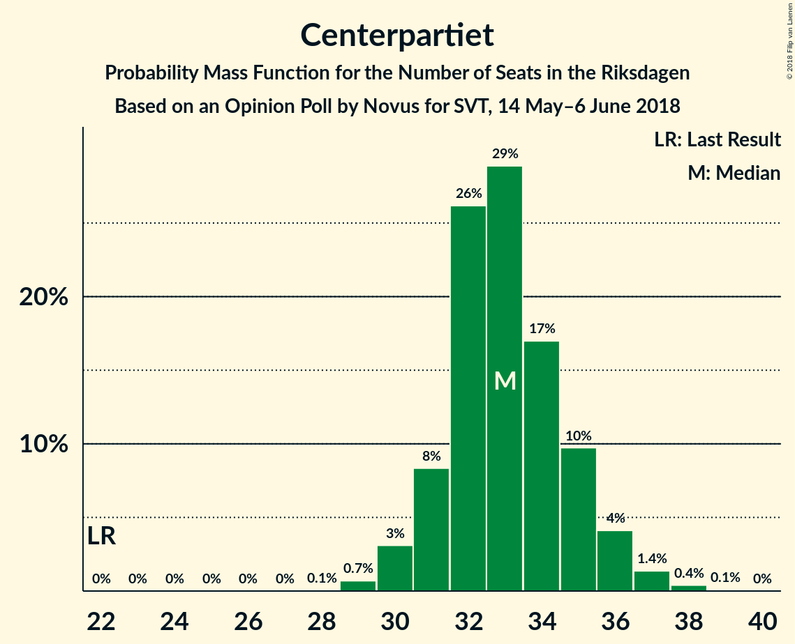

# Opinion Poll by Novus for SVT, 14 May–6 June 2018

<a href="#voting-intentions">Voting Intentions</a> | <a href="#seats">Seats</a> | <a href="#coalitions">Coalitions</a> | <a href="#technical-information">Technical Information</a>

## Voting Intentions

### Confidence Intervals

| Party | Last Result | Poll Result | 80% Confidence Interval | 90% Confidence Interval | 95% Confidence Interval | 99% Confidence Interval |
|:-----:|:-----------:|:-----------:|:-----------------------:|:-----------------------:|:-----------------------:|:-----------------------:|
| Sveriges socialdemokratiska arbetareparti | 31.0% | 23.8% | 23.0–24.6% |22.8–24.9% |22.6–25.1% |22.2–25.5% |
| Sverigedemokraterna | 12.9% | 21.9% | 21.1–22.7% |20.9–22.9% |20.7–23.1% |20.4–23.5% |
| Moderata samlingspartiet | 23.3% | 21.1% | 20.3–21.9% |20.1–22.1% |20.0–22.3% |19.6–22.7% |
| Vänsterpartiet | 5.7% | 9.1% | 8.6–9.7% |8.4–9.8% |8.3–10.0% |8.1–10.3% |
| Centerpartiet | 6.1% | 8.9% | 8.4–9.5% |8.2–9.6% |8.1–9.8% |7.9–10.0% |
| Liberalerna | 5.4% | 4.6% | 4.2–5.0% |4.1–5.1% |4.0–5.2% |3.9–5.5% |
| Miljöpartiet de gröna | 6.9% | 4.5% | 4.1–4.9% |4.0–5.0% |3.9–5.1% |3.7–5.3% |
| Kristdemokraterna | 4.6% | 2.9% | 2.6–3.2% |2.5–3.3% |2.4–3.4% |2.3–3.6% |

*Note:* The poll result column reflects the actual value used in the calculations. Published results may vary slightly, and in addition be rounded to fewer digits.

## Seats

### Confidence Intervals

| Party | Last Result | Median | 80% Confidence Interval | 90% Confidence Interval | 95% Confidence Interval | 99% Confidence Interval |
|:-----:|:-----------:|:------:|:-----------------------:|:-----------------------:|:-----------------------:|:-----------------------:|
| <a href="#sveriges-socialdemokratiska-arbetareparti">Sveriges socialdemokratiska arbetareparti</a> | 113 | 89 | 85–92 |85–93 |84–94 |82–97 |
| <a href="#sverigedemokraterna">Sverigedemokraterna</a> | 49 | 81 | 79–85 |78–86 |77–87 |76–89 |
| <a href="#moderata-samlingspartiet">Moderata samlingspartiet</a> | 84 | 78 | 76–82 |75–83 |74–84 |73–86 |
| <a href="#vänsterpartiet">Vänsterpartiet</a> | 21 | 34 | 32–36 |31–37 |31–37 |30–38 |
| <a href="#centerpartiet">Centerpartiet</a> | 22 | 33 | 31–35 |31–36 |30–36 |29–38 |
| <a href="#liberalerna">Liberalerna</a> | 19 | 17 | 16–19 |15–19 |15–19 |0–20 |
| <a href="#miljöpartiet-de-gröna">Miljöpartiet de gröna</a> | 25 | 17 | 15–18 |15–19 |0–19 |0–20 |
| <a href="#kristdemokraterna">Kristdemokraterna</a> | 16 | 0 | 0 |0 |0 |0 |

### Sveriges socialdemokratiska arbetareparti

*For a full overview of the results for this party, see the [Sveriges socialdemokratiska arbetareparti](party-sverigessocialdemokratiskaarbetareparti.html) page.*

| Number of Seats | Probability | Accumulated | Special Marks |
|:---------------:|:-----------:|:-----------:|:-------------:|
| 81 | 0.1% | 100% |  |
| 82 | 0.4% | 99.9% |  |
| 83 | 1.0% | 99.4% |  |
| 84 | 3% | 98% |  |
| 85 | 8% | 96% |  |
| 86 | 10% | 88% |  |
| 87 | 12% | 78% |  |
| 88 | 14% | 66% |  |
| 89 | 16% | 52% | Median |
| 90 | 14% | 36% |  |
| 91 | 9% | 22% |  |
| 92 | 6% | 13% |  |
| 93 | 5% | 7% |  |
| 94 | 0.9% | 3% |  |
| 95 | 0.7% | 2% |  |
| 96 | 0.5% | 1.0% |  |
| 97 | 0.3% | 0.5% |  |
| 98 | 0.1% | 0.2% |  |
| 99 | 0.1% | 0.1% |  |
| 100 | 0% | 0% |  |
| 101 | 0% | 0% |  |
| 102 | 0% | 0% |  |
| 103 | 0% | 0% |  |
| 104 | 0% | 0% |  |
| 105 | 0% | 0% |  |
| 106 | 0% | 0% |  |
| 107 | 0% | 0% |  |
| 108 | 0% | 0% |  |
| 109 | 0% | 0% |  |
| 110 | 0% | 0% |  |
| 111 | 0% | 0% |  |
| 112 | 0% | 0% |  |
| 113 | 0% | 0% | Last Result |

### Sverigedemokraterna

*For a full overview of the results for this party, see the [Sverigedemokraterna](party-sverigedemokraterna.html) page.*

| Number of Seats | Probability | Accumulated | Special Marks |
|:---------------:|:-----------:|:-----------:|:-------------:|
| 49 | 0% | 100% | Last Result |
| 50 | 0% | 100% |  |
| 51 | 0% | 100% |  |
| 52 | 0% | 100% |  |
| 53 | 0% | 100% |  |
| 54 | 0% | 100% |  |
| 55 | 0% | 100% |  |
| 56 | 0% | 100% |  |
| 57 | 0% | 100% |  |
| 58 | 0% | 100% |  |
| 59 | 0% | 100% |  |
| 60 | 0% | 100% |  |
| 61 | 0% | 100% |  |
| 62 | 0% | 100% |  |
| 63 | 0% | 100% |  |
| 64 | 0% | 100% |  |
| 65 | 0% | 100% |  |
| 66 | 0% | 100% |  |
| 67 | 0% | 100% |  |
| 68 | 0% | 100% |  |
| 69 | 0% | 100% |  |
| 70 | 0% | 100% |  |
| 71 | 0% | 100% |  |
| 72 | 0% | 100% |  |
| 73 | 0% | 100% |  |
| 74 | 0.1% | 100% |  |
| 75 | 0.3% | 99.9% |  |
| 76 | 1.0% | 99.6% |  |
| 77 | 2% | 98.6% |  |
| 78 | 5% | 96% |  |
| 79 | 7% | 91% |  |
| 80 | 18% | 84% |  |
| 81 | 17% | 66% | Median |
| 82 | 17% | 50% |  |
| 83 | 15% | 32% |  |
| 84 | 7% | 17% |  |
| 85 | 5% | 10% |  |
| 86 | 3% | 6% |  |
| 87 | 2% | 3% |  |
| 88 | 0.6% | 1.1% |  |
| 89 | 0.2% | 0.5% |  |
| 90 | 0.2% | 0.3% |  |
| 91 | 0.1% | 0.1% |  |
| 92 | 0% | 0% |  |

### Moderata samlingspartiet

*For a full overview of the results for this party, see the [Moderata samlingspartiet](party-moderatasamlingspartiet.html) page.*

| Number of Seats | Probability | Accumulated | Special Marks |
|:---------------:|:-----------:|:-----------:|:-------------:|
| 71 | 0.1% | 100% |  |
| 72 | 0.2% | 99.9% |  |
| 73 | 0.7% | 99.7% |  |
| 74 | 3% | 99.0% |  |
| 75 | 5% | 96% |  |
| 76 | 11% | 91% |  |
| 77 | 13% | 79% |  |
| 78 | 17% | 66% | Median |
| 79 | 16% | 49% |  |
| 80 | 13% | 33% |  |
| 81 | 9% | 20% |  |
| 82 | 6% | 11% |  |
| 83 | 3% | 6% |  |
| 84 | 2% | 3% | Last Result |
| 85 | 0.7% | 1.3% |  |
| 86 | 0.3% | 0.5% |  |
| 87 | 0.2% | 0.2% |  |
| 88 | 0% | 0.1% |  |
| 89 | 0% | 0% |  |

### Vänsterpartiet

*For a full overview of the results for this party, see the [Vänsterpartiet](party-vänsterpartiet.html) page.*

| Number of Seats | Probability | Accumulated | Special Marks |
|:---------------:|:-----------:|:-----------:|:-------------:|
| 21 | 0% | 100% | Last Result |
| 22 | 0% | 100% |  |
| 23 | 0% | 100% |  |
| 24 | 0% | 100% |  |
| 25 | 0% | 100% |  |
| 26 | 0% | 100% |  |
| 27 | 0% | 100% |  |
| 28 | 0% | 100% |  |
| 29 | 0.2% | 100% |  |
| 30 | 1.1% | 99.8% |  |
| 31 | 4% | 98.7% |  |
| 32 | 11% | 94% |  |
| 33 | 19% | 83% |  |
| 34 | 30% | 64% | Median |
| 35 | 17% | 34% |  |
| 36 | 12% | 18% |  |
| 37 | 4% | 5% |  |
| 38 | 1.2% | 2% |  |
| 39 | 0.3% | 0.4% |  |
| 40 | 0.1% | 0.1% |  |
| 41 | 0% | 0% |  |

### Centerpartiet

*For a full overview of the results for this party, see the [Centerpartiet](party-centerpartiet.html) page.*

| Number of Seats | Probability | Accumulated | Special Marks |
|:---------------:|:-----------:|:-----------:|:-------------:|
| 22 | 0% | 100% | Last Result |
| 23 | 0% | 100% |  |
| 24 | 0% | 100% |  |
| 25 | 0% | 100% |  |
| 26 | 0% | 100% |  |
| 27 | 0% | 100% |  |
| 28 | 0.1% | 100% |  |
| 29 | 0.7% | 99.9% |  |
| 30 | 3% | 99.2% |  |
| 31 | 8% | 96% |  |
| 32 | 26% | 88% |  |
| 33 | 29% | 62% | Median |
| 34 | 17% | 33% |  |
| 35 | 10% | 16% |  |
| 36 | 4% | 6% |  |
| 37 | 1.4% | 2% |  |
| 38 | 0.4% | 0.5% |  |
| 39 | 0.1% | 0.1% |  |
| 40 | 0% | 0% |  |

### Liberalerna

*For a full overview of the results for this party, see the [Liberalerna](party-liberalerna.html) page.*

| Number of Seats | Probability | Accumulated | Special Marks |
|:---------------:|:-----------:|:-----------:|:-------------:|
| 0 | 2% | 100% |  |
| 1 | 0% | 98% |  |
| 2 | 0% | 98% |  |
| 3 | 0% | 98% |  |
| 4 | 0% | 98% |  |
| 5 | 0% | 98% |  |
| 6 | 0% | 98% |  |
| 7 | 0% | 98% |  |
| 8 | 0% | 98% |  |
| 9 | 0% | 98% |  |
| 10 | 0% | 98% |  |
| 11 | 0% | 98% |  |
| 12 | 0% | 98% |  |
| 13 | 0% | 98% |  |
| 14 | 0% | 98% |  |
| 15 | 4% | 98% |  |
| 16 | 17% | 94% |  |
| 17 | 38% | 77% | Median |
| 18 | 25% | 39% |  |
| 19 | 12% | 14% | Last Result |
| 20 | 2% | 2% |  |
| 21 | 0.2% | 0.3% |  |
| 22 | 0% | 0% |  |

### Miljöpartiet de gröna

*For a full overview of the results for this party, see the [Miljöpartiet de gröna](party-miljöpartietdegröna.html) page.*

| Number of Seats | Probability | Accumulated | Special Marks |
|:---------------:|:-----------:|:-----------:|:-------------:|
| 0 | 3% | 100% |  |
| 1 | 0% | 97% |  |
| 2 | 0% | 97% |  |
| 3 | 0% | 97% |  |
| 4 | 0% | 97% |  |
| 5 | 0% | 97% |  |
| 6 | 0% | 97% |  |
| 7 | 0% | 97% |  |
| 8 | 0% | 97% |  |
| 9 | 0% | 97% |  |
| 10 | 0% | 97% |  |
| 11 | 0% | 97% |  |
| 12 | 0% | 97% |  |
| 13 | 0% | 97% |  |
| 14 | 0% | 97% |  |
| 15 | 10% | 97% |  |
| 16 | 30% | 87% |  |
| 17 | 35% | 57% | Median |
| 18 | 15% | 21% |  |
| 19 | 5% | 6% |  |
| 20 | 1.0% | 1.1% |  |
| 21 | 0.1% | 0.1% |  |
| 22 | 0% | 0% |  |
| 23 | 0% | 0% |  |
| 24 | 0% | 0% |  |
| 25 | 0% | 0% | Last Result |

### Kristdemokraterna

*For a full overview of the results for this party, see the [Kristdemokraterna](party-kristdemokraterna.html) page.*

| Number of Seats | Probability | Accumulated | Special Marks |
|:---------------:|:-----------:|:-----------:|:-------------:|
| 0 | 100% | 100% | Median |
| 1 | 0% | 0% |  |
| 2 | 0% | 0% |  |
| 3 | 0% | 0% |  |
| 4 | 0% | 0% |  |
| 5 | 0% | 0% |  |
| 6 | 0% | 0% |  |
| 7 | 0% | 0% |  |
| 8 | 0% | 0% |  |
| 9 | 0% | 0% |  |
| 10 | 0% | 0% |  |
| 11 | 0% | 0% |  |
| 12 | 0% | 0% |  |
| 13 | 0% | 0% |  |
| 14 | 0% | 0% |  |
| 15 | 0% | 0% |  |
| 16 | 0% | 0% | Last Result |

## Coalitions

### Confidence Intervals

| Coalition | Last Result | Median | Majority? | 80% Confidence Interval | 90% Confidence Interval | 95% Confidence Interval | 99% Confidence Interval |
|:---------:|:-----------:|:------:|:---------:|:-----------------------:|:-----------------------:|:-----------------------:|:-----------------------:|
| Sveriges socialdemokratiska arbetareparti – Vänsterpartiet – Miljöpartiet de gröna | 159 | 139 | 0% | 135–143 | 133–144 | 130–145 | 125–147 |
| Moderata samlingspartiet – Centerpartiet – Liberalerna – Kristdemokraterna | 141 | 129 | 0% | 125–132 | 124–134 | 123–135 | 115–138 |
| Moderata samlingspartiet – Centerpartiet – Liberalerna | 125 | 129 | 0% | 125–132 | 124–134 | 123–135 | 115–138 |
| Sveriges socialdemokratiska arbetareparti – Vänsterpartiet | 134 | 122 | 0% | 119–126 | 118–127 | 117–129 | 116–133 |
| Moderata samlingspartiet – Centerpartiet – Kristdemokraterna | 122 | 111 | 0% | 108–115 | 108–117 | 107–118 | 105–121 |
| Moderata samlingspartiet – Centerpartiet | 106 | 111 | 0% | 108–115 | 108–117 | 107–118 | 105–121 |
| Sveriges socialdemokratiska arbetareparti – Miljöpartiet de gröna | 138 | 105 | 0% | 101–109 | 100–110 | 94–110 | 91–112 |

