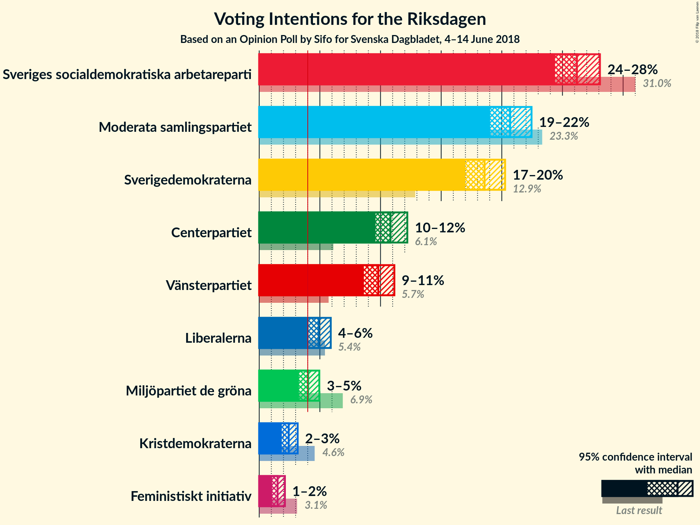
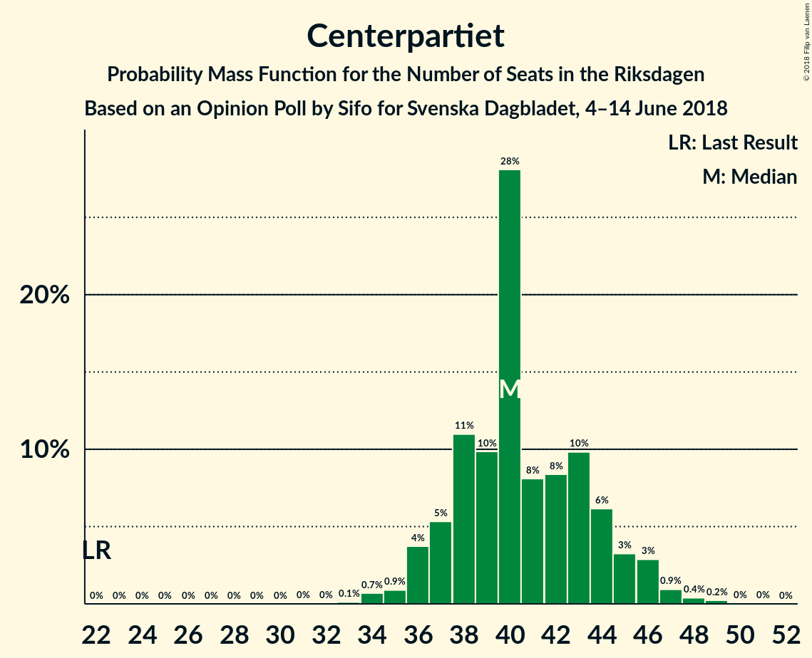
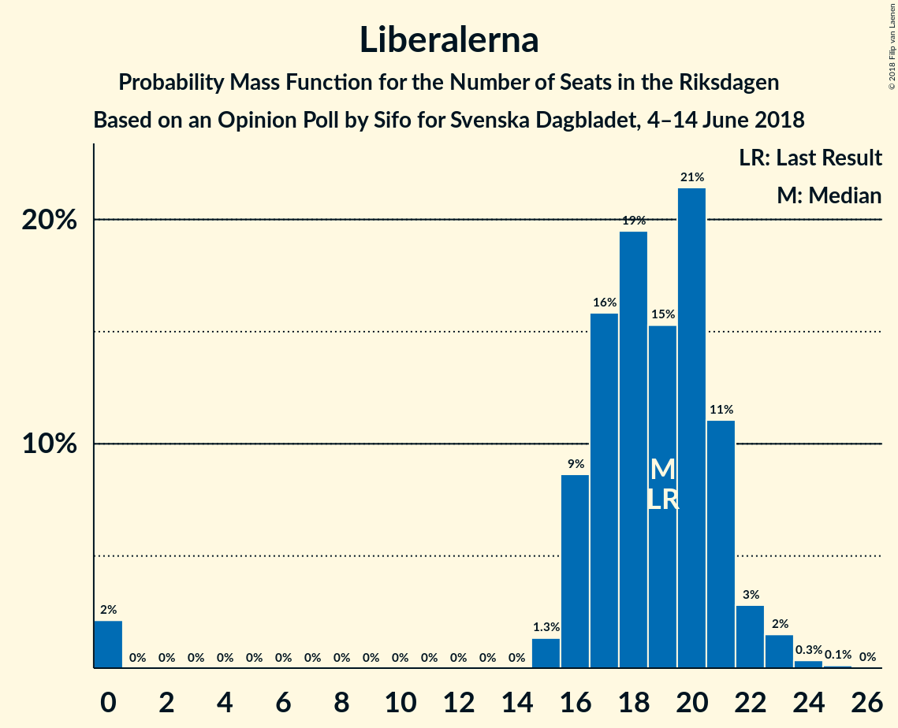
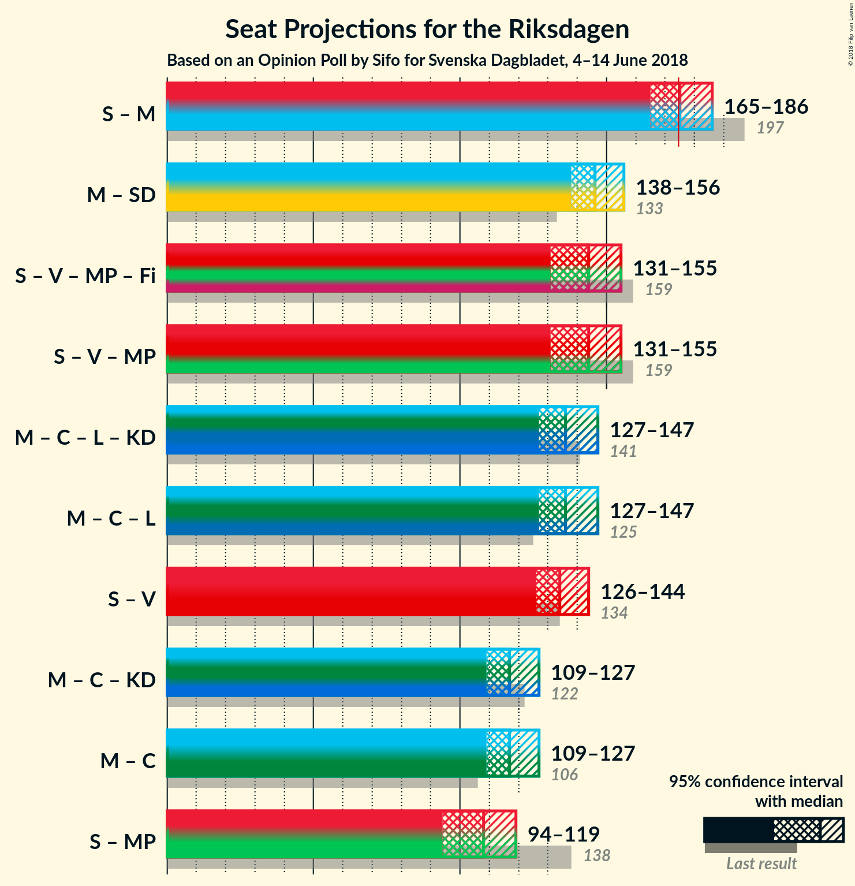

# Opinion Poll by Sifo for Svenska Dagbladet, 4–14 June 2018

<a href="#voting-intentions">Voting Intentions</a> | <a href="#seats">Seats</a> | <a href="#coalitions">Coalitions</a> | <a href="#technical-information">Technical Information</a>

## Voting Intentions

### Confidence Intervals

| Party | Last Result | Poll Result | 80% Confidence Interval | 90% Confidence Interval | 95% Confidence Interval | 99% Confidence Interval |
|:-----:|:-----------:|:-----------:|:-----------------------:|:-----------------------:|:-----------------------:|:-----------------------:|
| Sveriges socialdemokratiska arbetareparti | 31.0% | 26.2% | 25.0–27.4% |24.7–27.8% |24.4–28.1% |23.8–28.7% |
| Moderata samlingspartiet | 23.3% | 20.7% | 19.6–21.8% |19.3–22.2% |19.0–22.5% |18.5–23.0% |
| Sverigedemokraterna | 12.9% | 18.6% | 17.5–19.7% |17.3–20.0% |17.0–20.3% |16.5–20.8% |
| Centerpartiet | 6.1% | 10.8% | 10.0–11.7% |9.8–12.0% |9.6–12.2% |9.2–12.7% |
| Vänsterpartiet | 5.7% | 9.8% | 9.0–10.7% |8.8–10.9% |8.6–11.1% |8.3–11.6% |
| Liberalerna | 5.4% | 4.9% | 4.4–5.6% |4.2–5.7% |4.1–5.9% |3.8–6.2% |
| Miljöpartiet de gröna | 6.9% | 4.0% | 3.5–4.6% |3.4–4.8% |3.3–5.0% |3.1–5.3% |
| Kristdemokraterna | 4.6% | 2.4% | 2.1–2.9% |2.0–3.0% |1.9–3.2% |1.7–3.4% |
| Feministiskt initiativ | 3.1% | 1.5% | 1.2–1.9% |1.1–2.0% |1.1–2.1% |0.9–2.3% |

*Note:* The poll result column reflects the actual value used in the calculations. Published results may vary slightly, and in addition be rounded to fewer digits.

## Seats

### Confidence Intervals

| Party | Last Result | Median | 80% Confidence Interval | 90% Confidence Interval | 95% Confidence Interval | 99% Confidence Interval |
|:-----:|:-----------:|:------:|:-----------------------:|:-----------------------:|:-----------------------:|:-----------------------:|
| <a href="#sveriges-socialdemokratiska-arbetareparti">Sveriges socialdemokratiska arbetareparti</a> | 113 | 97 | 92–103 |91–105 |91–107 |88–108 |
| <a href="#moderata-samlingspartiet">Moderata samlingspartiet</a> | 84 | 77 | 73–82 |72–84 |71–85 |69–87 |
| <a href="#sverigedemokraterna">Sverigedemokraterna</a> | 49 | 69 | 65–74 |64–75 |63–76 |61–78 |
| <a href="#centerpartiet">Centerpartiet</a> | 22 | 40 | 37–44 |36–45 |36–46 |34–48 |
| <a href="#vänsterpartiet">Vänsterpartiet</a> | 21 | 36 | 34–41 |33–41 |32–42 |31–44 |
| <a href="#liberalerna">Liberalerna</a> | 19 | 19 | 16–21 |16–21 |15–22 |0–23 |
| <a href="#miljöpartiet-de-gröna">Miljöpartiet de gröna</a> | 25 | 15 | 0–17 |0–18 |0–18 |0–19 |
| <a href="#kristdemokraterna">Kristdemokraterna</a> | 16 | 0 | 0 |0 |0 |0 |
| <a href="#feministiskt-initiativ">Feministiskt initiativ</a> | 0 | 0 | 0 |0 |0 |0 |

### Sveriges socialdemokratiska arbetareparti

*For a full overview of the results for this party, see the [Sveriges socialdemokratiska arbetareparti](party-sverigessocialdemokratiskaarbetareparti.html) page.*

| Number of Seats | Probability | Accumulated | Special Marks |
|:---------------:|:-----------:|:-----------:|:-------------:|
| 86 | 0.1% | 100% |  |
| 87 | 0.3% | 99.9% |  |
| 88 | 0.4% | 99.6% |  |
| 89 | 0.9% | 99.2% |  |
| 90 | 0.7% | 98% |  |
| 91 | 4% | 98% |  |
| 92 | 4% | 93% |  |
| 93 | 4% | 89% |  |
| 94 | 6% | 85% |  |
| 95 | 18% | 79% |  |
| 96 | 6% | 61% |  |
| 97 | 9% | 56% | Median |
| 98 | 10% | 47% |  |
| 99 | 5% | 36% |  |
| 100 | 6% | 31% |  |
| 101 | 6% | 24% |  |
| 102 | 3% | 19% |  |
| 103 | 8% | 15% |  |
| 104 | 3% | 8% |  |
| 105 | 2% | 5% |  |
| 106 | 0.9% | 4% |  |
| 107 | 2% | 3% |  |
| 108 | 0.3% | 0.7% |  |
| 109 | 0.3% | 0.5% |  |
| 110 | 0.1% | 0.2% |  |
| 111 | 0% | 0.1% |  |
| 112 | 0% | 0.1% |  |
| 113 | 0% | 0.1% | Last Result |
| 114 | 0% | 0% |  |

### Moderata samlingspartiet

*For a full overview of the results for this party, see the [Moderata samlingspartiet](party-moderatasamlingspartiet.html) page.*

| Number of Seats | Probability | Accumulated | Special Marks |
|:---------------:|:-----------:|:-----------:|:-------------:|
| 66 | 0.1% | 100% |  |
| 67 | 0.1% | 99.9% |  |
| 68 | 0.3% | 99.8% |  |
| 69 | 0.7% | 99.5% |  |
| 70 | 1.0% | 98.8% |  |
| 71 | 2% | 98% |  |
| 72 | 4% | 96% |  |
| 73 | 4% | 92% |  |
| 74 | 10% | 87% |  |
| 75 | 9% | 78% |  |
| 76 | 16% | 69% |  |
| 77 | 11% | 52% | Median |
| 78 | 5% | 42% |  |
| 79 | 5% | 37% |  |
| 80 | 8% | 32% |  |
| 81 | 6% | 24% |  |
| 82 | 10% | 18% |  |
| 83 | 2% | 7% |  |
| 84 | 3% | 5% | Last Result |
| 85 | 1.3% | 3% |  |
| 86 | 0.4% | 1.3% |  |
| 87 | 0.4% | 0.9% |  |
| 88 | 0.3% | 0.5% |  |
| 89 | 0.2% | 0.2% |  |
| 90 | 0% | 0.1% |  |
| 91 | 0% | 0% |  |

### Sverigedemokraterna

*For a full overview of the results for this party, see the [Sverigedemokraterna](party-sverigedemokraterna.html) page.*

| Number of Seats | Probability | Accumulated | Special Marks |
|:---------------:|:-----------:|:-----------:|:-------------:|
| 49 | 0% | 100% | Last Result |
| 50 | 0% | 100% |  |
| 51 | 0% | 100% |  |
| 52 | 0% | 100% |  |
| 53 | 0% | 100% |  |
| 54 | 0% | 100% |  |
| 55 | 0% | 100% |  |
| 56 | 0% | 100% |  |
| 57 | 0% | 100% |  |
| 58 | 0.1% | 100% |  |
| 59 | 0.1% | 99.9% |  |
| 60 | 0.3% | 99.8% |  |
| 61 | 0.3% | 99.5% |  |
| 62 | 0.5% | 99.2% |  |
| 63 | 2% | 98.7% |  |
| 64 | 6% | 97% |  |
| 65 | 6% | 90% |  |
| 66 | 18% | 85% |  |
| 67 | 5% | 67% |  |
| 68 | 8% | 62% |  |
| 69 | 4% | 54% | Median |
| 70 | 13% | 49% |  |
| 71 | 8% | 36% |  |
| 72 | 9% | 28% |  |
| 73 | 4% | 19% |  |
| 74 | 9% | 15% |  |
| 75 | 2% | 6% |  |
| 76 | 2% | 4% |  |
| 77 | 1.0% | 2% |  |
| 78 | 0.6% | 1.1% |  |
| 79 | 0.3% | 0.5% |  |
| 80 | 0.1% | 0.2% |  |
| 81 | 0% | 0.1% |  |
| 82 | 0% | 0.1% |  |
| 83 | 0% | 0% |  |

### Centerpartiet

*For a full overview of the results for this party, see the [Centerpartiet](party-centerpartiet.html) page.*

| Number of Seats | Probability | Accumulated | Special Marks |
|:---------------:|:-----------:|:-----------:|:-------------:|
| 22 | 0% | 100% | Last Result |
| 23 | 0% | 100% |  |
| 24 | 0% | 100% |  |
| 25 | 0% | 100% |  |
| 26 | 0% | 100% |  |
| 27 | 0% | 100% |  |
| 28 | 0% | 100% |  |
| 29 | 0% | 100% |  |
| 30 | 0% | 100% |  |
| 31 | 0% | 100% |  |
| 32 | 0% | 100% |  |
| 33 | 0.1% | 100% |  |
| 34 | 0.7% | 99.8% |  |
| 35 | 0.9% | 99.1% |  |
| 36 | 4% | 98% |  |
| 37 | 5% | 95% |  |
| 38 | 11% | 89% |  |
| 39 | 10% | 78% |  |
| 40 | 28% | 68% | Median |
| 41 | 8% | 40% |  |
| 42 | 8% | 32% |  |
| 43 | 10% | 24% |  |
| 44 | 6% | 14% |  |
| 45 | 3% | 8% |  |
| 46 | 3% | 5% |  |
| 47 | 0.9% | 2% |  |
| 48 | 0.4% | 0.7% |  |
| 49 | 0.2% | 0.3% |  |
| 50 | 0% | 0.1% |  |
| 51 | 0% | 0% |  |

### Vänsterpartiet

*For a full overview of the results for this party, see the [Vänsterpartiet](party-vänsterpartiet.html) page.*

| Number of Seats | Probability | Accumulated | Special Marks |
|:---------------:|:-----------:|:-----------:|:-------------:|
| 21 | 0% | 100% | Last Result |
| 22 | 0% | 100% |  |
| 23 | 0% | 100% |  |
| 24 | 0% | 100% |  |
| 25 | 0% | 100% |  |
| 26 | 0% | 100% |  |
| 27 | 0% | 100% |  |
| 28 | 0% | 100% |  |
| 29 | 0.1% | 100% |  |
| 30 | 0.3% | 99.9% |  |
| 31 | 0.9% | 99.6% |  |
| 32 | 3% | 98.7% |  |
| 33 | 4% | 96% |  |
| 34 | 11% | 92% |  |
| 35 | 11% | 82% |  |
| 36 | 26% | 71% | Median |
| 37 | 10% | 45% |  |
| 38 | 16% | 35% |  |
| 39 | 4% | 19% |  |
| 40 | 5% | 15% |  |
| 41 | 7% | 11% |  |
| 42 | 2% | 4% |  |
| 43 | 1.1% | 2% |  |
| 44 | 0.3% | 0.8% |  |
| 45 | 0.4% | 0.5% |  |
| 46 | 0% | 0% |  |

### Liberalerna

*For a full overview of the results for this party, see the [Liberalerna](party-liberalerna.html) page.*

| Number of Seats | Probability | Accumulated | Special Marks |
|:---------------:|:-----------:|:-----------:|:-------------:|
| 0 | 2% | 100% |  |
| 1 | 0% | 98% |  |
| 2 | 0% | 98% |  |
| 3 | 0% | 98% |  |
| 4 | 0% | 98% |  |
| 5 | 0% | 98% |  |
| 6 | 0% | 98% |  |
| 7 | 0% | 98% |  |
| 8 | 0% | 98% |  |
| 9 | 0% | 98% |  |
| 10 | 0% | 98% |  |
| 11 | 0% | 98% |  |
| 12 | 0% | 98% |  |
| 13 | 0% | 98% |  |
| 14 | 0% | 98% |  |
| 15 | 1.3% | 98% |  |
| 16 | 9% | 97% |  |
| 17 | 16% | 88% |  |
| 18 | 19% | 72% |  |
| 19 | 15% | 53% | Last Result, Median |
| 20 | 21% | 37% |  |
| 21 | 11% | 16% |  |
| 22 | 3% | 5% |  |
| 23 | 2% | 2% |  |
| 24 | 0.3% | 0.5% |  |
| 25 | 0.1% | 0.1% |  |
| 26 | 0% | 0% |  |

### Miljöpartiet de gröna

*For a full overview of the results for this party, see the [Miljöpartiet de gröna](party-miljöpartietdegröna.html) page.*

| Number of Seats | Probability | Accumulated | Special Marks |
|:---------------:|:-----------:|:-----------:|:-------------:|
| 0 | 42% | 100% |  |
| 1 | 0% | 58% |  |
| 2 | 0% | 58% |  |
| 3 | 0% | 58% |  |
| 4 | 0% | 58% |  |
| 5 | 0% | 58% |  |
| 6 | 0% | 58% |  |
| 7 | 0% | 58% |  |
| 8 | 0% | 58% |  |
| 9 | 0% | 58% |  |
| 10 | 0% | 58% |  |
| 11 | 0% | 58% |  |
| 12 | 0% | 58% |  |
| 13 | 0% | 58% |  |
| 14 | 0% | 58% |  |
| 15 | 19% | 58% | Median |
| 16 | 25% | 39% |  |
| 17 | 5% | 14% |  |
| 18 | 7% | 9% |  |
| 19 | 1.0% | 1.4% |  |
| 20 | 0.3% | 0.3% |  |
| 21 | 0% | 0% |  |
| 22 | 0% | 0% |  |
| 23 | 0% | 0% |  |
| 24 | 0% | 0% |  |
| 25 | 0% | 0% | Last Result |

### Kristdemokraterna

*For a full overview of the results for this party, see the [Kristdemokraterna](party-kristdemokraterna.html) page.*

| Number of Seats | Probability | Accumulated | Special Marks |
|:---------------:|:-----------:|:-----------:|:-------------:|
| 0 | 100% | 100% | Median |
| 1 | 0% | 0% |  |
| 2 | 0% | 0% |  |
| 3 | 0% | 0% |  |
| 4 | 0% | 0% |  |
| 5 | 0% | 0% |  |
| 6 | 0% | 0% |  |
| 7 | 0% | 0% |  |
| 8 | 0% | 0% |  |
| 9 | 0% | 0% |  |
| 10 | 0% | 0% |  |
| 11 | 0% | 0% |  |
| 12 | 0% | 0% |  |
| 13 | 0% | 0% |  |
| 14 | 0% | 0% |  |
| 15 | 0% | 0% |  |
| 16 | 0% | 0% | Last Result |

### Feministiskt initiativ

*For a full overview of the results for this party, see the [Feministiskt initiativ](party-feministisktinitiativ.html) page.*

| Number of Seats | Probability | Accumulated | Special Marks |
|:---------------:|:-----------:|:-----------:|:-------------:|
| 0 | 100% | 100% | Last Result, Median |

## Coalitions

### Confidence Intervals

| Coalition | Last Result | Median | Majority? | 80% Confidence Interval | 90% Confidence Interval | 95% Confidence Interval | 99% Confidence Interval |
|:---------:|:-----------:|:------:|:---------:|:-----------------------:|:-----------------------:|:-----------------------:|:-----------------------:|
| Sveriges socialdemokratiska arbetareparti – Moderata samlingspartiet | 197 | 175 | 51% | 168–181 | 167–184 | 165–186 | 162–190 |
| Moderata samlingspartiet – Sverigedemokraterna | 133 | 146 | 0% | 140–154 | 138–155 | 138–156 | 134–161 |
| Sveriges socialdemokratiska arbetareparti – Vänsterpartiet – Miljöpartiet de gröna – Feministiskt initiativ | 159 | 144 | 0% | 135–152 | 133–153 | 131–155 | 130–158 |
| Sveriges socialdemokratiska arbetareparti – Vänsterpartiet – Miljöpartiet de gröna | 159 | 144 | 0% | 135–152 | 133–153 | 131–155 | 130–158 |
| Moderata samlingspartiet – Centerpartiet – Liberalerna – Kristdemokraterna | 141 | 136 | 0% | 130–143 | 128–144 | 127–147 | 120–148 |
| Moderata samlingspartiet – Centerpartiet – Liberalerna | 125 | 136 | 0% | 130–143 | 128–144 | 127–147 | 120–148 |
| Sveriges socialdemokratiska arbetareparti – Vänsterpartiet | 134 | 134 | 0% | 128–140 | 126–143 | 126–144 | 123–148 |
| Moderata samlingspartiet – Centerpartiet – Kristdemokraterna | 122 | 117 | 0% | 112–124 | 111–126 | 109–127 | 107–129 |
| Moderata samlingspartiet – Centerpartiet | 106 | 117 | 0% | 112–124 | 111–126 | 109–127 | 107–129 |
| Sveriges socialdemokratiska arbetareparti – Miljöpartiet de gröna | 138 | 108 | 0% | 98–115 | 96–117 | 94–119 | 92–121 |

