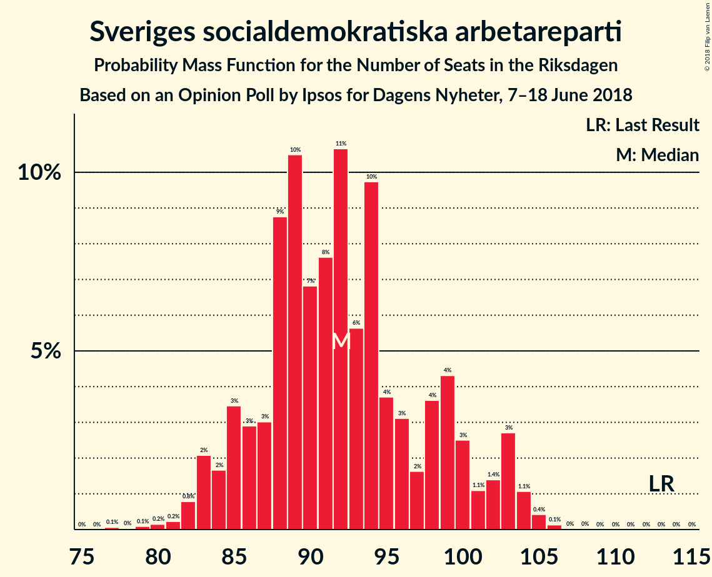
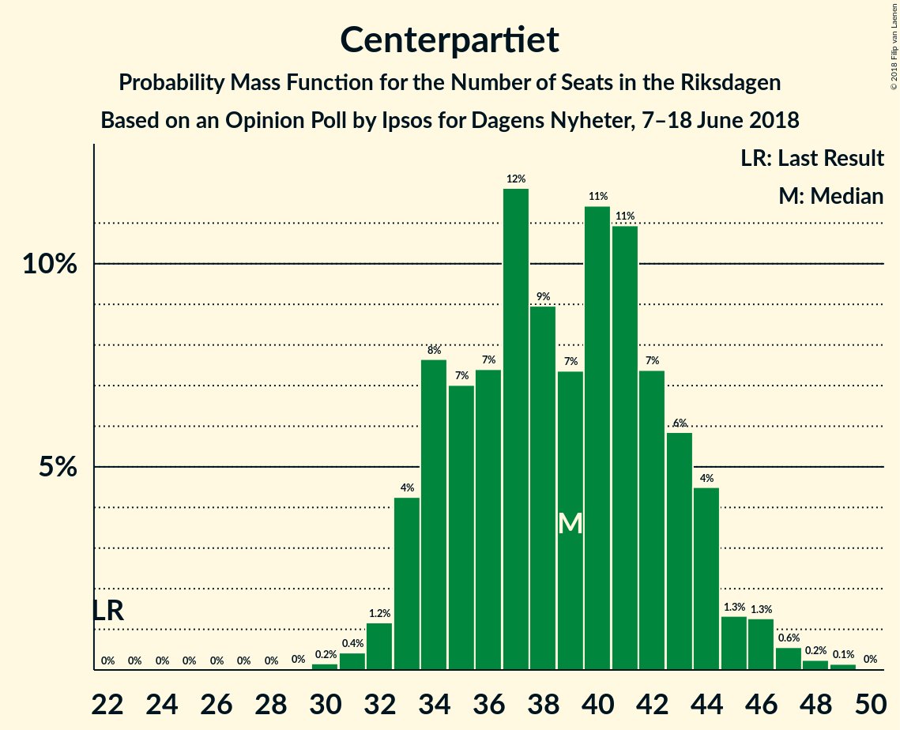

# Opinion Poll by Ipsos for Dagens Nyheter, 7–18 June 2018

<a href="#voting-intentions">Voting Intentions</a> | <a href="#seats">Seats</a> | <a href="#coalitions">Coalitions</a> | <a href="#technical-information">Technical Information</a>

## Voting Intentions

### Confidence Intervals

| Party | Last Result | Poll Result | 80% Confidence Interval | 90% Confidence Interval | 95% Confidence Interval | 99% Confidence Interval |
|:-----:|:-----------:|:-----------:|:-----------------------:|:-----------------------:|:-----------------------:|:-----------------------:|
| Sveriges socialdemokratiska arbetareparti | 31.0% | 24.0% | 22.7–25.3% |22.4–25.7% |22.1–26.0% |21.5–26.7% |
| Sverigedemokraterna | 12.9% | 20.0% | 18.8–21.2% |18.5–21.6% |18.2–21.9% |17.7–22.5% |
| Moderata samlingspartiet | 23.3% | 19.0% | 17.8–20.2% |17.5–20.6% |17.3–20.9% |16.7–21.5% |
| Centerpartiet | 6.1% | 10.0% | 9.2–11.0% |8.9–11.3% |8.7–11.5% |8.3–12.0% |
| Vänsterpartiet | 5.7% | 9.0% | 8.2–9.9% |7.9–10.2% |7.7–10.4% |7.4–10.9% |
| Liberalerna | 5.4% | 6.0% | 5.3–6.8% |5.1–7.0% |5.0–7.2% |4.7–7.6% |
| Miljöpartiet de gröna | 6.9% | 4.0% | 3.4–4.6% |3.3–4.8% |3.2–5.0% |2.9–5.3% |
| Kristdemokraterna | 4.6% | 3.0% | 2.5–3.6% |2.4–3.7% |2.3–3.9% |2.1–4.2% |

*Note:* The poll result column reflects the actual value used in the calculations. Published results may vary slightly, and in addition be rounded to fewer digits.

## Seats

### Confidence Intervals

| Party | Last Result | Median | 80% Confidence Interval | 90% Confidence Interval | 95% Confidence Interval | 99% Confidence Interval |
|:-----:|:-----------:|:------:|:-----------------------:|:-----------------------:|:-----------------------:|:-----------------------:|
| <a href="#sveriges-socialdemokratiska-arbetareparti">Sveriges socialdemokratiska arbetareparti</a> | 113 | 87 | 83–92 |82–94 |80–96 |78–99 |
| <a href="#sverigedemokraterna">Sverigedemokraterna</a> | 49 | 73 | 68–79 |68–80 |66–81 |64–83 |
| <a href="#moderata-samlingspartiet">Moderata samlingspartiet</a> | 84 | 70 | 65–74 |64–76 |63–78 |61–79 |
| <a href="#centerpartiet">Centerpartiet</a> | 22 | 37 | 33–40 |32–41 |32–42 |30–44 |
| <a href="#vänsterpartiet">Vänsterpartiet</a> | 21 | 33 | 30–36 |29–37 |28–38 |27–40 |
| <a href="#liberalerna">Liberalerna</a> | 19 | 23 | 19–24 |18–25 |18–26 |17–28 |
| <a href="#miljöpartiet-de-gröna">Miljöpartiet de gröna</a> | 25 | 15 | 0–16 |0–17 |0–18 |0–19 |
| <a href="#kristdemokraterna">Kristdemokraterna</a> | 16 | 0 | 0 |0 |0 |0–15 |

### Sveriges socialdemokratiska arbetareparti

*For a full overview of the results for this party, see the [Sveriges socialdemokratiska arbetareparti](party-sverigessocialdemokratiskaarbetareparti.html) page.*

| Number of Seats | Probability | Accumulated | Special Marks |
|:---------------:|:-----------:|:-----------:|:-------------:|
| 75 | 0.1% | 100% |  |
| 76 | 0.1% | 99.9% |  |
| 77 | 0.2% | 99.8% |  |
| 78 | 0.4% | 99.6% |  |
| 79 | 0.4% | 99.2% |  |
| 80 | 2% | 98.8% |  |
| 81 | 0.9% | 97% |  |
| 82 | 4% | 96% |  |
| 83 | 5% | 93% |  |
| 84 | 7% | 88% |  |
| 85 | 6% | 81% |  |
| 86 | 18% | 75% |  |
| 87 | 9% | 58% | Median |
| 88 | 11% | 49% |  |
| 89 | 14% | 38% |  |
| 90 | 4% | 24% |  |
| 91 | 10% | 20% |  |
| 92 | 3% | 11% |  |
| 93 | 2% | 8% |  |
| 94 | 2% | 6% |  |
| 95 | 2% | 4% |  |
| 96 | 0.4% | 3% |  |
| 97 | 0.7% | 2% |  |
| 98 | 1.0% | 2% |  |
| 99 | 0.1% | 0.5% |  |
| 100 | 0.2% | 0.4% |  |
| 101 | 0.1% | 0.2% |  |
| 102 | 0% | 0.1% |  |
| 103 | 0% | 0.1% |  |
| 104 | 0% | 0% |  |
| 105 | 0% | 0% |  |
| 106 | 0% | 0% |  |
| 107 | 0% | 0% |  |
| 108 | 0% | 0% |  |
| 109 | 0% | 0% |  |
| 110 | 0% | 0% |  |
| 111 | 0% | 0% |  |
| 112 | 0% | 0% |  |
| 113 | 0% | 0% | Last Result |

### Sverigedemokraterna

*For a full overview of the results for this party, see the [Sverigedemokraterna](party-sverigedemokraterna.html) page.*

| Number of Seats | Probability | Accumulated | Special Marks |
|:---------------:|:-----------:|:-----------:|:-------------:|
| 49 | 0% | 100% | Last Result |
| 50 | 0% | 100% |  |
| 51 | 0% | 100% |  |
| 52 | 0% | 100% |  |
| 53 | 0% | 100% |  |
| 54 | 0% | 100% |  |
| 55 | 0% | 100% |  |
| 56 | 0% | 100% |  |
| 57 | 0% | 100% |  |
| 58 | 0% | 100% |  |
| 59 | 0% | 100% |  |
| 60 | 0% | 100% |  |
| 61 | 0% | 100% |  |
| 62 | 0.2% | 100% |  |
| 63 | 0.2% | 99.8% |  |
| 64 | 0.6% | 99.6% |  |
| 65 | 0.7% | 99.0% |  |
| 66 | 0.9% | 98% |  |
| 67 | 0.9% | 97% |  |
| 68 | 12% | 97% |  |
| 69 | 7% | 85% |  |
| 70 | 8% | 78% |  |
| 71 | 5% | 69% |  |
| 72 | 9% | 64% |  |
| 73 | 6% | 55% | Median |
| 74 | 6% | 49% |  |
| 75 | 10% | 43% |  |
| 76 | 17% | 33% |  |
| 77 | 3% | 16% |  |
| 78 | 2% | 13% |  |
| 79 | 2% | 10% |  |
| 80 | 5% | 8% |  |
| 81 | 2% | 3% |  |
| 82 | 0.5% | 1.3% |  |
| 83 | 0.3% | 0.8% |  |
| 84 | 0.2% | 0.5% |  |
| 85 | 0.1% | 0.2% |  |
| 86 | 0.1% | 0.1% |  |
| 87 | 0% | 0.1% |  |
| 88 | 0% | 0% |  |

### Moderata samlingspartiet

*For a full overview of the results for this party, see the [Moderata samlingspartiet](party-moderatasamlingspartiet.html) page.*

| Number of Seats | Probability | Accumulated | Special Marks |
|:---------------:|:-----------:|:-----------:|:-------------:|
| 58 | 0% | 100% |  |
| 59 | 0.1% | 99.9% |  |
| 60 | 0.3% | 99.8% |  |
| 61 | 0.8% | 99.5% |  |
| 62 | 1.2% | 98.7% |  |
| 63 | 2% | 98% |  |
| 64 | 4% | 96% |  |
| 65 | 5% | 92% |  |
| 66 | 5% | 87% |  |
| 67 | 9% | 82% |  |
| 68 | 12% | 72% |  |
| 69 | 5% | 60% |  |
| 70 | 9% | 55% | Median |
| 71 | 19% | 46% |  |
| 72 | 13% | 27% |  |
| 73 | 3% | 14% |  |
| 74 | 2% | 11% |  |
| 75 | 4% | 9% |  |
| 76 | 2% | 6% |  |
| 77 | 1.4% | 4% |  |
| 78 | 2% | 3% |  |
| 79 | 0.8% | 1.1% |  |
| 80 | 0.1% | 0.3% |  |
| 81 | 0.1% | 0.1% |  |
| 82 | 0% | 0.1% |  |
| 83 | 0% | 0% |  |
| 84 | 0% | 0% | Last Result |

### Centerpartiet

*For a full overview of the results for this party, see the [Centerpartiet](party-centerpartiet.html) page.*

| Number of Seats | Probability | Accumulated | Special Marks |
|:---------------:|:-----------:|:-----------:|:-------------:|
| 22 | 0% | 100% | Last Result |
| 23 | 0% | 100% |  |
| 24 | 0% | 100% |  |
| 25 | 0% | 100% |  |
| 26 | 0% | 100% |  |
| 27 | 0% | 100% |  |
| 28 | 0% | 100% |  |
| 29 | 0.1% | 99.9% |  |
| 30 | 0.7% | 99.9% |  |
| 31 | 1.2% | 99.2% |  |
| 32 | 4% | 98% |  |
| 33 | 5% | 94% |  |
| 34 | 8% | 89% |  |
| 35 | 14% | 81% |  |
| 36 | 15% | 68% |  |
| 37 | 16% | 53% | Median |
| 38 | 9% | 38% |  |
| 39 | 15% | 28% |  |
| 40 | 5% | 13% |  |
| 41 | 4% | 8% |  |
| 42 | 2% | 4% |  |
| 43 | 0.7% | 2% |  |
| 44 | 0.6% | 0.9% |  |
| 45 | 0.2% | 0.3% |  |
| 46 | 0.1% | 0.1% |  |
| 47 | 0% | 0% |  |

### Vänsterpartiet

*For a full overview of the results for this party, see the [Vänsterpartiet](party-vänsterpartiet.html) page.*

| Number of Seats | Probability | Accumulated | Special Marks |
|:---------------:|:-----------:|:-----------:|:-------------:|
| 21 | 0% | 100% | Last Result |
| 22 | 0% | 100% |  |
| 23 | 0% | 100% |  |
| 24 | 0% | 100% |  |
| 25 | 0.1% | 100% |  |
| 26 | 0.3% | 99.9% |  |
| 27 | 0.7% | 99.6% |  |
| 28 | 2% | 98.9% |  |
| 29 | 4% | 97% |  |
| 30 | 6% | 93% |  |
| 31 | 10% | 87% |  |
| 32 | 17% | 77% |  |
| 33 | 17% | 60% | Median |
| 34 | 18% | 42% |  |
| 35 | 11% | 24% |  |
| 36 | 6% | 13% |  |
| 37 | 3% | 6% |  |
| 38 | 2% | 3% |  |
| 39 | 0.9% | 1.4% |  |
| 40 | 0.3% | 0.6% |  |
| 41 | 0.2% | 0.2% |  |
| 42 | 0.1% | 0.1% |  |
| 43 | 0% | 0% |  |

### Liberalerna

*For a full overview of the results for this party, see the [Liberalerna](party-liberalerna.html) page.*

| Number of Seats | Probability | Accumulated | Special Marks |
|:---------------:|:-----------:|:-----------:|:-------------:|
| 16 | 0.1% | 100% |  |
| 17 | 0.9% | 99.9% |  |
| 18 | 5% | 99.0% |  |
| 19 | 6% | 94% | Last Result |
| 20 | 10% | 88% |  |
| 21 | 11% | 78% |  |
| 22 | 15% | 67% |  |
| 23 | 26% | 53% | Median |
| 24 | 18% | 27% |  |
| 25 | 5% | 9% |  |
| 26 | 3% | 4% |  |
| 27 | 0.8% | 1.4% |  |
| 28 | 0.3% | 0.6% |  |
| 29 | 0.2% | 0.3% |  |
| 30 | 0.1% | 0.1% |  |
| 31 | 0% | 0% |  |

### Miljöpartiet de gröna

*For a full overview of the results for this party, see the [Miljöpartiet de gröna](party-miljöpartietdegröna.html) page.*

| Number of Seats | Probability | Accumulated | Special Marks |
|:---------------:|:-----------:|:-----------:|:-------------:|
| 0 | 48% | 100% |  |
| 1 | 0% | 52% |  |
| 2 | 0% | 52% |  |
| 3 | 0% | 52% |  |
| 4 | 0% | 52% |  |
| 5 | 0% | 52% |  |
| 6 | 0% | 52% |  |
| 7 | 0% | 52% |  |
| 8 | 0% | 52% |  |
| 9 | 0% | 52% |  |
| 10 | 0% | 52% |  |
| 11 | 0% | 52% |  |
| 12 | 0% | 52% |  |
| 13 | 0% | 52% |  |
| 14 | 2% | 52% |  |
| 15 | 25% | 50% | Median |
| 16 | 17% | 25% |  |
| 17 | 3% | 8% |  |
| 18 | 4% | 5% |  |
| 19 | 1.1% | 1.3% |  |
| 20 | 0.1% | 0.2% |  |
| 21 | 0% | 0.1% |  |
| 22 | 0% | 0% |  |
| 23 | 0% | 0% |  |
| 24 | 0% | 0% |  |
| 25 | 0% | 0% | Last Result |

### Kristdemokraterna

*For a full overview of the results for this party, see the [Kristdemokraterna](party-kristdemokraterna.html) page.*

| Number of Seats | Probability | Accumulated | Special Marks |
|:---------------:|:-----------:|:-----------:|:-------------:|
| 0 | 98.6% | 100% | Median |
| 1 | 0% | 1.4% |  |
| 2 | 0% | 1.4% |  |
| 3 | 0% | 1.4% |  |
| 4 | 0% | 1.4% |  |
| 5 | 0% | 1.4% |  |
| 6 | 0% | 1.4% |  |
| 7 | 0% | 1.4% |  |
| 8 | 0% | 1.4% |  |
| 9 | 0% | 1.4% |  |
| 10 | 0% | 1.4% |  |
| 11 | 0% | 1.4% |  |
| 12 | 0% | 1.4% |  |
| 13 | 0% | 1.4% |  |
| 14 | 0.4% | 1.4% |  |
| 15 | 0.8% | 0.9% |  |
| 16 | 0.1% | 0.1% | Last Result |
| 17 | 0% | 0% |  |

## Coalitions

### Confidence Intervals

| Coalition | Last Result | Median | Majority? | 80% Confidence Interval | 90% Confidence Interval | 95% Confidence Interval | 99% Confidence Interval |
|:---------:|:-----------:|:------:|:---------:|:-----------------------:|:-----------------------:|:-----------------------:|:-----------------------:|
| Sveriges socialdemokratiska arbetareparti – Vänsterpartiet – Miljöpartiet de gröna | 159 | 129 | 0% | 119–138 | 118–139 | 116–140 | 114–144 |
| Moderata samlingspartiet – Centerpartiet – Liberalerna – Kristdemokraterna | 141 | 129 | 0% | 122–135 | 120–138 | 119–139 | 117–143 |
| Moderata samlingspartiet – Centerpartiet – Liberalerna | 125 | 128 | 0% | 122–135 | 120–137 | 119–139 | 116–142 |
| Sveriges socialdemokratiska arbetareparti – Vänsterpartiet | 134 | 120 | 0% | 115–127 | 113–128 | 111–130 | 109–134 |
| Moderata samlingspartiet – Centerpartiet – Kristdemokraterna | 122 | 107 | 0% | 100–112 | 99–115 | 98–116 | 96–120 |
| Moderata samlingspartiet – Centerpartiet | 106 | 107 | 0% | 100–112 | 99–114 | 98–115 | 96–119 |
| Sveriges socialdemokratiska arbetareparti – Miljöpartiet de gröna | 138 | 97 | 0% | 86–104 | 86–106 | 84–107 | 82–111 |

### Sveriges socialdemokratiska arbetareparti – Vänsterpartiet – Miljöpartiet de gröna

| Number of Seats | Probability | Accumulated | Special Marks |
|:---------------:|:-----------:|:-----------:|:-------------:|
| 111 | 0% | 100% |  |
| 112 | 0.2% | 99.9% |  |
| 113 | 0.2% | 99.7% |  |
| 114 | 0.6% | 99.5% |  |
| 115 | 0.2% | 98.9% |  |
| 116 | 1.4% | 98.7% |  |
| 117 | 1.1% | 97% |  |
| 118 | 2% | 96% |  |
| 119 | 5% | 95% |  |
| 120 | 4% | 89% |  |
| 121 | 3% | 85% |  |
| 122 | 3% | 82% |  |
| 123 | 10% | 79% |  |
| 124 | 2% | 69% |  |
| 125 | 3% | 66% |  |
| 126 | 3% | 63% |  |
| 127 | 5% | 61% |  |
| 128 | 3% | 56% |  |
| 129 | 4% | 53% |  |
| 130 | 3% | 50% |  |
| 131 | 3% | 46% |  |
| 132 | 6% | 43% |  |
| 133 | 4% | 37% |  |
| 134 | 9% | 33% |  |
| 135 | 7% | 24% | Median |
| 136 | 5% | 17% |  |
| 137 | 2% | 12% |  |
| 138 | 3% | 10% |  |
| 139 | 5% | 8% |  |
| 140 | 1.3% | 3% |  |
| 141 | 0.6% | 2% |  |
| 142 | 0.3% | 1.3% |  |
| 143 | 0.4% | 1.0% |  |
| 144 | 0.2% | 0.6% |  |
| 145 | 0.1% | 0.3% |  |
| 146 | 0% | 0.2% |  |
| 147 | 0% | 0.1% |  |
| 148 | 0.1% | 0.1% |  |
| 149 | 0% | 0% |  |
| 150 | 0% | 0% |  |
| 151 | 0% | 0% |  |
| 152 | 0% | 0% |  |
| 153 | 0% | 0% |  |
| 154 | 0% | 0% |  |
| 155 | 0% | 0% |  |
| 156 | 0% | 0% |  |
| 157 | 0% | 0% |  |
| 158 | 0% | 0% |  |
| 159 | 0% | 0% | Last Result |

### Moderata samlingspartiet – Centerpartiet – Liberalerna – Kristdemokraterna

| Number of Seats | Probability | Accumulated | Special Marks |
|:---------------:|:-----------:|:-----------:|:-------------:|
| 114 | 0.1% | 100% |  |
| 115 | 0.1% | 99.9% |  |
| 116 | 0.3% | 99.8% |  |
| 117 | 0.6% | 99.5% |  |
| 118 | 0.7% | 99.0% |  |
| 119 | 1.5% | 98% |  |
| 120 | 2% | 97% |  |
| 121 | 3% | 95% |  |
| 122 | 3% | 92% |  |
| 123 | 5% | 89% |  |
| 124 | 4% | 83% |  |
| 125 | 7% | 80% |  |
| 126 | 8% | 73% |  |
| 127 | 7% | 65% |  |
| 128 | 7% | 58% |  |
| 129 | 5% | 51% |  |
| 130 | 8% | 46% | Median |
| 131 | 9% | 37% |  |
| 132 | 6% | 28% |  |
| 133 | 2% | 22% |  |
| 134 | 3% | 20% |  |
| 135 | 8% | 17% |  |
| 136 | 3% | 9% |  |
| 137 | 1.0% | 6% |  |
| 138 | 1.2% | 5% |  |
| 139 | 2% | 4% |  |
| 140 | 0.5% | 2% |  |
| 141 | 0.7% | 2% | Last Result |
| 142 | 0.5% | 1.0% |  |
| 143 | 0.2% | 0.5% |  |
| 144 | 0.1% | 0.3% |  |
| 145 | 0.1% | 0.2% |  |
| 146 | 0.1% | 0.2% |  |
| 147 | 0.1% | 0.1% |  |
| 148 | 0% | 0% |  |

### Moderata samlingspartiet – Centerpartiet – Liberalerna

| Number of Seats | Probability | Accumulated | Special Marks |
|:---------------:|:-----------:|:-----------:|:-------------:|
| 113 | 0% | 100% |  |
| 114 | 0.1% | 99.9% |  |
| 115 | 0.1% | 99.8% |  |
| 116 | 0.3% | 99.7% |  |
| 117 | 0.6% | 99.4% |  |
| 118 | 0.7% | 98.8% |  |
| 119 | 2% | 98% |  |
| 120 | 2% | 97% |  |
| 121 | 3% | 94% |  |
| 122 | 4% | 92% |  |
| 123 | 5% | 88% |  |
| 124 | 4% | 83% |  |
| 125 | 7% | 79% | Last Result |
| 126 | 8% | 72% |  |
| 127 | 7% | 64% |  |
| 128 | 7% | 57% |  |
| 129 | 5% | 49% |  |
| 130 | 8% | 45% | Median |
| 131 | 9% | 36% |  |
| 132 | 6% | 27% |  |
| 133 | 2% | 21% |  |
| 134 | 3% | 19% |  |
| 135 | 7% | 16% |  |
| 136 | 3% | 8% |  |
| 137 | 0.9% | 5% |  |
| 138 | 1.1% | 5% |  |
| 139 | 2% | 3% |  |
| 140 | 0.4% | 2% |  |
| 141 | 0.4% | 1.2% |  |
| 142 | 0.4% | 0.7% |  |
| 143 | 0.2% | 0.3% |  |
| 144 | 0% | 0.2% |  |
| 145 | 0% | 0.1% |  |
| 146 | 0% | 0.1% |  |
| 147 | 0% | 0% |  |

### Sveriges socialdemokratiska arbetareparti – Vänsterpartiet

| Number of Seats | Probability | Accumulated | Special Marks |
|:---------------:|:-----------:|:-----------:|:-------------:|
| 106 | 0% | 100% |  |
| 107 | 0.1% | 99.9% |  |
| 108 | 0.2% | 99.8% |  |
| 109 | 0.2% | 99.7% |  |
| 110 | 1.1% | 99.4% |  |
| 111 | 1.0% | 98% |  |
| 112 | 1.4% | 97% |  |
| 113 | 2% | 96% |  |
| 114 | 3% | 94% |  |
| 115 | 3% | 91% |  |
| 116 | 5% | 88% |  |
| 117 | 7% | 82% |  |
| 118 | 4% | 76% |  |
| 119 | 14% | 72% |  |
| 120 | 11% | 58% | Median |
| 121 | 6% | 46% |  |
| 122 | 5% | 40% |  |
| 123 | 12% | 35% |  |
| 124 | 6% | 23% |  |
| 125 | 4% | 17% |  |
| 126 | 2% | 13% |  |
| 127 | 4% | 10% |  |
| 128 | 2% | 7% |  |
| 129 | 2% | 5% |  |
| 130 | 0.8% | 3% |  |
| 131 | 0.6% | 2% |  |
| 132 | 0.7% | 2% |  |
| 133 | 0.5% | 1.0% |  |
| 134 | 0.2% | 0.5% | Last Result |
| 135 | 0.2% | 0.4% |  |
| 136 | 0% | 0.1% |  |
| 137 | 0% | 0.1% |  |
| 138 | 0% | 0.1% |  |
| 139 | 0% | 0% |  |

### Moderata samlingspartiet – Centerpartiet – Kristdemokraterna

| Number of Seats | Probability | Accumulated | Special Marks |
|:---------------:|:-----------:|:-----------:|:-------------:|
| 93 | 0.1% | 100% |  |
| 94 | 0.2% | 99.9% |  |
| 95 | 0.1% | 99.7% |  |
| 96 | 0.5% | 99.6% |  |
| 97 | 1.0% | 99.1% |  |
| 98 | 2% | 98% |  |
| 99 | 2% | 96% |  |
| 100 | 4% | 94% |  |
| 101 | 3% | 89% |  |
| 102 | 3% | 86% |  |
| 103 | 12% | 83% |  |
| 104 | 3% | 72% |  |
| 105 | 9% | 68% |  |
| 106 | 7% | 59% |  |
| 107 | 9% | 52% | Median |
| 108 | 14% | 43% |  |
| 109 | 4% | 29% |  |
| 110 | 4% | 25% |  |
| 111 | 6% | 21% |  |
| 112 | 5% | 15% |  |
| 113 | 3% | 10% |  |
| 114 | 1.4% | 7% |  |
| 115 | 2% | 5% |  |
| 116 | 1.1% | 3% |  |
| 117 | 0.7% | 2% |  |
| 118 | 0.3% | 1.5% |  |
| 119 | 0.4% | 1.1% |  |
| 120 | 0.3% | 0.7% |  |
| 121 | 0.1% | 0.4% |  |
| 122 | 0.1% | 0.3% | Last Result |
| 123 | 0.1% | 0.2% |  |
| 124 | 0% | 0.2% |  |
| 125 | 0.1% | 0.1% |  |
| 126 | 0.1% | 0.1% |  |
| 127 | 0% | 0% |  |

### Moderata samlingspartiet – Centerpartiet

| Number of Seats | Probability | Accumulated | Special Marks |
|:---------------:|:-----------:|:-----------:|:-------------:|
| 93 | 0.1% | 100% |  |
| 94 | 0.2% | 99.9% |  |
| 95 | 0.2% | 99.7% |  |
| 96 | 0.6% | 99.5% |  |
| 97 | 1.0% | 98.9% |  |
| 98 | 2% | 98% |  |
| 99 | 3% | 96% |  |
| 100 | 4% | 93% |  |
| 101 | 3% | 89% |  |
| 102 | 3% | 86% |  |
| 103 | 12% | 83% |  |
| 104 | 4% | 71% |  |
| 105 | 10% | 67% |  |
| 106 | 7% | 58% | Last Result |
| 107 | 9% | 51% | Median |
| 108 | 14% | 42% |  |
| 109 | 4% | 28% |  |
| 110 | 4% | 23% |  |
| 111 | 6% | 19% |  |
| 112 | 5% | 13% |  |
| 113 | 3% | 9% |  |
| 114 | 1.3% | 6% |  |
| 115 | 2% | 5% |  |
| 116 | 1.0% | 2% |  |
| 117 | 0.7% | 1.4% |  |
| 118 | 0.2% | 0.8% |  |
| 119 | 0.3% | 0.5% |  |
| 120 | 0.1% | 0.2% |  |
| 121 | 0% | 0.1% |  |
| 122 | 0% | 0.1% |  |
| 123 | 0% | 0% |  |

### Sveriges socialdemokratiska arbetareparti – Miljöpartiet de gröna

| Number of Seats | Probability | Accumulated | Special Marks |
|:---------------:|:-----------:|:-----------:|:-------------:|
| 79 | 0% | 100% |  |
| 80 | 0.1% | 99.9% |  |
| 81 | 0.2% | 99.8% |  |
| 82 | 0.4% | 99.6% |  |
| 83 | 1.0% | 99.1% |  |
| 84 | 1.4% | 98% |  |
| 85 | 1.4% | 97% |  |
| 86 | 8% | 95% |  |
| 87 | 3% | 87% |  |
| 88 | 5% | 85% |  |
| 89 | 9% | 79% |  |
| 90 | 2% | 70% |  |
| 91 | 8% | 68% |  |
| 92 | 2% | 60% |  |
| 93 | 2% | 59% |  |
| 94 | 2% | 57% |  |
| 95 | 2% | 55% |  |
| 96 | 2% | 53% |  |
| 97 | 2% | 52% |  |
| 98 | 4% | 50% |  |
| 99 | 3% | 45% |  |
| 100 | 7% | 42% |  |
| 101 | 6% | 35% |  |
| 102 | 7% | 29% | Median |
| 103 | 8% | 22% |  |
| 104 | 6% | 14% |  |
| 105 | 3% | 8% |  |
| 106 | 2% | 5% |  |
| 107 | 0.7% | 3% |  |
| 108 | 0.5% | 2% |  |
| 109 | 0.6% | 1.4% |  |
| 110 | 0.2% | 0.8% |  |
| 111 | 0.3% | 0.7% |  |
| 112 | 0.1% | 0.3% |  |
| 113 | 0.1% | 0.2% |  |
| 114 | 0% | 0.1% |  |
| 115 | 0% | 0% |  |
| 116 | 0% | 0% |  |
| 117 | 0% | 0% |  |
| 118 | 0% | 0% |  |
| 119 | 0% | 0% |  |
| 120 | 0% | 0% |  |
| 121 | 0% | 0% |  |
| 122 | 0% | 0% |  |
| 123 | 0% | 0% |  |
| 124 | 0% | 0% |  |
| 125 | 0% | 0% |  |
| 126 | 0% | 0% |  |
| 127 | 0% | 0% |  |
| 128 | 0% | 0% |  |
| 129 | 0% | 0% |  |
| 130 | 0% | 0% |  |
| 131 | 0% | 0% |  |
| 132 | 0% | 0% |  |
| 133 | 0% | 0% |  |
| 134 | 0% | 0% |  |
| 135 | 0% | 0% |  |
| 136 | 0% | 0% |  |
| 137 | 0% | 0% |  |
| 138 | 0% | 0% | Last Result |

## Technical Information

### Opinion Poll

+ **Polling firm:** Ipsos
+ **Commissioner(s):** Dagens Nyheter
+ **Fieldwork period:** 7–18 June 2018

### Calculations

+ **Sample size:** 1805
+ **Simulations done:** 524,288
+ **Error estimate:** 0.66%

