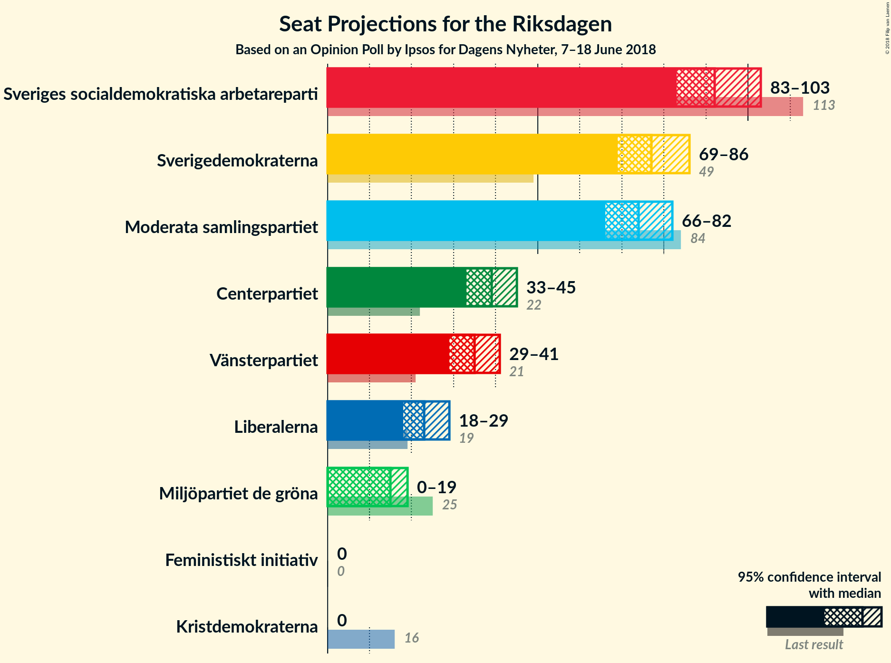

# Opinion Poll by Ipsos for Dagens Nyheter, 7–18 June 2018

<a href="#voting-intentions">Voting Intentions</a> | <a href="#seats">Seats</a> | <a href="#coalitions">Coalitions</a> | <a href="#technical-information">Technical Information</a>

## Voting Intentions

### Confidence Intervals

| Party | Last Result | Poll Result | 80% Confidence Interval | 90% Confidence Interval | 95% Confidence Interval | 99% Confidence Interval |
|:-----:|:-----------:|:-----------:|:-----------------------:|:-----------------------:|:-----------------------:|:-----------------------:|
| Sveriges socialdemokratiska arbetareparti | 31.0% | 24.0% | 22.7–25.3% |22.4–25.7% |22.1–26.0% |21.5–26.7% |
| Sverigedemokraterna | 12.9% | 20.0% | 18.8–21.2% |18.5–21.6% |18.2–21.9% |17.7–22.5% |
| Moderata samlingspartiet | 23.3% | 19.0% | 17.8–20.2% |17.5–20.6% |17.3–20.9% |16.7–21.5% |
| Centerpartiet | 6.1% | 10.0% | 9.2–11.0% |8.9–11.3% |8.7–11.5% |8.3–12.0% |
| Vänsterpartiet | 5.7% | 9.0% | 8.2–9.9% |7.9–10.2% |7.7–10.4% |7.4–10.9% |
| Liberalerna | 5.4% | 6.0% | 5.3–6.8% |5.1–7.0% |5.0–7.2% |4.7–7.6% |
| Miljöpartiet de gröna | 6.9% | 4.0% | 3.4–4.6% |3.3–4.8% |3.2–5.0% |2.9–5.3% |
| Kristdemokraterna | 4.6% | 3.0% | 2.5–3.6% |2.4–3.7% |2.3–3.9% |2.1–4.2% |
| Feministiskt initiativ | 3.1% | 2.0% | 1.6–2.5% |1.5–2.6% |1.4–2.8% |1.3–3.0% |

*Note:* The poll result column reflects the actual value used in the calculations. Published results may vary slightly, and in addition be rounded to fewer digits.

## Seats

### Confidence Intervals

| Party | Last Result | Median | 80% Confidence Interval | 90% Confidence Interval | 95% Confidence Interval | 99% Confidence Interval |
|:-----:|:-----------:|:------:|:-----------------------:|:-----------------------:|:-----------------------:|:-----------------------:|
| <a href="#sveriges-socialdemokratiska-arbetareparti">Sveriges socialdemokratiska arbetareparti</a> | 113 | 92 | 86–99 |84–102 |83–103 |81–105 |
| <a href="#sverigedemokraterna">Sverigedemokraterna</a> | 49 | 77 | 72–83 |70–84 |69–86 |66–90 |
| <a href="#moderata-samlingspartiet">Moderata samlingspartiet</a> | 84 | 74 | 68–78 |67–80 |66–82 |63–85 |
| <a href="#centerpartiet">Centerpartiet</a> | 22 | 39 | 34–43 |33–44 |33–45 |31–47 |
| <a href="#vänsterpartiet">Vänsterpartiet</a> | 21 | 35 | 31–39 |30–40 |29–41 |28–43 |
| <a href="#liberalerna">Liberalerna</a> | 19 | 23 | 20–27 |19–28 |18–29 |17–31 |
| <a href="#miljöpartiet-de-gröna">Miljöpartiet de gröna</a> | 25 | 15 | 0–18 |0–18 |0–19 |0–20 |
| <a href="#kristdemokraterna">Kristdemokraterna</a> | 16 | 0 | 0 |0 |0 |0–16 |
| <a href="#feministiskt-initiativ">Feministiskt initiativ</a> | 0 | 0 | 0 |0 |0 |0 |

### Sveriges socialdemokratiska arbetareparti

*For a full overview of the results for this party, see the [Sveriges socialdemokratiska arbetareparti](party-sverigessocialdemokratiskaarbetareparti.html) page.*

| Number of Seats | Probability | Accumulated | Special Marks |
|:---------------:|:-----------:|:-----------:|:-------------:|
| 77 | 0.1% | 100% |  |
| 78 | 0% | 99.9% |  |
| 79 | 0.1% | 99.9% |  |
| 80 | 0.2% | 99.8% |  |
| 81 | 0.2% | 99.7% |  |
| 82 | 0.8% | 99.4% |  |
| 83 | 2% | 98.6% |  |
| 84 | 2% | 97% |  |
| 85 | 3% | 95% |  |
| 86 | 3% | 91% |  |
| 87 | 3% | 89% |  |
| 88 | 9% | 86% |  |
| 89 | 10% | 77% |  |
| 90 | 7% | 66% |  |
| 91 | 8% | 59% |  |
| 92 | 11% | 52% | Median |
| 93 | 6% | 41% |  |
| 94 | 10% | 36% |  |
| 95 | 4% | 26% |  |
| 96 | 3% | 22% |  |
| 97 | 2% | 19% |  |
| 98 | 4% | 17% |  |
| 99 | 4% | 14% |  |
| 100 | 3% | 9% |  |
| 101 | 1.1% | 7% |  |
| 102 | 1.4% | 6% |  |
| 103 | 3% | 4% |  |
| 104 | 1.1% | 2% |  |
| 105 | 0.4% | 0.6% |  |
| 106 | 0.1% | 0.2% |  |
| 107 | 0% | 0% |  |
| 108 | 0% | 0% |  |
| 109 | 0% | 0% |  |
| 110 | 0% | 0% |  |
| 111 | 0% | 0% |  |
| 112 | 0% | 0% |  |
| 113 | 0% | 0% | Last Result |

### Sverigedemokraterna

*For a full overview of the results for this party, see the [Sverigedemokraterna](party-sverigedemokraterna.html) page.*

| Number of Seats | Probability | Accumulated | Special Marks |
|:---------------:|:-----------:|:-----------:|:-------------:|
| 49 | 0% | 100% | Last Result |
| 50 | 0% | 100% |  |
| 51 | 0% | 100% |  |
| 52 | 0% | 100% |  |
| 53 | 0% | 100% |  |
| 54 | 0% | 100% |  |
| 55 | 0% | 100% |  |
| 56 | 0% | 100% |  |
| 57 | 0% | 100% |  |
| 58 | 0% | 100% |  |
| 59 | 0% | 100% |  |
| 60 | 0% | 100% |  |
| 61 | 0% | 100% |  |
| 62 | 0% | 100% |  |
| 63 | 0% | 100% |  |
| 64 | 0.1% | 100% |  |
| 65 | 0.3% | 99.9% |  |
| 66 | 0.1% | 99.6% |  |
| 67 | 0.8% | 99.5% |  |
| 68 | 0.8% | 98.7% |  |
| 69 | 1.2% | 98% |  |
| 70 | 3% | 97% |  |
| 71 | 3% | 93% |  |
| 72 | 6% | 91% |  |
| 73 | 3% | 85% |  |
| 74 | 9% | 81% |  |
| 75 | 8% | 72% |  |
| 76 | 9% | 64% |  |
| 77 | 10% | 55% | Median |
| 78 | 9% | 44% |  |
| 79 | 7% | 36% |  |
| 80 | 4% | 29% |  |
| 81 | 6% | 25% |  |
| 82 | 6% | 19% |  |
| 83 | 5% | 13% |  |
| 84 | 4% | 9% |  |
| 85 | 1.4% | 4% |  |
| 86 | 1.1% | 3% |  |
| 87 | 0.3% | 2% |  |
| 88 | 0.5% | 2% |  |
| 89 | 0.5% | 1.1% |  |
| 90 | 0.4% | 0.6% |  |
| 91 | 0.1% | 0.2% |  |
| 92 | 0% | 0.1% |  |
| 93 | 0% | 0% |  |

### Moderata samlingspartiet

*For a full overview of the results for this party, see the [Moderata samlingspartiet](party-moderatasamlingspartiet.html) page.*

| Number of Seats | Probability | Accumulated | Special Marks |
|:---------------:|:-----------:|:-----------:|:-------------:|
| 60 | 0% | 100% |  |
| 61 | 0.1% | 99.9% |  |
| 62 | 0.2% | 99.9% |  |
| 63 | 0.3% | 99.7% |  |
| 64 | 0.7% | 99.4% |  |
| 65 | 1.0% | 98.7% |  |
| 66 | 1.3% | 98% |  |
| 67 | 2% | 96% |  |
| 68 | 7% | 94% |  |
| 69 | 9% | 87% |  |
| 70 | 5% | 79% |  |
| 71 | 10% | 73% |  |
| 72 | 6% | 64% |  |
| 73 | 7% | 57% |  |
| 74 | 12% | 50% | Median |
| 75 | 7% | 38% |  |
| 76 | 7% | 31% |  |
| 77 | 9% | 24% |  |
| 78 | 5% | 15% |  |
| 79 | 2% | 10% |  |
| 80 | 3% | 7% |  |
| 81 | 2% | 5% |  |
| 82 | 0.9% | 3% |  |
| 83 | 0.8% | 2% |  |
| 84 | 0.7% | 1.3% | Last Result |
| 85 | 0.2% | 0.5% |  |
| 86 | 0.2% | 0.4% |  |
| 87 | 0.2% | 0.2% |  |
| 88 | 0% | 0% |  |

### Centerpartiet

*For a full overview of the results for this party, see the [Centerpartiet](party-centerpartiet.html) page.*

| Number of Seats | Probability | Accumulated | Special Marks |
|:---------------:|:-----------:|:-----------:|:-------------:|
| 22 | 0% | 100% | Last Result |
| 23 | 0% | 100% |  |
| 24 | 0% | 100% |  |
| 25 | 0% | 100% |  |
| 26 | 0% | 100% |  |
| 27 | 0% | 100% |  |
| 28 | 0% | 100% |  |
| 29 | 0% | 100% |  |
| 30 | 0.2% | 100% |  |
| 31 | 0.4% | 99.8% |  |
| 32 | 1.2% | 99.4% |  |
| 33 | 4% | 98% |  |
| 34 | 8% | 94% |  |
| 35 | 7% | 86% |  |
| 36 | 7% | 79% |  |
| 37 | 12% | 72% |  |
| 38 | 9% | 60% |  |
| 39 | 7% | 51% | Median |
| 40 | 11% | 44% |  |
| 41 | 11% | 32% |  |
| 42 | 7% | 21% |  |
| 43 | 6% | 14% |  |
| 44 | 4% | 8% |  |
| 45 | 1.3% | 4% |  |
| 46 | 1.3% | 2% |  |
| 47 | 0.6% | 1.0% |  |
| 48 | 0.2% | 0.4% |  |
| 49 | 0.1% | 0.2% |  |
| 50 | 0% | 0% |  |

### Vänsterpartiet

*For a full overview of the results for this party, see the [Vänsterpartiet](party-vänsterpartiet.html) page.*

| Number of Seats | Probability | Accumulated | Special Marks |
|:---------------:|:-----------:|:-----------:|:-------------:|
| 21 | 0% | 100% | Last Result |
| 22 | 0% | 100% |  |
| 23 | 0% | 100% |  |
| 24 | 0% | 100% |  |
| 25 | 0% | 100% |  |
| 26 | 0.2% | 100% |  |
| 27 | 0.2% | 99.8% |  |
| 28 | 1.4% | 99.5% |  |
| 29 | 2% | 98% |  |
| 30 | 4% | 96% |  |
| 31 | 7% | 93% |  |
| 32 | 9% | 86% |  |
| 33 | 13% | 77% |  |
| 34 | 10% | 64% |  |
| 35 | 10% | 53% | Median |
| 36 | 10% | 44% |  |
| 37 | 12% | 34% |  |
| 38 | 9% | 22% |  |
| 39 | 5% | 13% |  |
| 40 | 3% | 8% |  |
| 41 | 3% | 5% |  |
| 42 | 1.0% | 2% |  |
| 43 | 0.8% | 1.1% |  |
| 44 | 0.2% | 0.3% |  |
| 45 | 0.1% | 0.1% |  |
| 46 | 0% | 0% |  |

### Liberalerna

*For a full overview of the results for this party, see the [Liberalerna](party-liberalerna.html) page.*

| Number of Seats | Probability | Accumulated | Special Marks |
|:---------------:|:-----------:|:-----------:|:-------------:|
| 16 | 0% | 100% |  |
| 17 | 0.5% | 99.9% |  |
| 18 | 2% | 99.5% |  |
| 19 | 4% | 97% | Last Result |
| 20 | 9% | 93% |  |
| 21 | 11% | 84% |  |
| 22 | 15% | 73% |  |
| 23 | 14% | 57% | Median |
| 24 | 11% | 43% |  |
| 25 | 10% | 32% |  |
| 26 | 8% | 23% |  |
| 27 | 7% | 15% |  |
| 28 | 4% | 8% |  |
| 29 | 3% | 4% |  |
| 30 | 0.7% | 1.2% |  |
| 31 | 0.4% | 0.5% |  |
| 32 | 0.1% | 0.1% |  |
| 33 | 0% | 0% |  |

### Miljöpartiet de gröna

*For a full overview of the results for this party, see the [Miljöpartiet de gröna](party-miljöpartietdegröna.html) page.*

| Number of Seats | Probability | Accumulated | Special Marks |
|:---------------:|:-----------:|:-----------:|:-------------:|
| 0 | 50% | 100% |  |
| 1 | 0% | 50% |  |
| 2 | 0% | 50% |  |
| 3 | 0% | 50% |  |
| 4 | 0% | 50% |  |
| 5 | 0% | 50% |  |
| 6 | 0% | 50% |  |
| 7 | 0% | 50% |  |
| 8 | 0% | 50% |  |
| 9 | 0% | 50% |  |
| 10 | 0% | 50% |  |
| 11 | 0% | 50% |  |
| 12 | 0% | 50% |  |
| 13 | 0% | 50% |  |
| 14 | 0% | 50% |  |
| 15 | 8% | 50% | Median |
| 16 | 21% | 43% |  |
| 17 | 11% | 22% |  |
| 18 | 7% | 10% |  |
| 19 | 2% | 3% |  |
| 20 | 0.8% | 1.0% |  |
| 21 | 0.2% | 0.2% |  |
| 22 | 0.1% | 0.1% |  |
| 23 | 0% | 0% |  |
| 24 | 0% | 0% |  |
| 25 | 0% | 0% | Last Result |

### Kristdemokraterna

*For a full overview of the results for this party, see the [Kristdemokraterna](party-kristdemokraterna.html) page.*

| Number of Seats | Probability | Accumulated | Special Marks |
|:---------------:|:-----------:|:-----------:|:-------------:|
| 0 | 98% | 100% | Median |
| 1 | 0% | 2% |  |
| 2 | 0% | 2% |  |
| 3 | 0% | 2% |  |
| 4 | 0% | 2% |  |
| 5 | 0% | 2% |  |
| 6 | 0% | 2% |  |
| 7 | 0% | 2% |  |
| 8 | 0% | 2% |  |
| 9 | 0% | 2% |  |
| 10 | 0% | 2% |  |
| 11 | 0% | 2% |  |
| 12 | 0% | 2% |  |
| 13 | 0% | 2% |  |
| 14 | 0% | 2% |  |
| 15 | 0.8% | 2% |  |
| 16 | 0.7% | 0.9% | Last Result |
| 17 | 0.1% | 0.1% |  |
| 18 | 0% | 0% |  |

### Feministiskt initiativ

*For a full overview of the results for this party, see the [Feministiskt initiativ](party-feministisktinitiativ.html) page.*

| Number of Seats | Probability | Accumulated | Special Marks |
|:---------------:|:-----------:|:-----------:|:-------------:|
| 0 | 100% | 100% | Last Result, Median |

## Coalitions

### Confidence Intervals

| Coalition | Last Result | Median | Majority? | 80% Confidence Interval | 90% Confidence Interval | 95% Confidence Interval | 99% Confidence Interval |
|:---------:|:-----------:|:------:|:---------:|:-----------------------:|:-----------------------:|:-----------------------:|:-----------------------:|
| Sveriges socialdemokratiska arbetareparti – Moderata samlingspartiet | 197 | 165 | 7% | 158–174 | 156–175 | 154–177 | 151–180 |
| Sverigedemokraterna – Moderata samlingspartiet | 133 | 151 | 0% | 143–158 | 141–161 | 139–162 | 136–166 |
| Sveriges socialdemokratiska arbetareparti – Vänsterpartiet – Miljöpartiet de gröna – Feministiskt initiativ | 159 | 136 | 0% | 126–144 | 124–147 | 123–148 | 119–151 |
| Sveriges socialdemokratiska arbetareparti – Vänsterpartiet – Miljöpartiet de gröna | 159 | 136 | 0% | 126–144 | 124–147 | 123–148 | 119–151 |
| Moderata samlingspartiet – Centerpartiet – Liberalerna – Kristdemokraterna | 141 | 135 | 0% | 128–146 | 125–146 | 124–147 | 122–152 |
| Moderata samlingspartiet – Centerpartiet – Liberalerna | 125 | 135 | 0% | 127–146 | 125–146 | 124–146 | 122–152 |
| Sveriges socialdemokratiska arbetareparti – Vänsterpartiet | 134 | 127 | 0% | 120–135 | 118–137 | 116–139 | 113–142 |
| Moderata samlingspartiet – Centerpartiet – Kristdemokraterna | 122 | 112 | 0% | 106–119 | 104–121 | 102–123 | 100–128 |
| Moderata samlingspartiet – Centerpartiet | 106 | 112 | 0% | 106–119 | 103–121 | 102–122 | 100–126 |
| Sveriges socialdemokratiska arbetareparti – Miljöpartiet de gröna | 138 | 101 | 0% | 90–111 | 88–113 | 88–116 | 86–116 |

