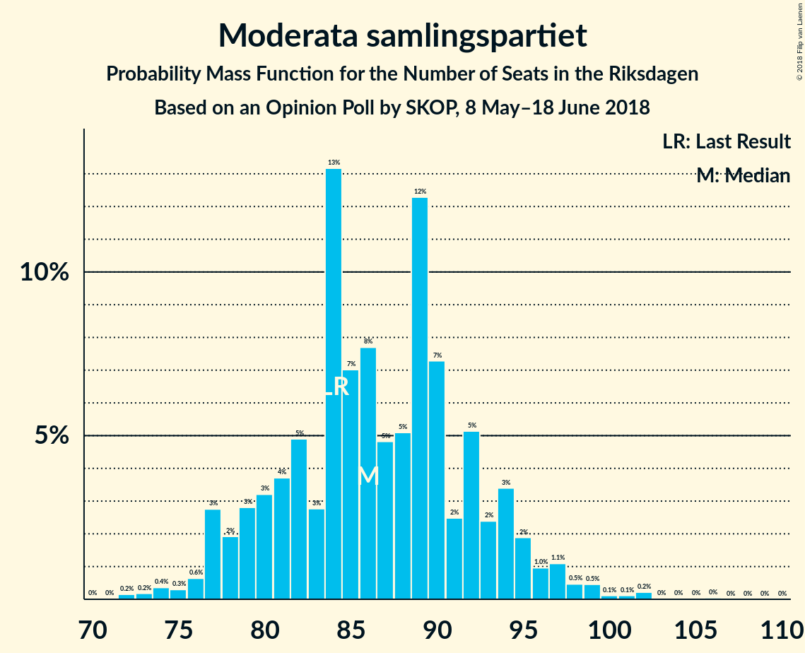
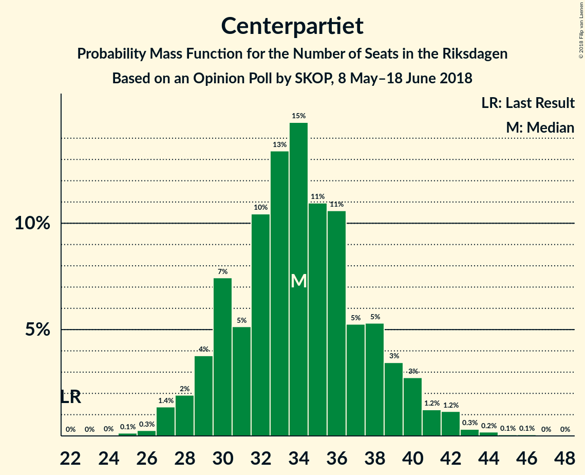

# Opinion Poll by SKOP, 8 May–18 June 2018

<a href="#voting-intentions">Voting Intentions</a> | <a href="#seats">Seats</a> | <a href="#coalitions">Coalitions</a> | <a href="#technical-information">Technical Information</a>

## Voting Intentions

### Confidence Intervals

| Party | Last Result | Poll Result | 80% Confidence Interval | 90% Confidence Interval | 95% Confidence Interval | 99% Confidence Interval |
|:-----:|:-----------:|:-----------:|:-----------------------:|:-----------------------:|:-----------------------:|:-----------------------:|
| Sveriges socialdemokratiska arbetareparti | 31.0% | 26.3% | 24.7–27.9% |24.3–28.4% |23.9–28.8% |23.2–29.6% |
| Moderata samlingspartiet | 23.3% | 22.9% | 21.4–24.5% |21.0–24.9% |20.6–25.3% |19.9–26.1% |
| Sverigedemokraterna | 12.9% | 19.0% | 17.6–20.5% |17.2–20.9% |16.9–21.3% |16.2–22.0% |
| Centerpartiet | 6.1% | 9.0% | 8.0–10.1% |7.8–10.5% |7.5–10.7% |7.1–11.3% |
| Vänsterpartiet | 5.7% | 7.6% | 6.7–8.7% |6.5–9.0% |6.3–9.3% |5.9–9.8% |
| Miljöpartiet de gröna | 6.9% | 4.5% | 3.8–5.3% |3.6–5.5% |3.4–5.8% |3.1–6.2% |
| Liberalerna | 5.4% | 4.5% | 3.8–5.3% |3.6–5.5% |3.4–5.8% |3.1–6.2% |
| Kristdemokraterna | 4.6% | 2.5% | 2.0–3.2% |1.9–3.4% |1.8–3.6% |1.6–3.9% |
| Feministiskt initiativ | 3.1% | 1.7% | 1.3–2.3% |1.2–2.5% |1.1–2.6% |0.9–2.9% |

*Note:* The poll result column reflects the actual value used in the calculations. Published results may vary slightly, and in addition be rounded to fewer digits.

## Seats

### Confidence Intervals

| Party | Last Result | Median | 80% Confidence Interval | 90% Confidence Interval | 95% Confidence Interval | 99% Confidence Interval |
|:-----:|:-----------:|:------:|:-----------------------:|:-----------------------:|:-----------------------:|:-----------------------:|
| <a href="#sveriges-socialdemokratiska-arbetareparti">Sveriges socialdemokratiska arbetareparti</a> | 113 | 98 | 92–106 |91–108 |89–110 |86–114 |
| <a href="#moderata-samlingspartiet">Moderata samlingspartiet</a> | 84 | 86 | 80–93 |78–95 |77–97 |74–100 |
| <a href="#sverigedemokraterna">Sverigedemokraterna</a> | 49 | 72 | 66–78 |65–79 |63–82 |61–85 |
| <a href="#centerpartiet">Centerpartiet</a> | 22 | 34 | 30–38 |29–40 |28–41 |27–43 |
| <a href="#vänsterpartiet">Vänsterpartiet</a> | 21 | 28 | 25–33 |24–34 |23–36 |21–37 |
| <a href="#miljöpartiet-de-gröna">Miljöpartiet de gröna</a> | 25 | 17 | 0–20 |0–21 |0–22 |0–23 |
| <a href="#liberalerna">Liberalerna</a> | 19 | 17 | 0–21 |0–21 |0–22 |0–24 |
| <a href="#kristdemokraterna">Kristdemokraterna</a> | 16 | 0 | 0 |0 |0 |0 |
| <a href="#feministiskt-initiativ">Feministiskt initiativ</a> | 0 | 0 | 0 |0 |0 |0 |

### Sveriges socialdemokratiska arbetareparti

*For a full overview of the results for this party, see the [Sveriges socialdemokratiska arbetareparti](party-sverigessocialdemokratiskaarbetareparti.html) page.*

| Number of Seats | Probability | Accumulated | Special Marks |
|:---------------:|:-----------:|:-----------:|:-------------:|
| 83 | 0% | 100% |  |
| 84 | 0.1% | 99.9% |  |
| 85 | 0.2% | 99.8% |  |
| 86 | 0.1% | 99.6% |  |
| 87 | 0.5% | 99.5% |  |
| 88 | 0.4% | 98.9% |  |
| 89 | 2% | 98.5% |  |
| 90 | 1.2% | 96% |  |
| 91 | 3% | 95% |  |
| 92 | 2% | 92% |  |
| 93 | 10% | 90% |  |
| 94 | 4% | 80% |  |
| 95 | 4% | 76% |  |
| 96 | 9% | 72% |  |
| 97 | 5% | 63% |  |
| 98 | 13% | 58% | Median |
| 99 | 5% | 45% |  |
| 100 | 5% | 40% |  |
| 101 | 5% | 35% |  |
| 102 | 7% | 30% |  |
| 103 | 5% | 23% |  |
| 104 | 4% | 19% |  |
| 105 | 4% | 15% |  |
| 106 | 2% | 11% |  |
| 107 | 3% | 9% |  |
| 108 | 2% | 6% |  |
| 109 | 2% | 4% |  |
| 110 | 1.0% | 3% |  |
| 111 | 0.4% | 2% |  |
| 112 | 0.3% | 1.2% |  |
| 113 | 0.3% | 0.9% | Last Result |
| 114 | 0.1% | 0.6% |  |
| 115 | 0.3% | 0.4% |  |
| 116 | 0% | 0.2% |  |
| 117 | 0% | 0.1% |  |
| 118 | 0% | 0.1% |  |
| 119 | 0% | 0% |  |

### Moderata samlingspartiet

*For a full overview of the results for this party, see the [Moderata samlingspartiet](party-moderatasamlingspartiet.html) page.*

| Number of Seats | Probability | Accumulated | Special Marks |
|:---------------:|:-----------:|:-----------:|:-------------:|
| 72 | 0.2% | 100% |  |
| 73 | 0.2% | 99.8% |  |
| 74 | 0.4% | 99.6% |  |
| 75 | 0.3% | 99.3% |  |
| 76 | 0.6% | 99.0% |  |
| 77 | 3% | 98% |  |
| 78 | 2% | 96% |  |
| 79 | 3% | 94% |  |
| 80 | 3% | 91% |  |
| 81 | 4% | 88% |  |
| 82 | 5% | 84% |  |
| 83 | 3% | 79% |  |
| 84 | 13% | 76% | Last Result |
| 85 | 7% | 63% |  |
| 86 | 8% | 56% | Median |
| 87 | 5% | 48% |  |
| 88 | 5% | 44% |  |
| 89 | 12% | 38% |  |
| 90 | 7% | 26% |  |
| 91 | 2% | 19% |  |
| 92 | 5% | 16% |  |
| 93 | 2% | 11% |  |
| 94 | 3% | 9% |  |
| 95 | 2% | 5% |  |
| 96 | 1.0% | 4% |  |
| 97 | 1.1% | 3% |  |
| 98 | 0.5% | 2% |  |
| 99 | 0.5% | 1.0% |  |
| 100 | 0.1% | 0.6% |  |
| 101 | 0.1% | 0.5% |  |
| 102 | 0.2% | 0.4% |  |
| 103 | 0% | 0.1% |  |
| 104 | 0% | 0.1% |  |
| 105 | 0% | 0.1% |  |
| 106 | 0% | 0.1% |  |
| 107 | 0% | 0% |  |

### Sverigedemokraterna

*For a full overview of the results for this party, see the [Sverigedemokraterna](party-sverigedemokraterna.html) page.*

| Number of Seats | Probability | Accumulated | Special Marks |
|:---------------:|:-----------:|:-----------:|:-------------:|
| 49 | 0% | 100% | Last Result |
| 50 | 0% | 100% |  |
| 51 | 0% | 100% |  |
| 52 | 0% | 100% |  |
| 53 | 0% | 100% |  |
| 54 | 0% | 100% |  |
| 55 | 0% | 100% |  |
| 56 | 0% | 100% |  |
| 57 | 0% | 100% |  |
| 58 | 0% | 100% |  |
| 59 | 0.1% | 99.9% |  |
| 60 | 0.2% | 99.8% |  |
| 61 | 0.7% | 99.7% |  |
| 62 | 0.8% | 99.0% |  |
| 63 | 0.9% | 98% |  |
| 64 | 1.0% | 97% |  |
| 65 | 3% | 96% |  |
| 66 | 6% | 93% |  |
| 67 | 2% | 87% |  |
| 68 | 3% | 85% |  |
| 69 | 5% | 81% |  |
| 70 | 15% | 76% |  |
| 71 | 8% | 61% |  |
| 72 | 4% | 53% | Median |
| 73 | 5% | 49% |  |
| 74 | 18% | 43% |  |
| 75 | 8% | 25% |  |
| 76 | 3% | 18% |  |
| 77 | 3% | 15% |  |
| 78 | 3% | 11% |  |
| 79 | 4% | 9% |  |
| 80 | 1.3% | 5% |  |
| 81 | 0.7% | 4% |  |
| 82 | 1.2% | 3% |  |
| 83 | 0.8% | 2% |  |
| 84 | 0.3% | 1.0% |  |
| 85 | 0.3% | 0.7% |  |
| 86 | 0.2% | 0.4% |  |
| 87 | 0.1% | 0.2% |  |
| 88 | 0.1% | 0.1% |  |
| 89 | 0% | 0% |  |

### Centerpartiet

*For a full overview of the results for this party, see the [Centerpartiet](party-centerpartiet.html) page.*

| Number of Seats | Probability | Accumulated | Special Marks |
|:---------------:|:-----------:|:-----------:|:-------------:|
| 22 | 0% | 100% | Last Result |
| 23 | 0% | 100% |  |
| 24 | 0% | 100% |  |
| 25 | 0.1% | 100% |  |
| 26 | 0.3% | 99.8% |  |
| 27 | 1.4% | 99.6% |  |
| 28 | 2% | 98% |  |
| 29 | 4% | 96% |  |
| 30 | 7% | 93% |  |
| 31 | 5% | 85% |  |
| 32 | 10% | 80% |  |
| 33 | 13% | 69% |  |
| 34 | 15% | 56% | Median |
| 35 | 11% | 41% |  |
| 36 | 11% | 30% |  |
| 37 | 5% | 20% |  |
| 38 | 5% | 15% |  |
| 39 | 3% | 9% |  |
| 40 | 3% | 6% |  |
| 41 | 1.2% | 3% |  |
| 42 | 1.2% | 2% |  |
| 43 | 0.3% | 0.6% |  |
| 44 | 0.2% | 0.3% |  |
| 45 | 0.1% | 0.1% |  |
| 46 | 0.1% | 0.1% |  |
| 47 | 0% | 0% |  |

### Vänsterpartiet

*For a full overview of the results for this party, see the [Vänsterpartiet](party-vänsterpartiet.html) page.*

| Number of Seats | Probability | Accumulated | Special Marks |
|:---------------:|:-----------:|:-----------:|:-------------:|
| 20 | 0.1% | 100% |  |
| 21 | 0.6% | 99.9% | Last Result |
| 22 | 2% | 99.4% |  |
| 23 | 2% | 98% |  |
| 24 | 4% | 96% |  |
| 25 | 8% | 92% |  |
| 26 | 19% | 84% |  |
| 27 | 9% | 65% |  |
| 28 | 10% | 56% | Median |
| 29 | 12% | 46% |  |
| 30 | 8% | 34% |  |
| 31 | 7% | 26% |  |
| 32 | 7% | 19% |  |
| 33 | 5% | 12% |  |
| 34 | 3% | 7% |  |
| 35 | 1.3% | 4% |  |
| 36 | 2% | 3% |  |
| 37 | 0.7% | 1.0% |  |
| 38 | 0.1% | 0.3% |  |
| 39 | 0.1% | 0.2% |  |
| 40 | 0.1% | 0.1% |  |
| 41 | 0% | 0% |  |

### Miljöpartiet de gröna

*For a full overview of the results for this party, see the [Miljöpartiet de gröna](party-miljöpartietdegröna.html) page.*

| Number of Seats | Probability | Accumulated | Special Marks |
|:---------------:|:-----------:|:-----------:|:-------------:|
| 0 | 17% | 100% |  |
| 1 | 0% | 83% |  |
| 2 | 0% | 83% |  |
| 3 | 0% | 83% |  |
| 4 | 0% | 83% |  |
| 5 | 0% | 83% |  |
| 6 | 0% | 83% |  |
| 7 | 0% | 83% |  |
| 8 | 0% | 83% |  |
| 9 | 0% | 83% |  |
| 10 | 0% | 83% |  |
| 11 | 0% | 83% |  |
| 12 | 0% | 83% |  |
| 13 | 0% | 83% |  |
| 14 | 0% | 83% |  |
| 15 | 4% | 83% |  |
| 16 | 18% | 79% |  |
| 17 | 16% | 61% | Median |
| 18 | 21% | 45% |  |
| 19 | 10% | 25% |  |
| 20 | 8% | 14% |  |
| 21 | 3% | 6% |  |
| 22 | 2% | 3% |  |
| 23 | 1.0% | 1.4% |  |
| 24 | 0.3% | 0.4% |  |
| 25 | 0.1% | 0.1% | Last Result |
| 26 | 0% | 0% |  |

### Liberalerna

*For a full overview of the results for this party, see the [Liberalerna](party-liberalerna.html) page.*

| Number of Seats | Probability | Accumulated | Special Marks |
|:---------------:|:-----------:|:-----------:|:-------------:|
| 0 | 20% | 100% |  |
| 1 | 0% | 80% |  |
| 2 | 0% | 80% |  |
| 3 | 0% | 80% |  |
| 4 | 0% | 80% |  |
| 5 | 0% | 80% |  |
| 6 | 0% | 80% |  |
| 7 | 0% | 80% |  |
| 8 | 0% | 80% |  |
| 9 | 0% | 80% |  |
| 10 | 0% | 80% |  |
| 11 | 0% | 80% |  |
| 12 | 0% | 80% |  |
| 13 | 0% | 80% |  |
| 14 | 0% | 80% |  |
| 15 | 2% | 80% |  |
| 16 | 17% | 78% |  |
| 17 | 21% | 61% | Median |
| 18 | 11% | 40% |  |
| 19 | 9% | 30% | Last Result |
| 20 | 10% | 21% |  |
| 21 | 7% | 11% |  |
| 22 | 2% | 4% |  |
| 23 | 1.3% | 2% |  |
| 24 | 0.4% | 0.6% |  |
| 25 | 0.1% | 0.2% |  |
| 26 | 0% | 0% |  |

### Kristdemokraterna

*For a full overview of the results for this party, see the [Kristdemokraterna](party-kristdemokraterna.html) page.*

| Number of Seats | Probability | Accumulated | Special Marks |
|:---------------:|:-----------:|:-----------:|:-------------:|
| 0 | 99.6% | 100% | Median |
| 1 | 0% | 0.4% |  |
| 2 | 0% | 0.4% |  |
| 3 | 0% | 0.4% |  |
| 4 | 0% | 0.4% |  |
| 5 | 0% | 0.4% |  |
| 6 | 0% | 0.4% |  |
| 7 | 0% | 0.4% |  |
| 8 | 0% | 0.4% |  |
| 9 | 0% | 0.4% |  |
| 10 | 0% | 0.4% |  |
| 11 | 0% | 0.4% |  |
| 12 | 0% | 0.4% |  |
| 13 | 0% | 0.4% |  |
| 14 | 0% | 0.4% |  |
| 15 | 0.2% | 0.4% |  |
| 16 | 0.2% | 0.2% | Last Result |
| 17 | 0% | 0% |  |

### Feministiskt initiativ

*For a full overview of the results for this party, see the [Feministiskt initiativ](party-feministisktinitiativ.html) page.*

| Number of Seats | Probability | Accumulated | Special Marks |
|:---------------:|:-----------:|:-----------:|:-------------:|
| 0 | 100% | 100% | Last Result, Median |

## Coalitions

### Confidence Intervals

| Coalition | Last Result | Median | Majority? | 80% Confidence Interval | 90% Confidence Interval | 95% Confidence Interval | 99% Confidence Interval |
|:---------:|:-----------:|:------:|:---------:|:-----------------------:|:-----------------------:|:-----------------------:|:-----------------------:|
| Sveriges socialdemokratiska arbetareparti – Vänsterpartiet – Miljöpartiet de gröna – Feministiskt initiativ | 159 | 142 | 0% | 134–152 | 131–154 | 128–156 | 121–160 |
| Sveriges socialdemokratiska arbetareparti – Vänsterpartiet – Miljöpartiet de gröna | 159 | 142 | 0% | 134–152 | 131–154 | 128–156 | 121–160 |
| Moderata samlingspartiet – Centerpartiet – Liberalerna – Kristdemokraterna | 141 | 136 | 0% | 125–144 | 122–146 | 120–148 | 116–153 |
| Moderata samlingspartiet – Centerpartiet – Liberalerna | 125 | 136 | 0% | 125–144 | 122–146 | 120–148 | 116–153 |
| Sveriges socialdemokratiska arbetareparti – Vänsterpartiet | 134 | 126 | 0% | 119–136 | 117–138 | 116–140 | 113–146 |
| Moderata samlingspartiet – Centerpartiet – Kristdemokraterna | 122 | 120 | 0% | 113–129 | 111–131 | 110–132 | 107–137 |
| Moderata samlingspartiet – Centerpartiet | 106 | 120 | 0% | 113–129 | 111–130 | 110–132 | 107–137 |
| Sveriges socialdemokratiska arbetareparti – Miljöpartiet de gröna | 138 | 114 | 0% | 104–122 | 101–124 | 98–126 | 94–130 |

### Sveriges socialdemokratiska arbetareparti – Vänsterpartiet – Miljöpartiet de gröna – Feministiskt initiativ

| Number of Seats | Probability | Accumulated | Special Marks |
|:---------------:|:-----------:|:-----------:|:-------------:|
| 118 | 0% | 100% |  |
| 119 | 0.1% | 99.9% |  |
| 120 | 0.1% | 99.8% |  |
| 121 | 0.4% | 99.8% |  |
| 122 | 0.2% | 99.4% |  |
| 123 | 0.4% | 99.2% |  |
| 124 | 0.1% | 98.8% |  |
| 125 | 0.3% | 98.6% |  |
| 126 | 0.3% | 98% |  |
| 127 | 0.3% | 98% |  |
| 128 | 0.9% | 98% |  |
| 129 | 1.0% | 97% |  |
| 130 | 0.4% | 96% |  |
| 131 | 2% | 95% |  |
| 132 | 0.8% | 94% |  |
| 133 | 2% | 93% |  |
| 134 | 2% | 91% |  |
| 135 | 13% | 88% |  |
| 136 | 4% | 76% |  |
| 137 | 2% | 71% |  |
| 138 | 2% | 70% |  |
| 139 | 5% | 68% |  |
| 140 | 4% | 63% |  |
| 141 | 6% | 59% |  |
| 142 | 14% | 53% |  |
| 143 | 2% | 39% | Median |
| 144 | 3% | 37% |  |
| 145 | 3% | 35% |  |
| 146 | 3% | 32% |  |
| 147 | 5% | 29% |  |
| 148 | 5% | 24% |  |
| 149 | 4% | 19% |  |
| 150 | 3% | 15% |  |
| 151 | 2% | 13% |  |
| 152 | 1.1% | 10% |  |
| 153 | 2% | 9% |  |
| 154 | 4% | 7% |  |
| 155 | 0.9% | 3% |  |
| 156 | 0.5% | 3% |  |
| 157 | 0.1% | 2% |  |
| 158 | 0.4% | 2% |  |
| 159 | 0.6% | 2% | Last Result |
| 160 | 0.5% | 1.0% |  |
| 161 | 0.2% | 0.4% |  |
| 162 | 0% | 0.2% |  |
| 163 | 0.1% | 0.2% |  |
| 164 | 0% | 0.1% |  |
| 165 | 0% | 0.1% |  |
| 166 | 0% | 0% |  |

### Sveriges socialdemokratiska arbetareparti – Vänsterpartiet – Miljöpartiet de gröna

| Number of Seats | Probability | Accumulated | Special Marks |
|:---------------:|:-----------:|:-----------:|:-------------:|
| 118 | 0% | 100% |  |
| 119 | 0.1% | 99.9% |  |
| 120 | 0.1% | 99.8% |  |
| 121 | 0.4% | 99.8% |  |
| 122 | 0.2% | 99.4% |  |
| 123 | 0.4% | 99.2% |  |
| 124 | 0.1% | 98.8% |  |
| 125 | 0.3% | 98.6% |  |
| 126 | 0.3% | 98% |  |
| 127 | 0.3% | 98% |  |
| 128 | 0.9% | 98% |  |
| 129 | 1.0% | 97% |  |
| 130 | 0.4% | 96% |  |
| 131 | 2% | 95% |  |
| 132 | 0.8% | 94% |  |
| 133 | 2% | 93% |  |
| 134 | 2% | 91% |  |
| 135 | 13% | 88% |  |
| 136 | 4% | 76% |  |
| 137 | 2% | 71% |  |
| 138 | 2% | 70% |  |
| 139 | 5% | 68% |  |
| 140 | 4% | 63% |  |
| 141 | 6% | 59% |  |
| 142 | 14% | 53% |  |
| 143 | 2% | 39% | Median |
| 144 | 3% | 37% |  |
| 145 | 3% | 35% |  |
| 146 | 3% | 32% |  |
| 147 | 5% | 29% |  |
| 148 | 5% | 24% |  |
| 149 | 4% | 19% |  |
| 150 | 3% | 15% |  |
| 151 | 2% | 13% |  |
| 152 | 1.1% | 10% |  |
| 153 | 2% | 9% |  |
| 154 | 4% | 7% |  |
| 155 | 0.9% | 3% |  |
| 156 | 0.5% | 3% |  |
| 157 | 0.1% | 2% |  |
| 158 | 0.4% | 2% |  |
| 159 | 0.6% | 2% | Last Result |
| 160 | 0.5% | 1.0% |  |
| 161 | 0.2% | 0.4% |  |
| 162 | 0% | 0.2% |  |
| 163 | 0.1% | 0.2% |  |
| 164 | 0% | 0.1% |  |
| 165 | 0% | 0.1% |  |
| 166 | 0% | 0% |  |

### Moderata samlingspartiet – Centerpartiet – Liberalerna – Kristdemokraterna

| Number of Seats | Probability | Accumulated | Special Marks |
|:---------------:|:-----------:|:-----------:|:-------------:|
| 110 | 0.1% | 100% |  |
| 111 | 0% | 99.9% |  |
| 112 | 0% | 99.9% |  |
| 113 | 0.1% | 99.8% |  |
| 114 | 0.1% | 99.7% |  |
| 115 | 0% | 99.6% |  |
| 116 | 0.4% | 99.6% |  |
| 117 | 0.3% | 99.2% |  |
| 118 | 0.2% | 98.9% |  |
| 119 | 0.5% | 98.8% |  |
| 120 | 2% | 98% |  |
| 121 | 0.8% | 96% |  |
| 122 | 0.7% | 96% |  |
| 123 | 3% | 95% |  |
| 124 | 1.3% | 92% |  |
| 125 | 1.4% | 91% |  |
| 126 | 4% | 89% |  |
| 127 | 3% | 86% |  |
| 128 | 1.3% | 83% |  |
| 129 | 4% | 82% |  |
| 130 | 3% | 78% |  |
| 131 | 5% | 75% |  |
| 132 | 3% | 70% |  |
| 133 | 11% | 67% |  |
| 134 | 3% | 56% |  |
| 135 | 2% | 53% |  |
| 136 | 4% | 50% |  |
| 137 | 6% | 47% | Median |
| 138 | 7% | 40% |  |
| 139 | 2% | 34% |  |
| 140 | 9% | 32% |  |
| 141 | 5% | 23% | Last Result |
| 142 | 2% | 17% |  |
| 143 | 4% | 16% |  |
| 144 | 5% | 12% |  |
| 145 | 1.2% | 7% |  |
| 146 | 1.0% | 6% |  |
| 147 | 0.9% | 5% |  |
| 148 | 1.3% | 4% |  |
| 149 | 0.6% | 2% |  |
| 150 | 0.3% | 2% |  |
| 151 | 0.5% | 1.5% |  |
| 152 | 0.2% | 0.9% |  |
| 153 | 0.2% | 0.7% |  |
| 154 | 0.2% | 0.5% |  |
| 155 | 0.1% | 0.3% |  |
| 156 | 0.1% | 0.2% |  |
| 157 | 0.1% | 0.1% |  |
| 158 | 0% | 0% |  |

### Moderata samlingspartiet – Centerpartiet – Liberalerna

| Number of Seats | Probability | Accumulated | Special Marks |
|:---------------:|:-----------:|:-----------:|:-------------:|
| 110 | 0.1% | 100% |  |
| 111 | 0% | 99.9% |  |
| 112 | 0% | 99.8% |  |
| 113 | 0.1% | 99.8% |  |
| 114 | 0.1% | 99.7% |  |
| 115 | 0% | 99.6% |  |
| 116 | 0.4% | 99.5% |  |
| 117 | 0.3% | 99.2% |  |
| 118 | 0.2% | 98.9% |  |
| 119 | 0.5% | 98.7% |  |
| 120 | 2% | 98% |  |
| 121 | 0.8% | 96% |  |
| 122 | 0.8% | 96% |  |
| 123 | 3% | 95% |  |
| 124 | 1.2% | 92% |  |
| 125 | 1.5% | 91% | Last Result |
| 126 | 4% | 89% |  |
| 127 | 3% | 86% |  |
| 128 | 1.3% | 83% |  |
| 129 | 4% | 81% |  |
| 130 | 3% | 78% |  |
| 131 | 5% | 75% |  |
| 132 | 3% | 70% |  |
| 133 | 11% | 67% |  |
| 134 | 4% | 56% |  |
| 135 | 2% | 52% |  |
| 136 | 4% | 50% |  |
| 137 | 6% | 46% | Median |
| 138 | 7% | 40% |  |
| 139 | 2% | 33% |  |
| 140 | 9% | 32% |  |
| 141 | 5% | 22% |  |
| 142 | 2% | 17% |  |
| 143 | 4% | 15% |  |
| 144 | 5% | 12% |  |
| 145 | 1.2% | 7% |  |
| 146 | 1.0% | 5% |  |
| 147 | 0.9% | 4% |  |
| 148 | 1.3% | 4% |  |
| 149 | 0.5% | 2% |  |
| 150 | 0.3% | 2% |  |
| 151 | 0.5% | 1.4% |  |
| 152 | 0.2% | 0.9% |  |
| 153 | 0.2% | 0.7% |  |
| 154 | 0.1% | 0.4% |  |
| 155 | 0.1% | 0.3% |  |
| 156 | 0.1% | 0.2% |  |
| 157 | 0.1% | 0.1% |  |
| 158 | 0% | 0% |  |

### Sveriges socialdemokratiska arbetareparti – Vänsterpartiet

| Number of Seats | Probability | Accumulated | Special Marks |
|:---------------:|:-----------:|:-----------:|:-------------:|
| 110 | 0% | 100% |  |
| 111 | 0.2% | 99.9% |  |
| 112 | 0.1% | 99.8% |  |
| 113 | 0.2% | 99.7% |  |
| 114 | 0.5% | 99.5% |  |
| 115 | 0.7% | 99.0% |  |
| 116 | 2% | 98% |  |
| 117 | 2% | 97% |  |
| 118 | 1.3% | 95% |  |
| 119 | 9% | 94% |  |
| 120 | 3% | 85% |  |
| 121 | 6% | 82% |  |
| 122 | 3% | 76% |  |
| 123 | 4% | 72% |  |
| 124 | 11% | 68% |  |
| 125 | 5% | 57% |  |
| 126 | 4% | 52% | Median |
| 127 | 3% | 48% |  |
| 128 | 3% | 45% |  |
| 129 | 6% | 42% |  |
| 130 | 4% | 36% |  |
| 131 | 5% | 32% |  |
| 132 | 3% | 27% |  |
| 133 | 4% | 24% |  |
| 134 | 4% | 20% | Last Result |
| 135 | 5% | 16% |  |
| 136 | 3% | 11% |  |
| 137 | 2% | 8% |  |
| 138 | 2% | 6% |  |
| 139 | 2% | 5% |  |
| 140 | 0.4% | 3% |  |
| 141 | 0.5% | 2% |  |
| 142 | 0.5% | 2% |  |
| 143 | 0.7% | 1.5% |  |
| 144 | 0.2% | 0.8% |  |
| 145 | 0.1% | 0.6% |  |
| 146 | 0.1% | 0.6% |  |
| 147 | 0.1% | 0.4% |  |
| 148 | 0% | 0.3% |  |
| 149 | 0% | 0.2% |  |
| 150 | 0% | 0.2% |  |
| 151 | 0.1% | 0.2% |  |
| 152 | 0% | 0% |  |

### Moderata samlingspartiet – Centerpartiet – Kristdemokraterna

| Number of Seats | Probability | Accumulated | Special Marks |
|:---------------:|:-----------:|:-----------:|:-------------:|
| 103 | 0% | 100% |  |
| 104 | 0.1% | 99.9% |  |
| 105 | 0.1% | 99.9% |  |
| 106 | 0.1% | 99.8% |  |
| 107 | 0.7% | 99.7% |  |
| 108 | 0.5% | 99.0% |  |
| 109 | 0.8% | 98.5% |  |
| 110 | 2% | 98% |  |
| 111 | 2% | 96% |  |
| 112 | 2% | 94% |  |
| 113 | 4% | 91% |  |
| 114 | 2% | 88% |  |
| 115 | 4% | 86% |  |
| 116 | 4% | 82% |  |
| 117 | 12% | 78% |  |
| 118 | 4% | 66% |  |
| 119 | 5% | 62% |  |
| 120 | 8% | 57% | Median |
| 121 | 6% | 49% |  |
| 122 | 3% | 44% | Last Result |
| 123 | 13% | 41% |  |
| 124 | 4% | 28% |  |
| 125 | 4% | 25% |  |
| 126 | 6% | 20% |  |
| 127 | 3% | 14% |  |
| 128 | 1.2% | 12% |  |
| 129 | 3% | 10% |  |
| 130 | 2% | 7% |  |
| 131 | 2% | 5% |  |
| 132 | 1.1% | 3% |  |
| 133 | 0.5% | 2% |  |
| 134 | 0.4% | 2% |  |
| 135 | 0.1% | 1.2% |  |
| 136 | 0.4% | 1.1% |  |
| 137 | 0.3% | 0.7% |  |
| 138 | 0.2% | 0.4% |  |
| 139 | 0% | 0.2% |  |
| 140 | 0.1% | 0.2% |  |
| 141 | 0% | 0.1% |  |
| 142 | 0% | 0.1% |  |
| 143 | 0.1% | 0.1% |  |
| 144 | 0% | 0% |  |

### Moderata samlingspartiet – Centerpartiet

| Number of Seats | Probability | Accumulated | Special Marks |
|:---------------:|:-----------:|:-----------:|:-------------:|
| 103 | 0% | 100% |  |
| 104 | 0.1% | 99.9% |  |
| 105 | 0.1% | 99.9% |  |
| 106 | 0.1% | 99.8% | Last Result |
| 107 | 0.7% | 99.7% |  |
| 108 | 0.5% | 99.0% |  |
| 109 | 0.8% | 98.5% |  |
| 110 | 2% | 98% |  |
| 111 | 2% | 96% |  |
| 112 | 2% | 94% |  |
| 113 | 4% | 91% |  |
| 114 | 2% | 88% |  |
| 115 | 4% | 85% |  |
| 116 | 4% | 82% |  |
| 117 | 12% | 77% |  |
| 118 | 4% | 65% |  |
| 119 | 5% | 61% |  |
| 120 | 8% | 57% | Median |
| 121 | 6% | 49% |  |
| 122 | 3% | 43% |  |
| 123 | 13% | 40% |  |
| 124 | 3% | 28% |  |
| 125 | 4% | 24% |  |
| 126 | 6% | 20% |  |
| 127 | 3% | 14% |  |
| 128 | 1.2% | 11% |  |
| 129 | 3% | 10% |  |
| 130 | 2% | 7% |  |
| 131 | 2% | 5% |  |
| 132 | 1.0% | 3% |  |
| 133 | 0.5% | 2% |  |
| 134 | 0.4% | 2% |  |
| 135 | 0.1% | 1.1% |  |
| 136 | 0.3% | 1.0% |  |
| 137 | 0.3% | 0.7% |  |
| 138 | 0.2% | 0.4% |  |
| 139 | 0% | 0.2% |  |
| 140 | 0% | 0.1% |  |
| 141 | 0% | 0.1% |  |
| 142 | 0% | 0.1% |  |
| 143 | 0% | 0.1% |  |
| 144 | 0% | 0% |  |

### Sveriges socialdemokratiska arbetareparti – Miljöpartiet de gröna

| Number of Seats | Probability | Accumulated | Special Marks |
|:---------------:|:-----------:|:-----------:|:-------------:|
| 89 | 0.1% | 100% |  |
| 90 | 0.1% | 99.9% |  |
| 91 | 0% | 99.9% |  |
| 92 | 0% | 99.8% |  |
| 93 | 0.2% | 99.8% |  |
| 94 | 0.2% | 99.6% |  |
| 95 | 0.3% | 99.3% |  |
| 96 | 0.4% | 99.0% |  |
| 97 | 0.8% | 98.6% |  |
| 98 | 0.7% | 98% |  |
| 99 | 1.1% | 97% |  |
| 100 | 0.8% | 96% |  |
| 101 | 0.7% | 95% |  |
| 102 | 2% | 94% |  |
| 103 | 1.0% | 92% |  |
| 104 | 1.3% | 91% |  |
| 105 | 3% | 90% |  |
| 106 | 2% | 87% |  |
| 107 | 4% | 85% |  |
| 108 | 0.9% | 81% |  |
| 109 | 10% | 80% |  |
| 110 | 3% | 70% |  |
| 111 | 3% | 67% |  |
| 112 | 4% | 64% |  |
| 113 | 6% | 60% |  |
| 114 | 6% | 54% |  |
| 115 | 3% | 48% | Median |
| 116 | 16% | 46% |  |
| 117 | 5% | 30% |  |
| 118 | 3% | 26% |  |
| 119 | 3% | 22% |  |
| 120 | 4% | 19% |  |
| 121 | 3% | 15% |  |
| 122 | 3% | 12% |  |
| 123 | 3% | 8% |  |
| 124 | 2% | 6% |  |
| 125 | 0.8% | 4% |  |
| 126 | 1.0% | 3% |  |
| 127 | 1.2% | 2% |  |
| 128 | 0.4% | 1.1% |  |
| 129 | 0.2% | 0.8% |  |
| 130 | 0.2% | 0.6% |  |
| 131 | 0.2% | 0.4% |  |
| 132 | 0.1% | 0.2% |  |
| 133 | 0.1% | 0.1% |  |
| 134 | 0% | 0.1% |  |
| 135 | 0% | 0% |  |
| 136 | 0% | 0% |  |
| 137 | 0% | 0% |  |
| 138 | 0% | 0% | Last Result |

## Technical Information

### Opinion Poll

+ **Polling firm:** SKOP
+ **Commissioner(s):** —
+ **Fieldwork period:** 8 May–18 June 2018

### Calculations

+ **Sample size:** 1233
+ **Simulations done:** 1,048,576
+ **Error estimate:** 1.01%

