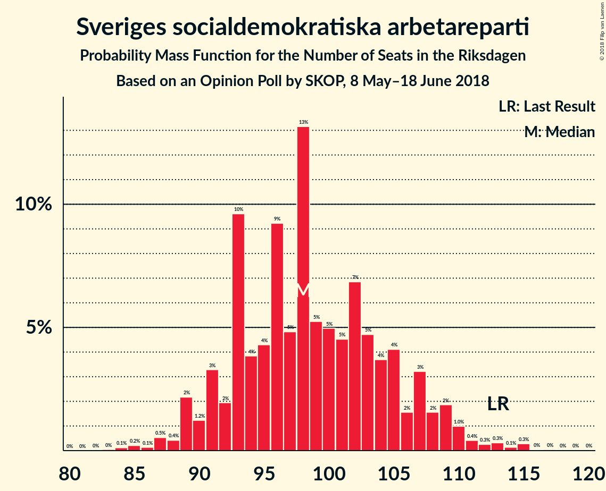
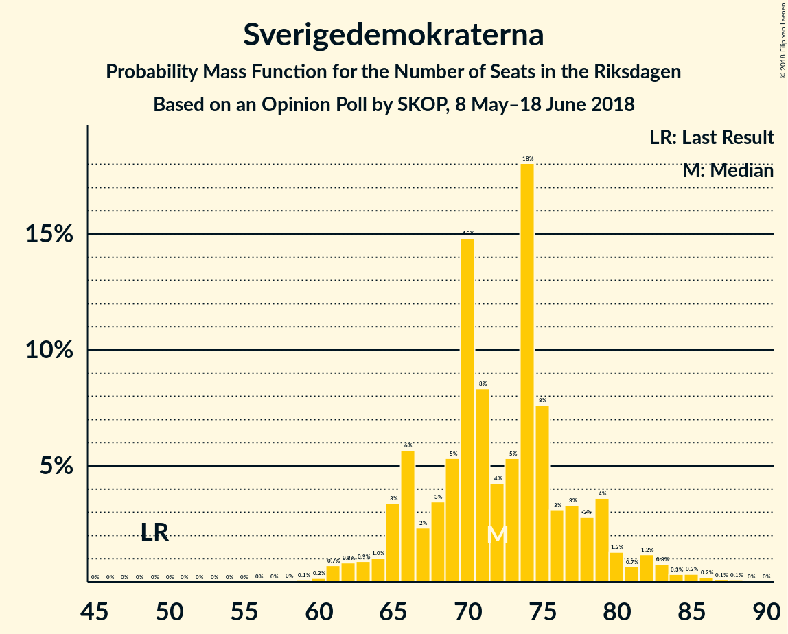
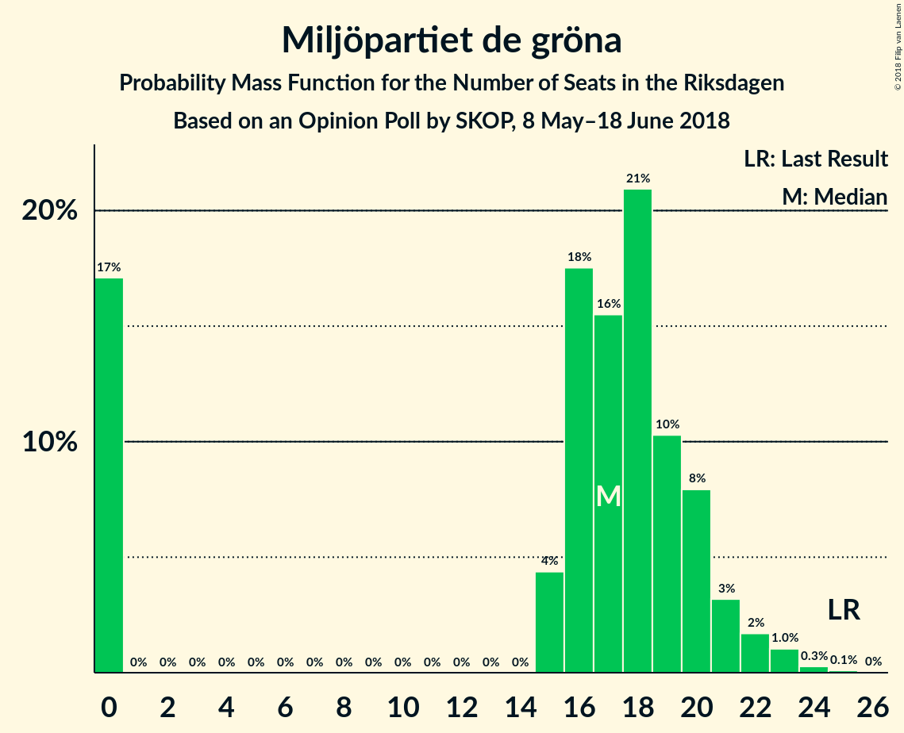
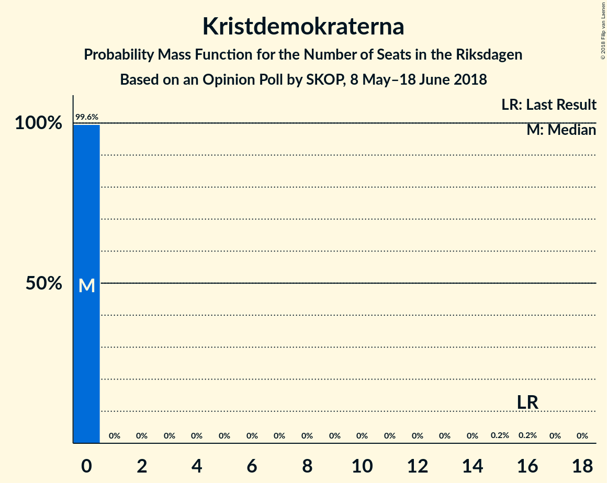
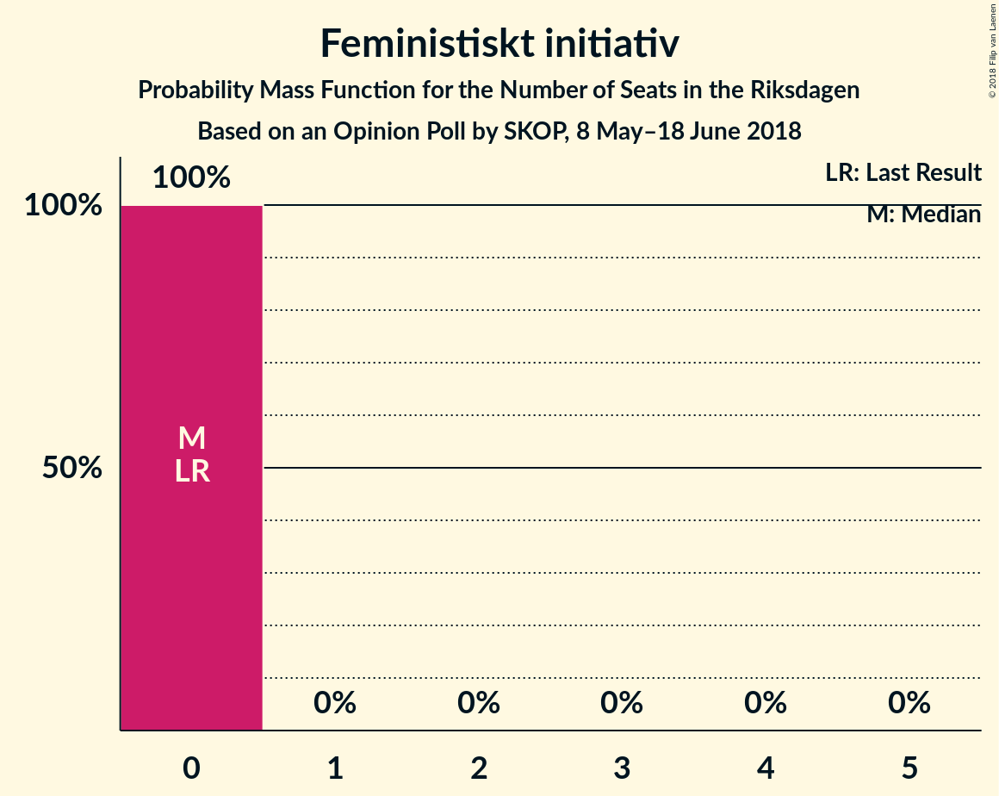
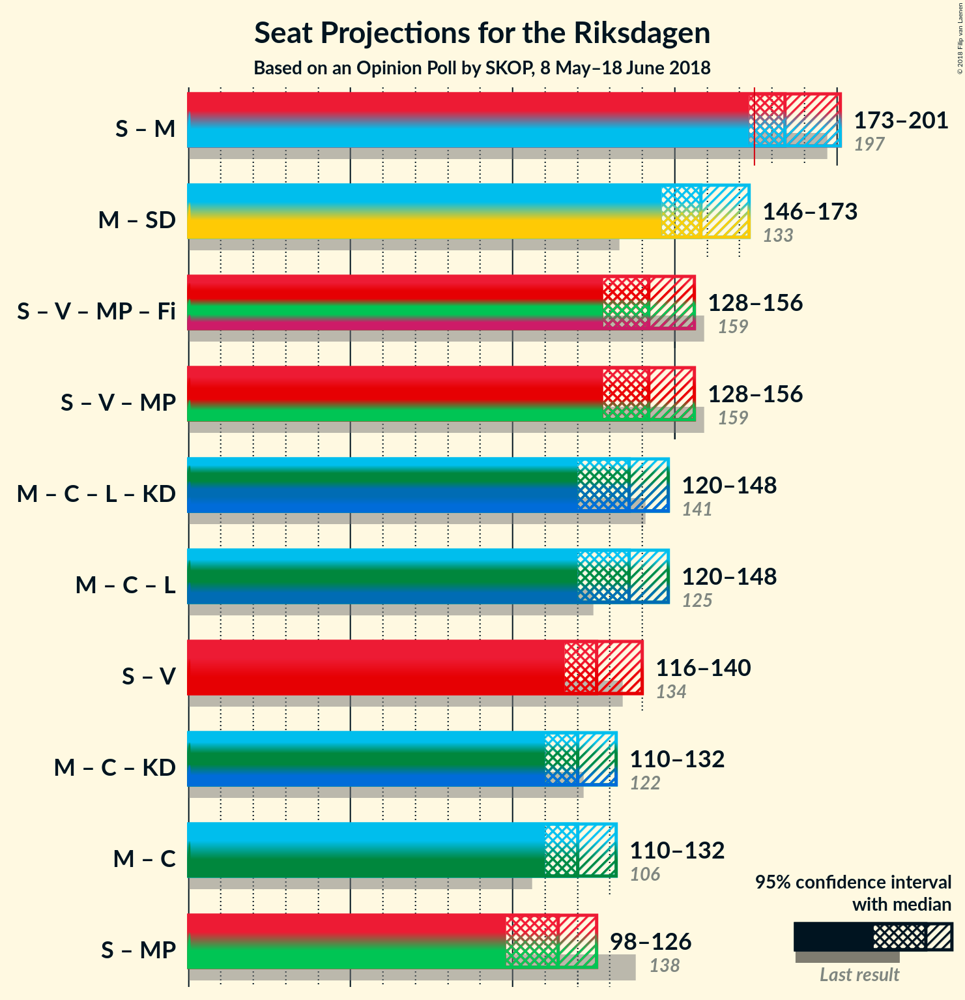

# Opinion Poll by SKOP, 8 May–18 June 2018

<a href="#voting-intentions">Voting Intentions</a> | <a href="#seats">Seats</a> | <a href="#coalitions">Coalitions</a> | <a href="#technical-information">Technical Information</a>

## Voting Intentions

### Confidence Intervals

| Party | Last Result | Poll Result | 80% Confidence Interval | 90% Confidence Interval | 95% Confidence Interval | 99% Confidence Interval |
|:-----:|:-----------:|:-----------:|:-----------------------:|:-----------------------:|:-----------------------:|:-----------------------:|
| Sveriges socialdemokratiska arbetareparti | 31.0% | 26.3% | 24.7–27.9% |24.3–28.4% |23.9–28.8% |23.2–29.6% |
| Moderata samlingspartiet | 23.3% | 22.9% | 21.4–24.5% |21.0–24.9% |20.6–25.3% |19.9–26.1% |
| Sverigedemokraterna | 12.9% | 19.0% | 17.6–20.5% |17.2–20.9% |16.9–21.3% |16.2–22.0% |
| Centerpartiet | 6.1% | 9.0% | 8.0–10.1% |7.8–10.5% |7.5–10.7% |7.1–11.3% |
| Vänsterpartiet | 5.7% | 7.6% | 6.7–8.7% |6.5–9.0% |6.3–9.3% |5.9–9.8% |
| Miljöpartiet de gröna | 6.9% | 4.5% | 3.8–5.3% |3.6–5.5% |3.4–5.8% |3.1–6.2% |
| Liberalerna | 5.4% | 4.5% | 3.8–5.3% |3.6–5.5% |3.4–5.8% |3.1–6.2% |
| Kristdemokraterna | 4.6% | 2.5% | 2.0–3.2% |1.9–3.4% |1.8–3.6% |1.6–3.9% |
| Feministiskt initiativ | 3.1% | 1.7% | 1.3–2.3% |1.2–2.5% |1.1–2.6% |0.9–2.9% |

*Note:* The poll result column reflects the actual value used in the calculations. Published results may vary slightly, and in addition be rounded to fewer digits.

## Seats

### Confidence Intervals

| Party | Last Result | Median | 80% Confidence Interval | 90% Confidence Interval | 95% Confidence Interval | 99% Confidence Interval |
|:-----:|:-----------:|:------:|:-----------------------:|:-----------------------:|:-----------------------:|:-----------------------:|
| <a href="#sveriges-socialdemokratiska-arbetareparti">Sveriges socialdemokratiska arbetareparti</a> | 113 | 100 | 92–107 |89–109 |89–112 |87–114 |
| <a href="#moderata-samlingspartiet">Moderata samlingspartiet</a> | 84 | 87 | 78–95 |77–98 |76–99 |73–106 |
| <a href="#sverigedemokraterna">Sverigedemokraterna</a> | 49 | 71 | 66–77 |65–79 |63–83 |61–85 |
| <a href="#centerpartiet">Centerpartiet</a> | 22 | 34 | 29–40 |27–41 |27–42 |26–44 |
| <a href="#vänsterpartiet">Vänsterpartiet</a> | 21 | 29 | 25–35 |23–36 |23–37 |21–39 |
| <a href="#miljöpartiet-de-gröna">Miljöpartiet de gröna</a> | 25 | 17 | 0–20 |0–21 |0–22 |0–23 |
| <a href="#liberalerna">Liberalerna</a> | 19 | 17 | 0–21 |0–22 |0–23 |0–24 |
| <a href="#kristdemokraterna">Kristdemokraterna</a> | 16 | 0 | 0 |0 |0 |0–15 |
| <a href="#feministiskt-initiativ">Feministiskt initiativ</a> | 0 | 0 | 0 |0 |0 |0 |

### Sveriges socialdemokratiska arbetareparti

*For a full overview of the results for this party, see the [Sveriges socialdemokratiska arbetareparti](party-sverigessocialdemokratiskaarbetareparti.html) page.*

| Number of Seats | Probability | Accumulated | Special Marks |
|:---------------:|:-----------:|:-----------:|:-------------:|
| 83 | 0.1% | 100% |  |
| 84 | 0% | 99.9% |  |
| 85 | 0.1% | 99.8% |  |
| 86 | 0.2% | 99.8% |  |
| 87 | 0.4% | 99.6% |  |
| 88 | 0.6% | 99.2% |  |
| 89 | 6% | 98.6% |  |
| 90 | 2% | 93% |  |
| 91 | 1.2% | 91% |  |
| 92 | 3% | 90% |  |
| 93 | 4% | 87% |  |
| 94 | 0.7% | 83% |  |
| 95 | 8% | 82% |  |
| 96 | 7% | 74% |  |
| 97 | 7% | 67% |  |
| 98 | 5% | 61% |  |
| 99 | 4% | 56% |  |
| 100 | 6% | 52% | Median |
| 101 | 6% | 46% |  |
| 102 | 7% | 40% |  |
| 103 | 1.1% | 32% |  |
| 104 | 12% | 31% |  |
| 105 | 4% | 19% |  |
| 106 | 1.0% | 14% |  |
| 107 | 7% | 13% |  |
| 108 | 0.6% | 6% |  |
| 109 | 1.2% | 5% |  |
| 110 | 0.9% | 4% |  |
| 111 | 0.2% | 3% |  |
| 112 | 0.7% | 3% |  |
| 113 | 2% | 2% | Last Result |
| 114 | 0.6% | 1.0% |  |
| 115 | 0% | 0.3% |  |
| 116 | 0.1% | 0.3% |  |
| 117 | 0.1% | 0.2% |  |
| 118 | 0% | 0.1% |  |
| 119 | 0.1% | 0.1% |  |
| 120 | 0% | 0% |  |

### Moderata samlingspartiet

*For a full overview of the results for this party, see the [Moderata samlingspartiet](party-moderatasamlingspartiet.html) page.*

| Number of Seats | Probability | Accumulated | Special Marks |
|:---------------:|:-----------:|:-----------:|:-------------:|
| 70 | 0% | 100% |  |
| 71 | 0.1% | 99.9% |  |
| 72 | 0% | 99.9% |  |
| 73 | 0.6% | 99.8% |  |
| 74 | 0.4% | 99.2% |  |
| 75 | 1.2% | 98.8% |  |
| 76 | 1.1% | 98% |  |
| 77 | 4% | 97% |  |
| 78 | 5% | 93% |  |
| 79 | 3% | 88% |  |
| 80 | 1.0% | 86% |  |
| 81 | 7% | 85% |  |
| 82 | 6% | 78% |  |
| 83 | 4% | 72% |  |
| 84 | 2% | 68% | Last Result |
| 85 | 4% | 65% |  |
| 86 | 9% | 61% |  |
| 87 | 4% | 53% | Median |
| 88 | 8% | 49% |  |
| 89 | 5% | 41% |  |
| 90 | 3% | 36% |  |
| 91 | 1.5% | 33% |  |
| 92 | 5% | 31% |  |
| 93 | 1.5% | 27% |  |
| 94 | 7% | 25% |  |
| 95 | 8% | 18% |  |
| 96 | 3% | 10% |  |
| 97 | 0.3% | 7% |  |
| 98 | 2% | 7% |  |
| 99 | 2% | 4% |  |
| 100 | 0.3% | 2% |  |
| 101 | 0.1% | 2% |  |
| 102 | 1.2% | 2% |  |
| 103 | 0% | 0.8% |  |
| 104 | 0.1% | 0.7% |  |
| 105 | 0% | 0.6% |  |
| 106 | 0.6% | 0.6% |  |
| 107 | 0% | 0% |  |

### Sverigedemokraterna

*For a full overview of the results for this party, see the [Sverigedemokraterna](party-sverigedemokraterna.html) page.*

| Number of Seats | Probability | Accumulated | Special Marks |
|:---------------:|:-----------:|:-----------:|:-------------:|
| 49 | 0% | 100% | Last Result |
| 50 | 0% | 100% |  |
| 51 | 0% | 100% |  |
| 52 | 0% | 100% |  |
| 53 | 0% | 100% |  |
| 54 | 0% | 100% |  |
| 55 | 0% | 100% |  |
| 56 | 0% | 100% |  |
| 57 | 0.1% | 100% |  |
| 58 | 0.2% | 99.9% |  |
| 59 | 0% | 99.7% |  |
| 60 | 0% | 99.6% |  |
| 61 | 0.4% | 99.6% |  |
| 62 | 1.1% | 99.2% |  |
| 63 | 1.2% | 98% |  |
| 64 | 1.1% | 97% |  |
| 65 | 4% | 96% |  |
| 66 | 15% | 92% |  |
| 67 | 2% | 77% |  |
| 68 | 4% | 75% |  |
| 69 | 3% | 71% |  |
| 70 | 9% | 68% |  |
| 71 | 9% | 58% | Median |
| 72 | 6% | 49% |  |
| 73 | 7% | 43% |  |
| 74 | 10% | 36% |  |
| 75 | 5% | 26% |  |
| 76 | 2% | 21% |  |
| 77 | 9% | 19% |  |
| 78 | 4% | 10% |  |
| 79 | 1.0% | 6% |  |
| 80 | 0.2% | 5% |  |
| 81 | 0.5% | 5% |  |
| 82 | 2% | 4% |  |
| 83 | 2% | 3% |  |
| 84 | 0% | 0.8% |  |
| 85 | 0.3% | 0.7% |  |
| 86 | 0.3% | 0.4% |  |
| 87 | 0.1% | 0.1% |  |
| 88 | 0% | 0.1% |  |
| 89 | 0% | 0% |  |

### Centerpartiet

*For a full overview of the results for this party, see the [Centerpartiet](party-centerpartiet.html) page.*

| Number of Seats | Probability | Accumulated | Special Marks |
|:---------------:|:-----------:|:-----------:|:-------------:|
| 22 | 0% | 100% | Last Result |
| 23 | 0% | 100% |  |
| 24 | 0.1% | 100% |  |
| 25 | 0.3% | 99.9% |  |
| 26 | 0.9% | 99.6% |  |
| 27 | 5% | 98.7% |  |
| 28 | 2% | 94% |  |
| 29 | 5% | 92% |  |
| 30 | 8% | 87% |  |
| 31 | 12% | 79% |  |
| 32 | 9% | 67% |  |
| 33 | 8% | 58% |  |
| 34 | 5% | 50% | Median |
| 35 | 11% | 45% |  |
| 36 | 6% | 34% |  |
| 37 | 9% | 28% |  |
| 38 | 5% | 19% |  |
| 39 | 2% | 14% |  |
| 40 | 6% | 11% |  |
| 41 | 2% | 6% |  |
| 42 | 2% | 3% |  |
| 43 | 0.6% | 2% |  |
| 44 | 0.5% | 1.0% |  |
| 45 | 0.2% | 0.5% |  |
| 46 | 0.2% | 0.2% |  |
| 47 | 0.1% | 0.1% |  |
| 48 | 0% | 0% |  |

### Vänsterpartiet

*For a full overview of the results for this party, see the [Vänsterpartiet](party-vänsterpartiet.html) page.*

| Number of Seats | Probability | Accumulated | Special Marks |
|:---------------:|:-----------:|:-----------:|:-------------:|
| 20 | 0.1% | 100% |  |
| 21 | 2% | 99.9% | Last Result |
| 22 | 0.1% | 98% |  |
| 23 | 4% | 98% |  |
| 24 | 2% | 94% |  |
| 25 | 11% | 92% |  |
| 26 | 9% | 82% |  |
| 27 | 13% | 73% |  |
| 28 | 6% | 60% |  |
| 29 | 9% | 54% | Median |
| 30 | 12% | 45% |  |
| 31 | 6% | 33% |  |
| 32 | 5% | 27% |  |
| 33 | 3% | 21% |  |
| 34 | 3% | 19% |  |
| 35 | 6% | 16% |  |
| 36 | 7% | 10% |  |
| 37 | 2% | 3% |  |
| 38 | 0.4% | 1.0% |  |
| 39 | 0.4% | 0.6% |  |
| 40 | 0.1% | 0.2% |  |
| 41 | 0% | 0.1% |  |
| 42 | 0% | 0% |  |

### Miljöpartiet de gröna

*For a full overview of the results for this party, see the [Miljöpartiet de gröna](party-miljöpartietdegröna.html) page.*

| Number of Seats | Probability | Accumulated | Special Marks |
|:---------------:|:-----------:|:-----------:|:-------------:|
| 0 | 23% | 100% |  |
| 1 | 0% | 77% |  |
| 2 | 0% | 77% |  |
| 3 | 0% | 77% |  |
| 4 | 0% | 77% |  |
| 5 | 0% | 77% |  |
| 6 | 0% | 77% |  |
| 7 | 0% | 77% |  |
| 8 | 0% | 77% |  |
| 9 | 0% | 77% |  |
| 10 | 0% | 77% |  |
| 11 | 0% | 77% |  |
| 12 | 0% | 77% |  |
| 13 | 0% | 77% |  |
| 14 | 0% | 77% |  |
| 15 | 5% | 77% |  |
| 16 | 11% | 72% |  |
| 17 | 15% | 61% | Median |
| 18 | 22% | 46% |  |
| 19 | 10% | 24% |  |
| 20 | 7% | 14% |  |
| 21 | 2% | 7% |  |
| 22 | 3% | 4% |  |
| 23 | 1.1% | 2% |  |
| 24 | 0.2% | 0.4% |  |
| 25 | 0.2% | 0.2% | Last Result |
| 26 | 0% | 0% |  |

### Liberalerna

*For a full overview of the results for this party, see the [Liberalerna](party-liberalerna.html) page.*

| Number of Seats | Probability | Accumulated | Special Marks |
|:---------------:|:-----------:|:-----------:|:-------------:|
| 0 | 28% | 100% |  |
| 1 | 0% | 72% |  |
| 2 | 0% | 72% |  |
| 3 | 0% | 72% |  |
| 4 | 0% | 72% |  |
| 5 | 0% | 72% |  |
| 6 | 0% | 72% |  |
| 7 | 0% | 72% |  |
| 8 | 0% | 72% |  |
| 9 | 0% | 72% |  |
| 10 | 0% | 72% |  |
| 11 | 0% | 72% |  |
| 12 | 0% | 72% |  |
| 13 | 0% | 72% |  |
| 14 | 0% | 72% |  |
| 15 | 2% | 72% |  |
| 16 | 17% | 70% |  |
| 17 | 9% | 53% | Median |
| 18 | 9% | 44% |  |
| 19 | 9% | 35% | Last Result |
| 20 | 14% | 26% |  |
| 21 | 6% | 12% |  |
| 22 | 3% | 6% |  |
| 23 | 0.9% | 3% |  |
| 24 | 2% | 2% |  |
| 25 | 0.3% | 0.3% |  |
| 26 | 0% | 0% |  |

### Kristdemokraterna

*For a full overview of the results for this party, see the [Kristdemokraterna](party-kristdemokraterna.html) page.*

| Number of Seats | Probability | Accumulated | Special Marks |
|:---------------:|:-----------:|:-----------:|:-------------:|
| 0 | 98.8% | 100% | Median |
| 1 | 0% | 1.2% |  |
| 2 | 0% | 1.2% |  |
| 3 | 0% | 1.2% |  |
| 4 | 0% | 1.2% |  |
| 5 | 0% | 1.2% |  |
| 6 | 0% | 1.2% |  |
| 7 | 0% | 1.2% |  |
| 8 | 0% | 1.2% |  |
| 9 | 0% | 1.2% |  |
| 10 | 0% | 1.2% |  |
| 11 | 0% | 1.2% |  |
| 12 | 0% | 1.2% |  |
| 13 | 0% | 1.2% |  |
| 14 | 0% | 1.2% |  |
| 15 | 1.1% | 1.2% |  |
| 16 | 0.1% | 0.1% | Last Result |
| 17 | 0% | 0% |  |

### Feministiskt initiativ

*For a full overview of the results for this party, see the [Feministiskt initiativ](party-feministisktinitiativ.html) page.*

| Number of Seats | Probability | Accumulated | Special Marks |
|:---------------:|:-----------:|:-----------:|:-------------:|
| 0 | 100% | 100% | Last Result, Median |

## Coalitions

### Confidence Intervals

| Coalition | Last Result | Median | Majority? | 80% Confidence Interval | 90% Confidence Interval | 95% Confidence Interval | 99% Confidence Interval |
|:---------:|:-----------:|:------:|:---------:|:-----------------------:|:-----------------------:|:-----------------------:|:-----------------------:|
| Sveriges socialdemokratiska arbetareparti – Moderata samlingspartiet | 197 | 187 | 82% | 172–199 | 171–200 | 171–203 | 167–207 |
| Moderata samlingspartiet – Sverigedemokraterna | 133 | 157 | 4% | 152–168 | 148–170 | 145–177 | 142–183 |
| Sveriges socialdemokratiska arbetareparti – Vänsterpartiet – Miljöpartiet de gröna – Feministiskt initiativ | 159 | 141 | 0% | 133–155 | 131–159 | 127–160 | 122–160 |
| Sveriges socialdemokratiska arbetareparti – Vänsterpartiet – Miljöpartiet de gröna | 159 | 141 | 0% | 133–155 | 131–159 | 127–160 | 122–160 |
| Moderata samlingspartiet – Centerpartiet – Liberalerna – Kristdemokraterna | 141 | 136 | 0% | 123–144 | 123–147 | 120–150 | 117–152 |
| Moderata samlingspartiet – Centerpartiet – Liberalerna | 125 | 135 | 0% | 123–144 | 123–146 | 120–150 | 117–152 |
| Sveriges socialdemokratiska arbetareparti – Vänsterpartiet | 134 | 128 | 0% | 120–139 | 115–143 | 115–143 | 113–149 |
| Moderata samlingspartiet – Centerpartiet – Kristdemokraterna | 122 | 122 | 0% | 113–129 | 112–131 | 110–136 | 108–143 |
| Moderata samlingspartiet – Centerpartiet | 106 | 122 | 0% | 113–129 | 112–131 | 110–135 | 108–143 |
| Sveriges socialdemokratiska arbetareparti – Miljöpartiet de gröna | 138 | 114 | 0% | 104–124 | 100–124 | 97–126 | 93–130 |

### Sveriges socialdemokratiska arbetareparti – Moderata samlingspartiet

| Number of Seats | Probability | Accumulated | Special Marks |
|:---------------:|:-----------:|:-----------:|:-------------:|
| 165 | 0% | 100% |  |
| 166 | 0.2% | 99.9% |  |
| 167 | 1.2% | 99.8% |  |
| 168 | 0.2% | 98.6% |  |
| 169 | 0.3% | 98% |  |
| 170 | 0.1% | 98% |  |
| 171 | 7% | 98% |  |
| 172 | 3% | 91% |  |
| 173 | 5% | 89% |  |
| 174 | 1.4% | 83% |  |
| 175 | 0.8% | 82% | Majority |
| 176 | 0.4% | 81% |  |
| 177 | 0.5% | 81% |  |
| 178 | 1.0% | 80% |  |
| 179 | 2% | 79% |  |
| 180 | 7% | 77% |  |
| 181 | 2% | 70% |  |
| 182 | 0.5% | 68% |  |
| 183 | 0.6% | 68% |  |
| 184 | 1.3% | 67% |  |
| 185 | 5% | 66% |  |
| 186 | 1.4% | 61% |  |
| 187 | 12% | 59% | Median |
| 188 | 0.5% | 47% |  |
| 189 | 1.1% | 47% |  |
| 190 | 4% | 46% |  |
| 191 | 7% | 42% |  |
| 192 | 2% | 35% |  |
| 193 | 3% | 33% |  |
| 194 | 5% | 31% |  |
| 195 | 7% | 25% |  |
| 196 | 0.4% | 18% |  |
| 197 | 0.5% | 17% | Last Result |
| 198 | 2% | 17% |  |
| 199 | 7% | 15% |  |
| 200 | 3% | 8% |  |
| 201 | 0.7% | 4% |  |
| 202 | 0.1% | 4% |  |
| 203 | 1.1% | 3% |  |
| 204 | 1.2% | 2% |  |
| 205 | 0.1% | 1.1% |  |
| 206 | 0.2% | 1.0% |  |
| 207 | 0.6% | 0.8% |  |
| 208 | 0.1% | 0.2% |  |
| 209 | 0% | 0.1% |  |
| 210 | 0% | 0.1% |  |
| 211 | 0% | 0.1% |  |
| 212 | 0% | 0.1% |  |
| 213 | 0% | 0.1% |  |
| 214 | 0% | 0.1% |  |
| 215 | 0.1% | 0.1% |  |
| 216 | 0% | 0% |  |

### Moderata samlingspartiet – Sverigedemokraterna

| Number of Seats | Probability | Accumulated | Special Marks |
|:---------------:|:-----------:|:-----------:|:-------------:|
| 133 | 0% | 100% | Last Result |
| 134 | 0% | 100% |  |
| 135 | 0% | 100% |  |
| 136 | 0% | 100% |  |
| 137 | 0% | 100% |  |
| 138 | 0% | 100% |  |
| 139 | 0.1% | 100% |  |
| 140 | 0.1% | 99.9% |  |
| 141 | 0% | 99.8% |  |
| 142 | 0.8% | 99.8% |  |
| 143 | 0.1% | 99.0% |  |
| 144 | 1.3% | 98.9% |  |
| 145 | 0.1% | 98% |  |
| 146 | 0.2% | 97% |  |
| 147 | 2% | 97% |  |
| 148 | 1.3% | 96% |  |
| 149 | 0.2% | 94% |  |
| 150 | 0.3% | 94% |  |
| 151 | 3% | 94% |  |
| 152 | 8% | 90% |  |
| 153 | 1.0% | 82% |  |
| 154 | 6% | 81% |  |
| 155 | 9% | 75% |  |
| 156 | 6% | 66% |  |
| 157 | 14% | 60% |  |
| 158 | 0.9% | 46% | Median |
| 159 | 7% | 45% |  |
| 160 | 3% | 39% |  |
| 161 | 2% | 36% |  |
| 162 | 5% | 34% |  |
| 163 | 2% | 29% |  |
| 164 | 3% | 26% |  |
| 165 | 5% | 23% |  |
| 166 | 2% | 18% |  |
| 167 | 6% | 16% |  |
| 168 | 4% | 10% |  |
| 169 | 0.1% | 6% |  |
| 170 | 0.9% | 5% |  |
| 171 | 0.2% | 5% |  |
| 172 | 0.6% | 4% |  |
| 173 | 0.1% | 4% |  |
| 174 | 0% | 4% |  |
| 175 | 0% | 4% | Majority |
| 176 | 0.3% | 4% |  |
| 177 | 1.2% | 3% |  |
| 178 | 0% | 2% |  |
| 179 | 0% | 2% |  |
| 180 | 0% | 2% |  |
| 181 | 0.1% | 2% |  |
| 182 | 1.1% | 2% |  |
| 183 | 0.6% | 0.7% |  |
| 184 | 0% | 0.1% |  |
| 185 | 0% | 0.1% |  |
| 186 | 0.1% | 0.1% |  |
| 187 | 0% | 0% |  |

### Sveriges socialdemokratiska arbetareparti – Vänsterpartiet – Miljöpartiet de gröna – Feministiskt initiativ

| Number of Seats | Probability | Accumulated | Special Marks |
|:---------------:|:-----------:|:-----------:|:-------------:|
| 119 | 0% | 100% |  |
| 120 | 0% | 99.9% |  |
| 121 | 0.1% | 99.9% |  |
| 122 | 1.2% | 99.8% |  |
| 123 | 0.1% | 98.7% |  |
| 124 | 0.1% | 98.6% |  |
| 125 | 0.2% | 98.5% |  |
| 126 | 0.1% | 98% |  |
| 127 | 0.9% | 98% |  |
| 128 | 0.5% | 97% |  |
| 129 | 1.2% | 97% |  |
| 130 | 0.2% | 96% |  |
| 131 | 0.8% | 95% |  |
| 132 | 4% | 95% |  |
| 133 | 5% | 91% |  |
| 134 | 6% | 85% |  |
| 135 | 2% | 80% |  |
| 136 | 3% | 77% |  |
| 137 | 4% | 75% |  |
| 138 | 5% | 71% |  |
| 139 | 10% | 66% |  |
| 140 | 5% | 56% |  |
| 141 | 2% | 51% |  |
| 142 | 1.0% | 49% |  |
| 143 | 3% | 48% |  |
| 144 | 3% | 45% |  |
| 145 | 4% | 42% |  |
| 146 | 7% | 38% | Median |
| 147 | 0.6% | 31% |  |
| 148 | 4% | 30% |  |
| 149 | 0.8% | 26% |  |
| 150 | 3% | 25% |  |
| 151 | 2% | 22% |  |
| 152 | 6% | 20% |  |
| 153 | 2% | 14% |  |
| 154 | 0.1% | 13% |  |
| 155 | 5% | 13% |  |
| 156 | 2% | 8% |  |
| 157 | 0.3% | 6% |  |
| 158 | 0.6% | 6% |  |
| 159 | 0.3% | 5% | Last Result |
| 160 | 4% | 5% |  |
| 161 | 0.3% | 0.4% |  |
| 162 | 0% | 0.1% |  |
| 163 | 0% | 0.1% |  |
| 164 | 0% | 0.1% |  |
| 165 | 0% | 0% |  |

### Sveriges socialdemokratiska arbetareparti – Vänsterpartiet – Miljöpartiet de gröna

| Number of Seats | Probability | Accumulated | Special Marks |
|:---------------:|:-----------:|:-----------:|:-------------:|
| 119 | 0% | 100% |  |
| 120 | 0% | 99.9% |  |
| 121 | 0.1% | 99.9% |  |
| 122 | 1.2% | 99.8% |  |
| 123 | 0.1% | 98.7% |  |
| 124 | 0.1% | 98.6% |  |
| 125 | 0.2% | 98.5% |  |
| 126 | 0.1% | 98% |  |
| 127 | 0.9% | 98% |  |
| 128 | 0.5% | 97% |  |
| 129 | 1.2% | 97% |  |
| 130 | 0.2% | 96% |  |
| 131 | 0.8% | 95% |  |
| 132 | 4% | 95% |  |
| 133 | 5% | 91% |  |
| 134 | 6% | 85% |  |
| 135 | 2% | 80% |  |
| 136 | 3% | 77% |  |
| 137 | 4% | 75% |  |
| 138 | 5% | 71% |  |
| 139 | 10% | 66% |  |
| 140 | 5% | 56% |  |
| 141 | 2% | 51% |  |
| 142 | 1.0% | 49% |  |
| 143 | 3% | 48% |  |
| 144 | 3% | 45% |  |
| 145 | 4% | 42% |  |
| 146 | 7% | 38% | Median |
| 147 | 0.6% | 31% |  |
| 148 | 4% | 30% |  |
| 149 | 0.8% | 26% |  |
| 150 | 3% | 25% |  |
| 151 | 2% | 22% |  |
| 152 | 6% | 20% |  |
| 153 | 2% | 14% |  |
| 154 | 0.1% | 13% |  |
| 155 | 5% | 13% |  |
| 156 | 2% | 8% |  |
| 157 | 0.3% | 6% |  |
| 158 | 0.6% | 6% |  |
| 159 | 0.3% | 5% | Last Result |
| 160 | 4% | 5% |  |
| 161 | 0.3% | 0.4% |  |
| 162 | 0% | 0.1% |  |
| 163 | 0% | 0.1% |  |
| 164 | 0% | 0.1% |  |
| 165 | 0% | 0% |  |

### Moderata samlingspartiet – Centerpartiet – Liberalerna – Kristdemokraterna

| Number of Seats | Probability | Accumulated | Special Marks |
|:---------------:|:-----------:|:-----------:|:-------------:|
| 109 | 0.1% | 100% |  |
| 110 | 0% | 99.9% |  |
| 111 | 0% | 99.9% |  |
| 112 | 0% | 99.9% |  |
| 113 | 0% | 99.8% |  |
| 114 | 0.1% | 99.8% |  |
| 115 | 0% | 99.7% |  |
| 116 | 0% | 99.7% |  |
| 117 | 0.3% | 99.7% |  |
| 118 | 0.4% | 99.3% |  |
| 119 | 0.5% | 98.9% |  |
| 120 | 1.4% | 98% |  |
| 121 | 1.1% | 97% |  |
| 122 | 0.7% | 96% |  |
| 123 | 11% | 95% |  |
| 124 | 2% | 84% |  |
| 125 | 0.8% | 82% |  |
| 126 | 2% | 81% |  |
| 127 | 4% | 79% |  |
| 128 | 1.5% | 76% |  |
| 129 | 4% | 74% |  |
| 130 | 4% | 70% |  |
| 131 | 3% | 66% |  |
| 132 | 3% | 63% |  |
| 133 | 2% | 60% |  |
| 134 | 4% | 58% |  |
| 135 | 4% | 54% |  |
| 136 | 3% | 50% |  |
| 137 | 6% | 47% |  |
| 138 | 1.1% | 41% | Median |
| 139 | 7% | 40% |  |
| 140 | 2% | 33% |  |
| 141 | 5% | 31% | Last Result |
| 142 | 4% | 26% |  |
| 143 | 9% | 22% |  |
| 144 | 4% | 13% |  |
| 145 | 3% | 9% |  |
| 146 | 1.3% | 6% |  |
| 147 | 1.1% | 5% |  |
| 148 | 0.9% | 4% |  |
| 149 | 0.3% | 3% |  |
| 150 | 0.6% | 3% |  |
| 151 | 0.4% | 2% |  |
| 152 | 1.3% | 2% |  |
| 153 | 0.1% | 0.5% |  |
| 154 | 0.1% | 0.4% |  |
| 155 | 0% | 0.3% |  |
| 156 | 0.1% | 0.2% |  |
| 157 | 0% | 0.2% |  |
| 158 | 0% | 0.2% |  |
| 159 | 0.1% | 0.2% |  |
| 160 | 0% | 0% |  |

### Moderata samlingspartiet – Centerpartiet – Liberalerna

| Number of Seats | Probability | Accumulated | Special Marks |
|:---------------:|:-----------:|:-----------:|:-------------:|
| 109 | 0.1% | 100% |  |
| 110 | 0% | 99.8% |  |
| 111 | 0% | 99.8% |  |
| 112 | 0% | 99.8% |  |
| 113 | 0% | 99.8% |  |
| 114 | 0.1% | 99.8% |  |
| 115 | 0% | 99.7% |  |
| 116 | 0% | 99.7% |  |
| 117 | 0.3% | 99.6% |  |
| 118 | 0.4% | 99.3% |  |
| 119 | 0.5% | 98.9% |  |
| 120 | 1.4% | 98% |  |
| 121 | 1.1% | 97% |  |
| 122 | 0.7% | 96% |  |
| 123 | 11% | 95% |  |
| 124 | 2% | 84% |  |
| 125 | 0.8% | 81% | Last Result |
| 126 | 2% | 81% |  |
| 127 | 4% | 79% |  |
| 128 | 2% | 75% |  |
| 129 | 4% | 73% |  |
| 130 | 4% | 69% |  |
| 131 | 3% | 65% |  |
| 132 | 3% | 62% |  |
| 133 | 2% | 59% |  |
| 134 | 4% | 57% |  |
| 135 | 4% | 53% |  |
| 136 | 3% | 49% |  |
| 137 | 6% | 46% |  |
| 138 | 1.1% | 40% | Median |
| 139 | 7% | 39% |  |
| 140 | 2% | 32% |  |
| 141 | 5% | 30% |  |
| 142 | 4% | 25% |  |
| 143 | 8% | 21% |  |
| 144 | 4% | 13% |  |
| 145 | 3% | 9% |  |
| 146 | 1.3% | 6% |  |
| 147 | 1.1% | 5% |  |
| 148 | 0.9% | 4% |  |
| 149 | 0.2% | 3% |  |
| 150 | 0.6% | 3% |  |
| 151 | 0.4% | 2% |  |
| 152 | 1.3% | 2% |  |
| 153 | 0.1% | 0.3% |  |
| 154 | 0% | 0.2% |  |
| 155 | 0% | 0.2% |  |
| 156 | 0% | 0.2% |  |
| 157 | 0% | 0.2% |  |
| 158 | 0% | 0.2% |  |
| 159 | 0.1% | 0.2% |  |
| 160 | 0% | 0% |  |

### Sveriges socialdemokratiska arbetareparti – Vänsterpartiet

| Number of Seats | Probability | Accumulated | Special Marks |
|:---------------:|:-----------:|:-----------:|:-------------:|
| 110 | 0% | 100% |  |
| 111 | 0% | 99.9% |  |
| 112 | 0.3% | 99.9% |  |
| 113 | 0.3% | 99.6% |  |
| 114 | 0.1% | 99.3% |  |
| 115 | 5% | 99.2% |  |
| 116 | 0.3% | 94% |  |
| 117 | 0.5% | 93% |  |
| 118 | 0.7% | 93% |  |
| 119 | 0.4% | 92% |  |
| 120 | 6% | 92% |  |
| 121 | 3% | 86% |  |
| 122 | 9% | 83% |  |
| 123 | 6% | 74% |  |
| 124 | 0.6% | 68% |  |
| 125 | 2% | 67% |  |
| 126 | 2% | 65% |  |
| 127 | 5% | 62% |  |
| 128 | 8% | 58% |  |
| 129 | 2% | 49% | Median |
| 130 | 3% | 47% |  |
| 131 | 4% | 45% |  |
| 132 | 7% | 41% |  |
| 133 | 0.7% | 34% |  |
| 134 | 10% | 33% | Last Result |
| 135 | 7% | 23% |  |
| 136 | 2% | 16% |  |
| 137 | 1.0% | 14% |  |
| 138 | 2% | 13% |  |
| 139 | 3% | 11% |  |
| 140 | 2% | 8% |  |
| 141 | 0.2% | 6% |  |
| 142 | 0.1% | 6% |  |
| 143 | 4% | 6% |  |
| 144 | 0.6% | 2% |  |
| 145 | 0.1% | 1.0% |  |
| 146 | 0.1% | 0.9% |  |
| 147 | 0.1% | 0.8% |  |
| 148 | 0.1% | 0.7% |  |
| 149 | 0.3% | 0.6% |  |
| 150 | 0% | 0.4% |  |
| 151 | 0.3% | 0.4% |  |
| 152 | 0% | 0.1% |  |
| 153 | 0% | 0% |  |

### Moderata samlingspartiet – Centerpartiet – Kristdemokraterna

| Number of Seats | Probability | Accumulated | Special Marks |
|:---------------:|:-----------:|:-----------:|:-------------:|
| 103 | 0.1% | 100% |  |
| 104 | 0% | 99.9% |  |
| 105 | 0% | 99.9% |  |
| 106 | 0.2% | 99.9% |  |
| 107 | 0% | 99.7% |  |
| 108 | 0.9% | 99.7% |  |
| 109 | 0.5% | 98.8% |  |
| 110 | 2% | 98% |  |
| 111 | 1.5% | 97% |  |
| 112 | 2% | 95% |  |
| 113 | 6% | 94% |  |
| 114 | 0.7% | 87% |  |
| 115 | 2% | 87% |  |
| 116 | 3% | 84% |  |
| 117 | 11% | 82% |  |
| 118 | 2% | 71% |  |
| 119 | 11% | 68% |  |
| 120 | 4% | 58% |  |
| 121 | 2% | 54% | Median |
| 122 | 6% | 52% | Last Result |
| 123 | 12% | 46% |  |
| 124 | 5% | 35% |  |
| 125 | 5% | 29% |  |
| 126 | 2% | 24% |  |
| 127 | 9% | 22% |  |
| 128 | 3% | 14% |  |
| 129 | 4% | 11% |  |
| 130 | 1.1% | 7% |  |
| 131 | 2% | 6% |  |
| 132 | 0.6% | 4% |  |
| 133 | 0.5% | 4% |  |
| 134 | 0.4% | 3% |  |
| 135 | 0.2% | 3% |  |
| 136 | 1.5% | 3% |  |
| 137 | 0% | 1.1% |  |
| 138 | 0.3% | 1.1% |  |
| 139 | 0.1% | 0.8% |  |
| 140 | 0.1% | 0.8% |  |
| 141 | 0.1% | 0.7% |  |
| 142 | 0% | 0.7% |  |
| 143 | 0.6% | 0.6% |  |
| 144 | 0% | 0.1% |  |
| 145 | 0% | 0% |  |

### Moderata samlingspartiet – Centerpartiet

| Number of Seats | Probability | Accumulated | Special Marks |
|:---------------:|:-----------:|:-----------:|:-------------:|
| 103 | 0.1% | 100% |  |
| 104 | 0% | 99.9% |  |
| 105 | 0% | 99.9% |  |
| 106 | 0.2% | 99.8% | Last Result |
| 107 | 0.1% | 99.7% |  |
| 108 | 0.9% | 99.6% |  |
| 109 | 0.5% | 98.8% |  |
| 110 | 2% | 98% |  |
| 111 | 1.5% | 97% |  |
| 112 | 3% | 95% |  |
| 113 | 6% | 92% |  |
| 114 | 0.8% | 86% |  |
| 115 | 2% | 86% |  |
| 116 | 3% | 83% |  |
| 117 | 11% | 81% |  |
| 118 | 2% | 70% |  |
| 119 | 11% | 67% |  |
| 120 | 4% | 57% |  |
| 121 | 2% | 53% | Median |
| 122 | 6% | 51% |  |
| 123 | 12% | 45% |  |
| 124 | 5% | 33% |  |
| 125 | 5% | 28% |  |
| 126 | 2% | 23% |  |
| 127 | 8% | 21% |  |
| 128 | 3% | 14% |  |
| 129 | 4% | 11% |  |
| 130 | 1.1% | 7% |  |
| 131 | 2% | 6% |  |
| 132 | 0.6% | 4% |  |
| 133 | 0.5% | 4% |  |
| 134 | 0.4% | 3% |  |
| 135 | 0.1% | 3% |  |
| 136 | 1.4% | 2% |  |
| 137 | 0% | 1.1% |  |
| 138 | 0.3% | 1.0% |  |
| 139 | 0.1% | 0.7% |  |
| 140 | 0% | 0.7% |  |
| 141 | 0% | 0.6% |  |
| 142 | 0% | 0.6% |  |
| 143 | 0.6% | 0.6% |  |
| 144 | 0% | 0% |  |

### Sveriges socialdemokratiska arbetareparti – Miljöpartiet de gröna

| Number of Seats | Probability | Accumulated | Special Marks |
|:---------------:|:-----------:|:-----------:|:-------------:|
| 90 | 0.1% | 100% |  |
| 91 | 0.1% | 99.9% |  |
| 92 | 0.1% | 99.8% |  |
| 93 | 1.2% | 99.7% |  |
| 94 | 0.1% | 98.5% |  |
| 95 | 0.1% | 98% |  |
| 96 | 0.1% | 98% |  |
| 97 | 0.8% | 98% |  |
| 98 | 1.2% | 97% |  |
| 99 | 0.5% | 96% |  |
| 100 | 1.2% | 96% |  |
| 101 | 0.2% | 95% |  |
| 102 | 3% | 94% |  |
| 103 | 0.3% | 91% |  |
| 104 | 7% | 91% |  |
| 105 | 1.4% | 84% |  |
| 106 | 0.3% | 83% |  |
| 107 | 9% | 82% |  |
| 108 | 1.1% | 73% |  |
| 109 | 3% | 72% |  |
| 110 | 2% | 68% |  |
| 111 | 1.0% | 66% |  |
| 112 | 6% | 65% |  |
| 113 | 7% | 59% |  |
| 114 | 8% | 52% |  |
| 115 | 2% | 44% |  |
| 116 | 2% | 42% |  |
| 117 | 3% | 39% | Median |
| 118 | 4% | 37% |  |
| 119 | 8% | 33% |  |
| 120 | 6% | 25% |  |
| 121 | 4% | 19% |  |
| 122 | 4% | 15% |  |
| 123 | 1.3% | 11% |  |
| 124 | 7% | 10% |  |
| 125 | 0.6% | 4% |  |
| 126 | 1.1% | 3% |  |
| 127 | 0.4% | 2% |  |
| 128 | 0.5% | 2% |  |
| 129 | 0.1% | 1.1% |  |
| 130 | 0.7% | 1.0% |  |
| 131 | 0.2% | 0.3% |  |
| 132 | 0% | 0.1% |  |
| 133 | 0% | 0.1% |  |
| 134 | 0% | 0.1% |  |
| 135 | 0% | 0.1% |  |
| 136 | 0% | 0% |  |
| 137 | 0% | 0% |  |
| 138 | 0% | 0% | Last Result |

## Technical Information

### Opinion Poll

+ **Polling firm:** SKOP
+ **Commissioner(s):** —
+ **Fieldwork period:** 8 May–18 June 2018

### Calculations

+ **Sample size:** 1233
+ **Simulations done:** 131,072
+ **Error estimate:** 3.06%

