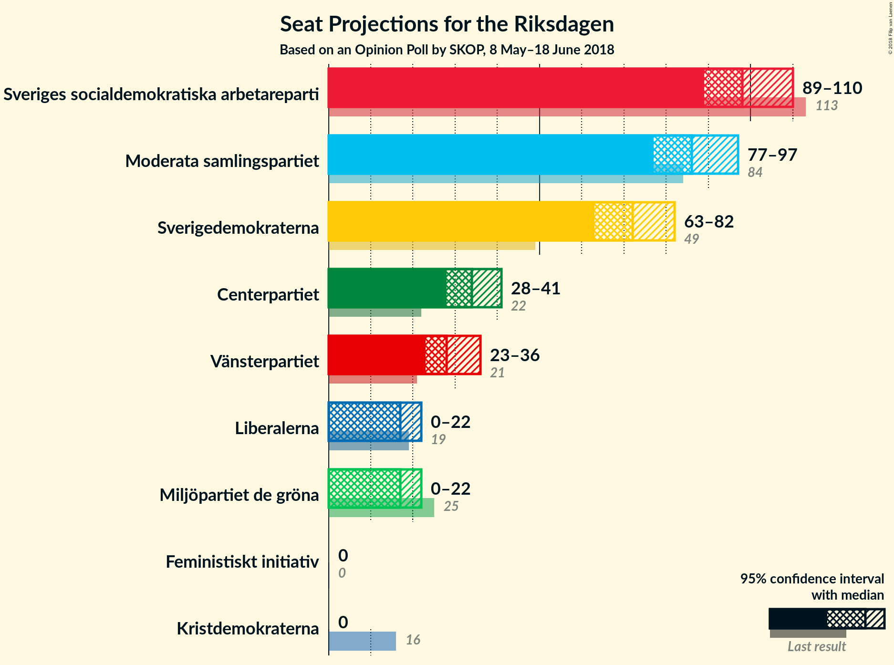
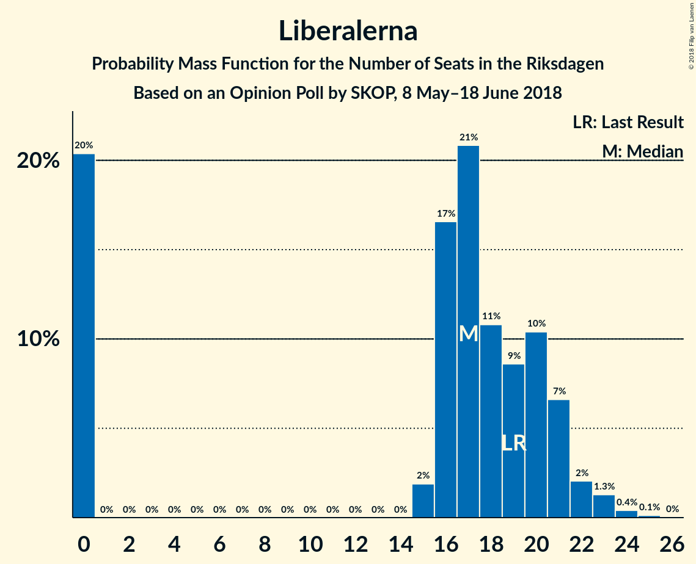

# Opinion Poll by SKOP, 8 May–18 June 2018

<a href="#voting-intentions">Voting Intentions</a> | <a href="#seats">Seats</a> | <a href="#coalitions">Coalitions</a> | <a href="#technical-information">Technical Information</a>

## Voting Intentions

### Confidence Intervals

| Party | Last Result | Poll Result | 80% Confidence Interval | 90% Confidence Interval | 95% Confidence Interval | 99% Confidence Interval |
|:-----:|:-----------:|:-----------:|:-----------------------:|:-----------------------:|:-----------------------:|:-----------------------:|
| Sveriges socialdemokratiska arbetareparti | 31.0% | 26.3% | 24.7–27.9% |24.3–28.4% |23.9–28.8% |23.2–29.6% |
| Moderata samlingspartiet | 23.3% | 22.9% | 21.4–24.5% |21.0–24.9% |20.6–25.3% |19.9–26.1% |
| Sverigedemokraterna | 12.9% | 19.0% | 17.6–20.5% |17.2–20.9% |16.9–21.3% |16.2–22.0% |
| Centerpartiet | 6.1% | 9.0% | 8.0–10.1% |7.8–10.5% |7.5–10.7% |7.1–11.3% |
| Vänsterpartiet | 5.7% | 7.6% | 6.7–8.7% |6.5–9.0% |6.3–9.3% |5.9–9.8% |
| Miljöpartiet de gröna | 6.9% | 4.5% | 3.8–5.3% |3.6–5.5% |3.4–5.8% |3.1–6.2% |
| Liberalerna | 5.4% | 4.5% | 3.8–5.3% |3.6–5.5% |3.4–5.8% |3.1–6.2% |
| Kristdemokraterna | 4.6% | 2.5% | 2.0–3.2% |1.9–3.4% |1.8–3.6% |1.6–3.9% |
| Feministiskt initiativ | 3.1% | 1.7% | 1.3–2.3% |1.2–2.5% |1.1–2.6% |0.9–2.9% |

*Note:* The poll result column reflects the actual value used in the calculations. Published results may vary slightly, and in addition be rounded to fewer digits.

## Seats

### Confidence Intervals

| Party | Last Result | Median | 80% Confidence Interval | 90% Confidence Interval | 95% Confidence Interval | 99% Confidence Interval |
|:-----:|:-----------:|:------:|:-----------------------:|:-----------------------:|:-----------------------:|:-----------------------:|
| <a href="#sveriges-socialdemokratiska-arbetareparti">Sveriges socialdemokratiska arbetareparti</a> | 113 | 96 | 92–113 |92–113 |89–113 |89–113 |
| <a href="#moderata-samlingspartiet">Moderata samlingspartiet</a> | 84 | 87 | 77–87 |77–92 |77–95 |77–95 |
| <a href="#sverigedemokraterna">Sverigedemokraterna</a> | 49 | 70 | 70–75 |70–75 |63–75 |61–75 |
| <a href="#centerpartiet">Centerpartiet</a> | 22 | 33 | 30–36 |30–36 |27–36 |27–36 |
| <a href="#vänsterpartiet">Vänsterpartiet</a> | 21 | 29 | 25–31 |25–31 |25–33 |25–33 |
| <a href="#miljöpartiet-de-gröna">Miljöpartiet de gröna</a> | 25 | 17 | 0–18 |0–18 |0–21 |0–21 |
| <a href="#liberalerna">Liberalerna</a> | 19 | 21 | 16–24 |16–24 |16–24 |16–25 |
| <a href="#kristdemokraterna">Kristdemokraterna</a> | 16 | 0 | 0 |0 |0 |0 |
| <a href="#feministiskt-initiativ">Feministiskt initiativ</a> | 0 | 0 | 0 |0 |0 |0 |

### Sveriges socialdemokratiska arbetareparti

*For a full overview of the results for this party, see the [Sveriges socialdemokratiska arbetareparti](party-sverigessocialdemokratiskaarbetareparti.html) page.*

| Number of Seats | Probability | Accumulated | Special Marks |
|:---------------:|:-----------:|:-----------:|:-------------:|
| 89 | 4% | 100% |  |
| 90 | 0% | 96% |  |
| 91 | 0% | 96% |  |
| 92 | 31% | 96% |  |
| 93 | 5% | 65% |  |
| 94 | 0% | 60% |  |
| 95 | 0.2% | 60% |  |
| 96 | 29% | 59% | Median |
| 97 | 0% | 30% |  |
| 98 | 0% | 30% |  |
| 99 | 0% | 30% |  |
| 100 | 0% | 30% |  |
| 101 | 0% | 30% |  |
| 102 | 0% | 30% |  |
| 103 | 0% | 30% |  |
| 104 | 0% | 30% |  |
| 105 | 0% | 30% |  |
| 106 | 0% | 30% |  |
| 107 | 0% | 30% |  |
| 108 | 0% | 30% |  |
| 109 | 0% | 30% |  |
| 110 | 0% | 30% |  |
| 111 | 0% | 30% |  |
| 112 | 0% | 30% |  |
| 113 | 30% | 30% | Last Result |
| 114 | 0% | 0.1% |  |
| 115 | 0% | 0.1% |  |
| 116 | 0% | 0% |  |

### Moderata samlingspartiet

*For a full overview of the results for this party, see the [Moderata samlingspartiet](party-moderatasamlingspartiet.html) page.*

| Number of Seats | Probability | Accumulated | Special Marks |
|:---------------:|:-----------:|:-----------:|:-------------:|
| 73 | 0.2% | 100% |  |
| 74 | 0% | 99.8% |  |
| 75 | 0% | 99.8% |  |
| 76 | 0% | 99.8% |  |
| 77 | 29% | 99.8% |  |
| 78 | 0% | 71% |  |
| 79 | 0% | 71% |  |
| 80 | 0% | 71% |  |
| 81 | 0% | 71% |  |
| 82 | 0% | 71% |  |
| 83 | 0% | 71% |  |
| 84 | 0% | 71% | Last Result |
| 85 | 0% | 71% |  |
| 86 | 0% | 71% |  |
| 87 | 61% | 71% | Median |
| 88 | 0.8% | 9% |  |
| 89 | 0% | 8% |  |
| 90 | 0% | 8% |  |
| 91 | 0% | 8% |  |
| 92 | 4% | 8% |  |
| 93 | 0% | 4% |  |
| 94 | 0% | 4% |  |
| 95 | 4% | 4% |  |
| 96 | 0% | 0% |  |

### Sverigedemokraterna

*For a full overview of the results for this party, see the [Sverigedemokraterna](party-sverigedemokraterna.html) page.*

| Number of Seats | Probability | Accumulated | Special Marks |
|:---------------:|:-----------:|:-----------:|:-------------:|
| 49 | 0% | 100% | Last Result |
| 50 | 0% | 100% |  |
| 51 | 0% | 100% |  |
| 52 | 0% | 100% |  |
| 53 | 0% | 100% |  |
| 54 | 0% | 100% |  |
| 55 | 0% | 100% |  |
| 56 | 0% | 100% |  |
| 57 | 0% | 100% |  |
| 58 | 0% | 100% |  |
| 59 | 0% | 100% |  |
| 60 | 0% | 100% |  |
| 61 | 0.7% | 100% |  |
| 62 | 0% | 99.3% |  |
| 63 | 4% | 99.3% |  |
| 64 | 0% | 95% |  |
| 65 | 0% | 95% |  |
| 66 | 0% | 95% |  |
| 67 | 0% | 95% |  |
| 68 | 0% | 95% |  |
| 69 | 0% | 95% |  |
| 70 | 62% | 95% | Median |
| 71 | 0% | 34% |  |
| 72 | 0% | 34% |  |
| 73 | 0% | 34% |  |
| 74 | 0% | 34% |  |
| 75 | 33% | 34% |  |
| 76 | 0% | 0.2% |  |
| 77 | 0% | 0.2% |  |
| 78 | 0% | 0.2% |  |
| 79 | 0% | 0.2% |  |
| 80 | 0% | 0.2% |  |
| 81 | 0% | 0.2% |  |
| 82 | 0.1% | 0.2% |  |
| 83 | 0% | 0% |  |

### Centerpartiet

*For a full overview of the results for this party, see the [Centerpartiet](party-centerpartiet.html) page.*

| Number of Seats | Probability | Accumulated | Special Marks |
|:---------------:|:-----------:|:-----------:|:-------------:|
| 22 | 0% | 100% | Last Result |
| 23 | 0% | 100% |  |
| 24 | 0% | 100% |  |
| 25 | 0% | 100% |  |
| 26 | 0% | 100% |  |
| 27 | 4% | 100% |  |
| 28 | 0% | 96% |  |
| 29 | 0% | 96% |  |
| 30 | 31% | 96% |  |
| 31 | 0% | 64% |  |
| 32 | 5% | 64% |  |
| 33 | 30% | 60% | Median |
| 34 | 0% | 30% |  |
| 35 | 0% | 30% |  |
| 36 | 29% | 30% |  |
| 37 | 0% | 0.4% |  |
| 38 | 0% | 0.4% |  |
| 39 | 0% | 0.3% |  |
| 40 | 0.2% | 0.3% |  |
| 41 | 0% | 0.2% |  |
| 42 | 0.1% | 0.2% |  |
| 43 | 0% | 0% |  |

### Vänsterpartiet

*For a full overview of the results for this party, see the [Vänsterpartiet](party-vänsterpartiet.html) page.*

| Number of Seats | Probability | Accumulated | Special Marks |
|:---------------:|:-----------:|:-----------:|:-------------:|
| 21 | 0% | 100% | Last Result |
| 22 | 0% | 100% |  |
| 23 | 0% | 100% |  |
| 24 | 0% | 100% |  |
| 25 | 30% | 100% |  |
| 26 | 0.2% | 70% |  |
| 27 | 4% | 70% |  |
| 28 | 0% | 65% |  |
| 29 | 31% | 65% | Median |
| 30 | 0% | 34% |  |
| 31 | 29% | 34% |  |
| 32 | 0% | 5% |  |
| 33 | 5% | 5% |  |
| 34 | 0% | 0% |  |

### Miljöpartiet de gröna

*For a full overview of the results for this party, see the [Miljöpartiet de gröna](party-miljöpartietdegröna.html) page.*

| Number of Seats | Probability | Accumulated | Special Marks |
|:---------------:|:-----------:|:-----------:|:-------------:|
| 0 | 30% | 100% |  |
| 1 | 0% | 70% |  |
| 2 | 0% | 70% |  |
| 3 | 0% | 70% |  |
| 4 | 0% | 70% |  |
| 5 | 0% | 70% |  |
| 6 | 0% | 70% |  |
| 7 | 0% | 70% |  |
| 8 | 0% | 70% |  |
| 9 | 0% | 70% |  |
| 10 | 0% | 70% |  |
| 11 | 0% | 70% |  |
| 12 | 0% | 70% |  |
| 13 | 0% | 70% |  |
| 14 | 0% | 70% |  |
| 15 | 4% | 70% |  |
| 16 | 0% | 65% |  |
| 17 | 32% | 65% | Median |
| 18 | 29% | 33% |  |
| 19 | 0.2% | 4% |  |
| 20 | 0% | 4% |  |
| 21 | 4% | 4% |  |
| 22 | 0% | 0% |  |
| 23 | 0% | 0% |  |
| 24 | 0% | 0% |  |
| 25 | 0% | 0% | Last Result |

### Liberalerna

*For a full overview of the results for this party, see the [Liberalerna](party-liberalerna.html) page.*

| Number of Seats | Probability | Accumulated | Special Marks |
|:---------------:|:-----------:|:-----------:|:-------------:|
| 16 | 33% | 100% |  |
| 17 | 0% | 67% |  |
| 18 | 0.2% | 67% |  |
| 19 | 0.2% | 67% | Last Result |
| 20 | 4% | 66% |  |
| 21 | 30% | 62% | Median |
| 22 | 0% | 32% |  |
| 23 | 0% | 32% |  |
| 24 | 31% | 32% |  |
| 25 | 0.7% | 0.7% |  |
| 26 | 0% | 0% |  |

### Kristdemokraterna

*For a full overview of the results for this party, see the [Kristdemokraterna](party-kristdemokraterna.html) page.*

| Number of Seats | Probability | Accumulated | Special Marks |
|:---------------:|:-----------:|:-----------:|:-------------:|
| 0 | 100% | 100% | Median |
| 1 | 0% | 0% |  |
| 2 | 0% | 0% |  |
| 3 | 0% | 0% |  |
| 4 | 0% | 0% |  |
| 5 | 0% | 0% |  |
| 6 | 0% | 0% |  |
| 7 | 0% | 0% |  |
| 8 | 0% | 0% |  |
| 9 | 0% | 0% |  |
| 10 | 0% | 0% |  |
| 11 | 0% | 0% |  |
| 12 | 0% | 0% |  |
| 13 | 0% | 0% |  |
| 14 | 0% | 0% |  |
| 15 | 0% | 0% |  |
| 16 | 0% | 0% | Last Result |

### Feministiskt initiativ

*For a full overview of the results for this party, see the [Feministiskt initiativ](party-feministisktinitiativ.html) page.*

| Number of Seats | Probability | Accumulated | Special Marks |
|:---------------:|:-----------:|:-----------:|:-------------:|
| 0 | 100% | 100% | Last Result, Median |

## Coalitions

### Confidence Intervals

| Coalition | Last Result | Median | Majority? | 80% Confidence Interval | 90% Confidence Interval | 95% Confidence Interval | 99% Confidence Interval |
|:---------:|:-----------:|:------:|:---------:|:-----------------------:|:-----------------------:|:-----------------------:|:-----------------------:|
| Sveriges socialdemokratiska arbetareparti – Moderata samlingspartiet | 197 | 179 | 71% | 173–200 | 173–200 | 173–200 | 173–200 |
| Sveriges socialdemokratiska arbetareparti – Vänsterpartiet – Miljöpartiet de gröna – Feministiskt initiativ | 159 | 138 | 0% | 138–145 | 138–145 | 135–145 | 135–145 |
| Sveriges socialdemokratiska arbetareparti – Vänsterpartiet – Miljöpartiet de gröna | 159 | 138 | 0% | 138–145 | 138–145 | 135–145 | 135–145 |
| Moderata samlingspartiet – Centerpartiet – Liberalerna – Kristdemokraterna | 141 | 141 | 0% | 129–141 | 129–141 | 129–143 | 129–145 |
| Moderata samlingspartiet – Centerpartiet – Liberalerna | 125 | 141 | 0% | 129–141 | 129–141 | 129–143 | 129–145 |
| Sveriges socialdemokratiska arbetareparti – Vänsterpartiet | 134 | 127 | 0% | 121–138 | 121–138 | 120–138 | 120–138 |
| Moderata samlingspartiet – Centerpartiet – Kristdemokraterna | 122 | 117 | 0% | 113–120 | 113–120 | 113–127 | 113–127 |
| Moderata samlingspartiet – Centerpartiet | 106 | 117 | 0% | 113–120 | 113–120 | 113–127 | 113–127 |
| Sveriges socialdemokratiska arbetareparti – Miljöpartiet de gröna | 138 | 113 | 0% | 109–114 | 109–114 | 108–114 | 108–114 |

### Sveriges socialdemokratiska arbetareparti – Moderata samlingspartiet

| Number of Seats | Probability | Accumulated | Special Marks |
|:---------------:|:-----------:|:-----------:|:-------------:|
| 168 | 0.2% | 100% |  |
| 169 | 0% | 99.8% |  |
| 170 | 0% | 99.8% |  |
| 171 | 0% | 99.8% |  |
| 172 | 0% | 99.8% |  |
| 173 | 29% | 99.8% |  |
| 174 | 0% | 71% |  |
| 175 | 0% | 71% | Majority |
| 176 | 0% | 71% |  |
| 177 | 0% | 71% |  |
| 178 | 0% | 71% |  |
| 179 | 31% | 71% |  |
| 180 | 0% | 39% |  |
| 181 | 0.8% | 39% |  |
| 182 | 0% | 39% |  |
| 183 | 0% | 39% | Median |
| 184 | 4% | 39% |  |
| 185 | 4% | 34% |  |
| 186 | 0% | 30% |  |
| 187 | 0% | 30% |  |
| 188 | 0% | 30% |  |
| 189 | 0% | 30% |  |
| 190 | 0% | 30% |  |
| 191 | 0% | 30% |  |
| 192 | 0% | 30% |  |
| 193 | 0% | 30% |  |
| 194 | 0% | 30% |  |
| 195 | 0% | 30% |  |
| 196 | 0% | 30% |  |
| 197 | 0% | 30% | Last Result |
| 198 | 0% | 30% |  |
| 199 | 0% | 30% |  |
| 200 | 30% | 30% |  |
| 201 | 0% | 0% |  |

### Sveriges socialdemokratiska arbetareparti – Vänsterpartiet – Miljöpartiet de gröna – Feministiskt initiativ

| Number of Seats | Probability | Accumulated | Special Marks |
|:---------------:|:-----------:|:-----------:|:-------------:|
| 119 | 0.1% | 100% |  |
| 120 | 0% | 99.9% |  |
| 121 | 0% | 99.9% |  |
| 122 | 0% | 99.8% |  |
| 123 | 0% | 99.8% |  |
| 124 | 0% | 99.8% |  |
| 125 | 0% | 99.8% |  |
| 126 | 0% | 99.8% |  |
| 127 | 0% | 99.8% |  |
| 128 | 0% | 99.8% |  |
| 129 | 0% | 99.8% |  |
| 130 | 0% | 99.8% |  |
| 131 | 0% | 99.8% |  |
| 132 | 0% | 99.8% |  |
| 133 | 0% | 99.8% |  |
| 134 | 0% | 99.8% |  |
| 135 | 4% | 99.8% |  |
| 136 | 0% | 96% |  |
| 137 | 0% | 96% |  |
| 138 | 61% | 96% |  |
| 139 | 0% | 34% |  |
| 140 | 0% | 34% |  |
| 141 | 0% | 34% |  |
| 142 | 0% | 34% | Median |
| 143 | 5% | 34% |  |
| 144 | 0% | 29% |  |
| 145 | 29% | 29% |  |
| 146 | 0% | 0.3% |  |
| 147 | 0.2% | 0.3% |  |
| 148 | 0% | 0.1% |  |
| 149 | 0% | 0.1% |  |
| 150 | 0% | 0.1% |  |
| 151 | 0% | 0.1% |  |
| 152 | 0% | 0.1% |  |
| 153 | 0% | 0.1% |  |
| 154 | 0% | 0.1% |  |
| 155 | 0% | 0.1% |  |
| 156 | 0% | 0% |  |
| 157 | 0% | 0% |  |
| 158 | 0% | 0% |  |
| 159 | 0% | 0% | Last Result |

### Sveriges socialdemokratiska arbetareparti – Vänsterpartiet – Miljöpartiet de gröna

| Number of Seats | Probability | Accumulated | Special Marks |
|:---------------:|:-----------:|:-----------:|:-------------:|
| 119 | 0.1% | 100% |  |
| 120 | 0% | 99.9% |  |
| 121 | 0% | 99.9% |  |
| 122 | 0% | 99.8% |  |
| 123 | 0% | 99.8% |  |
| 124 | 0% | 99.8% |  |
| 125 | 0% | 99.8% |  |
| 126 | 0% | 99.8% |  |
| 127 | 0% | 99.8% |  |
| 128 | 0% | 99.8% |  |
| 129 | 0% | 99.8% |  |
| 130 | 0% | 99.8% |  |
| 131 | 0% | 99.8% |  |
| 132 | 0% | 99.8% |  |
| 133 | 0% | 99.8% |  |
| 134 | 0% | 99.8% |  |
| 135 | 4% | 99.8% |  |
| 136 | 0% | 96% |  |
| 137 | 0% | 96% |  |
| 138 | 61% | 96% |  |
| 139 | 0% | 34% |  |
| 140 | 0% | 34% |  |
| 141 | 0% | 34% |  |
| 142 | 0% | 34% | Median |
| 143 | 5% | 34% |  |
| 144 | 0% | 29% |  |
| 145 | 29% | 29% |  |
| 146 | 0% | 0.3% |  |
| 147 | 0.2% | 0.3% |  |
| 148 | 0% | 0.1% |  |
| 149 | 0% | 0.1% |  |
| 150 | 0% | 0.1% |  |
| 151 | 0% | 0.1% |  |
| 152 | 0% | 0.1% |  |
| 153 | 0% | 0.1% |  |
| 154 | 0% | 0.1% |  |
| 155 | 0% | 0.1% |  |
| 156 | 0% | 0% |  |
| 157 | 0% | 0% |  |
| 158 | 0% | 0% |  |
| 159 | 0% | 0% | Last Result |

### Moderata samlingspartiet – Centerpartiet – Liberalerna – Kristdemokraterna

| Number of Seats | Probability | Accumulated | Special Marks |
|:---------------:|:-----------:|:-----------:|:-------------:|
| 128 | 0% | 100% |  |
| 129 | 29% | 99.9% |  |
| 130 | 0% | 71% |  |
| 131 | 0% | 71% |  |
| 132 | 0.2% | 71% |  |
| 133 | 0% | 71% |  |
| 134 | 0% | 71% |  |
| 135 | 0% | 71% |  |
| 136 | 0% | 71% |  |
| 137 | 0% | 71% |  |
| 138 | 0% | 71% |  |
| 139 | 4% | 71% |  |
| 140 | 0% | 66% |  |
| 141 | 61% | 66% | Last Result, Median |
| 142 | 0% | 5% |  |
| 143 | 4% | 5% |  |
| 144 | 0% | 0.9% |  |
| 145 | 0.7% | 0.9% |  |
| 146 | 0% | 0.2% |  |
| 147 | 0% | 0.2% |  |
| 148 | 0.1% | 0.2% |  |
| 149 | 0% | 0% |  |

### Moderata samlingspartiet – Centerpartiet – Liberalerna

| Number of Seats | Probability | Accumulated | Special Marks |
|:---------------:|:-----------:|:-----------:|:-------------:|
| 125 | 0% | 100% | Last Result |
| 126 | 0% | 100% |  |
| 127 | 0% | 100% |  |
| 128 | 0% | 100% |  |
| 129 | 29% | 99.9% |  |
| 130 | 0% | 71% |  |
| 131 | 0% | 71% |  |
| 132 | 0.2% | 71% |  |
| 133 | 0% | 71% |  |
| 134 | 0% | 71% |  |
| 135 | 0% | 71% |  |
| 136 | 0% | 71% |  |
| 137 | 0% | 71% |  |
| 138 | 0% | 71% |  |
| 139 | 4% | 71% |  |
| 140 | 0% | 66% |  |
| 141 | 61% | 66% | Median |
| 142 | 0% | 5% |  |
| 143 | 4% | 5% |  |
| 144 | 0% | 0.9% |  |
| 145 | 0.7% | 0.9% |  |
| 146 | 0% | 0.2% |  |
| 147 | 0% | 0.2% |  |
| 148 | 0.1% | 0.2% |  |
| 149 | 0% | 0% |  |

### Sveriges socialdemokratiska arbetareparti – Vänsterpartiet

| Number of Seats | Probability | Accumulated | Special Marks |
|:---------------:|:-----------:|:-----------:|:-------------:|
| 119 | 0.1% | 100% |  |
| 120 | 4% | 99.8% |  |
| 121 | 31% | 96% |  |
| 122 | 4% | 64% |  |
| 123 | 0% | 60% |  |
| 124 | 0% | 60% |  |
| 125 | 0% | 60% | Median |
| 126 | 0.6% | 60% |  |
| 127 | 29% | 60% |  |
| 128 | 0.2% | 30% |  |
| 129 | 0% | 30% |  |
| 130 | 0% | 30% |  |
| 131 | 0% | 30% |  |
| 132 | 0% | 30% |  |
| 133 | 0% | 30% |  |
| 134 | 0% | 30% | Last Result |
| 135 | 0% | 30% |  |
| 136 | 0% | 30% |  |
| 137 | 0% | 30% |  |
| 138 | 30% | 30% |  |
| 139 | 0% | 0.1% |  |
| 140 | 0% | 0.1% |  |
| 141 | 0% | 0.1% |  |
| 142 | 0% | 0.1% |  |
| 143 | 0% | 0.1% |  |
| 144 | 0% | 0% |  |

### Moderata samlingspartiet – Centerpartiet – Kristdemokraterna

| Number of Seats | Probability | Accumulated | Special Marks |
|:---------------:|:-----------:|:-----------:|:-------------:|
| 107 | 0% | 100% |  |
| 108 | 0% | 99.9% |  |
| 109 | 0% | 99.9% |  |
| 110 | 0% | 99.9% |  |
| 111 | 0% | 99.9% |  |
| 112 | 0% | 99.9% |  |
| 113 | 29% | 99.9% |  |
| 114 | 0% | 71% |  |
| 115 | 0% | 71% |  |
| 116 | 0% | 71% |  |
| 117 | 31% | 71% |  |
| 118 | 0% | 39% |  |
| 119 | 4% | 39% |  |
| 120 | 31% | 35% | Median |
| 121 | 0% | 4% |  |
| 122 | 0% | 4% | Last Result |
| 123 | 0% | 4% |  |
| 124 | 0% | 4% |  |
| 125 | 0% | 4% |  |
| 126 | 0% | 4% |  |
| 127 | 4% | 4% |  |
| 128 | 0% | 0.2% |  |
| 129 | 0% | 0.2% |  |
| 130 | 0.1% | 0.2% |  |
| 131 | 0% | 0% |  |

### Moderata samlingspartiet – Centerpartiet

| Number of Seats | Probability | Accumulated | Special Marks |
|:---------------:|:-----------:|:-----------:|:-------------:|
| 106 | 0% | 100% | Last Result |
| 107 | 0% | 100% |  |
| 108 | 0% | 99.9% |  |
| 109 | 0% | 99.9% |  |
| 110 | 0% | 99.9% |  |
| 111 | 0% | 99.9% |  |
| 112 | 0% | 99.9% |  |
| 113 | 29% | 99.9% |  |
| 114 | 0% | 71% |  |
| 115 | 0% | 71% |  |
| 116 | 0% | 71% |  |
| 117 | 31% | 71% |  |
| 118 | 0% | 39% |  |
| 119 | 4% | 39% |  |
| 120 | 31% | 35% | Median |
| 121 | 0% | 4% |  |
| 122 | 0% | 4% |  |
| 123 | 0% | 4% |  |
| 124 | 0% | 4% |  |
| 125 | 0% | 4% |  |
| 126 | 0% | 4% |  |
| 127 | 4% | 4% |  |
| 128 | 0% | 0.2% |  |
| 129 | 0% | 0.2% |  |
| 130 | 0.1% | 0.2% |  |
| 131 | 0% | 0% |  |

### Sveriges socialdemokratiska arbetareparti – Miljöpartiet de gröna

| Number of Seats | Probability | Accumulated | Special Marks |
|:---------------:|:-----------:|:-----------:|:-------------:|
| 93 | 0.1% | 100% |  |
| 94 | 0% | 99.8% |  |
| 95 | 0% | 99.8% |  |
| 96 | 0% | 99.8% |  |
| 97 | 0% | 99.8% |  |
| 98 | 0% | 99.8% |  |
| 99 | 0% | 99.8% |  |
| 100 | 0% | 99.8% |  |
| 101 | 0% | 99.8% |  |
| 102 | 0% | 99.8% |  |
| 103 | 0% | 99.8% |  |
| 104 | 0% | 99.8% |  |
| 105 | 0% | 99.8% |  |
| 106 | 0% | 99.8% |  |
| 107 | 0% | 99.8% |  |
| 108 | 4% | 99.8% |  |
| 109 | 31% | 96% |  |
| 110 | 5% | 64% |  |
| 111 | 0% | 60% |  |
| 112 | 0% | 60% |  |
| 113 | 30% | 60% | Median |
| 114 | 29% | 29% |  |
| 115 | 0% | 0.1% |  |
| 116 | 0% | 0.1% |  |
| 117 | 0% | 0.1% |  |
| 118 | 0% | 0.1% |  |
| 119 | 0% | 0.1% |  |
| 120 | 0% | 0.1% |  |
| 121 | 0% | 0.1% |  |
| 122 | 0% | 0.1% |  |
| 123 | 0% | 0% |  |
| 124 | 0% | 0% |  |
| 125 | 0% | 0% |  |
| 126 | 0% | 0% |  |
| 127 | 0% | 0% |  |
| 128 | 0% | 0% |  |
| 129 | 0% | 0% |  |
| 130 | 0% | 0% |  |
| 131 | 0% | 0% |  |
| 132 | 0% | 0% |  |
| 133 | 0% | 0% |  |
| 134 | 0% | 0% |  |
| 135 | 0% | 0% |  |
| 136 | 0% | 0% |  |
| 137 | 0% | 0% |  |
| 138 | 0% | 0% | Last Result |

## Technical Information

### Opinion Poll

+ **Polling firm:** SKOP
+ **Commissioner(s):** —
+ **Fieldwork period:** 8 May–18 June 2018

### Calculations

+ **Sample size:** 1233
+ **Simulations done:** 1,024
+ **Error estimate:** 2.16%

