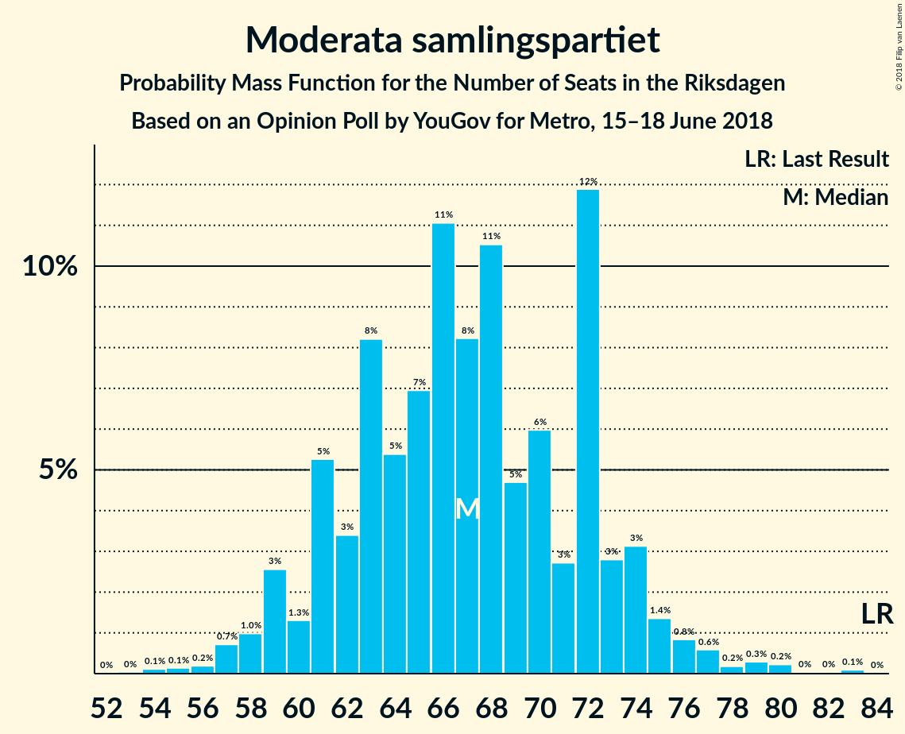
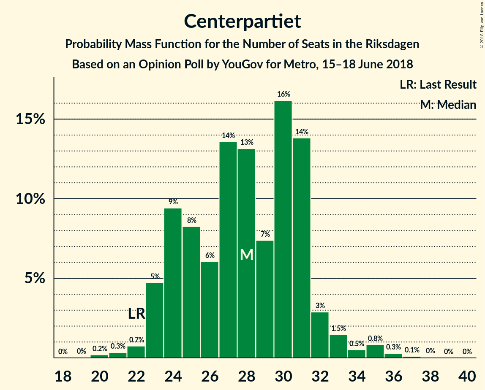

# Opinion Poll by YouGov for Metro, 15–18 June 2018

<a href="#voting-intentions">Voting Intentions</a> | <a href="#seats">Seats</a> | <a href="#coalitions">Coalitions</a> | <a href="#technical-information">Technical Information</a>

## Voting Intentions

### Confidence Intervals

| Party | Last Result | Poll Result | 80% Confidence Interval | 90% Confidence Interval | 95% Confidence Interval | 99% Confidence Interval |
|:-----:|:-----------:|:-----------:|:-----------------------:|:-----------------------:|:-----------------------:|:-----------------------:|
| Sverigedemokraterna | 12.9% | 28.4% | 27.0–29.9% |26.6–30.4% |26.2–30.7% |25.5–31.5% |
| Sveriges socialdemokratiska arbetareparti | 31.0% | 22.0% | 20.7–23.4% |20.3–23.8% |20.0–24.1% |19.3–24.8% |
| Moderata samlingspartiet | 23.3% | 17.2% | 16.0–18.5% |15.7–18.9% |15.4–19.2% |14.9–19.9% |
| Vänsterpartiet | 5.7% | 9.3% | 8.4–10.3% |8.1–10.6% |7.9–10.9% |7.5–11.4% |
| Centerpartiet | 6.1% | 7.1% | 6.3–8.0% |6.1–8.3% |5.9–8.5% |5.6–9.0% |
| Liberalerna | 5.4% | 4.3% | 3.7–5.0% |3.5–5.2% |3.4–5.4% |3.1–5.8% |
| Miljöpartiet de gröna | 6.9% | 3.8% | 3.2–4.5% |3.1–4.7% |3.0–4.9% |2.7–5.3% |
| Kristdemokraterna | 4.6% | 3.1% | 2.6–3.7% |2.4–3.9% |2.3–4.1% |2.1–4.4% |
| Feministiskt initiativ | 3.1% | 1.4% | 1.1–1.9% |1.0–2.0% |0.9–2.1% |0.8–2.4% |

*Note:* The poll result column reflects the actual value used in the calculations. Published results may vary slightly, and in addition be rounded to fewer digits.

## Seats

### Confidence Intervals

| Party | Last Result | Median | 80% Confidence Interval | 90% Confidence Interval | 95% Confidence Interval | 99% Confidence Interval |
|:-----:|:-----------:|:------:|:-----------------------:|:-----------------------:|:-----------------------:|:-----------------------:|
| <a href="#sverigedemokraterna">Sverigedemokraterna</a> | 49 | 111 | 103–119 |100–122 |99–126 |97–127 |
| <a href="#sveriges-socialdemokratiska-arbetareparti">Sveriges socialdemokratiska arbetareparti</a> | 113 | 86 | 79–92 |77–92 |76–95 |73–99 |
| <a href="#moderata-samlingspartiet">Moderata samlingspartiet</a> | 84 | 67 | 61–72 |60–74 |59–75 |56–79 |
| <a href="#vänsterpartiet">Vänsterpartiet</a> | 21 | 36 | 32–40 |31–41 |31–43 |29–45 |
| <a href="#centerpartiet">Centerpartiet</a> | 22 | 28 | 24–31 |23–32 |23–33 |21–35 |
| <a href="#liberalerna">Liberalerna</a> | 19 | 16 | 0–19 |0–20 |0–21 |0–23 |
| <a href="#miljöpartiet-de-gröna">Miljöpartiet de gröna</a> | 25 | 0 | 0–17 |0–18 |0–19 |0–20 |
| <a href="#kristdemokraterna">Kristdemokraterna</a> | 16 | 0 | 0 |0 |0–15 |0–17 |
| <a href="#feministiskt-initiativ">Feministiskt initiativ</a> | 0 | 0 | 0 |0 |0 |0 |

### Sverigedemokraterna

*For a full overview of the results for this party, see the [Sverigedemokraterna](party-sverigedemokraterna.html) page.*

| Number of Seats | Probability | Accumulated | Special Marks |
|:---------------:|:-----------:|:-----------:|:-------------:|
| 49 | 0% | 100% | Last Result |
| 50 | 0% | 100% |  |
| 51 | 0% | 100% |  |
| 52 | 0% | 100% |  |
| 53 | 0% | 100% |  |
| 54 | 0% | 100% |  |
| 55 | 0% | 100% |  |
| 56 | 0% | 100% |  |
| 57 | 0% | 100% |  |
| 58 | 0% | 100% |  |
| 59 | 0% | 100% |  |
| 60 | 0% | 100% |  |
| 61 | 0% | 100% |  |
| 62 | 0% | 100% |  |
| 63 | 0% | 100% |  |
| 64 | 0% | 100% |  |
| 65 | 0% | 100% |  |
| 66 | 0% | 100% |  |
| 67 | 0% | 100% |  |
| 68 | 0% | 100% |  |
| 69 | 0% | 100% |  |
| 70 | 0% | 100% |  |
| 71 | 0% | 100% |  |
| 72 | 0% | 100% |  |
| 73 | 0% | 100% |  |
| 74 | 0% | 100% |  |
| 75 | 0% | 100% |  |
| 76 | 0% | 100% |  |
| 77 | 0% | 100% |  |
| 78 | 0% | 100% |  |
| 79 | 0% | 100% |  |
| 80 | 0% | 100% |  |
| 81 | 0% | 100% |  |
| 82 | 0% | 100% |  |
| 83 | 0% | 100% |  |
| 84 | 0% | 100% |  |
| 85 | 0% | 100% |  |
| 86 | 0% | 100% |  |
| 87 | 0% | 100% |  |
| 88 | 0% | 100% |  |
| 89 | 0% | 100% |  |
| 90 | 0% | 100% |  |
| 91 | 0% | 100% |  |
| 92 | 0% | 100% |  |
| 93 | 0% | 100% |  |
| 94 | 0.1% | 99.9% |  |
| 95 | 0.1% | 99.8% |  |
| 96 | 0.2% | 99.7% |  |
| 97 | 0.9% | 99.5% |  |
| 98 | 0.3% | 98.6% |  |
| 99 | 2% | 98% |  |
| 100 | 1.5% | 96% |  |
| 101 | 2% | 95% |  |
| 102 | 1.1% | 93% |  |
| 103 | 3% | 92% |  |
| 104 | 2% | 89% |  |
| 105 | 5% | 87% |  |
| 106 | 3% | 82% |  |
| 107 | 3% | 79% |  |
| 108 | 4% | 76% |  |
| 109 | 7% | 73% |  |
| 110 | 7% | 66% |  |
| 111 | 11% | 58% | Median |
| 112 | 7% | 47% |  |
| 113 | 14% | 40% |  |
| 114 | 3% | 26% |  |
| 115 | 5% | 22% |  |
| 116 | 4% | 17% |  |
| 117 | 1.2% | 14% |  |
| 118 | 0.9% | 12% |  |
| 119 | 5% | 12% |  |
| 120 | 0.5% | 6% |  |
| 121 | 0.8% | 6% |  |
| 122 | 0.6% | 5% |  |
| 123 | 1.0% | 5% |  |
| 124 | 0.4% | 3% |  |
| 125 | 0.5% | 3% |  |
| 126 | 0.2% | 3% |  |
| 127 | 2% | 2% |  |
| 128 | 0% | 0.1% |  |
| 129 | 0% | 0.1% |  |
| 130 | 0% | 0.1% |  |
| 131 | 0% | 0% |  |

### Sveriges socialdemokratiska arbetareparti

*For a full overview of the results for this party, see the [Sveriges socialdemokratiska arbetareparti](party-sverigessocialdemokratiskaarbetareparti.html) page.*

| Number of Seats | Probability | Accumulated | Special Marks |
|:---------------:|:-----------:|:-----------:|:-------------:|
| 71 | 0.1% | 100% |  |
| 72 | 0.2% | 99.9% |  |
| 73 | 0.3% | 99.7% |  |
| 74 | 0.5% | 99.4% |  |
| 75 | 0.8% | 98.9% |  |
| 76 | 0.9% | 98% |  |
| 77 | 3% | 97% |  |
| 78 | 2% | 94% |  |
| 79 | 5% | 92% |  |
| 80 | 5% | 87% |  |
| 81 | 5% | 82% |  |
| 82 | 6% | 77% |  |
| 83 | 5% | 71% |  |
| 84 | 11% | 66% |  |
| 85 | 6% | 56% |  |
| 86 | 7% | 50% | Median |
| 87 | 6% | 43% |  |
| 88 | 9% | 37% |  |
| 89 | 6% | 28% |  |
| 90 | 7% | 22% |  |
| 91 | 2% | 14% |  |
| 92 | 7% | 12% |  |
| 93 | 0.8% | 5% |  |
| 94 | 0.6% | 4% |  |
| 95 | 1.2% | 4% |  |
| 96 | 0.5% | 2% |  |
| 97 | 0.7% | 2% |  |
| 98 | 0.6% | 1.1% |  |
| 99 | 0.3% | 0.5% |  |
| 100 | 0.1% | 0.2% |  |
| 101 | 0.1% | 0.1% |  |
| 102 | 0% | 0.1% |  |
| 103 | 0% | 0% |  |
| 104 | 0% | 0% |  |
| 105 | 0% | 0% |  |
| 106 | 0% | 0% |  |
| 107 | 0% | 0% |  |
| 108 | 0% | 0% |  |
| 109 | 0% | 0% |  |
| 110 | 0% | 0% |  |
| 111 | 0% | 0% |  |
| 112 | 0% | 0% |  |
| 113 | 0% | 0% | Last Result |

### Moderata samlingspartiet

*For a full overview of the results for this party, see the [Moderata samlingspartiet](party-moderatasamlingspartiet.html) page.*

| Number of Seats | Probability | Accumulated | Special Marks |
|:---------------:|:-----------:|:-----------:|:-------------:|
| 53 | 0% | 100% |  |
| 54 | 0.1% | 99.9% |  |
| 55 | 0.1% | 99.8% |  |
| 56 | 0.2% | 99.7% |  |
| 57 | 0.7% | 99.5% |  |
| 58 | 1.0% | 98.8% |  |
| 59 | 3% | 98% |  |
| 60 | 1.3% | 95% |  |
| 61 | 5% | 94% |  |
| 62 | 3% | 89% |  |
| 63 | 8% | 85% |  |
| 64 | 5% | 77% |  |
| 65 | 7% | 72% |  |
| 66 | 11% | 65% |  |
| 67 | 8% | 54% | Median |
| 68 | 11% | 45% |  |
| 69 | 5% | 35% |  |
| 70 | 6% | 30% |  |
| 71 | 3% | 24% |  |
| 72 | 12% | 21% |  |
| 73 | 3% | 10% |  |
| 74 | 3% | 7% |  |
| 75 | 1.4% | 4% |  |
| 76 | 0.8% | 2% |  |
| 77 | 0.6% | 1.5% |  |
| 78 | 0.2% | 0.9% |  |
| 79 | 0.3% | 0.7% |  |
| 80 | 0.2% | 0.4% |  |
| 81 | 0% | 0.2% |  |
| 82 | 0% | 0.1% |  |
| 83 | 0.1% | 0.1% |  |
| 84 | 0% | 0% | Last Result |

### Vänsterpartiet

*For a full overview of the results for this party, see the [Vänsterpartiet](party-vänsterpartiet.html) page.*

| Number of Seats | Probability | Accumulated | Special Marks |
|:---------------:|:-----------:|:-----------:|:-------------:|
| 21 | 0% | 100% | Last Result |
| 22 | 0% | 100% |  |
| 23 | 0% | 100% |  |
| 24 | 0% | 100% |  |
| 25 | 0% | 100% |  |
| 26 | 0% | 100% |  |
| 27 | 0.1% | 100% |  |
| 28 | 0.3% | 99.8% |  |
| 29 | 0.7% | 99.6% |  |
| 30 | 1.2% | 98.8% |  |
| 31 | 3% | 98% |  |
| 32 | 6% | 95% |  |
| 33 | 6% | 89% |  |
| 34 | 11% | 83% |  |
| 35 | 10% | 72% |  |
| 36 | 15% | 62% | Median |
| 37 | 13% | 47% |  |
| 38 | 6% | 34% |  |
| 39 | 16% | 27% |  |
| 40 | 4% | 12% |  |
| 41 | 3% | 8% |  |
| 42 | 2% | 5% |  |
| 43 | 2% | 3% |  |
| 44 | 0.6% | 1.2% |  |
| 45 | 0.3% | 0.6% |  |
| 46 | 0.2% | 0.3% |  |
| 47 | 0.1% | 0.1% |  |
| 48 | 0% | 0% |  |

### Centerpartiet

*For a full overview of the results for this party, see the [Centerpartiet](party-centerpartiet.html) page.*

| Number of Seats | Probability | Accumulated | Special Marks |
|:---------------:|:-----------:|:-----------:|:-------------:|
| 20 | 0.2% | 100% |  |
| 21 | 0.3% | 99.8% |  |
| 22 | 0.7% | 99.4% | Last Result |
| 23 | 5% | 98.7% |  |
| 24 | 9% | 94% |  |
| 25 | 8% | 85% |  |
| 26 | 6% | 76% |  |
| 27 | 14% | 70% |  |
| 28 | 13% | 57% | Median |
| 29 | 7% | 44% |  |
| 30 | 16% | 36% |  |
| 31 | 14% | 20% |  |
| 32 | 3% | 6% |  |
| 33 | 1.5% | 3% |  |
| 34 | 0.5% | 2% |  |
| 35 | 0.8% | 1.3% |  |
| 36 | 0.3% | 0.4% |  |
| 37 | 0.1% | 0.2% |  |
| 38 | 0% | 0.1% |  |
| 39 | 0% | 0% |  |

### Liberalerna

*For a full overview of the results for this party, see the [Liberalerna](party-liberalerna.html) page.*

| Number of Seats | Probability | Accumulated | Special Marks |
|:---------------:|:-----------:|:-----------:|:-------------:|
| 0 | 31% | 100% |  |
| 1 | 0% | 69% |  |
| 2 | 0% | 69% |  |
| 3 | 0% | 69% |  |
| 4 | 0% | 69% |  |
| 5 | 0% | 69% |  |
| 6 | 0% | 69% |  |
| 7 | 0% | 69% |  |
| 8 | 0% | 69% |  |
| 9 | 0% | 69% |  |
| 10 | 0% | 69% |  |
| 11 | 0% | 69% |  |
| 12 | 0% | 69% |  |
| 13 | 0% | 69% |  |
| 14 | 0% | 69% |  |
| 15 | 2% | 69% |  |
| 16 | 21% | 67% | Median |
| 17 | 12% | 46% |  |
| 18 | 13% | 34% |  |
| 19 | 14% | 21% | Last Result |
| 20 | 4% | 8% |  |
| 21 | 2% | 4% |  |
| 22 | 0.8% | 1.4% |  |
| 23 | 0.5% | 0.6% |  |
| 24 | 0.1% | 0.1% |  |
| 25 | 0% | 0% |  |

### Miljöpartiet de gröna

*For a full overview of the results for this party, see the [Miljöpartiet de gröna](party-miljöpartietdegröna.html) page.*

| Number of Seats | Probability | Accumulated | Special Marks |
|:---------------:|:-----------:|:-----------:|:-------------:|
| 0 | 62% | 100% | Median |
| 1 | 0% | 38% |  |
| 2 | 0% | 38% |  |
| 3 | 0% | 38% |  |
| 4 | 0% | 38% |  |
| 5 | 0% | 38% |  |
| 6 | 0% | 38% |  |
| 7 | 0% | 38% |  |
| 8 | 0% | 38% |  |
| 9 | 0% | 38% |  |
| 10 | 0% | 38% |  |
| 11 | 0% | 38% |  |
| 12 | 0% | 38% |  |
| 13 | 0% | 38% |  |
| 14 | 0% | 38% |  |
| 15 | 7% | 38% |  |
| 16 | 15% | 30% |  |
| 17 | 6% | 15% |  |
| 18 | 5% | 9% |  |
| 19 | 2% | 3% |  |
| 20 | 1.0% | 1.2% |  |
| 21 | 0.1% | 0.2% |  |
| 22 | 0.1% | 0.1% |  |
| 23 | 0% | 0% |  |
| 24 | 0% | 0% |  |
| 25 | 0% | 0% | Last Result |

### Kristdemokraterna

*For a full overview of the results for this party, see the [Kristdemokraterna](party-kristdemokraterna.html) page.*

| Number of Seats | Probability | Accumulated | Special Marks |
|:---------------:|:-----------:|:-----------:|:-------------:|
| 0 | 97% | 100% | Median |
| 1 | 0% | 3% |  |
| 2 | 0% | 3% |  |
| 3 | 0% | 3% |  |
| 4 | 0% | 3% |  |
| 5 | 0% | 3% |  |
| 6 | 0% | 3% |  |
| 7 | 0% | 3% |  |
| 8 | 0% | 3% |  |
| 9 | 0% | 3% |  |
| 10 | 0% | 3% |  |
| 11 | 0% | 3% |  |
| 12 | 0% | 3% |  |
| 13 | 0% | 3% |  |
| 14 | 0.1% | 3% |  |
| 15 | 1.5% | 3% |  |
| 16 | 1.1% | 2% | Last Result |
| 17 | 0.5% | 0.7% |  |
| 18 | 0.1% | 0.1% |  |
| 19 | 0% | 0% |  |

### Feministiskt initiativ

*For a full overview of the results for this party, see the [Feministiskt initiativ](party-feministisktinitiativ.html) page.*

| Number of Seats | Probability | Accumulated | Special Marks |
|:---------------:|:-----------:|:-----------:|:-------------:|
| 0 | 100% | 100% | Last Result, Median |

## Coalitions

### Confidence Intervals

| Coalition | Last Result | Median | Majority? | 80% Confidence Interval | 90% Confidence Interval | 95% Confidence Interval | 99% Confidence Interval |
|:---------:|:-----------:|:------:|:---------:|:-----------------------:|:-----------------------:|:-----------------------:|:-----------------------:|
| Sverigedemokraterna – Moderata samlingspartiet | 133 | 177 | 69% | 169–191 | 165–191 | 162–195 | 159–197 |
| Sveriges socialdemokratiska arbetareparti – Moderata samlingspartiet | 197 | 153 | 0.1% | 144–161 | 141–163 | 138–166 | 133–172 |
| Sveriges socialdemokratiska arbetareparti – Vänsterpartiet – Miljöpartiet de gröna – Feministiskt initiativ | 159 | 127 | 0% | 118–138 | 116–141 | 114–143 | 110–150 |
| Sveriges socialdemokratiska arbetareparti – Vänsterpartiet – Miljöpartiet de gröna | 159 | 127 | 0% | 118–138 | 116–141 | 114–143 | 110–150 |
| Sveriges socialdemokratiska arbetareparti – Vänsterpartiet | 134 | 122 | 0% | 114–129 | 111–131 | 110–134 | 106–138 |
| Moderata samlingspartiet – Centerpartiet – Liberalerna – Kristdemokraterna | 141 | 109 | 0% | 96–118 | 94–119 | 91–122 | 87–126 |
| Moderata samlingspartiet – Centerpartiet – Liberalerna | 125 | 109 | 0% | 96–117 | 94–118 | 91–119 | 86–124 |
| Moderata samlingspartiet – Centerpartiet – Kristdemokraterna | 122 | 96 | 0% | 88–103 | 85–105 | 85–109 | 83–114 |
| Sveriges socialdemokratiska arbetareparti – Miljöpartiet de gröna | 138 | 90 | 0% | 82–103 | 80–105 | 78–106 | 76–111 |
| Moderata samlingspartiet – Centerpartiet | 106 | 95 | 0% | 87–102 | 85–103 | 85–105 | 82–110 |

