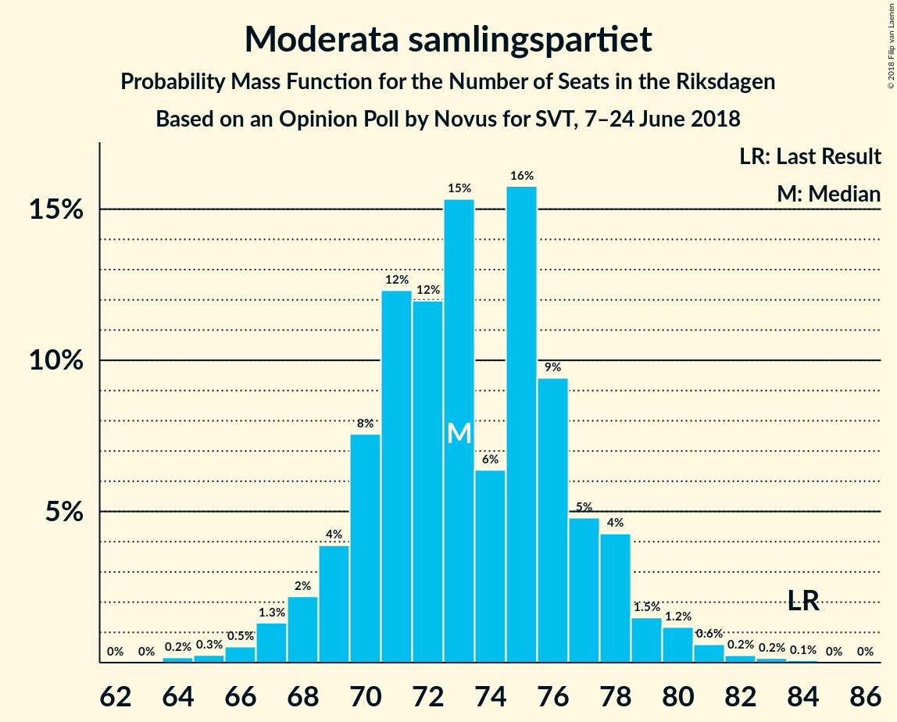
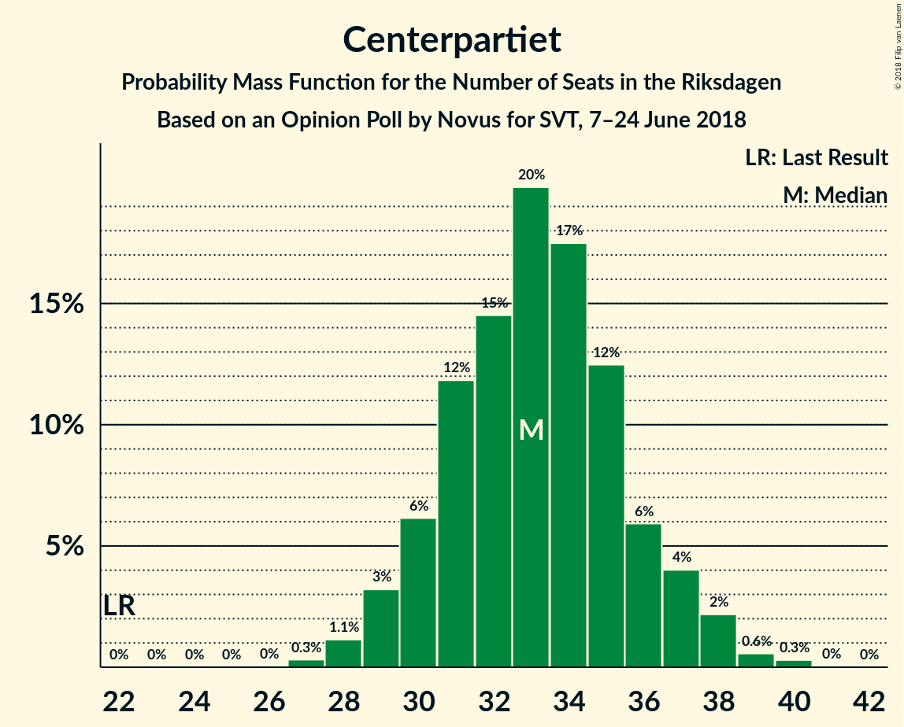
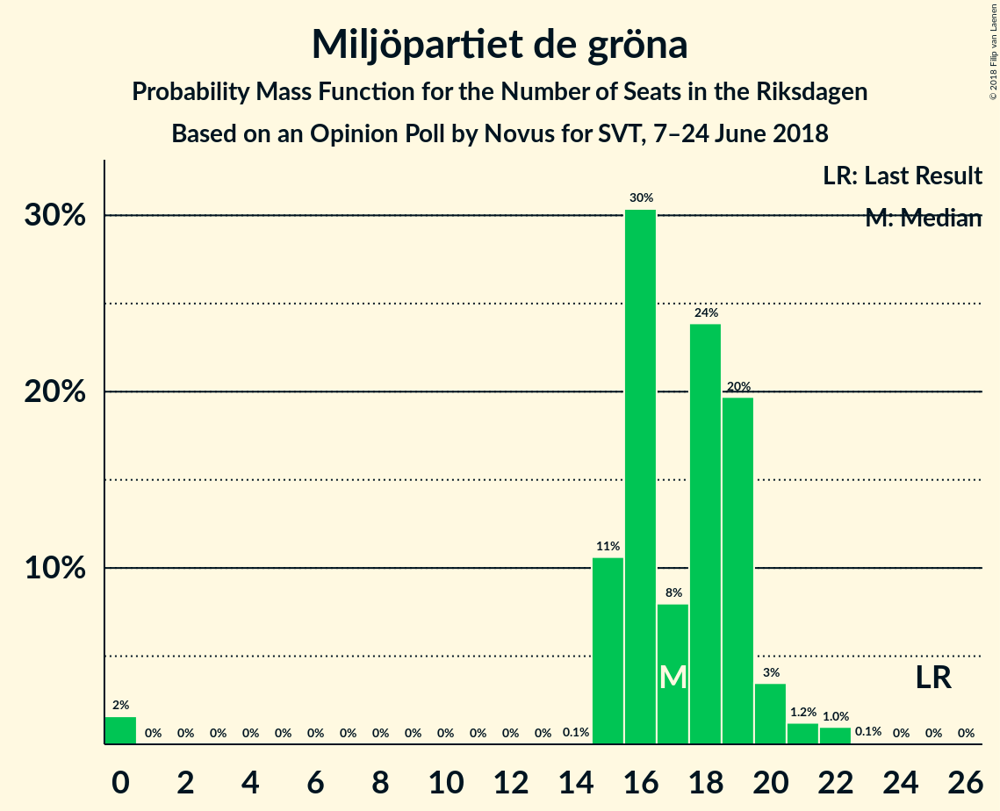

# Opinion Poll by Novus for SVT, 7–24 June 2018

<a href="#voting-intentions">Voting Intentions</a> | <a href="#seats">Seats</a> | <a href="#coalitions">Coalitions</a> | <a href="#technical-information">Technical Information</a>

## Voting Intentions

### Confidence Intervals

| Party | Last Result | Poll Result | 80% Confidence Interval | 90% Confidence Interval | 95% Confidence Interval | 99% Confidence Interval |
|:-----:|:-----------:|:-----------:|:-----------------------:|:-----------------------:|:-----------------------:|:-----------------------:|
| Sveriges socialdemokratiska arbetareparti | 31.0% | 24.5% | 23.4–25.6% |23.1–25.9% |22.9–26.2% |22.4–26.7% |
| Sverigedemokraterna | 12.9% | 22.4% | 21.4–23.5% |21.1–23.8% |20.8–24.0% |20.3–24.6% |
| Moderata samlingspartiet | 23.3% | 19.8% | 18.8–20.8% |18.5–21.1% |18.3–21.4% |17.9–21.9% |
| Vänsterpartiet | 5.7% | 9.0% | 8.3–9.8% |8.1–10.0% |8.0–10.2% |7.7–10.5% |
| Centerpartiet | 6.1% | 8.9% | 8.2–9.6% |8.0–9.9% |7.8–10.0% |7.5–10.4% |
| Liberalerna | 5.4% | 4.8% | 4.3–5.4% |4.2–5.6% |4.0–5.7% |3.8–6.0% |
| Miljöpartiet de gröna | 6.9% | 4.7% | 4.2–5.3% |4.1–5.4% |3.9–5.6% |3.7–5.9% |
| Kristdemokraterna | 4.6% | 3.4% | 3.0–3.9% |2.9–4.0% |2.8–4.2% |2.6–4.4% |

*Note:* The poll result column reflects the actual value used in the calculations. Published results may vary slightly, and in addition be rounded to fewer digits.

## Seats

### Confidence Intervals

| Party | Last Result | Median | 80% Confidence Interval | 90% Confidence Interval | 95% Confidence Interval | 99% Confidence Interval |
|:-----:|:-----------:|:------:|:-----------------------:|:-----------------------:|:-----------------------:|:-----------------------:|
| <a href="#sveriges-socialdemokratiska-arbetareparti">Sveriges socialdemokratiska arbetareparti</a> | 113 | 99 | 86–99 |86–99 |82–100 |80–102 |
| <a href="#sverigedemokraterna">Sverigedemokraterna</a> | 49 | 86 | 77–86 |76–86 |74–87 |73–94 |
| <a href="#moderata-samlingspartiet">Moderata samlingspartiet</a> | 84 | 80 | 71–80 |69–80 |69–80 |60–84 |
| <a href="#vänsterpartiet">Vänsterpartiet</a> | 21 | 28 | 28–40 |28–40 |28–40 |27–40 |
| <a href="#centerpartiet">Centerpartiet</a> | 22 | 38 | 31–38 |29–38 |29–38 |27–39 |
| <a href="#liberalerna">Liberalerna</a> | 19 | 18 | 16–19 |16–20 |16–20 |0–22 |
| <a href="#miljöpartiet-de-gröna">Miljöpartiet de gröna</a> | 25 | 0 | 0–18 |0–20 |0–23 |0–23 |
| <a href="#kristdemokraterna">Kristdemokraterna</a> | 16 | 0 | 0 |0–19 |0–19 |0–19 |

### Sveriges socialdemokratiska arbetareparti

*For a full overview of the results for this party, see the [Sveriges socialdemokratiska arbetareparti](party-sverigessocialdemokratiskaarbetareparti.html) page.*

| Number of Seats | Probability | Accumulated | Special Marks |
|:---------------:|:-----------:|:-----------:|:-------------:|
| 79 | 0.1% | 100% |  |
| 80 | 0.7% | 99.9% |  |
| 81 | 0.9% | 99.2% |  |
| 82 | 1.1% | 98% |  |
| 83 | 0.7% | 97% |  |
| 84 | 0.1% | 96% |  |
| 85 | 0.9% | 96% |  |
| 86 | 39% | 95% |  |
| 87 | 0.1% | 56% |  |
| 88 | 0% | 56% |  |
| 89 | 0.3% | 56% |  |
| 90 | 0.2% | 56% |  |
| 91 | 0% | 56% |  |
| 92 | 1.3% | 56% |  |
| 93 | 0.2% | 54% |  |
| 94 | 0% | 54% |  |
| 95 | 0.7% | 54% |  |
| 96 | 0% | 54% |  |
| 97 | 0% | 54% |  |
| 98 | 0% | 53% |  |
| 99 | 49% | 53% | Median |
| 100 | 3% | 4% |  |
| 101 | 0.4% | 2% |  |
| 102 | 0.7% | 1.1% |  |
| 103 | 0% | 0.4% |  |
| 104 | 0.4% | 0.4% |  |
| 105 | 0% | 0% |  |
| 106 | 0% | 0% |  |
| 107 | 0% | 0% |  |
| 108 | 0% | 0% |  |
| 109 | 0% | 0% |  |
| 110 | 0% | 0% |  |
| 111 | 0% | 0% |  |
| 112 | 0% | 0% |  |
| 113 | 0% | 0% | Last Result |

### Sverigedemokraterna

*For a full overview of the results for this party, see the [Sverigedemokraterna](party-sverigedemokraterna.html) page.*

| Number of Seats | Probability | Accumulated | Special Marks |
|:---------------:|:-----------:|:-----------:|:-------------:|
| 49 | 0% | 100% | Last Result |
| 50 | 0% | 100% |  |
| 51 | 0% | 100% |  |
| 52 | 0% | 100% |  |
| 53 | 0% | 100% |  |
| 54 | 0% | 100% |  |
| 55 | 0% | 100% |  |
| 56 | 0% | 100% |  |
| 57 | 0% | 100% |  |
| 58 | 0% | 100% |  |
| 59 | 0% | 100% |  |
| 60 | 0% | 100% |  |
| 61 | 0% | 100% |  |
| 62 | 0% | 100% |  |
| 63 | 0% | 100% |  |
| 64 | 0% | 100% |  |
| 65 | 0% | 100% |  |
| 66 | 0% | 100% |  |
| 67 | 0% | 100% |  |
| 68 | 0% | 100% |  |
| 69 | 0.1% | 100% |  |
| 70 | 0.1% | 99.9% |  |
| 71 | 0% | 99.9% |  |
| 72 | 0.1% | 99.9% |  |
| 73 | 1.1% | 99.8% |  |
| 74 | 3% | 98.7% |  |
| 75 | 0.1% | 96% |  |
| 76 | 1.3% | 95% |  |
| 77 | 36% | 94% |  |
| 78 | 3% | 58% |  |
| 79 | 0% | 55% |  |
| 80 | 0.9% | 55% |  |
| 81 | 0.1% | 54% |  |
| 82 | 0.4% | 54% |  |
| 83 | 0.6% | 54% |  |
| 84 | 0.4% | 53% |  |
| 85 | 0% | 53% |  |
| 86 | 49% | 53% | Median |
| 87 | 1.1% | 3% |  |
| 88 | 0.5% | 2% |  |
| 89 | 0.1% | 2% |  |
| 90 | 0% | 2% |  |
| 91 | 0% | 2% |  |
| 92 | 0.8% | 2% |  |
| 93 | 0.1% | 0.9% |  |
| 94 | 0.7% | 0.8% |  |
| 95 | 0.1% | 0.1% |  |
| 96 | 0% | 0% |  |

### Moderata samlingspartiet

*For a full overview of the results for this party, see the [Moderata samlingspartiet](party-moderatasamlingspartiet.html) page.*

| Number of Seats | Probability | Accumulated | Special Marks |
|:---------------:|:-----------:|:-----------:|:-------------:|
| 60 | 0.9% | 100% |  |
| 61 | 0.1% | 99.1% |  |
| 62 | 0% | 99.0% |  |
| 63 | 0% | 99.0% |  |
| 64 | 0% | 99.0% |  |
| 65 | 0.1% | 99.0% |  |
| 66 | 0.1% | 98.9% |  |
| 67 | 0% | 98.8% |  |
| 68 | 1.3% | 98.8% |  |
| 69 | 4% | 98% |  |
| 70 | 3% | 93% |  |
| 71 | 3% | 90% |  |
| 72 | 1.3% | 87% |  |
| 73 | 0.6% | 86% |  |
| 74 | 0.5% | 85% |  |
| 75 | 0% | 85% |  |
| 76 | 33% | 85% |  |
| 77 | 0.6% | 52% |  |
| 78 | 0.4% | 51% |  |
| 79 | 0.5% | 51% |  |
| 80 | 49% | 50% | Median |
| 81 | 0.1% | 0.8% |  |
| 82 | 0% | 0.7% |  |
| 83 | 0% | 0.7% |  |
| 84 | 0.6% | 0.7% | Last Result |
| 85 | 0% | 0% |  |

### Vänsterpartiet

*For a full overview of the results for this party, see the [Vänsterpartiet](party-vänsterpartiet.html) page.*

| Number of Seats | Probability | Accumulated | Special Marks |
|:---------------:|:-----------:|:-----------:|:-------------:|
| 21 | 0% | 100% | Last Result |
| 22 | 0% | 100% |  |
| 23 | 0% | 100% |  |
| 24 | 0% | 100% |  |
| 25 | 0% | 100% |  |
| 26 | 0.1% | 100% |  |
| 27 | 0.7% | 99.8% |  |
| 28 | 49% | 99.2% | Median |
| 29 | 0.9% | 50% |  |
| 30 | 0% | 49% |  |
| 31 | 6% | 49% |  |
| 32 | 0.9% | 43% |  |
| 33 | 2% | 42% |  |
| 34 | 2% | 39% |  |
| 35 | 0.8% | 37% |  |
| 36 | 1.2% | 36% |  |
| 37 | 0.1% | 35% |  |
| 38 | 0.7% | 35% |  |
| 39 | 0.1% | 34% |  |
| 40 | 34% | 34% |  |
| 41 | 0.2% | 0.4% |  |
| 42 | 0.1% | 0.2% |  |
| 43 | 0% | 0% |  |

### Centerpartiet

*For a full overview of the results for this party, see the [Centerpartiet](party-centerpartiet.html) page.*

| Number of Seats | Probability | Accumulated | Special Marks |
|:---------------:|:-----------:|:-----------:|:-------------:|
| 22 | 0% | 100% | Last Result |
| 23 | 0% | 100% |  |
| 24 | 0% | 100% |  |
| 25 | 0.2% | 100% |  |
| 26 | 0.2% | 99.8% |  |
| 27 | 0.2% | 99.5% |  |
| 28 | 2% | 99.3% |  |
| 29 | 5% | 98% |  |
| 30 | 1.0% | 93% |  |
| 31 | 2% | 92% |  |
| 32 | 3% | 90% |  |
| 33 | 0.9% | 87% |  |
| 34 | 0% | 86% |  |
| 35 | 0.1% | 86% |  |
| 36 | 1.0% | 86% |  |
| 37 | 0.9% | 85% |  |
| 38 | 83% | 84% | Median |
| 39 | 0.8% | 1.0% |  |
| 40 | 0% | 0.1% |  |
| 41 | 0.1% | 0.1% |  |
| 42 | 0% | 0% |  |

### Liberalerna

*For a full overview of the results for this party, see the [Liberalerna](party-liberalerna.html) page.*

| Number of Seats | Probability | Accumulated | Special Marks |
|:---------------:|:-----------:|:-----------:|:-------------:|
| 0 | 0.6% | 100% |  |
| 1 | 0% | 99.4% |  |
| 2 | 0% | 99.4% |  |
| 3 | 0% | 99.4% |  |
| 4 | 0% | 99.4% |  |
| 5 | 0% | 99.4% |  |
| 6 | 0% | 99.4% |  |
| 7 | 0% | 99.4% |  |
| 8 | 0% | 99.4% |  |
| 9 | 0% | 99.4% |  |
| 10 | 0% | 99.4% |  |
| 11 | 0% | 99.4% |  |
| 12 | 0% | 99.4% |  |
| 13 | 0% | 99.4% |  |
| 14 | 0% | 99.4% |  |
| 15 | 0% | 99.4% |  |
| 16 | 35% | 99.4% |  |
| 17 | 4% | 65% |  |
| 18 | 50% | 61% | Median |
| 19 | 5% | 11% | Last Result |
| 20 | 5% | 6% |  |
| 21 | 0% | 1.2% |  |
| 22 | 1.0% | 1.1% |  |
| 23 | 0% | 0.1% |  |
| 24 | 0% | 0.1% |  |
| 25 | 0% | 0% |  |

### Miljöpartiet de gröna

*For a full overview of the results for this party, see the [Miljöpartiet de gröna](party-miljöpartietdegröna.html) page.*

| Number of Seats | Probability | Accumulated | Special Marks |
|:---------------:|:-----------:|:-----------:|:-------------:|
| 0 | 50% | 100% | Median |
| 1 | 0% | 50% |  |
| 2 | 0% | 50% |  |
| 3 | 0% | 50% |  |
| 4 | 0% | 50% |  |
| 5 | 0% | 50% |  |
| 6 | 0% | 50% |  |
| 7 | 0% | 50% |  |
| 8 | 0% | 50% |  |
| 9 | 0% | 50% |  |
| 10 | 0% | 50% |  |
| 11 | 0% | 50% |  |
| 12 | 0% | 50% |  |
| 13 | 0% | 50% |  |
| 14 | 0% | 50% |  |
| 15 | 2% | 50% |  |
| 16 | 35% | 47% |  |
| 17 | 0.7% | 12% |  |
| 18 | 4% | 11% |  |
| 19 | 1.0% | 7% |  |
| 20 | 1.0% | 6% |  |
| 21 | 0.3% | 5% |  |
| 22 | 1.2% | 4% |  |
| 23 | 3% | 3% |  |
| 24 | 0.4% | 0.5% |  |
| 25 | 0% | 0% | Last Result |

### Kristdemokraterna

*For a full overview of the results for this party, see the [Kristdemokraterna](party-kristdemokraterna.html) page.*

| Number of Seats | Probability | Accumulated | Special Marks |
|:---------------:|:-----------:|:-----------:|:-------------:|
| 0 | 91% | 100% | Median |
| 1 | 0% | 9% |  |
| 2 | 0% | 9% |  |
| 3 | 0% | 9% |  |
| 4 | 0% | 9% |  |
| 5 | 0% | 9% |  |
| 6 | 0% | 9% |  |
| 7 | 0% | 9% |  |
| 8 | 0% | 9% |  |
| 9 | 0% | 9% |  |
| 10 | 0% | 9% |  |
| 11 | 0% | 9% |  |
| 12 | 0% | 9% |  |
| 13 | 0% | 9% |  |
| 14 | 0.3% | 9% |  |
| 15 | 1.1% | 9% |  |
| 16 | 0.4% | 7% | Last Result |
| 17 | 0% | 7% |  |
| 18 | 2% | 7% |  |
| 19 | 5% | 5% |  |
| 20 | 0% | 0% |  |

## Coalitions

### Confidence Intervals

| Coalition | Last Result | Median | Majority? | 80% Confidence Interval | 90% Confidence Interval | 95% Confidence Interval | 99% Confidence Interval |
|:---------:|:-----------:|:------:|:---------:|:-----------------------:|:-----------------------:|:-----------------------:|:-----------------------:|
| Sveriges socialdemokratiska arbetareparti – Moderata samlingspartiet | 197 | 179 | 51% | 156–179 | 155–179 | 152–179 | 150–179 |
| Sveriges socialdemokratiska arbetareparti – Vänsterpartiet – Miljöpartiet de gröna | 159 | 127 | 0% | 127–142 | 127–145 | 127–154 | 122–157 |
| Moderata samlingspartiet – Centerpartiet – Liberalerna – Kristdemokraterna | 141 | 136 | 0% | 130–136 | 121–140 | 117–140 | 113–143 |
| Moderata samlingspartiet – Centerpartiet – Liberalerna | 125 | 136 | 0% | 121–136 | 117–136 | 117–136 | 109–140 |
| Sveriges socialdemokratiska arbetareparti – Vänsterpartiet | 134 | 127 | 0% | 120–127 | 117–127 | 117–131 | 111–135 |
| Sveriges socialdemokratiska arbetareparti – Miljöpartiet de gröna | 138 | 99 | 0% | 99–103 | 99–109 | 99–123 | 95–124 |
| Moderata samlingspartiet – Centerpartiet – Kristdemokraterna | 122 | 118 | 0% | 114–118 | 105–120 | 100–120 | 97–123 |
| Moderata samlingspartiet – Centerpartiet | 106 | 118 | 0% | 101–118 | 100–118 | 99–118 | 90–123 |

### Sveriges socialdemokratiska arbetareparti – Moderata samlingspartiet

| Number of Seats | Probability | Accumulated | Special Marks |
|:---------------:|:-----------:|:-----------:|:-------------:|
| 149 | 0.3% | 100% |  |
| 150 | 0.9% | 99.7% |  |
| 151 | 0.7% | 98.8% |  |
| 152 | 0.9% | 98% |  |
| 153 | 0.4% | 97% |  |
| 154 | 1.1% | 97% |  |
| 155 | 4% | 96% |  |
| 156 | 2% | 92% |  |
| 157 | 0% | 89% |  |
| 158 | 0% | 89% |  |
| 159 | 0.3% | 89% |  |
| 160 | 0% | 89% |  |
| 161 | 0.2% | 89% |  |
| 162 | 33% | 89% |  |
| 163 | 0.2% | 55% |  |
| 164 | 0.4% | 55% |  |
| 165 | 0% | 55% |  |
| 166 | 0% | 55% |  |
| 167 | 0% | 55% |  |
| 168 | 0.1% | 55% |  |
| 169 | 0.2% | 55% |  |
| 170 | 0.1% | 54% |  |
| 171 | 3% | 54% |  |
| 172 | 0.4% | 51% |  |
| 173 | 0% | 51% |  |
| 174 | 0% | 51% |  |
| 175 | 0% | 51% | Majority |
| 176 | 0% | 51% |  |
| 177 | 0% | 51% |  |
| 178 | 0.4% | 51% |  |
| 179 | 50% | 50% | Median |
| 180 | 0.3% | 0.3% |  |
| 181 | 0% | 0% |  |
| 182 | 0% | 0% |  |
| 183 | 0% | 0% |  |
| 184 | 0% | 0% |  |
| 185 | 0% | 0% |  |
| 186 | 0% | 0% |  |
| 187 | 0% | 0% |  |
| 188 | 0% | 0% |  |
| 189 | 0% | 0% |  |
| 190 | 0% | 0% |  |
| 191 | 0% | 0% |  |
| 192 | 0% | 0% |  |
| 193 | 0% | 0% |  |
| 194 | 0% | 0% |  |
| 195 | 0% | 0% |  |
| 196 | 0% | 0% |  |
| 197 | 0% | 0% | Last Result |

### Sveriges socialdemokratiska arbetareparti – Vänsterpartiet – Miljöpartiet de gröna

| Number of Seats | Probability | Accumulated | Special Marks |
|:---------------:|:-----------:|:-----------:|:-------------:|
| 122 | 0.7% | 100% |  |
| 123 | 0% | 99.3% |  |
| 124 | 0% | 99.3% |  |
| 125 | 0% | 99.3% |  |
| 126 | 0% | 99.3% |  |
| 127 | 49% | 99.3% | Median |
| 128 | 0% | 50% |  |
| 129 | 0.2% | 50% |  |
| 130 | 0.9% | 50% |  |
| 131 | 0.1% | 49% |  |
| 132 | 0% | 49% |  |
| 133 | 1.0% | 49% |  |
| 134 | 0.8% | 48% |  |
| 135 | 6% | 47% |  |
| 136 | 0% | 41% |  |
| 137 | 0.3% | 41% |  |
| 138 | 0.3% | 40% |  |
| 139 | 0% | 40% |  |
| 140 | 0% | 40% |  |
| 141 | 0.5% | 40% |  |
| 142 | 34% | 39% |  |
| 143 | 0% | 5% |  |
| 144 | 0.4% | 5% |  |
| 145 | 0.9% | 5% |  |
| 146 | 0.2% | 4% |  |
| 147 | 0% | 4% |  |
| 148 | 0% | 4% |  |
| 149 | 0% | 4% |  |
| 150 | 0% | 4% |  |
| 151 | 0% | 4% |  |
| 152 | 0% | 4% |  |
| 153 | 0% | 4% |  |
| 154 | 3% | 4% |  |
| 155 | 0% | 1.2% |  |
| 156 | 0.4% | 1.2% |  |
| 157 | 0.4% | 0.8% |  |
| 158 | 0% | 0.4% |  |
| 159 | 0.4% | 0.4% | Last Result |
| 160 | 0% | 0% |  |

### Moderata samlingspartiet – Centerpartiet – Liberalerna – Kristdemokraterna

| Number of Seats | Probability | Accumulated | Special Marks |
|:---------------:|:-----------:|:-----------:|:-------------:|
| 105 | 0.4% | 100% |  |
| 106 | 0% | 99.6% |  |
| 107 | 0% | 99.6% |  |
| 108 | 0% | 99.6% |  |
| 109 | 0% | 99.6% |  |
| 110 | 0% | 99.6% |  |
| 111 | 0% | 99.5% |  |
| 112 | 0% | 99.5% |  |
| 113 | 0.4% | 99.5% |  |
| 114 | 0% | 99.2% |  |
| 115 | 0% | 99.2% |  |
| 116 | 0.4% | 99.2% |  |
| 117 | 3% | 98.8% |  |
| 118 | 0% | 96% |  |
| 119 | 0% | 96% |  |
| 120 | 0% | 96% |  |
| 121 | 1.4% | 96% |  |
| 122 | 0.1% | 95% |  |
| 123 | 0.1% | 95% |  |
| 124 | 2% | 94% |  |
| 125 | 0.3% | 92% |  |
| 126 | 0.2% | 92% |  |
| 127 | 0% | 92% |  |
| 128 | 0% | 92% |  |
| 129 | 0.1% | 92% |  |
| 130 | 33% | 92% |  |
| 131 | 0.1% | 58% |  |
| 132 | 0% | 58% |  |
| 133 | 0% | 58% |  |
| 134 | 0.5% | 58% |  |
| 135 | 0% | 58% |  |
| 136 | 49% | 58% | Median |
| 137 | 2% | 8% |  |
| 138 | 0.2% | 6% |  |
| 139 | 0% | 6% |  |
| 140 | 4% | 6% |  |
| 141 | 0.9% | 2% | Last Result |
| 142 | 0.1% | 0.9% |  |
| 143 | 0.9% | 0.9% |  |
| 144 | 0% | 0% |  |

### Moderata samlingspartiet – Centerpartiet – Liberalerna

| Number of Seats | Probability | Accumulated | Special Marks |
|:---------------:|:-----------:|:-----------:|:-------------:|
| 105 | 0.4% | 100% |  |
| 106 | 0% | 99.6% |  |
| 107 | 0% | 99.6% |  |
| 108 | 0% | 99.6% |  |
| 109 | 1.0% | 99.6% |  |
| 110 | 0% | 98.6% |  |
| 111 | 0% | 98.6% |  |
| 112 | 0.2% | 98.6% |  |
| 113 | 0.4% | 98% |  |
| 114 | 0% | 98% |  |
| 115 | 0% | 98% |  |
| 116 | 0.4% | 98% |  |
| 117 | 3% | 98% |  |
| 118 | 2% | 95% |  |
| 119 | 0% | 92% |  |
| 120 | 0% | 92% |  |
| 121 | 4% | 92% |  |
| 122 | 0.3% | 88% |  |
| 123 | 0.9% | 88% |  |
| 124 | 1.2% | 87% |  |
| 125 | 1.2% | 85% | Last Result |
| 126 | 0% | 84% |  |
| 127 | 0.1% | 84% |  |
| 128 | 0% | 84% |  |
| 129 | 0.1% | 84% |  |
| 130 | 33% | 84% |  |
| 131 | 0% | 50% |  |
| 132 | 0% | 50% |  |
| 133 | 0% | 50% |  |
| 134 | 0.5% | 50% |  |
| 135 | 0% | 50% |  |
| 136 | 49% | 50% | Median |
| 137 | 0% | 0.7% |  |
| 138 | 0% | 0.7% |  |
| 139 | 0% | 0.7% |  |
| 140 | 0.7% | 0.7% |  |
| 141 | 0% | 0% |  |

### Sveriges socialdemokratiska arbetareparti – Vänsterpartiet

| Number of Seats | Probability | Accumulated | Special Marks |
|:---------------:|:-----------:|:-----------:|:-------------:|
| 111 | 0.8% | 100% |  |
| 112 | 0.2% | 99.1% |  |
| 113 | 0% | 98.9% |  |
| 114 | 0% | 98.9% |  |
| 115 | 0% | 98.9% |  |
| 116 | 0% | 98.9% |  |
| 117 | 5% | 98.9% |  |
| 118 | 1.2% | 94% |  |
| 119 | 0.1% | 93% |  |
| 120 | 3% | 93% |  |
| 121 | 0.2% | 90% |  |
| 122 | 0.8% | 90% |  |
| 123 | 0% | 89% |  |
| 124 | 0.1% | 89% |  |
| 125 | 0.9% | 89% |  |
| 126 | 34% | 88% |  |
| 127 | 49% | 54% | Median |
| 128 | 0.4% | 5% |  |
| 129 | 0% | 5% |  |
| 130 | 0% | 5% |  |
| 131 | 3% | 4% |  |
| 132 | 0% | 2% |  |
| 133 | 0.3% | 2% |  |
| 134 | 0.5% | 1.3% | Last Result |
| 135 | 0.4% | 0.8% |  |
| 136 | 0% | 0.4% |  |
| 137 | 0.4% | 0.4% |  |
| 138 | 0% | 0% |  |

### Sveriges socialdemokratiska arbetareparti – Miljöpartiet de gröna

| Number of Seats | Probability | Accumulated | Special Marks |
|:---------------:|:-----------:|:-----------:|:-------------:|
| 85 | 0% | 100% |  |
| 86 | 0% | 99.9% |  |
| 87 | 0% | 99.9% |  |
| 88 | 0% | 99.9% |  |
| 89 | 0% | 99.9% |  |
| 90 | 0% | 99.9% |  |
| 91 | 0% | 99.9% |  |
| 92 | 0% | 99.9% |  |
| 93 | 0.1% | 99.9% |  |
| 94 | 0% | 99.8% |  |
| 95 | 0.6% | 99.8% |  |
| 96 | 0.1% | 99.1% |  |
| 97 | 0.8% | 99.0% |  |
| 98 | 0% | 98% |  |
| 99 | 50% | 98% | Median |
| 100 | 0.2% | 48% |  |
| 101 | 3% | 48% |  |
| 102 | 34% | 44% |  |
| 103 | 1.0% | 11% |  |
| 104 | 4% | 10% |  |
| 105 | 0.1% | 6% |  |
| 106 | 0.1% | 6% |  |
| 107 | 0.2% | 6% |  |
| 108 | 0.4% | 5% |  |
| 109 | 0.1% | 5% |  |
| 110 | 0.1% | 5% |  |
| 111 | 0% | 5% |  |
| 112 | 0.9% | 5% |  |
| 113 | 0% | 4% |  |
| 114 | 0% | 4% |  |
| 115 | 0% | 4% |  |
| 116 | 0% | 4% |  |
| 117 | 0% | 4% |  |
| 118 | 0% | 4% |  |
| 119 | 0% | 4% |  |
| 120 | 0% | 4% |  |
| 121 | 0% | 4% |  |
| 122 | 0% | 4% |  |
| 123 | 3% | 4% |  |
| 124 | 0.4% | 0.8% |  |
| 125 | 0% | 0.4% |  |
| 126 | 0.4% | 0.4% |  |
| 127 | 0% | 0% |  |
| 128 | 0% | 0% |  |
| 129 | 0% | 0% |  |
| 130 | 0% | 0% |  |
| 131 | 0% | 0% |  |
| 132 | 0% | 0% |  |
| 133 | 0% | 0% |  |
| 134 | 0% | 0% |  |
| 135 | 0% | 0% |  |
| 136 | 0% | 0% |  |
| 137 | 0% | 0% |  |
| 138 | 0% | 0% | Last Result |

### Moderata samlingspartiet – Centerpartiet – Kristdemokraterna

| Number of Seats | Probability | Accumulated | Special Marks |
|:---------------:|:-----------:|:-----------:|:-------------:|
| 96 | 0.4% | 100% |  |
| 97 | 0.4% | 99.6% |  |
| 98 | 0% | 99.2% |  |
| 99 | 0% | 99.2% |  |
| 100 | 3% | 99.2% |  |
| 101 | 0.1% | 96% |  |
| 102 | 0.3% | 96% |  |
| 103 | 0.5% | 96% |  |
| 104 | 0.4% | 96% |  |
| 105 | 3% | 95% |  |
| 106 | 0% | 92% |  |
| 107 | 0% | 92% |  |
| 108 | 0.2% | 92% |  |
| 109 | 0.2% | 92% |  |
| 110 | 0% | 92% |  |
| 111 | 0.1% | 92% |  |
| 112 | 0.2% | 92% |  |
| 113 | 0% | 92% |  |
| 114 | 34% | 92% |  |
| 115 | 0% | 58% |  |
| 116 | 0% | 58% |  |
| 117 | 0% | 58% |  |
| 118 | 52% | 58% | Median |
| 119 | 0.9% | 6% |  |
| 120 | 3% | 5% |  |
| 121 | 0.1% | 2% |  |
| 122 | 0.4% | 2% | Last Result |
| 123 | 2% | 2% |  |
| 124 | 0% | 0% |  |

### Moderata samlingspartiet – Centerpartiet

| Number of Seats | Probability | Accumulated | Special Marks |
|:---------------:|:-----------:|:-----------:|:-------------:|
| 90 | 0.9% | 100% |  |
| 91 | 0% | 99.1% |  |
| 92 | 0% | 99.1% |  |
| 93 | 0.1% | 99.1% |  |
| 94 | 0.2% | 99.0% |  |
| 95 | 0% | 98.9% |  |
| 96 | 0.4% | 98.9% |  |
| 97 | 0.4% | 98% |  |
| 98 | 0.1% | 98% |  |
| 99 | 2% | 98% |  |
| 100 | 3% | 96% |  |
| 101 | 4% | 93% |  |
| 102 | 0.4% | 89% |  |
| 103 | 0.5% | 88% |  |
| 104 | 0.4% | 88% |  |
| 105 | 3% | 88% |  |
| 106 | 0.3% | 85% | Last Result |
| 107 | 0.1% | 85% |  |
| 108 | 0.1% | 84% |  |
| 109 | 0.2% | 84% |  |
| 110 | 0% | 84% |  |
| 111 | 0.1% | 84% |  |
| 112 | 0% | 84% |  |
| 113 | 0% | 84% |  |
| 114 | 34% | 84% |  |
| 115 | 0% | 50% |  |
| 116 | 0% | 50% |  |
| 117 | 0% | 50% |  |
| 118 | 49% | 50% | Median |
| 119 | 0% | 0.8% |  |
| 120 | 0% | 0.7% |  |
| 121 | 0% | 0.7% |  |
| 122 | 0.1% | 0.7% |  |
| 123 | 0.6% | 0.6% |  |
| 124 | 0% | 0% |  |

## Technical Information

### Opinion Poll

+ **Polling firm:** Novus
+ **Commissioner(s):** SVT
+ **Fieldwork period:** 7–24 June 2018

### Calculations

+ **Sample size:** 2621
+ **Simulations done:** 1,024
+ **Error estimate:** 2.39%

