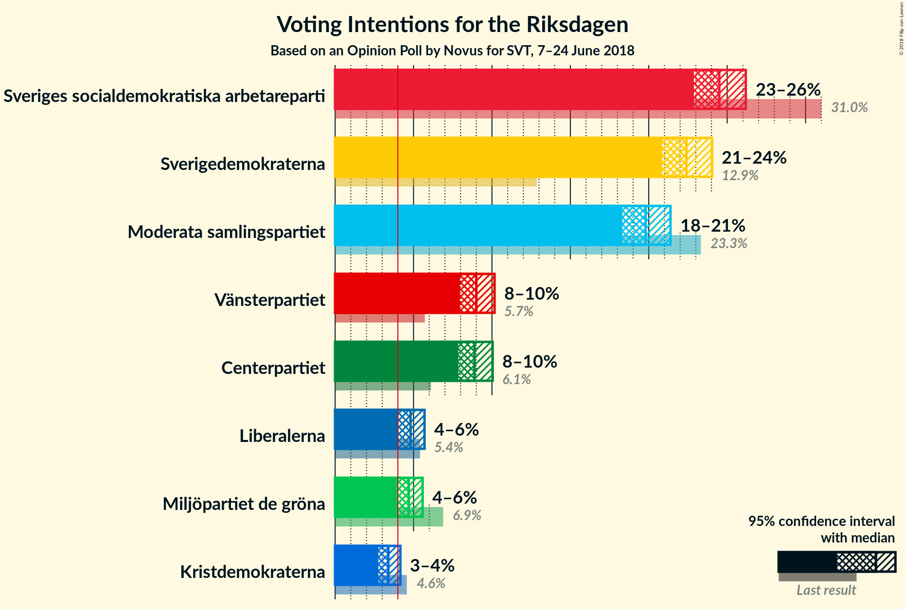

# Opinion Poll by Novus for SVT, 7–24 June 2018

<a href="#voting-intentions">Voting Intentions</a> | <a href="#seats">Seats</a> | <a href="#coalitions">Coalitions</a> | <a href="#technical-information">Technical Information</a>

## Voting Intentions

### Confidence Intervals

| Party | Last Result | Poll Result | 80% Confidence Interval | 90% Confidence Interval | 95% Confidence Interval | 99% Confidence Interval |
|:-----:|:-----------:|:-----------:|:-----------------------:|:-----------------------:|:-----------------------:|:-----------------------:|
| Sveriges socialdemokratiska arbetareparti | 31.0% | 24.5% | 23.4–25.6% |23.1–25.9% |22.9–26.2% |22.4–26.7% |
| Sverigedemokraterna | 12.9% | 22.4% | 21.4–23.5% |21.1–23.8% |20.8–24.0% |20.3–24.6% |
| Moderata samlingspartiet | 23.3% | 19.8% | 18.8–20.8% |18.5–21.1% |18.3–21.4% |17.9–21.9% |
| Vänsterpartiet | 5.7% | 9.0% | 8.3–9.8% |8.1–10.0% |8.0–10.2% |7.7–10.5% |
| Centerpartiet | 6.1% | 8.9% | 8.2–9.6% |8.0–9.9% |7.8–10.0% |7.5–10.4% |
| Liberalerna | 5.4% | 4.8% | 4.3–5.4% |4.2–5.6% |4.0–5.7% |3.8–6.0% |
| Miljöpartiet de gröna | 6.9% | 4.7% | 4.2–5.3% |4.1–5.4% |3.9–5.6% |3.7–5.9% |
| Kristdemokraterna | 4.6% | 3.4% | 3.0–3.9% |2.9–4.0% |2.8–4.2% |2.6–4.4% |

*Note:* The poll result column reflects the actual value used in the calculations. Published results may vary slightly, and in addition be rounded to fewer digits.

## Seats

### Confidence Intervals

| Party | Last Result | Median | 80% Confidence Interval | 90% Confidence Interval | 95% Confidence Interval | 99% Confidence Interval |
|:-----:|:-----------:|:------:|:-----------------------:|:-----------------------:|:-----------------------:|:-----------------------:|
| <a href="#sveriges-socialdemokratiska-arbetareparti">Sveriges socialdemokratiska arbetareparti</a> | 113 | 89 | 86–96 |85–97 |84–98 |82–100 |
| <a href="#sverigedemokraterna">Sverigedemokraterna</a> | 49 | 83 | 79–87 |78–88 |77–89 |74–92 |
| <a href="#moderata-samlingspartiet">Moderata samlingspartiet</a> | 84 | 73 | 70–77 |69–78 |68–79 |66–82 |
| <a href="#vänsterpartiet">Vänsterpartiet</a> | 21 | 34 | 31–36 |30–37 |30–38 |28–39 |
| <a href="#centerpartiet">Centerpartiet</a> | 22 | 33 | 30–36 |30–37 |29–38 |28–39 |
| <a href="#liberalerna">Liberalerna</a> | 19 | 18 | 16–20 |16–21 |15–21 |0–22 |
| <a href="#miljöpartiet-de-gröna">Miljöpartiet de gröna</a> | 25 | 17 | 15–19 |15–20 |15–20 |0–22 |
| <a href="#kristdemokraterna">Kristdemokraterna</a> | 16 | 0 | 0 |0–15 |0–15 |0–16 |

### Sveriges socialdemokratiska arbetareparti

*For a full overview of the results for this party, see the [Sveriges socialdemokratiska arbetareparti](party-sverigessocialdemokratiskaarbetareparti.html) page.*

| Number of Seats | Probability | Accumulated | Special Marks |
|:---------------:|:-----------:|:-----------:|:-------------:|
| 81 | 0.1% | 100% |  |
| 82 | 0.4% | 99.8% |  |
| 83 | 1.1% | 99.4% |  |
| 84 | 2% | 98% |  |
| 85 | 3% | 96% |  |
| 86 | 9% | 93% |  |
| 87 | 9% | 84% |  |
| 88 | 14% | 75% |  |
| 89 | 15% | 61% | Median |
| 90 | 9% | 46% |  |
| 91 | 6% | 37% |  |
| 92 | 5% | 32% |  |
| 93 | 6% | 27% |  |
| 94 | 6% | 21% |  |
| 95 | 4% | 15% |  |
| 96 | 5% | 11% |  |
| 97 | 3% | 6% |  |
| 98 | 2% | 3% |  |
| 99 | 0.7% | 1.4% |  |
| 100 | 0.4% | 0.7% |  |
| 101 | 0.2% | 0.3% |  |
| 102 | 0.1% | 0.1% |  |
| 103 | 0% | 0.1% |  |
| 104 | 0% | 0% |  |
| 105 | 0% | 0% |  |
| 106 | 0% | 0% |  |
| 107 | 0% | 0% |  |
| 108 | 0% | 0% |  |
| 109 | 0% | 0% |  |
| 110 | 0% | 0% |  |
| 111 | 0% | 0% |  |
| 112 | 0% | 0% |  |
| 113 | 0% | 0% | Last Result |

### Sverigedemokraterna

*For a full overview of the results for this party, see the [Sverigedemokraterna](party-sverigedemokraterna.html) page.*

| Number of Seats | Probability | Accumulated | Special Marks |
|:---------------:|:-----------:|:-----------:|:-------------:|
| 49 | 0% | 100% | Last Result |
| 50 | 0% | 100% |  |
| 51 | 0% | 100% |  |
| 52 | 0% | 100% |  |
| 53 | 0% | 100% |  |
| 54 | 0% | 100% |  |
| 55 | 0% | 100% |  |
| 56 | 0% | 100% |  |
| 57 | 0% | 100% |  |
| 58 | 0% | 100% |  |
| 59 | 0% | 100% |  |
| 60 | 0% | 100% |  |
| 61 | 0% | 100% |  |
| 62 | 0% | 100% |  |
| 63 | 0% | 100% |  |
| 64 | 0% | 100% |  |
| 65 | 0% | 100% |  |
| 66 | 0% | 100% |  |
| 67 | 0% | 100% |  |
| 68 | 0% | 100% |  |
| 69 | 0% | 100% |  |
| 70 | 0% | 100% |  |
| 71 | 0% | 100% |  |
| 72 | 0% | 100% |  |
| 73 | 0.1% | 99.9% |  |
| 74 | 0.4% | 99.8% |  |
| 75 | 0.6% | 99.5% |  |
| 76 | 0.8% | 98.9% |  |
| 77 | 2% | 98% |  |
| 78 | 2% | 96% |  |
| 79 | 4% | 94% |  |
| 80 | 8% | 89% |  |
| 81 | 8% | 81% |  |
| 82 | 15% | 73% |  |
| 83 | 10% | 58% | Median |
| 84 | 19% | 49% |  |
| 85 | 8% | 30% |  |
| 86 | 10% | 22% |  |
| 87 | 5% | 11% |  |
| 88 | 3% | 6% |  |
| 89 | 2% | 4% |  |
| 90 | 0.8% | 2% |  |
| 91 | 0.4% | 1.0% |  |
| 92 | 0.3% | 0.6% |  |
| 93 | 0.1% | 0.3% |  |
| 94 | 0.1% | 0.2% |  |
| 95 | 0.1% | 0.1% |  |
| 96 | 0% | 0% |  |

### Moderata samlingspartiet

*For a full overview of the results for this party, see the [Moderata samlingspartiet](party-moderatasamlingspartiet.html) page.*

| Number of Seats | Probability | Accumulated | Special Marks |
|:---------------:|:-----------:|:-----------:|:-------------:|
| 64 | 0.2% | 100% |  |
| 65 | 0.3% | 99.8% |  |
| 66 | 0.5% | 99.5% |  |
| 67 | 1.3% | 99.0% |  |
| 68 | 2% | 98% |  |
| 69 | 4% | 96% |  |
| 70 | 8% | 92% |  |
| 71 | 12% | 84% |  |
| 72 | 12% | 72% |  |
| 73 | 15% | 60% | Median |
| 74 | 6% | 44% |  |
| 75 | 16% | 38% |  |
| 76 | 9% | 22% |  |
| 77 | 5% | 13% |  |
| 78 | 4% | 8% |  |
| 79 | 1.5% | 4% |  |
| 80 | 1.2% | 2% |  |
| 81 | 0.6% | 1.1% |  |
| 82 | 0.2% | 0.5% |  |
| 83 | 0.2% | 0.3% |  |
| 84 | 0.1% | 0.1% | Last Result |
| 85 | 0% | 0.1% |  |
| 86 | 0% | 0% |  |

### Vänsterpartiet

*For a full overview of the results for this party, see the [Vänsterpartiet](party-vänsterpartiet.html) page.*

| Number of Seats | Probability | Accumulated | Special Marks |
|:---------------:|:-----------:|:-----------:|:-------------:|
| 21 | 0% | 100% | Last Result |
| 22 | 0% | 100% |  |
| 23 | 0% | 100% |  |
| 24 | 0% | 100% |  |
| 25 | 0% | 100% |  |
| 26 | 0% | 100% |  |
| 27 | 0.1% | 100% |  |
| 28 | 0.6% | 99.9% |  |
| 29 | 2% | 99.3% |  |
| 30 | 5% | 98% |  |
| 31 | 10% | 92% |  |
| 32 | 13% | 83% |  |
| 33 | 19% | 70% |  |
| 34 | 23% | 51% | Median |
| 35 | 13% | 28% |  |
| 36 | 8% | 15% |  |
| 37 | 3% | 6% |  |
| 38 | 2% | 3% |  |
| 39 | 0.5% | 0.9% |  |
| 40 | 0.3% | 0.3% |  |
| 41 | 0.1% | 0.1% |  |
| 42 | 0% | 0% |  |

### Centerpartiet

*For a full overview of the results for this party, see the [Centerpartiet](party-centerpartiet.html) page.*

| Number of Seats | Probability | Accumulated | Special Marks |
|:---------------:|:-----------:|:-----------:|:-------------:|
| 22 | 0% | 100% | Last Result |
| 23 | 0% | 100% |  |
| 24 | 0% | 100% |  |
| 25 | 0% | 100% |  |
| 26 | 0% | 100% |  |
| 27 | 0.3% | 100% |  |
| 28 | 1.1% | 99.6% |  |
| 29 | 3% | 98.5% |  |
| 30 | 6% | 95% |  |
| 31 | 12% | 89% |  |
| 32 | 15% | 77% |  |
| 33 | 20% | 63% | Median |
| 34 | 17% | 43% |  |
| 35 | 12% | 26% |  |
| 36 | 6% | 13% |  |
| 37 | 4% | 7% |  |
| 38 | 2% | 3% |  |
| 39 | 0.6% | 0.9% |  |
| 40 | 0.3% | 0.4% |  |
| 41 | 0% | 0.1% |  |
| 42 | 0% | 0% |  |

### Liberalerna

*For a full overview of the results for this party, see the [Liberalerna](party-liberalerna.html) page.*

| Number of Seats | Probability | Accumulated | Special Marks |
|:---------------:|:-----------:|:-----------:|:-------------:|
| 0 | 2% | 100% |  |
| 1 | 0% | 98% |  |
| 2 | 0% | 98% |  |
| 3 | 0% | 98% |  |
| 4 | 0% | 98% |  |
| 5 | 0% | 98% |  |
| 6 | 0% | 98% |  |
| 7 | 0% | 98% |  |
| 8 | 0% | 98% |  |
| 9 | 0% | 98% |  |
| 10 | 0% | 98% |  |
| 11 | 0% | 98% |  |
| 12 | 0% | 98% |  |
| 13 | 0% | 98% |  |
| 14 | 0% | 98% |  |
| 15 | 3% | 98% |  |
| 16 | 17% | 95% |  |
| 17 | 18% | 78% |  |
| 18 | 22% | 60% | Median |
| 19 | 21% | 38% | Last Result |
| 20 | 11% | 17% |  |
| 21 | 5% | 6% |  |
| 22 | 1.1% | 1.4% |  |
| 23 | 0.2% | 0.3% |  |
| 24 | 0% | 0% |  |

### Miljöpartiet de gröna

*For a full overview of the results for this party, see the [Miljöpartiet de gröna](party-miljöpartietdegröna.html) page.*

| Number of Seats | Probability | Accumulated | Special Marks |
|:---------------:|:-----------:|:-----------:|:-------------:|
| 0 | 2% | 100% |  |
| 1 | 0% | 98% |  |
| 2 | 0% | 98% |  |
| 3 | 0% | 98% |  |
| 4 | 0% | 98% |  |
| 5 | 0% | 98% |  |
| 6 | 0% | 98% |  |
| 7 | 0% | 98% |  |
| 8 | 0% | 98% |  |
| 9 | 0% | 98% |  |
| 10 | 0% | 98% |  |
| 11 | 0% | 98% |  |
| 12 | 0% | 98% |  |
| 13 | 0% | 98% |  |
| 14 | 0.1% | 98% |  |
| 15 | 11% | 98% |  |
| 16 | 30% | 88% |  |
| 17 | 8% | 57% | Median |
| 18 | 24% | 49% |  |
| 19 | 20% | 25% |  |
| 20 | 3% | 6% |  |
| 21 | 1.2% | 2% |  |
| 22 | 1.0% | 1.1% |  |
| 23 | 0.1% | 0.1% |  |
| 24 | 0% | 0% |  |
| 25 | 0% | 0% | Last Result |

### Kristdemokraterna

*For a full overview of the results for this party, see the [Kristdemokraterna](party-kristdemokraterna.html) page.*

| Number of Seats | Probability | Accumulated | Special Marks |
|:---------------:|:-----------:|:-----------:|:-------------:|
| 0 | 93% | 100% | Median |
| 1 | 0% | 7% |  |
| 2 | 0% | 7% |  |
| 3 | 0% | 7% |  |
| 4 | 0% | 7% |  |
| 5 | 0% | 7% |  |
| 6 | 0% | 7% |  |
| 7 | 0% | 7% |  |
| 8 | 0% | 7% |  |
| 9 | 0% | 7% |  |
| 10 | 0% | 7% |  |
| 11 | 0% | 7% |  |
| 12 | 0% | 7% |  |
| 13 | 0% | 7% |  |
| 14 | 2% | 7% |  |
| 15 | 4% | 5% |  |
| 16 | 0.8% | 0.9% | Last Result |
| 17 | 0.1% | 0.1% |  |
| 18 | 0% | 0% |  |

## Coalitions

### Confidence Intervals

| Coalition | Last Result | Median | Majority? | 80% Confidence Interval | 90% Confidence Interval | 95% Confidence Interval | 99% Confidence Interval |
|:---------:|:-----------:|:------:|:---------:|:-----------------------:|:-----------------------:|:-----------------------:|:-----------------------:|
| Sveriges socialdemokratiska arbetareparti – Moderata samlingspartiet | 197 | 163 | 1.1% | 158–169 | 157–171 | 155–173 | 152–177 |
| Sverigedemokraterna – Moderata samlingspartiet | 133 | 157 | 0% | 152–161 | 150–163 | 148–164 | 145–168 |
| Sveriges socialdemokratiska arbetareparti – Vänsterpartiet – Miljöpartiet de gröna | 159 | 140 | 0% | 135–147 | 134–148 | 132–149 | 129–152 |
| Moderata samlingspartiet – Centerpartiet – Liberalerna – Kristdemokraterna | 141 | 125 | 0% | 120–131 | 119–133 | 117–136 | 111–139 |
| Moderata samlingspartiet – Centerpartiet – Liberalerna | 125 | 124 | 0% | 119–129 | 117–131 | 116–132 | 110–134 |
| Sveriges socialdemokratiska arbetareparti – Vänsterpartiet | 134 | 123 | 0% | 119–129 | 117–130 | 116–132 | 114–135 |
| Moderata samlingspartiet – Centerpartiet – Kristdemokraterna | 122 | 107 | 0% | 103–113 | 101–116 | 100–119 | 98–122 |
| Sveriges socialdemokratiska arbetareparti – Miljöpartiet de gröna | 138 | 106 | 0% | 103–113 | 102–114 | 100–115 | 94–117 |
| Moderata samlingspartiet – Centerpartiet | 106 | 107 | 0% | 102–111 | 100–113 | 99–114 | 97–117 |

