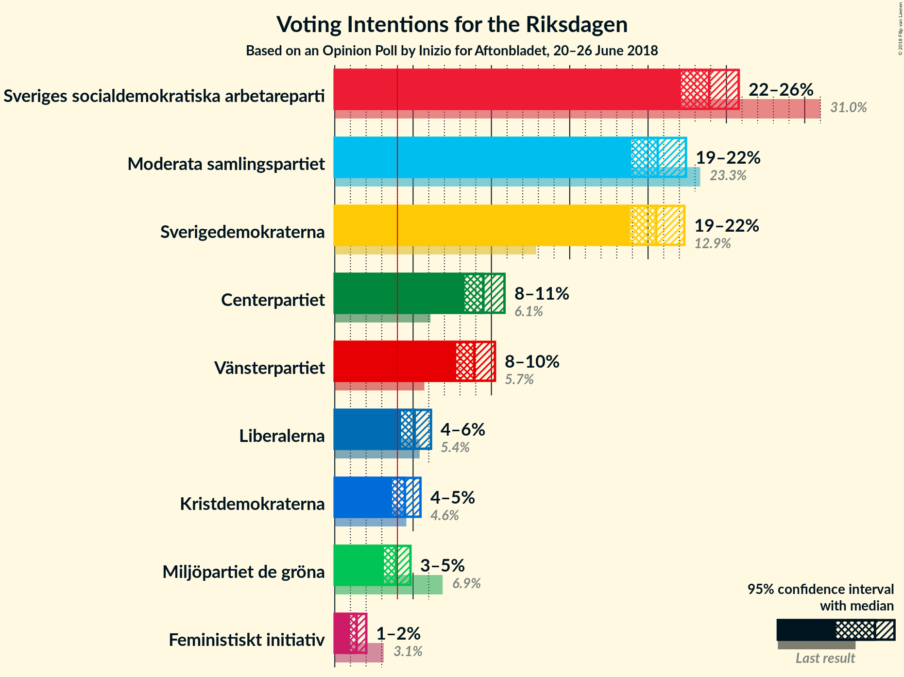
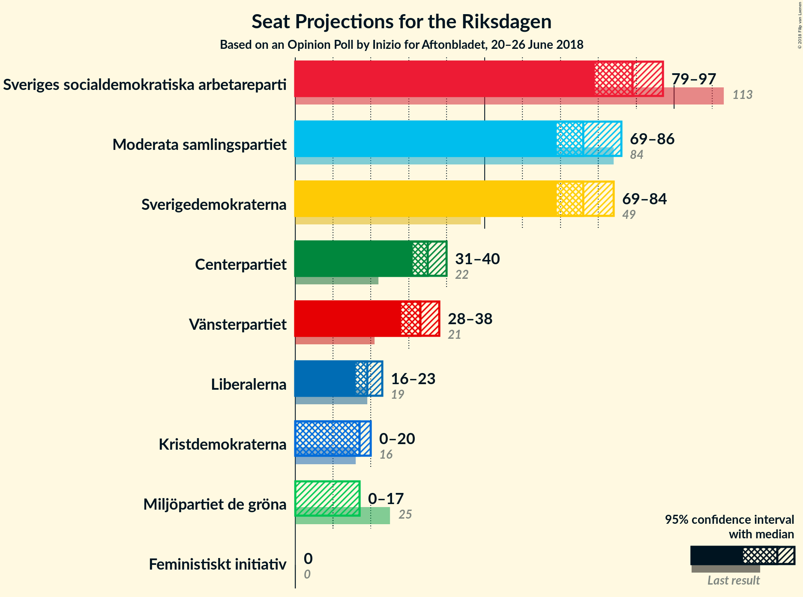
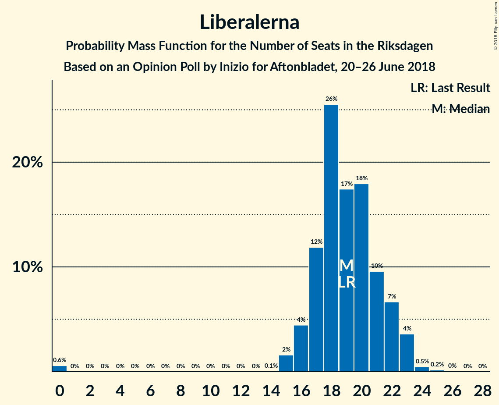
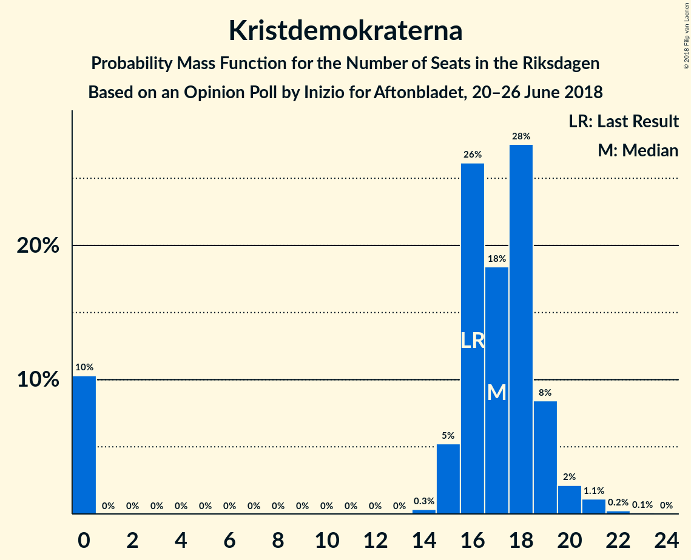

# Opinion Poll by Inizio for Aftonbladet, 20–26 June 2018

<a href="#voting-intentions">Voting Intentions</a> | <a href="#seats">Seats</a> | <a href="#coalitions">Coalitions</a> | <a href="#technical-information">Technical Information</a>

## Voting Intentions

### Confidence Intervals

| Party | Last Result | Poll Result | 80% Confidence Interval | 90% Confidence Interval | 95% Confidence Interval | 99% Confidence Interval |
|:-----:|:-----------:|:-----------:|:-----------------------:|:-----------------------:|:-----------------------:|:-----------------------:|
| Sveriges socialdemokratiska arbetareparti | 31.0% | 23.9% | 22.7–25.1% |22.4–25.5% |22.1–25.8% |21.6–26.4% |
| Moderata samlingspartiet | 23.3% | 20.6% | 19.5–21.8% |19.2–22.1% |18.9–22.4% |18.4–23.0% |
| Sverigedemokraterna | 12.9% | 20.5% | 19.4–21.7% |19.1–22.0% |18.8–22.3% |18.3–22.9% |
| Centerpartiet | 6.1% | 9.5% | 8.7–10.4% |8.5–10.6% |8.3–10.8% |7.9–11.3% |
| Vänsterpartiet | 5.7% | 8.9% | 8.2–9.8% |7.9–10.0% |7.8–10.2% |7.4–10.6% |
| Liberalerna | 5.4% | 5.1% | 4.5–5.8% |4.4–6.0% |4.2–6.1% |4.0–6.5% |
| Kristdemokraterna | 4.6% | 4.5% | 3.9–5.1% |3.8–5.3% |3.7–5.5% |3.4–5.8% |
| Miljöpartiet de gröna | 6.9% | 3.9% | 3.4–4.5% |3.3–4.7% |3.1–4.8% |2.9–5.1% |

*Note:* The poll result column reflects the actual value used in the calculations. Published results may vary slightly, and in addition be rounded to fewer digits.

## Seats

### Confidence Intervals

| Party | Last Result | Median | 80% Confidence Interval | 90% Confidence Interval | 95% Confidence Interval | 99% Confidence Interval |
|:-----:|:-----------:|:------:|:-----------------------:|:-----------------------:|:-----------------------:|:-----------------------:|
| <a href="#sveriges-socialdemokratiska-arbetareparti">Sveriges socialdemokratiska arbetareparti</a> | 113 | 88 | 84–94 |82–96 |80–98 |78–100 |
| <a href="#moderata-samlingspartiet">Moderata samlingspartiet</a> | 84 | 76 | 71–81 |70–83 |69–84 |67–87 |
| <a href="#sverigedemokraterna">Sverigedemokraterna</a> | 49 | 75 | 71–81 |69–82 |68–84 |66–87 |
| <a href="#centerpartiet">Centerpartiet</a> | 22 | 35 | 32–38 |31–39 |30–41 |29–43 |
| <a href="#vänsterpartiet">Vänsterpartiet</a> | 21 | 32 | 30–36 |29–37 |28–38 |27–40 |
| <a href="#liberalerna">Liberalerna</a> | 19 | 19 | 17–21 |16–22 |16–23 |0–24 |
| <a href="#kristdemokraterna">Kristdemokraterna</a> | 16 | 16 | 0–19 |0–19 |0–20 |0–21 |
| <a href="#miljöpartiet-de-gröna">Miljöpartiet de gröna</a> | 25 | 0 | 0–16 |0–17 |0–17 |0–19 |

### Sveriges socialdemokratiska arbetareparti

*For a full overview of the results for this party, see the [Sveriges socialdemokratiska arbetareparti](party-sverigessocialdemokratiskaarbetareparti.html) page.*

| Number of Seats | Probability | Accumulated | Special Marks |
|:---------------:|:-----------:|:-----------:|:-------------:|
| 75 | 0% | 100% |  |
| 76 | 0.1% | 99.9% |  |
| 77 | 0.3% | 99.9% |  |
| 78 | 0.8% | 99.6% |  |
| 79 | 0.6% | 98.8% |  |
| 80 | 1.1% | 98% |  |
| 81 | 2% | 97% |  |
| 82 | 3% | 96% |  |
| 83 | 3% | 93% |  |
| 84 | 5% | 90% |  |
| 85 | 10% | 85% |  |
| 86 | 5% | 75% |  |
| 87 | 14% | 70% |  |
| 88 | 10% | 56% | Median |
| 89 | 14% | 46% |  |
| 90 | 6% | 32% |  |
| 91 | 6% | 26% |  |
| 92 | 6% | 20% |  |
| 93 | 3% | 14% |  |
| 94 | 2% | 11% |  |
| 95 | 3% | 9% |  |
| 96 | 2% | 6% |  |
| 97 | 2% | 4% |  |
| 98 | 1.3% | 3% |  |
| 99 | 0.6% | 1.3% |  |
| 100 | 0.4% | 0.7% |  |
| 101 | 0.1% | 0.3% |  |
| 102 | 0.1% | 0.2% |  |
| 103 | 0.1% | 0.1% |  |
| 104 | 0% | 0% |  |
| 105 | 0% | 0% |  |
| 106 | 0% | 0% |  |
| 107 | 0% | 0% |  |
| 108 | 0% | 0% |  |
| 109 | 0% | 0% |  |
| 110 | 0% | 0% |  |
| 111 | 0% | 0% |  |
| 112 | 0% | 0% |  |
| 113 | 0% | 0% | Last Result |

### Moderata samlingspartiet

*For a full overview of the results for this party, see the [Moderata samlingspartiet](party-moderatasamlingspartiet.html) page.*

| Number of Seats | Probability | Accumulated | Special Marks |
|:---------------:|:-----------:|:-----------:|:-------------:|
| 64 | 0% | 100% |  |
| 65 | 0.1% | 99.9% |  |
| 66 | 0.3% | 99.8% |  |
| 67 | 0.4% | 99.6% |  |
| 68 | 0.8% | 99.2% |  |
| 69 | 2% | 98% |  |
| 70 | 3% | 96% |  |
| 71 | 4% | 93% |  |
| 72 | 5% | 89% |  |
| 73 | 9% | 85% |  |
| 74 | 9% | 76% |  |
| 75 | 12% | 67% |  |
| 76 | 9% | 55% | Median |
| 77 | 10% | 46% |  |
| 78 | 8% | 36% |  |
| 79 | 5% | 28% |  |
| 80 | 8% | 23% |  |
| 81 | 6% | 14% |  |
| 82 | 3% | 9% |  |
| 83 | 2% | 5% |  |
| 84 | 1.1% | 3% | Last Result |
| 85 | 0.7% | 2% |  |
| 86 | 0.6% | 2% |  |
| 87 | 0.6% | 1.0% |  |
| 88 | 0.2% | 0.3% |  |
| 89 | 0.1% | 0.1% |  |
| 90 | 0% | 0.1% |  |
| 91 | 0% | 0% |  |

### Sverigedemokraterna

*For a full overview of the results for this party, see the [Sverigedemokraterna](party-sverigedemokraterna.html) page.*

| Number of Seats | Probability | Accumulated | Special Marks |
|:---------------:|:-----------:|:-----------:|:-------------:|
| 49 | 0% | 100% | Last Result |
| 50 | 0% | 100% |  |
| 51 | 0% | 100% |  |
| 52 | 0% | 100% |  |
| 53 | 0% | 100% |  |
| 54 | 0% | 100% |  |
| 55 | 0% | 100% |  |
| 56 | 0% | 100% |  |
| 57 | 0% | 100% |  |
| 58 | 0% | 100% |  |
| 59 | 0% | 100% |  |
| 60 | 0% | 100% |  |
| 61 | 0% | 100% |  |
| 62 | 0% | 100% |  |
| 63 | 0% | 100% |  |
| 64 | 0.1% | 100% |  |
| 65 | 0.1% | 99.9% |  |
| 66 | 0.4% | 99.8% |  |
| 67 | 0.8% | 99.3% |  |
| 68 | 2% | 98.6% |  |
| 69 | 2% | 96% |  |
| 70 | 4% | 95% |  |
| 71 | 7% | 90% |  |
| 72 | 9% | 83% |  |
| 73 | 13% | 75% |  |
| 74 | 6% | 62% |  |
| 75 | 8% | 56% | Median |
| 76 | 6% | 48% |  |
| 77 | 10% | 42% |  |
| 78 | 8% | 32% |  |
| 79 | 8% | 24% |  |
| 80 | 5% | 16% |  |
| 81 | 3% | 11% |  |
| 82 | 3% | 7% |  |
| 83 | 2% | 4% |  |
| 84 | 1.0% | 3% |  |
| 85 | 0.5% | 1.5% |  |
| 86 | 0.4% | 1.0% |  |
| 87 | 0.3% | 0.5% |  |
| 88 | 0.1% | 0.2% |  |
| 89 | 0.1% | 0.1% |  |
| 90 | 0% | 0% |  |

### Centerpartiet

*For a full overview of the results for this party, see the [Centerpartiet](party-centerpartiet.html) page.*

| Number of Seats | Probability | Accumulated | Special Marks |
|:---------------:|:-----------:|:-----------:|:-------------:|
| 22 | 0% | 100% | Last Result |
| 23 | 0% | 100% |  |
| 24 | 0% | 100% |  |
| 25 | 0% | 100% |  |
| 26 | 0% | 100% |  |
| 27 | 0.1% | 100% |  |
| 28 | 0.2% | 99.9% |  |
| 29 | 0.7% | 99.7% |  |
| 30 | 3% | 99.1% |  |
| 31 | 4% | 96% |  |
| 32 | 6% | 92% |  |
| 33 | 13% | 86% |  |
| 34 | 18% | 74% |  |
| 35 | 13% | 56% | Median |
| 36 | 12% | 43% |  |
| 37 | 12% | 31% |  |
| 38 | 10% | 19% |  |
| 39 | 4% | 9% |  |
| 40 | 2% | 5% |  |
| 41 | 2% | 3% |  |
| 42 | 0.4% | 1.2% |  |
| 43 | 0.7% | 0.8% |  |
| 44 | 0.1% | 0.1% |  |
| 45 | 0% | 0% |  |

### Vänsterpartiet

*For a full overview of the results for this party, see the [Vänsterpartiet](party-vänsterpartiet.html) page.*

| Number of Seats | Probability | Accumulated | Special Marks |
|:---------------:|:-----------:|:-----------:|:-------------:|
| 21 | 0% | 100% | Last Result |
| 22 | 0% | 100% |  |
| 23 | 0% | 100% |  |
| 24 | 0% | 100% |  |
| 25 | 0% | 100% |  |
| 26 | 0.2% | 100% |  |
| 27 | 0.6% | 99.8% |  |
| 28 | 2% | 99.2% |  |
| 29 | 5% | 97% |  |
| 30 | 9% | 91% |  |
| 31 | 14% | 83% |  |
| 32 | 20% | 69% | Median |
| 33 | 14% | 49% |  |
| 34 | 10% | 35% |  |
| 35 | 8% | 25% |  |
| 36 | 8% | 17% |  |
| 37 | 4% | 9% |  |
| 38 | 2% | 4% |  |
| 39 | 1.1% | 2% |  |
| 40 | 0.5% | 0.8% |  |
| 41 | 0.2% | 0.3% |  |
| 42 | 0% | 0.1% |  |
| 43 | 0% | 0% |  |

### Liberalerna

*For a full overview of the results for this party, see the [Liberalerna](party-liberalerna.html) page.*

| Number of Seats | Probability | Accumulated | Special Marks |
|:---------------:|:-----------:|:-----------:|:-------------:|
| 0 | 0.7% | 100% |  |
| 1 | 0% | 99.3% |  |
| 2 | 0% | 99.3% |  |
| 3 | 0% | 99.3% |  |
| 4 | 0% | 99.3% |  |
| 5 | 0% | 99.3% |  |
| 6 | 0% | 99.3% |  |
| 7 | 0% | 99.3% |  |
| 8 | 0% | 99.3% |  |
| 9 | 0% | 99.3% |  |
| 10 | 0% | 99.3% |  |
| 11 | 0% | 99.3% |  |
| 12 | 0% | 99.3% |  |
| 13 | 0% | 99.3% |  |
| 14 | 0.1% | 99.3% |  |
| 15 | 2% | 99.2% |  |
| 16 | 6% | 98% |  |
| 17 | 13% | 92% |  |
| 18 | 23% | 79% |  |
| 19 | 20% | 56% | Last Result, Median |
| 20 | 18% | 36% |  |
| 21 | 10% | 18% |  |
| 22 | 5% | 8% |  |
| 23 | 2% | 3% |  |
| 24 | 0.8% | 1.1% |  |
| 25 | 0.2% | 0.3% |  |
| 26 | 0.1% | 0.1% |  |
| 27 | 0% | 0% |  |

### Kristdemokraterna

*For a full overview of the results for this party, see the [Kristdemokraterna](party-kristdemokraterna.html) page.*

| Number of Seats | Probability | Accumulated | Special Marks |
|:---------------:|:-----------:|:-----------:|:-------------:|
| 0 | 14% | 100% |  |
| 1 | 0% | 86% |  |
| 2 | 0% | 86% |  |
| 3 | 0% | 86% |  |
| 4 | 0% | 86% |  |
| 5 | 0% | 86% |  |
| 6 | 0% | 86% |  |
| 7 | 0% | 86% |  |
| 8 | 0% | 86% |  |
| 9 | 0% | 86% |  |
| 10 | 0% | 86% |  |
| 11 | 0% | 86% |  |
| 12 | 0% | 86% |  |
| 13 | 0% | 86% |  |
| 14 | 1.1% | 86% |  |
| 15 | 12% | 85% |  |
| 16 | 25% | 73% | Last Result, Median |
| 17 | 18% | 48% |  |
| 18 | 16% | 30% |  |
| 19 | 9% | 14% |  |
| 20 | 3% | 5% |  |
| 21 | 1.3% | 2% |  |
| 22 | 0.3% | 0.4% |  |
| 23 | 0.1% | 0.1% |  |
| 24 | 0% | 0% |  |

### Miljöpartiet de gröna

*For a full overview of the results for this party, see the [Miljöpartiet de gröna](party-miljöpartietdegröna.html) page.*

| Number of Seats | Probability | Accumulated | Special Marks |
|:---------------:|:-----------:|:-----------:|:-------------:|
| 0 | 53% | 100% | Median |
| 1 | 0% | 47% |  |
| 2 | 0% | 47% |  |
| 3 | 0% | 47% |  |
| 4 | 0% | 47% |  |
| 5 | 0% | 47% |  |
| 6 | 0% | 47% |  |
| 7 | 0% | 47% |  |
| 8 | 0% | 47% |  |
| 9 | 0% | 47% |  |
| 10 | 0% | 47% |  |
| 11 | 0% | 47% |  |
| 12 | 0% | 47% |  |
| 13 | 0% | 47% |  |
| 14 | 2% | 47% |  |
| 15 | 21% | 45% |  |
| 16 | 15% | 24% |  |
| 17 | 7% | 9% |  |
| 18 | 2% | 2% |  |
| 19 | 0.5% | 0.6% |  |
| 20 | 0.1% | 0.1% |  |
| 21 | 0% | 0% |  |
| 22 | 0% | 0% |  |
| 23 | 0% | 0% |  |
| 24 | 0% | 0% |  |
| 25 | 0% | 0% | Last Result |

## Coalitions

### Confidence Intervals

| Coalition | Last Result | Median | Majority? | 80% Confidence Interval | 90% Confidence Interval | 95% Confidence Interval | 99% Confidence Interval |
|:---------:|:-----------:|:------:|:---------:|:-----------------------:|:-----------------------:|:-----------------------:|:-----------------------:|
| Moderata samlingspartiet – Centerpartiet – Liberalerna – Kristdemokraterna | 141 | 145 | 0% | 136–153 | 133–155 | 131–155 | 127–158 |
| Moderata samlingspartiet – Centerpartiet – Liberalerna | 125 | 129 | 0% | 125–137 | 123–139 | 120–141 | 117–144 |
| Sveriges socialdemokratiska arbetareparti – Vänsterpartiet – Miljöpartiet de gröna | 159 | 128 | 0% | 120–137 | 118–139 | 116–141 | 114–145 |
| Moderata samlingspartiet – Centerpartiet – Kristdemokraterna | 122 | 126 | 0% | 118–134 | 115–135 | 111–136 | 109–139 |
| Sveriges socialdemokratiska arbetareparti – Vänsterpartiet | 134 | 121 | 0% | 115–128 | 114–129 | 112–132 | 109–136 |
| Moderata samlingspartiet – Centerpartiet | 106 | 111 | 0% | 106–118 | 104–119 | 102–121 | 100–124 |
| Sveriges socialdemokratiska arbetareparti – Miljöpartiet de gröna | 138 | 96 | 0% | 87–104 | 85–106 | 83–107 | 81–111 |

### Moderata samlingspartiet – Centerpartiet – Liberalerna – Kristdemokraterna

| Number of Seats | Probability | Accumulated | Special Marks |
|:---------------:|:-----------:|:-----------:|:-------------:|
| 122 | 0% | 100% |  |
| 123 | 0% | 99.9% |  |
| 124 | 0% | 99.9% |  |
| 125 | 0% | 99.9% |  |
| 126 | 0.2% | 99.8% |  |
| 127 | 0.2% | 99.6% |  |
| 128 | 0.2% | 99.5% |  |
| 129 | 0.1% | 99.3% |  |
| 130 | 0.9% | 99.2% |  |
| 131 | 1.0% | 98% |  |
| 132 | 2% | 97% |  |
| 133 | 1.1% | 96% |  |
| 134 | 1.2% | 94% |  |
| 135 | 3% | 93% |  |
| 136 | 0.8% | 90% |  |
| 137 | 1.0% | 90% |  |
| 138 | 2% | 89% |  |
| 139 | 3% | 87% |  |
| 140 | 4% | 83% |  |
| 141 | 3% | 79% | Last Result |
| 142 | 8% | 76% |  |
| 143 | 10% | 68% |  |
| 144 | 8% | 58% |  |
| 145 | 9% | 51% |  |
| 146 | 4% | 42% | Median |
| 147 | 7% | 38% |  |
| 148 | 4% | 31% |  |
| 149 | 2% | 27% |  |
| 150 | 2% | 25% |  |
| 151 | 5% | 22% |  |
| 152 | 6% | 17% |  |
| 153 | 4% | 11% |  |
| 154 | 2% | 7% |  |
| 155 | 3% | 5% |  |
| 156 | 1.0% | 2% |  |
| 157 | 0.7% | 1.5% |  |
| 158 | 0.4% | 0.8% |  |
| 159 | 0.2% | 0.4% |  |
| 160 | 0.1% | 0.1% |  |
| 161 | 0% | 0.1% |  |
| 162 | 0% | 0% |  |

### Moderata samlingspartiet – Centerpartiet – Liberalerna

| Number of Seats | Probability | Accumulated | Special Marks |
|:---------------:|:-----------:|:-----------:|:-------------:|
| 110 | 0.1% | 100% |  |
| 111 | 0% | 99.9% |  |
| 112 | 0% | 99.9% |  |
| 113 | 0% | 99.8% |  |
| 114 | 0% | 99.8% |  |
| 115 | 0.1% | 99.8% |  |
| 116 | 0.2% | 99.7% |  |
| 117 | 0.2% | 99.5% |  |
| 118 | 0.6% | 99.4% |  |
| 119 | 1.0% | 98.7% |  |
| 120 | 0.9% | 98% |  |
| 121 | 0.9% | 97% |  |
| 122 | 0.9% | 96% |  |
| 123 | 2% | 95% |  |
| 124 | 3% | 93% |  |
| 125 | 5% | 91% | Last Result |
| 126 | 7% | 85% |  |
| 127 | 12% | 78% |  |
| 128 | 11% | 67% |  |
| 129 | 10% | 55% |  |
| 130 | 5% | 45% | Median |
| 131 | 2% | 40% |  |
| 132 | 4% | 38% |  |
| 133 | 3% | 34% |  |
| 134 | 5% | 31% |  |
| 135 | 6% | 26% |  |
| 136 | 7% | 20% |  |
| 137 | 4% | 12% |  |
| 138 | 2% | 9% |  |
| 139 | 3% | 7% |  |
| 140 | 0.9% | 4% |  |
| 141 | 0.7% | 3% |  |
| 142 | 2% | 2% |  |
| 143 | 0.4% | 0.9% |  |
| 144 | 0.2% | 0.5% |  |
| 145 | 0.1% | 0.3% |  |
| 146 | 0% | 0.2% |  |
| 147 | 0.1% | 0.2% |  |
| 148 | 0% | 0.1% |  |
| 149 | 0% | 0.1% |  |
| 150 | 0% | 0% |  |

### Sveriges socialdemokratiska arbetareparti – Vänsterpartiet – Miljöpartiet de gröna

| Number of Seats | Probability | Accumulated | Special Marks |
|:---------------:|:-----------:|:-----------:|:-------------:|
| 111 | 0.1% | 100% |  |
| 112 | 0.1% | 99.9% |  |
| 113 | 0.3% | 99.8% |  |
| 114 | 0.5% | 99.6% |  |
| 115 | 1.0% | 99.1% |  |
| 116 | 0.7% | 98% |  |
| 117 | 2% | 97% |  |
| 118 | 1.5% | 96% |  |
| 119 | 3% | 94% |  |
| 120 | 5% | 91% | Median |
| 121 | 5% | 87% |  |
| 122 | 5% | 81% |  |
| 123 | 4% | 77% |  |
| 124 | 4% | 72% |  |
| 125 | 6% | 68% |  |
| 126 | 4% | 62% |  |
| 127 | 4% | 58% |  |
| 128 | 5% | 54% |  |
| 129 | 3% | 49% |  |
| 130 | 3% | 47% |  |
| 131 | 5% | 44% |  |
| 132 | 5% | 38% |  |
| 133 | 6% | 34% |  |
| 134 | 7% | 28% |  |
| 135 | 2% | 21% |  |
| 136 | 6% | 19% |  |
| 137 | 5% | 13% |  |
| 138 | 2% | 8% |  |
| 139 | 2% | 6% |  |
| 140 | 2% | 4% |  |
| 141 | 0.8% | 3% |  |
| 142 | 0.5% | 2% |  |
| 143 | 0.4% | 1.2% |  |
| 144 | 0.2% | 0.8% |  |
| 145 | 0.2% | 0.6% |  |
| 146 | 0.2% | 0.4% |  |
| 147 | 0.1% | 0.2% |  |
| 148 | 0% | 0.1% |  |
| 149 | 0% | 0% |  |
| 150 | 0% | 0% |  |
| 151 | 0% | 0% |  |
| 152 | 0% | 0% |  |
| 153 | 0% | 0% |  |
| 154 | 0% | 0% |  |
| 155 | 0% | 0% |  |
| 156 | 0% | 0% |  |
| 157 | 0% | 0% |  |
| 158 | 0% | 0% |  |
| 159 | 0% | 0% | Last Result |

### Moderata samlingspartiet – Centerpartiet – Kristdemokraterna

| Number of Seats | Probability | Accumulated | Special Marks |
|:---------------:|:-----------:|:-----------:|:-------------:|
| 104 | 0% | 100% |  |
| 105 | 0% | 99.9% |  |
| 106 | 0% | 99.9% |  |
| 107 | 0.2% | 99.9% |  |
| 108 | 0.1% | 99.6% |  |
| 109 | 0.2% | 99.5% |  |
| 110 | 0.7% | 99.3% |  |
| 111 | 1.2% | 98.6% |  |
| 112 | 0.8% | 97% |  |
| 113 | 0.7% | 97% |  |
| 114 | 0.9% | 96% |  |
| 115 | 2% | 95% |  |
| 116 | 2% | 94% |  |
| 117 | 0.8% | 91% |  |
| 118 | 2% | 90% |  |
| 119 | 3% | 89% |  |
| 120 | 2% | 86% |  |
| 121 | 4% | 83% |  |
| 122 | 3% | 79% | Last Result |
| 123 | 4% | 76% |  |
| 124 | 10% | 72% |  |
| 125 | 9% | 62% |  |
| 126 | 6% | 53% |  |
| 127 | 5% | 47% | Median |
| 128 | 7% | 42% |  |
| 129 | 7% | 35% |  |
| 130 | 4% | 28% |  |
| 131 | 5% | 24% |  |
| 132 | 5% | 19% |  |
| 133 | 3% | 14% |  |
| 134 | 2% | 11% |  |
| 135 | 5% | 9% |  |
| 136 | 2% | 4% |  |
| 137 | 0.7% | 2% |  |
| 138 | 0.9% | 2% |  |
| 139 | 0.3% | 0.8% |  |
| 140 | 0.3% | 0.4% |  |
| 141 | 0.1% | 0.2% |  |
| 142 | 0% | 0.1% |  |
| 143 | 0% | 0.1% |  |
| 144 | 0% | 0% |  |

### Sveriges socialdemokratiska arbetareparti – Vänsterpartiet

| Number of Seats | Probability | Accumulated | Special Marks |
|:---------------:|:-----------:|:-----------:|:-------------:|
| 106 | 0% | 100% |  |
| 107 | 0.1% | 99.9% |  |
| 108 | 0.1% | 99.9% |  |
| 109 | 0.4% | 99.7% |  |
| 110 | 0.5% | 99.3% |  |
| 111 | 0.8% | 98.9% |  |
| 112 | 2% | 98% |  |
| 113 | 1.4% | 96% |  |
| 114 | 2% | 95% |  |
| 115 | 3% | 93% |  |
| 116 | 6% | 89% |  |
| 117 | 7% | 83% |  |
| 118 | 7% | 77% |  |
| 119 | 9% | 70% |  |
| 120 | 8% | 61% | Median |
| 121 | 10% | 53% |  |
| 122 | 8% | 44% |  |
| 123 | 5% | 35% |  |
| 124 | 5% | 30% |  |
| 125 | 6% | 24% |  |
| 126 | 4% | 18% |  |
| 127 | 3% | 14% |  |
| 128 | 4% | 11% |  |
| 129 | 2% | 7% |  |
| 130 | 0.9% | 5% |  |
| 131 | 1.3% | 4% |  |
| 132 | 0.8% | 3% |  |
| 133 | 0.6% | 2% |  |
| 134 | 0.2% | 1.2% | Last Result |
| 135 | 0.1% | 1.0% |  |
| 136 | 0.6% | 0.8% |  |
| 137 | 0.1% | 0.3% |  |
| 138 | 0.1% | 0.2% |  |
| 139 | 0% | 0.1% |  |
| 140 | 0.1% | 0.1% |  |
| 141 | 0% | 0% |  |

### Moderata samlingspartiet – Centerpartiet

| Number of Seats | Probability | Accumulated | Special Marks |
|:---------------:|:-----------:|:-----------:|:-------------:|
| 97 | 0.1% | 100% |  |
| 98 | 0.1% | 99.9% |  |
| 99 | 0.2% | 99.8% |  |
| 100 | 0.5% | 99.7% |  |
| 101 | 0.6% | 99.1% |  |
| 102 | 1.0% | 98.5% |  |
| 103 | 1.2% | 97% |  |
| 104 | 3% | 96% |  |
| 105 | 3% | 94% |  |
| 106 | 4% | 91% | Last Result |
| 107 | 7% | 87% |  |
| 108 | 9% | 80% |  |
| 109 | 9% | 71% |  |
| 110 | 10% | 62% |  |
| 111 | 7% | 52% | Median |
| 112 | 8% | 45% |  |
| 113 | 4% | 37% |  |
| 114 | 5% | 33% |  |
| 115 | 6% | 28% |  |
| 116 | 6% | 22% |  |
| 117 | 2% | 16% |  |
| 118 | 6% | 14% |  |
| 119 | 3% | 8% |  |
| 120 | 1.1% | 5% |  |
| 121 | 2% | 4% |  |
| 122 | 0.3% | 2% |  |
| 123 | 0.4% | 1.4% |  |
| 124 | 0.6% | 1.1% |  |
| 125 | 0.2% | 0.4% |  |
| 126 | 0% | 0.2% |  |
| 127 | 0.1% | 0.2% |  |
| 128 | 0% | 0.1% |  |
| 129 | 0% | 0.1% |  |
| 130 | 0% | 0% |  |

### Sveriges socialdemokratiska arbetareparti – Miljöpartiet de gröna

| Number of Seats | Probability | Accumulated | Special Marks |
|:---------------:|:-----------:|:-----------:|:-------------:|
| 79 | 0.1% | 100% |  |
| 80 | 0.1% | 99.9% |  |
| 81 | 0.4% | 99.8% |  |
| 82 | 1.4% | 99.3% |  |
| 83 | 0.8% | 98% |  |
| 84 | 2% | 97% |  |
| 85 | 3% | 95% |  |
| 86 | 2% | 93% |  |
| 87 | 6% | 90% |  |
| 88 | 4% | 85% | Median |
| 89 | 8% | 80% |  |
| 90 | 4% | 73% |  |
| 91 | 4% | 68% |  |
| 92 | 5% | 65% |  |
| 93 | 3% | 59% |  |
| 94 | 2% | 56% |  |
| 95 | 3% | 54% |  |
| 96 | 3% | 51% |  |
| 97 | 2% | 48% |  |
| 98 | 3% | 46% |  |
| 99 | 2% | 43% |  |
| 100 | 6% | 41% |  |
| 101 | 6% | 35% |  |
| 102 | 5% | 29% |  |
| 103 | 6% | 25% |  |
| 104 | 9% | 19% |  |
| 105 | 4% | 9% |  |
| 106 | 2% | 5% |  |
| 107 | 1.0% | 3% |  |
| 108 | 1.3% | 2% |  |
| 109 | 0.2% | 1.1% |  |
| 110 | 0.3% | 0.8% |  |
| 111 | 0.3% | 0.5% |  |
| 112 | 0.1% | 0.2% |  |
| 113 | 0% | 0.2% |  |
| 114 | 0% | 0.1% |  |
| 115 | 0.1% | 0.1% |  |
| 116 | 0% | 0% |  |
| 117 | 0% | 0% |  |
| 118 | 0% | 0% |  |
| 119 | 0% | 0% |  |
| 120 | 0% | 0% |  |
| 121 | 0% | 0% |  |
| 122 | 0% | 0% |  |
| 123 | 0% | 0% |  |
| 124 | 0% | 0% |  |
| 125 | 0% | 0% |  |
| 126 | 0% | 0% |  |
| 127 | 0% | 0% |  |
| 128 | 0% | 0% |  |
| 129 | 0% | 0% |  |
| 130 | 0% | 0% |  |
| 131 | 0% | 0% |  |
| 132 | 0% | 0% |  |
| 133 | 0% | 0% |  |
| 134 | 0% | 0% |  |
| 135 | 0% | 0% |  |
| 136 | 0% | 0% |  |
| 137 | 0% | 0% |  |
| 138 | 0% | 0% | Last Result |

## Technical Information

### Opinion Poll

+ **Polling firm:** Inizio
+ **Commissioner(s):** Aftonbladet
+ **Fieldwork period:** 20–26 June 2018

### Calculations

+ **Sample size:** 2076
+ **Simulations done:** 1,048,576
+ **Error estimate:** 1.02%

