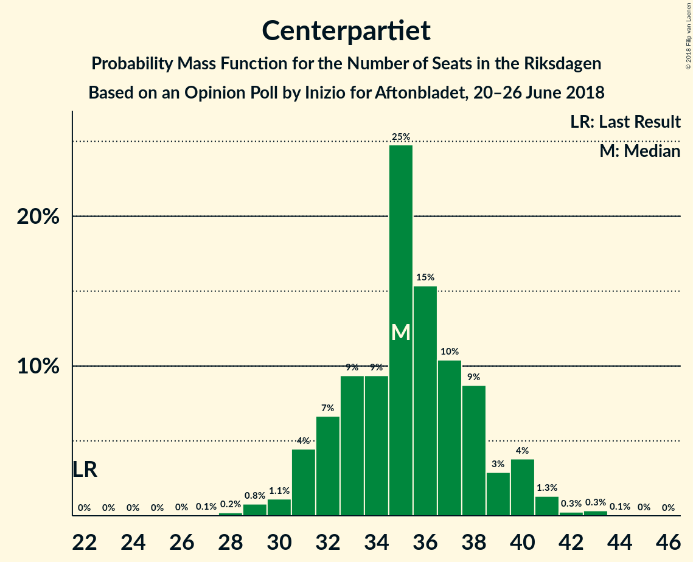

# Opinion Poll by Inizio for Aftonbladet, 20–26 June 2018

<a href="#voting-intentions">Voting Intentions</a> | <a href="#seats">Seats</a> | <a href="#coalitions">Coalitions</a> | <a href="#technical-information">Technical Information</a>

## Voting Intentions

### Confidence Intervals

| Party | Last Result | Poll Result | 80% Confidence Interval | 90% Confidence Interval | 95% Confidence Interval | 99% Confidence Interval |
|:-----:|:-----------:|:-----------:|:-----------------------:|:-----------------------:|:-----------------------:|:-----------------------:|
| Sveriges socialdemokratiska arbetareparti | 31.0% | 23.9% | 22.7–25.1% |22.4–25.5% |22.1–25.8% |21.6–26.4% |
| Moderata samlingspartiet | 23.3% | 20.6% | 19.5–21.8% |19.2–22.1% |18.9–22.4% |18.4–23.0% |
| Sverigedemokraterna | 12.9% | 20.5% | 19.4–21.7% |19.1–22.0% |18.8–22.3% |18.3–22.9% |
| Centerpartiet | 6.1% | 9.5% | 8.7–10.4% |8.5–10.6% |8.3–10.8% |7.9–11.3% |
| Vänsterpartiet | 5.7% | 8.9% | 8.2–9.8% |7.9–10.0% |7.8–10.2% |7.4–10.6% |
| Liberalerna | 5.4% | 5.1% | 4.5–5.8% |4.4–6.0% |4.2–6.1% |4.0–6.5% |
| Kristdemokraterna | 4.6% | 4.5% | 3.9–5.1% |3.8–5.3% |3.7–5.5% |3.4–5.8% |
| Miljöpartiet de gröna | 6.9% | 3.9% | 3.4–4.5% |3.3–4.7% |3.1–4.8% |2.9–5.1% |
| Feministiskt initiativ | 3.1% | 1.4% | 1.1–1.8% |1.0–1.9% |1.0–2.0% |0.9–2.2% |

*Note:* The poll result column reflects the actual value used in the calculations. Published results may vary slightly, and in addition be rounded to fewer digits.

## Seats

### Confidence Intervals

| Party | Last Result | Median | 80% Confidence Interval | 90% Confidence Interval | 95% Confidence Interval | 99% Confidence Interval |
|:-----:|:-----------:|:------:|:-----------------------:|:-----------------------:|:-----------------------:|:-----------------------:|
| <a href="#sveriges-socialdemokratiska-arbetareparti">Sveriges socialdemokratiska arbetareparti</a> | 113 | 89 | 78–89 |78–89 |78–90 |78–96 |
| <a href="#moderata-samlingspartiet">Moderata samlingspartiet</a> | 84 | 80 | 79–80 |79–80 |77–80 |72–88 |
| <a href="#sverigedemokraterna">Sverigedemokraterna</a> | 49 | 68 | 68–71 |68–71 |68–72 |68–78 |
| <a href="#centerpartiet">Centerpartiet</a> | 22 | 32 | 32–36 |32–36 |32–36 |32–38 |
| <a href="#vänsterpartiet">Vänsterpartiet</a> | 21 | 31 | 31–32 |31–32 |31–34 |31–37 |
| <a href="#liberalerna">Liberalerna</a> | 19 | 19 | 18–19 |18–19 |18–26 |18–26 |
| <a href="#kristdemokraterna">Kristdemokraterna</a> | 16 | 15 | 15–16 |15–16 |15–18 |0–19 |
| <a href="#miljöpartiet-de-gröna">Miljöpartiet de gröna</a> | 25 | 15 | 15–19 |15–19 |0–19 |0–19 |
| <a href="#feministiskt-initiativ">Feministiskt initiativ</a> | 0 | 0 | 0 |0 |0 |0 |

### Sveriges socialdemokratiska arbetareparti

*For a full overview of the results for this party, see the [Sveriges socialdemokratiska arbetareparti](party-sverigessocialdemokratiskaarbetareparti.html) page.*

| Number of Seats | Probability | Accumulated | Special Marks |
|:---------------:|:-----------:|:-----------:|:-------------:|
| 78 | 24% | 100% |  |
| 79 | 0% | 76% |  |
| 80 | 0% | 76% |  |
| 81 | 0% | 76% |  |
| 82 | 0% | 76% |  |
| 83 | 0.2% | 76% |  |
| 84 | 0% | 76% |  |
| 85 | 0% | 76% |  |
| 86 | 0% | 76% |  |
| 87 | 0.6% | 76% |  |
| 88 | 0.2% | 75% |  |
| 89 | 71% | 75% | Median |
| 90 | 3% | 4% |  |
| 91 | 0.1% | 1.0% |  |
| 92 | 0.3% | 0.8% |  |
| 93 | 0% | 0.6% |  |
| 94 | 0% | 0.6% |  |
| 95 | 0% | 0.6% |  |
| 96 | 0.5% | 0.6% |  |
| 97 | 0% | 0.1% |  |
| 98 | 0% | 0.1% |  |
| 99 | 0% | 0% |  |
| 100 | 0% | 0% |  |
| 101 | 0% | 0% |  |
| 102 | 0% | 0% |  |
| 103 | 0% | 0% |  |
| 104 | 0% | 0% |  |
| 105 | 0% | 0% |  |
| 106 | 0% | 0% |  |
| 107 | 0% | 0% |  |
| 108 | 0% | 0% |  |
| 109 | 0% | 0% |  |
| 110 | 0% | 0% |  |
| 111 | 0% | 0% |  |
| 112 | 0% | 0% |  |
| 113 | 0% | 0% | Last Result |

### Moderata samlingspartiet

*For a full overview of the results for this party, see the [Moderata samlingspartiet](party-moderatasamlingspartiet.html) page.*

| Number of Seats | Probability | Accumulated | Special Marks |
|:---------------:|:-----------:|:-----------:|:-------------:|
| 66 | 0.1% | 100% |  |
| 67 | 0% | 99.9% |  |
| 68 | 0% | 99.9% |  |
| 69 | 0.2% | 99.9% |  |
| 70 | 0% | 99.7% |  |
| 71 | 0% | 99.7% |  |
| 72 | 0.3% | 99.6% |  |
| 73 | 0.3% | 99.4% |  |
| 74 | 0% | 99.1% |  |
| 75 | 0% | 99.1% |  |
| 76 | 0.2% | 99.1% |  |
| 77 | 3% | 98.9% |  |
| 78 | 0.6% | 96% |  |
| 79 | 24% | 95% |  |
| 80 | 71% | 71% | Median |
| 81 | 0% | 0.5% |  |
| 82 | 0% | 0.5% |  |
| 83 | 0% | 0.5% |  |
| 84 | 0% | 0.5% | Last Result |
| 85 | 0% | 0.5% |  |
| 86 | 0% | 0.5% |  |
| 87 | 0% | 0.5% |  |
| 88 | 0.5% | 0.5% |  |
| 89 | 0% | 0% |  |

### Sverigedemokraterna

*For a full overview of the results for this party, see the [Sverigedemokraterna](party-sverigedemokraterna.html) page.*

| Number of Seats | Probability | Accumulated | Special Marks |
|:---------------:|:-----------:|:-----------:|:-------------:|
| 49 | 0% | 100% | Last Result |
| 50 | 0% | 100% |  |
| 51 | 0% | 100% |  |
| 52 | 0% | 100% |  |
| 53 | 0% | 100% |  |
| 54 | 0% | 100% |  |
| 55 | 0% | 100% |  |
| 56 | 0% | 100% |  |
| 57 | 0% | 100% |  |
| 58 | 0% | 100% |  |
| 59 | 0% | 100% |  |
| 60 | 0% | 100% |  |
| 61 | 0% | 100% |  |
| 62 | 0% | 100% |  |
| 63 | 0% | 100% |  |
| 64 | 0% | 100% |  |
| 65 | 0% | 100% |  |
| 66 | 0% | 100% |  |
| 67 | 0.1% | 100% |  |
| 68 | 71% | 99.9% | Median |
| 69 | 0% | 29% |  |
| 70 | 0% | 29% |  |
| 71 | 24% | 29% |  |
| 72 | 3% | 5% |  |
| 73 | 0.1% | 2% |  |
| 74 | 0.3% | 2% |  |
| 75 | 0% | 1.5% |  |
| 76 | 0.7% | 1.5% |  |
| 77 | 0% | 0.8% |  |
| 78 | 0.7% | 0.8% |  |
| 79 | 0% | 0% |  |

### Centerpartiet

*For a full overview of the results for this party, see the [Centerpartiet](party-centerpartiet.html) page.*

| Number of Seats | Probability | Accumulated | Special Marks |
|:---------------:|:-----------:|:-----------:|:-------------:|
| 22 | 0% | 100% | Last Result |
| 23 | 0% | 100% |  |
| 24 | 0% | 100% |  |
| 25 | 0% | 100% |  |
| 26 | 0% | 100% |  |
| 27 | 0% | 100% |  |
| 28 | 0% | 100% |  |
| 29 | 0% | 100% |  |
| 30 | 0% | 100% |  |
| 31 | 0% | 100% |  |
| 32 | 74% | 100% | Median |
| 33 | 0.5% | 26% |  |
| 34 | 0% | 25% |  |
| 35 | 0.3% | 25% |  |
| 36 | 24% | 25% |  |
| 37 | 0.2% | 0.7% |  |
| 38 | 0.4% | 0.6% |  |
| 39 | 0% | 0.2% |  |
| 40 | 0.1% | 0.2% |  |
| 41 | 0% | 0% |  |

### Vänsterpartiet

*For a full overview of the results for this party, see the [Vänsterpartiet](party-vänsterpartiet.html) page.*

| Number of Seats | Probability | Accumulated | Special Marks |
|:---------------:|:-----------:|:-----------:|:-------------:|
| 21 | 0% | 100% | Last Result |
| 22 | 0% | 100% |  |
| 23 | 0% | 100% |  |
| 24 | 0% | 100% |  |
| 25 | 0% | 100% |  |
| 26 | 0% | 100% |  |
| 27 | 0% | 100% |  |
| 28 | 0% | 100% |  |
| 29 | 0% | 100% |  |
| 30 | 0% | 100% |  |
| 31 | 71% | 100% | Median |
| 32 | 24% | 29% |  |
| 33 | 0.3% | 5% |  |
| 34 | 3% | 5% |  |
| 35 | 0.7% | 2% |  |
| 36 | 0.3% | 0.8% |  |
| 37 | 0.5% | 0.6% |  |
| 38 | 0% | 0% |  |

### Liberalerna

*For a full overview of the results for this party, see the [Liberalerna](party-liberalerna.html) page.*

| Number of Seats | Probability | Accumulated | Special Marks |
|:---------------:|:-----------:|:-----------:|:-------------:|
| 17 | 0.2% | 100% |  |
| 18 | 25% | 99.8% |  |
| 19 | 71% | 75% | Last Result, Median |
| 20 | 0.6% | 4% |  |
| 21 | 0% | 3% |  |
| 22 | 0% | 3% |  |
| 23 | 0% | 3% |  |
| 24 | 0% | 3% |  |
| 25 | 0% | 3% |  |
| 26 | 3% | 3% |  |
| 27 | 0.2% | 0.2% |  |
| 28 | 0% | 0% |  |

### Kristdemokraterna

*For a full overview of the results for this party, see the [Kristdemokraterna](party-kristdemokraterna.html) page.*

| Number of Seats | Probability | Accumulated | Special Marks |
|:---------------:|:-----------:|:-----------:|:-------------:|
| 0 | 0.6% | 100% |  |
| 1 | 0% | 99.4% |  |
| 2 | 0% | 99.4% |  |
| 3 | 0% | 99.4% |  |
| 4 | 0% | 99.4% |  |
| 5 | 0% | 99.4% |  |
| 6 | 0% | 99.4% |  |
| 7 | 0% | 99.4% |  |
| 8 | 0% | 99.4% |  |
| 9 | 0% | 99.4% |  |
| 10 | 0% | 99.4% |  |
| 11 | 0% | 99.4% |  |
| 12 | 0% | 99.4% |  |
| 13 | 0% | 99.4% |  |
| 14 | 0% | 99.4% |  |
| 15 | 71% | 99.4% | Median |
| 16 | 24% | 29% | Last Result |
| 17 | 0% | 5% |  |
| 18 | 3% | 5% |  |
| 19 | 0.8% | 1.1% |  |
| 20 | 0% | 0.3% |  |
| 21 | 0% | 0.3% |  |
| 22 | 0.3% | 0.3% |  |
| 23 | 0% | 0% |  |

### Miljöpartiet de gröna

*For a full overview of the results for this party, see the [Miljöpartiet de gröna](party-miljöpartietdegröna.html) page.*

| Number of Seats | Probability | Accumulated | Special Marks |
|:---------------:|:-----------:|:-----------:|:-------------:|
| 0 | 5% | 100% |  |
| 1 | 0% | 95% |  |
| 2 | 0% | 95% |  |
| 3 | 0% | 95% |  |
| 4 | 0% | 95% |  |
| 5 | 0% | 95% |  |
| 6 | 0% | 95% |  |
| 7 | 0% | 95% |  |
| 8 | 0% | 95% |  |
| 9 | 0% | 95% |  |
| 10 | 0% | 95% |  |
| 11 | 0% | 95% |  |
| 12 | 0% | 95% |  |
| 13 | 0% | 95% |  |
| 14 | 0% | 95% |  |
| 15 | 71% | 95% | Median |
| 16 | 0% | 25% |  |
| 17 | 0% | 25% |  |
| 18 | 0.1% | 25% |  |
| 19 | 24% | 24% |  |
| 20 | 0% | 0% |  |
| 21 | 0% | 0% |  |
| 22 | 0% | 0% |  |
| 23 | 0% | 0% |  |
| 24 | 0% | 0% |  |
| 25 | 0% | 0% | Last Result |

### Feministiskt initiativ

*For a full overview of the results for this party, see the [Feministiskt initiativ](party-feministisktinitiativ.html) page.*

| Number of Seats | Probability | Accumulated | Special Marks |
|:---------------:|:-----------:|:-----------:|:-------------:|
| 0 | 100% | 100% | Last Result, Median |

## Coalitions

### Confidence Intervals

| Coalition | Last Result | Median | Majority? | 80% Confidence Interval | 90% Confidence Interval | 95% Confidence Interval | 99% Confidence Interval |
|:---------:|:-----------:|:------:|:---------:|:-----------------------:|:-----------------------:|:-----------------------:|:-----------------------:|
| Sveriges socialdemokratiska arbetareparti – Moderata samlingspartiet | 197 | 169 | 0.6% | 157–169 | 157–169 | 157–169 | 157–184 |
| Moderata samlingspartiet – Centerpartiet – Liberalerna – Kristdemokraterna | 141 | 146 | 0% | 146–149 | 146–149 | 146–153 | 140–153 |
| Moderata samlingspartiet – Centerpartiet – Liberalerna | 125 | 131 | 0% | 131–133 | 131–133 | 131–135 | 128–140 |
| Sveriges socialdemokratiska arbetareparti – Vänsterpartiet – Miljöpartiet de gröna – Feministiskt initiativ | 159 | 135 | 0% | 129–135 | 129–135 | 124–135 | 122–135 |
| Sveriges socialdemokratiska arbetareparti – Vänsterpartiet – Miljöpartiet de gröna | 159 | 135 | 0% | 129–135 | 129–135 | 124–135 | 122–135 |
| Moderata samlingspartiet – Centerpartiet – Kristdemokraterna | 122 | 127 | 0% | 127–131 | 127–131 | 127–131 | 121–131 |
| Sveriges socialdemokratiska arbetareparti – Vänsterpartiet | 134 | 120 | 0% | 110–120 | 110–121 | 110–124 | 110–133 |
| Moderata samlingspartiet – Centerpartiet | 106 | 112 | 0% | 112–115 | 112–115 | 109–115 | 107–121 |
| Sveriges socialdemokratiska arbetareparti – Miljöpartiet de gröna | 138 | 104 | 0% | 97–104 | 97–104 | 90–104 | 87–104 |

### Sveriges socialdemokratiska arbetareparti – Moderata samlingspartiet

| Number of Seats | Probability | Accumulated | Special Marks |
|:---------------:|:-----------:|:-----------:|:-------------:|
| 156 | 0.3% | 100% |  |
| 157 | 24% | 99.7% |  |
| 158 | 0% | 75% |  |
| 159 | 0% | 75% |  |
| 160 | 0% | 75% |  |
| 161 | 0% | 75% |  |
| 162 | 0% | 75% |  |
| 163 | 0% | 75% |  |
| 164 | 0.3% | 75% |  |
| 165 | 0.6% | 75% |  |
| 166 | 0.2% | 74% |  |
| 167 | 3% | 74% |  |
| 168 | 0% | 71% |  |
| 169 | 71% | 71% | Median |
| 170 | 0% | 0.6% |  |
| 171 | 0% | 0.6% |  |
| 172 | 0% | 0.6% |  |
| 173 | 0% | 0.6% |  |
| 174 | 0% | 0.6% |  |
| 175 | 0% | 0.6% | Majority |
| 176 | 0% | 0.6% |  |
| 177 | 0% | 0.6% |  |
| 178 | 0% | 0.6% |  |
| 179 | 0% | 0.6% |  |
| 180 | 0% | 0.6% |  |
| 181 | 0% | 0.6% |  |
| 182 | 0% | 0.6% |  |
| 183 | 0% | 0.6% |  |
| 184 | 0.5% | 0.6% |  |
| 185 | 0% | 0% |  |
| 186 | 0% | 0% |  |
| 187 | 0% | 0% |  |
| 188 | 0% | 0% |  |
| 189 | 0% | 0% |  |
| 190 | 0% | 0% |  |
| 191 | 0% | 0% |  |
| 192 | 0% | 0% |  |
| 193 | 0% | 0% |  |
| 194 | 0% | 0% |  |
| 195 | 0% | 0% |  |
| 196 | 0% | 0% |  |
| 197 | 0% | 0% | Last Result |

### Moderata samlingspartiet – Centerpartiet – Liberalerna – Kristdemokraterna

| Number of Seats | Probability | Accumulated | Special Marks |
|:---------------:|:-----------:|:-----------:|:-------------:|
| 137 | 0% | 100% |  |
| 138 | 0% | 99.9% |  |
| 139 | 0% | 99.9% |  |
| 140 | 0.5% | 99.9% |  |
| 141 | 0% | 99.4% | Last Result |
| 142 | 0.1% | 99.4% |  |
| 143 | 0% | 99.3% |  |
| 144 | 0% | 99.3% |  |
| 145 | 0% | 99.3% |  |
| 146 | 71% | 99.3% | Median |
| 147 | 0.5% | 29% |  |
| 148 | 0% | 28% |  |
| 149 | 25% | 28% |  |
| 150 | 0% | 3% |  |
| 151 | 0% | 3% |  |
| 152 | 0.2% | 3% |  |
| 153 | 3% | 3% |  |
| 154 | 0% | 0% |  |

### Moderata samlingspartiet – Centerpartiet – Liberalerna

| Number of Seats | Probability | Accumulated | Special Marks |
|:---------------:|:-----------:|:-----------:|:-------------:|
| 124 | 0.2% | 100% |  |
| 125 | 0.3% | 99.8% | Last Result |
| 126 | 0% | 99.6% |  |
| 127 | 0% | 99.6% |  |
| 128 | 0.2% | 99.6% |  |
| 129 | 0% | 99.3% |  |
| 130 | 0.6% | 99.3% |  |
| 131 | 71% | 98.8% | Median |
| 132 | 0% | 28% |  |
| 133 | 24% | 28% |  |
| 134 | 0.2% | 4% |  |
| 135 | 3% | 4% |  |
| 136 | 0% | 0.6% |  |
| 137 | 0% | 0.6% |  |
| 138 | 0% | 0.6% |  |
| 139 | 0% | 0.6% |  |
| 140 | 0.5% | 0.5% |  |
| 141 | 0% | 0% |  |

### Sveriges socialdemokratiska arbetareparti – Vänsterpartiet – Miljöpartiet de gröna – Feministiskt initiativ

| Number of Seats | Probability | Accumulated | Special Marks |
|:---------------:|:-----------:|:-----------:|:-------------:|
| 121 | 0.2% | 100% |  |
| 122 | 0.6% | 99.8% |  |
| 123 | 0% | 99.2% |  |
| 124 | 3% | 99.2% |  |
| 125 | 0.2% | 96% |  |
| 126 | 0% | 96% |  |
| 127 | 0% | 96% |  |
| 128 | 0.3% | 96% |  |
| 129 | 24% | 96% |  |
| 130 | 0% | 71% |  |
| 131 | 0% | 71% |  |
| 132 | 0% | 71% |  |
| 133 | 0.5% | 71% |  |
| 134 | 0.2% | 71% |  |
| 135 | 71% | 71% | Median |
| 136 | 0% | 0.2% |  |
| 137 | 0% | 0.2% |  |
| 138 | 0% | 0.2% |  |
| 139 | 0% | 0.2% |  |
| 140 | 0.1% | 0.1% |  |
| 141 | 0% | 0% |  |
| 142 | 0% | 0% |  |
| 143 | 0% | 0% |  |
| 144 | 0% | 0% |  |
| 145 | 0% | 0% |  |
| 146 | 0% | 0% |  |
| 147 | 0% | 0% |  |
| 148 | 0% | 0% |  |
| 149 | 0% | 0% |  |
| 150 | 0% | 0% |  |
| 151 | 0% | 0% |  |
| 152 | 0% | 0% |  |
| 153 | 0% | 0% |  |
| 154 | 0% | 0% |  |
| 155 | 0% | 0% |  |
| 156 | 0% | 0% |  |
| 157 | 0% | 0% |  |
| 158 | 0% | 0% |  |
| 159 | 0% | 0% | Last Result |

### Sveriges socialdemokratiska arbetareparti – Vänsterpartiet – Miljöpartiet de gröna

| Number of Seats | Probability | Accumulated | Special Marks |
|:---------------:|:-----------:|:-----------:|:-------------:|
| 121 | 0.2% | 100% |  |
| 122 | 0.6% | 99.8% |  |
| 123 | 0% | 99.2% |  |
| 124 | 3% | 99.2% |  |
| 125 | 0.2% | 96% |  |
| 126 | 0% | 96% |  |
| 127 | 0% | 96% |  |
| 128 | 0.3% | 96% |  |
| 129 | 24% | 96% |  |
| 130 | 0% | 71% |  |
| 131 | 0% | 71% |  |
| 132 | 0% | 71% |  |
| 133 | 0.5% | 71% |  |
| 134 | 0.2% | 71% |  |
| 135 | 71% | 71% | Median |
| 136 | 0% | 0.2% |  |
| 137 | 0% | 0.2% |  |
| 138 | 0% | 0.2% |  |
| 139 | 0% | 0.2% |  |
| 140 | 0.1% | 0.1% |  |
| 141 | 0% | 0% |  |
| 142 | 0% | 0% |  |
| 143 | 0% | 0% |  |
| 144 | 0% | 0% |  |
| 145 | 0% | 0% |  |
| 146 | 0% | 0% |  |
| 147 | 0% | 0% |  |
| 148 | 0% | 0% |  |
| 149 | 0% | 0% |  |
| 150 | 0% | 0% |  |
| 151 | 0% | 0% |  |
| 152 | 0% | 0% |  |
| 153 | 0% | 0% |  |
| 154 | 0% | 0% |  |
| 155 | 0% | 0% |  |
| 156 | 0% | 0% |  |
| 157 | 0% | 0% |  |
| 158 | 0% | 0% |  |
| 159 | 0% | 0% | Last Result |

### Moderata samlingspartiet – Centerpartiet – Kristdemokraterna

| Number of Seats | Probability | Accumulated | Special Marks |
|:---------------:|:-----------:|:-----------:|:-------------:|
| 118 | 0% | 100% |  |
| 119 | 0% | 99.9% |  |
| 120 | 0% | 99.9% |  |
| 121 | 0.5% | 99.9% |  |
| 122 | 0% | 99.4% | Last Result |
| 123 | 0% | 99.4% |  |
| 124 | 0.1% | 99.4% |  |
| 125 | 0.2% | 99.3% |  |
| 126 | 0% | 99.1% |  |
| 127 | 74% | 99.1% | Median |
| 128 | 0.2% | 25% |  |
| 129 | 0.8% | 25% |  |
| 130 | 0.2% | 24% |  |
| 131 | 24% | 24% |  |
| 132 | 0% | 0% |  |

### Sveriges socialdemokratiska arbetareparti – Vänsterpartiet

| Number of Seats | Probability | Accumulated | Special Marks |
|:---------------:|:-----------:|:-----------:|:-------------:|
| 110 | 24% | 100% |  |
| 111 | 0% | 76% |  |
| 112 | 0% | 76% |  |
| 113 | 0% | 76% |  |
| 114 | 0% | 76% |  |
| 115 | 0.2% | 76% |  |
| 116 | 0% | 76% |  |
| 117 | 0% | 76% |  |
| 118 | 0% | 76% |  |
| 119 | 0% | 76% |  |
| 120 | 71% | 76% | Median |
| 121 | 0.2% | 5% |  |
| 122 | 0.7% | 5% |  |
| 123 | 0% | 4% |  |
| 124 | 3% | 4% |  |
| 125 | 0.2% | 1.0% |  |
| 126 | 0% | 0.9% |  |
| 127 | 0% | 0.8% |  |
| 128 | 0.3% | 0.8% |  |
| 129 | 0% | 0.6% |  |
| 130 | 0% | 0.6% |  |
| 131 | 0% | 0.6% |  |
| 132 | 0% | 0.6% |  |
| 133 | 0.5% | 0.6% |  |
| 134 | 0% | 0% | Last Result |

### Moderata samlingspartiet – Centerpartiet

| Number of Seats | Probability | Accumulated | Special Marks |
|:---------------:|:-----------:|:-----------:|:-------------:|
| 106 | 0.1% | 100% | Last Result |
| 107 | 0.5% | 99.8% |  |
| 108 | 0% | 99.4% |  |
| 109 | 3% | 99.3% |  |
| 110 | 0.6% | 96% |  |
| 111 | 0.2% | 96% |  |
| 112 | 71% | 95% | Median |
| 113 | 0.2% | 25% |  |
| 114 | 0% | 25% |  |
| 115 | 24% | 25% |  |
| 116 | 0% | 0.6% |  |
| 117 | 0% | 0.6% |  |
| 118 | 0% | 0.6% |  |
| 119 | 0% | 0.6% |  |
| 120 | 0% | 0.5% |  |
| 121 | 0.5% | 0.5% |  |
| 122 | 0% | 0% |  |

### Sveriges socialdemokratiska arbetareparti – Miljöpartiet de gröna

| Number of Seats | Probability | Accumulated | Special Marks |
|:---------------:|:-----------:|:-----------:|:-------------:|
| 87 | 0.6% | 100% |  |
| 88 | 0.2% | 99.4% |  |
| 89 | 0% | 99.2% |  |
| 90 | 3% | 99.2% |  |
| 91 | 0% | 96% |  |
| 92 | 0.3% | 96% |  |
| 93 | 0% | 96% |  |
| 94 | 0% | 96% |  |
| 95 | 0% | 96% |  |
| 96 | 0.5% | 96% |  |
| 97 | 24% | 95% |  |
| 98 | 0% | 71% |  |
| 99 | 0% | 71% |  |
| 100 | 0% | 71% |  |
| 101 | 0% | 71% |  |
| 102 | 0.2% | 71% |  |
| 103 | 0% | 71% |  |
| 104 | 71% | 71% | Median |
| 105 | 0% | 0.2% |  |
| 106 | 0% | 0.2% |  |
| 107 | 0% | 0.1% |  |
| 108 | 0% | 0.1% |  |
| 109 | 0.1% | 0.1% |  |
| 110 | 0% | 0% |  |
| 111 | 0% | 0% |  |
| 112 | 0% | 0% |  |
| 113 | 0% | 0% |  |
| 114 | 0% | 0% |  |
| 115 | 0% | 0% |  |
| 116 | 0% | 0% |  |
| 117 | 0% | 0% |  |
| 118 | 0% | 0% |  |
| 119 | 0% | 0% |  |
| 120 | 0% | 0% |  |
| 121 | 0% | 0% |  |
| 122 | 0% | 0% |  |
| 123 | 0% | 0% |  |
| 124 | 0% | 0% |  |
| 125 | 0% | 0% |  |
| 126 | 0% | 0% |  |
| 127 | 0% | 0% |  |
| 128 | 0% | 0% |  |
| 129 | 0% | 0% |  |
| 130 | 0% | 0% |  |
| 131 | 0% | 0% |  |
| 132 | 0% | 0% |  |
| 133 | 0% | 0% |  |
| 134 | 0% | 0% |  |
| 135 | 0% | 0% |  |
| 136 | 0% | 0% |  |
| 137 | 0% | 0% |  |
| 138 | 0% | 0% | Last Result |

## Technical Information

### Opinion Poll

+ **Polling firm:** Inizio
+ **Commissioner(s):** Aftonbladet
+ **Fieldwork period:** 20–26 June 2018

### Calculations

+ **Sample size:** 2076
+ **Simulations done:** 1,024
+ **Error estimate:** 3.05%

