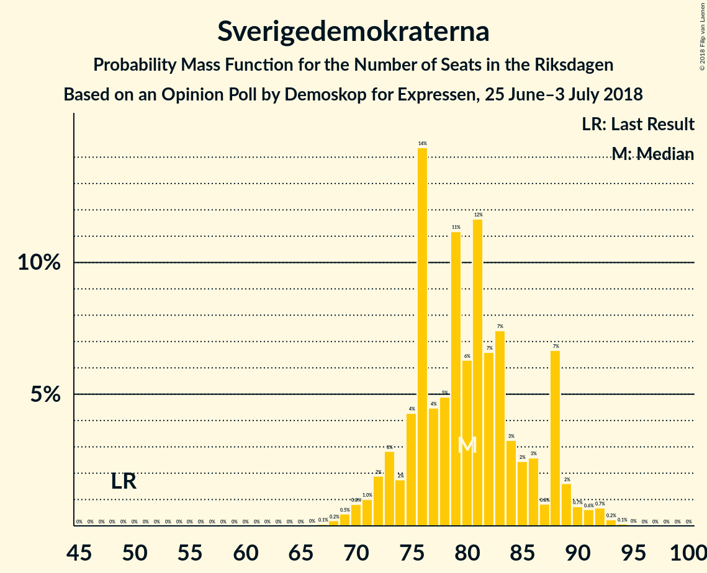
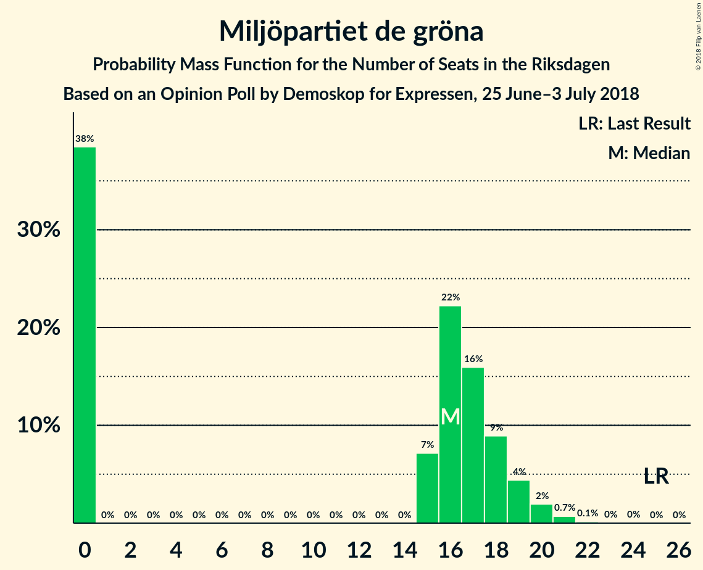

# Opinion Poll by Demoskop for Expressen, 25 June–3 July 2018

<a href="#voting-intentions">Voting Intentions</a> | <a href="#seats">Seats</a> | <a href="#coalitions">Coalitions</a> | <a href="#technical-information">Technical Information</a>

## Voting Intentions

### Confidence Intervals

| Party | Last Result | Poll Result | 80% Confidence Interval | 90% Confidence Interval | 95% Confidence Interval | 99% Confidence Interval |
|:-----:|:-----------:|:-----------:|:-----------------------:|:-----------------------:|:-----------------------:|:-----------------------:|
| Sveriges socialdemokratiska arbetareparti | 31.0% | 25.9% | 24.5–27.3% |24.1–27.7% |23.8–28.1% |23.2–28.8% |
| Sverigedemokraterna | 12.9% | 21.0% | 19.7–22.3% |19.4–22.7% |19.1–23.1% |18.5–23.7% |
| Moderata samlingspartiet | 23.3% | 19.9% | 18.6–21.2% |18.3–21.6% |18.0–21.9% |17.4–22.5% |
| Centerpartiet | 6.1% | 9.8% | 8.9–10.8% |8.6–11.1% |8.4–11.3% |8.0–11.8% |
| Vänsterpartiet | 5.7% | 9.1% | 8.2–10.1% |8.0–10.4% |7.8–10.6% |7.4–11.1% |
| Liberalerna | 5.4% | 4.3% | 3.7–5.0% |3.5–5.2% |3.4–5.4% |3.1–5.7% |
| Miljöpartiet de gröna | 6.9% | 4.2% | 3.6–4.9% |3.5–5.1% |3.3–5.3% |3.1–5.7% |
| Kristdemokraterna | 4.6% | 2.5% | 2.0–3.0% |1.9–3.2% |1.8–3.4% |1.6–3.7% |
| Feministiskt initiativ | 3.1% | 1.9% | 1.5–2.4% |1.4–2.6% |1.4–2.7% |1.2–3.0% |

*Note:* The poll result column reflects the actual value used in the calculations. Published results may vary slightly, and in addition be rounded to fewer digits.

## Seats

### Confidence Intervals

| Party | Last Result | Median | 80% Confidence Interval | 90% Confidence Interval | 95% Confidence Interval | 99% Confidence Interval |
|:-----:|:-----------:|:------:|:-----------------------:|:-----------------------:|:-----------------------:|:-----------------------:|
| <a href="#sveriges-socialdemokratiska-arbetareparti">Sveriges socialdemokratiska arbetareparti</a> | 113 | 99 | 92–107 |91–109 |89–109 |86–112 |
| <a href="#sverigedemokraterna">Sverigedemokraterna</a> | 49 | 80 | 75–88 |73–88 |71–89 |69–92 |
| <a href="#moderata-samlingspartiet">Moderata samlingspartiet</a> | 84 | 75 | 69–80 |68–83 |67–84 |65–87 |
| <a href="#centerpartiet">Centerpartiet</a> | 22 | 37 | 33–41 |32–42 |32–43 |30–45 |
| <a href="#vänsterpartiet">Vänsterpartiet</a> | 21 | 35 | 31–39 |30–41 |29–41 |28–44 |
| <a href="#liberalerna">Liberalerna</a> | 19 | 16 | 0–19 |0–19 |0–20 |0–22 |
| <a href="#miljöpartiet-de-gröna">Miljöpartiet de gröna</a> | 25 | 16 | 0–18 |0–19 |0–20 |0–21 |
| <a href="#kristdemokraterna">Kristdemokraterna</a> | 16 | 0 | 0 |0 |0 |0 |
| <a href="#feministiskt-initiativ">Feministiskt initiativ</a> | 0 | 0 | 0 |0 |0 |0 |

### Sveriges socialdemokratiska arbetareparti

*For a full overview of the results for this party, see the [Sveriges socialdemokratiska arbetareparti](party-sverigessocialdemokratiskaarbetareparti.html) page.*

| Number of Seats | Probability | Accumulated | Special Marks |
|:---------------:|:-----------:|:-----------:|:-------------:|
| 83 | 0% | 100% |  |
| 84 | 0.1% | 99.9% |  |
| 85 | 0.1% | 99.9% |  |
| 86 | 0.8% | 99.8% |  |
| 87 | 0.6% | 99.0% |  |
| 88 | 0.3% | 98% |  |
| 89 | 1.4% | 98% |  |
| 90 | 2% | 97% |  |
| 91 | 5% | 95% |  |
| 92 | 3% | 90% |  |
| 93 | 2% | 87% |  |
| 94 | 2% | 85% |  |
| 95 | 14% | 83% |  |
| 96 | 5% | 69% |  |
| 97 | 4% | 64% |  |
| 98 | 8% | 60% |  |
| 99 | 4% | 53% | Median |
| 100 | 10% | 48% |  |
| 101 | 8% | 39% |  |
| 102 | 4% | 31% |  |
| 103 | 8% | 27% |  |
| 104 | 6% | 19% |  |
| 105 | 1.3% | 13% |  |
| 106 | 2% | 12% |  |
| 107 | 2% | 10% |  |
| 108 | 1.2% | 9% |  |
| 109 | 6% | 8% |  |
| 110 | 0.6% | 2% |  |
| 111 | 0.2% | 1.1% |  |
| 112 | 0.6% | 0.9% |  |
| 113 | 0.1% | 0.3% | Last Result |
| 114 | 0% | 0.2% |  |
| 115 | 0.1% | 0.2% |  |
| 116 | 0% | 0.1% |  |
| 117 | 0% | 0.1% |  |
| 118 | 0% | 0.1% |  |
| 119 | 0% | 0% |  |

### Sverigedemokraterna

*For a full overview of the results for this party, see the [Sverigedemokraterna](party-sverigedemokraterna.html) page.*

| Number of Seats | Probability | Accumulated | Special Marks |
|:---------------:|:-----------:|:-----------:|:-------------:|
| 49 | 0% | 100% | Last Result |
| 50 | 0% | 100% |  |
| 51 | 0% | 100% |  |
| 52 | 0% | 100% |  |
| 53 | 0% | 100% |  |
| 54 | 0% | 100% |  |
| 55 | 0% | 100% |  |
| 56 | 0% | 100% |  |
| 57 | 0% | 100% |  |
| 58 | 0% | 100% |  |
| 59 | 0% | 100% |  |
| 60 | 0% | 100% |  |
| 61 | 0% | 100% |  |
| 62 | 0% | 100% |  |
| 63 | 0% | 100% |  |
| 64 | 0% | 100% |  |
| 65 | 0% | 100% |  |
| 66 | 0% | 100% |  |
| 67 | 0.1% | 100% |  |
| 68 | 0.2% | 99.9% |  |
| 69 | 0.5% | 99.7% |  |
| 70 | 0.8% | 99.2% |  |
| 71 | 1.0% | 98% |  |
| 72 | 2% | 97% |  |
| 73 | 3% | 96% |  |
| 74 | 2% | 93% |  |
| 75 | 4% | 91% |  |
| 76 | 14% | 87% |  |
| 77 | 4% | 72% |  |
| 78 | 5% | 68% |  |
| 79 | 11% | 63% |  |
| 80 | 6% | 52% | Median |
| 81 | 12% | 45% |  |
| 82 | 7% | 34% |  |
| 83 | 7% | 27% |  |
| 84 | 3% | 20% |  |
| 85 | 2% | 17% |  |
| 86 | 3% | 14% |  |
| 87 | 0.8% | 12% |  |
| 88 | 7% | 11% |  |
| 89 | 2% | 4% |  |
| 90 | 0.7% | 2% |  |
| 91 | 0.6% | 2% |  |
| 92 | 0.7% | 1.1% |  |
| 93 | 0.2% | 0.4% |  |
| 94 | 0.1% | 0.1% |  |
| 95 | 0% | 0.1% |  |
| 96 | 0% | 0% |  |

### Moderata samlingspartiet

*For a full overview of the results for this party, see the [Moderata samlingspartiet](party-moderatasamlingspartiet.html) page.*

| Number of Seats | Probability | Accumulated | Special Marks |
|:---------------:|:-----------:|:-----------:|:-------------:|
| 63 | 0% | 100% |  |
| 64 | 0.1% | 99.9% |  |
| 65 | 0.4% | 99.8% |  |
| 66 | 1.1% | 99.4% |  |
| 67 | 1.4% | 98% |  |
| 68 | 2% | 97% |  |
| 69 | 6% | 94% |  |
| 70 | 2% | 88% |  |
| 71 | 5% | 87% |  |
| 72 | 8% | 82% |  |
| 73 | 11% | 74% |  |
| 74 | 8% | 63% |  |
| 75 | 6% | 55% | Median |
| 76 | 6% | 49% |  |
| 77 | 10% | 43% |  |
| 78 | 4% | 33% |  |
| 79 | 15% | 28% |  |
| 80 | 4% | 13% |  |
| 81 | 1.4% | 10% |  |
| 82 | 3% | 8% |  |
| 83 | 2% | 5% |  |
| 84 | 2% | 3% | Last Result |
| 85 | 0.5% | 2% |  |
| 86 | 0.5% | 1.1% |  |
| 87 | 0.3% | 0.5% |  |
| 88 | 0.1% | 0.3% |  |
| 89 | 0.1% | 0.2% |  |
| 90 | 0% | 0.1% |  |
| 91 | 0% | 0% |  |

### Centerpartiet

*For a full overview of the results for this party, see the [Centerpartiet](party-centerpartiet.html) page.*

| Number of Seats | Probability | Accumulated | Special Marks |
|:---------------:|:-----------:|:-----------:|:-------------:|
| 22 | 0% | 100% | Last Result |
| 23 | 0% | 100% |  |
| 24 | 0% | 100% |  |
| 25 | 0% | 100% |  |
| 26 | 0% | 100% |  |
| 27 | 0% | 100% |  |
| 28 | 0.1% | 100% |  |
| 29 | 0.1% | 99.9% |  |
| 30 | 0.4% | 99.7% |  |
| 31 | 2% | 99.3% |  |
| 32 | 3% | 98% |  |
| 33 | 4% | 94% |  |
| 34 | 6% | 90% |  |
| 35 | 11% | 84% |  |
| 36 | 7% | 73% |  |
| 37 | 19% | 67% | Median |
| 38 | 10% | 48% |  |
| 39 | 12% | 38% |  |
| 40 | 13% | 26% |  |
| 41 | 7% | 13% |  |
| 42 | 3% | 7% |  |
| 43 | 1.4% | 4% |  |
| 44 | 1.1% | 2% |  |
| 45 | 0.9% | 1.3% |  |
| 46 | 0.3% | 0.5% |  |
| 47 | 0.1% | 0.2% |  |
| 48 | 0% | 0.1% |  |
| 49 | 0% | 0% |  |

### Vänsterpartiet

*For a full overview of the results for this party, see the [Vänsterpartiet](party-vänsterpartiet.html) page.*

| Number of Seats | Probability | Accumulated | Special Marks |
|:---------------:|:-----------:|:-----------:|:-------------:|
| 21 | 0% | 100% | Last Result |
| 22 | 0% | 100% |  |
| 23 | 0% | 100% |  |
| 24 | 0% | 100% |  |
| 25 | 0% | 100% |  |
| 26 | 0.1% | 100% |  |
| 27 | 0.2% | 99.9% |  |
| 28 | 2% | 99.7% |  |
| 29 | 2% | 98% |  |
| 30 | 3% | 96% |  |
| 31 | 3% | 93% |  |
| 32 | 12% | 90% |  |
| 33 | 10% | 78% |  |
| 34 | 12% | 68% |  |
| 35 | 15% | 56% | Median |
| 36 | 15% | 41% |  |
| 37 | 10% | 26% |  |
| 38 | 6% | 16% |  |
| 39 | 2% | 10% |  |
| 40 | 3% | 8% |  |
| 41 | 4% | 5% |  |
| 42 | 0.5% | 1.4% |  |
| 43 | 0.4% | 0.9% |  |
| 44 | 0.4% | 0.5% |  |
| 45 | 0.1% | 0.1% |  |
| 46 | 0% | 0% |  |

### Liberalerna

*For a full overview of the results for this party, see the [Liberalerna](party-liberalerna.html) page.*

| Number of Seats | Probability | Accumulated | Special Marks |
|:---------------:|:-----------:|:-----------:|:-------------:|
| 0 | 30% | 100% |  |
| 1 | 0% | 70% |  |
| 2 | 0% | 70% |  |
| 3 | 0% | 70% |  |
| 4 | 0% | 70% |  |
| 5 | 0% | 70% |  |
| 6 | 0% | 70% |  |
| 7 | 0% | 70% |  |
| 8 | 0% | 70% |  |
| 9 | 0% | 70% |  |
| 10 | 0% | 70% |  |
| 11 | 0% | 70% |  |
| 12 | 0% | 70% |  |
| 13 | 0% | 70% |  |
| 14 | 0% | 70% |  |
| 15 | 5% | 70% |  |
| 16 | 20% | 64% | Median |
| 17 | 24% | 45% |  |
| 18 | 11% | 21% |  |
| 19 | 6% | 11% | Last Result |
| 20 | 3% | 5% |  |
| 21 | 1.1% | 2% |  |
| 22 | 0.6% | 0.7% |  |
| 23 | 0.1% | 0.1% |  |
| 24 | 0% | 0% |  |

### Miljöpartiet de gröna

*For a full overview of the results for this party, see the [Miljöpartiet de gröna](party-miljöpartietdegröna.html) page.*

| Number of Seats | Probability | Accumulated | Special Marks |
|:---------------:|:-----------:|:-----------:|:-------------:|
| 0 | 38% | 100% |  |
| 1 | 0% | 62% |  |
| 2 | 0% | 62% |  |
| 3 | 0% | 62% |  |
| 4 | 0% | 62% |  |
| 5 | 0% | 62% |  |
| 6 | 0% | 62% |  |
| 7 | 0% | 62% |  |
| 8 | 0% | 62% |  |
| 9 | 0% | 62% |  |
| 10 | 0% | 62% |  |
| 11 | 0% | 62% |  |
| 12 | 0% | 62% |  |
| 13 | 0% | 62% |  |
| 14 | 0% | 62% |  |
| 15 | 7% | 62% |  |
| 16 | 22% | 54% | Median |
| 17 | 16% | 32% |  |
| 18 | 9% | 16% |  |
| 19 | 4% | 7% |  |
| 20 | 2% | 3% |  |
| 21 | 0.7% | 0.9% |  |
| 22 | 0.1% | 0.2% |  |
| 23 | 0% | 0.1% |  |
| 24 | 0% | 0% |  |
| 25 | 0% | 0% | Last Result |

### Kristdemokraterna

*For a full overview of the results for this party, see the [Kristdemokraterna](party-kristdemokraterna.html) page.*

| Number of Seats | Probability | Accumulated | Special Marks |
|:---------------:|:-----------:|:-----------:|:-------------:|
| 0 | 100% | 100% | Median |
| 1 | 0% | 0% |  |
| 2 | 0% | 0% |  |
| 3 | 0% | 0% |  |
| 4 | 0% | 0% |  |
| 5 | 0% | 0% |  |
| 6 | 0% | 0% |  |
| 7 | 0% | 0% |  |
| 8 | 0% | 0% |  |
| 9 | 0% | 0% |  |
| 10 | 0% | 0% |  |
| 11 | 0% | 0% |  |
| 12 | 0% | 0% |  |
| 13 | 0% | 0% |  |
| 14 | 0% | 0% |  |
| 15 | 0% | 0% |  |
| 16 | 0% | 0% | Last Result |

### Feministiskt initiativ

*For a full overview of the results for this party, see the [Feministiskt initiativ](party-feministisktinitiativ.html) page.*

| Number of Seats | Probability | Accumulated | Special Marks |
|:---------------:|:-----------:|:-----------:|:-------------:|
| 0 | 100% | 100% | Last Result, Median |

## Coalitions

### Confidence Intervals

| Coalition | Last Result | Median | Majority? | 80% Confidence Interval | 90% Confidence Interval | 95% Confidence Interval | 99% Confidence Interval |
|:---------:|:-----------:|:------:|:---------:|:-----------------------:|:-----------------------:|:-----------------------:|:-----------------------:|
| Sveriges socialdemokratiska arbetareparti – Moderata samlingspartiet | 197 | 175 | 50% | 164–186 | 162–188 | 160–188 | 158–193 |
| Sverigedemokraterna – Moderata samlingspartiet | 133 | 155 | 0.4% | 147–167 | 145–167 | 142–170 | 140–172 |
| Sveriges socialdemokratiska arbetareparti – Vänsterpartiet – Miljöpartiet de gröna – Feministiskt initiativ | 159 | 145 | 0% | 135–155 | 132–158 | 131–158 | 127–162 |
| Sveriges socialdemokratiska arbetareparti – Vänsterpartiet – Miljöpartiet de gröna | 159 | 145 | 0% | 135–155 | 132–158 | 131–158 | 127–162 |
| Sveriges socialdemokratiska arbetareparti – Vänsterpartiet | 134 | 135 | 0% | 126–142 | 124–145 | 122–145 | 119–149 |
| Moderata samlingspartiet – Centerpartiet – Liberalerna – Kristdemokraterna | 141 | 126 | 0% | 114–135 | 110–136 | 110–137 | 107–140 |
| Moderata samlingspartiet – Centerpartiet – Liberalerna | 125 | 126 | 0% | 114–135 | 110–136 | 110–137 | 107–140 |
| Moderata samlingspartiet – Centerpartiet – Kristdemokraterna | 122 | 113 | 0% | 106–119 | 103–121 | 103–123 | 101–126 |
| Moderata samlingspartiet – Centerpartiet | 106 | 113 | 0% | 106–119 | 103–121 | 103–123 | 101–126 |
| Sveriges socialdemokratiska arbetareparti – Miljöpartiet de gröna | 138 | 110 | 0% | 100–118 | 96–121 | 95–123 | 92–127 |

