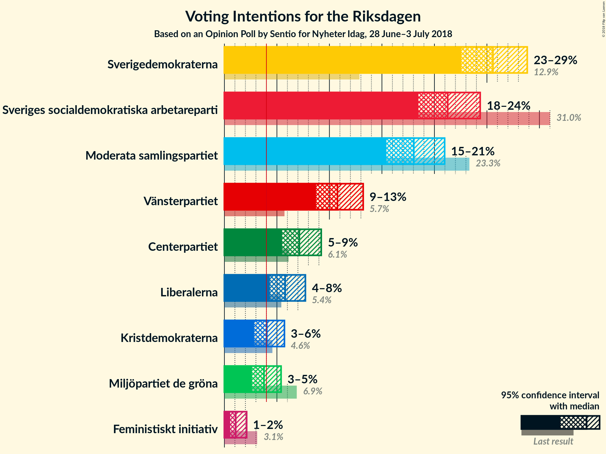
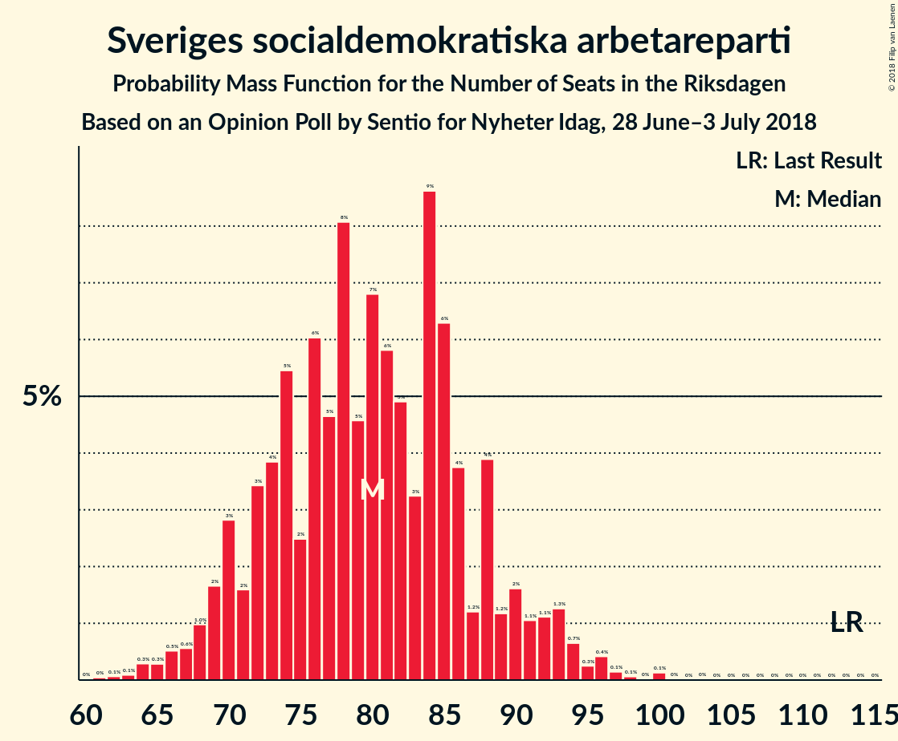
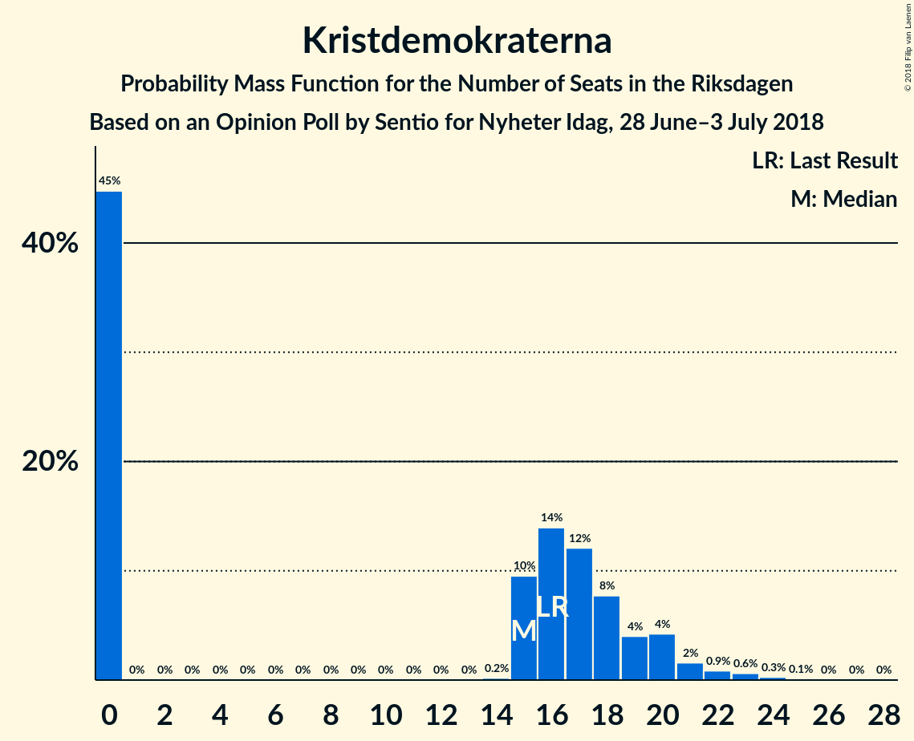

# Opinion Poll by Sentio for Nyheter Idag, 28 June–3 July 2018

<a href="#voting-intentions">Voting Intentions</a> | <a href="#seats">Seats</a> | <a href="#coalitions">Coalitions</a> | <a href="#technical-information">Technical Information</a>

## Voting Intentions

### Confidence Intervals

| Party | Last Result | Poll Result | 80% Confidence Interval | 90% Confidence Interval | 95% Confidence Interval | 99% Confidence Interval |
|:-----:|:-----------:|:-----------:|:-----------------------:|:-----------------------:|:-----------------------:|:-----------------------:|
| Sverigedemokraterna | 12.9% | 25.6% | 23.6–27.7% |23.0–28.3% |22.6–28.8% |21.6–29.9% |
| Sveriges socialdemokratiska arbetareparti | 31.0% | 21.3% | 19.4–23.3% |18.9–23.9% |18.5–24.4% |17.6–25.3% |
| Moderata samlingspartiet | 23.3% | 18.0% | 16.3–20.0% |15.8–20.5% |15.4–21.0% |14.6–21.9% |
| Vänsterpartiet | 5.7% | 10.8% | 9.4–12.4% |9.1–12.8% |8.7–13.2% |8.1–14.0% |
| Centerpartiet | 6.1% | 7.1% | 6.1–8.5% |5.7–8.9% |5.5–9.2% |5.0–9.9% |
| Liberalerna | 5.4% | 5.8% | 4.8–7.0% |4.5–7.4% |4.3–7.7% |3.9–8.4% |
| Kristdemokraterna | 4.6% | 4.0% | 3.2–5.1% |3.0–5.4% |2.8–5.7% |2.5–6.3% |
| Miljöpartiet de gröna | 6.9% | 3.8% | 3.0–4.8% |2.8–5.1% |2.6–5.4% |2.3–6.0% |
| Feministiskt initiativ | 3.1% | 1.1% | 0.7–1.8% |0.6–1.9% |0.5–2.1% |0.4–2.5% |

*Note:* The poll result column reflects the actual value used in the calculations. Published results may vary slightly, and in addition be rounded to fewer digits.

## Seats

### Confidence Intervals

| Party | Last Result | Median | 80% Confidence Interval | 90% Confidence Interval | 95% Confidence Interval | 99% Confidence Interval |
|:-----:|:-----------:|:------:|:-----------------------:|:-----------------------:|:-----------------------:|:-----------------------:|
| <a href="#sverigedemokraterna">Sverigedemokraterna</a> | 49 | 97 | 87–104 |86–106 |83–109 |78–114 |
| <a href="#sveriges-socialdemokratiska-arbetareparti">Sveriges socialdemokratiska arbetareparti</a> | 113 | 80 | 71–88 |69–91 |68–93 |64–96 |
| <a href="#moderata-samlingspartiet">Moderata samlingspartiet</a> | 84 | 67 | 59–75 |58–77 |56–79 |54–84 |
| <a href="#vänsterpartiet">Vänsterpartiet</a> | 21 | 40 | 34–46 |33–49 |32–50 |30–53 |
| <a href="#centerpartiet">Centerpartiet</a> | 22 | 27 | 22–32 |21–33 |20–35 |18–37 |
| <a href="#liberalerna">Liberalerna</a> | 19 | 22 | 18–27 |17–28 |16–29 |0–31 |
| <a href="#kristdemokraterna">Kristdemokraterna</a> | 16 | 15 | 0–19 |0–20 |0–21 |0–23 |
| <a href="#miljöpartiet-de-gröna">Miljöpartiet de gröna</a> | 25 | 0 | 0–18 |0–19 |0–20 |0–22 |
| <a href="#feministiskt-initiativ">Feministiskt initiativ</a> | 0 | 0 | 0 |0 |0 |0 |

### Sverigedemokraterna

*For a full overview of the results for this party, see the [Sverigedemokraterna](party-sverigedemokraterna.html) page.*

| Number of Seats | Probability | Accumulated | Special Marks |
|:---------------:|:-----------:|:-----------:|:-------------:|
| 49 | 0% | 100% | Last Result |
| 50 | 0% | 100% |  |
| 51 | 0% | 100% |  |
| 52 | 0% | 100% |  |
| 53 | 0% | 100% |  |
| 54 | 0% | 100% |  |
| 55 | 0% | 100% |  |
| 56 | 0% | 100% |  |
| 57 | 0% | 100% |  |
| 58 | 0% | 100% |  |
| 59 | 0% | 100% |  |
| 60 | 0% | 100% |  |
| 61 | 0% | 100% |  |
| 62 | 0% | 100% |  |
| 63 | 0% | 100% |  |
| 64 | 0% | 100% |  |
| 65 | 0% | 100% |  |
| 66 | 0% | 100% |  |
| 67 | 0% | 100% |  |
| 68 | 0% | 100% |  |
| 69 | 0% | 100% |  |
| 70 | 0% | 100% |  |
| 71 | 0% | 100% |  |
| 72 | 0% | 100% |  |
| 73 | 0% | 100% |  |
| 74 | 0% | 100% |  |
| 75 | 0.1% | 100% |  |
| 76 | 0.1% | 99.9% |  |
| 77 | 0.2% | 99.8% |  |
| 78 | 0.2% | 99.6% |  |
| 79 | 0.2% | 99.5% |  |
| 80 | 0.3% | 99.3% |  |
| 81 | 0.3% | 98.9% |  |
| 82 | 0.5% | 98.7% |  |
| 83 | 0.8% | 98% |  |
| 84 | 0.6% | 97% |  |
| 85 | 2% | 97% |  |
| 86 | 2% | 95% |  |
| 87 | 4% | 94% |  |
| 88 | 3% | 89% |  |
| 89 | 5% | 86% |  |
| 90 | 5% | 81% |  |
| 91 | 6% | 76% |  |
| 92 | 5% | 70% |  |
| 93 | 5% | 65% |  |
| 94 | 3% | 60% |  |
| 95 | 3% | 57% |  |
| 96 | 2% | 54% |  |
| 97 | 8% | 52% | Median |
| 98 | 7% | 44% |  |
| 99 | 4% | 37% |  |
| 100 | 4% | 33% |  |
| 101 | 7% | 29% |  |
| 102 | 5% | 22% |  |
| 103 | 5% | 17% |  |
| 104 | 2% | 12% |  |
| 105 | 4% | 10% |  |
| 106 | 2% | 6% |  |
| 107 | 0.9% | 4% |  |
| 108 | 0.8% | 3% |  |
| 109 | 0.5% | 3% |  |
| 110 | 0.5% | 2% |  |
| 111 | 0.3% | 2% |  |
| 112 | 0.2% | 1.3% |  |
| 113 | 0.2% | 1.1% |  |
| 114 | 0.5% | 0.9% |  |
| 115 | 0% | 0.4% |  |
| 116 | 0.2% | 0.4% |  |
| 117 | 0.1% | 0.2% |  |
| 118 | 0% | 0.1% |  |
| 119 | 0% | 0% |  |

### Sveriges socialdemokratiska arbetareparti

*For a full overview of the results for this party, see the [Sveriges socialdemokratiska arbetareparti](party-sverigessocialdemokratiskaarbetareparti.html) page.*

| Number of Seats | Probability | Accumulated | Special Marks |
|:---------------:|:-----------:|:-----------:|:-------------:|
| 61 | 0.1% | 100% |  |
| 62 | 0.1% | 99.9% |  |
| 63 | 0.1% | 99.8% |  |
| 64 | 0.4% | 99.7% |  |
| 65 | 0.4% | 99.4% |  |
| 66 | 0.3% | 99.0% |  |
| 67 | 0.8% | 98.7% |  |
| 68 | 1.2% | 98% |  |
| 69 | 2% | 97% |  |
| 70 | 3% | 95% |  |
| 71 | 2% | 92% |  |
| 72 | 3% | 90% |  |
| 73 | 4% | 87% |  |
| 74 | 4% | 83% |  |
| 75 | 2% | 78% |  |
| 76 | 4% | 76% |  |
| 77 | 5% | 72% |  |
| 78 | 10% | 66% |  |
| 79 | 4% | 56% |  |
| 80 | 5% | 52% | Median |
| 81 | 7% | 47% |  |
| 82 | 7% | 40% |  |
| 83 | 3% | 33% |  |
| 84 | 7% | 30% |  |
| 85 | 5% | 23% |  |
| 86 | 5% | 18% |  |
| 87 | 0.9% | 12% |  |
| 88 | 2% | 11% |  |
| 89 | 0.9% | 9% |  |
| 90 | 2% | 8% |  |
| 91 | 2% | 6% |  |
| 92 | 0.7% | 5% |  |
| 93 | 2% | 4% |  |
| 94 | 0.9% | 2% |  |
| 95 | 0.4% | 1.2% |  |
| 96 | 0.3% | 0.8% |  |
| 97 | 0.2% | 0.5% |  |
| 98 | 0.1% | 0.2% |  |
| 99 | 0% | 0.2% |  |
| 100 | 0.1% | 0.1% |  |
| 101 | 0% | 0.1% |  |
| 102 | 0% | 0% |  |
| 103 | 0% | 0% |  |
| 104 | 0% | 0% |  |
| 105 | 0% | 0% |  |
| 106 | 0% | 0% |  |
| 107 | 0% | 0% |  |
| 108 | 0% | 0% |  |
| 109 | 0% | 0% |  |
| 110 | 0% | 0% |  |
| 111 | 0% | 0% |  |
| 112 | 0% | 0% |  |
| 113 | 0% | 0% | Last Result |

### Moderata samlingspartiet

*For a full overview of the results for this party, see the [Moderata samlingspartiet](party-moderatasamlingspartiet.html) page.*

| Number of Seats | Probability | Accumulated | Special Marks |
|:---------------:|:-----------:|:-----------:|:-------------:|
| 49 | 0% | 100% |  |
| 50 | 0% | 99.9% |  |
| 51 | 0.1% | 99.9% |  |
| 52 | 0.2% | 99.9% |  |
| 53 | 0.2% | 99.7% |  |
| 54 | 0.2% | 99.5% |  |
| 55 | 0.3% | 99.3% |  |
| 56 | 2% | 99.0% |  |
| 57 | 1.1% | 97% |  |
| 58 | 3% | 96% |  |
| 59 | 4% | 94% |  |
| 60 | 2% | 89% |  |
| 61 | 3% | 87% |  |
| 62 | 4% | 84% |  |
| 63 | 5% | 80% |  |
| 64 | 5% | 75% |  |
| 65 | 10% | 69% |  |
| 66 | 5% | 60% |  |
| 67 | 6% | 54% | Median |
| 68 | 6% | 48% |  |
| 69 | 4% | 42% |  |
| 70 | 4% | 38% |  |
| 71 | 7% | 34% |  |
| 72 | 6% | 27% |  |
| 73 | 4% | 21% |  |
| 74 | 3% | 17% |  |
| 75 | 6% | 13% |  |
| 76 | 2% | 7% |  |
| 77 | 1.4% | 6% |  |
| 78 | 0.7% | 4% |  |
| 79 | 1.3% | 3% |  |
| 80 | 0.4% | 2% |  |
| 81 | 0.2% | 2% |  |
| 82 | 0.9% | 2% |  |
| 83 | 0.1% | 0.7% |  |
| 84 | 0.3% | 0.6% | Last Result |
| 85 | 0.1% | 0.3% |  |
| 86 | 0.1% | 0.2% |  |
| 87 | 0.1% | 0.1% |  |
| 88 | 0% | 0.1% |  |
| 89 | 0% | 0.1% |  |
| 90 | 0% | 0% |  |

### Vänsterpartiet

*For a full overview of the results for this party, see the [Vänsterpartiet](party-vänsterpartiet.html) page.*

| Number of Seats | Probability | Accumulated | Special Marks |
|:---------------:|:-----------:|:-----------:|:-------------:|
| 21 | 0% | 100% | Last Result |
| 22 | 0% | 100% |  |
| 23 | 0% | 100% |  |
| 24 | 0% | 100% |  |
| 25 | 0% | 100% |  |
| 26 | 0% | 100% |  |
| 27 | 0% | 100% |  |
| 28 | 0.1% | 99.9% |  |
| 29 | 0.3% | 99.9% |  |
| 30 | 0.3% | 99.6% |  |
| 31 | 0.6% | 99.2% |  |
| 32 | 1.5% | 98.7% |  |
| 33 | 4% | 97% |  |
| 34 | 4% | 93% |  |
| 35 | 4% | 90% |  |
| 36 | 3% | 86% |  |
| 37 | 6% | 83% |  |
| 38 | 6% | 77% |  |
| 39 | 13% | 71% |  |
| 40 | 11% | 58% | Median |
| 41 | 7% | 46% |  |
| 42 | 4% | 39% |  |
| 43 | 6% | 35% |  |
| 44 | 10% | 29% |  |
| 45 | 7% | 19% |  |
| 46 | 3% | 12% |  |
| 47 | 2% | 9% |  |
| 48 | 1.0% | 7% |  |
| 49 | 2% | 6% |  |
| 50 | 2% | 4% |  |
| 51 | 0.9% | 2% |  |
| 52 | 0.4% | 0.9% |  |
| 53 | 0.2% | 0.6% |  |
| 54 | 0.3% | 0.4% |  |
| 55 | 0.1% | 0.2% |  |
| 56 | 0% | 0.1% |  |
| 57 | 0% | 0.1% |  |
| 58 | 0% | 0% |  |

### Centerpartiet

*For a full overview of the results for this party, see the [Centerpartiet](party-centerpartiet.html) page.*

| Number of Seats | Probability | Accumulated | Special Marks |
|:---------------:|:-----------:|:-----------:|:-------------:|
| 16 | 0.1% | 100% |  |
| 17 | 0.1% | 99.9% |  |
| 18 | 0.4% | 99.8% |  |
| 19 | 0.8% | 99.4% |  |
| 20 | 2% | 98.6% |  |
| 21 | 2% | 97% |  |
| 22 | 6% | 95% | Last Result |
| 23 | 8% | 89% |  |
| 24 | 7% | 81% |  |
| 25 | 8% | 74% |  |
| 26 | 13% | 66% |  |
| 27 | 6% | 53% | Median |
| 28 | 11% | 47% |  |
| 29 | 9% | 36% |  |
| 30 | 9% | 27% |  |
| 31 | 6% | 18% |  |
| 32 | 3% | 12% |  |
| 33 | 5% | 9% |  |
| 34 | 1.1% | 5% |  |
| 35 | 1.5% | 3% |  |
| 36 | 1.0% | 2% |  |
| 37 | 0.6% | 1.0% |  |
| 38 | 0.2% | 0.4% |  |
| 39 | 0.1% | 0.2% |  |
| 40 | 0.1% | 0.1% |  |
| 41 | 0% | 0.1% |  |
| 42 | 0% | 0% |  |

### Liberalerna

*For a full overview of the results for this party, see the [Liberalerna](party-liberalerna.html) page.*

| Number of Seats | Probability | Accumulated | Special Marks |
|:---------------:|:-----------:|:-----------:|:-------------:|
| 0 | 1.1% | 100% |  |
| 1 | 0% | 98.9% |  |
| 2 | 0% | 98.9% |  |
| 3 | 0% | 98.9% |  |
| 4 | 0% | 98.9% |  |
| 5 | 0% | 98.9% |  |
| 6 | 0% | 98.9% |  |
| 7 | 0% | 98.9% |  |
| 8 | 0% | 98.9% |  |
| 9 | 0% | 98.9% |  |
| 10 | 0% | 98.9% |  |
| 11 | 0% | 98.9% |  |
| 12 | 0% | 98.9% |  |
| 13 | 0% | 98.9% |  |
| 14 | 0% | 98.9% |  |
| 15 | 0.5% | 98.9% |  |
| 16 | 1.1% | 98% |  |
| 17 | 6% | 97% |  |
| 18 | 8% | 91% |  |
| 19 | 7% | 83% | Last Result |
| 20 | 10% | 76% |  |
| 21 | 15% | 66% |  |
| 22 | 7% | 51% | Median |
| 23 | 10% | 44% |  |
| 24 | 12% | 34% |  |
| 25 | 6% | 22% |  |
| 26 | 3% | 16% |  |
| 27 | 5% | 13% |  |
| 28 | 4% | 8% |  |
| 29 | 2% | 4% |  |
| 30 | 1.1% | 2% |  |
| 31 | 0.8% | 1.2% |  |
| 32 | 0.1% | 0.5% |  |
| 33 | 0.2% | 0.3% |  |
| 34 | 0.1% | 0.1% |  |
| 35 | 0% | 0.1% |  |
| 36 | 0% | 0% |  |

### Kristdemokraterna

*For a full overview of the results for this party, see the [Kristdemokraterna](party-kristdemokraterna.html) page.*

| Number of Seats | Probability | Accumulated | Special Marks |
|:---------------:|:-----------:|:-----------:|:-------------:|
| 0 | 48% | 100% |  |
| 1 | 0% | 52% |  |
| 2 | 0% | 52% |  |
| 3 | 0% | 52% |  |
| 4 | 0% | 52% |  |
| 5 | 0% | 52% |  |
| 6 | 0% | 52% |  |
| 7 | 0% | 52% |  |
| 8 | 0% | 52% |  |
| 9 | 0% | 52% |  |
| 10 | 0% | 52% |  |
| 11 | 0% | 52% |  |
| 12 | 0% | 52% |  |
| 13 | 0% | 52% |  |
| 14 | 0.1% | 52% |  |
| 15 | 10% | 52% | Median |
| 16 | 12% | 42% | Last Result |
| 17 | 11% | 29% |  |
| 18 | 7% | 19% |  |
| 19 | 4% | 12% |  |
| 20 | 4% | 9% |  |
| 21 | 2% | 4% |  |
| 22 | 1.2% | 2% |  |
| 23 | 0.6% | 0.9% |  |
| 24 | 0.2% | 0.3% |  |
| 25 | 0% | 0.1% |  |
| 26 | 0% | 0.1% |  |
| 27 | 0% | 0% |  |

### Miljöpartiet de gröna

*For a full overview of the results for this party, see the [Miljöpartiet de gröna](party-miljöpartietdegröna.html) page.*

| Number of Seats | Probability | Accumulated | Special Marks |
|:---------------:|:-----------:|:-----------:|:-------------:|
| 0 | 61% | 100% | Median |
| 1 | 0% | 39% |  |
| 2 | 0% | 39% |  |
| 3 | 0% | 39% |  |
| 4 | 0% | 39% |  |
| 5 | 0% | 39% |  |
| 6 | 0% | 39% |  |
| 7 | 0% | 39% |  |
| 8 | 0% | 39% |  |
| 9 | 0% | 39% |  |
| 10 | 0% | 39% |  |
| 11 | 0% | 39% |  |
| 12 | 0% | 39% |  |
| 13 | 0% | 39% |  |
| 14 | 0.3% | 39% |  |
| 15 | 7% | 39% |  |
| 16 | 13% | 31% |  |
| 17 | 5% | 18% |  |
| 18 | 5% | 13% |  |
| 19 | 5% | 8% |  |
| 20 | 1.5% | 3% |  |
| 21 | 1.0% | 2% |  |
| 22 | 0.3% | 0.7% |  |
| 23 | 0.2% | 0.4% |  |
| 24 | 0.1% | 0.2% |  |
| 25 | 0% | 0% | Last Result |

### Feministiskt initiativ

*For a full overview of the results for this party, see the [Feministiskt initiativ](party-feministisktinitiativ.html) page.*

| Number of Seats | Probability | Accumulated | Special Marks |
|:---------------:|:-----------:|:-----------:|:-------------:|
| 0 | 100% | 100% | Last Result, Median |

## Coalitions

### Confidence Intervals

| Coalition | Last Result | Median | Majority? | 80% Confidence Interval | 90% Confidence Interval | 95% Confidence Interval | 99% Confidence Interval |
|:---------:|:-----------:|:------:|:---------:|:-----------------------:|:-----------------------:|:-----------------------:|:-----------------------:|
| Sverigedemokraterna – Moderata samlingspartiet | 133 | 163 | 12% | 153–176 | 150–180 | 148–180 | 142–185 |
| Sveriges socialdemokratiska arbetareparti – Moderata samlingspartiet | 197 | 147 | 0% | 137–158 | 133–161 | 132–164 | 127–170 |
| Sveriges socialdemokratiska arbetareparti – Vänsterpartiet – Miljöpartiet de gröna – Feministiskt initiativ | 159 | 126 | 0% | 115–139 | 111–142 | 111–144 | 106–149 |
| Sveriges socialdemokratiska arbetareparti – Vänsterpartiet – Miljöpartiet de gröna | 159 | 126 | 0% | 115–139 | 111–142 | 111–144 | 106–149 |
| Moderata samlingspartiet – Centerpartiet – Liberalerna – Kristdemokraterna | 141 | 126 | 0% | 113–137 | 109–140 | 107–143 | 101–147 |
| Sveriges socialdemokratiska arbetareparti – Vänsterpartiet | 134 | 121 | 0% | 111–131 | 108–134 | 106–136 | 102–143 |
| Moderata samlingspartiet – Centerpartiet – Liberalerna | 125 | 117 | 0% | 107–126 | 103–128 | 101–131 | 97–137 |
| Moderata samlingspartiet – Centerpartiet – Kristdemokraterna | 122 | 103 | 0% | 91–117 | 88–118 | 86–120 | 82–125 |
| Moderata samlingspartiet – Centerpartiet | 106 | 95 | 0% | 85–103 | 82–105 | 80–108 | 78–113 |
| Sveriges socialdemokratiska arbetareparti – Miljöpartiet de gröna | 138 | 85 | 0% | 75–98 | 73–101 | 70–104 | 68–108 |

### Sverigedemokraterna – Moderata samlingspartiet

| Number of Seats | Probability | Accumulated | Special Marks |
|:---------------:|:-----------:|:-----------:|:-------------:|
| 133 | 0% | 100% | Last Result |
| 134 | 0% | 100% |  |
| 135 | 0% | 100% |  |
| 136 | 0% | 100% |  |
| 137 | 0% | 99.9% |  |
| 138 | 0.1% | 99.9% |  |
| 139 | 0.1% | 99.9% |  |
| 140 | 0.1% | 99.8% |  |
| 141 | 0.1% | 99.7% |  |
| 142 | 0.2% | 99.7% |  |
| 143 | 0.2% | 99.5% |  |
| 144 | 0.4% | 99.3% |  |
| 145 | 0.4% | 98.9% |  |
| 146 | 0.4% | 98.5% |  |
| 147 | 0.5% | 98% |  |
| 148 | 0.8% | 98% |  |
| 149 | 1.4% | 97% |  |
| 150 | 1.1% | 95% |  |
| 151 | 1.0% | 94% |  |
| 152 | 3% | 93% |  |
| 153 | 2% | 91% |  |
| 154 | 2% | 89% |  |
| 155 | 2% | 87% |  |
| 156 | 7% | 84% |  |
| 157 | 3% | 78% |  |
| 158 | 5% | 75% |  |
| 159 | 2% | 70% |  |
| 160 | 5% | 67% |  |
| 161 | 5% | 62% |  |
| 162 | 4% | 57% |  |
| 163 | 9% | 53% |  |
| 164 | 6% | 44% | Median |
| 165 | 4% | 38% |  |
| 166 | 5% | 35% |  |
| 167 | 2% | 30% |  |
| 168 | 2% | 29% |  |
| 169 | 2% | 27% |  |
| 170 | 2% | 25% |  |
| 171 | 3% | 24% |  |
| 172 | 3% | 20% |  |
| 173 | 3% | 17% |  |
| 174 | 3% | 15% |  |
| 175 | 1.0% | 12% | Majority |
| 176 | 1.2% | 11% |  |
| 177 | 3% | 9% |  |
| 178 | 0.7% | 7% |  |
| 179 | 0.7% | 6% |  |
| 180 | 3% | 5% |  |
| 181 | 0.5% | 2% |  |
| 182 | 0.6% | 2% |  |
| 183 | 0.2% | 0.9% |  |
| 184 | 0.2% | 0.8% |  |
| 185 | 0.1% | 0.6% |  |
| 186 | 0.1% | 0.5% |  |
| 187 | 0% | 0.4% |  |
| 188 | 0% | 0.4% |  |
| 189 | 0.1% | 0.3% |  |
| 190 | 0.2% | 0.3% |  |
| 191 | 0% | 0.1% |  |
| 192 | 0% | 0% |  |

### Sveriges socialdemokratiska arbetareparti – Moderata samlingspartiet

| Number of Seats | Probability | Accumulated | Special Marks |
|:---------------:|:-----------:|:-----------:|:-------------:|
| 122 | 0% | 100% |  |
| 123 | 0% | 99.9% |  |
| 124 | 0% | 99.9% |  |
| 125 | 0.1% | 99.9% |  |
| 126 | 0.1% | 99.8% |  |
| 127 | 0.3% | 99.6% |  |
| 128 | 0.3% | 99.4% |  |
| 129 | 0.4% | 99.1% |  |
| 130 | 0.7% | 98.7% |  |
| 131 | 0.4% | 98% |  |
| 132 | 0.8% | 98% |  |
| 133 | 2% | 97% |  |
| 134 | 1.0% | 95% |  |
| 135 | 2% | 94% |  |
| 136 | 2% | 92% |  |
| 137 | 3% | 90% |  |
| 138 | 2% | 88% |  |
| 139 | 3% | 86% |  |
| 140 | 2% | 83% |  |
| 141 | 5% | 80% |  |
| 142 | 2% | 76% |  |
| 143 | 9% | 74% |  |
| 144 | 3% | 64% |  |
| 145 | 3% | 61% |  |
| 146 | 6% | 58% |  |
| 147 | 4% | 52% | Median |
| 148 | 3% | 48% |  |
| 149 | 5% | 45% |  |
| 150 | 5% | 40% |  |
| 151 | 4% | 36% |  |
| 152 | 3% | 32% |  |
| 153 | 6% | 29% |  |
| 154 | 2% | 23% |  |
| 155 | 2% | 20% |  |
| 156 | 2% | 18% |  |
| 157 | 5% | 16% |  |
| 158 | 2% | 11% |  |
| 159 | 3% | 9% |  |
| 160 | 0.9% | 6% |  |
| 161 | 1.2% | 5% |  |
| 162 | 1.1% | 4% |  |
| 163 | 0.5% | 3% |  |
| 164 | 0.5% | 3% |  |
| 165 | 0.4% | 2% |  |
| 166 | 0.4% | 2% |  |
| 167 | 0.2% | 1.2% |  |
| 168 | 0.1% | 1.0% |  |
| 169 | 0.2% | 0.9% |  |
| 170 | 0.4% | 0.6% |  |
| 171 | 0.2% | 0.3% |  |
| 172 | 0% | 0.1% |  |
| 173 | 0.1% | 0.1% |  |
| 174 | 0% | 0.1% |  |
| 175 | 0% | 0% | Majority |
| 176 | 0% | 0% |  |
| 177 | 0% | 0% |  |
| 178 | 0% | 0% |  |
| 179 | 0% | 0% |  |
| 180 | 0% | 0% |  |
| 181 | 0% | 0% |  |
| 182 | 0% | 0% |  |
| 183 | 0% | 0% |  |
| 184 | 0% | 0% |  |
| 185 | 0% | 0% |  |
| 186 | 0% | 0% |  |
| 187 | 0% | 0% |  |
| 188 | 0% | 0% |  |
| 189 | 0% | 0% |  |
| 190 | 0% | 0% |  |
| 191 | 0% | 0% |  |
| 192 | 0% | 0% |  |
| 193 | 0% | 0% |  |
| 194 | 0% | 0% |  |
| 195 | 0% | 0% |  |
| 196 | 0% | 0% |  |
| 197 | 0% | 0% | Last Result |

### Sveriges socialdemokratiska arbetareparti – Vänsterpartiet – Miljöpartiet de gröna – Feministiskt initiativ

| Number of Seats | Probability | Accumulated | Special Marks |
|:---------------:|:-----------:|:-----------:|:-------------:|
| 102 | 0.1% | 100% |  |
| 103 | 0.1% | 99.9% |  |
| 104 | 0.1% | 99.8% |  |
| 105 | 0.1% | 99.7% |  |
| 106 | 0.1% | 99.6% |  |
| 107 | 0.1% | 99.5% |  |
| 108 | 0.3% | 99.4% |  |
| 109 | 0.3% | 99.1% |  |
| 110 | 0.5% | 98.8% |  |
| 111 | 4% | 98% |  |
| 112 | 0.8% | 94% |  |
| 113 | 1.0% | 93% |  |
| 114 | 2% | 92% |  |
| 115 | 2% | 90% |  |
| 116 | 1.2% | 89% |  |
| 117 | 1.3% | 87% |  |
| 118 | 2% | 86% |  |
| 119 | 2% | 84% |  |
| 120 | 6% | 82% | Median |
| 121 | 3% | 76% |  |
| 122 | 2% | 73% |  |
| 123 | 7% | 71% |  |
| 124 | 9% | 64% |  |
| 125 | 3% | 55% |  |
| 126 | 2% | 52% |  |
| 127 | 5% | 50% |  |
| 128 | 4% | 45% |  |
| 129 | 4% | 42% |  |
| 130 | 3% | 38% |  |
| 131 | 2% | 35% |  |
| 132 | 3% | 33% |  |
| 133 | 4% | 30% |  |
| 134 | 2% | 26% |  |
| 135 | 3% | 24% |  |
| 136 | 3% | 21% |  |
| 137 | 3% | 18% |  |
| 138 | 4% | 15% |  |
| 139 | 1.4% | 11% |  |
| 140 | 3% | 10% |  |
| 141 | 2% | 7% |  |
| 142 | 2% | 5% |  |
| 143 | 0.8% | 4% |  |
| 144 | 0.6% | 3% |  |
| 145 | 0.4% | 2% |  |
| 146 | 0.5% | 2% |  |
| 147 | 0.2% | 1.3% |  |
| 148 | 0.2% | 1.1% |  |
| 149 | 0.5% | 0.9% |  |
| 150 | 0.1% | 0.4% |  |
| 151 | 0.1% | 0.3% |  |
| 152 | 0.1% | 0.3% |  |
| 153 | 0.1% | 0.2% |  |
| 154 | 0% | 0.1% |  |
| 155 | 0.1% | 0.1% |  |
| 156 | 0% | 0% |  |
| 157 | 0% | 0% |  |
| 158 | 0% | 0% |  |
| 159 | 0% | 0% | Last Result |

### Sveriges socialdemokratiska arbetareparti – Vänsterpartiet – Miljöpartiet de gröna

| Number of Seats | Probability | Accumulated | Special Marks |
|:---------------:|:-----------:|:-----------:|:-------------:|
| 102 | 0.1% | 100% |  |
| 103 | 0.1% | 99.9% |  |
| 104 | 0.1% | 99.8% |  |
| 105 | 0.1% | 99.7% |  |
| 106 | 0.1% | 99.6% |  |
| 107 | 0.1% | 99.5% |  |
| 108 | 0.3% | 99.4% |  |
| 109 | 0.3% | 99.1% |  |
| 110 | 0.5% | 98.8% |  |
| 111 | 4% | 98% |  |
| 112 | 0.8% | 94% |  |
| 113 | 1.0% | 93% |  |
| 114 | 2% | 92% |  |
| 115 | 2% | 90% |  |
| 116 | 1.2% | 89% |  |
| 117 | 1.3% | 87% |  |
| 118 | 2% | 86% |  |
| 119 | 2% | 84% |  |
| 120 | 6% | 82% | Median |
| 121 | 3% | 76% |  |
| 122 | 2% | 73% |  |
| 123 | 7% | 71% |  |
| 124 | 9% | 64% |  |
| 125 | 3% | 55% |  |
| 126 | 2% | 52% |  |
| 127 | 5% | 50% |  |
| 128 | 4% | 45% |  |
| 129 | 4% | 42% |  |
| 130 | 3% | 38% |  |
| 131 | 2% | 35% |  |
| 132 | 3% | 33% |  |
| 133 | 4% | 30% |  |
| 134 | 2% | 26% |  |
| 135 | 3% | 24% |  |
| 136 | 3% | 21% |  |
| 137 | 3% | 18% |  |
| 138 | 4% | 15% |  |
| 139 | 1.4% | 11% |  |
| 140 | 3% | 10% |  |
| 141 | 2% | 7% |  |
| 142 | 2% | 5% |  |
| 143 | 0.8% | 4% |  |
| 144 | 0.6% | 3% |  |
| 145 | 0.4% | 2% |  |
| 146 | 0.5% | 2% |  |
| 147 | 0.2% | 1.3% |  |
| 148 | 0.2% | 1.1% |  |
| 149 | 0.5% | 0.9% |  |
| 150 | 0.1% | 0.4% |  |
| 151 | 0.1% | 0.3% |  |
| 152 | 0.1% | 0.3% |  |
| 153 | 0.1% | 0.2% |  |
| 154 | 0% | 0.1% |  |
| 155 | 0.1% | 0.1% |  |
| 156 | 0% | 0% |  |
| 157 | 0% | 0% |  |
| 158 | 0% | 0% |  |
| 159 | 0% | 0% | Last Result |

### Moderata samlingspartiet – Centerpartiet – Liberalerna – Kristdemokraterna

| Number of Seats | Probability | Accumulated | Special Marks |
|:---------------:|:-----------:|:-----------:|:-------------:|
| 95 | 0% | 100% |  |
| 96 | 0% | 99.9% |  |
| 97 | 0.1% | 99.9% |  |
| 98 | 0% | 99.9% |  |
| 99 | 0% | 99.8% |  |
| 100 | 0% | 99.8% |  |
| 101 | 0.3% | 99.8% |  |
| 102 | 0.2% | 99.5% |  |
| 103 | 0.3% | 99.3% |  |
| 104 | 0.1% | 99.1% |  |
| 105 | 0.3% | 99.0% |  |
| 106 | 1.1% | 98.7% |  |
| 107 | 0.5% | 98% |  |
| 108 | 1.3% | 97% |  |
| 109 | 2% | 96% |  |
| 110 | 0.4% | 94% |  |
| 111 | 2% | 94% |  |
| 112 | 1.2% | 92% |  |
| 113 | 5% | 91% |  |
| 114 | 1.4% | 87% |  |
| 115 | 3% | 85% |  |
| 116 | 2% | 83% |  |
| 117 | 2% | 81% |  |
| 118 | 3% | 79% |  |
| 119 | 1.3% | 76% |  |
| 120 | 4% | 74% |  |
| 121 | 5% | 70% |  |
| 122 | 2% | 66% |  |
| 123 | 4% | 64% |  |
| 124 | 8% | 60% |  |
| 125 | 2% | 52% |  |
| 126 | 2% | 50% |  |
| 127 | 6% | 48% |  |
| 128 | 4% | 43% |  |
| 129 | 3% | 39% |  |
| 130 | 2% | 36% |  |
| 131 | 4% | 34% | Median |
| 132 | 2% | 30% |  |
| 133 | 2% | 28% |  |
| 134 | 5% | 26% |  |
| 135 | 4% | 21% |  |
| 136 | 3% | 18% |  |
| 137 | 6% | 15% |  |
| 138 | 1.1% | 9% |  |
| 139 | 2% | 8% |  |
| 140 | 2% | 6% |  |
| 141 | 1.0% | 4% | Last Result |
| 142 | 0.3% | 3% |  |
| 143 | 1.4% | 3% |  |
| 144 | 0.3% | 1.2% |  |
| 145 | 0.1% | 0.9% |  |
| 146 | 0.2% | 0.7% |  |
| 147 | 0.1% | 0.6% |  |
| 148 | 0% | 0.5% |  |
| 149 | 0.1% | 0.4% |  |
| 150 | 0.1% | 0.3% |  |
| 151 | 0% | 0.2% |  |
| 152 | 0% | 0.2% |  |
| 153 | 0.1% | 0.1% |  |
| 154 | 0% | 0% |  |

### Sveriges socialdemokratiska arbetareparti – Vänsterpartiet

| Number of Seats | Probability | Accumulated | Special Marks |
|:---------------:|:-----------:|:-----------:|:-------------:|
| 97 | 0% | 100% |  |
| 98 | 0% | 99.9% |  |
| 99 | 0.1% | 99.9% |  |
| 100 | 0.1% | 99.9% |  |
| 101 | 0.2% | 99.8% |  |
| 102 | 0.3% | 99.6% |  |
| 103 | 0.6% | 99.3% |  |
| 104 | 0.5% | 98.8% |  |
| 105 | 0.5% | 98% |  |
| 106 | 0.5% | 98% |  |
| 107 | 0.8% | 97% |  |
| 108 | 3% | 96% |  |
| 109 | 1.2% | 93% |  |
| 110 | 2% | 92% |  |
| 111 | 6% | 90% |  |
| 112 | 2% | 84% |  |
| 113 | 2% | 82% |  |
| 114 | 4% | 80% |  |
| 115 | 4% | 76% |  |
| 116 | 3% | 73% |  |
| 117 | 4% | 69% |  |
| 118 | 3% | 66% |  |
| 119 | 3% | 63% |  |
| 120 | 7% | 60% | Median |
| 121 | 5% | 52% |  |
| 122 | 6% | 48% |  |
| 123 | 8% | 42% |  |
| 124 | 8% | 33% |  |
| 125 | 2% | 25% |  |
| 126 | 3% | 23% |  |
| 127 | 4% | 20% |  |
| 128 | 3% | 16% |  |
| 129 | 2% | 13% |  |
| 130 | 0.9% | 12% |  |
| 131 | 2% | 11% |  |
| 132 | 1.2% | 9% |  |
| 133 | 2% | 8% |  |
| 134 | 0.6% | 6% | Last Result |
| 135 | 0.8% | 5% |  |
| 136 | 2% | 4% |  |
| 137 | 0.9% | 2% |  |
| 138 | 0.2% | 1.3% |  |
| 139 | 0.1% | 1.1% |  |
| 140 | 0.1% | 0.9% |  |
| 141 | 0.1% | 0.8% |  |
| 142 | 0.2% | 0.7% |  |
| 143 | 0.4% | 0.6% |  |
| 144 | 0.1% | 0.1% |  |
| 145 | 0% | 0.1% |  |
| 146 | 0% | 0% |  |

### Moderata samlingspartiet – Centerpartiet – Liberalerna

| Number of Seats | Probability | Accumulated | Special Marks |
|:---------------:|:-----------:|:-----------:|:-------------:|
| 90 | 0% | 100% |  |
| 91 | 0.1% | 99.9% |  |
| 92 | 0% | 99.8% |  |
| 93 | 0.1% | 99.8% |  |
| 94 | 0% | 99.8% |  |
| 95 | 0.1% | 99.7% |  |
| 96 | 0.1% | 99.6% |  |
| 97 | 0.1% | 99.5% |  |
| 98 | 0.3% | 99.4% |  |
| 99 | 0.6% | 99.1% |  |
| 100 | 0.3% | 98.5% |  |
| 101 | 1.0% | 98% |  |
| 102 | 0.8% | 97% |  |
| 103 | 2% | 96% |  |
| 104 | 1.2% | 95% |  |
| 105 | 1.2% | 93% |  |
| 106 | 2% | 92% |  |
| 107 | 2% | 90% |  |
| 108 | 3% | 88% |  |
| 109 | 5% | 86% |  |
| 110 | 2% | 81% |  |
| 111 | 3% | 79% |  |
| 112 | 4% | 76% |  |
| 113 | 7% | 72% |  |
| 114 | 4% | 65% |  |
| 115 | 4% | 61% |  |
| 116 | 3% | 56% | Median |
| 117 | 5% | 53% |  |
| 118 | 6% | 48% |  |
| 119 | 4% | 42% |  |
| 120 | 5% | 39% |  |
| 121 | 9% | 33% |  |
| 122 | 2% | 24% |  |
| 123 | 4% | 23% |  |
| 124 | 7% | 19% |  |
| 125 | 1.1% | 12% | Last Result |
| 126 | 2% | 10% |  |
| 127 | 4% | 9% |  |
| 128 | 0.6% | 5% |  |
| 129 | 1.3% | 5% |  |
| 130 | 0.5% | 3% |  |
| 131 | 1.1% | 3% |  |
| 132 | 0.2% | 2% |  |
| 133 | 0.3% | 1.5% |  |
| 134 | 0.2% | 1.2% |  |
| 135 | 0.1% | 1.0% |  |
| 136 | 0.1% | 0.9% |  |
| 137 | 0.4% | 0.8% |  |
| 138 | 0.2% | 0.4% |  |
| 139 | 0.1% | 0.2% |  |
| 140 | 0% | 0.1% |  |
| 141 | 0% | 0.1% |  |
| 142 | 0% | 0.1% |  |
| 143 | 0% | 0% |  |

### Moderata samlingspartiet – Centerpartiet – Kristdemokraterna

| Number of Seats | Probability | Accumulated | Special Marks |
|:---------------:|:-----------:|:-----------:|:-------------:|
| 79 | 0% | 100% |  |
| 80 | 0.3% | 99.9% |  |
| 81 | 0.1% | 99.6% |  |
| 82 | 0.1% | 99.6% |  |
| 83 | 0.3% | 99.4% |  |
| 84 | 0.5% | 99.1% |  |
| 85 | 0.9% | 98.6% |  |
| 86 | 0.6% | 98% |  |
| 87 | 1.4% | 97% |  |
| 88 | 0.8% | 96% |  |
| 89 | 1.5% | 95% |  |
| 90 | 1.0% | 93% |  |
| 91 | 3% | 92% |  |
| 92 | 3% | 90% |  |
| 93 | 2% | 87% |  |
| 94 | 3% | 85% |  |
| 95 | 6% | 82% |  |
| 96 | 2% | 75% |  |
| 97 | 4% | 73% |  |
| 98 | 2% | 70% |  |
| 99 | 2% | 68% |  |
| 100 | 6% | 66% |  |
| 101 | 3% | 60% |  |
| 102 | 3% | 57% |  |
| 103 | 5% | 54% |  |
| 104 | 3% | 50% |  |
| 105 | 4% | 46% |  |
| 106 | 2% | 42% |  |
| 107 | 3% | 40% |  |
| 108 | 2% | 37% |  |
| 109 | 5% | 35% | Median |
| 110 | 2% | 30% |  |
| 111 | 3% | 28% |  |
| 112 | 3% | 24% |  |
| 113 | 4% | 22% |  |
| 114 | 4% | 18% |  |
| 115 | 1.0% | 14% |  |
| 116 | 2% | 13% |  |
| 117 | 3% | 12% |  |
| 118 | 4% | 8% |  |
| 119 | 1.0% | 4% |  |
| 120 | 0.6% | 3% |  |
| 121 | 1.0% | 2% |  |
| 122 | 0.4% | 1.4% | Last Result |
| 123 | 0.2% | 1.1% |  |
| 124 | 0.1% | 0.9% |  |
| 125 | 0.3% | 0.8% |  |
| 126 | 0.1% | 0.4% |  |
| 127 | 0.2% | 0.4% |  |
| 128 | 0.1% | 0.2% |  |
| 129 | 0% | 0.1% |  |
| 130 | 0% | 0.1% |  |
| 131 | 0% | 0.1% |  |
| 132 | 0% | 0% |  |

### Moderata samlingspartiet – Centerpartiet

| Number of Seats | Probability | Accumulated | Special Marks |
|:---------------:|:-----------:|:-----------:|:-------------:|
| 74 | 0% | 100% |  |
| 75 | 0.1% | 99.9% |  |
| 76 | 0.1% | 99.9% |  |
| 77 | 0.1% | 99.8% |  |
| 78 | 0.2% | 99.7% |  |
| 79 | 1.1% | 99.4% |  |
| 80 | 1.0% | 98% |  |
| 81 | 0.9% | 97% |  |
| 82 | 2% | 96% |  |
| 83 | 0.9% | 95% |  |
| 84 | 1.2% | 94% |  |
| 85 | 4% | 93% |  |
| 86 | 2% | 88% |  |
| 87 | 3% | 86% |  |
| 88 | 3% | 83% |  |
| 89 | 6% | 81% |  |
| 90 | 2% | 75% |  |
| 91 | 4% | 72% |  |
| 92 | 5% | 68% |  |
| 93 | 5% | 63% |  |
| 94 | 4% | 58% | Median |
| 95 | 7% | 54% |  |
| 96 | 8% | 47% |  |
| 97 | 6% | 39% |  |
| 98 | 3% | 33% |  |
| 99 | 4% | 31% |  |
| 100 | 6% | 27% |  |
| 101 | 4% | 21% |  |
| 102 | 2% | 17% |  |
| 103 | 6% | 15% |  |
| 104 | 3% | 9% |  |
| 105 | 1.3% | 6% |  |
| 106 | 0.4% | 5% | Last Result |
| 107 | 2% | 4% |  |
| 108 | 0.5% | 3% |  |
| 109 | 0.5% | 2% |  |
| 110 | 0.3% | 1.5% |  |
| 111 | 0.3% | 1.2% |  |
| 112 | 0.3% | 0.9% |  |
| 113 | 0.1% | 0.6% |  |
| 114 | 0.1% | 0.5% |  |
| 115 | 0.1% | 0.4% |  |
| 116 | 0.2% | 0.3% |  |
| 117 | 0% | 0.1% |  |
| 118 | 0% | 0.1% |  |
| 119 | 0% | 0% |  |

### Sveriges socialdemokratiska arbetareparti – Miljöpartiet de gröna

| Number of Seats | Probability | Accumulated | Special Marks |
|:---------------:|:-----------:|:-----------:|:-------------:|
| 63 | 0% | 100% |  |
| 64 | 0% | 99.9% |  |
| 65 | 0.1% | 99.9% |  |
| 66 | 0.1% | 99.8% |  |
| 67 | 0.2% | 99.7% |  |
| 68 | 0.2% | 99.5% |  |
| 69 | 0.2% | 99.3% |  |
| 70 | 2% | 99.1% |  |
| 71 | 0.4% | 97% |  |
| 72 | 0.5% | 97% |  |
| 73 | 2% | 96% |  |
| 74 | 3% | 94% |  |
| 75 | 1.4% | 91% |  |
| 76 | 1.0% | 90% |  |
| 77 | 3% | 89% |  |
| 78 | 6% | 86% |  |
| 79 | 2% | 80% |  |
| 80 | 4% | 78% | Median |
| 81 | 4% | 73% |  |
| 82 | 4% | 69% |  |
| 83 | 3% | 65% |  |
| 84 | 8% | 62% |  |
| 85 | 5% | 54% |  |
| 86 | 5% | 49% |  |
| 87 | 2% | 44% |  |
| 88 | 3% | 43% |  |
| 89 | 2% | 40% |  |
| 90 | 4% | 38% |  |
| 91 | 2% | 34% |  |
| 92 | 5% | 32% |  |
| 93 | 3% | 27% |  |
| 94 | 5% | 24% |  |
| 95 | 2% | 18% |  |
| 96 | 2% | 16% |  |
| 97 | 2% | 14% |  |
| 98 | 2% | 12% |  |
| 99 | 2% | 10% |  |
| 100 | 0.6% | 7% |  |
| 101 | 2% | 7% |  |
| 102 | 0.7% | 5% |  |
| 103 | 2% | 4% |  |
| 104 | 0.5% | 3% |  |
| 105 | 0.8% | 2% |  |
| 106 | 0.2% | 1.4% |  |
| 107 | 0.5% | 1.1% |  |
| 108 | 0.2% | 0.6% |  |
| 109 | 0.1% | 0.4% |  |
| 110 | 0.1% | 0.3% |  |
| 111 | 0.1% | 0.2% |  |
| 112 | 0% | 0.1% |  |
| 113 | 0% | 0.1% |  |
| 114 | 0% | 0.1% |  |
| 115 | 0% | 0.1% |  |
| 116 | 0% | 0% |  |
| 117 | 0% | 0% |  |
| 118 | 0% | 0% |  |
| 119 | 0% | 0% |  |
| 120 | 0% | 0% |  |
| 121 | 0% | 0% |  |
| 122 | 0% | 0% |  |
| 123 | 0% | 0% |  |
| 124 | 0% | 0% |  |
| 125 | 0% | 0% |  |
| 126 | 0% | 0% |  |
| 127 | 0% | 0% |  |
| 128 | 0% | 0% |  |
| 129 | 0% | 0% |  |
| 130 | 0% | 0% |  |
| 131 | 0% | 0% |  |
| 132 | 0% | 0% |  |
| 133 | 0% | 0% |  |
| 134 | 0% | 0% |  |
| 135 | 0% | 0% |  |
| 136 | 0% | 0% |  |
| 137 | 0% | 0% |  |
| 138 | 0% | 0% | Last Result |

## Technical Information

### Opinion Poll

+ **Polling firm:** Sentio
+ **Commissioner(s):** Nyheter Idag
+ **Fieldwork period:** 28 June–3 July 2018

### Calculations

+ **Sample size:** 743
+ **Simulations done:** 1,048,576
+ **Error estimate:** 2.15%

