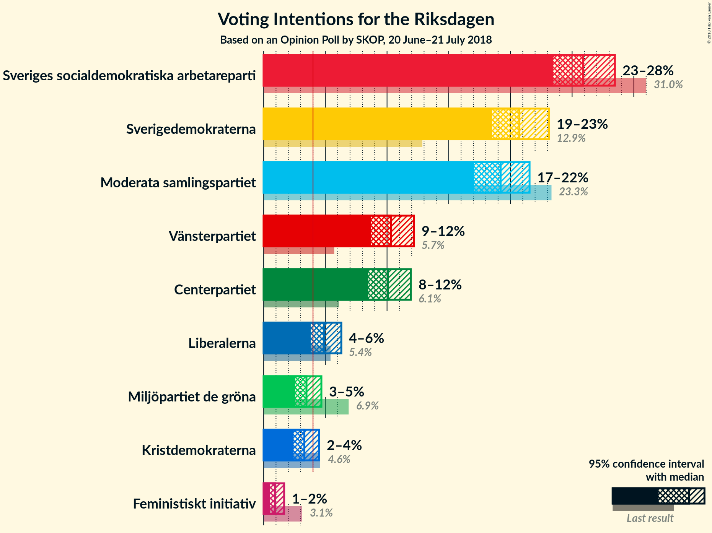
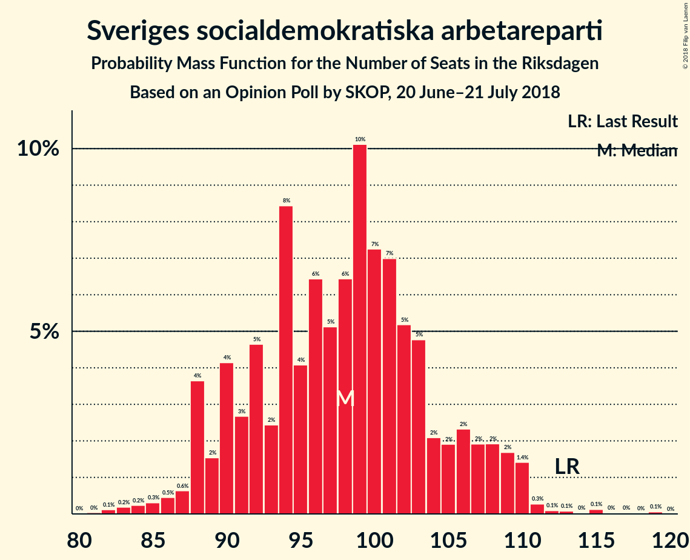
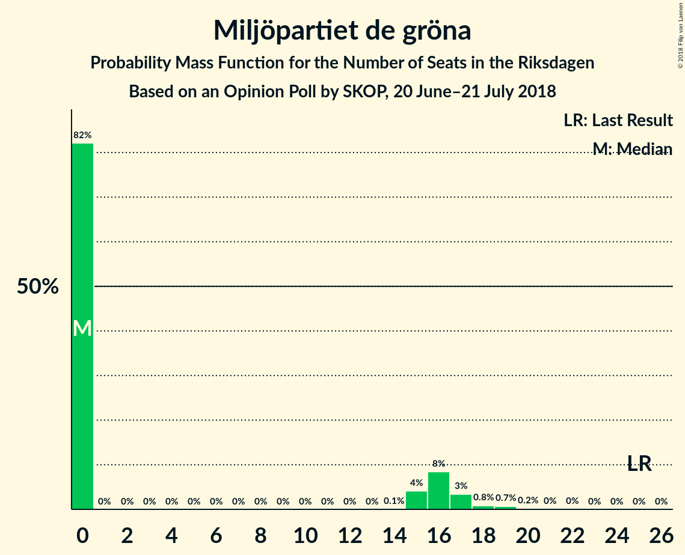
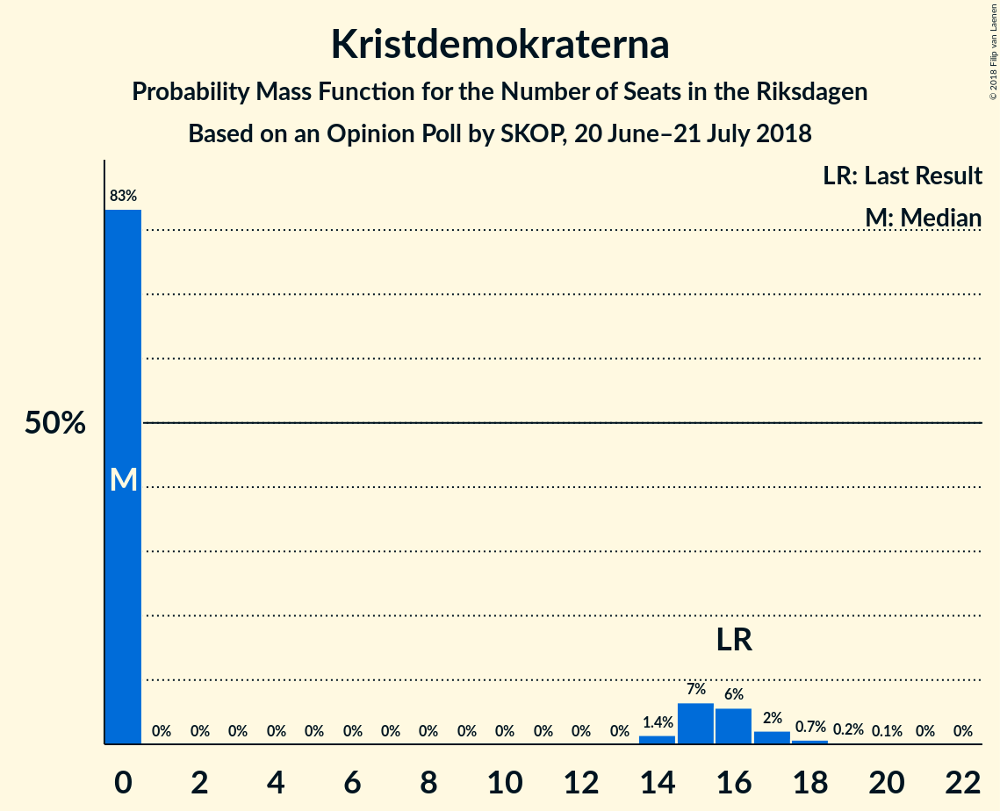

# Opinion Poll by SKOP, 20 June–21 July 2018

<a href="#voting-intentions">Voting Intentions</a> | <a href="#seats">Seats</a> | <a href="#coalitions">Coalitions</a> | <a href="#technical-information">Technical Information</a>

## Voting Intentions

### Confidence Intervals

| Party | Last Result | Poll Result | 80% Confidence Interval | 90% Confidence Interval | 95% Confidence Interval | 99% Confidence Interval |
|:-----:|:-----------:|:-----------:|:-----------------------:|:-----------------------:|:-----------------------:|:-----------------------:|
| Sveriges socialdemokratiska arbetareparti | 31.0% | 25.9% | 24.3–27.6% |23.9–28.1% |23.5–28.5% |22.7–29.3% |
| Sverigedemokraterna | 12.9% | 20.7% | 19.3–22.3% |18.9–22.8% |18.5–23.1% |17.8–23.9% |
| Moderata samlingspartiet | 23.3% | 19.2% | 17.8–20.7% |17.4–21.2% |17.1–21.6% |16.4–22.3% |
| Vänsterpartiet | 5.7% | 10.3% | 9.3–11.6% |9.0–11.9% |8.7–12.2% |8.2–12.8% |
| Centerpartiet | 6.1% | 10.1% | 9.0–11.3% |8.7–11.6% |8.5–11.9% |8.0–12.5% |
| Liberalerna | 5.4% | 4.9% | 4.2–5.8% |4.0–6.1% |3.8–6.3% |3.5–6.8% |
| Miljöpartiet de gröna | 6.9% | 3.5% | 2.9–4.3% |2.7–4.5% |2.6–4.7% |2.3–5.1% |
| Kristdemokraterna | 4.6% | 3.3% | 2.7–4.1% |2.6–4.3% |2.4–4.5% |2.2–4.9% |
| Feministiskt initiativ | 3.1% | 0.9% | 0.7–1.4% |0.6–1.5% |0.5–1.7% |0.4–1.9% |

*Note:* The poll result column reflects the actual value used in the calculations. Published results may vary slightly, and in addition be rounded to fewer digits.

## Seats

### Confidence Intervals

| Party | Last Result | Median | 80% Confidence Interval | 90% Confidence Interval | 95% Confidence Interval | 99% Confidence Interval |
|:-----:|:-----------:|:------:|:-----------------------:|:-----------------------:|:-----------------------:|:-----------------------:|
| <a href="#sveriges-socialdemokratiska-arbetareparti">Sveriges socialdemokratiska arbetareparti</a> | 113 | 98 | 90–106 |88–108 |88–109 |84–111 |
| <a href="#sverigedemokraterna">Sverigedemokraterna</a> | 49 | 78 | 72–85 |70–86 |69–88 |66–91 |
| <a href="#moderata-samlingspartiet">Moderata samlingspartiet</a> | 84 | 72 | 67–79 |65–81 |64–83 |61–85 |
| <a href="#vänsterpartiet">Vänsterpartiet</a> | 21 | 39 | 34–44 |33–45 |33–47 |31–50 |
| <a href="#centerpartiet">Centerpartiet</a> | 22 | 39 | 34–43 |33–44 |31–45 |30–48 |
| <a href="#liberalerna">Liberalerna</a> | 19 | 18 | 15–22 |0–23 |0–24 |0–26 |
| <a href="#miljöpartiet-de-gröna">Miljöpartiet de gröna</a> | 25 | 0 | 0–16 |0–17 |0–17 |0–19 |
| <a href="#kristdemokraterna">Kristdemokraterna</a> | 16 | 0 | 0–15 |0–16 |0–17 |0–18 |
| <a href="#feministiskt-initiativ">Feministiskt initiativ</a> | 0 | 0 | 0 |0 |0 |0 |

### Sveriges socialdemokratiska arbetareparti

*For a full overview of the results for this party, see the [Sveriges socialdemokratiska arbetareparti](party-sverigessocialdemokratiskaarbetareparti.html) page.*

| Number of Seats | Probability | Accumulated | Special Marks |
|:---------------:|:-----------:|:-----------:|:-------------:|
| 80 | 0% | 100% |  |
| 81 | 0% | 99.9% |  |
| 82 | 0.1% | 99.9% |  |
| 83 | 0.2% | 99.8% |  |
| 84 | 0.2% | 99.6% |  |
| 85 | 0.3% | 99.4% |  |
| 86 | 0.5% | 99.0% |  |
| 87 | 0.6% | 98.6% |  |
| 88 | 4% | 98% |  |
| 89 | 2% | 94% |  |
| 90 | 4% | 93% |  |
| 91 | 3% | 89% |  |
| 92 | 5% | 86% |  |
| 93 | 2% | 81% |  |
| 94 | 8% | 79% |  |
| 95 | 4% | 70% |  |
| 96 | 6% | 66% |  |
| 97 | 5% | 60% |  |
| 98 | 6% | 55% | Median |
| 99 | 10% | 48% |  |
| 100 | 7% | 38% |  |
| 101 | 7% | 31% |  |
| 102 | 5% | 24% |  |
| 103 | 5% | 19% |  |
| 104 | 2% | 14% |  |
| 105 | 2% | 12% |  |
| 106 | 2% | 10% |  |
| 107 | 2% | 8% |  |
| 108 | 2% | 6% |  |
| 109 | 2% | 4% |  |
| 110 | 1.4% | 2% |  |
| 111 | 0.3% | 0.7% |  |
| 112 | 0.1% | 0.5% |  |
| 113 | 0.1% | 0.4% | Last Result |
| 114 | 0% | 0.3% |  |
| 115 | 0.1% | 0.3% |  |
| 116 | 0% | 0.1% |  |
| 117 | 0% | 0.1% |  |
| 118 | 0% | 0.1% |  |
| 119 | 0.1% | 0.1% |  |
| 120 | 0% | 0% |  |

### Sverigedemokraterna

*For a full overview of the results for this party, see the [Sverigedemokraterna](party-sverigedemokraterna.html) page.*

| Number of Seats | Probability | Accumulated | Special Marks |
|:---------------:|:-----------:|:-----------:|:-------------:|
| 49 | 0% | 100% | Last Result |
| 50 | 0% | 100% |  |
| 51 | 0% | 100% |  |
| 52 | 0% | 100% |  |
| 53 | 0% | 100% |  |
| 54 | 0% | 100% |  |
| 55 | 0% | 100% |  |
| 56 | 0% | 100% |  |
| 57 | 0% | 100% |  |
| 58 | 0% | 100% |  |
| 59 | 0% | 100% |  |
| 60 | 0% | 100% |  |
| 61 | 0% | 100% |  |
| 62 | 0% | 100% |  |
| 63 | 0% | 100% |  |
| 64 | 0.1% | 99.9% |  |
| 65 | 0.1% | 99.8% |  |
| 66 | 0.7% | 99.7% |  |
| 67 | 0.4% | 99.1% |  |
| 68 | 0.6% | 98.6% |  |
| 69 | 1.5% | 98% |  |
| 70 | 2% | 97% |  |
| 71 | 3% | 95% |  |
| 72 | 3% | 92% |  |
| 73 | 5% | 89% |  |
| 74 | 3% | 84% |  |
| 75 | 9% | 81% |  |
| 76 | 7% | 72% |  |
| 77 | 12% | 65% |  |
| 78 | 4% | 53% | Median |
| 79 | 7% | 48% |  |
| 80 | 5% | 42% |  |
| 81 | 4% | 37% |  |
| 82 | 8% | 33% |  |
| 83 | 2% | 24% |  |
| 84 | 12% | 23% |  |
| 85 | 2% | 11% |  |
| 86 | 4% | 9% |  |
| 87 | 1.2% | 5% |  |
| 88 | 1.3% | 4% |  |
| 89 | 2% | 2% |  |
| 90 | 0.1% | 0.8% |  |
| 91 | 0.3% | 0.6% |  |
| 92 | 0.1% | 0.4% |  |
| 93 | 0.1% | 0.3% |  |
| 94 | 0.1% | 0.2% |  |
| 95 | 0.1% | 0.2% |  |
| 96 | 0% | 0.1% |  |
| 97 | 0.1% | 0.1% |  |
| 98 | 0% | 0% |  |

### Moderata samlingspartiet

*For a full overview of the results for this party, see the [Moderata samlingspartiet](party-moderatasamlingspartiet.html) page.*

| Number of Seats | Probability | Accumulated | Special Marks |
|:---------------:|:-----------:|:-----------:|:-------------:|
| 58 | 0% | 100% |  |
| 59 | 0.1% | 99.9% |  |
| 60 | 0.2% | 99.8% |  |
| 61 | 0.6% | 99.6% |  |
| 62 | 0.6% | 99.0% |  |
| 63 | 0.7% | 98% |  |
| 64 | 1.3% | 98% |  |
| 65 | 2% | 96% |  |
| 66 | 3% | 94% |  |
| 67 | 11% | 91% |  |
| 68 | 4% | 80% |  |
| 69 | 9% | 75% |  |
| 70 | 5% | 66% |  |
| 71 | 7% | 61% |  |
| 72 | 7% | 55% | Median |
| 73 | 8% | 47% |  |
| 74 | 7% | 39% |  |
| 75 | 3% | 32% |  |
| 76 | 4% | 28% |  |
| 77 | 5% | 25% |  |
| 78 | 6% | 20% |  |
| 79 | 4% | 14% |  |
| 80 | 3% | 10% |  |
| 81 | 2% | 6% |  |
| 82 | 1.1% | 4% |  |
| 83 | 2% | 3% |  |
| 84 | 0.8% | 2% | Last Result |
| 85 | 0.3% | 0.7% |  |
| 86 | 0.2% | 0.5% |  |
| 87 | 0.2% | 0.3% |  |
| 88 | 0.1% | 0.1% |  |
| 89 | 0% | 0% |  |

### Vänsterpartiet

*For a full overview of the results for this party, see the [Vänsterpartiet](party-vänsterpartiet.html) page.*

| Number of Seats | Probability | Accumulated | Special Marks |
|:---------------:|:-----------:|:-----------:|:-------------:|
| 21 | 0% | 100% | Last Result |
| 22 | 0% | 100% |  |
| 23 | 0% | 100% |  |
| 24 | 0% | 100% |  |
| 25 | 0% | 100% |  |
| 26 | 0% | 100% |  |
| 27 | 0% | 100% |  |
| 28 | 0% | 100% |  |
| 29 | 0.1% | 99.9% |  |
| 30 | 0.2% | 99.9% |  |
| 31 | 0.6% | 99.6% |  |
| 32 | 0.9% | 99.0% |  |
| 33 | 4% | 98% |  |
| 34 | 4% | 94% |  |
| 35 | 7% | 90% |  |
| 36 | 11% | 83% |  |
| 37 | 13% | 72% |  |
| 38 | 8% | 59% |  |
| 39 | 5% | 50% | Median |
| 40 | 9% | 46% |  |
| 41 | 14% | 37% |  |
| 42 | 7% | 23% |  |
| 43 | 4% | 16% |  |
| 44 | 5% | 12% |  |
| 45 | 3% | 7% |  |
| 46 | 1.2% | 4% |  |
| 47 | 0.7% | 3% |  |
| 48 | 0.5% | 2% |  |
| 49 | 0.7% | 1.2% |  |
| 50 | 0.4% | 0.6% |  |
| 51 | 0.1% | 0.2% |  |
| 52 | 0% | 0.1% |  |
| 53 | 0% | 0% |  |

### Centerpartiet

*For a full overview of the results for this party, see the [Centerpartiet](party-centerpartiet.html) page.*

| Number of Seats | Probability | Accumulated | Special Marks |
|:---------------:|:-----------:|:-----------:|:-------------:|
| 22 | 0% | 100% | Last Result |
| 23 | 0% | 100% |  |
| 24 | 0% | 100% |  |
| 25 | 0% | 100% |  |
| 26 | 0% | 100% |  |
| 27 | 0% | 100% |  |
| 28 | 0.1% | 100% |  |
| 29 | 0.2% | 99.9% |  |
| 30 | 0.6% | 99.7% |  |
| 31 | 2% | 99.1% |  |
| 32 | 2% | 97% |  |
| 33 | 3% | 95% |  |
| 34 | 6% | 92% |  |
| 35 | 6% | 86% |  |
| 36 | 12% | 80% |  |
| 37 | 11% | 68% |  |
| 38 | 5% | 56% |  |
| 39 | 7% | 51% | Median |
| 40 | 13% | 44% |  |
| 41 | 11% | 30% |  |
| 42 | 8% | 19% |  |
| 43 | 5% | 11% |  |
| 44 | 3% | 7% |  |
| 45 | 2% | 4% |  |
| 46 | 0.8% | 2% |  |
| 47 | 0.8% | 1.4% |  |
| 48 | 0.3% | 0.6% |  |
| 49 | 0.3% | 0.3% |  |
| 50 | 0% | 0.1% |  |
| 51 | 0% | 0% |  |

### Liberalerna

*For a full overview of the results for this party, see the [Liberalerna](party-liberalerna.html) page.*

| Number of Seats | Probability | Accumulated | Special Marks |
|:---------------:|:-----------:|:-----------:|:-------------:|
| 0 | 9% | 100% |  |
| 1 | 0% | 91% |  |
| 2 | 0% | 91% |  |
| 3 | 0% | 91% |  |
| 4 | 0% | 91% |  |
| 5 | 0% | 91% |  |
| 6 | 0% | 91% |  |
| 7 | 0% | 91% |  |
| 8 | 0% | 91% |  |
| 9 | 0% | 91% |  |
| 10 | 0% | 91% |  |
| 11 | 0% | 91% |  |
| 12 | 0% | 91% |  |
| 13 | 0% | 91% |  |
| 14 | 0% | 91% |  |
| 15 | 3% | 91% |  |
| 16 | 8% | 89% |  |
| 17 | 17% | 81% |  |
| 18 | 24% | 64% | Median |
| 19 | 11% | 40% | Last Result |
| 20 | 10% | 29% |  |
| 21 | 7% | 19% |  |
| 22 | 5% | 12% |  |
| 23 | 3% | 7% |  |
| 24 | 2% | 4% |  |
| 25 | 1.3% | 2% |  |
| 26 | 0.5% | 0.7% |  |
| 27 | 0.1% | 0.2% |  |
| 28 | 0% | 0.1% |  |
| 29 | 0% | 0% |  |

### Miljöpartiet de gröna

*For a full overview of the results for this party, see the [Miljöpartiet de gröna](party-miljöpartietdegröna.html) page.*

| Number of Seats | Probability | Accumulated | Special Marks |
|:---------------:|:-----------:|:-----------:|:-------------:|
| 0 | 82% | 100% | Median |
| 1 | 0% | 18% |  |
| 2 | 0% | 18% |  |
| 3 | 0% | 18% |  |
| 4 | 0% | 18% |  |
| 5 | 0% | 18% |  |
| 6 | 0% | 18% |  |
| 7 | 0% | 18% |  |
| 8 | 0% | 18% |  |
| 9 | 0% | 18% |  |
| 10 | 0% | 18% |  |
| 11 | 0% | 18% |  |
| 12 | 0% | 18% |  |
| 13 | 0% | 18% |  |
| 14 | 0.1% | 18% |  |
| 15 | 4% | 18% |  |
| 16 | 8% | 14% |  |
| 17 | 3% | 5% |  |
| 18 | 0.8% | 2% |  |
| 19 | 0.7% | 0.9% |  |
| 20 | 0.2% | 0.2% |  |
| 21 | 0% | 0.1% |  |
| 22 | 0% | 0% |  |
| 23 | 0% | 0% |  |
| 24 | 0% | 0% |  |
| 25 | 0% | 0% | Last Result |

### Kristdemokraterna

*For a full overview of the results for this party, see the [Kristdemokraterna](party-kristdemokraterna.html) page.*

| Number of Seats | Probability | Accumulated | Special Marks |
|:---------------:|:-----------:|:-----------:|:-------------:|
| 0 | 83% | 100% | Median |
| 1 | 0% | 17% |  |
| 2 | 0% | 17% |  |
| 3 | 0% | 17% |  |
| 4 | 0% | 17% |  |
| 5 | 0% | 17% |  |
| 6 | 0% | 17% |  |
| 7 | 0% | 17% |  |
| 8 | 0% | 17% |  |
| 9 | 0% | 17% |  |
| 10 | 0% | 17% |  |
| 11 | 0% | 17% |  |
| 12 | 0% | 17% |  |
| 13 | 0% | 17% |  |
| 14 | 1.4% | 17% |  |
| 15 | 7% | 15% |  |
| 16 | 6% | 9% | Last Result |
| 17 | 2% | 3% |  |
| 18 | 0.7% | 1.0% |  |
| 19 | 0.2% | 0.3% |  |
| 20 | 0.1% | 0.1% |  |
| 21 | 0% | 0% |  |

### Feministiskt initiativ

*For a full overview of the results for this party, see the [Feministiskt initiativ](party-feministisktinitiativ.html) page.*

| Number of Seats | Probability | Accumulated | Special Marks |
|:---------------:|:-----------:|:-----------:|:-------------:|
| 0 | 100% | 100% | Last Result, Median |

## Coalitions

### Confidence Intervals

| Coalition | Last Result | Median | Majority? | 80% Confidence Interval | 90% Confidence Interval | 95% Confidence Interval | 99% Confidence Interval |
|:---------:|:-----------:|:------:|:---------:|:-----------------------:|:-----------------------:|:-----------------------:|:-----------------------:|
| Sveriges socialdemokratiska arbetareparti – Moderata samlingspartiet | 197 | 171 | 31% | 161–180 | 159–183 | 157–186 | 151–189 |
| Sverigedemokraterna – Moderata samlingspartiet | 133 | 151 | 0% | 143–160 | 140–161 | 138–164 | 134–169 |
| Sveriges socialdemokratiska arbetareparti – Vänsterpartiet – Miljöpartiet de gröna – Feministiskt initiativ | 159 | 140 | 0% | 130–150 | 129–153 | 126–156 | 124–159 |
| Sveriges socialdemokratiska arbetareparti – Vänsterpartiet – Miljöpartiet de gröna | 159 | 140 | 0% | 130–150 | 129–153 | 126–156 | 124–159 |
| Sveriges socialdemokratiska arbetareparti – Vänsterpartiet | 134 | 137 | 0% | 128–146 | 126–148 | 124–152 | 121–155 |
| Moderata samlingspartiet – Centerpartiet – Liberalerna – Kristdemokraterna | 141 | 130 | 0% | 120–141 | 117–143 | 115–146 | 111–148 |
| Moderata samlingspartiet – Centerpartiet – Liberalerna | 125 | 128 | 0% | 119–138 | 116–139 | 113–141 | 110–145 |
| Moderata samlingspartiet – Centerpartiet – Kristdemokraterna | 122 | 113 | 0% | 106–122 | 104–125 | 102–127 | 97–131 |
| Moderata samlingspartiet – Centerpartiet | 106 | 111 | 0% | 104–118 | 102–121 | 100–123 | 96–126 |
| Sveriges socialdemokratiska arbetareparti – Miljöpartiet de gröna | 138 | 100 | 0% | 92–110 | 90–114 | 88–116 | 86–121 |

