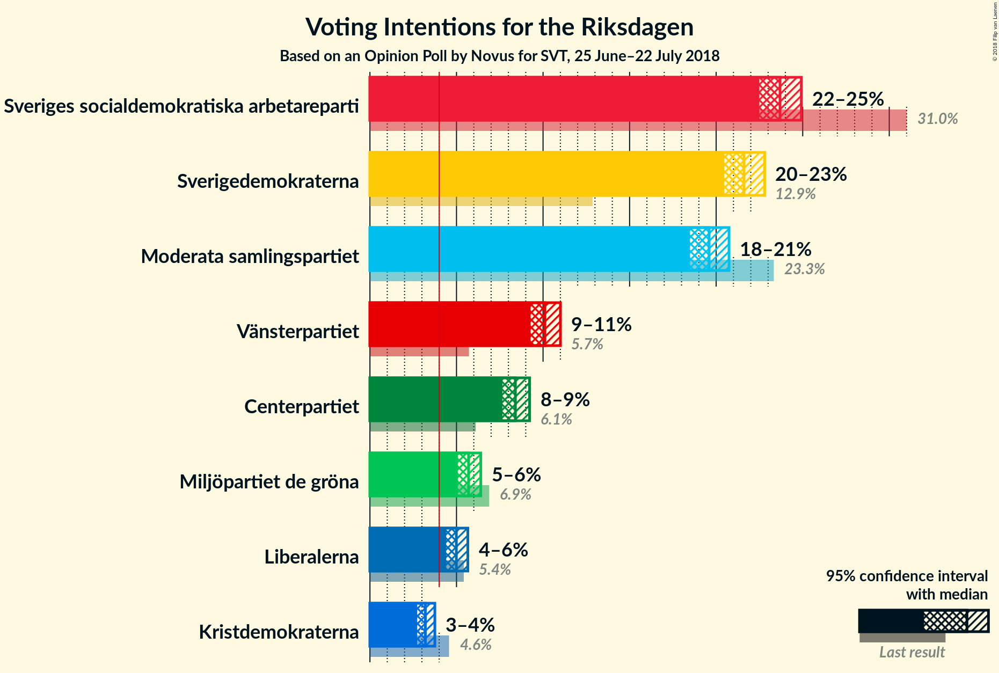
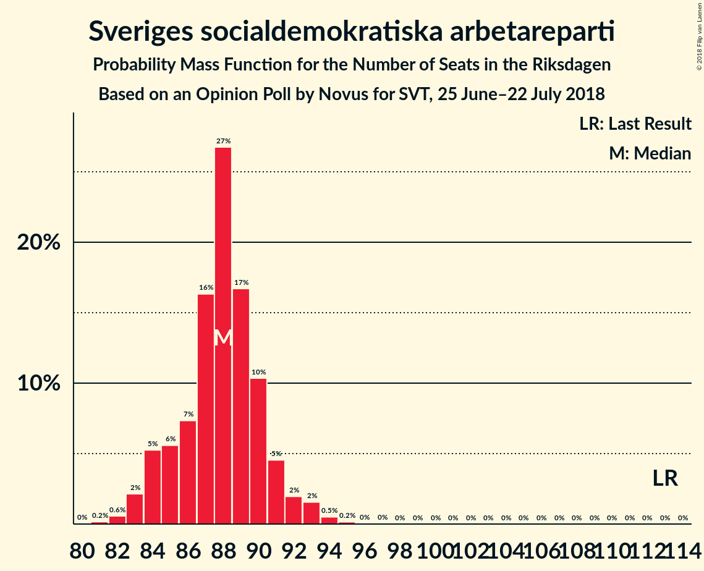

# Opinion Poll by Novus for SVT, 25 June–22 July 2018

<a href="#voting-intentions">Voting Intentions</a> | <a href="#seats">Seats</a> | <a href="#coalitions">Coalitions</a> | <a href="#technical-information">Technical Information</a>

## Voting Intentions

### Confidence Intervals

| Party | Last Result | Poll Result | 80% Confidence Interval | 90% Confidence Interval | 95% Confidence Interval | 99% Confidence Interval |
|:-----:|:-----------:|:-----------:|:-----------------------:|:-----------------------:|:-----------------------:|:-----------------------:|
| Sveriges socialdemokratiska arbetareparti | 31.0% | 23.7% | 22.9–24.5% |22.7–24.7% |22.5–24.9% |22.1–25.3% |
| Sverigedemokraterna | 12.9% | 21.6% | 20.9–22.4% |20.7–22.6% |20.5–22.8% |20.1–23.2% |
| Moderata samlingspartiet | 23.3% | 19.6% | 18.9–20.3% |18.7–20.6% |18.5–20.7% |18.2–21.1% |
| Vänsterpartiet | 5.7% | 10.1% | 9.6–10.7% |9.4–10.9% |9.3–11.0% |9.0–11.3% |
| Centerpartiet | 6.1% | 8.4% | 7.9–8.9% |7.8–9.1% |7.7–9.2% |7.4–9.5% |
| Miljöpartiet de gröna | 6.9% | 5.7% | 5.3–6.2% |5.2–6.3% |5.1–6.4% |4.9–6.6% |
| Liberalerna | 5.4% | 5.0% | 4.6–5.4% |4.5–5.5% |4.4–5.7% |4.2–5.9% |
| Kristdemokraterna | 4.6% | 3.2% | 2.9–3.6% |2.8–3.7% |2.7–3.7% |2.6–3.9% |

*Note:* The poll result column reflects the actual value used in the calculations. Published results may vary slightly, and in addition be rounded to fewer digits.

## Seats

### Confidence Intervals

| Party | Last Result | Median | 80% Confidence Interval | 90% Confidence Interval | 95% Confidence Interval | 99% Confidence Interval |
|:-----:|:-----------:|:------:|:-----------------------:|:-----------------------:|:-----------------------:|:-----------------------:|
| <a href="#sveriges-socialdemokratiska-arbetareparti">Sveriges socialdemokratiska arbetareparti</a> | 113 | 88 | 84–90 |84–91 |84–92 |82–94 |
| <a href="#sverigedemokraterna">Sverigedemokraterna</a> | 49 | 80 | 77–83 |76–84 |76–85 |74–86 |
| <a href="#moderata-samlingspartiet">Moderata samlingspartiet</a> | 84 | 72 | 70–75 |69–76 |68–76 |67–78 |
| <a href="#vänsterpartiet">Vänsterpartiet</a> | 21 | 38 | 35–40 |35–40 |35–41 |34–42 |
| <a href="#centerpartiet">Centerpartiet</a> | 22 | 31 | 30–33 |29–34 |28–34 |28–35 |
| <a href="#miljöpartiet-de-gröna">Miljöpartiet de gröna</a> | 25 | 21 | 19–23 |19–23 |19–24 |18–24 |
| <a href="#liberalerna">Liberalerna</a> | 19 | 19 | 17–20 |16–20 |16–21 |16–21 |
| <a href="#kristdemokraterna">Kristdemokraterna</a> | 16 | 0 | 0 |0 |0 |0 |

### Sveriges socialdemokratiska arbetareparti

*For a full overview of the results for this party, see the [Sveriges socialdemokratiska arbetareparti](party-sverigessocialdemokratiskaarbetareparti.html) page.*

| Number of Seats | Probability | Accumulated | Special Marks |
|:---------------:|:-----------:|:-----------:|:-------------:|
| 80 | 0% | 100% |  |
| 81 | 0.2% | 99.9% |  |
| 82 | 0.4% | 99.8% |  |
| 83 | 2% | 99.4% |  |
| 84 | 9% | 98% |  |
| 85 | 8% | 88% |  |
| 86 | 7% | 80% |  |
| 87 | 7% | 74% |  |
| 88 | 20% | 67% | Median |
| 89 | 24% | 47% |  |
| 90 | 14% | 23% |  |
| 91 | 5% | 8% |  |
| 92 | 2% | 3% |  |
| 93 | 0.6% | 1.2% |  |
| 94 | 0.4% | 0.6% |  |
| 95 | 0.1% | 0.2% |  |
| 96 | 0% | 0.1% |  |
| 97 | 0% | 0% |  |
| 98 | 0% | 0% |  |
| 99 | 0% | 0% |  |
| 100 | 0% | 0% |  |
| 101 | 0% | 0% |  |
| 102 | 0% | 0% |  |
| 103 | 0% | 0% |  |
| 104 | 0% | 0% |  |
| 105 | 0% | 0% |  |
| 106 | 0% | 0% |  |
| 107 | 0% | 0% |  |
| 108 | 0% | 0% |  |
| 109 | 0% | 0% |  |
| 110 | 0% | 0% |  |
| 111 | 0% | 0% |  |
| 112 | 0% | 0% |  |
| 113 | 0% | 0% | Last Result |

### Sverigedemokraterna

*For a full overview of the results for this party, see the [Sverigedemokraterna](party-sverigedemokraterna.html) page.*

| Number of Seats | Probability | Accumulated | Special Marks |
|:---------------:|:-----------:|:-----------:|:-------------:|
| 49 | 0% | 100% | Last Result |
| 50 | 0% | 100% |  |
| 51 | 0% | 100% |  |
| 52 | 0% | 100% |  |
| 53 | 0% | 100% |  |
| 54 | 0% | 100% |  |
| 55 | 0% | 100% |  |
| 56 | 0% | 100% |  |
| 57 | 0% | 100% |  |
| 58 | 0% | 100% |  |
| 59 | 0% | 100% |  |
| 60 | 0% | 100% |  |
| 61 | 0% | 100% |  |
| 62 | 0% | 100% |  |
| 63 | 0% | 100% |  |
| 64 | 0% | 100% |  |
| 65 | 0% | 100% |  |
| 66 | 0% | 100% |  |
| 67 | 0% | 100% |  |
| 68 | 0% | 100% |  |
| 69 | 0% | 100% |  |
| 70 | 0% | 100% |  |
| 71 | 0% | 100% |  |
| 72 | 0% | 100% |  |
| 73 | 0.1% | 100% |  |
| 74 | 0.6% | 99.9% |  |
| 75 | 1.0% | 99.3% |  |
| 76 | 5% | 98% |  |
| 77 | 6% | 94% |  |
| 78 | 17% | 87% |  |
| 79 | 8% | 70% |  |
| 80 | 18% | 62% | Median |
| 81 | 13% | 45% |  |
| 82 | 21% | 32% |  |
| 83 | 4% | 11% |  |
| 84 | 4% | 7% |  |
| 85 | 2% | 3% |  |
| 86 | 1.0% | 1.2% |  |
| 87 | 0.1% | 0.1% |  |
| 88 | 0% | 0% |  |

### Moderata samlingspartiet

*For a full overview of the results for this party, see the [Moderata samlingspartiet](party-moderatasamlingspartiet.html) page.*

| Number of Seats | Probability | Accumulated | Special Marks |
|:---------------:|:-----------:|:-----------:|:-------------:|
| 66 | 0.1% | 100% |  |
| 67 | 0.7% | 99.9% |  |
| 68 | 2% | 99.2% |  |
| 69 | 4% | 97% |  |
| 70 | 7% | 94% |  |
| 71 | 17% | 87% |  |
| 72 | 23% | 70% | Median |
| 73 | 24% | 47% |  |
| 74 | 8% | 23% |  |
| 75 | 5% | 15% |  |
| 76 | 8% | 10% |  |
| 77 | 1.2% | 2% |  |
| 78 | 0.8% | 1.1% |  |
| 79 | 0.2% | 0.3% |  |
| 80 | 0.1% | 0.1% |  |
| 81 | 0% | 0% |  |
| 82 | 0% | 0% |  |
| 83 | 0% | 0% |  |
| 84 | 0% | 0% | Last Result |

### Vänsterpartiet

*For a full overview of the results for this party, see the [Vänsterpartiet](party-vänsterpartiet.html) page.*

| Number of Seats | Probability | Accumulated | Special Marks |
|:---------------:|:-----------:|:-----------:|:-------------:|
| 21 | 0% | 100% | Last Result |
| 22 | 0% | 100% |  |
| 23 | 0% | 100% |  |
| 24 | 0% | 100% |  |
| 25 | 0% | 100% |  |
| 26 | 0% | 100% |  |
| 27 | 0% | 100% |  |
| 28 | 0% | 100% |  |
| 29 | 0% | 100% |  |
| 30 | 0% | 100% |  |
| 31 | 0% | 100% |  |
| 32 | 0.1% | 100% |  |
| 33 | 0.3% | 99.9% |  |
| 34 | 1.3% | 99.6% |  |
| 35 | 10% | 98% |  |
| 36 | 15% | 88% |  |
| 37 | 22% | 74% |  |
| 38 | 30% | 52% | Median |
| 39 | 9% | 22% |  |
| 40 | 10% | 13% |  |
| 41 | 3% | 3% |  |
| 42 | 0.5% | 0.7% |  |
| 43 | 0.2% | 0.2% |  |
| 44 | 0% | 0% |  |

### Centerpartiet

*For a full overview of the results for this party, see the [Centerpartiet](party-centerpartiet.html) page.*

| Number of Seats | Probability | Accumulated | Special Marks |
|:---------------:|:-----------:|:-----------:|:-------------:|
| 22 | 0% | 100% | Last Result |
| 23 | 0% | 100% |  |
| 24 | 0% | 100% |  |
| 25 | 0% | 100% |  |
| 26 | 0% | 100% |  |
| 27 | 0.4% | 100% |  |
| 28 | 2% | 99.5% |  |
| 29 | 6% | 97% |  |
| 30 | 24% | 92% |  |
| 31 | 27% | 68% | Median |
| 32 | 12% | 41% |  |
| 33 | 23% | 29% |  |
| 34 | 3% | 5% |  |
| 35 | 1.4% | 2% |  |
| 36 | 0.3% | 0.3% |  |
| 37 | 0% | 0% |  |

### Miljöpartiet de gröna

*For a full overview of the results for this party, see the [Miljöpartiet de gröna](party-miljöpartietdegröna.html) page.*

| Number of Seats | Probability | Accumulated | Special Marks |
|:---------------:|:-----------:|:-----------:|:-------------:|
| 17 | 0.1% | 100% |  |
| 18 | 0.6% | 99.9% |  |
| 19 | 14% | 99.3% |  |
| 20 | 25% | 86% |  |
| 21 | 20% | 60% | Median |
| 22 | 14% | 41% |  |
| 23 | 23% | 27% |  |
| 24 | 3% | 4% |  |
| 25 | 0.2% | 0.3% | Last Result |
| 26 | 0% | 0% |  |

### Liberalerna

*For a full overview of the results for this party, see the [Liberalerna](party-liberalerna.html) page.*

| Number of Seats | Probability | Accumulated | Special Marks |
|:---------------:|:-----------:|:-----------:|:-------------:|
| 15 | 0.1% | 100% |  |
| 16 | 5% | 99.8% |  |
| 17 | 11% | 95% |  |
| 18 | 29% | 84% |  |
| 19 | 41% | 55% | Last Result, Median |
| 20 | 9% | 14% |  |
| 21 | 4% | 4% |  |
| 22 | 0.4% | 0.4% |  |
| 23 | 0% | 0% |  |

### Kristdemokraterna

*For a full overview of the results for this party, see the [Kristdemokraterna](party-kristdemokraterna.html) page.*

| Number of Seats | Probability | Accumulated | Special Marks |
|:---------------:|:-----------:|:-----------:|:-------------:|
| 0 | 99.9% | 100% | Median |
| 1 | 0% | 0.1% |  |
| 2 | 0% | 0.1% |  |
| 3 | 0% | 0.1% |  |
| 4 | 0% | 0.1% |  |
| 5 | 0% | 0.1% |  |
| 6 | 0% | 0.1% |  |
| 7 | 0% | 0.1% |  |
| 8 | 0% | 0.1% |  |
| 9 | 0% | 0.1% |  |
| 10 | 0% | 0.1% |  |
| 11 | 0% | 0.1% |  |
| 12 | 0% | 0.1% |  |
| 13 | 0% | 0.1% |  |
| 14 | 0% | 0.1% |  |
| 15 | 0.1% | 0.1% |  |
| 16 | 0% | 0% | Last Result |

## Coalitions

### Confidence Intervals

| Coalition | Last Result | Median | Majority? | 80% Confidence Interval | 90% Confidence Interval | 95% Confidence Interval | 99% Confidence Interval |
|:---------:|:-----------:|:------:|:---------:|:-----------------------:|:-----------------------:|:-----------------------:|:-----------------------:|
| Sveriges socialdemokratiska arbetareparti – Moderata samlingspartiet | 197 | 161 | 0% | 157–163 | 156–165 | 155–166 | 154–167 |
| Sverigedemokraterna – Moderata samlingspartiet | 133 | 152 | 0% | 149–156 | 148–158 | 147–158 | 146–159 |
| Sveriges socialdemokratiska arbetareparti – Vänsterpartiet – Miljöpartiet de gröna | 159 | 147 | 0% | 143–150 | 142–151 | 141–152 | 140–153 |
| Sveriges socialdemokratiska arbetareparti – Vänsterpartiet | 134 | 126 | 0% | 122–128 | 121–129 | 120–130 | 119–132 |
| Moderata samlingspartiet – Centerpartiet – Liberalerna – Kristdemokraterna | 141 | 122 | 0% | 120–125 | 119–127 | 117–127 | 116–129 |
| Moderata samlingspartiet – Centerpartiet – Liberalerna | 125 | 122 | 0% | 120–125 | 119–126 | 117–127 | 116–129 |
| Sveriges socialdemokratiska arbetareparti – Miljöpartiet de gröna | 138 | 110 | 0% | 106–112 | 105–112 | 104–113 | 103–115 |
| Moderata samlingspartiet – Centerpartiet – Kristdemokraterna | 122 | 104 | 0% | 101–107 | 100–108 | 99–109 | 98–110 |
| Moderata samlingspartiet – Centerpartiet | 106 | 104 | 0% | 101–107 | 100–107 | 99–109 | 98–110 |

### Sveriges socialdemokratiska arbetareparti – Moderata samlingspartiet

| Number of Seats | Probability | Accumulated | Special Marks |
|:---------------:|:-----------:|:-----------:|:-------------:|
| 151 | 0% | 100% |  |
| 152 | 0.1% | 99.9% |  |
| 153 | 0.1% | 99.8% |  |
| 154 | 0.7% | 99.7% |  |
| 155 | 2% | 99.1% |  |
| 156 | 5% | 97% |  |
| 157 | 6% | 92% |  |
| 158 | 6% | 85% |  |
| 159 | 7% | 80% |  |
| 160 | 19% | 73% | Median |
| 161 | 30% | 54% |  |
| 162 | 12% | 24% |  |
| 163 | 3% | 12% |  |
| 164 | 4% | 9% |  |
| 165 | 2% | 5% |  |
| 166 | 2% | 3% |  |
| 167 | 0.8% | 1.2% |  |
| 168 | 0.4% | 0.4% |  |
| 169 | 0% | 0.1% |  |
| 170 | 0% | 0% |  |
| 171 | 0% | 0% |  |
| 172 | 0% | 0% |  |
| 173 | 0% | 0% |  |
| 174 | 0% | 0% |  |
| 175 | 0% | 0% | Majority |
| 176 | 0% | 0% |  |
| 177 | 0% | 0% |  |
| 178 | 0% | 0% |  |
| 179 | 0% | 0% |  |
| 180 | 0% | 0% |  |
| 181 | 0% | 0% |  |
| 182 | 0% | 0% |  |
| 183 | 0% | 0% |  |
| 184 | 0% | 0% |  |
| 185 | 0% | 0% |  |
| 186 | 0% | 0% |  |
| 187 | 0% | 0% |  |
| 188 | 0% | 0% |  |
| 189 | 0% | 0% |  |
| 190 | 0% | 0% |  |
| 191 | 0% | 0% |  |
| 192 | 0% | 0% |  |
| 193 | 0% | 0% |  |
| 194 | 0% | 0% |  |
| 195 | 0% | 0% |  |
| 196 | 0% | 0% |  |
| 197 | 0% | 0% | Last Result |

### Sverigedemokraterna – Moderata samlingspartiet

| Number of Seats | Probability | Accumulated | Special Marks |
|:---------------:|:-----------:|:-----------:|:-------------:|
| 133 | 0% | 100% | Last Result |
| 134 | 0% | 100% |  |
| 135 | 0% | 100% |  |
| 136 | 0% | 100% |  |
| 137 | 0% | 100% |  |
| 138 | 0% | 100% |  |
| 139 | 0% | 100% |  |
| 140 | 0% | 100% |  |
| 141 | 0% | 100% |  |
| 142 | 0% | 100% |  |
| 143 | 0% | 100% |  |
| 144 | 0% | 100% |  |
| 145 | 0.3% | 99.9% |  |
| 146 | 0.3% | 99.7% |  |
| 147 | 2% | 99.3% |  |
| 148 | 4% | 97% |  |
| 149 | 6% | 93% |  |
| 150 | 10% | 88% |  |
| 151 | 11% | 78% |  |
| 152 | 18% | 67% | Median |
| 153 | 17% | 49% |  |
| 154 | 10% | 32% |  |
| 155 | 10% | 23% |  |
| 156 | 4% | 13% |  |
| 157 | 4% | 9% |  |
| 158 | 4% | 5% |  |
| 159 | 1.2% | 2% |  |
| 160 | 0.1% | 0.3% |  |
| 161 | 0.1% | 0.2% |  |
| 162 | 0% | 0% |  |

### Sveriges socialdemokratiska arbetareparti – Vänsterpartiet – Miljöpartiet de gröna

| Number of Seats | Probability | Accumulated | Special Marks |
|:---------------:|:-----------:|:-----------:|:-------------:|
| 138 | 0.1% | 100% |  |
| 139 | 0.2% | 99.9% |  |
| 140 | 1.2% | 99.7% |  |
| 141 | 1.1% | 98.6% |  |
| 142 | 3% | 97% |  |
| 143 | 6% | 94% |  |
| 144 | 5% | 88% |  |
| 145 | 22% | 83% |  |
| 146 | 8% | 61% |  |
| 147 | 21% | 53% | Median |
| 148 | 10% | 32% |  |
| 149 | 5% | 22% |  |
| 150 | 11% | 17% |  |
| 151 | 3% | 6% |  |
| 152 | 1.2% | 3% |  |
| 153 | 1.2% | 1.4% |  |
| 154 | 0.1% | 0.2% |  |
| 155 | 0.1% | 0.1% |  |
| 156 | 0% | 0% |  |
| 157 | 0% | 0% |  |
| 158 | 0% | 0% |  |
| 159 | 0% | 0% | Last Result |

### Sveriges socialdemokratiska arbetareparti – Vänsterpartiet

| Number of Seats | Probability | Accumulated | Special Marks |
|:---------------:|:-----------:|:-----------:|:-------------:|
| 116 | 0.1% | 100% |  |
| 117 | 0% | 99.9% |  |
| 118 | 0.1% | 99.9% |  |
| 119 | 0.8% | 99.8% |  |
| 120 | 2% | 98.9% |  |
| 121 | 2% | 97% |  |
| 122 | 7% | 95% |  |
| 123 | 7% | 88% |  |
| 124 | 19% | 81% |  |
| 125 | 10% | 62% |  |
| 126 | 17% | 52% | Median |
| 127 | 20% | 35% |  |
| 128 | 5% | 15% |  |
| 129 | 6% | 10% |  |
| 130 | 2% | 4% |  |
| 131 | 1.3% | 2% |  |
| 132 | 0.4% | 0.7% |  |
| 133 | 0.1% | 0.2% |  |
| 134 | 0% | 0.1% | Last Result |
| 135 | 0% | 0% |  |

### Moderata samlingspartiet – Centerpartiet – Liberalerna – Kristdemokraterna

| Number of Seats | Probability | Accumulated | Special Marks |
|:---------------:|:-----------:|:-----------:|:-------------:|
| 113 | 0% | 100% |  |
| 114 | 0.1% | 99.9% |  |
| 115 | 0.2% | 99.9% |  |
| 116 | 0.8% | 99.7% |  |
| 117 | 2% | 99.0% |  |
| 118 | 1.4% | 97% |  |
| 119 | 4% | 96% |  |
| 120 | 17% | 92% |  |
| 121 | 14% | 75% |  |
| 122 | 16% | 61% | Median |
| 123 | 9% | 45% |  |
| 124 | 21% | 36% |  |
| 125 | 6% | 15% |  |
| 126 | 3% | 9% |  |
| 127 | 3% | 5% |  |
| 128 | 2% | 2% |  |
| 129 | 0.3% | 0.6% |  |
| 130 | 0.2% | 0.3% |  |
| 131 | 0.1% | 0.1% |  |
| 132 | 0% | 0.1% |  |
| 133 | 0% | 0% |  |
| 134 | 0% | 0% |  |
| 135 | 0% | 0% |  |
| 136 | 0% | 0% |  |
| 137 | 0% | 0% |  |
| 138 | 0% | 0% |  |
| 139 | 0% | 0% |  |
| 140 | 0% | 0% |  |
| 141 | 0% | 0% | Last Result |

### Moderata samlingspartiet – Centerpartiet – Liberalerna

| Number of Seats | Probability | Accumulated | Special Marks |
|:---------------:|:-----------:|:-----------:|:-------------:|
| 112 | 0% | 100% |  |
| 113 | 0% | 99.9% |  |
| 114 | 0.1% | 99.9% |  |
| 115 | 0.2% | 99.9% |  |
| 116 | 0.8% | 99.7% |  |
| 117 | 2% | 98.9% |  |
| 118 | 1.4% | 97% |  |
| 119 | 4% | 96% |  |
| 120 | 17% | 92% |  |
| 121 | 14% | 75% |  |
| 122 | 16% | 61% | Median |
| 123 | 9% | 45% |  |
| 124 | 21% | 35% |  |
| 125 | 6% | 15% | Last Result |
| 126 | 3% | 8% |  |
| 127 | 3% | 5% |  |
| 128 | 2% | 2% |  |
| 129 | 0.3% | 0.5% |  |
| 130 | 0.2% | 0.2% |  |
| 131 | 0% | 0% |  |

### Sveriges socialdemokratiska arbetareparti – Miljöpartiet de gröna

| Number of Seats | Probability | Accumulated | Special Marks |
|:---------------:|:-----------:|:-----------:|:-------------:|
| 101 | 0% | 100% |  |
| 102 | 0.3% | 99.9% |  |
| 103 | 0.5% | 99.6% |  |
| 104 | 3% | 99.1% |  |
| 105 | 5% | 96% |  |
| 106 | 5% | 91% |  |
| 107 | 17% | 86% |  |
| 108 | 8% | 69% |  |
| 109 | 9% | 61% | Median |
| 110 | 25% | 52% |  |
| 111 | 8% | 27% |  |
| 112 | 14% | 19% |  |
| 113 | 3% | 4% |  |
| 114 | 0.8% | 2% |  |
| 115 | 0.6% | 0.9% |  |
| 116 | 0.1% | 0.2% |  |
| 117 | 0.1% | 0.1% |  |
| 118 | 0% | 0% |  |
| 119 | 0% | 0% |  |
| 120 | 0% | 0% |  |
| 121 | 0% | 0% |  |
| 122 | 0% | 0% |  |
| 123 | 0% | 0% |  |
| 124 | 0% | 0% |  |
| 125 | 0% | 0% |  |
| 126 | 0% | 0% |  |
| 127 | 0% | 0% |  |
| 128 | 0% | 0% |  |
| 129 | 0% | 0% |  |
| 130 | 0% | 0% |  |
| 131 | 0% | 0% |  |
| 132 | 0% | 0% |  |
| 133 | 0% | 0% |  |
| 134 | 0% | 0% |  |
| 135 | 0% | 0% |  |
| 136 | 0% | 0% |  |
| 137 | 0% | 0% |  |
| 138 | 0% | 0% | Last Result |

### Moderata samlingspartiet – Centerpartiet – Kristdemokraterna

| Number of Seats | Probability | Accumulated | Special Marks |
|:---------------:|:-----------:|:-----------:|:-------------:|
| 96 | 0.1% | 100% |  |
| 97 | 0.3% | 99.9% |  |
| 98 | 1.0% | 99.6% |  |
| 99 | 2% | 98.7% |  |
| 100 | 2% | 97% |  |
| 101 | 15% | 95% |  |
| 102 | 13% | 80% |  |
| 103 | 8% | 67% | Median |
| 104 | 21% | 59% |  |
| 105 | 13% | 38% |  |
| 106 | 12% | 25% |  |
| 107 | 7% | 12% |  |
| 108 | 2% | 5% |  |
| 109 | 2% | 3% |  |
| 110 | 0.5% | 0.9% |  |
| 111 | 0.1% | 0.4% |  |
| 112 | 0.1% | 0.2% |  |
| 113 | 0% | 0.1% |  |
| 114 | 0% | 0.1% |  |
| 115 | 0% | 0.1% |  |
| 116 | 0% | 0% |  |
| 117 | 0% | 0% |  |
| 118 | 0% | 0% |  |
| 119 | 0% | 0% |  |
| 120 | 0% | 0% |  |
| 121 | 0% | 0% |  |
| 122 | 0% | 0% | Last Result |

### Moderata samlingspartiet – Centerpartiet

| Number of Seats | Probability | Accumulated | Special Marks |
|:---------------:|:-----------:|:-----------:|:-------------:|
| 96 | 0.1% | 100% |  |
| 97 | 0.3% | 99.9% |  |
| 98 | 1.0% | 99.6% |  |
| 99 | 2% | 98.6% |  |
| 100 | 2% | 97% |  |
| 101 | 15% | 95% |  |
| 102 | 13% | 80% |  |
| 103 | 8% | 67% | Median |
| 104 | 21% | 59% |  |
| 105 | 13% | 38% |  |
| 106 | 12% | 25% | Last Result |
| 107 | 7% | 12% |  |
| 108 | 2% | 5% |  |
| 109 | 2% | 3% |  |
| 110 | 0.5% | 0.8% |  |
| 111 | 0.1% | 0.3% |  |
| 112 | 0.1% | 0.1% |  |
| 113 | 0% | 0% |  |

## Technical Information

### Opinion Poll

+ **Polling firm:** Novus
+ **Commissioner(s):** SVT
+ **Fieldwork period:** 25 June–22 July 2018

### Calculations

+ **Sample size:** 4808
+ **Simulations done:** 262,144
+ **Error estimate:** 0.59%

