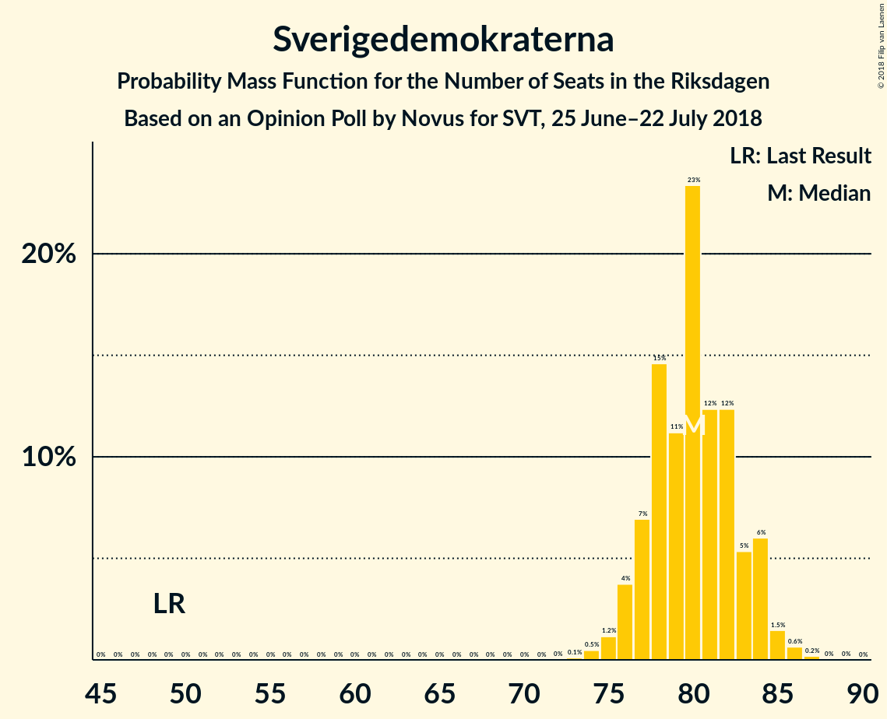
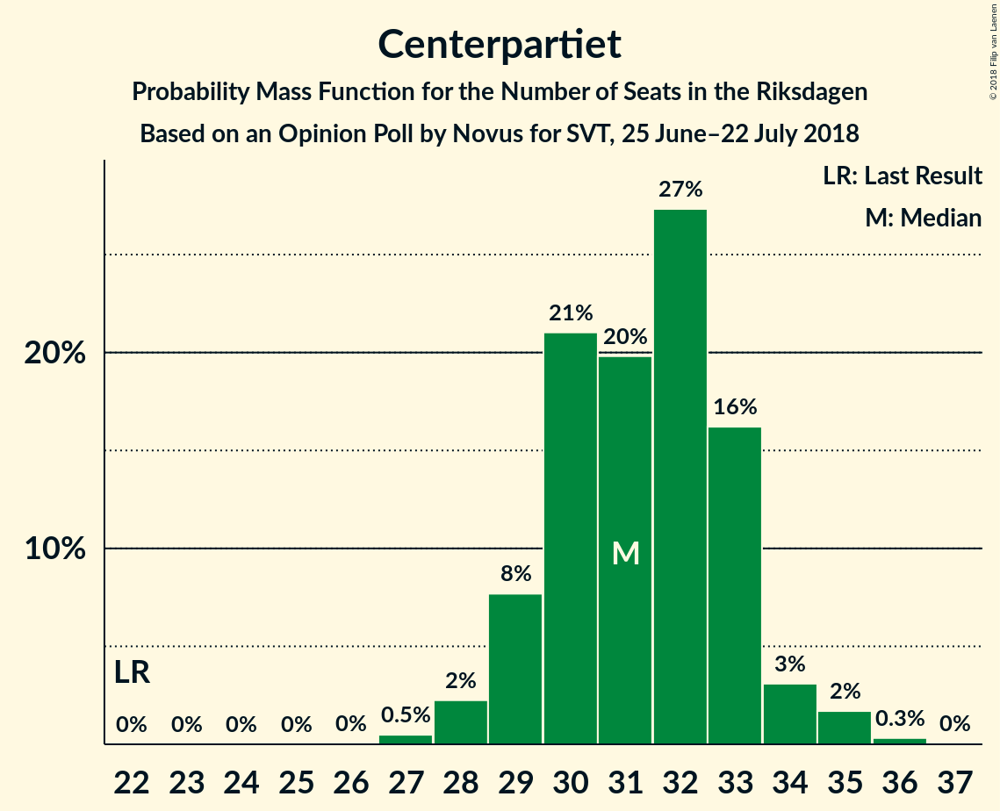
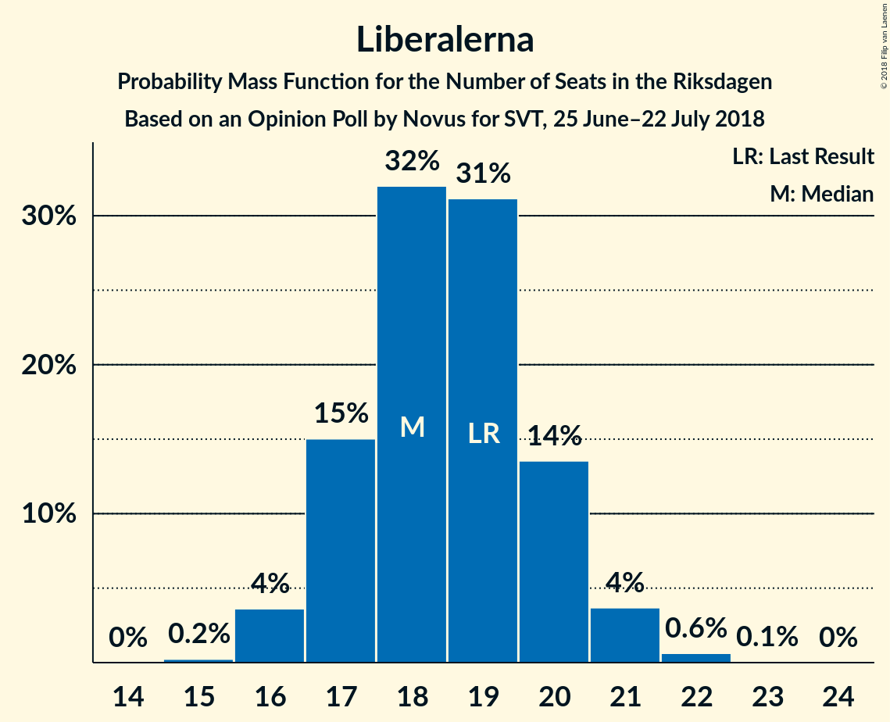

# Opinion Poll by Novus for SVT, 25 June–22 July 2018

<a href="#voting-intentions">Voting Intentions</a> | <a href="#seats">Seats</a> | <a href="#coalitions">Coalitions</a> | <a href="#technical-information">Technical Information</a>

## Voting Intentions

### Confidence Intervals

| Party | Last Result | Poll Result | 80% Confidence Interval | 90% Confidence Interval | 95% Confidence Interval | 99% Confidence Interval |
|:-----:|:-----------:|:-----------:|:-----------------------:|:-----------------------:|:-----------------------:|:-----------------------:|
| Sveriges socialdemokratiska arbetareparti | 31.0% | 23.7% | 22.9–24.5% |22.7–24.7% |22.5–24.9% |22.1–25.3% |
| Sverigedemokraterna | 12.9% | 21.6% | 20.9–22.4% |20.7–22.6% |20.5–22.8% |20.1–23.2% |
| Moderata samlingspartiet | 23.3% | 19.6% | 18.9–20.3% |18.7–20.6% |18.5–20.7% |18.2–21.1% |
| Vänsterpartiet | 5.7% | 10.1% | 9.6–10.7% |9.4–10.9% |9.3–11.0% |9.0–11.3% |
| Centerpartiet | 6.1% | 8.4% | 7.9–8.9% |7.8–9.1% |7.7–9.2% |7.4–9.5% |
| Miljöpartiet de gröna | 6.9% | 5.7% | 5.3–6.2% |5.2–6.3% |5.1–6.4% |4.9–6.6% |
| Liberalerna | 5.4% | 5.0% | 4.6–5.4% |4.5–5.5% |4.4–5.7% |4.2–5.9% |
| Kristdemokraterna | 4.6% | 3.2% | 2.9–3.6% |2.8–3.7% |2.7–3.7% |2.6–3.9% |

*Note:* The poll result column reflects the actual value used in the calculations. Published results may vary slightly, and in addition be rounded to fewer digits.

## Seats

### Confidence Intervals

| Party | Last Result | Median | 80% Confidence Interval | 90% Confidence Interval | 95% Confidence Interval | 99% Confidence Interval |
|:-----:|:-----------:|:------:|:-----------------------:|:-----------------------:|:-----------------------:|:-----------------------:|
| <a href="#sveriges-socialdemokratiska-arbetareparti">Sveriges socialdemokratiska arbetareparti</a> | 113 | 88 | 85–90 |84–91 |83–92 |82–94 |
| <a href="#sverigedemokraterna">Sverigedemokraterna</a> | 49 | 80 | 77–83 |76–84 |76–84 |74–86 |
| <a href="#moderata-samlingspartiet">Moderata samlingspartiet</a> | 84 | 72 | 70–75 |69–76 |69–77 |67–78 |
| <a href="#vänsterpartiet">Vänsterpartiet</a> | 21 | 38 | 35–40 |35–40 |35–41 |34–42 |
| <a href="#centerpartiet">Centerpartiet</a> | 22 | 31 | 29–33 |29–34 |28–34 |27–35 |
| <a href="#miljöpartiet-de-gröna">Miljöpartiet de gröna</a> | 25 | 21 | 19–23 |19–23 |19–24 |18–24 |
| <a href="#liberalerna">Liberalerna</a> | 19 | 18 | 17–20 |17–20 |16–21 |16–22 |
| <a href="#kristdemokraterna">Kristdemokraterna</a> | 16 | 0 | 0 |0 |0 |0 |

### Sveriges socialdemokratiska arbetareparti

*For a full overview of the results for this party, see the [Sveriges socialdemokratiska arbetareparti](party-sverigessocialdemokratiskaarbetareparti.html) page.*

| Number of Seats | Probability | Accumulated | Special Marks |
|:---------------:|:-----------:|:-----------:|:-------------:|
| 80 | 0% | 100% |  |
| 81 | 0.2% | 99.9% |  |
| 82 | 0.6% | 99.8% |  |
| 83 | 2% | 99.2% |  |
| 84 | 5% | 97% |  |
| 85 | 6% | 92% |  |
| 86 | 7% | 86% |  |
| 87 | 16% | 79% |  |
| 88 | 27% | 63% | Median |
| 89 | 17% | 36% |  |
| 90 | 10% | 19% |  |
| 91 | 5% | 9% |  |
| 92 | 2% | 4% |  |
| 93 | 2% | 2% |  |
| 94 | 0.5% | 0.7% |  |
| 95 | 0.2% | 0.2% |  |
| 96 | 0% | 0% |  |
| 97 | 0% | 0% |  |
| 98 | 0% | 0% |  |
| 99 | 0% | 0% |  |
| 100 | 0% | 0% |  |
| 101 | 0% | 0% |  |
| 102 | 0% | 0% |  |
| 103 | 0% | 0% |  |
| 104 | 0% | 0% |  |
| 105 | 0% | 0% |  |
| 106 | 0% | 0% |  |
| 107 | 0% | 0% |  |
| 108 | 0% | 0% |  |
| 109 | 0% | 0% |  |
| 110 | 0% | 0% |  |
| 111 | 0% | 0% |  |
| 112 | 0% | 0% |  |
| 113 | 0% | 0% | Last Result |

### Sverigedemokraterna

*For a full overview of the results for this party, see the [Sverigedemokraterna](party-sverigedemokraterna.html) page.*

| Number of Seats | Probability | Accumulated | Special Marks |
|:---------------:|:-----------:|:-----------:|:-------------:|
| 49 | 0% | 100% | Last Result |
| 50 | 0% | 100% |  |
| 51 | 0% | 100% |  |
| 52 | 0% | 100% |  |
| 53 | 0% | 100% |  |
| 54 | 0% | 100% |  |
| 55 | 0% | 100% |  |
| 56 | 0% | 100% |  |
| 57 | 0% | 100% |  |
| 58 | 0% | 100% |  |
| 59 | 0% | 100% |  |
| 60 | 0% | 100% |  |
| 61 | 0% | 100% |  |
| 62 | 0% | 100% |  |
| 63 | 0% | 100% |  |
| 64 | 0% | 100% |  |
| 65 | 0% | 100% |  |
| 66 | 0% | 100% |  |
| 67 | 0% | 100% |  |
| 68 | 0% | 100% |  |
| 69 | 0% | 100% |  |
| 70 | 0% | 100% |  |
| 71 | 0% | 100% |  |
| 72 | 0% | 100% |  |
| 73 | 0.1% | 100% |  |
| 74 | 0.5% | 99.9% |  |
| 75 | 1.2% | 99.4% |  |
| 76 | 4% | 98% |  |
| 77 | 7% | 95% |  |
| 78 | 15% | 88% |  |
| 79 | 11% | 73% |  |
| 80 | 23% | 62% | Median |
| 81 | 12% | 38% |  |
| 82 | 12% | 26% |  |
| 83 | 5% | 14% |  |
| 84 | 6% | 8% |  |
| 85 | 1.5% | 2% |  |
| 86 | 0.6% | 0.9% |  |
| 87 | 0.2% | 0.2% |  |
| 88 | 0% | 0% |  |

### Moderata samlingspartiet

*For a full overview of the results for this party, see the [Moderata samlingspartiet](party-moderatasamlingspartiet.html) page.*

| Number of Seats | Probability | Accumulated | Special Marks |
|:---------------:|:-----------:|:-----------:|:-------------:|
| 66 | 0.1% | 100% |  |
| 67 | 0.6% | 99.9% |  |
| 68 | 2% | 99.3% |  |
| 69 | 4% | 98% |  |
| 70 | 9% | 94% |  |
| 71 | 19% | 85% |  |
| 72 | 17% | 66% | Median |
| 73 | 17% | 49% |  |
| 74 | 15% | 32% |  |
| 75 | 9% | 17% |  |
| 76 | 5% | 8% |  |
| 77 | 2% | 3% |  |
| 78 | 0.7% | 1.1% |  |
| 79 | 0.3% | 0.4% |  |
| 80 | 0.1% | 0.1% |  |
| 81 | 0% | 0% |  |
| 82 | 0% | 0% |  |
| 83 | 0% | 0% |  |
| 84 | 0% | 0% | Last Result |

### Vänsterpartiet

*For a full overview of the results for this party, see the [Vänsterpartiet](party-vänsterpartiet.html) page.*

| Number of Seats | Probability | Accumulated | Special Marks |
|:---------------:|:-----------:|:-----------:|:-------------:|
| 21 | 0% | 100% | Last Result |
| 22 | 0% | 100% |  |
| 23 | 0% | 100% |  |
| 24 | 0% | 100% |  |
| 25 | 0% | 100% |  |
| 26 | 0% | 100% |  |
| 27 | 0% | 100% |  |
| 28 | 0% | 100% |  |
| 29 | 0% | 100% |  |
| 30 | 0% | 100% |  |
| 31 | 0% | 100% |  |
| 32 | 0.1% | 100% |  |
| 33 | 0.4% | 99.9% |  |
| 34 | 2% | 99.5% |  |
| 35 | 8% | 98% |  |
| 36 | 18% | 90% |  |
| 37 | 18% | 71% |  |
| 38 | 30% | 53% | Median |
| 39 | 12% | 23% |  |
| 40 | 7% | 11% |  |
| 41 | 3% | 3% |  |
| 42 | 0.5% | 0.7% |  |
| 43 | 0.1% | 0.1% |  |
| 44 | 0% | 0% |  |

### Centerpartiet

*For a full overview of the results for this party, see the [Centerpartiet](party-centerpartiet.html) page.*

| Number of Seats | Probability | Accumulated | Special Marks |
|:---------------:|:-----------:|:-----------:|:-------------:|
| 22 | 0% | 100% | Last Result |
| 23 | 0% | 100% |  |
| 24 | 0% | 100% |  |
| 25 | 0% | 100% |  |
| 26 | 0% | 100% |  |
| 27 | 0.5% | 100% |  |
| 28 | 2% | 99.5% |  |
| 29 | 8% | 97% |  |
| 30 | 21% | 90% |  |
| 31 | 20% | 69% | Median |
| 32 | 27% | 49% |  |
| 33 | 16% | 21% |  |
| 34 | 3% | 5% |  |
| 35 | 2% | 2% |  |
| 36 | 0.3% | 0.3% |  |
| 37 | 0% | 0% |  |

### Miljöpartiet de gröna

*For a full overview of the results for this party, see the [Miljöpartiet de gröna](party-miljöpartietdegröna.html) page.*

| Number of Seats | Probability | Accumulated | Special Marks |
|:---------------:|:-----------:|:-----------:|:-------------:|
| 17 | 0.1% | 100% |  |
| 18 | 1.1% | 99.9% |  |
| 19 | 11% | 98.9% |  |
| 20 | 19% | 87% |  |
| 21 | 19% | 68% | Median |
| 22 | 32% | 49% |  |
| 23 | 14% | 17% |  |
| 24 | 3% | 3% |  |
| 25 | 0.3% | 0.3% | Last Result |
| 26 | 0.1% | 0.1% |  |
| 27 | 0% | 0% |  |

### Liberalerna

*For a full overview of the results for this party, see the [Liberalerna](party-liberalerna.html) page.*

| Number of Seats | Probability | Accumulated | Special Marks |
|:---------------:|:-----------:|:-----------:|:-------------:|
| 15 | 0.2% | 100% |  |
| 16 | 4% | 99.7% |  |
| 17 | 15% | 96% |  |
| 18 | 32% | 81% | Median |
| 19 | 31% | 49% | Last Result |
| 20 | 14% | 18% |  |
| 21 | 4% | 4% |  |
| 22 | 0.6% | 0.7% |  |
| 23 | 0.1% | 0.1% |  |
| 24 | 0% | 0% |  |

### Kristdemokraterna

*For a full overview of the results for this party, see the [Kristdemokraterna](party-kristdemokraterna.html) page.*

| Number of Seats | Probability | Accumulated | Special Marks |
|:---------------:|:-----------:|:-----------:|:-------------:|
| 0 | 99.8% | 100% | Median |
| 1 | 0% | 0.2% |  |
| 2 | 0% | 0.2% |  |
| 3 | 0% | 0.2% |  |
| 4 | 0% | 0.2% |  |
| 5 | 0% | 0.2% |  |
| 6 | 0% | 0.2% |  |
| 7 | 0% | 0.2% |  |
| 8 | 0% | 0.2% |  |
| 9 | 0% | 0.2% |  |
| 10 | 0% | 0.2% |  |
| 11 | 0% | 0.2% |  |
| 12 | 0% | 0.2% |  |
| 13 | 0% | 0.2% |  |
| 14 | 0.1% | 0.2% |  |
| 15 | 0.1% | 0.1% |  |
| 16 | 0% | 0% | Last Result |

## Coalitions

### Confidence Intervals

| Coalition | Last Result | Median | Majority? | 80% Confidence Interval | 90% Confidence Interval | 95% Confidence Interval | 99% Confidence Interval |
|:---------:|:-----------:|:------:|:---------:|:-----------------------:|:-----------------------:|:-----------------------:|:-----------------------:|
| Sveriges socialdemokratiska arbetareparti – Moderata samlingspartiet | 197 | 160 | 0% | 157–164 | 156–165 | 155–166 | 154–167 |
| Sverigedemokraterna – Moderata samlingspartiet | 133 | 152 | 0% | 150–156 | 148–157 | 147–158 | 146–160 |
| Sveriges socialdemokratiska arbetareparti – Vänsterpartiet – Miljöpartiet de gröna | 159 | 147 | 0% | 143–150 | 142–151 | 141–152 | 140–153 |
| Sveriges socialdemokratiska arbetareparti – Vänsterpartiet | 134 | 126 | 0% | 122–128 | 121–129 | 121–131 | 119–132 |
| Moderata samlingspartiet – Centerpartiet – Liberalerna – Kristdemokraterna | 141 | 122 | 0% | 120–125 | 118–126 | 118–128 | 116–129 |
| Moderata samlingspartiet – Centerpartiet – Liberalerna | 125 | 122 | 0% | 120–125 | 118–126 | 117–127 | 116–129 |
| Sveriges socialdemokratiska arbetareparti – Miljöpartiet de gröna | 138 | 110 | 0% | 106–112 | 105–113 | 104–114 | 103–116 |
| Moderata samlingspartiet – Centerpartiet – Kristdemokraterna | 122 | 104 | 0% | 101–107 | 100–108 | 99–109 | 98–110 |
| Moderata samlingspartiet – Centerpartiet | 106 | 104 | 0% | 101–107 | 100–108 | 99–109 | 98–110 |

