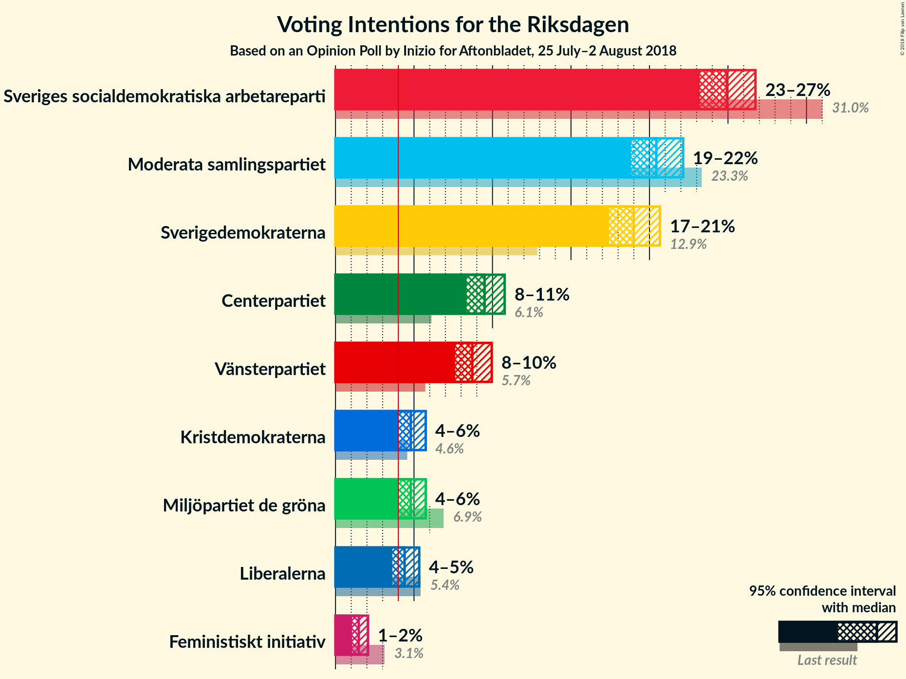

# Opinion Poll by Inizio for Aftonbladet, 25 July–2 August 2018

<a href="#voting-intentions">Voting Intentions</a> | <a href="#seats">Seats</a> | <a href="#coalitions">Coalitions</a> | <a href="#technical-information">Technical Information</a>

## Voting Intentions

### Confidence Intervals

| Party | Last Result | Poll Result | 80% Confidence Interval | 90% Confidence Interval | 95% Confidence Interval | 99% Confidence Interval |
|:-----:|:-----------:|:-----------:|:-----------------------:|:-----------------------:|:-----------------------:|:-----------------------:|
| Sveriges socialdemokratiska arbetareparti | 31.0% | 24.9% | 23.7–26.1% |23.4–26.4% |23.2–26.7% |22.6–27.3% |
| Moderata samlingspartiet | 23.3% | 20.4% | 19.3–21.5% |19.0–21.8% |18.8–22.1% |18.3–22.6% |
| Sverigedemokraterna | 12.9% | 19.0% | 18.0–20.1% |17.7–20.4% |17.4–20.7% |17.0–21.2% |
| Centerpartiet | 6.1% | 9.5% | 8.7–10.3% |8.5–10.6% |8.4–10.8% |8.0–11.2% |
| Vänsterpartiet | 5.7% | 8.7% | 8.0–9.5% |7.8–9.8% |7.6–10.0% |7.3–10.3% |
| Miljöpartiet de gröna | 6.9% | 4.8% | 4.3–5.4% |4.1–5.6% |4.0–5.7% |3.7–6.1% |
| Kristdemokraterna | 4.6% | 4.8% | 4.3–5.4% |4.1–5.6% |4.0–5.7% |3.7–6.1% |
| Liberalerna | 5.4% | 4.4% | 3.9–5.0% |3.7–5.2% |3.6–5.3% |3.4–5.6% |

*Note:* The poll result column reflects the actual value used in the calculations. Published results may vary slightly, and in addition be rounded to fewer digits.

## Seats

### Confidence Intervals

| Party | Last Result | Median | 80% Confidence Interval | 90% Confidence Interval | 95% Confidence Interval | 99% Confidence Interval |
|:-----:|:-----------:|:------:|:-----------------------:|:-----------------------:|:-----------------------:|:-----------------------:|
| <a href="#sveriges-socialdemokratiska-arbetareparti">Sveriges socialdemokratiska arbetareparti</a> | 113 | 90 | 85–95 |84–97 |83–98 |81–101 |
| <a href="#moderata-samlingspartiet">Moderata samlingspartiet</a> | 84 | 74 | 69–79 |68–80 |67–82 |65–84 |
| <a href="#sverigedemokraterna">Sverigedemokraterna</a> | 49 | 68 | 65–73 |63–75 |62–76 |61–79 |
| <a href="#centerpartiet">Centerpartiet</a> | 22 | 34 | 32–38 |31–38 |30–39 |29–42 |
| <a href="#vänsterpartiet">Vänsterpartiet</a> | 21 | 32 | 29–35 |28–36 |27–36 |26–38 |
| <a href="#miljöpartiet-de-gröna">Miljöpartiet de gröna</a> | 25 | 17 | 15–20 |15–20 |14–21 |0–22 |
| <a href="#kristdemokraterna">Kristdemokraterna</a> | 16 | 17 | 15–20 |15–20 |0–21 |0–22 |
| <a href="#liberalerna">Liberalerna</a> | 19 | 16 | 0–18 |0–19 |0–19 |0–20 |

### Sveriges socialdemokratiska arbetareparti

*For a full overview of the results for this party, see the [Sveriges socialdemokratiska arbetareparti](party-sverigessocialdemokratiskaarbetareparti.html) page.*

| Number of Seats | Probability | Accumulated | Special Marks |
|:---------------:|:-----------:|:-----------:|:-------------:|
| 78 | 0.1% | 100% |  |
| 79 | 0.1% | 99.9% |  |
| 80 | 0.2% | 99.8% |  |
| 81 | 1.0% | 99.5% |  |
| 82 | 0.8% | 98.5% |  |
| 83 | 1.1% | 98% |  |
| 84 | 3% | 97% |  |
| 85 | 4% | 93% |  |
| 86 | 6% | 89% |  |
| 87 | 10% | 83% |  |
| 88 | 10% | 74% |  |
| 89 | 6% | 64% |  |
| 90 | 15% | 57% | Median |
| 91 | 6% | 42% |  |
| 92 | 6% | 36% |  |
| 93 | 9% | 30% |  |
| 94 | 6% | 21% |  |
| 95 | 4% | 14% |  |
| 96 | 4% | 10% |  |
| 97 | 3% | 6% |  |
| 98 | 2% | 3% |  |
| 99 | 0.8% | 2% |  |
| 100 | 0.4% | 1.0% |  |
| 101 | 0.3% | 0.6% |  |
| 102 | 0.1% | 0.4% |  |
| 103 | 0.1% | 0.2% |  |
| 104 | 0% | 0.1% |  |
| 105 | 0.1% | 0.1% |  |
| 106 | 0% | 0% |  |
| 107 | 0% | 0% |  |
| 108 | 0% | 0% |  |
| 109 | 0% | 0% |  |
| 110 | 0% | 0% |  |
| 111 | 0% | 0% |  |
| 112 | 0% | 0% |  |
| 113 | 0% | 0% | Last Result |

### Moderata samlingspartiet

*For a full overview of the results for this party, see the [Moderata samlingspartiet](party-moderatasamlingspartiet.html) page.*

| Number of Seats | Probability | Accumulated | Special Marks |
|:---------------:|:-----------:|:-----------:|:-------------:|
| 63 | 0.1% | 100% |  |
| 64 | 0.2% | 99.9% |  |
| 65 | 0.5% | 99.7% |  |
| 66 | 0.9% | 99.2% |  |
| 67 | 2% | 98% |  |
| 68 | 2% | 96% |  |
| 69 | 5% | 94% |  |
| 70 | 6% | 90% |  |
| 71 | 8% | 84% |  |
| 72 | 9% | 75% |  |
| 73 | 14% | 66% |  |
| 74 | 9% | 53% | Median |
| 75 | 11% | 43% |  |
| 76 | 10% | 32% |  |
| 77 | 4% | 22% |  |
| 78 | 7% | 18% |  |
| 79 | 4% | 10% |  |
| 80 | 3% | 7% |  |
| 81 | 1.2% | 4% |  |
| 82 | 1.4% | 3% |  |
| 83 | 0.6% | 1.4% |  |
| 84 | 0.6% | 0.8% | Last Result |
| 85 | 0.1% | 0.2% |  |
| 86 | 0.1% | 0.1% |  |
| 87 | 0% | 0.1% |  |
| 88 | 0% | 0% |  |

### Sverigedemokraterna

*For a full overview of the results for this party, see the [Sverigedemokraterna](party-sverigedemokraterna.html) page.*

| Number of Seats | Probability | Accumulated | Special Marks |
|:---------------:|:-----------:|:-----------:|:-------------:|
| 49 | 0% | 100% | Last Result |
| 50 | 0% | 100% |  |
| 51 | 0% | 100% |  |
| 52 | 0% | 100% |  |
| 53 | 0% | 100% |  |
| 54 | 0% | 100% |  |
| 55 | 0% | 100% |  |
| 56 | 0% | 100% |  |
| 57 | 0% | 100% |  |
| 58 | 0% | 100% |  |
| 59 | 0.1% | 99.9% |  |
| 60 | 0.3% | 99.8% |  |
| 61 | 0.8% | 99.5% |  |
| 62 | 2% | 98.7% |  |
| 63 | 2% | 97% |  |
| 64 | 4% | 95% |  |
| 65 | 8% | 91% |  |
| 66 | 7% | 83% |  |
| 67 | 11% | 75% |  |
| 68 | 15% | 64% | Median |
| 69 | 11% | 49% |  |
| 70 | 10% | 38% |  |
| 71 | 8% | 28% |  |
| 72 | 6% | 20% |  |
| 73 | 4% | 14% |  |
| 74 | 4% | 10% |  |
| 75 | 2% | 6% |  |
| 76 | 2% | 4% |  |
| 77 | 0.8% | 2% |  |
| 78 | 0.5% | 1.0% |  |
| 79 | 0.3% | 0.5% |  |
| 80 | 0.1% | 0.3% |  |
| 81 | 0.1% | 0.2% |  |
| 82 | 0% | 0% |  |

### Centerpartiet

*For a full overview of the results for this party, see the [Centerpartiet](party-centerpartiet.html) page.*

| Number of Seats | Probability | Accumulated | Special Marks |
|:---------------:|:-----------:|:-----------:|:-------------:|
| 22 | 0% | 100% | Last Result |
| 23 | 0% | 100% |  |
| 24 | 0% | 100% |  |
| 25 | 0% | 100% |  |
| 26 | 0% | 100% |  |
| 27 | 0.1% | 100% |  |
| 28 | 0.2% | 99.9% |  |
| 29 | 0.9% | 99.7% |  |
| 30 | 2% | 98.9% |  |
| 31 | 7% | 97% |  |
| 32 | 13% | 90% |  |
| 33 | 13% | 77% |  |
| 34 | 17% | 64% | Median |
| 35 | 10% | 47% |  |
| 36 | 19% | 37% |  |
| 37 | 5% | 19% |  |
| 38 | 10% | 13% |  |
| 39 | 1.1% | 3% |  |
| 40 | 1.5% | 2% |  |
| 41 | 0.3% | 0.8% |  |
| 42 | 0.4% | 0.5% |  |
| 43 | 0.1% | 0.1% |  |
| 44 | 0.1% | 0.1% |  |
| 45 | 0% | 0% |  |

### Vänsterpartiet

*For a full overview of the results for this party, see the [Vänsterpartiet](party-vänsterpartiet.html) page.*

| Number of Seats | Probability | Accumulated | Special Marks |
|:---------------:|:-----------:|:-----------:|:-------------:|
| 21 | 0% | 100% | Last Result |
| 22 | 0% | 100% |  |
| 23 | 0% | 100% |  |
| 24 | 0% | 100% |  |
| 25 | 0.2% | 100% |  |
| 26 | 0.6% | 99.8% |  |
| 27 | 2% | 99.2% |  |
| 28 | 6% | 97% |  |
| 29 | 8% | 91% |  |
| 30 | 15% | 83% |  |
| 31 | 18% | 69% |  |
| 32 | 17% | 51% | Median |
| 33 | 13% | 34% |  |
| 34 | 10% | 21% |  |
| 35 | 5% | 11% |  |
| 36 | 4% | 6% |  |
| 37 | 1.1% | 2% |  |
| 38 | 0.6% | 0.8% |  |
| 39 | 0.1% | 0.2% |  |
| 40 | 0.1% | 0.1% |  |
| 41 | 0% | 0% |  |

### Miljöpartiet de gröna

*For a full overview of the results for this party, see the [Miljöpartiet de gröna](party-miljöpartietdegröna.html) page.*

| Number of Seats | Probability | Accumulated | Special Marks |
|:---------------:|:-----------:|:-----------:|:-------------:|
| 0 | 2% | 100% |  |
| 1 | 0% | 98% |  |
| 2 | 0% | 98% |  |
| 3 | 0% | 98% |  |
| 4 | 0% | 98% |  |
| 5 | 0% | 98% |  |
| 6 | 0% | 98% |  |
| 7 | 0% | 98% |  |
| 8 | 0% | 98% |  |
| 9 | 0% | 98% |  |
| 10 | 0% | 98% |  |
| 11 | 0% | 98% |  |
| 12 | 0% | 98% |  |
| 13 | 0% | 98% |  |
| 14 | 1.0% | 98% |  |
| 15 | 10% | 97% |  |
| 16 | 20% | 87% |  |
| 17 | 18% | 68% | Median |
| 18 | 23% | 50% |  |
| 19 | 14% | 27% |  |
| 20 | 8% | 13% |  |
| 21 | 3% | 4% |  |
| 22 | 0.9% | 1.2% |  |
| 23 | 0.2% | 0.3% |  |
| 24 | 0% | 0% |  |
| 25 | 0% | 0% | Last Result |

### Kristdemokraterna

*For a full overview of the results for this party, see the [Kristdemokraterna](party-kristdemokraterna.html) page.*

| Number of Seats | Probability | Accumulated | Special Marks |
|:---------------:|:-----------:|:-----------:|:-------------:|
| 0 | 3% | 100% |  |
| 1 | 0% | 97% |  |
| 2 | 0% | 97% |  |
| 3 | 0% | 97% |  |
| 4 | 0% | 97% |  |
| 5 | 0% | 97% |  |
| 6 | 0% | 97% |  |
| 7 | 0% | 97% |  |
| 8 | 0% | 97% |  |
| 9 | 0% | 97% |  |
| 10 | 0% | 97% |  |
| 11 | 0% | 97% |  |
| 12 | 0% | 97% |  |
| 13 | 0% | 97% |  |
| 14 | 0.3% | 97% |  |
| 15 | 9% | 97% |  |
| 16 | 18% | 88% | Last Result |
| 17 | 24% | 70% | Median |
| 18 | 20% | 46% |  |
| 19 | 16% | 27% |  |
| 20 | 7% | 11% |  |
| 21 | 2% | 4% |  |
| 22 | 1.5% | 2% |  |
| 23 | 0.2% | 0.2% |  |
| 24 | 0% | 0.1% |  |
| 25 | 0% | 0% |  |

### Liberalerna

*For a full overview of the results for this party, see the [Liberalerna](party-liberalerna.html) page.*

| Number of Seats | Probability | Accumulated | Special Marks |
|:---------------:|:-----------:|:-----------:|:-------------:|
| 0 | 16% | 100% |  |
| 1 | 0% | 84% |  |
| 2 | 0% | 84% |  |
| 3 | 0% | 84% |  |
| 4 | 0% | 84% |  |
| 5 | 0% | 84% |  |
| 6 | 0% | 84% |  |
| 7 | 0% | 84% |  |
| 8 | 0% | 84% |  |
| 9 | 0% | 84% |  |
| 10 | 0% | 84% |  |
| 11 | 0% | 84% |  |
| 12 | 0% | 84% |  |
| 13 | 0% | 84% |  |
| 14 | 2% | 84% |  |
| 15 | 23% | 82% |  |
| 16 | 24% | 59% | Median |
| 17 | 18% | 35% |  |
| 18 | 11% | 17% |  |
| 19 | 5% | 6% | Last Result |
| 20 | 1.2% | 2% |  |
| 21 | 0.3% | 0.3% |  |
| 22 | 0.1% | 0.1% |  |
| 23 | 0% | 0% |  |

## Coalitions

### Confidence Intervals

| Coalition | Last Result | Median | Majority? | 80% Confidence Interval | 90% Confidence Interval | 95% Confidence Interval | 99% Confidence Interval |
|:---------:|:-----------:|:------:|:---------:|:-----------------------:|:-----------------------:|:-----------------------:|:-----------------------:|
| Sveriges socialdemokratiska arbetareparti – Moderata samlingspartiet | 197 | 164 | 4% | 157–171 | 155–174 | 154–176 | 150–180 |
| Moderata samlingspartiet – Sverigedemokraterna | 133 | 142 | 0% | 136–150 | 135–152 | 133–154 | 131–158 |
| Sveriges socialdemokratiska arbetareparti – Vänsterpartiet – Miljöpartiet de gröna | 159 | 139 | 0% | 133–145 | 131–148 | 129–149 | 124–153 |
| Moderata samlingspartiet – Centerpartiet – Kristdemokraterna – Liberalerna | 141 | 140 | 0% | 130–146 | 128–147 | 125–148 | 120–151 |
| Moderata samlingspartiet – Centerpartiet – Kristdemokraterna | 122 | 126 | 0% | 119–132 | 118–134 | 115–136 | 110–139 |
| Moderata samlingspartiet – Centerpartiet – Liberalerna | 125 | 123 | 0% | 114–128 | 110–130 | 108–132 | 105–135 |
| Sveriges socialdemokratiska arbetareparti – Vänsterpartiet | 134 | 122 | 0% | 116–128 | 114–129 | 113–131 | 110–135 |
| Moderata samlingspartiet – Centerpartiet | 106 | 109 | 0% | 103–114 | 102–116 | 100–118 | 97–121 |
| Sveriges socialdemokratiska arbetareparti – Miljöpartiet de gröna | 138 | 107 | 0% | 102–113 | 100–115 | 97–116 | 93–119 |

### Sveriges socialdemokratiska arbetareparti – Moderata samlingspartiet

| Number of Seats | Probability | Accumulated | Special Marks |
|:---------------:|:-----------:|:-----------:|:-------------:|
| 147 | 0% | 100% |  |
| 148 | 0.1% | 99.9% |  |
| 149 | 0.1% | 99.9% |  |
| 150 | 0.3% | 99.8% |  |
| 151 | 0.4% | 99.5% |  |
| 152 | 0.6% | 99.1% |  |
| 153 | 0.8% | 98% |  |
| 154 | 2% | 98% |  |
| 155 | 1.2% | 96% |  |
| 156 | 3% | 95% |  |
| 157 | 2% | 92% |  |
| 158 | 6% | 90% |  |
| 159 | 4% | 84% |  |
| 160 | 5% | 80% |  |
| 161 | 7% | 75% |  |
| 162 | 8% | 68% |  |
| 163 | 8% | 60% |  |
| 164 | 4% | 52% | Median |
| 165 | 10% | 48% |  |
| 166 | 9% | 39% |  |
| 167 | 4% | 30% |  |
| 168 | 4% | 26% |  |
| 169 | 6% | 22% |  |
| 170 | 5% | 16% |  |
| 171 | 1.4% | 11% |  |
| 172 | 2% | 9% |  |
| 173 | 2% | 8% |  |
| 174 | 2% | 6% |  |
| 175 | 0.9% | 4% | Majority |
| 176 | 0.6% | 3% |  |
| 177 | 0.8% | 2% |  |
| 178 | 0.3% | 1.2% |  |
| 179 | 0.3% | 0.9% |  |
| 180 | 0.1% | 0.6% |  |
| 181 | 0.2% | 0.5% |  |
| 182 | 0.1% | 0.3% |  |
| 183 | 0% | 0.3% |  |
| 184 | 0.1% | 0.2% |  |
| 185 | 0% | 0.1% |  |
| 186 | 0% | 0.1% |  |
| 187 | 0% | 0% |  |
| 188 | 0% | 0% |  |
| 189 | 0% | 0% |  |
| 190 | 0% | 0% |  |
| 191 | 0% | 0% |  |
| 192 | 0% | 0% |  |
| 193 | 0% | 0% |  |
| 194 | 0% | 0% |  |
| 195 | 0% | 0% |  |
| 196 | 0% | 0% |  |
| 197 | 0% | 0% | Last Result |

### Moderata samlingspartiet – Sverigedemokraterna

| Number of Seats | Probability | Accumulated | Special Marks |
|:---------------:|:-----------:|:-----------:|:-------------:|
| 127 | 0% | 100% |  |
| 128 | 0% | 99.9% |  |
| 129 | 0.1% | 99.9% |  |
| 130 | 0.3% | 99.8% |  |
| 131 | 0.7% | 99.5% |  |
| 132 | 0.7% | 98.8% |  |
| 133 | 2% | 98% | Last Result |
| 134 | 1.5% | 96% |  |
| 135 | 2% | 95% |  |
| 136 | 3% | 93% |  |
| 137 | 4% | 89% |  |
| 138 | 5% | 85% |  |
| 139 | 5% | 80% |  |
| 140 | 8% | 75% |  |
| 141 | 9% | 67% |  |
| 142 | 10% | 58% | Median |
| 143 | 10% | 48% |  |
| 144 | 2% | 38% |  |
| 145 | 7% | 35% |  |
| 146 | 8% | 28% |  |
| 147 | 4% | 21% |  |
| 148 | 2% | 16% |  |
| 149 | 3% | 14% |  |
| 150 | 3% | 11% |  |
| 151 | 0.9% | 7% |  |
| 152 | 2% | 7% |  |
| 153 | 2% | 5% |  |
| 154 | 0.5% | 3% |  |
| 155 | 0.9% | 2% |  |
| 156 | 0.5% | 2% |  |
| 157 | 0.5% | 1.0% |  |
| 158 | 0.1% | 0.6% |  |
| 159 | 0.2% | 0.4% |  |
| 160 | 0% | 0.2% |  |
| 161 | 0.1% | 0.2% |  |
| 162 | 0% | 0.1% |  |
| 163 | 0% | 0.1% |  |
| 164 | 0% | 0% |  |

### Sveriges socialdemokratiska arbetareparti – Vänsterpartiet – Miljöpartiet de gröna

| Number of Seats | Probability | Accumulated | Special Marks |
|:---------------:|:-----------:|:-----------:|:-------------:|
| 118 | 0% | 100% |  |
| 119 | 0% | 99.9% |  |
| 120 | 0% | 99.9% |  |
| 121 | 0.2% | 99.9% |  |
| 122 | 0.1% | 99.7% |  |
| 123 | 0% | 99.6% |  |
| 124 | 0.1% | 99.6% |  |
| 125 | 0.2% | 99.4% |  |
| 126 | 0.5% | 99.3% |  |
| 127 | 0.4% | 98.7% |  |
| 128 | 0.5% | 98% |  |
| 129 | 1.0% | 98% |  |
| 130 | 2% | 97% |  |
| 131 | 2% | 95% |  |
| 132 | 2% | 93% |  |
| 133 | 3% | 91% |  |
| 134 | 6% | 88% |  |
| 135 | 6% | 82% |  |
| 136 | 8% | 76% |  |
| 137 | 6% | 69% |  |
| 138 | 6% | 62% |  |
| 139 | 9% | 56% | Median |
| 140 | 8% | 47% |  |
| 141 | 9% | 39% |  |
| 142 | 7% | 30% |  |
| 143 | 6% | 23% |  |
| 144 | 4% | 17% |  |
| 145 | 3% | 13% |  |
| 146 | 3% | 10% |  |
| 147 | 2% | 7% |  |
| 148 | 2% | 5% |  |
| 149 | 0.7% | 3% |  |
| 150 | 0.6% | 2% |  |
| 151 | 0.3% | 2% |  |
| 152 | 0.7% | 1.2% |  |
| 153 | 0.1% | 0.5% |  |
| 154 | 0.2% | 0.4% |  |
| 155 | 0.1% | 0.2% |  |
| 156 | 0.1% | 0.2% |  |
| 157 | 0% | 0.1% |  |
| 158 | 0% | 0.1% |  |
| 159 | 0% | 0.1% | Last Result |
| 160 | 0% | 0% |  |

### Moderata samlingspartiet – Centerpartiet – Kristdemokraterna – Liberalerna

| Number of Seats | Probability | Accumulated | Special Marks |
|:---------------:|:-----------:|:-----------:|:-------------:|
| 115 | 0% | 100% |  |
| 116 | 0% | 99.9% |  |
| 117 | 0% | 99.9% |  |
| 118 | 0% | 99.8% |  |
| 119 | 0.3% | 99.8% |  |
| 120 | 0.2% | 99.6% |  |
| 121 | 0.1% | 99.4% |  |
| 122 | 0.2% | 99.3% |  |
| 123 | 0.2% | 99.1% |  |
| 124 | 0.4% | 98.9% |  |
| 125 | 1.5% | 98.5% |  |
| 126 | 0.8% | 97% |  |
| 127 | 1.0% | 96% |  |
| 128 | 2% | 95% |  |
| 129 | 1.3% | 93% |  |
| 130 | 2% | 92% |  |
| 131 | 1.4% | 90% |  |
| 132 | 1.4% | 88% |  |
| 133 | 3% | 87% |  |
| 134 | 5% | 84% |  |
| 135 | 3% | 79% |  |
| 136 | 3% | 76% |  |
| 137 | 5% | 73% |  |
| 138 | 7% | 68% |  |
| 139 | 9% | 61% |  |
| 140 | 5% | 52% |  |
| 141 | 5% | 47% | Last Result, Median |
| 142 | 9% | 42% |  |
| 143 | 6% | 33% |  |
| 144 | 7% | 27% |  |
| 145 | 7% | 20% |  |
| 146 | 6% | 14% |  |
| 147 | 4% | 8% |  |
| 148 | 2% | 4% |  |
| 149 | 1.0% | 2% |  |
| 150 | 0.7% | 1.5% |  |
| 151 | 0.3% | 0.8% |  |
| 152 | 0.2% | 0.5% |  |
| 153 | 0.1% | 0.3% |  |
| 154 | 0.1% | 0.2% |  |
| 155 | 0.1% | 0.1% |  |
| 156 | 0% | 0.1% |  |
| 157 | 0% | 0% |  |

### Moderata samlingspartiet – Centerpartiet – Kristdemokraterna

| Number of Seats | Probability | Accumulated | Special Marks |
|:---------------:|:-----------:|:-----------:|:-------------:|
| 105 | 0% | 100% |  |
| 106 | 0% | 99.9% |  |
| 107 | 0% | 99.9% |  |
| 108 | 0.2% | 99.9% |  |
| 109 | 0.1% | 99.6% |  |
| 110 | 0.2% | 99.6% |  |
| 111 | 0.3% | 99.3% |  |
| 112 | 0.1% | 99.0% |  |
| 113 | 0.5% | 98.9% |  |
| 114 | 0.5% | 98% |  |
| 115 | 0.8% | 98% |  |
| 116 | 0.8% | 97% |  |
| 117 | 0.8% | 96% |  |
| 118 | 4% | 95% |  |
| 119 | 3% | 91% |  |
| 120 | 3% | 89% |  |
| 121 | 8% | 86% |  |
| 122 | 5% | 78% | Last Result |
| 123 | 7% | 73% |  |
| 124 | 7% | 66% |  |
| 125 | 6% | 59% | Median |
| 126 | 8% | 53% |  |
| 127 | 8% | 45% |  |
| 128 | 8% | 36% |  |
| 129 | 9% | 28% |  |
| 130 | 5% | 19% |  |
| 131 | 4% | 14% |  |
| 132 | 3% | 10% |  |
| 133 | 2% | 8% |  |
| 134 | 1.1% | 6% |  |
| 135 | 2% | 5% |  |
| 136 | 0.8% | 3% |  |
| 137 | 0.7% | 2% |  |
| 138 | 0.7% | 2% |  |
| 139 | 0.8% | 1.0% |  |
| 140 | 0% | 0.2% |  |
| 141 | 0.1% | 0.2% |  |
| 142 | 0.1% | 0.1% |  |
| 143 | 0% | 0.1% |  |
| 144 | 0% | 0% |  |

### Moderata samlingspartiet – Centerpartiet – Liberalerna

| Number of Seats | Probability | Accumulated | Special Marks |
|:---------------:|:-----------:|:-----------:|:-------------:|
| 102 | 0.1% | 100% |  |
| 103 | 0% | 99.8% |  |
| 104 | 0.2% | 99.8% |  |
| 105 | 0.2% | 99.6% |  |
| 106 | 0.3% | 99.4% |  |
| 107 | 0.2% | 99.1% |  |
| 108 | 2% | 98.8% |  |
| 109 | 0.6% | 97% |  |
| 110 | 2% | 97% |  |
| 111 | 2% | 95% |  |
| 112 | 1.3% | 93% |  |
| 113 | 0.7% | 92% |  |
| 114 | 2% | 91% |  |
| 115 | 2% | 89% |  |
| 116 | 3% | 86% |  |
| 117 | 2% | 83% |  |
| 118 | 5% | 81% |  |
| 119 | 4% | 76% |  |
| 120 | 7% | 72% |  |
| 121 | 3% | 66% |  |
| 122 | 8% | 63% |  |
| 123 | 10% | 55% |  |
| 124 | 11% | 45% | Median |
| 125 | 3% | 34% | Last Result |
| 126 | 3% | 31% |  |
| 127 | 7% | 27% |  |
| 128 | 12% | 20% |  |
| 129 | 2% | 9% |  |
| 130 | 2% | 6% |  |
| 131 | 1.3% | 4% |  |
| 132 | 1.0% | 3% |  |
| 133 | 1.0% | 2% |  |
| 134 | 0.3% | 0.9% |  |
| 135 | 0.2% | 0.6% |  |
| 136 | 0.1% | 0.5% |  |
| 137 | 0.2% | 0.4% |  |
| 138 | 0% | 0.1% |  |
| 139 | 0% | 0.1% |  |
| 140 | 0% | 0.1% |  |
| 141 | 0% | 0% |  |

### Sveriges socialdemokratiska arbetareparti – Vänsterpartiet

| Number of Seats | Probability | Accumulated | Special Marks |
|:---------------:|:-----------:|:-----------:|:-------------:|
| 108 | 0.1% | 100% |  |
| 109 | 0.2% | 99.9% |  |
| 110 | 0.4% | 99.7% |  |
| 111 | 0.3% | 99.3% |  |
| 112 | 0.8% | 99.0% |  |
| 113 | 0.9% | 98% |  |
| 114 | 2% | 97% |  |
| 115 | 3% | 95% |  |
| 116 | 4% | 92% |  |
| 117 | 7% | 88% |  |
| 118 | 4% | 81% |  |
| 119 | 7% | 77% |  |
| 120 | 8% | 70% |  |
| 121 | 10% | 62% |  |
| 122 | 8% | 52% | Median |
| 123 | 7% | 44% |  |
| 124 | 12% | 36% |  |
| 125 | 6% | 25% |  |
| 126 | 4% | 19% |  |
| 127 | 5% | 16% |  |
| 128 | 3% | 10% |  |
| 129 | 2% | 7% |  |
| 130 | 1.2% | 5% |  |
| 131 | 2% | 4% |  |
| 132 | 0.6% | 2% |  |
| 133 | 0.4% | 1.4% |  |
| 134 | 0.4% | 0.9% | Last Result |
| 135 | 0.2% | 0.6% |  |
| 136 | 0.1% | 0.4% |  |
| 137 | 0% | 0.2% |  |
| 138 | 0.1% | 0.2% |  |
| 139 | 0% | 0.1% |  |
| 140 | 0% | 0.1% |  |
| 141 | 0% | 0.1% |  |
| 142 | 0% | 0% |  |

### Moderata samlingspartiet – Centerpartiet

| Number of Seats | Probability | Accumulated | Special Marks |
|:---------------:|:-----------:|:-----------:|:-------------:|
| 94 | 0% | 100% |  |
| 95 | 0% | 99.9% |  |
| 96 | 0.1% | 99.9% |  |
| 97 | 0.4% | 99.8% |  |
| 98 | 0.5% | 99.4% |  |
| 99 | 1.1% | 98.9% |  |
| 100 | 0.9% | 98% |  |
| 101 | 2% | 97% |  |
| 102 | 4% | 95% |  |
| 103 | 4% | 91% |  |
| 104 | 6% | 87% |  |
| 105 | 8% | 81% |  |
| 106 | 7% | 73% | Last Result |
| 107 | 8% | 66% |  |
| 108 | 8% | 58% | Median |
| 109 | 10% | 50% |  |
| 110 | 9% | 40% |  |
| 111 | 6% | 31% |  |
| 112 | 9% | 25% |  |
| 113 | 3% | 16% |  |
| 114 | 3% | 12% |  |
| 115 | 3% | 10% |  |
| 116 | 2% | 6% |  |
| 117 | 0.8% | 4% |  |
| 118 | 0.8% | 3% |  |
| 119 | 0.6% | 2% |  |
| 120 | 1.1% | 2% |  |
| 121 | 0.4% | 0.7% |  |
| 122 | 0.1% | 0.3% |  |
| 123 | 0.1% | 0.2% |  |
| 124 | 0% | 0.1% |  |
| 125 | 0% | 0.1% |  |
| 126 | 0% | 0% |  |

### Sveriges socialdemokratiska arbetareparti – Miljöpartiet de gröna

| Number of Seats | Probability | Accumulated | Special Marks |
|:---------------:|:-----------:|:-----------:|:-------------:|
| 87 | 0.1% | 100% |  |
| 88 | 0.2% | 99.9% |  |
| 89 | 0% | 99.7% |  |
| 90 | 0.1% | 99.7% |  |
| 91 | 0.1% | 99.6% |  |
| 92 | 0% | 99.5% |  |
| 93 | 0.3% | 99.5% |  |
| 94 | 0.4% | 99.2% |  |
| 95 | 0.3% | 98.8% |  |
| 96 | 0.6% | 98.6% |  |
| 97 | 0.7% | 98% |  |
| 98 | 1.0% | 97% |  |
| 99 | 0.7% | 96% |  |
| 100 | 2% | 96% |  |
| 101 | 2% | 94% |  |
| 102 | 3% | 92% |  |
| 103 | 7% | 89% |  |
| 104 | 8% | 83% |  |
| 105 | 10% | 75% |  |
| 106 | 12% | 65% |  |
| 107 | 8% | 53% | Median |
| 108 | 5% | 45% |  |
| 109 | 6% | 41% |  |
| 110 | 7% | 35% |  |
| 111 | 10% | 28% |  |
| 112 | 4% | 18% |  |
| 113 | 4% | 13% |  |
| 114 | 3% | 9% |  |
| 115 | 3% | 6% |  |
| 116 | 2% | 4% |  |
| 117 | 0.6% | 2% |  |
| 118 | 0.7% | 1.4% |  |
| 119 | 0.3% | 0.7% |  |
| 120 | 0.1% | 0.3% |  |
| 121 | 0.1% | 0.2% |  |
| 122 | 0% | 0.2% |  |
| 123 | 0.1% | 0.1% |  |
| 124 | 0% | 0.1% |  |
| 125 | 0% | 0% |  |
| 126 | 0% | 0% |  |
| 127 | 0% | 0% |  |
| 128 | 0% | 0% |  |
| 129 | 0% | 0% |  |
| 130 | 0% | 0% |  |
| 131 | 0% | 0% |  |
| 132 | 0% | 0% |  |
| 133 | 0% | 0% |  |
| 134 | 0% | 0% |  |
| 135 | 0% | 0% |  |
| 136 | 0% | 0% |  |
| 137 | 0% | 0% |  |
| 138 | 0% | 0% | Last Result |

## Technical Information

### Opinion Poll

+ **Polling firm:** Inizio
+ **Commissioner(s):** Aftonbladet
+ **Fieldwork period:** 25 July–2 August 2018

### Calculations

+ **Sample size:** 2295
+ **Simulations done:** 1,048,576
+ **Error estimate:** 0.90%

