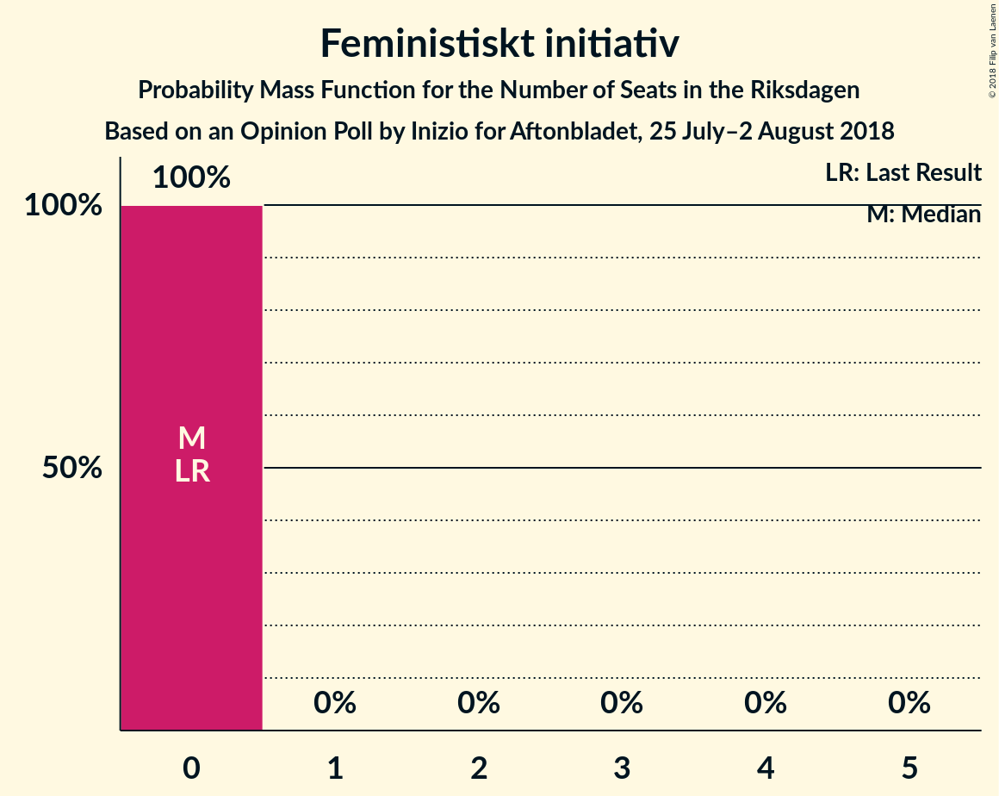

# Opinion Poll by Inizio for Aftonbladet, 25 July–2 August 2018

<a href="#voting-intentions">Voting Intentions</a> | <a href="#seats">Seats</a> | <a href="#coalitions">Coalitions</a> | <a href="#technical-information">Technical Information</a>

## Voting Intentions

### Confidence Intervals

| Party | Last Result | Poll Result | 80% Confidence Interval | 90% Confidence Interval | 95% Confidence Interval | 99% Confidence Interval |
|:-----:|:-----------:|:-----------:|:-----------------------:|:-----------------------:|:-----------------------:|:-----------------------:|
| Sveriges socialdemokratiska arbetareparti | 31.0% | 24.9% | 23.8–26.1% |23.5–26.4% |23.2–26.7% |22.6–27.3% |
| Moderata samlingspartiet | 23.3% | 20.4% | 19.4–21.6% |19.1–21.9% |18.8–22.1% |18.3–22.7% |
| Sverigedemokraterna | 12.9% | 19.0% | 18.0–20.1% |17.7–20.4% |17.4–20.7% |17.0–21.2% |
| Centerpartiet | 6.1% | 9.5% | 8.7–10.3% |8.5–10.6% |8.4–10.8% |8.0–11.2% |
| Vänsterpartiet | 5.7% | 8.7% | 8.0–9.5% |7.8–9.8% |7.6–10.0% |7.3–10.3% |
| Miljöpartiet de gröna | 6.9% | 4.8% | 4.3–5.4% |4.1–5.6% |4.0–5.7% |3.7–6.1% |
| Kristdemokraterna | 4.6% | 4.8% | 4.3–5.4% |4.1–5.6% |4.0–5.7% |3.7–6.1% |
| Liberalerna | 5.4% | 4.4% | 3.9–5.0% |3.7–5.2% |3.6–5.3% |3.4–5.6% |
| Feministiskt initiativ | 3.1% | 1.5% | 1.2–1.9% |1.1–2.0% |1.1–2.1% |0.9–2.3% |

*Note:* The poll result column reflects the actual value used in the calculations. Published results may vary slightly, and in addition be rounded to fewer digits.

## Seats

### Confidence Intervals

| Party | Last Result | Median | 80% Confidence Interval | 90% Confidence Interval | 95% Confidence Interval | 99% Confidence Interval |
|:-----:|:-----------:|:------:|:-----------------------:|:-----------------------:|:-----------------------:|:-----------------------:|
| <a href="#sveriges-socialdemokratiska-arbetareparti">Sveriges socialdemokratiska arbetareparti</a> | 113 | 90 | 87–95 |85–96 |85–98 |82–101 |
| <a href="#moderata-samlingspartiet">Moderata samlingspartiet</a> | 84 | 75 | 72–79 |70–80 |68–81 |66–84 |
| <a href="#sverigedemokraterna">Sverigedemokraterna</a> | 49 | 68 | 65–73 |65–74 |64–76 |62–80 |
| <a href="#centerpartiet">Centerpartiet</a> | 22 | 34 | 32–38 |31–38 |31–39 |29–41 |
| <a href="#vänsterpartiet">Vänsterpartiet</a> | 21 | 31 | 29–35 |28–36 |28–37 |27–38 |
| <a href="#miljöpartiet-de-gröna">Miljöpartiet de gröna</a> | 25 | 17 | 16–20 |15–20 |14–21 |0–22 |
| <a href="#kristdemokraterna">Kristdemokraterna</a> | 16 | 18 | 15–20 |15–20 |0–21 |0–22 |
| <a href="#liberalerna">Liberalerna</a> | 19 | 16 | 0–18 |0–18 |0–19 |0–21 |
| <a href="#feministiskt-initiativ">Feministiskt initiativ</a> | 0 | 0 | 0 |0 |0 |0 |

### Sveriges socialdemokratiska arbetareparti

*For a full overview of the results for this party, see the [Sveriges socialdemokratiska arbetareparti](party-sverigessocialdemokratiskaarbetareparti.html) page.*

| Number of Seats | Probability | Accumulated | Special Marks |
|:---------------:|:-----------:|:-----------:|:-------------:|
| 80 | 0% | 100% |  |
| 81 | 0.2% | 99.9% |  |
| 82 | 0.7% | 99.7% |  |
| 83 | 0.3% | 99.1% |  |
| 84 | 0.8% | 98.8% |  |
| 85 | 4% | 98% |  |
| 86 | 4% | 94% |  |
| 87 | 21% | 91% |  |
| 88 | 12% | 70% |  |
| 89 | 4% | 57% |  |
| 90 | 7% | 53% | Median |
| 91 | 14% | 47% |  |
| 92 | 9% | 32% |  |
| 93 | 8% | 24% |  |
| 94 | 3% | 16% |  |
| 95 | 6% | 13% |  |
| 96 | 2% | 7% |  |
| 97 | 2% | 5% |  |
| 98 | 1.1% | 3% |  |
| 99 | 0.9% | 2% |  |
| 100 | 0.3% | 1.1% |  |
| 101 | 0.4% | 0.8% |  |
| 102 | 0.1% | 0.3% |  |
| 103 | 0.2% | 0.3% |  |
| 104 | 0% | 0.1% |  |
| 105 | 0% | 0.1% |  |
| 106 | 0.1% | 0.1% |  |
| 107 | 0% | 0% |  |
| 108 | 0% | 0% |  |
| 109 | 0% | 0% |  |
| 110 | 0% | 0% |  |
| 111 | 0% | 0% |  |
| 112 | 0% | 0% |  |
| 113 | 0% | 0% | Last Result |

### Moderata samlingspartiet

*For a full overview of the results for this party, see the [Moderata samlingspartiet](party-moderatasamlingspartiet.html) page.*

| Number of Seats | Probability | Accumulated | Special Marks |
|:---------------:|:-----------:|:-----------:|:-------------:|
| 63 | 0.1% | 100% |  |
| 64 | 0% | 99.9% |  |
| 65 | 0.2% | 99.9% |  |
| 66 | 0.3% | 99.7% |  |
| 67 | 0.6% | 99.4% |  |
| 68 | 2% | 98.7% |  |
| 69 | 2% | 97% |  |
| 70 | 2% | 95% |  |
| 71 | 2% | 93% |  |
| 72 | 3% | 92% |  |
| 73 | 8% | 89% |  |
| 74 | 25% | 81% |  |
| 75 | 24% | 56% | Median |
| 76 | 6% | 32% |  |
| 77 | 5% | 26% |  |
| 78 | 10% | 20% |  |
| 79 | 4% | 11% |  |
| 80 | 4% | 7% |  |
| 81 | 0.9% | 3% |  |
| 82 | 1.0% | 2% |  |
| 83 | 0.7% | 1.3% |  |
| 84 | 0.4% | 0.6% | Last Result |
| 85 | 0.1% | 0.2% |  |
| 86 | 0% | 0.1% |  |
| 87 | 0% | 0% |  |

### Sverigedemokraterna

*For a full overview of the results for this party, see the [Sverigedemokraterna](party-sverigedemokraterna.html) page.*

| Number of Seats | Probability | Accumulated | Special Marks |
|:---------------:|:-----------:|:-----------:|:-------------:|
| 49 | 0% | 100% | Last Result |
| 50 | 0% | 100% |  |
| 51 | 0% | 100% |  |
| 52 | 0% | 100% |  |
| 53 | 0% | 100% |  |
| 54 | 0% | 100% |  |
| 55 | 0% | 100% |  |
| 56 | 0% | 100% |  |
| 57 | 0% | 100% |  |
| 58 | 0% | 100% |  |
| 59 | 0% | 100% |  |
| 60 | 0.1% | 99.9% |  |
| 61 | 0.1% | 99.9% |  |
| 62 | 0.8% | 99.8% |  |
| 63 | 1.3% | 99.0% |  |
| 64 | 3% | 98% |  |
| 65 | 8% | 95% |  |
| 66 | 20% | 88% |  |
| 67 | 4% | 67% |  |
| 68 | 20% | 63% | Median |
| 69 | 7% | 43% |  |
| 70 | 12% | 37% |  |
| 71 | 4% | 25% |  |
| 72 | 10% | 21% |  |
| 73 | 5% | 11% |  |
| 74 | 3% | 7% |  |
| 75 | 1.0% | 4% |  |
| 76 | 0.7% | 3% |  |
| 77 | 0.8% | 2% |  |
| 78 | 0.5% | 1.3% |  |
| 79 | 0.2% | 0.7% |  |
| 80 | 0.4% | 0.5% |  |
| 81 | 0.1% | 0.1% |  |
| 82 | 0% | 0% |  |

### Centerpartiet

*For a full overview of the results for this party, see the [Centerpartiet](party-centerpartiet.html) page.*

| Number of Seats | Probability | Accumulated | Special Marks |
|:---------------:|:-----------:|:-----------:|:-------------:|
| 22 | 0% | 100% | Last Result |
| 23 | 0% | 100% |  |
| 24 | 0% | 100% |  |
| 25 | 0% | 100% |  |
| 26 | 0% | 100% |  |
| 27 | 0% | 100% |  |
| 28 | 0.1% | 100% |  |
| 29 | 0.6% | 99.8% |  |
| 30 | 0.4% | 99.3% |  |
| 31 | 8% | 98.9% |  |
| 32 | 6% | 91% |  |
| 33 | 17% | 85% |  |
| 34 | 19% | 68% | Median |
| 35 | 16% | 50% |  |
| 36 | 17% | 33% |  |
| 37 | 4% | 16% |  |
| 38 | 7% | 12% |  |
| 39 | 3% | 5% |  |
| 40 | 1.5% | 2% |  |
| 41 | 0.4% | 0.7% |  |
| 42 | 0.2% | 0.3% |  |
| 43 | 0% | 0.1% |  |
| 44 | 0% | 0% |  |

### Vänsterpartiet

*For a full overview of the results for this party, see the [Vänsterpartiet](party-vänsterpartiet.html) page.*

| Number of Seats | Probability | Accumulated | Special Marks |
|:---------------:|:-----------:|:-----------:|:-------------:|
| 21 | 0% | 100% | Last Result |
| 22 | 0% | 100% |  |
| 23 | 0% | 100% |  |
| 24 | 0% | 100% |  |
| 25 | 0.1% | 100% |  |
| 26 | 0.4% | 99.9% |  |
| 27 | 0.6% | 99.5% |  |
| 28 | 6% | 98.9% |  |
| 29 | 4% | 92% |  |
| 30 | 24% | 89% |  |
| 31 | 15% | 65% | Median |
| 32 | 13% | 50% |  |
| 33 | 10% | 37% |  |
| 34 | 16% | 27% |  |
| 35 | 6% | 11% |  |
| 36 | 2% | 5% |  |
| 37 | 2% | 3% |  |
| 38 | 0.8% | 1.0% |  |
| 39 | 0.1% | 0.2% |  |
| 40 | 0% | 0% |  |

### Miljöpartiet de gröna

*For a full overview of the results for this party, see the [Miljöpartiet de gröna](party-miljöpartietdegröna.html) page.*

| Number of Seats | Probability | Accumulated | Special Marks |
|:---------------:|:-----------:|:-----------:|:-------------:|
| 0 | 2% | 100% |  |
| 1 | 0% | 98% |  |
| 2 | 0% | 98% |  |
| 3 | 0% | 98% |  |
| 4 | 0% | 98% |  |
| 5 | 0% | 98% |  |
| 6 | 0% | 98% |  |
| 7 | 0% | 98% |  |
| 8 | 0% | 98% |  |
| 9 | 0% | 98% |  |
| 10 | 0% | 98% |  |
| 11 | 0% | 98% |  |
| 12 | 0% | 98% |  |
| 13 | 0% | 98% |  |
| 14 | 0.9% | 98% |  |
| 15 | 6% | 97% |  |
| 16 | 22% | 91% |  |
| 17 | 21% | 69% | Median |
| 18 | 15% | 48% |  |
| 19 | 16% | 33% |  |
| 20 | 14% | 17% |  |
| 21 | 2% | 3% |  |
| 22 | 0.9% | 1.0% |  |
| 23 | 0.1% | 0.1% |  |
| 24 | 0% | 0% |  |
| 25 | 0% | 0% | Last Result |

### Kristdemokraterna

*For a full overview of the results for this party, see the [Kristdemokraterna](party-kristdemokraterna.html) page.*

| Number of Seats | Probability | Accumulated | Special Marks |
|:---------------:|:-----------:|:-----------:|:-------------:|
| 0 | 3% | 100% |  |
| 1 | 0% | 97% |  |
| 2 | 0% | 97% |  |
| 3 | 0% | 97% |  |
| 4 | 0% | 97% |  |
| 5 | 0% | 97% |  |
| 6 | 0% | 97% |  |
| 7 | 0% | 97% |  |
| 8 | 0% | 97% |  |
| 9 | 0% | 97% |  |
| 10 | 0% | 97% |  |
| 11 | 0% | 97% |  |
| 12 | 0% | 97% |  |
| 13 | 0% | 97% |  |
| 14 | 0.1% | 97% |  |
| 15 | 8% | 97% |  |
| 16 | 19% | 89% | Last Result |
| 17 | 17% | 71% |  |
| 18 | 30% | 54% | Median |
| 19 | 14% | 24% |  |
| 20 | 7% | 10% |  |
| 21 | 3% | 4% |  |
| 22 | 0.6% | 0.8% |  |
| 23 | 0.2% | 0.2% |  |
| 24 | 0% | 0% |  |

### Liberalerna

*For a full overview of the results for this party, see the [Liberalerna](party-liberalerna.html) page.*

| Number of Seats | Probability | Accumulated | Special Marks |
|:---------------:|:-----------:|:-----------:|:-------------:|
| 0 | 13% | 100% |  |
| 1 | 0% | 87% |  |
| 2 | 0% | 87% |  |
| 3 | 0% | 87% |  |
| 4 | 0% | 87% |  |
| 5 | 0% | 87% |  |
| 6 | 0% | 87% |  |
| 7 | 0% | 87% |  |
| 8 | 0% | 87% |  |
| 9 | 0% | 87% |  |
| 10 | 0% | 87% |  |
| 11 | 0% | 87% |  |
| 12 | 0% | 87% |  |
| 13 | 0% | 87% |  |
| 14 | 0.6% | 87% |  |
| 15 | 23% | 87% |  |
| 16 | 19% | 64% | Median |
| 17 | 30% | 45% |  |
| 18 | 11% | 15% |  |
| 19 | 3% | 4% | Last Result |
| 20 | 0.5% | 1.0% |  |
| 21 | 0.4% | 0.5% |  |
| 22 | 0.1% | 0.1% |  |
| 23 | 0% | 0% |  |

### Feministiskt initiativ

*For a full overview of the results for this party, see the [Feministiskt initiativ](party-feministisktinitiativ.html) page.*

| Number of Seats | Probability | Accumulated | Special Marks |
|:---------------:|:-----------:|:-----------:|:-------------:|
| 0 | 100% | 100% | Last Result, Median |

## Coalitions

### Confidence Intervals

| Coalition | Last Result | Median | Majority? | 80% Confidence Interval | 90% Confidence Interval | 95% Confidence Interval | 99% Confidence Interval |
|:---------:|:-----------:|:------:|:---------:|:-----------------------:|:-----------------------:|:-----------------------:|:-----------------------:|
| Sveriges socialdemokratiska arbetareparti – Moderata samlingspartiet | 197 | 165 | 4% | 160–172 | 159–173 | 157–177 | 154–180 |
| Moderata samlingspartiet – Sverigedemokraterna | 133 | 143 | 0% | 139–151 | 137–152 | 136–154 | 133–158 |
| Sveriges socialdemokratiska arbetareparti – Vänsterpartiet – Miljöpartiet de gröna – Feministiskt initiativ | 159 | 139 | 0% | 133–146 | 133–148 | 131–149 | 125–154 |
| Sveriges socialdemokratiska arbetareparti – Vänsterpartiet – Miljöpartiet de gröna | 159 | 139 | 0% | 133–146 | 133–148 | 131–149 | 125–154 |
| Moderata samlingspartiet – Centerpartiet – Kristdemokraterna – Liberalerna | 141 | 143 | 0% | 133–145 | 129–147 | 128–149 | 124–152 |
| Moderata samlingspartiet – Centerpartiet – Kristdemokraterna | 122 | 127 | 0% | 122–132 | 120–134 | 118–135 | 111–139 |
| Sveriges socialdemokratiska arbetareparti – Vänsterpartiet | 134 | 122 | 0% | 117–127 | 117–130 | 116–131 | 113–134 |
| Moderata samlingspartiet – Centerpartiet – Liberalerna | 125 | 125 | 0% | 117–127 | 113–130 | 112–131 | 107–136 |
| Moderata samlingspartiet – Centerpartiet | 106 | 109 | 0% | 106–114 | 104–117 | 103–118 | 100–121 |
| Sveriges socialdemokratiska arbetareparti – Miljöpartiet de gröna | 138 | 107 | 0% | 103–113 | 102–114 | 100–116 | 90–120 |

### Sveriges socialdemokratiska arbetareparti – Moderata samlingspartiet

| Number of Seats | Probability | Accumulated | Special Marks |
|:---------------:|:-----------:|:-----------:|:-------------:|
| 152 | 0.1% | 100% |  |
| 153 | 0.3% | 99.8% |  |
| 154 | 0.1% | 99.5% |  |
| 155 | 0.3% | 99.5% |  |
| 156 | 1.1% | 99.1% |  |
| 157 | 0.7% | 98% |  |
| 158 | 2% | 97% |  |
| 159 | 5% | 96% |  |
| 160 | 3% | 90% |  |
| 161 | 1.4% | 87% |  |
| 162 | 23% | 86% |  |
| 163 | 3% | 63% |  |
| 164 | 3% | 61% |  |
| 165 | 18% | 58% | Median |
| 166 | 9% | 40% |  |
| 167 | 2% | 31% |  |
| 168 | 6% | 28% |  |
| 169 | 9% | 22% |  |
| 170 | 2% | 13% |  |
| 171 | 1.1% | 11% |  |
| 172 | 4% | 10% |  |
| 173 | 2% | 6% |  |
| 174 | 1.0% | 5% |  |
| 175 | 0.4% | 4% | Majority |
| 176 | 0.3% | 3% |  |
| 177 | 0.8% | 3% |  |
| 178 | 1.0% | 2% |  |
| 179 | 0.3% | 1.1% |  |
| 180 | 0.3% | 0.8% |  |
| 181 | 0.1% | 0.4% |  |
| 182 | 0% | 0.4% |  |
| 183 | 0.3% | 0.3% |  |
| 184 | 0% | 0.1% |  |
| 185 | 0% | 0.1% |  |
| 186 | 0% | 0% |  |
| 187 | 0% | 0% |  |
| 188 | 0% | 0% |  |
| 189 | 0% | 0% |  |
| 190 | 0% | 0% |  |
| 191 | 0% | 0% |  |
| 192 | 0% | 0% |  |
| 193 | 0% | 0% |  |
| 194 | 0% | 0% |  |
| 195 | 0% | 0% |  |
| 196 | 0% | 0% |  |
| 197 | 0% | 0% | Last Result |

### Moderata samlingspartiet – Sverigedemokraterna

| Number of Seats | Probability | Accumulated | Special Marks |
|:---------------:|:-----------:|:-----------:|:-------------:|
| 131 | 0% | 100% |  |
| 132 | 0.1% | 99.9% |  |
| 133 | 0.4% | 99.8% | Last Result |
| 134 | 0.5% | 99.4% |  |
| 135 | 1.3% | 98.9% |  |
| 136 | 1.4% | 98% |  |
| 137 | 2% | 96% |  |
| 138 | 2% | 95% |  |
| 139 | 8% | 93% |  |
| 140 | 18% | 85% |  |
| 141 | 4% | 66% |  |
| 142 | 10% | 63% |  |
| 143 | 12% | 53% | Median |
| 144 | 4% | 41% |  |
| 145 | 10% | 37% |  |
| 146 | 1.1% | 27% |  |
| 147 | 5% | 26% |  |
| 148 | 2% | 21% |  |
| 149 | 1.0% | 20% |  |
| 150 | 8% | 19% |  |
| 151 | 2% | 10% |  |
| 152 | 3% | 8% |  |
| 153 | 0.9% | 5% |  |
| 154 | 2% | 4% |  |
| 155 | 0.7% | 2% |  |
| 156 | 0.1% | 1.0% |  |
| 157 | 0.3% | 0.9% |  |
| 158 | 0.3% | 0.6% |  |
| 159 | 0.2% | 0.3% |  |
| 160 | 0% | 0.1% |  |
| 161 | 0% | 0.1% |  |
| 162 | 0% | 0% |  |

### Sveriges socialdemokratiska arbetareparti – Vänsterpartiet – Miljöpartiet de gröna – Feministiskt initiativ

| Number of Seats | Probability | Accumulated | Special Marks |
|:---------------:|:-----------:|:-----------:|:-------------:|
| 121 | 0.2% | 100% |  |
| 122 | 0% | 99.8% |  |
| 123 | 0.1% | 99.8% |  |
| 124 | 0% | 99.7% |  |
| 125 | 0.6% | 99.7% |  |
| 126 | 0.1% | 99.1% |  |
| 127 | 0% | 99.0% |  |
| 128 | 0.1% | 99.0% |  |
| 129 | 0.1% | 98.9% |  |
| 130 | 0.8% | 98.8% |  |
| 131 | 1.0% | 98% |  |
| 132 | 1.1% | 97% |  |
| 133 | 8% | 96% |  |
| 134 | 1.0% | 88% |  |
| 135 | 2% | 87% |  |
| 136 | 1.4% | 85% |  |
| 137 | 15% | 84% |  |
| 138 | 17% | 69% | Median |
| 139 | 8% | 52% |  |
| 140 | 15% | 45% |  |
| 141 | 11% | 30% |  |
| 142 | 3% | 19% |  |
| 143 | 2% | 16% |  |
| 144 | 1.0% | 13% |  |
| 145 | 0.7% | 12% |  |
| 146 | 2% | 12% |  |
| 147 | 4% | 10% |  |
| 148 | 3% | 6% |  |
| 149 | 0.9% | 3% |  |
| 150 | 1.0% | 2% |  |
| 151 | 0.5% | 1.2% |  |
| 152 | 0.1% | 0.7% |  |
| 153 | 0% | 0.6% |  |
| 154 | 0.4% | 0.6% |  |
| 155 | 0.1% | 0.2% |  |
| 156 | 0% | 0.1% |  |
| 157 | 0.1% | 0.1% |  |
| 158 | 0% | 0% |  |
| 159 | 0% | 0% | Last Result |

### Sveriges socialdemokratiska arbetareparti – Vänsterpartiet – Miljöpartiet de gröna

| Number of Seats | Probability | Accumulated | Special Marks |
|:---------------:|:-----------:|:-----------:|:-------------:|
| 121 | 0.2% | 100% |  |
| 122 | 0% | 99.8% |  |
| 123 | 0.1% | 99.8% |  |
| 124 | 0% | 99.7% |  |
| 125 | 0.6% | 99.7% |  |
| 126 | 0.1% | 99.1% |  |
| 127 | 0% | 99.0% |  |
| 128 | 0.1% | 99.0% |  |
| 129 | 0.1% | 98.9% |  |
| 130 | 0.8% | 98.8% |  |
| 131 | 1.0% | 98% |  |
| 132 | 1.1% | 97% |  |
| 133 | 8% | 96% |  |
| 134 | 1.0% | 88% |  |
| 135 | 2% | 87% |  |
| 136 | 1.4% | 85% |  |
| 137 | 15% | 84% |  |
| 138 | 17% | 69% | Median |
| 139 | 8% | 52% |  |
| 140 | 15% | 45% |  |
| 141 | 11% | 30% |  |
| 142 | 3% | 19% |  |
| 143 | 2% | 16% |  |
| 144 | 1.0% | 13% |  |
| 145 | 0.7% | 12% |  |
| 146 | 2% | 12% |  |
| 147 | 4% | 10% |  |
| 148 | 3% | 6% |  |
| 149 | 0.9% | 3% |  |
| 150 | 1.0% | 2% |  |
| 151 | 0.5% | 1.2% |  |
| 152 | 0.1% | 0.7% |  |
| 153 | 0% | 0.6% |  |
| 154 | 0.4% | 0.6% |  |
| 155 | 0.1% | 0.2% |  |
| 156 | 0% | 0.1% |  |
| 157 | 0.1% | 0.1% |  |
| 158 | 0% | 0% |  |
| 159 | 0% | 0% | Last Result |

### Moderata samlingspartiet – Centerpartiet – Kristdemokraterna – Liberalerna

| Number of Seats | Probability | Accumulated | Special Marks |
|:---------------:|:-----------:|:-----------:|:-------------:|
| 114 | 0.1% | 100% |  |
| 115 | 0% | 99.9% |  |
| 116 | 0% | 99.9% |  |
| 117 | 0% | 99.9% |  |
| 118 | 0% | 99.9% |  |
| 119 | 0% | 99.9% |  |
| 120 | 0% | 99.9% |  |
| 121 | 0% | 99.9% |  |
| 122 | 0.1% | 99.9% |  |
| 123 | 0.2% | 99.8% |  |
| 124 | 0.4% | 99.6% |  |
| 125 | 0.1% | 99.2% |  |
| 126 | 0.7% | 99.0% |  |
| 127 | 0.5% | 98% |  |
| 128 | 0.6% | 98% |  |
| 129 | 3% | 97% |  |
| 130 | 0.2% | 94% |  |
| 131 | 1.1% | 94% |  |
| 132 | 1.2% | 93% |  |
| 133 | 2% | 92% |  |
| 134 | 1.2% | 89% |  |
| 135 | 3% | 88% |  |
| 136 | 0.8% | 85% |  |
| 137 | 1.1% | 85% |  |
| 138 | 3% | 83% |  |
| 139 | 5% | 81% |  |
| 140 | 10% | 76% |  |
| 141 | 3% | 66% | Last Result |
| 142 | 7% | 63% |  |
| 143 | 18% | 55% | Median |
| 144 | 18% | 37% |  |
| 145 | 12% | 19% |  |
| 146 | 2% | 7% |  |
| 147 | 2% | 5% |  |
| 148 | 0.6% | 4% |  |
| 149 | 0.7% | 3% |  |
| 150 | 0.7% | 2% |  |
| 151 | 0.5% | 2% |  |
| 152 | 0.7% | 1.0% |  |
| 153 | 0.1% | 0.3% |  |
| 154 | 0.1% | 0.3% |  |
| 155 | 0.1% | 0.2% |  |
| 156 | 0.2% | 0.2% |  |
| 157 | 0% | 0% |  |

### Moderata samlingspartiet – Centerpartiet – Kristdemokraterna

| Number of Seats | Probability | Accumulated | Special Marks |
|:---------------:|:-----------:|:-----------:|:-------------:|
| 107 | 0.2% | 100% |  |
| 108 | 0.1% | 99.8% |  |
| 109 | 0.1% | 99.8% |  |
| 110 | 0.1% | 99.7% |  |
| 111 | 0.1% | 99.6% |  |
| 112 | 0% | 99.5% |  |
| 113 | 0% | 99.4% |  |
| 114 | 0.1% | 99.4% |  |
| 115 | 0.8% | 99.3% |  |
| 116 | 0.4% | 98% |  |
| 117 | 0.1% | 98% |  |
| 118 | 1.2% | 98% |  |
| 119 | 0.8% | 97% |  |
| 120 | 1.0% | 96% |  |
| 121 | 2% | 95% |  |
| 122 | 3% | 93% | Last Result |
| 123 | 2% | 90% |  |
| 124 | 17% | 88% |  |
| 125 | 3% | 71% |  |
| 126 | 9% | 68% |  |
| 127 | 15% | 59% | Median |
| 128 | 17% | 44% |  |
| 129 | 12% | 27% |  |
| 130 | 3% | 15% |  |
| 131 | 1.4% | 11% |  |
| 132 | 2% | 10% |  |
| 133 | 2% | 8% |  |
| 134 | 0.9% | 6% |  |
| 135 | 3% | 5% |  |
| 136 | 0.3% | 2% |  |
| 137 | 0.3% | 2% |  |
| 138 | 0.2% | 1.3% |  |
| 139 | 0.6% | 1.1% |  |
| 140 | 0.3% | 0.5% |  |
| 141 | 0.1% | 0.2% |  |
| 142 | 0% | 0.1% |  |
| 143 | 0% | 0% |  |

### Sveriges socialdemokratiska arbetareparti – Vänsterpartiet

| Number of Seats | Probability | Accumulated | Special Marks |
|:---------------:|:-----------:|:-----------:|:-------------:|
| 110 | 0% | 100% |  |
| 111 | 0.1% | 99.9% |  |
| 112 | 0.1% | 99.9% |  |
| 113 | 0.7% | 99.8% |  |
| 114 | 0.6% | 99.0% |  |
| 115 | 0.4% | 98% |  |
| 116 | 1.3% | 98% |  |
| 117 | 8% | 97% |  |
| 118 | 17% | 89% |  |
| 119 | 10% | 71% |  |
| 120 | 4% | 62% |  |
| 121 | 5% | 58% | Median |
| 122 | 8% | 52% |  |
| 123 | 11% | 44% |  |
| 124 | 8% | 34% |  |
| 125 | 10% | 26% |  |
| 126 | 2% | 16% |  |
| 127 | 4% | 13% |  |
| 128 | 1.3% | 9% |  |
| 129 | 0.7% | 8% |  |
| 130 | 4% | 7% |  |
| 131 | 1.2% | 3% |  |
| 132 | 0.5% | 2% |  |
| 133 | 0.8% | 2% |  |
| 134 | 0.4% | 0.9% | Last Result |
| 135 | 0.1% | 0.4% |  |
| 136 | 0% | 0.3% |  |
| 137 | 0.1% | 0.3% |  |
| 138 | 0% | 0.2% |  |
| 139 | 0.1% | 0.2% |  |
| 140 | 0% | 0% |  |

### Moderata samlingspartiet – Centerpartiet – Liberalerna

| Number of Seats | Probability | Accumulated | Special Marks |
|:---------------:|:-----------:|:-----------:|:-------------:|
| 104 | 0.1% | 100% |  |
| 105 | 0% | 99.8% |  |
| 106 | 0.2% | 99.8% |  |
| 107 | 0.5% | 99.6% |  |
| 108 | 0.2% | 99.1% |  |
| 109 | 0.2% | 98.9% |  |
| 110 | 0.6% | 98.7% |  |
| 111 | 0.3% | 98% |  |
| 112 | 0.3% | 98% |  |
| 113 | 3% | 97% |  |
| 114 | 0.6% | 94% |  |
| 115 | 2% | 93% |  |
| 116 | 1.0% | 92% |  |
| 117 | 2% | 91% |  |
| 118 | 3% | 89% |  |
| 119 | 1.0% | 86% |  |
| 120 | 1.1% | 85% |  |
| 121 | 1.3% | 84% |  |
| 122 | 4% | 82% |  |
| 123 | 6% | 78% |  |
| 124 | 8% | 72% |  |
| 125 | 27% | 65% | Last Result, Median |
| 126 | 7% | 37% |  |
| 127 | 21% | 31% |  |
| 128 | 2% | 9% |  |
| 129 | 2% | 7% |  |
| 130 | 1.3% | 5% |  |
| 131 | 2% | 4% |  |
| 132 | 0.3% | 2% |  |
| 133 | 0.7% | 2% |  |
| 134 | 0.4% | 2% |  |
| 135 | 0.5% | 1.2% |  |
| 136 | 0.3% | 0.7% |  |
| 137 | 0.1% | 0.3% |  |
| 138 | 0% | 0.2% |  |
| 139 | 0.2% | 0.2% |  |
| 140 | 0% | 0% |  |

### Moderata samlingspartiet – Centerpartiet

| Number of Seats | Probability | Accumulated | Special Marks |
|:---------------:|:-----------:|:-----------:|:-------------:|
| 97 | 0% | 100% |  |
| 98 | 0% | 99.9% |  |
| 99 | 0.2% | 99.9% |  |
| 100 | 0.7% | 99.7% |  |
| 101 | 0.5% | 99.1% |  |
| 102 | 1.1% | 98.6% |  |
| 103 | 1.5% | 98% |  |
| 104 | 2% | 96% |  |
| 105 | 3% | 94% |  |
| 106 | 5% | 91% | Last Result |
| 107 | 4% | 87% |  |
| 108 | 23% | 82% |  |
| 109 | 12% | 59% | Median |
| 110 | 17% | 47% |  |
| 111 | 3% | 30% |  |
| 112 | 11% | 27% |  |
| 113 | 5% | 16% |  |
| 114 | 2% | 12% |  |
| 115 | 3% | 10% |  |
| 116 | 1.4% | 7% |  |
| 117 | 2% | 6% |  |
| 118 | 3% | 4% |  |
| 119 | 0.3% | 2% |  |
| 120 | 0.6% | 1.3% |  |
| 121 | 0.2% | 0.7% |  |
| 122 | 0% | 0.5% |  |
| 123 | 0.1% | 0.4% |  |
| 124 | 0.3% | 0.3% |  |
| 125 | 0% | 0% |  |

### Sveriges socialdemokratiska arbetareparti – Miljöpartiet de gröna

| Number of Seats | Probability | Accumulated | Special Marks |
|:---------------:|:-----------:|:-----------:|:-------------:|
| 89 | 0.1% | 100% |  |
| 90 | 0.6% | 99.9% |  |
| 91 | 0.1% | 99.3% |  |
| 92 | 0.1% | 99.2% |  |
| 93 | 0.1% | 99.2% |  |
| 94 | 0% | 99.1% |  |
| 95 | 0.1% | 99.0% |  |
| 96 | 0.4% | 99.0% |  |
| 97 | 0.1% | 98.6% |  |
| 98 | 0.2% | 98% |  |
| 99 | 0.6% | 98% |  |
| 100 | 0.5% | 98% |  |
| 101 | 2% | 97% |  |
| 102 | 0.6% | 96% |  |
| 103 | 11% | 95% |  |
| 104 | 4% | 84% |  |
| 105 | 9% | 80% |  |
| 106 | 13% | 71% |  |
| 107 | 10% | 58% | Median |
| 108 | 17% | 48% |  |
| 109 | 7% | 32% |  |
| 110 | 4% | 25% |  |
| 111 | 3% | 21% |  |
| 112 | 6% | 18% |  |
| 113 | 4% | 11% |  |
| 114 | 3% | 7% |  |
| 115 | 1.2% | 4% |  |
| 116 | 0.6% | 3% |  |
| 117 | 1.0% | 2% |  |
| 118 | 0.4% | 1.2% |  |
| 119 | 0.3% | 0.8% |  |
| 120 | 0.3% | 0.5% |  |
| 121 | 0.1% | 0.2% |  |
| 122 | 0% | 0.1% |  |
| 123 | 0% | 0.1% |  |
| 124 | 0.1% | 0.1% |  |
| 125 | 0% | 0% |  |
| 126 | 0% | 0% |  |
| 127 | 0% | 0% |  |
| 128 | 0% | 0% |  |
| 129 | 0% | 0% |  |
| 130 | 0% | 0% |  |
| 131 | 0% | 0% |  |
| 132 | 0% | 0% |  |
| 133 | 0% | 0% |  |
| 134 | 0% | 0% |  |
| 135 | 0% | 0% |  |
| 136 | 0% | 0% |  |
| 137 | 0% | 0% |  |
| 138 | 0% | 0% | Last Result |

## Technical Information

### Opinion Poll

+ **Polling firm:** Inizio
+ **Commissioner(s):** Aftonbladet
+ **Fieldwork period:** 25 July–2 August 2018

### Calculations

+ **Sample size:** 2295
+ **Simulations done:** 524,288
+ **Error estimate:** 0.82%

