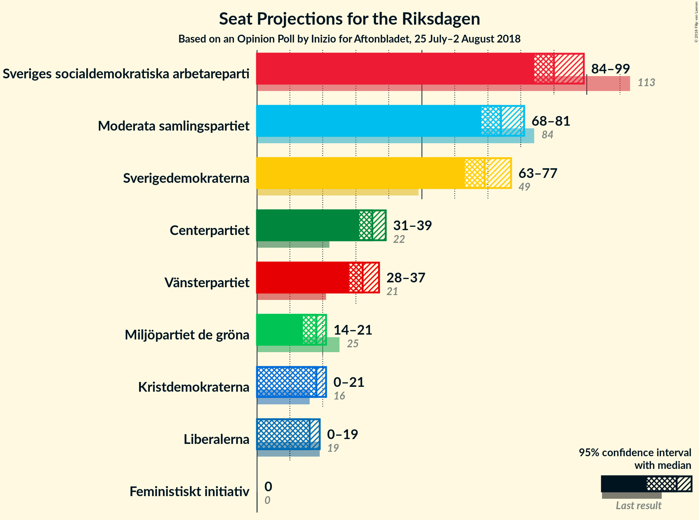
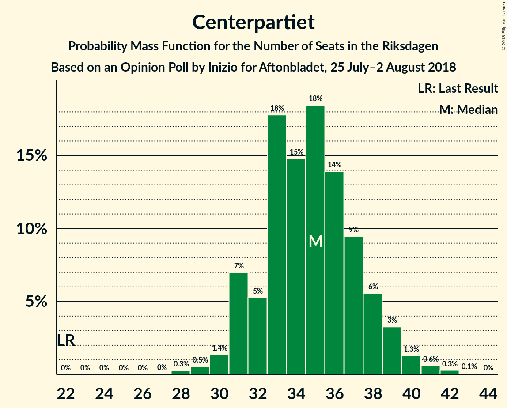
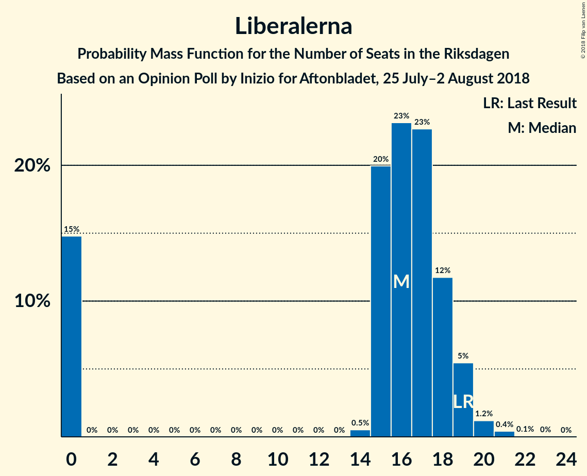

# Opinion Poll by Inizio for Aftonbladet, 25 July–2 August 2018

<a href="#voting-intentions">Voting Intentions</a> | <a href="#seats">Seats</a> | <a href="#coalitions">Coalitions</a> | <a href="#technical-information">Technical Information</a>

## Voting Intentions

### Confidence Intervals

| Party | Last Result | Poll Result | 80% Confidence Interval | 90% Confidence Interval | 95% Confidence Interval | 99% Confidence Interval |
|:-----:|:-----------:|:-----------:|:-----------------------:|:-----------------------:|:-----------------------:|:-----------------------:|
| Sveriges socialdemokratiska arbetareparti | 31.0% | 24.9% | 23.8–26.1% |23.5–26.4% |23.2–26.7% |22.6–27.3% |
| Moderata samlingspartiet | 23.3% | 20.4% | 19.4–21.6% |19.1–21.9% |18.8–22.1% |18.3–22.7% |
| Sverigedemokraterna | 12.9% | 19.0% | 18.0–20.1% |17.7–20.4% |17.4–20.7% |17.0–21.2% |
| Centerpartiet | 6.1% | 9.5% | 8.7–10.3% |8.5–10.6% |8.4–10.8% |8.0–11.2% |
| Vänsterpartiet | 5.7% | 8.7% | 8.0–9.5% |7.8–9.8% |7.6–10.0% |7.3–10.3% |
| Miljöpartiet de gröna | 6.9% | 4.8% | 4.3–5.4% |4.1–5.6% |4.0–5.7% |3.7–6.1% |
| Kristdemokraterna | 4.6% | 4.8% | 4.3–5.4% |4.1–5.6% |4.0–5.7% |3.7–6.1% |
| Liberalerna | 5.4% | 4.4% | 3.9–5.0% |3.7–5.2% |3.6–5.3% |3.4–5.6% |
| Feministiskt initiativ | 3.1% | 1.5% | 1.2–1.9% |1.1–2.0% |1.1–2.1% |0.9–2.3% |

*Note:* The poll result column reflects the actual value used in the calculations. Published results may vary slightly, and in addition be rounded to fewer digits.

## Seats

### Confidence Intervals

| Party | Last Result | Median | 80% Confidence Interval | 90% Confidence Interval | 95% Confidence Interval | 99% Confidence Interval |
|:-----:|:-----------:|:------:|:-----------------------:|:-----------------------:|:-----------------------:|:-----------------------:|
| <a href="#sveriges-socialdemokratiska-arbetareparti">Sveriges socialdemokratiska arbetareparti</a> | 113 | 90 | 86–95 |85–97 |84–99 |82–102 |
| <a href="#moderata-samlingspartiet">Moderata samlingspartiet</a> | 84 | 74 | 70–79 |69–80 |68–81 |66–84 |
| <a href="#sverigedemokraterna">Sverigedemokraterna</a> | 49 | 69 | 65–73 |64–74 |63–77 |61–79 |
| <a href="#centerpartiet">Centerpartiet</a> | 22 | 35 | 32–38 |31–39 |31–39 |29–41 |
| <a href="#vänsterpartiet">Vänsterpartiet</a> | 21 | 32 | 29–35 |28–35 |28–37 |27–38 |
| <a href="#miljöpartiet-de-gröna">Miljöpartiet de gröna</a> | 25 | 18 | 15–20 |15–20 |14–21 |0–22 |
| <a href="#kristdemokraterna">Kristdemokraterna</a> | 16 | 18 | 15–20 |15–20 |0–21 |0–22 |
| <a href="#liberalerna">Liberalerna</a> | 19 | 16 | 0–18 |0–19 |0–19 |0–21 |
| <a href="#feministiskt-initiativ">Feministiskt initiativ</a> | 0 | 0 | 0 |0 |0 |0 |

### Sveriges socialdemokratiska arbetareparti

*For a full overview of the results for this party, see the [Sveriges socialdemokratiska arbetareparti](party-sverigessocialdemokratiskaarbetareparti.html) page.*

| Number of Seats | Probability | Accumulated | Special Marks |
|:---------------:|:-----------:|:-----------:|:-------------:|
| 80 | 0% | 100% |  |
| 81 | 0.2% | 99.9% |  |
| 82 | 0.9% | 99.7% |  |
| 83 | 0.9% | 98.9% |  |
| 84 | 2% | 98% |  |
| 85 | 4% | 96% |  |
| 86 | 3% | 92% |  |
| 87 | 15% | 89% |  |
| 88 | 12% | 74% |  |
| 89 | 5% | 62% |  |
| 90 | 8% | 57% | Median |
| 91 | 11% | 49% |  |
| 92 | 10% | 38% |  |
| 93 | 8% | 29% |  |
| 94 | 3% | 21% |  |
| 95 | 7% | 17% |  |
| 96 | 5% | 10% |  |
| 97 | 1.4% | 5% |  |
| 98 | 1.3% | 4% |  |
| 99 | 1.1% | 3% |  |
| 100 | 0.5% | 2% |  |
| 101 | 0.5% | 1.1% |  |
| 102 | 0.1% | 0.6% |  |
| 103 | 0.2% | 0.4% |  |
| 104 | 0.2% | 0.2% |  |
| 105 | 0% | 0.1% |  |
| 106 | 0% | 0.1% |  |
| 107 | 0% | 0% |  |
| 108 | 0% | 0% |  |
| 109 | 0% | 0% |  |
| 110 | 0% | 0% |  |
| 111 | 0% | 0% |  |
| 112 | 0% | 0% |  |
| 113 | 0% | 0% | Last Result |

### Moderata samlingspartiet

*For a full overview of the results for this party, see the [Moderata samlingspartiet](party-moderatasamlingspartiet.html) page.*

| Number of Seats | Probability | Accumulated | Special Marks |
|:---------------:|:-----------:|:-----------:|:-------------:|
| 64 | 0% | 100% |  |
| 65 | 0.2% | 99.9% |  |
| 66 | 0.3% | 99.8% |  |
| 67 | 0.6% | 99.5% |  |
| 68 | 3% | 98.9% |  |
| 69 | 4% | 96% |  |
| 70 | 4% | 91% |  |
| 71 | 5% | 87% |  |
| 72 | 4% | 82% |  |
| 73 | 8% | 78% |  |
| 74 | 22% | 70% | Median |
| 75 | 17% | 48% |  |
| 76 | 6% | 32% |  |
| 77 | 8% | 25% |  |
| 78 | 7% | 18% |  |
| 79 | 4% | 11% |  |
| 80 | 3% | 7% |  |
| 81 | 2% | 4% |  |
| 82 | 1.1% | 2% |  |
| 83 | 0.5% | 1.1% |  |
| 84 | 0.4% | 0.6% | Last Result |
| 85 | 0.1% | 0.2% |  |
| 86 | 0.1% | 0.1% |  |
| 87 | 0% | 0.1% |  |
| 88 | 0% | 0% |  |

### Sverigedemokraterna

*For a full overview of the results for this party, see the [Sverigedemokraterna](party-sverigedemokraterna.html) page.*

| Number of Seats | Probability | Accumulated | Special Marks |
|:---------------:|:-----------:|:-----------:|:-------------:|
| 49 | 0% | 100% | Last Result |
| 50 | 0% | 100% |  |
| 51 | 0% | 100% |  |
| 52 | 0% | 100% |  |
| 53 | 0% | 100% |  |
| 54 | 0% | 100% |  |
| 55 | 0% | 100% |  |
| 56 | 0% | 100% |  |
| 57 | 0% | 100% |  |
| 58 | 0% | 100% |  |
| 59 | 0.1% | 100% |  |
| 60 | 0.1% | 99.9% |  |
| 61 | 0.4% | 99.8% |  |
| 62 | 0.6% | 99.4% |  |
| 63 | 2% | 98.8% |  |
| 64 | 3% | 97% |  |
| 65 | 6% | 94% |  |
| 66 | 14% | 89% |  |
| 67 | 6% | 74% |  |
| 68 | 14% | 68% |  |
| 69 | 6% | 53% | Median |
| 70 | 14% | 47% |  |
| 71 | 8% | 33% |  |
| 72 | 13% | 26% |  |
| 73 | 5% | 12% |  |
| 74 | 3% | 7% |  |
| 75 | 2% | 5% |  |
| 76 | 0.6% | 3% |  |
| 77 | 2% | 3% |  |
| 78 | 0.4% | 1.0% |  |
| 79 | 0.2% | 0.6% |  |
| 80 | 0.3% | 0.4% |  |
| 81 | 0.1% | 0.1% |  |
| 82 | 0% | 0% |  |

### Centerpartiet

*For a full overview of the results for this party, see the [Centerpartiet](party-centerpartiet.html) page.*

| Number of Seats | Probability | Accumulated | Special Marks |
|:---------------:|:-----------:|:-----------:|:-------------:|
| 22 | 0% | 100% | Last Result |
| 23 | 0% | 100% |  |
| 24 | 0% | 100% |  |
| 25 | 0% | 100% |  |
| 26 | 0% | 100% |  |
| 27 | 0% | 100% |  |
| 28 | 0.3% | 100% |  |
| 29 | 0.5% | 99.7% |  |
| 30 | 1.4% | 99.2% |  |
| 31 | 7% | 98% |  |
| 32 | 5% | 91% |  |
| 33 | 18% | 86% |  |
| 34 | 15% | 68% |  |
| 35 | 18% | 53% | Median |
| 36 | 14% | 34% |  |
| 37 | 9% | 21% |  |
| 38 | 6% | 11% |  |
| 39 | 3% | 6% |  |
| 40 | 1.3% | 2% |  |
| 41 | 0.6% | 1.0% |  |
| 42 | 0.3% | 0.4% |  |
| 43 | 0.1% | 0.1% |  |
| 44 | 0% | 0% |  |

### Vänsterpartiet

*For a full overview of the results for this party, see the [Vänsterpartiet](party-vänsterpartiet.html) page.*

| Number of Seats | Probability | Accumulated | Special Marks |
|:---------------:|:-----------:|:-----------:|:-------------:|
| 21 | 0% | 100% | Last Result |
| 22 | 0% | 100% |  |
| 23 | 0% | 100% |  |
| 24 | 0% | 100% |  |
| 25 | 0.1% | 100% |  |
| 26 | 0.4% | 99.9% |  |
| 27 | 1.2% | 99.5% |  |
| 28 | 5% | 98% |  |
| 29 | 8% | 93% |  |
| 30 | 17% | 84% |  |
| 31 | 14% | 67% |  |
| 32 | 18% | 53% | Median |
| 33 | 11% | 35% |  |
| 34 | 12% | 24% |  |
| 35 | 6% | 11% |  |
| 36 | 2% | 5% |  |
| 37 | 2% | 3% |  |
| 38 | 0.7% | 1.0% |  |
| 39 | 0.2% | 0.3% |  |
| 40 | 0% | 0.1% |  |
| 41 | 0% | 0% |  |

### Miljöpartiet de gröna

*For a full overview of the results for this party, see the [Miljöpartiet de gröna](party-miljöpartietdegröna.html) page.*

| Number of Seats | Probability | Accumulated | Special Marks |
|:---------------:|:-----------:|:-----------:|:-------------:|
| 0 | 2% | 100% |  |
| 1 | 0% | 98% |  |
| 2 | 0% | 98% |  |
| 3 | 0% | 98% |  |
| 4 | 0% | 98% |  |
| 5 | 0% | 98% |  |
| 6 | 0% | 98% |  |
| 7 | 0% | 98% |  |
| 8 | 0% | 98% |  |
| 9 | 0% | 98% |  |
| 10 | 0% | 98% |  |
| 11 | 0% | 98% |  |
| 12 | 0% | 98% |  |
| 13 | 0% | 98% |  |
| 14 | 0.7% | 98% |  |
| 15 | 8% | 97% |  |
| 16 | 19% | 89% |  |
| 17 | 19% | 71% |  |
| 18 | 21% | 52% | Median |
| 19 | 12% | 30% |  |
| 20 | 14% | 18% |  |
| 21 | 3% | 4% |  |
| 22 | 0.8% | 1.1% |  |
| 23 | 0.2% | 0.3% |  |
| 24 | 0.1% | 0.1% |  |
| 25 | 0% | 0% | Last Result |

### Kristdemokraterna

*For a full overview of the results for this party, see the [Kristdemokraterna](party-kristdemokraterna.html) page.*

| Number of Seats | Probability | Accumulated | Special Marks |
|:---------------:|:-----------:|:-----------:|:-------------:|
| 0 | 4% | 100% |  |
| 1 | 0% | 96% |  |
| 2 | 0% | 96% |  |
| 3 | 0% | 96% |  |
| 4 | 0% | 96% |  |
| 5 | 0% | 96% |  |
| 6 | 0% | 96% |  |
| 7 | 0% | 96% |  |
| 8 | 0% | 96% |  |
| 9 | 0% | 96% |  |
| 10 | 0% | 96% |  |
| 11 | 0% | 96% |  |
| 12 | 0% | 96% |  |
| 13 | 0% | 96% |  |
| 14 | 0.1% | 96% |  |
| 15 | 6% | 96% |  |
| 16 | 22% | 90% | Last Result |
| 17 | 17% | 68% |  |
| 18 | 24% | 51% | Median |
| 19 | 13% | 27% |  |
| 20 | 10% | 14% |  |
| 21 | 3% | 4% |  |
| 22 | 0.8% | 1.0% |  |
| 23 | 0.2% | 0.2% |  |
| 24 | 0% | 0% |  |

### Liberalerna

*For a full overview of the results for this party, see the [Liberalerna](party-liberalerna.html) page.*

| Number of Seats | Probability | Accumulated | Special Marks |
|:---------------:|:-----------:|:-----------:|:-------------:|
| 0 | 15% | 100% |  |
| 1 | 0% | 85% |  |
| 2 | 0% | 85% |  |
| 3 | 0% | 85% |  |
| 4 | 0% | 85% |  |
| 5 | 0% | 85% |  |
| 6 | 0% | 85% |  |
| 7 | 0% | 85% |  |
| 8 | 0% | 85% |  |
| 9 | 0% | 85% |  |
| 10 | 0% | 85% |  |
| 11 | 0% | 85% |  |
| 12 | 0% | 85% |  |
| 13 | 0% | 85% |  |
| 14 | 0.5% | 85% |  |
| 15 | 20% | 85% |  |
| 16 | 23% | 65% | Median |
| 17 | 23% | 42% |  |
| 18 | 12% | 19% |  |
| 19 | 5% | 7% | Last Result |
| 20 | 1.2% | 2% |  |
| 21 | 0.4% | 0.5% |  |
| 22 | 0.1% | 0.1% |  |
| 23 | 0% | 0% |  |

### Feministiskt initiativ

*For a full overview of the results for this party, see the [Feministiskt initiativ](party-feministisktinitiativ.html) page.*

| Number of Seats | Probability | Accumulated | Special Marks |
|:---------------:|:-----------:|:-----------:|:-------------:|
| 0 | 100% | 100% | Last Result, Median |

## Coalitions

### Confidence Intervals

| Coalition | Last Result | Median | Majority? | 80% Confidence Interval | 90% Confidence Interval | 95% Confidence Interval | 99% Confidence Interval |
|:---------:|:-----------:|:------:|:---------:|:-----------------------:|:-----------------------:|:-----------------------:|:-----------------------:|
| Sveriges socialdemokratiska arbetareparti – Moderata samlingspartiet | 197 | 165 | 4% | 159–171 | 158–173 | 157–177 | 154–181 |
| Moderata samlingspartiet – Sverigedemokraterna | 133 | 143 | 0% | 138–150 | 136–152 | 135–154 | 133–158 |
| Sveriges socialdemokratiska arbetareparti – Vänsterpartiet – Miljöpartiet de gröna – Feministiskt initiativ | 159 | 139 | 0% | 133–147 | 132–148 | 131–150 | 125–154 |
| Sveriges socialdemokratiska arbetareparti – Vänsterpartiet – Miljöpartiet de gröna | 159 | 139 | 0% | 133–147 | 132–148 | 131–150 | 125–154 |
| Moderata samlingspartiet – Centerpartiet – Kristdemokraterna – Liberalerna | 141 | 142 | 0% | 132–146 | 129–148 | 128–150 | 123–152 |
| Moderata samlingspartiet – Centerpartiet – Kristdemokraterna | 122 | 127 | 0% | 119–131 | 118–134 | 116–135 | 113–139 |
| Moderata samlingspartiet – Centerpartiet – Liberalerna | 125 | 125 | 0% | 115–129 | 110–131 | 109–133 | 107–136 |
| Sveriges socialdemokratiska arbetareparti – Vänsterpartiet | 134 | 122 | 0% | 117–128 | 116–130 | 114–132 | 112–136 |
| Moderata samlingspartiet – Centerpartiet | 106 | 109 | 0% | 103–114 | 102–116 | 102–118 | 100–121 |
| Sveriges socialdemokratiska arbetareparti – Miljöpartiet de gröna | 138 | 108 | 0% | 103–113 | 101–116 | 99–117 | 91–120 |

