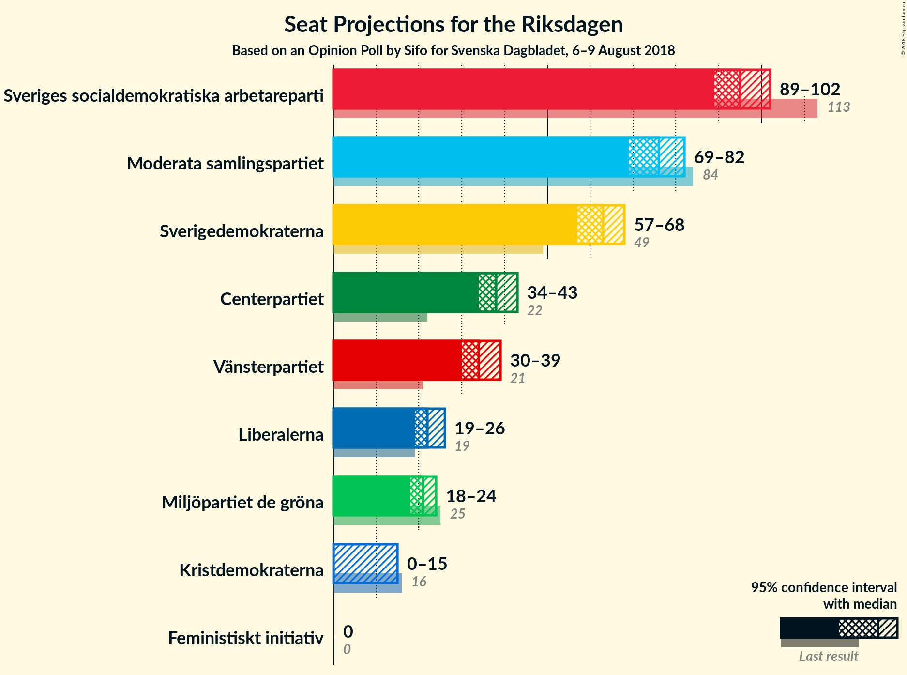
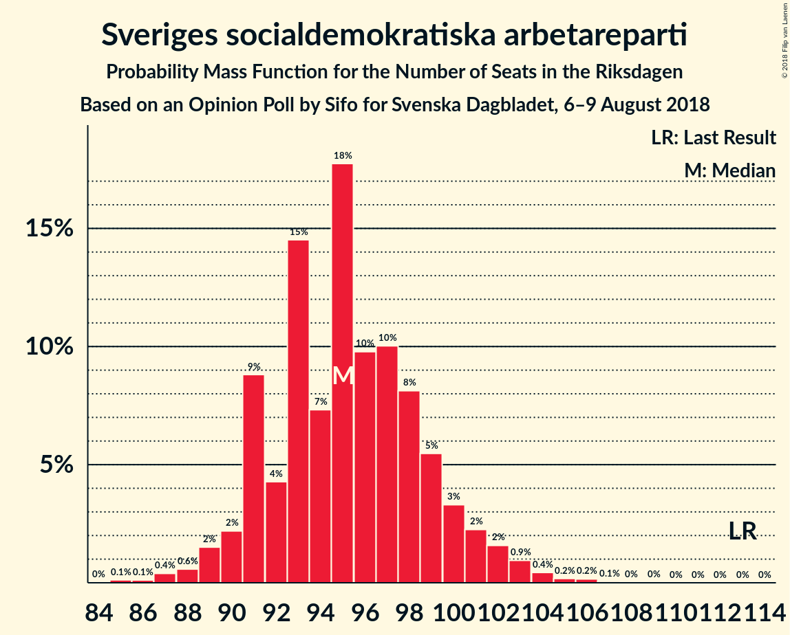

# Opinion Poll by Sifo for Svenska Dagbladet, 6–9 August 2018

<a href="#voting-intentions">Voting Intentions</a> | <a href="#seats">Seats</a> | <a href="#coalitions">Coalitions</a> | <a href="#technical-information">Technical Information</a>

## Voting Intentions

### Confidence Intervals

| Party | Last Result | Poll Result | 80% Confidence Interval | 90% Confidence Interval | 95% Confidence Interval | 99% Confidence Interval |
|:-----:|:-----------:|:-----------:|:-----------------------:|:-----------------------:|:-----------------------:|:-----------------------:|
| Sveriges socialdemokratiska arbetareparti | 31.0% | 25.8% | 24.7–27.0% |24.3–27.3% |24.1–27.6% |23.5–28.2% |
| Moderata samlingspartiet | 23.3% | 20.3% | 19.3–21.4% |19.0–21.7% |18.7–22.0% |18.2–22.6% |
| Sverigedemokraterna | 12.9% | 16.8% | 15.8–17.8% |15.5–18.1% |15.3–18.4% |14.8–18.9% |
| Centerpartiet | 6.1% | 10.3% | 9.5–11.2% |9.3–11.4% |9.1–11.6% |8.7–12.0% |
| Vänsterpartiet | 5.7% | 9.2% | 8.5–10.0% |8.2–10.3% |8.1–10.5% |7.7–10.9% |
| Liberalerna | 5.4% | 6.0% | 5.4–6.7% |5.2–6.9% |5.1–7.1% |4.8–7.4% |
| Miljöpartiet de gröna | 6.9% | 5.6% | 5.0–6.2% |4.8–6.4% |4.7–6.6% |4.5–6.9% |
| Kristdemokraterna | 4.6% | 3.3% | 2.9–3.9% |2.8–4.0% |2.7–4.1% |2.5–4.4% |
| Feministiskt initiativ | 3.1% | 1.5% | 1.2–1.9% |1.1–2.0% |1.1–2.1% |0.9–2.3% |

*Note:* The poll result column reflects the actual value used in the calculations. Published results may vary slightly, and in addition be rounded to fewer digits.

## Seats

### Confidence Intervals

| Party | Last Result | Median | 80% Confidence Interval | 90% Confidence Interval | 95% Confidence Interval | 99% Confidence Interval |
|:-----:|:-----------:|:------:|:-----------------------:|:-----------------------:|:-----------------------:|:-----------------------:|
| <a href="#sveriges-socialdemokratiska-arbetareparti">Sveriges socialdemokratiska arbetareparti</a> | 113 | 95 | 92–99 |91–100 |90–101 |87–104 |
| <a href="#moderata-samlingspartiet">Moderata samlingspartiet</a> | 84 | 76 | 73–78 |71–79 |70–80 |67–82 |
| <a href="#sverigedemokraterna">Sverigedemokraterna</a> | 49 | 63 | 59–65 |59–67 |58–68 |56–69 |
| <a href="#centerpartiet">Centerpartiet</a> | 22 | 37 | 35–39 |35–41 |34–43 |32–44 |
| <a href="#vänsterpartiet">Vänsterpartiet</a> | 21 | 35 | 32–36 |31–37 |30–37 |29–39 |
| <a href="#liberalerna">Liberalerna</a> | 19 | 21 | 21–25 |20–26 |20–26 |18–27 |
| <a href="#miljöpartiet-de-gröna">Miljöpartiet de gröna</a> | 25 | 20 | 19–22 |18–23 |18–24 |16–25 |
| <a href="#kristdemokraterna">Kristdemokraterna</a> | 16 | 0 | 0 |0 |0 |0–16 |
| <a href="#feministiskt-initiativ">Feministiskt initiativ</a> | 0 | 0 | 0 |0 |0 |0 |

### Sveriges socialdemokratiska arbetareparti

*For a full overview of the results for this party, see the [Sveriges socialdemokratiska arbetareparti](party-sverigessocialdemokratiskaarbetareparti.html) page.*

| Number of Seats | Probability | Accumulated | Special Marks |
|:---------------:|:-----------:|:-----------:|:-------------:|
| 84 | 0% | 100% |  |
| 85 | 0.1% | 99.9% |  |
| 86 | 0.1% | 99.9% |  |
| 87 | 0.4% | 99.8% |  |
| 88 | 0.2% | 99.5% |  |
| 89 | 1.1% | 99.2% |  |
| 90 | 1.2% | 98% |  |
| 91 | 3% | 97% |  |
| 92 | 5% | 94% |  |
| 93 | 2% | 89% |  |
| 94 | 2% | 87% |  |
| 95 | 44% | 86% | Median |
| 96 | 3% | 42% |  |
| 97 | 14% | 39% |  |
| 98 | 14% | 26% |  |
| 99 | 5% | 12% |  |
| 100 | 2% | 7% |  |
| 101 | 2% | 4% |  |
| 102 | 2% | 2% |  |
| 103 | 0.1% | 0.6% |  |
| 104 | 0.4% | 0.5% |  |
| 105 | 0.1% | 0.1% |  |
| 106 | 0% | 0.1% |  |
| 107 | 0% | 0% |  |
| 108 | 0% | 0% |  |
| 109 | 0% | 0% |  |
| 110 | 0% | 0% |  |
| 111 | 0% | 0% |  |
| 112 | 0% | 0% |  |
| 113 | 0% | 0% | Last Result |

### Moderata samlingspartiet

*For a full overview of the results for this party, see the [Moderata samlingspartiet](party-moderatasamlingspartiet.html) page.*

| Number of Seats | Probability | Accumulated | Special Marks |
|:---------------:|:-----------:|:-----------:|:-------------:|
| 65 | 0.1% | 100% |  |
| 66 | 0.1% | 99.9% |  |
| 67 | 0.3% | 99.8% |  |
| 68 | 0.6% | 99.5% |  |
| 69 | 0.8% | 98.9% |  |
| 70 | 3% | 98% |  |
| 71 | 2% | 95% |  |
| 72 | 3% | 94% |  |
| 73 | 18% | 90% |  |
| 74 | 4% | 72% |  |
| 75 | 18% | 69% |  |
| 76 | 3% | 50% | Median |
| 77 | 33% | 47% |  |
| 78 | 4% | 14% |  |
| 79 | 6% | 9% |  |
| 80 | 2% | 4% |  |
| 81 | 0.5% | 2% |  |
| 82 | 1.0% | 1.4% |  |
| 83 | 0.1% | 0.3% |  |
| 84 | 0.2% | 0.2% | Last Result |
| 85 | 0% | 0.1% |  |
| 86 | 0% | 0% |  |

### Sverigedemokraterna

*For a full overview of the results for this party, see the [Sverigedemokraterna](party-sverigedemokraterna.html) page.*

| Number of Seats | Probability | Accumulated | Special Marks |
|:---------------:|:-----------:|:-----------:|:-------------:|
| 49 | 0% | 100% | Last Result |
| 50 | 0% | 100% |  |
| 51 | 0% | 100% |  |
| 52 | 0% | 100% |  |
| 53 | 0% | 100% |  |
| 54 | 0.2% | 99.9% |  |
| 55 | 0.2% | 99.7% |  |
| 56 | 1.0% | 99.5% |  |
| 57 | 0.7% | 98.5% |  |
| 58 | 1.4% | 98% |  |
| 59 | 7% | 96% |  |
| 60 | 7% | 89% |  |
| 61 | 4% | 83% |  |
| 62 | 5% | 79% |  |
| 63 | 25% | 74% | Median |
| 64 | 3% | 49% |  |
| 65 | 37% | 46% |  |
| 66 | 1.4% | 9% |  |
| 67 | 3% | 7% |  |
| 68 | 2% | 4% |  |
| 69 | 2% | 2% |  |
| 70 | 0% | 0.3% |  |
| 71 | 0.3% | 0.3% |  |
| 72 | 0% | 0% |  |

### Centerpartiet

*For a full overview of the results for this party, see the [Centerpartiet](party-centerpartiet.html) page.*

| Number of Seats | Probability | Accumulated | Special Marks |
|:---------------:|:-----------:|:-----------:|:-------------:|
| 22 | 0% | 100% | Last Result |
| 23 | 0% | 100% |  |
| 24 | 0% | 100% |  |
| 25 | 0% | 100% |  |
| 26 | 0% | 100% |  |
| 27 | 0% | 100% |  |
| 28 | 0% | 100% |  |
| 29 | 0% | 100% |  |
| 30 | 0% | 100% |  |
| 31 | 0.1% | 100% |  |
| 32 | 0.4% | 99.9% |  |
| 33 | 1.2% | 99.5% |  |
| 34 | 2% | 98% |  |
| 35 | 7% | 96% |  |
| 36 | 35% | 89% |  |
| 37 | 20% | 54% | Median |
| 38 | 19% | 35% |  |
| 39 | 6% | 16% |  |
| 40 | 3% | 10% |  |
| 41 | 2% | 7% |  |
| 42 | 2% | 5% |  |
| 43 | 2% | 3% |  |
| 44 | 0.8% | 1.2% |  |
| 45 | 0.3% | 0.3% |  |
| 46 | 0.1% | 0.1% |  |
| 47 | 0% | 0% |  |

### Vänsterpartiet

*For a full overview of the results for this party, see the [Vänsterpartiet](party-vänsterpartiet.html) page.*

| Number of Seats | Probability | Accumulated | Special Marks |
|:---------------:|:-----------:|:-----------:|:-------------:|
| 21 | 0% | 100% | Last Result |
| 22 | 0% | 100% |  |
| 23 | 0% | 100% |  |
| 24 | 0% | 100% |  |
| 25 | 0% | 100% |  |
| 26 | 0% | 100% |  |
| 27 | 0.1% | 100% |  |
| 28 | 0.4% | 99.9% |  |
| 29 | 0.7% | 99.5% |  |
| 30 | 2% | 98.8% |  |
| 31 | 3% | 97% |  |
| 32 | 6% | 94% |  |
| 33 | 13% | 87% |  |
| 34 | 14% | 75% |  |
| 35 | 44% | 61% | Median |
| 36 | 11% | 16% |  |
| 37 | 3% | 5% |  |
| 38 | 1.2% | 2% |  |
| 39 | 0.6% | 0.9% |  |
| 40 | 0.1% | 0.2% |  |
| 41 | 0.1% | 0.1% |  |
| 42 | 0% | 0% |  |

### Liberalerna

*For a full overview of the results for this party, see the [Liberalerna](party-liberalerna.html) page.*

| Number of Seats | Probability | Accumulated | Special Marks |
|:---------------:|:-----------:|:-----------:|:-------------:|
| 17 | 0.2% | 100% |  |
| 18 | 0.6% | 99.8% |  |
| 19 | 1.4% | 99.3% | Last Result |
| 20 | 5% | 98% |  |
| 21 | 44% | 93% | Median |
| 22 | 31% | 49% |  |
| 23 | 6% | 18% |  |
| 24 | 2% | 12% |  |
| 25 | 3% | 10% |  |
| 26 | 7% | 7% |  |
| 27 | 0.6% | 0.8% |  |
| 28 | 0.2% | 0.2% |  |
| 29 | 0% | 0% |  |

### Miljöpartiet de gröna

*For a full overview of the results for this party, see the [Miljöpartiet de gröna](party-miljöpartietdegröna.html) page.*

| Number of Seats | Probability | Accumulated | Special Marks |
|:---------------:|:-----------:|:-----------:|:-------------:|
| 15 | 0% | 100% |  |
| 16 | 1.0% | 99.9% |  |
| 17 | 0.8% | 99.0% |  |
| 18 | 6% | 98% |  |
| 19 | 4% | 92% |  |
| 20 | 41% | 88% | Median |
| 21 | 7% | 47% |  |
| 22 | 32% | 40% |  |
| 23 | 4% | 9% |  |
| 24 | 3% | 4% |  |
| 25 | 1.2% | 2% | Last Result |
| 26 | 0.2% | 0.3% |  |
| 27 | 0.1% | 0.1% |  |
| 28 | 0% | 0% |  |

### Kristdemokraterna

*For a full overview of the results for this party, see the [Kristdemokraterna](party-kristdemokraterna.html) page.*

| Number of Seats | Probability | Accumulated | Special Marks |
|:---------------:|:-----------:|:-----------:|:-------------:|
| 0 | 98.6% | 100% | Median |
| 1 | 0% | 1.4% |  |
| 2 | 0% | 1.4% |  |
| 3 | 0% | 1.4% |  |
| 4 | 0% | 1.4% |  |
| 5 | 0% | 1.4% |  |
| 6 | 0% | 1.4% |  |
| 7 | 0% | 1.4% |  |
| 8 | 0% | 1.4% |  |
| 9 | 0% | 1.4% |  |
| 10 | 0% | 1.4% |  |
| 11 | 0% | 1.4% |  |
| 12 | 0% | 1.4% |  |
| 13 | 0% | 1.4% |  |
| 14 | 0.3% | 1.4% |  |
| 15 | 0.3% | 1.1% |  |
| 16 | 0.7% | 0.8% | Last Result |
| 17 | 0% | 0.1% |  |
| 18 | 0% | 0% |  |

### Feministiskt initiativ

*For a full overview of the results for this party, see the [Feministiskt initiativ](party-feministisktinitiativ.html) page.*

| Number of Seats | Probability | Accumulated | Special Marks |
|:---------------:|:-----------:|:-----------:|:-------------:|
| 0 | 100% | 100% | Last Result, Median |

## Coalitions

### Confidence Intervals

| Coalition | Last Result | Median | Majority? | 80% Confidence Interval | 90% Confidence Interval | 95% Confidence Interval | 99% Confidence Interval |
|:---------:|:-----------:|:------:|:---------:|:-----------------------:|:-----------------------:|:-----------------------:|:-----------------------:|
| Sveriges socialdemokratiska arbetareparti – Moderata samlingspartiet | 197 | 171 | 12% | 169–176 | 166–178 | 164–178 | 158–180 |
| Sveriges socialdemokratiska arbetareparti – Vänsterpartiet – Miljöpartiet de gröna – Feministiskt initiativ | 159 | 151 | 0% | 148–154 | 145–155 | 144–156 | 141–159 |
| Sveriges socialdemokratiska arbetareparti – Vänsterpartiet – Miljöpartiet de gröna | 159 | 151 | 0% | 148–154 | 145–155 | 144–156 | 141–159 |
| Moderata samlingspartiet – Sverigedemokraterna | 133 | 139 | 0% | 133–142 | 133–143 | 131–145 | 128–146 |
| Moderata samlingspartiet – Centerpartiet – Liberalerna – Kristdemokraterna | 141 | 134 | 0% | 132–138 | 131–141 | 130–143 | 127–147 |
| Moderata samlingspartiet – Centerpartiet – Liberalerna | 125 | 134 | 0% | 132–137 | 131–140 | 130–142 | 127–145 |
| Sveriges socialdemokratiska arbetareparti – Vänsterpartiet | 134 | 130 | 0% | 127–133 | 125–134 | 123–135 | 121–138 |
| Sveriges socialdemokratiska arbetareparti – Miljöpartiet de gröna | 138 | 116 | 0% | 113–121 | 112–122 | 110–123 | 107–126 |
| Moderata samlingspartiet – Centerpartiet – Kristdemokraterna | 122 | 113 | 0% | 111–115 | 110–119 | 108–121 | 105–126 |
| Moderata samlingspartiet – Centerpartiet | 106 | 113 | 0% | 111–115 | 109–118 | 107–120 | 104–122 |

### Sveriges socialdemokratiska arbetareparti – Moderata samlingspartiet

| Number of Seats | Probability | Accumulated | Special Marks |
|:---------------:|:-----------:|:-----------:|:-------------:|
| 157 | 0% | 100% |  |
| 158 | 0.4% | 99.9% |  |
| 159 | 0.1% | 99.5% |  |
| 160 | 0.2% | 99.4% |  |
| 161 | 0.6% | 99.2% |  |
| 162 | 0.4% | 98.6% |  |
| 163 | 0.5% | 98% |  |
| 164 | 1.1% | 98% |  |
| 165 | 1.4% | 97% |  |
| 166 | 0.5% | 95% |  |
| 167 | 2% | 95% |  |
| 168 | 2% | 92% |  |
| 169 | 5% | 90% |  |
| 170 | 27% | 85% |  |
| 171 | 9% | 58% | Median |
| 172 | 30% | 49% |  |
| 173 | 7% | 19% |  |
| 174 | 0.6% | 12% |  |
| 175 | 0.9% | 12% | Majority |
| 176 | 2% | 11% |  |
| 177 | 0.7% | 9% |  |
| 178 | 7% | 8% |  |
| 179 | 0.5% | 1.5% |  |
| 180 | 0.6% | 1.0% |  |
| 181 | 0.3% | 0.4% |  |
| 182 | 0% | 0.1% |  |
| 183 | 0% | 0% |  |
| 184 | 0% | 0% |  |
| 185 | 0% | 0% |  |
| 186 | 0% | 0% |  |
| 187 | 0% | 0% |  |
| 188 | 0% | 0% |  |
| 189 | 0% | 0% |  |
| 190 | 0% | 0% |  |
| 191 | 0% | 0% |  |
| 192 | 0% | 0% |  |
| 193 | 0% | 0% |  |
| 194 | 0% | 0% |  |
| 195 | 0% | 0% |  |
| 196 | 0% | 0% |  |
| 197 | 0% | 0% | Last Result |

### Sveriges socialdemokratiska arbetareparti – Vänsterpartiet – Miljöpartiet de gröna – Feministiskt initiativ

| Number of Seats | Probability | Accumulated | Special Marks |
|:---------------:|:-----------:|:-----------:|:-------------:|
| 137 | 0% | 100% |  |
| 138 | 0% | 99.9% |  |
| 139 | 0.1% | 99.9% |  |
| 140 | 0.3% | 99.8% |  |
| 141 | 1.2% | 99.5% |  |
| 142 | 0.3% | 98% |  |
| 143 | 0.2% | 98% |  |
| 144 | 2% | 98% |  |
| 145 | 1.2% | 96% |  |
| 146 | 1.1% | 95% |  |
| 147 | 1.3% | 93% |  |
| 148 | 2% | 92% |  |
| 149 | 5% | 90% |  |
| 150 | 32% | 85% | Median |
| 151 | 9% | 53% |  |
| 152 | 17% | 44% |  |
| 153 | 12% | 27% |  |
| 154 | 7% | 14% |  |
| 155 | 3% | 7% |  |
| 156 | 3% | 5% |  |
| 157 | 0.5% | 2% |  |
| 158 | 0.4% | 1.0% |  |
| 159 | 0.2% | 0.6% | Last Result |
| 160 | 0.1% | 0.3% |  |
| 161 | 0% | 0.2% |  |
| 162 | 0% | 0.2% |  |
| 163 | 0.1% | 0.2% |  |
| 164 | 0% | 0% |  |

### Sveriges socialdemokratiska arbetareparti – Vänsterpartiet – Miljöpartiet de gröna

| Number of Seats | Probability | Accumulated | Special Marks |
|:---------------:|:-----------:|:-----------:|:-------------:|
| 137 | 0% | 100% |  |
| 138 | 0% | 99.9% |  |
| 139 | 0.1% | 99.9% |  |
| 140 | 0.3% | 99.8% |  |
| 141 | 1.2% | 99.5% |  |
| 142 | 0.3% | 98% |  |
| 143 | 0.2% | 98% |  |
| 144 | 2% | 98% |  |
| 145 | 1.2% | 96% |  |
| 146 | 1.1% | 95% |  |
| 147 | 1.3% | 93% |  |
| 148 | 2% | 92% |  |
| 149 | 5% | 90% |  |
| 150 | 32% | 85% | Median |
| 151 | 9% | 53% |  |
| 152 | 17% | 44% |  |
| 153 | 12% | 27% |  |
| 154 | 7% | 14% |  |
| 155 | 3% | 7% |  |
| 156 | 3% | 5% |  |
| 157 | 0.5% | 2% |  |
| 158 | 0.4% | 1.0% |  |
| 159 | 0.2% | 0.6% | Last Result |
| 160 | 0.1% | 0.3% |  |
| 161 | 0% | 0.2% |  |
| 162 | 0% | 0.2% |  |
| 163 | 0.1% | 0.2% |  |
| 164 | 0% | 0% |  |

### Moderata samlingspartiet – Sverigedemokraterna

| Number of Seats | Probability | Accumulated | Special Marks |
|:---------------:|:-----------:|:-----------:|:-------------:|
| 124 | 0% | 100% |  |
| 125 | 0.1% | 99.9% |  |
| 126 | 0.1% | 99.8% |  |
| 127 | 0.1% | 99.8% |  |
| 128 | 0.3% | 99.6% |  |
| 129 | 0.2% | 99.3% |  |
| 130 | 0.4% | 99.1% |  |
| 131 | 1.4% | 98.7% |  |
| 132 | 1.2% | 97% |  |
| 133 | 6% | 96% | Last Result |
| 134 | 1.3% | 90% |  |
| 135 | 4% | 88% |  |
| 136 | 14% | 84% |  |
| 137 | 2% | 70% |  |
| 138 | 16% | 67% |  |
| 139 | 4% | 51% | Median |
| 140 | 9% | 48% |  |
| 141 | 1.5% | 39% |  |
| 142 | 30% | 37% |  |
| 143 | 4% | 7% |  |
| 144 | 0.2% | 3% |  |
| 145 | 2% | 3% |  |
| 146 | 1.1% | 1.4% |  |
| 147 | 0.1% | 0.3% |  |
| 148 | 0.1% | 0.2% |  |
| 149 | 0.1% | 0.1% |  |
| 150 | 0% | 0.1% |  |
| 151 | 0% | 0% |  |

### Moderata samlingspartiet – Centerpartiet – Liberalerna – Kristdemokraterna

| Number of Seats | Probability | Accumulated | Special Marks |
|:---------------:|:-----------:|:-----------:|:-------------:|
| 124 | 0.1% | 100% |  |
| 125 | 0% | 99.9% |  |
| 126 | 0.1% | 99.9% |  |
| 127 | 0.3% | 99.8% |  |
| 128 | 0.2% | 99.4% |  |
| 129 | 0.4% | 99.3% |  |
| 130 | 2% | 98.9% |  |
| 131 | 2% | 97% |  |
| 132 | 5% | 94% |  |
| 133 | 18% | 90% |  |
| 134 | 42% | 72% | Median |
| 135 | 4% | 30% |  |
| 136 | 8% | 25% |  |
| 137 | 6% | 17% |  |
| 138 | 4% | 11% |  |
| 139 | 0.9% | 7% |  |
| 140 | 1.0% | 6% |  |
| 141 | 0.6% | 6% | Last Result |
| 142 | 2% | 5% |  |
| 143 | 2% | 3% |  |
| 144 | 0.2% | 2% |  |
| 145 | 0.3% | 1.3% |  |
| 146 | 0.3% | 1.0% |  |
| 147 | 0.2% | 0.7% |  |
| 148 | 0.2% | 0.5% |  |
| 149 | 0.1% | 0.3% |  |
| 150 | 0% | 0.2% |  |
| 151 | 0% | 0.1% |  |
| 152 | 0% | 0.1% |  |
| 153 | 0% | 0.1% |  |
| 154 | 0% | 0% |  |

### Moderata samlingspartiet – Centerpartiet – Liberalerna

| Number of Seats | Probability | Accumulated | Special Marks |
|:---------------:|:-----------:|:-----------:|:-------------:|
| 123 | 0.1% | 100% |  |
| 124 | 0.1% | 99.8% |  |
| 125 | 0.1% | 99.7% | Last Result |
| 126 | 0.1% | 99.6% |  |
| 127 | 0.5% | 99.5% |  |
| 128 | 0.2% | 99.0% |  |
| 129 | 0.5% | 98.8% |  |
| 130 | 2% | 98% |  |
| 131 | 2% | 96% |  |
| 132 | 5% | 93% |  |
| 133 | 18% | 89% |  |
| 134 | 42% | 71% | Median |
| 135 | 4% | 28% |  |
| 136 | 8% | 24% |  |
| 137 | 6% | 16% |  |
| 138 | 4% | 10% |  |
| 139 | 0.8% | 6% |  |
| 140 | 0.9% | 5% |  |
| 141 | 0.4% | 4% |  |
| 142 | 1.5% | 4% |  |
| 143 | 2% | 2% |  |
| 144 | 0.1% | 0.7% |  |
| 145 | 0.3% | 0.5% |  |
| 146 | 0% | 0.3% |  |
| 147 | 0.2% | 0.2% |  |
| 148 | 0.1% | 0.1% |  |
| 149 | 0% | 0% |  |

### Sveriges socialdemokratiska arbetareparti – Vänsterpartiet

| Number of Seats | Probability | Accumulated | Special Marks |
|:---------------:|:-----------:|:-----------:|:-------------:|
| 117 | 0.1% | 100% |  |
| 118 | 0.1% | 99.9% |  |
| 119 | 0.1% | 99.8% |  |
| 120 | 0.3% | 99.8% |  |
| 121 | 0.6% | 99.5% |  |
| 122 | 0.2% | 98.9% |  |
| 123 | 1.4% | 98.8% |  |
| 124 | 2% | 97% |  |
| 125 | 1.5% | 95% |  |
| 126 | 2% | 94% |  |
| 127 | 3% | 92% |  |
| 128 | 3% | 89% |  |
| 129 | 5% | 86% |  |
| 130 | 42% | 81% | Median |
| 131 | 19% | 39% |  |
| 132 | 7% | 20% |  |
| 133 | 5% | 13% |  |
| 134 | 5% | 8% | Last Result |
| 135 | 2% | 3% |  |
| 136 | 0.5% | 1.3% |  |
| 137 | 0.2% | 0.8% |  |
| 138 | 0.2% | 0.6% |  |
| 139 | 0.1% | 0.3% |  |
| 140 | 0.2% | 0.3% |  |
| 141 | 0% | 0.1% |  |
| 142 | 0% | 0.1% |  |
| 143 | 0% | 0% |  |

### Sveriges socialdemokratiska arbetareparti – Miljöpartiet de gröna

| Number of Seats | Probability | Accumulated | Special Marks |
|:---------------:|:-----------:|:-----------:|:-------------:|
| 104 | 0% | 100% |  |
| 105 | 0% | 99.9% |  |
| 106 | 0.2% | 99.9% |  |
| 107 | 0.3% | 99.7% |  |
| 108 | 0.9% | 99.4% |  |
| 109 | 0.7% | 98.5% |  |
| 110 | 0.5% | 98% |  |
| 111 | 1.3% | 97% |  |
| 112 | 3% | 96% |  |
| 113 | 3% | 93% |  |
| 114 | 4% | 90% |  |
| 115 | 31% | 86% | Median |
| 116 | 8% | 55% |  |
| 117 | 11% | 48% |  |
| 118 | 10% | 37% |  |
| 119 | 14% | 27% |  |
| 120 | 1.5% | 13% |  |
| 121 | 7% | 12% |  |
| 122 | 0.6% | 5% |  |
| 123 | 3% | 4% |  |
| 124 | 1.1% | 2% |  |
| 125 | 0.1% | 0.7% |  |
| 126 | 0.4% | 0.6% |  |
| 127 | 0.1% | 0.2% |  |
| 128 | 0% | 0.1% |  |
| 129 | 0% | 0% |  |
| 130 | 0% | 0% |  |
| 131 | 0% | 0% |  |
| 132 | 0% | 0% |  |
| 133 | 0% | 0% |  |
| 134 | 0% | 0% |  |
| 135 | 0% | 0% |  |
| 136 | 0% | 0% |  |
| 137 | 0% | 0% |  |
| 138 | 0% | 0% | Last Result |

### Moderata samlingspartiet – Centerpartiet – Kristdemokraterna

| Number of Seats | Probability | Accumulated | Special Marks |
|:---------------:|:-----------:|:-----------:|:-------------:|
| 102 | 0% | 100% |  |
| 103 | 0% | 99.9% |  |
| 104 | 0.2% | 99.9% |  |
| 105 | 0.4% | 99.7% |  |
| 106 | 0.1% | 99.2% |  |
| 107 | 1.3% | 99.1% |  |
| 108 | 1.4% | 98% |  |
| 109 | 0.6% | 96% |  |
| 110 | 3% | 96% |  |
| 111 | 21% | 93% |  |
| 112 | 20% | 71% |  |
| 113 | 33% | 52% | Median |
| 114 | 6% | 19% |  |
| 115 | 4% | 13% |  |
| 116 | 1.3% | 9% |  |
| 117 | 2% | 8% |  |
| 118 | 0.5% | 6% |  |
| 119 | 0.9% | 6% |  |
| 120 | 2% | 5% |  |
| 121 | 1.2% | 3% |  |
| 122 | 0.4% | 2% | Last Result |
| 123 | 0.3% | 1.3% |  |
| 124 | 0.4% | 1.0% |  |
| 125 | 0.1% | 0.6% |  |
| 126 | 0.2% | 0.5% |  |
| 127 | 0% | 0.3% |  |
| 128 | 0.1% | 0.2% |  |
| 129 | 0.1% | 0.2% |  |
| 130 | 0% | 0.1% |  |
| 131 | 0% | 0.1% |  |
| 132 | 0% | 0.1% |  |
| 133 | 0% | 0% |  |

### Moderata samlingspartiet – Centerpartiet

| Number of Seats | Probability | Accumulated | Special Marks |
|:---------------:|:-----------:|:-----------:|:-------------:|
| 101 | 0% | 100% |  |
| 102 | 0.1% | 99.9% |  |
| 103 | 0.2% | 99.9% |  |
| 104 | 0.3% | 99.7% |  |
| 105 | 0.4% | 99.4% |  |
| 106 | 0.2% | 98.9% | Last Result |
| 107 | 1.4% | 98.8% |  |
| 108 | 2% | 97% |  |
| 109 | 0.7% | 96% |  |
| 110 | 3% | 95% |  |
| 111 | 22% | 92% |  |
| 112 | 20% | 70% |  |
| 113 | 33% | 51% | Median |
| 114 | 6% | 18% |  |
| 115 | 4% | 12% |  |
| 116 | 1.3% | 8% |  |
| 117 | 2% | 7% |  |
| 118 | 0.6% | 5% |  |
| 119 | 0.8% | 5% |  |
| 120 | 2% | 4% |  |
| 121 | 1.1% | 2% |  |
| 122 | 0.3% | 0.6% |  |
| 123 | 0.2% | 0.3% |  |
| 124 | 0% | 0.1% |  |
| 125 | 0.1% | 0.1% |  |
| 126 | 0% | 0% |  |

## Technical Information

### Opinion Poll

+ **Polling firm:** Sifo
+ **Commissioner(s):** Svenska Dagbladet
+ **Fieldwork period:** 6–9 August 2018

### Calculations

+ **Sample size:** 2294
+ **Simulations done:** 262,144
+ **Error estimate:** 1.11%

