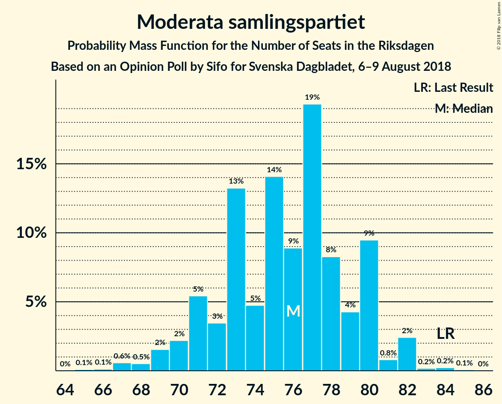
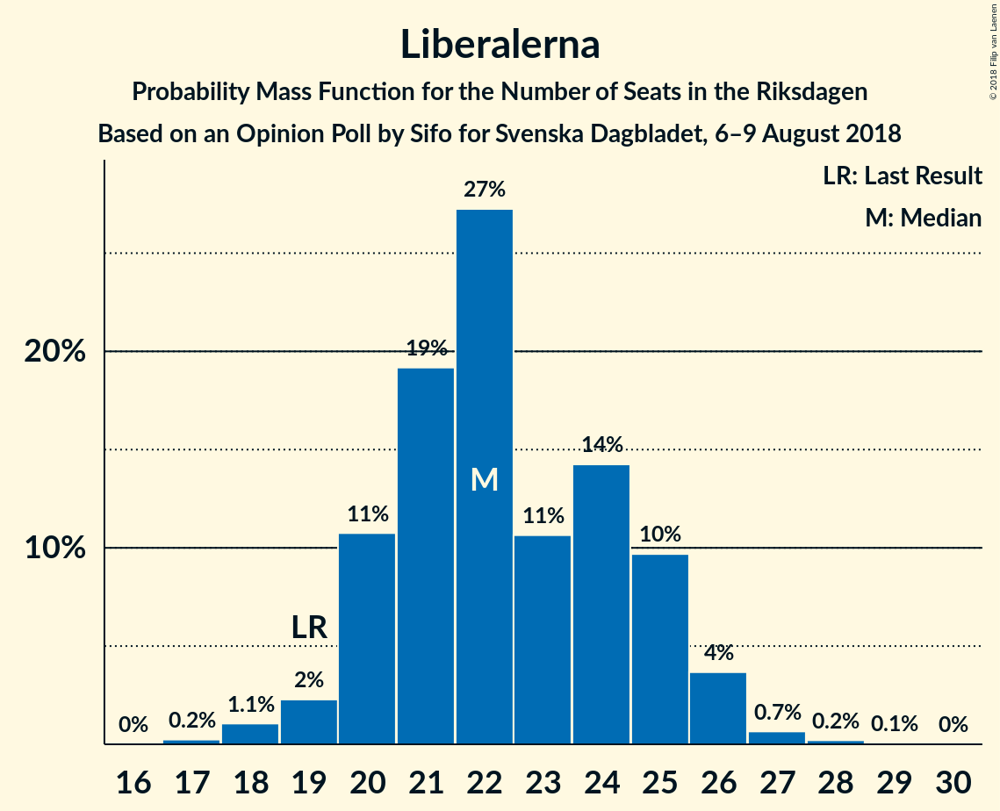

# Opinion Poll by Sifo for Svenska Dagbladet, 6–9 August 2018

<a href="#voting-intentions">Voting Intentions</a> | <a href="#seats">Seats</a> | <a href="#coalitions">Coalitions</a> | <a href="#technical-information">Technical Information</a>

## Voting Intentions

### Confidence Intervals

| Party | Last Result | Poll Result | 80% Confidence Interval | 90% Confidence Interval | 95% Confidence Interval | 99% Confidence Interval |
|:-----:|:-----------:|:-----------:|:-----------------------:|:-----------------------:|:-----------------------:|:-----------------------:|
| Sveriges socialdemokratiska arbetareparti | 31.0% | 25.8% | 24.6–27.0% |24.3–27.4% |24.0–27.7% |23.5–28.3% |
| Moderata samlingspartiet | 23.3% | 20.3% | 19.2–21.5% |18.9–21.8% |18.7–22.1% |18.1–22.6% |
| Sverigedemokraterna | 12.9% | 16.8% | 15.8–17.8% |15.5–18.2% |15.2–18.4% |14.8–18.9% |
| Centerpartiet | 6.1% | 10.3% | 9.5–11.2% |9.2–11.4% |9.1–11.7% |8.6–12.1% |
| Vänsterpartiet | 5.7% | 9.2% | 8.4–10.0% |8.2–10.3% |8.0–10.6% |7.7–11.0% |
| Liberalerna | 5.4% | 6.0% | 5.3–6.7% |5.2–7.0% |5.1–7.1% |4.8–7.4% |
| Miljöpartiet de gröna | 6.9% | 5.6% | 4.9–6.3% |4.8–6.4% |4.7–6.7% |4.4–7.0% |
| Kristdemokraterna | 4.6% | 3.3% | 2.9–3.8% |2.7–4.1% |2.6–4.3% |2.5–4.5% |
| Feministiskt initiativ | 3.1% | 1.5% | 1.1–1.9% |1.1–2.1% |1.0–2.2% |0.8–2.3% |

*Note:* The poll result column reflects the actual value used in the calculations. Published results may vary slightly, and in addition be rounded to fewer digits.

## Seats

### Confidence Intervals

| Party | Last Result | Median | 80% Confidence Interval | 90% Confidence Interval | 95% Confidence Interval | 99% Confidence Interval |
|:-----:|:-----------:|:------:|:-----------------------:|:-----------------------:|:-----------------------:|:-----------------------:|
| <a href="#sveriges-socialdemokratiska-arbetareparti">Sveriges socialdemokratiska arbetareparti</a> | 113 | 95 | 91–99 |91–100 |89–102 |87–104 |
| <a href="#moderata-samlingspartiet">Moderata samlingspartiet</a> | 84 | 76 | 72–79 |70–80 |70–82 |67–82 |
| <a href="#sverigedemokraterna">Sverigedemokraterna</a> | 49 | 63 | 59–65 |58–67 |57–68 |54–70 |
| <a href="#centerpartiet">Centerpartiet</a> | 22 | 38 | 35–42 |34–42 |33–43 |32–44 |
| <a href="#vänsterpartiet">Vänsterpartiet</a> | 21 | 34 | 32–36 |31–37 |30–38 |29–40 |
| <a href="#liberalerna">Liberalerna</a> | 19 | 22 | 21–24 |20–25 |19–26 |18–27 |
| <a href="#miljöpartiet-de-gröna">Miljöpartiet de gröna</a> | 25 | 20 | 19–22 |18–23 |18–24 |16–25 |
| <a href="#kristdemokraterna">Kristdemokraterna</a> | 16 | 0 | 0 |0 |0–15 |0–16 |
| <a href="#feministiskt-initiativ">Feministiskt initiativ</a> | 0 | 0 | 0 |0 |0 |0 |

### Sveriges socialdemokratiska arbetareparti

*For a full overview of the results for this party, see the [Sveriges socialdemokratiska arbetareparti](party-sverigessocialdemokratiskaarbetareparti.html) page.*

| Number of Seats | Probability | Accumulated | Special Marks |
|:---------------:|:-----------:|:-----------:|:-------------:|
| 84 | 0% | 100% |  |
| 85 | 0.1% | 99.9% |  |
| 86 | 0.1% | 99.9% |  |
| 87 | 0.4% | 99.8% |  |
| 88 | 0.7% | 99.3% |  |
| 89 | 1.4% | 98.6% |  |
| 90 | 1.3% | 97% |  |
| 91 | 12% | 96% |  |
| 92 | 4% | 84% |  |
| 93 | 9% | 80% |  |
| 94 | 6% | 71% |  |
| 95 | 28% | 65% | Median |
| 96 | 4% | 37% |  |
| 97 | 12% | 34% |  |
| 98 | 8% | 21% |  |
| 99 | 4% | 13% |  |
| 100 | 5% | 9% |  |
| 101 | 2% | 5% |  |
| 102 | 1.1% | 3% |  |
| 103 | 1.0% | 2% |  |
| 104 | 0.5% | 0.9% |  |
| 105 | 0% | 0.4% |  |
| 106 | 0.2% | 0.3% |  |
| 107 | 0.1% | 0.1% |  |
| 108 | 0% | 0% |  |
| 109 | 0% | 0% |  |
| 110 | 0% | 0% |  |
| 111 | 0% | 0% |  |
| 112 | 0% | 0% |  |
| 113 | 0% | 0% | Last Result |

### Moderata samlingspartiet

*For a full overview of the results for this party, see the [Moderata samlingspartiet](party-moderatasamlingspartiet.html) page.*

| Number of Seats | Probability | Accumulated | Special Marks |
|:---------------:|:-----------:|:-----------:|:-------------:|
| 65 | 0.1% | 100% |  |
| 66 | 0.1% | 99.9% |  |
| 67 | 0.6% | 99.8% |  |
| 68 | 0.5% | 99.1% |  |
| 69 | 1.0% | 98.6% |  |
| 70 | 3% | 98% |  |
| 71 | 3% | 94% |  |
| 72 | 4% | 92% |  |
| 73 | 15% | 88% |  |
| 74 | 3% | 73% |  |
| 75 | 19% | 70% |  |
| 76 | 3% | 50% | Median |
| 77 | 27% | 47% |  |
| 78 | 6% | 20% |  |
| 79 | 5% | 13% |  |
| 80 | 4% | 9% |  |
| 81 | 0.6% | 5% |  |
| 82 | 3% | 4% |  |
| 83 | 0.1% | 0.5% |  |
| 84 | 0.3% | 0.4% | Last Result |
| 85 | 0% | 0.1% |  |
| 86 | 0% | 0% |  |

### Sverigedemokraterna

*For a full overview of the results for this party, see the [Sverigedemokraterna](party-sverigedemokraterna.html) page.*

| Number of Seats | Probability | Accumulated | Special Marks |
|:---------------:|:-----------:|:-----------:|:-------------:|
| 49 | 0% | 100% | Last Result |
| 50 | 0% | 100% |  |
| 51 | 0% | 100% |  |
| 52 | 0% | 100% |  |
| 53 | 0.1% | 100% |  |
| 54 | 0.4% | 99.9% |  |
| 55 | 0.4% | 99.5% |  |
| 56 | 0.8% | 99.0% |  |
| 57 | 3% | 98% |  |
| 58 | 4% | 95% |  |
| 59 | 5% | 92% |  |
| 60 | 11% | 87% |  |
| 61 | 4% | 76% |  |
| 62 | 6% | 72% |  |
| 63 | 18% | 65% | Median |
| 64 | 16% | 47% |  |
| 65 | 22% | 30% |  |
| 66 | 2% | 8% |  |
| 67 | 3% | 7% |  |
| 68 | 1.3% | 3% |  |
| 69 | 1.3% | 2% |  |
| 70 | 0.5% | 0.8% |  |
| 71 | 0.2% | 0.2% |  |
| 72 | 0% | 0% |  |

### Centerpartiet

*For a full overview of the results for this party, see the [Centerpartiet](party-centerpartiet.html) page.*

| Number of Seats | Probability | Accumulated | Special Marks |
|:---------------:|:-----------:|:-----------:|:-------------:|
| 22 | 0% | 100% | Last Result |
| 23 | 0% | 100% |  |
| 24 | 0% | 100% |  |
| 25 | 0% | 100% |  |
| 26 | 0% | 100% |  |
| 27 | 0% | 100% |  |
| 28 | 0% | 100% |  |
| 29 | 0% | 100% |  |
| 30 | 0% | 100% |  |
| 31 | 0.1% | 100% |  |
| 32 | 0.5% | 99.9% |  |
| 33 | 2% | 99.4% |  |
| 34 | 3% | 97% |  |
| 35 | 7% | 94% |  |
| 36 | 22% | 87% |  |
| 37 | 14% | 65% |  |
| 38 | 13% | 51% | Median |
| 39 | 9% | 39% |  |
| 40 | 8% | 30% |  |
| 41 | 10% | 22% |  |
| 42 | 8% | 11% |  |
| 43 | 2% | 3% |  |
| 44 | 1.1% | 1.4% |  |
| 45 | 0.2% | 0.3% |  |
| 46 | 0.1% | 0.1% |  |
| 47 | 0% | 0% |  |

### Vänsterpartiet

*For a full overview of the results for this party, see the [Vänsterpartiet](party-vänsterpartiet.html) page.*

| Number of Seats | Probability | Accumulated | Special Marks |
|:---------------:|:-----------:|:-----------:|:-------------:|
| 21 | 0% | 100% | Last Result |
| 22 | 0% | 100% |  |
| 23 | 0% | 100% |  |
| 24 | 0% | 100% |  |
| 25 | 0% | 100% |  |
| 26 | 0% | 100% |  |
| 27 | 0.1% | 100% |  |
| 28 | 0.3% | 99.9% |  |
| 29 | 0.7% | 99.6% |  |
| 30 | 3% | 98.9% |  |
| 31 | 6% | 96% |  |
| 32 | 12% | 91% |  |
| 33 | 17% | 78% |  |
| 34 | 18% | 62% | Median |
| 35 | 28% | 44% |  |
| 36 | 7% | 16% |  |
| 37 | 5% | 8% |  |
| 38 | 2% | 3% |  |
| 39 | 1.2% | 2% |  |
| 40 | 0.5% | 0.7% |  |
| 41 | 0.1% | 0.1% |  |
| 42 | 0% | 0% |  |

### Liberalerna

*For a full overview of the results for this party, see the [Liberalerna](party-liberalerna.html) page.*

| Number of Seats | Probability | Accumulated | Special Marks |
|:---------------:|:-----------:|:-----------:|:-------------:|
| 17 | 0.3% | 100% |  |
| 18 | 0.8% | 99.7% |  |
| 19 | 1.5% | 98.9% | Last Result |
| 20 | 5% | 97% |  |
| 21 | 28% | 92% |  |
| 22 | 37% | 65% | Median |
| 23 | 13% | 28% |  |
| 24 | 5% | 14% |  |
| 25 | 5% | 10% |  |
| 26 | 4% | 5% |  |
| 27 | 0.6% | 0.8% |  |
| 28 | 0.2% | 0.2% |  |
| 29 | 0% | 0.1% |  |
| 30 | 0% | 0% |  |

### Miljöpartiet de gröna

*For a full overview of the results for this party, see the [Miljöpartiet de gröna](party-miljöpartietdegröna.html) page.*

| Number of Seats | Probability | Accumulated | Special Marks |
|:---------------:|:-----------:|:-----------:|:-------------:|
| 15 | 0% | 100% |  |
| 16 | 0.6% | 99.9% |  |
| 17 | 1.0% | 99.3% |  |
| 18 | 6% | 98% |  |
| 19 | 5% | 92% |  |
| 20 | 42% | 87% | Median |
| 21 | 9% | 46% |  |
| 22 | 27% | 36% |  |
| 23 | 6% | 10% |  |
| 24 | 2% | 4% |  |
| 25 | 1.3% | 2% | Last Result |
| 26 | 0.1% | 0.3% |  |
| 27 | 0.1% | 0.1% |  |
| 28 | 0% | 0% |  |

### Kristdemokraterna

*For a full overview of the results for this party, see the [Kristdemokraterna](party-kristdemokraterna.html) page.*

| Number of Seats | Probability | Accumulated | Special Marks |
|:---------------:|:-----------:|:-----------:|:-------------:|
| 0 | 96% | 100% | Median |
| 1 | 0% | 4% |  |
| 2 | 0% | 4% |  |
| 3 | 0% | 4% |  |
| 4 | 0% | 4% |  |
| 5 | 0% | 4% |  |
| 6 | 0% | 4% |  |
| 7 | 0% | 4% |  |
| 8 | 0% | 4% |  |
| 9 | 0% | 4% |  |
| 10 | 0% | 4% |  |
| 11 | 0% | 4% |  |
| 12 | 0% | 4% |  |
| 13 | 0% | 4% |  |
| 14 | 0.2% | 4% |  |
| 15 | 3% | 4% |  |
| 16 | 0.7% | 0.7% | Last Result |
| 17 | 0% | 0% |  |

### Feministiskt initiativ

*For a full overview of the results for this party, see the [Feministiskt initiativ](party-feministisktinitiativ.html) page.*

| Number of Seats | Probability | Accumulated | Special Marks |
|:---------------:|:-----------:|:-----------:|:-------------:|
| 0 | 100% | 100% | Last Result, Median |

## Coalitions

### Confidence Intervals

| Coalition | Last Result | Median | Majority? | 80% Confidence Interval | 90% Confidence Interval | 95% Confidence Interval | 99% Confidence Interval |
|:---------:|:-----------:|:------:|:---------:|:-----------------------:|:-----------------------:|:-----------------------:|:-----------------------:|
| Sveriges socialdemokratiska arbetareparti – Moderata samlingspartiet | 197 | 170 | 18% | 167–176 | 165–178 | 164–178 | 158–180 |
| Sveriges socialdemokratiska arbetareparti – Vänsterpartiet – Miljöpartiet de gröna – Feministiskt initiativ | 159 | 150 | 0% | 145–154 | 145–156 | 143–157 | 141–160 |
| Sveriges socialdemokratiska arbetareparti – Vänsterpartiet – Miljöpartiet de gröna | 159 | 150 | 0% | 145–154 | 145–156 | 143–157 | 141–160 |
| Moderata samlingspartiet – Centerpartiet – Liberalerna – Kristdemokraterna | 141 | 135 | 0% | 132–142 | 131–143 | 130–144 | 127–147 |
| Moderata samlingspartiet – Sverigedemokraterna | 133 | 139 | 0% | 133–142 | 132–143 | 130–144 | 126–146 |
| Moderata samlingspartiet – Centerpartiet – Liberalerna | 125 | 134 | 0% | 132–141 | 129–143 | 128–143 | 126–145 |
| Sveriges socialdemokratiska arbetareparti – Vänsterpartiet | 134 | 130 | 0% | 125–133 | 125–134 | 123–135 | 120–140 |
| Sveriges socialdemokratiska arbetareparti – Miljöpartiet de gröna | 138 | 115 | 0% | 111–121 | 111–122 | 110–123 | 108–126 |
| Moderata samlingspartiet – Centerpartiet – Kristdemokraterna | 122 | 113 | 0% | 110–120 | 108–121 | 107–122 | 105–125 |
| Moderata samlingspartiet – Centerpartiet | 106 | 113 | 0% | 109–118 | 107–120 | 106–121 | 104–122 |

### Sveriges socialdemokratiska arbetareparti – Moderata samlingspartiet

| Number of Seats | Probability | Accumulated | Special Marks |
|:---------------:|:-----------:|:-----------:|:-------------:|
| 156 | 0.1% | 100% |  |
| 157 | 0.4% | 99.9% |  |
| 158 | 0.3% | 99.5% |  |
| 159 | 0.1% | 99.2% |  |
| 160 | 0.3% | 99.2% |  |
| 161 | 0.5% | 98.9% |  |
| 162 | 0.4% | 98% |  |
| 163 | 0.4% | 98% |  |
| 164 | 2% | 98% |  |
| 165 | 2% | 96% |  |
| 166 | 3% | 94% |  |
| 167 | 5% | 91% |  |
| 168 | 17% | 86% |  |
| 169 | 3% | 69% |  |
| 170 | 16% | 66% |  |
| 171 | 6% | 49% | Median |
| 172 | 17% | 44% |  |
| 173 | 7% | 27% |  |
| 174 | 2% | 20% |  |
| 175 | 6% | 18% | Majority |
| 176 | 4% | 11% |  |
| 177 | 1.5% | 7% |  |
| 178 | 4% | 6% |  |
| 179 | 0.3% | 1.1% |  |
| 180 | 0.4% | 0.8% |  |
| 181 | 0.2% | 0.4% |  |
| 182 | 0.1% | 0.2% |  |
| 183 | 0% | 0.1% |  |
| 184 | 0% | 0.1% |  |
| 185 | 0% | 0% |  |
| 186 | 0% | 0% |  |
| 187 | 0% | 0% |  |
| 188 | 0% | 0% |  |
| 189 | 0% | 0% |  |
| 190 | 0% | 0% |  |
| 191 | 0% | 0% |  |
| 192 | 0% | 0% |  |
| 193 | 0% | 0% |  |
| 194 | 0% | 0% |  |
| 195 | 0% | 0% |  |
| 196 | 0% | 0% |  |
| 197 | 0% | 0% | Last Result |

### Sveriges socialdemokratiska arbetareparti – Vänsterpartiet – Miljöpartiet de gröna – Feministiskt initiativ

| Number of Seats | Probability | Accumulated | Special Marks |
|:---------------:|:-----------:|:-----------:|:-------------:|
| 137 | 0% | 100% |  |
| 138 | 0% | 99.9% |  |
| 139 | 0.1% | 99.9% |  |
| 140 | 0.2% | 99.8% |  |
| 141 | 0.8% | 99.6% |  |
| 142 | 0.3% | 98.8% |  |
| 143 | 0.9% | 98% |  |
| 144 | 2% | 97% |  |
| 145 | 10% | 96% |  |
| 146 | 10% | 86% |  |
| 147 | 3% | 77% |  |
| 148 | 4% | 74% |  |
| 149 | 8% | 70% | Median |
| 150 | 21% | 62% |  |
| 151 | 8% | 41% |  |
| 152 | 11% | 33% |  |
| 153 | 10% | 23% |  |
| 154 | 5% | 13% |  |
| 155 | 3% | 8% |  |
| 156 | 3% | 5% |  |
| 157 | 0.6% | 3% |  |
| 158 | 0.8% | 2% |  |
| 159 | 0.7% | 1.3% | Last Result |
| 160 | 0.2% | 0.7% |  |
| 161 | 0.2% | 0.4% |  |
| 162 | 0.1% | 0.2% |  |
| 163 | 0.1% | 0.2% |  |
| 164 | 0.1% | 0.1% |  |
| 165 | 0% | 0% |  |

### Sveriges socialdemokratiska arbetareparti – Vänsterpartiet – Miljöpartiet de gröna

| Number of Seats | Probability | Accumulated | Special Marks |
|:---------------:|:-----------:|:-----------:|:-------------:|
| 137 | 0% | 100% |  |
| 138 | 0% | 99.9% |  |
| 139 | 0.1% | 99.9% |  |
| 140 | 0.2% | 99.8% |  |
| 141 | 0.8% | 99.6% |  |
| 142 | 0.3% | 98.8% |  |
| 143 | 0.9% | 98% |  |
| 144 | 2% | 97% |  |
| 145 | 10% | 96% |  |
| 146 | 10% | 86% |  |
| 147 | 3% | 77% |  |
| 148 | 4% | 74% |  |
| 149 | 8% | 70% | Median |
| 150 | 21% | 62% |  |
| 151 | 8% | 41% |  |
| 152 | 11% | 33% |  |
| 153 | 10% | 23% |  |
| 154 | 5% | 13% |  |
| 155 | 3% | 8% |  |
| 156 | 3% | 5% |  |
| 157 | 0.6% | 3% |  |
| 158 | 0.8% | 2% |  |
| 159 | 0.7% | 1.3% | Last Result |
| 160 | 0.2% | 0.7% |  |
| 161 | 0.2% | 0.4% |  |
| 162 | 0.1% | 0.2% |  |
| 163 | 0.1% | 0.2% |  |
| 164 | 0.1% | 0.1% |  |
| 165 | 0% | 0% |  |

### Moderata samlingspartiet – Centerpartiet – Liberalerna – Kristdemokraterna

| Number of Seats | Probability | Accumulated | Special Marks |
|:---------------:|:-----------:|:-----------:|:-------------:|
| 124 | 0.1% | 100% |  |
| 125 | 0% | 99.9% |  |
| 126 | 0.1% | 99.9% |  |
| 127 | 0.9% | 99.7% |  |
| 128 | 0.6% | 98.9% |  |
| 129 | 0.6% | 98% |  |
| 130 | 3% | 98% |  |
| 131 | 2% | 95% |  |
| 132 | 4% | 93% |  |
| 133 | 13% | 89% |  |
| 134 | 25% | 76% |  |
| 135 | 3% | 52% |  |
| 136 | 6% | 48% | Median |
| 137 | 4% | 42% |  |
| 138 | 6% | 38% |  |
| 139 | 8% | 32% |  |
| 140 | 9% | 24% |  |
| 141 | 4% | 15% | Last Result |
| 142 | 2% | 11% |  |
| 143 | 7% | 9% |  |
| 144 | 1.0% | 3% |  |
| 145 | 0.7% | 2% |  |
| 146 | 0.4% | 1.0% |  |
| 147 | 0.2% | 0.6% |  |
| 148 | 0.2% | 0.4% |  |
| 149 | 0.1% | 0.2% |  |
| 150 | 0% | 0.1% |  |
| 151 | 0% | 0.1% |  |
| 152 | 0% | 0.1% |  |
| 153 | 0% | 0.1% |  |
| 154 | 0% | 0% |  |

### Moderata samlingspartiet – Sverigedemokraterna

| Number of Seats | Probability | Accumulated | Special Marks |
|:---------------:|:-----------:|:-----------:|:-------------:|
| 124 | 0% | 100% |  |
| 125 | 0.1% | 99.9% |  |
| 126 | 0.6% | 99.8% |  |
| 127 | 0.1% | 99.2% |  |
| 128 | 0.4% | 99.1% |  |
| 129 | 0.5% | 98.6% |  |
| 130 | 0.9% | 98% |  |
| 131 | 1.1% | 97% |  |
| 132 | 2% | 96% |  |
| 133 | 4% | 94% | Last Result |
| 134 | 3% | 90% |  |
| 135 | 7% | 87% |  |
| 136 | 13% | 80% |  |
| 137 | 5% | 67% |  |
| 138 | 11% | 63% |  |
| 139 | 9% | 51% | Median |
| 140 | 6% | 43% |  |
| 141 | 9% | 36% |  |
| 142 | 21% | 27% |  |
| 143 | 3% | 7% |  |
| 144 | 1.1% | 3% |  |
| 145 | 1.1% | 2% |  |
| 146 | 0.7% | 1.0% |  |
| 147 | 0.1% | 0.3% |  |
| 148 | 0.1% | 0.2% |  |
| 149 | 0.1% | 0.1% |  |
| 150 | 0% | 0.1% |  |
| 151 | 0% | 0% |  |

### Moderata samlingspartiet – Centerpartiet – Liberalerna

| Number of Seats | Probability | Accumulated | Special Marks |
|:---------------:|:-----------:|:-----------:|:-------------:|
| 123 | 0.1% | 100% |  |
| 124 | 0.1% | 99.9% |  |
| 125 | 0.1% | 99.7% | Last Result |
| 126 | 0.2% | 99.7% |  |
| 127 | 2% | 99.4% |  |
| 128 | 2% | 98% |  |
| 129 | 1.2% | 96% |  |
| 130 | 3% | 95% |  |
| 131 | 2% | 92% |  |
| 132 | 4% | 90% |  |
| 133 | 13% | 86% |  |
| 134 | 25% | 73% |  |
| 135 | 3% | 48% |  |
| 136 | 6% | 45% | Median |
| 137 | 4% | 38% |  |
| 138 | 6% | 34% |  |
| 139 | 8% | 28% |  |
| 140 | 9% | 21% |  |
| 141 | 3% | 11% |  |
| 142 | 1.3% | 8% |  |
| 143 | 6% | 7% |  |
| 144 | 0.5% | 1.0% |  |
| 145 | 0.3% | 0.5% |  |
| 146 | 0.1% | 0.2% |  |
| 147 | 0.1% | 0.2% |  |
| 148 | 0% | 0.1% |  |
| 149 | 0% | 0% |  |

### Sveriges socialdemokratiska arbetareparti – Vänsterpartiet

| Number of Seats | Probability | Accumulated | Special Marks |
|:---------------:|:-----------:|:-----------:|:-------------:|
| 117 | 0% | 100% |  |
| 118 | 0.1% | 99.9% |  |
| 119 | 0.2% | 99.9% |  |
| 120 | 0.2% | 99.6% |  |
| 121 | 0.6% | 99.5% |  |
| 122 | 0.3% | 98.9% |  |
| 123 | 2% | 98.6% |  |
| 124 | 2% | 97% |  |
| 125 | 11% | 95% |  |
| 126 | 10% | 85% |  |
| 127 | 6% | 75% |  |
| 128 | 7% | 68% |  |
| 129 | 4% | 61% | Median |
| 130 | 26% | 57% |  |
| 131 | 11% | 31% |  |
| 132 | 8% | 20% |  |
| 133 | 4% | 11% |  |
| 134 | 4% | 8% | Last Result |
| 135 | 1.4% | 4% |  |
| 136 | 0.6% | 2% |  |
| 137 | 0.4% | 2% |  |
| 138 | 0.5% | 1.4% |  |
| 139 | 0.3% | 0.9% |  |
| 140 | 0.2% | 0.6% |  |
| 141 | 0.3% | 0.4% |  |
| 142 | 0% | 0.1% |  |
| 143 | 0% | 0% |  |

### Sveriges socialdemokratiska arbetareparti – Miljöpartiet de gröna

| Number of Seats | Probability | Accumulated | Special Marks |
|:---------------:|:-----------:|:-----------:|:-------------:|
| 105 | 0% | 100% |  |
| 106 | 0.2% | 99.9% |  |
| 107 | 0.2% | 99.8% |  |
| 108 | 0.7% | 99.5% |  |
| 109 | 1.1% | 98.8% |  |
| 110 | 0.7% | 98% |  |
| 111 | 9% | 97% |  |
| 112 | 4% | 88% |  |
| 113 | 10% | 84% |  |
| 114 | 8% | 74% |  |
| 115 | 18% | 67% | Median |
| 116 | 7% | 48% |  |
| 117 | 10% | 41% |  |
| 118 | 7% | 31% |  |
| 119 | 12% | 25% |  |
| 120 | 1.5% | 13% |  |
| 121 | 6% | 12% |  |
| 122 | 0.6% | 5% |  |
| 123 | 2% | 5% |  |
| 124 | 1.4% | 2% |  |
| 125 | 0.3% | 0.9% |  |
| 126 | 0.4% | 0.6% |  |
| 127 | 0.1% | 0.2% |  |
| 128 | 0% | 0.1% |  |
| 129 | 0% | 0% |  |
| 130 | 0% | 0% |  |
| 131 | 0% | 0% |  |
| 132 | 0% | 0% |  |
| 133 | 0% | 0% |  |
| 134 | 0% | 0% |  |
| 135 | 0% | 0% |  |
| 136 | 0% | 0% |  |
| 137 | 0% | 0% |  |
| 138 | 0% | 0% | Last Result |

### Moderata samlingspartiet – Centerpartiet – Kristdemokraterna

| Number of Seats | Probability | Accumulated | Special Marks |
|:---------------:|:-----------:|:-----------:|:-------------:|
| 102 | 0% | 100% |  |
| 103 | 0.1% | 99.9% |  |
| 104 | 0.3% | 99.9% |  |
| 105 | 0.4% | 99.6% |  |
| 106 | 0.9% | 99.2% |  |
| 107 | 2% | 98% |  |
| 108 | 3% | 97% |  |
| 109 | 2% | 93% |  |
| 110 | 3% | 91% |  |
| 111 | 12% | 88% |  |
| 112 | 12% | 76% |  |
| 113 | 19% | 64% |  |
| 114 | 6% | 45% | Median |
| 115 | 5% | 38% |  |
| 116 | 2% | 34% |  |
| 117 | 7% | 32% |  |
| 118 | 11% | 24% |  |
| 119 | 2% | 13% |  |
| 120 | 4% | 11% |  |
| 121 | 4% | 7% |  |
| 122 | 2% | 3% | Last Result |
| 123 | 0.5% | 2% |  |
| 124 | 0.6% | 1.2% |  |
| 125 | 0.2% | 0.6% |  |
| 126 | 0.2% | 0.4% |  |
| 127 | 0.1% | 0.2% |  |
| 128 | 0.1% | 0.2% |  |
| 129 | 0% | 0.1% |  |
| 130 | 0% | 0.1% |  |
| 131 | 0% | 0.1% |  |
| 132 | 0% | 0% |  |

### Moderata samlingspartiet – Centerpartiet

| Number of Seats | Probability | Accumulated | Special Marks |
|:---------------:|:-----------:|:-----------:|:-------------:|
| 101 | 0% | 100% |  |
| 102 | 0.1% | 99.9% |  |
| 103 | 0.2% | 99.9% |  |
| 104 | 0.3% | 99.7% |  |
| 105 | 0.5% | 99.4% |  |
| 106 | 2% | 98.9% | Last Result |
| 107 | 3% | 97% |  |
| 108 | 4% | 94% |  |
| 109 | 3% | 90% |  |
| 110 | 3% | 88% |  |
| 111 | 12% | 84% |  |
| 112 | 12% | 72% |  |
| 113 | 19% | 60% |  |
| 114 | 6% | 41% | Median |
| 115 | 5% | 35% |  |
| 116 | 2% | 30% |  |
| 117 | 7% | 28% |  |
| 118 | 11% | 21% |  |
| 119 | 1.5% | 9% |  |
| 120 | 4% | 8% |  |
| 121 | 3% | 4% |  |
| 122 | 0.5% | 0.7% |  |
| 123 | 0.1% | 0.3% |  |
| 124 | 0.1% | 0.1% |  |
| 125 | 0.1% | 0.1% |  |
| 126 | 0% | 0% |  |

## Technical Information

### Opinion Poll

+ **Polling firm:** Sifo
+ **Commissioner(s):** Svenska Dagbladet
+ **Fieldwork period:** 6–9 August 2018

### Calculations

+ **Sample size:** 2294
+ **Simulations done:** 524,288
+ **Error estimate:** 1.25%

