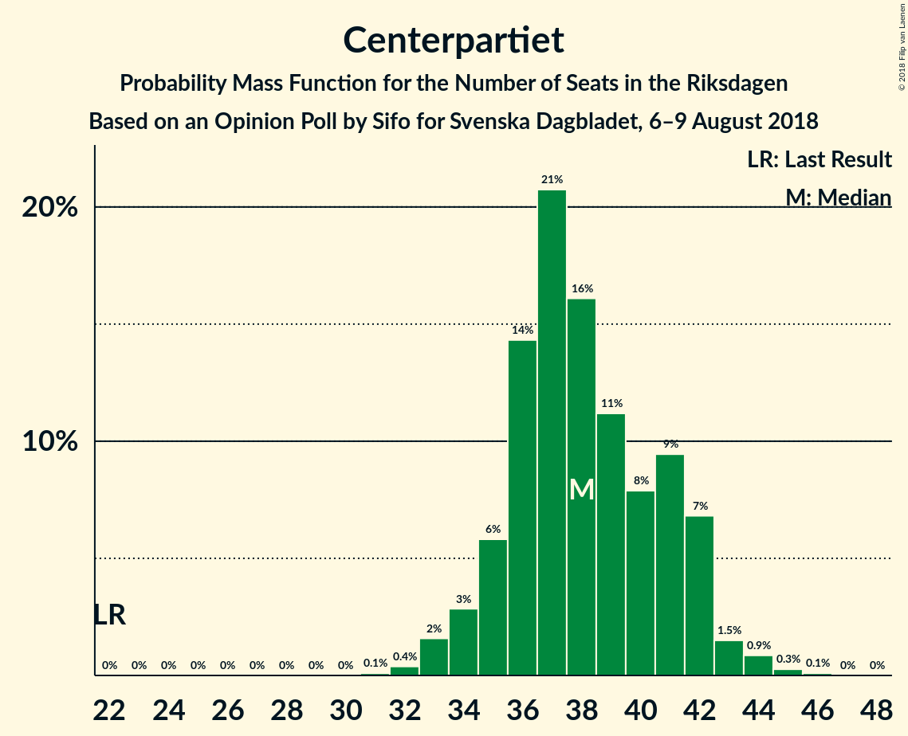
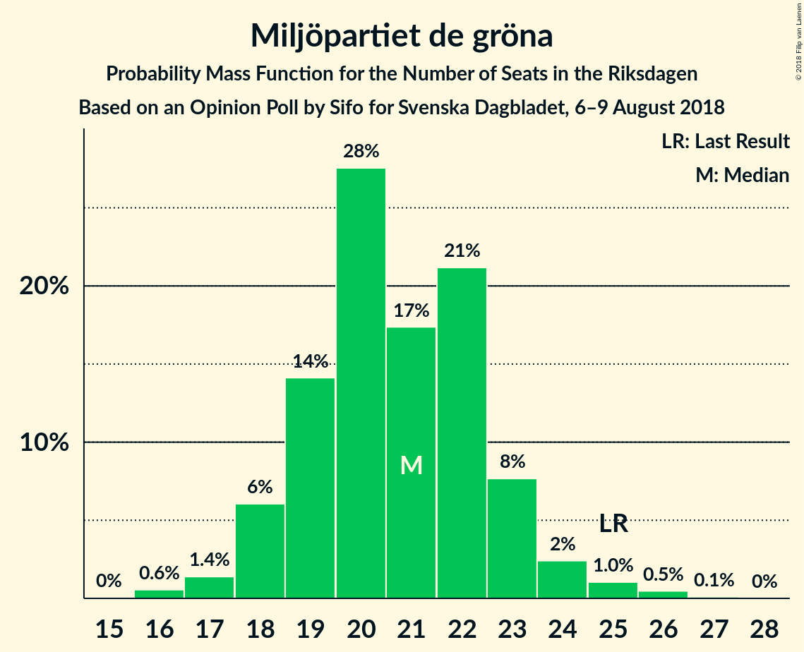

# Opinion Poll by Sifo for Svenska Dagbladet, 6–9 August 2018

<a href="#voting-intentions">Voting Intentions</a> | <a href="#seats">Seats</a> | <a href="#coalitions">Coalitions</a> | <a href="#technical-information">Technical Information</a>

## Voting Intentions

### Confidence Intervals

| Party | Last Result | Poll Result | 80% Confidence Interval | 90% Confidence Interval | 95% Confidence Interval | 99% Confidence Interval |
|:-----:|:-----------:|:-----------:|:-----------------------:|:-----------------------:|:-----------------------:|:-----------------------:|
| Sveriges socialdemokratiska arbetareparti | 31.0% | 25.8% | 24.7–27.0% |24.3–27.3% |24.1–27.6% |23.5–28.2% |
| Moderata samlingspartiet | 23.3% | 20.3% | 19.3–21.4% |19.0–21.7% |18.7–22.0% |18.2–22.6% |
| Sverigedemokraterna | 12.9% | 16.8% | 15.8–17.8% |15.5–18.1% |15.3–18.4% |14.8–18.9% |
| Centerpartiet | 6.1% | 10.3% | 9.5–11.2% |9.3–11.4% |9.1–11.6% |8.7–12.0% |
| Vänsterpartiet | 5.7% | 9.2% | 8.5–10.0% |8.2–10.3% |8.1–10.5% |7.7–10.9% |
| Liberalerna | 5.4% | 6.0% | 5.4–6.7% |5.2–6.9% |5.1–7.1% |4.8–7.4% |
| Miljöpartiet de gröna | 6.9% | 5.6% | 5.0–6.2% |4.8–6.4% |4.7–6.6% |4.5–6.9% |
| Kristdemokraterna | 4.6% | 3.3% | 2.9–3.9% |2.8–4.0% |2.7–4.1% |2.5–4.4% |
| Feministiskt initiativ | 3.1% | 1.5% | 1.2–1.9% |1.1–2.0% |1.1–2.1% |0.9–2.3% |

*Note:* The poll result column reflects the actual value used in the calculations. Published results may vary slightly, and in addition be rounded to fewer digits.

## Seats

### Confidence Intervals

| Party | Last Result | Median | 80% Confidence Interval | 90% Confidence Interval | 95% Confidence Interval | 99% Confidence Interval |
|:-----:|:-----------:|:------:|:-----------------------:|:-----------------------:|:-----------------------:|:-----------------------:|
| <a href="#sveriges-socialdemokratiska-arbetareparti">Sveriges socialdemokratiska arbetareparti</a> | 113 | 95 | 91–99 |91–101 |89–102 |87–104 |
| <a href="#moderata-samlingspartiet">Moderata samlingspartiet</a> | 84 | 76 | 71–80 |70–80 |69–82 |67–83 |
| <a href="#sverigedemokraterna">Sverigedemokraterna</a> | 49 | 63 | 59–65 |58–67 |57–68 |55–70 |
| <a href="#centerpartiet">Centerpartiet</a> | 22 | 38 | 35–41 |35–42 |34–43 |32–44 |
| <a href="#vänsterpartiet">Vänsterpartiet</a> | 21 | 34 | 32–37 |31–37 |30–39 |29–40 |
| <a href="#liberalerna">Liberalerna</a> | 19 | 22 | 20–25 |20–25 |19–26 |18–27 |
| <a href="#miljöpartiet-de-gröna">Miljöpartiet de gröna</a> | 25 | 21 | 19–23 |18–23 |18–24 |16–26 |
| <a href="#kristdemokraterna">Kristdemokraterna</a> | 16 | 0 | 0 |0 |0–15 |0–16 |
| <a href="#feministiskt-initiativ">Feministiskt initiativ</a> | 0 | 0 | 0 |0 |0 |0 |

### Sveriges socialdemokratiska arbetareparti

*For a full overview of the results for this party, see the [Sveriges socialdemokratiska arbetareparti](party-sverigessocialdemokratiskaarbetareparti.html) page.*

| Number of Seats | Probability | Accumulated | Special Marks |
|:---------------:|:-----------:|:-----------:|:-------------:|
| 84 | 0% | 100% |  |
| 85 | 0.1% | 99.9% |  |
| 86 | 0.1% | 99.8% |  |
| 87 | 0.4% | 99.7% |  |
| 88 | 0.6% | 99.3% |  |
| 89 | 2% | 98.7% |  |
| 90 | 2% | 97% |  |
| 91 | 9% | 95% |  |
| 92 | 4% | 86% |  |
| 93 | 15% | 82% |  |
| 94 | 7% | 67% |  |
| 95 | 18% | 60% | Median |
| 96 | 10% | 42% |  |
| 97 | 10% | 33% |  |
| 98 | 8% | 23% |  |
| 99 | 5% | 14% |  |
| 100 | 3% | 9% |  |
| 101 | 2% | 6% |  |
| 102 | 2% | 3% |  |
| 103 | 0.9% | 2% |  |
| 104 | 0.4% | 0.9% |  |
| 105 | 0.2% | 0.4% |  |
| 106 | 0.2% | 0.2% |  |
| 107 | 0.1% | 0.1% |  |
| 108 | 0% | 0% |  |
| 109 | 0% | 0% |  |
| 110 | 0% | 0% |  |
| 111 | 0% | 0% |  |
| 112 | 0% | 0% |  |
| 113 | 0% | 0% | Last Result |

### Moderata samlingspartiet

*For a full overview of the results for this party, see the [Moderata samlingspartiet](party-moderatasamlingspartiet.html) page.*

| Number of Seats | Probability | Accumulated | Special Marks |
|:---------------:|:-----------:|:-----------:|:-------------:|
| 65 | 0.1% | 100% |  |
| 66 | 0.1% | 99.9% |  |
| 67 | 0.6% | 99.8% |  |
| 68 | 0.5% | 99.2% |  |
| 69 | 2% | 98.7% |  |
| 70 | 2% | 97% |  |
| 71 | 5% | 95% |  |
| 72 | 3% | 89% |  |
| 73 | 13% | 86% |  |
| 74 | 5% | 73% |  |
| 75 | 14% | 68% |  |
| 76 | 9% | 54% | Median |
| 77 | 19% | 45% |  |
| 78 | 8% | 26% |  |
| 79 | 4% | 17% |  |
| 80 | 9% | 13% |  |
| 81 | 0.8% | 4% |  |
| 82 | 2% | 3% |  |
| 83 | 0.2% | 0.5% |  |
| 84 | 0.2% | 0.3% | Last Result |
| 85 | 0.1% | 0.1% |  |
| 86 | 0% | 0% |  |

### Sverigedemokraterna

*For a full overview of the results for this party, see the [Sverigedemokraterna](party-sverigedemokraterna.html) page.*

| Number of Seats | Probability | Accumulated | Special Marks |
|:---------------:|:-----------:|:-----------:|:-------------:|
| 49 | 0% | 100% | Last Result |
| 50 | 0% | 100% |  |
| 51 | 0% | 100% |  |
| 52 | 0% | 100% |  |
| 53 | 0.1% | 100% |  |
| 54 | 0.3% | 99.9% |  |
| 55 | 0.3% | 99.6% |  |
| 56 | 1.1% | 99.2% |  |
| 57 | 2% | 98% |  |
| 58 | 6% | 96% |  |
| 59 | 5% | 91% |  |
| 60 | 15% | 86% |  |
| 61 | 5% | 70% |  |
| 62 | 14% | 66% |  |
| 63 | 15% | 51% | Median |
| 64 | 12% | 36% |  |
| 65 | 15% | 24% |  |
| 66 | 2% | 10% |  |
| 67 | 4% | 7% |  |
| 68 | 2% | 4% |  |
| 69 | 0.9% | 2% |  |
| 70 | 0.6% | 0.9% |  |
| 71 | 0.1% | 0.2% |  |
| 72 | 0.1% | 0.1% |  |
| 73 | 0% | 0% |  |

### Centerpartiet

*For a full overview of the results for this party, see the [Centerpartiet](party-centerpartiet.html) page.*

| Number of Seats | Probability | Accumulated | Special Marks |
|:---------------:|:-----------:|:-----------:|:-------------:|
| 22 | 0% | 100% | Last Result |
| 23 | 0% | 100% |  |
| 24 | 0% | 100% |  |
| 25 | 0% | 100% |  |
| 26 | 0% | 100% |  |
| 27 | 0% | 100% |  |
| 28 | 0% | 100% |  |
| 29 | 0% | 100% |  |
| 30 | 0% | 100% |  |
| 31 | 0.1% | 100% |  |
| 32 | 0.4% | 99.9% |  |
| 33 | 2% | 99.5% |  |
| 34 | 3% | 98% |  |
| 35 | 6% | 95% |  |
| 36 | 14% | 89% |  |
| 37 | 21% | 75% |  |
| 38 | 16% | 54% | Median |
| 39 | 11% | 38% |  |
| 40 | 8% | 27% |  |
| 41 | 9% | 19% |  |
| 42 | 7% | 10% |  |
| 43 | 1.5% | 3% |  |
| 44 | 0.9% | 1.2% |  |
| 45 | 0.3% | 0.4% |  |
| 46 | 0.1% | 0.1% |  |
| 47 | 0% | 0% |  |

### Vänsterpartiet

*For a full overview of the results for this party, see the [Vänsterpartiet](party-vänsterpartiet.html) page.*

| Number of Seats | Probability | Accumulated | Special Marks |
|:---------------:|:-----------:|:-----------:|:-------------:|
| 21 | 0% | 100% | Last Result |
| 22 | 0% | 100% |  |
| 23 | 0% | 100% |  |
| 24 | 0% | 100% |  |
| 25 | 0% | 100% |  |
| 26 | 0% | 100% |  |
| 27 | 0.1% | 100% |  |
| 28 | 0.4% | 99.9% |  |
| 29 | 0.9% | 99.5% |  |
| 30 | 3% | 98.7% |  |
| 31 | 5% | 96% |  |
| 32 | 9% | 91% |  |
| 33 | 18% | 82% |  |
| 34 | 20% | 64% | Median |
| 35 | 24% | 44% |  |
| 36 | 8% | 19% |  |
| 37 | 6% | 11% |  |
| 38 | 2% | 5% |  |
| 39 | 2% | 3% |  |
| 40 | 0.8% | 1.1% |  |
| 41 | 0.1% | 0.2% |  |
| 42 | 0.1% | 0.1% |  |
| 43 | 0% | 0% |  |

### Liberalerna

*For a full overview of the results for this party, see the [Liberalerna](party-liberalerna.html) page.*

| Number of Seats | Probability | Accumulated | Special Marks |
|:---------------:|:-----------:|:-----------:|:-------------:|
| 17 | 0.2% | 100% |  |
| 18 | 1.1% | 99.7% |  |
| 19 | 2% | 98.7% | Last Result |
| 20 | 11% | 96% |  |
| 21 | 19% | 86% |  |
| 22 | 27% | 66% | Median |
| 23 | 11% | 39% |  |
| 24 | 14% | 29% |  |
| 25 | 10% | 14% |  |
| 26 | 4% | 5% |  |
| 27 | 0.7% | 1.0% |  |
| 28 | 0.2% | 0.3% |  |
| 29 | 0.1% | 0.1% |  |
| 30 | 0% | 0% |  |

### Miljöpartiet de gröna

*For a full overview of the results for this party, see the [Miljöpartiet de gröna](party-miljöpartietdegröna.html) page.*

| Number of Seats | Probability | Accumulated | Special Marks |
|:---------------:|:-----------:|:-----------:|:-------------:|
| 16 | 0.6% | 100% |  |
| 17 | 1.4% | 99.4% |  |
| 18 | 6% | 98% |  |
| 19 | 14% | 92% |  |
| 20 | 28% | 78% |  |
| 21 | 17% | 50% | Median |
| 22 | 21% | 33% |  |
| 23 | 8% | 12% |  |
| 24 | 2% | 4% |  |
| 25 | 1.0% | 2% | Last Result |
| 26 | 0.5% | 0.6% |  |
| 27 | 0.1% | 0.1% |  |
| 28 | 0% | 0% |  |

### Kristdemokraterna

*For a full overview of the results for this party, see the [Kristdemokraterna](party-kristdemokraterna.html) page.*

| Number of Seats | Probability | Accumulated | Special Marks |
|:---------------:|:-----------:|:-----------:|:-------------:|
| 0 | 97% | 100% | Median |
| 1 | 0% | 3% |  |
| 2 | 0% | 3% |  |
| 3 | 0% | 3% |  |
| 4 | 0% | 3% |  |
| 5 | 0% | 3% |  |
| 6 | 0% | 3% |  |
| 7 | 0% | 3% |  |
| 8 | 0% | 3% |  |
| 9 | 0% | 3% |  |
| 10 | 0% | 3% |  |
| 11 | 0% | 3% |  |
| 12 | 0% | 3% |  |
| 13 | 0% | 3% |  |
| 14 | 0.2% | 3% |  |
| 15 | 2% | 3% |  |
| 16 | 0.5% | 0.6% | Last Result |
| 17 | 0.1% | 0.1% |  |
| 18 | 0% | 0% |  |

### Feministiskt initiativ

*For a full overview of the results for this party, see the [Feministiskt initiativ](party-feministisktinitiativ.html) page.*

| Number of Seats | Probability | Accumulated | Special Marks |
|:---------------:|:-----------:|:-----------:|:-------------:|
| 0 | 100% | 100% | Last Result, Median |

## Coalitions

### Confidence Intervals

| Coalition | Last Result | Median | Majority? | 80% Confidence Interval | 90% Confidence Interval | 95% Confidence Interval | 99% Confidence Interval |
|:---------:|:-----------:|:------:|:---------:|:-----------------------:|:-----------------------:|:-----------------------:|:-----------------------:|
| Sveriges socialdemokratiska arbetareparti – Moderata samlingspartiet | 197 | 171 | 15% | 166–175 | 165–177 | 163–178 | 158–181 |
| Sveriges socialdemokratiska arbetareparti – Vänsterpartiet – Miljöpartiet de gröna – Feministiskt initiativ | 159 | 150 | 0% | 145–155 | 145–157 | 143–158 | 140–160 |
| Sveriges socialdemokratiska arbetareparti – Vänsterpartiet – Miljöpartiet de gröna | 159 | 150 | 0% | 145–155 | 145–157 | 143–158 | 140–160 |
| Moderata samlingspartiet – Sverigedemokraterna | 133 | 139 | 0% | 133–142 | 131–143 | 130–144 | 126–146 |
| Moderata samlingspartiet – Centerpartiet – Liberalerna – Kristdemokraterna | 141 | 136 | 0% | 132–141 | 131–143 | 129–144 | 127–148 |
| Moderata samlingspartiet – Centerpartiet – Liberalerna | 125 | 136 | 0% | 132–141 | 130–142 | 128–143 | 126–145 |
| Sveriges socialdemokratiska arbetareparti – Vänsterpartiet | 134 | 129 | 0% | 125–134 | 125–136 | 123–137 | 120–139 |
| Sveriges socialdemokratiska arbetareparti – Miljöpartiet de gröna | 138 | 116 | 0% | 111–121 | 111–122 | 110–123 | 107–125 |
| Moderata samlingspartiet – Centerpartiet – Kristdemokraterna | 122 | 114 | 0% | 110–119 | 108–121 | 107–122 | 105–126 |
| Moderata samlingspartiet – Centerpartiet | 106 | 114 | 0% | 109–118 | 107–120 | 106–121 | 104–122 |

