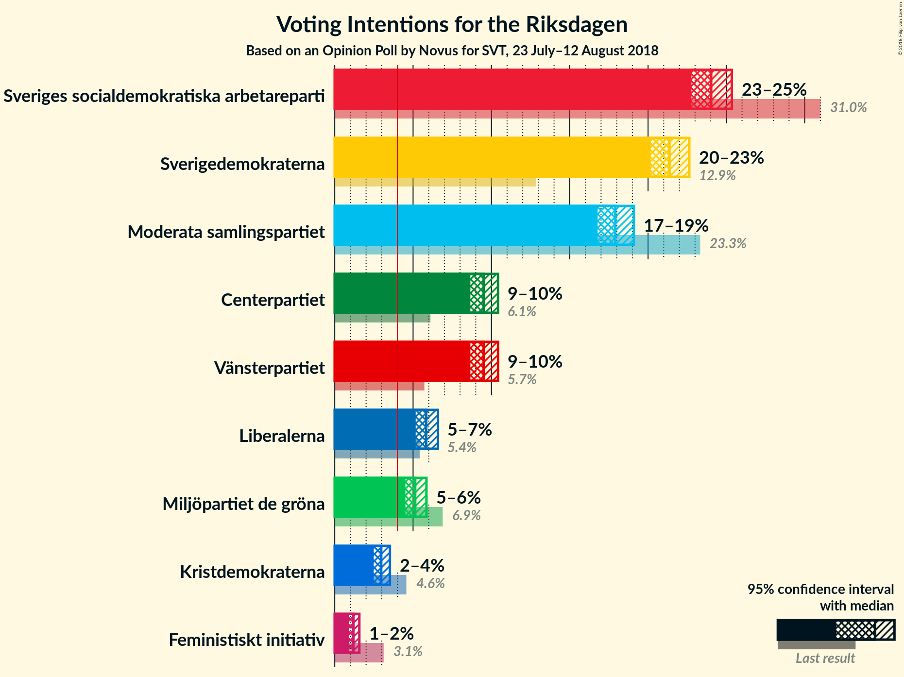
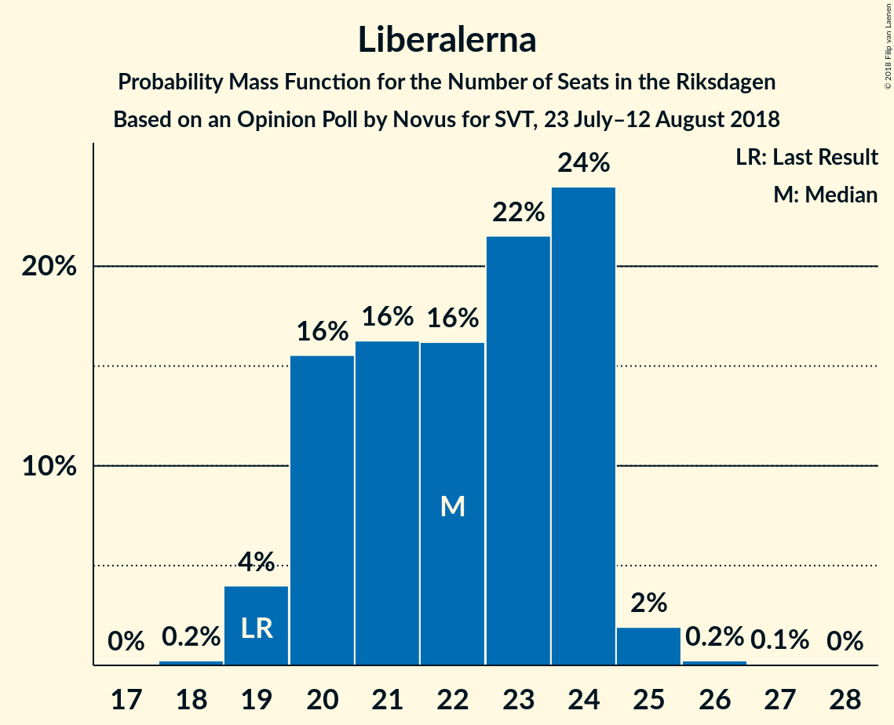

# Opinion Poll by Novus for SVT, 23 July–12 August 2018

<a href="#voting-intentions">Voting Intentions</a> | <a href="#seats">Seats</a> | <a href="#coalitions">Coalitions</a> | <a href="#technical-information">Technical Information</a>

## Voting Intentions

### Confidence Intervals

| Party | Last Result | Poll Result | 80% Confidence Interval | 90% Confidence Interval | 95% Confidence Interval | 99% Confidence Interval |
|:-----:|:-----------:|:-----------:|:-----------------------:|:-----------------------:|:-----------------------:|:-----------------------:|
| Sveriges socialdemokratiska arbetareparti | 31.0% | 24.0% | 23.2–24.9% |23.0–25.1% |22.8–25.4% |22.4–25.8% |
| Sverigedemokraterna | 12.9% | 21.4% | 20.6–22.2% |20.3–22.5% |20.2–22.6% |19.8–23.0% |
| Moderata samlingspartiet | 23.3% | 17.9% | 17.1–18.7% |17.0–18.9% |16.8–19.1% |16.4–19.5% |
| Centerpartiet | 6.1% | 9.5% | 8.9–10.1% |8.8–10.3% |8.6–10.4% |8.4–10.7% |
| Vänsterpartiet | 5.7% | 9.5% | 8.9–10.1% |8.8–10.3% |8.6–10.4% |8.4–10.7% |
| Liberalerna | 5.4% | 5.8% | 5.4–6.4% |5.3–6.5% |5.2–6.6% |4.9–6.9% |
| Miljöpartiet de gröna | 6.9% | 5.1% | 4.7–5.6% |4.6–5.8% |4.5–5.9% |4.3–6.1% |
| Kristdemokraterna | 4.6% | 3.0% | 2.7–3.3% |2.6–3.4% |2.5–3.5% |2.3–3.7% |
| Feministiskt initiativ | 3.1% | 1.2% | 1.0–1.5% |0.9–1.5% |0.9–1.6% |0.8–1.7% |

*Note:* The poll result column reflects the actual value used in the calculations. Published results may vary slightly, and in addition be rounded to fewer digits.

## Seats

### Confidence Intervals

| Party | Last Result | Median | 80% Confidence Interval | 90% Confidence Interval | 95% Confidence Interval | 99% Confidence Interval |
|:-----:|:-----------:|:------:|:-----------------------:|:-----------------------:|:-----------------------:|:-----------------------:|
| <a href="#sveriges-socialdemokratiska-arbetareparti">Sveriges socialdemokratiska arbetareparti</a> | 113 | 92 | 89–93 |87–93 |85–95 |82–96 |
| <a href="#sverigedemokraterna">Sverigedemokraterna</a> | 49 | 80 | 77–82 |76–83 |76–84 |74–86 |
| <a href="#moderata-samlingspartiet">Moderata samlingspartiet</a> | 84 | 68 | 64–70 |63–72 |63–72 |61–73 |
| <a href="#centerpartiet">Centerpartiet</a> | 22 | 34 | 32–38 |32–38 |32–38 |32–41 |
| <a href="#vänsterpartiet">Vänsterpartiet</a> | 21 | 36 | 33–37 |33–38 |32–38 |32–40 |
| <a href="#liberalerna">Liberalerna</a> | 19 | 22 | 20–23 |20–24 |20–24 |18–25 |
| <a href="#miljöpartiet-de-gröna">Miljöpartiet de gröna</a> | 25 | 18 | 17–21 |17–22 |17–23 |16–23 |
| <a href="#kristdemokraterna">Kristdemokraterna</a> | 16 | 0 | 0 |0 |0 |0 |
| <a href="#feministiskt-initiativ">Feministiskt initiativ</a> | 0 | 0 | 0 |0 |0 |0 |

### Sveriges socialdemokratiska arbetareparti

*For a full overview of the results for this party, see the [Sveriges socialdemokratiska arbetareparti](party-sverigessocialdemokratiskaarbetareparti.html) page.*

| Number of Seats | Probability | Accumulated | Special Marks |
|:---------------:|:-----------:|:-----------:|:-------------:|
| 81 | 0.1% | 100% |  |
| 82 | 0.6% | 99.9% |  |
| 83 | 0.3% | 99.3% |  |
| 84 | 1.0% | 99.0% |  |
| 85 | 0.5% | 98% |  |
| 86 | 1.0% | 97% |  |
| 87 | 2% | 96% |  |
| 88 | 3% | 95% |  |
| 89 | 6% | 91% |  |
| 90 | 2% | 85% |  |
| 91 | 10% | 83% |  |
| 92 | 46% | 73% | Median |
| 93 | 22% | 27% |  |
| 94 | 1.1% | 5% |  |
| 95 | 2% | 4% |  |
| 96 | 2% | 2% |  |
| 97 | 0.1% | 0.1% |  |
| 98 | 0% | 0% |  |
| 99 | 0% | 0% |  |
| 100 | 0% | 0% |  |
| 101 | 0% | 0% |  |
| 102 | 0% | 0% |  |
| 103 | 0% | 0% |  |
| 104 | 0% | 0% |  |
| 105 | 0% | 0% |  |
| 106 | 0% | 0% |  |
| 107 | 0% | 0% |  |
| 108 | 0% | 0% |  |
| 109 | 0% | 0% |  |
| 110 | 0% | 0% |  |
| 111 | 0% | 0% |  |
| 112 | 0% | 0% |  |
| 113 | 0% | 0% | Last Result |

### Sverigedemokraterna

*For a full overview of the results for this party, see the [Sverigedemokraterna](party-sverigedemokraterna.html) page.*

| Number of Seats | Probability | Accumulated | Special Marks |
|:---------------:|:-----------:|:-----------:|:-------------:|
| 49 | 0% | 100% | Last Result |
| 50 | 0% | 100% |  |
| 51 | 0% | 100% |  |
| 52 | 0% | 100% |  |
| 53 | 0% | 100% |  |
| 54 | 0% | 100% |  |
| 55 | 0% | 100% |  |
| 56 | 0% | 100% |  |
| 57 | 0% | 100% |  |
| 58 | 0% | 100% |  |
| 59 | 0% | 100% |  |
| 60 | 0% | 100% |  |
| 61 | 0% | 100% |  |
| 62 | 0% | 100% |  |
| 63 | 0% | 100% |  |
| 64 | 0% | 100% |  |
| 65 | 0% | 100% |  |
| 66 | 0% | 100% |  |
| 67 | 0% | 100% |  |
| 68 | 0% | 100% |  |
| 69 | 0% | 100% |  |
| 70 | 0% | 100% |  |
| 71 | 0% | 100% |  |
| 72 | 0.1% | 100% |  |
| 73 | 0.1% | 99.9% |  |
| 74 | 0.7% | 99.9% |  |
| 75 | 0.7% | 99.2% |  |
| 76 | 5% | 98% |  |
| 77 | 6% | 93% |  |
| 78 | 12% | 87% |  |
| 79 | 7% | 76% |  |
| 80 | 54% | 69% | Median |
| 81 | 3% | 15% |  |
| 82 | 4% | 12% |  |
| 83 | 5% | 8% |  |
| 84 | 1.2% | 3% |  |
| 85 | 1.4% | 2% |  |
| 86 | 0.4% | 0.6% |  |
| 87 | 0.1% | 0.2% |  |
| 88 | 0.1% | 0.1% |  |
| 89 | 0% | 0% |  |

### Moderata samlingspartiet

*For a full overview of the results for this party, see the [Moderata samlingspartiet](party-moderatasamlingspartiet.html) page.*

| Number of Seats | Probability | Accumulated | Special Marks |
|:---------------:|:-----------:|:-----------:|:-------------:|
| 60 | 0.1% | 100% |  |
| 61 | 0.7% | 99.9% |  |
| 62 | 2% | 99.2% |  |
| 63 | 6% | 98% |  |
| 64 | 7% | 91% |  |
| 65 | 4% | 84% |  |
| 66 | 6% | 80% |  |
| 67 | 5% | 74% |  |
| 68 | 39% | 69% | Median |
| 69 | 4% | 30% |  |
| 70 | 18% | 26% |  |
| 71 | 2% | 8% |  |
| 72 | 4% | 6% |  |
| 73 | 2% | 2% |  |
| 74 | 0.3% | 0.4% |  |
| 75 | 0.1% | 0.2% |  |
| 76 | 0% | 0% |  |
| 77 | 0% | 0% |  |
| 78 | 0% | 0% |  |
| 79 | 0% | 0% |  |
| 80 | 0% | 0% |  |
| 81 | 0% | 0% |  |
| 82 | 0% | 0% |  |
| 83 | 0% | 0% |  |
| 84 | 0% | 0% | Last Result |

### Centerpartiet

*For a full overview of the results for this party, see the [Centerpartiet](party-centerpartiet.html) page.*

| Number of Seats | Probability | Accumulated | Special Marks |
|:---------------:|:-----------:|:-----------:|:-------------:|
| 22 | 0% | 100% | Last Result |
| 23 | 0% | 100% |  |
| 24 | 0% | 100% |  |
| 25 | 0% | 100% |  |
| 26 | 0% | 100% |  |
| 27 | 0% | 100% |  |
| 28 | 0% | 100% |  |
| 29 | 0% | 100% |  |
| 30 | 0% | 100% |  |
| 31 | 0.2% | 100% |  |
| 32 | 18% | 99.8% |  |
| 33 | 1.4% | 82% |  |
| 34 | 37% | 80% | Median |
| 35 | 18% | 43% |  |
| 36 | 8% | 25% |  |
| 37 | 4% | 18% |  |
| 38 | 12% | 13% |  |
| 39 | 0.1% | 2% |  |
| 40 | 0.4% | 2% |  |
| 41 | 1.1% | 1.1% |  |
| 42 | 0% | 0% |  |

### Vänsterpartiet

*For a full overview of the results for this party, see the [Vänsterpartiet](party-vänsterpartiet.html) page.*

| Number of Seats | Probability | Accumulated | Special Marks |
|:---------------:|:-----------:|:-----------:|:-------------:|
| 21 | 0% | 100% | Last Result |
| 22 | 0% | 100% |  |
| 23 | 0% | 100% |  |
| 24 | 0% | 100% |  |
| 25 | 0% | 100% |  |
| 26 | 0% | 100% |  |
| 27 | 0% | 100% |  |
| 28 | 0% | 100% |  |
| 29 | 0% | 100% |  |
| 30 | 0% | 100% |  |
| 31 | 0.4% | 100% |  |
| 32 | 3% | 99.6% |  |
| 33 | 7% | 96% |  |
| 34 | 13% | 90% |  |
| 35 | 25% | 77% |  |
| 36 | 36% | 51% | Median |
| 37 | 8% | 15% |  |
| 38 | 5% | 7% |  |
| 39 | 1.4% | 2% |  |
| 40 | 0.5% | 0.6% |  |
| 41 | 0.1% | 0.1% |  |
| 42 | 0% | 0.1% |  |
| 43 | 0% | 0% |  |

### Liberalerna

*For a full overview of the results for this party, see the [Liberalerna](party-liberalerna.html) page.*

| Number of Seats | Probability | Accumulated | Special Marks |
|:---------------:|:-----------:|:-----------:|:-------------:|
| 18 | 1.0% | 100% |  |
| 19 | 1.2% | 99.0% | Last Result |
| 20 | 13% | 98% |  |
| 21 | 22% | 84% |  |
| 22 | 44% | 62% | Median |
| 23 | 10% | 18% |  |
| 24 | 8% | 8% |  |
| 25 | 0.5% | 0.9% |  |
| 26 | 0.3% | 0.4% |  |
| 27 | 0% | 0.1% |  |
| 28 | 0% | 0% |  |

### Miljöpartiet de gröna

*For a full overview of the results for this party, see the [Miljöpartiet de gröna](party-miljöpartietdegröna.html) page.*

| Number of Seats | Probability | Accumulated | Special Marks |
|:---------------:|:-----------:|:-----------:|:-------------:|
| 0 | 0.5% | 100% |  |
| 1 | 0% | 99.5% |  |
| 2 | 0% | 99.5% |  |
| 3 | 0% | 99.5% |  |
| 4 | 0% | 99.5% |  |
| 5 | 0% | 99.5% |  |
| 6 | 0% | 99.5% |  |
| 7 | 0% | 99.5% |  |
| 8 | 0% | 99.5% |  |
| 9 | 0% | 99.5% |  |
| 10 | 0% | 99.5% |  |
| 11 | 0% | 99.5% |  |
| 12 | 0% | 99.5% |  |
| 13 | 0% | 99.5% |  |
| 14 | 0% | 99.5% |  |
| 15 | 0% | 99.5% |  |
| 16 | 2% | 99.5% |  |
| 17 | 39% | 98% |  |
| 18 | 22% | 59% | Median |
| 19 | 11% | 37% |  |
| 20 | 15% | 26% |  |
| 21 | 4% | 11% |  |
| 22 | 2% | 6% |  |
| 23 | 4% | 4% |  |
| 24 | 0.2% | 0.2% |  |
| 25 | 0% | 0% | Last Result |

### Kristdemokraterna

*For a full overview of the results for this party, see the [Kristdemokraterna](party-kristdemokraterna.html) page.*

| Number of Seats | Probability | Accumulated | Special Marks |
|:---------------:|:-----------:|:-----------:|:-------------:|
| 0 | 99.7% | 100% | Median |
| 1 | 0% | 0.3% |  |
| 2 | 0% | 0.3% |  |
| 3 | 0% | 0.3% |  |
| 4 | 0% | 0.3% |  |
| 5 | 0% | 0.3% |  |
| 6 | 0% | 0.3% |  |
| 7 | 0% | 0.3% |  |
| 8 | 0% | 0.3% |  |
| 9 | 0% | 0.3% |  |
| 10 | 0% | 0.3% |  |
| 11 | 0% | 0.3% |  |
| 12 | 0% | 0.3% |  |
| 13 | 0% | 0.3% |  |
| 14 | 0% | 0.3% |  |
| 15 | 0.3% | 0.3% |  |
| 16 | 0% | 0% | Last Result |

### Feministiskt initiativ

*For a full overview of the results for this party, see the [Feministiskt initiativ](party-feministisktinitiativ.html) page.*

| Number of Seats | Probability | Accumulated | Special Marks |
|:---------------:|:-----------:|:-----------:|:-------------:|
| 0 | 100% | 100% | Last Result, Median |

## Coalitions

### Confidence Intervals

| Coalition | Last Result | Median | Majority? | 80% Confidence Interval | 90% Confidence Interval | 95% Confidence Interval | 99% Confidence Interval |
|:---------:|:-----------:|:------:|:---------:|:-----------------------:|:-----------------------:|:-----------------------:|:-----------------------:|
| Sveriges socialdemokratiska arbetareparti – Moderata samlingspartiet | 197 | 160 | 0% | 155–163 | 153–163 | 153–163 | 149–166 |
| Sverigedemokraterna – Moderata samlingspartiet | 133 | 148 | 0% | 142–150 | 142–151 | 140–153 | 138–157 |
| Sveriges socialdemokratiska arbetareparti – Vänsterpartiet – Miljöpartiet de gröna – Feministiskt initiativ | 159 | 145 | 0% | 142–148 | 142–149 | 139–151 | 135–154 |
| Sveriges socialdemokratiska arbetareparti – Vänsterpartiet – Miljöpartiet de gröna | 159 | 145 | 0% | 142–148 | 142–149 | 139–151 | 135–154 |
| Sveriges socialdemokratiska arbetareparti – Vänsterpartiet | 134 | 128 | 0% | 124–128 | 123–129 | 121–132 | 118–133 |
| Moderata samlingspartiet – Centerpartiet – Liberalerna – Kristdemokraterna | 141 | 124 | 0% | 122–127 | 120–129 | 119–130 | 117–133 |
| Moderata samlingspartiet – Centerpartiet – Liberalerna | 125 | 124 | 0% | 121–127 | 120–129 | 119–130 | 117–131 |
| Sveriges socialdemokratiska arbetareparti – Miljöpartiet de gröna | 138 | 109 | 0% | 107–113 | 106–115 | 104–115 | 100–118 |
| Moderata samlingspartiet – Centerpartiet – Kristdemokraterna | 122 | 102 | 0% | 101–106 | 98–108 | 98–109 | 96–111 |
| Moderata samlingspartiet – Centerpartiet | 106 | 102 | 0% | 100–106 | 98–108 | 98–109 | 96–109 |

### Sveriges socialdemokratiska arbetareparti – Moderata samlingspartiet

| Number of Seats | Probability | Accumulated | Special Marks |
|:---------------:|:-----------:|:-----------:|:-------------:|
| 146 | 0.1% | 100% |  |
| 147 | 0% | 99.9% |  |
| 148 | 0.2% | 99.9% |  |
| 149 | 0.6% | 99.7% |  |
| 150 | 0.1% | 99.0% |  |
| 151 | 0.5% | 98.9% |  |
| 152 | 0.7% | 98% |  |
| 153 | 5% | 98% |  |
| 154 | 0.8% | 93% |  |
| 155 | 11% | 92% |  |
| 156 | 3% | 81% |  |
| 157 | 1.0% | 78% |  |
| 158 | 8% | 77% |  |
| 159 | 6% | 69% |  |
| 160 | 34% | 63% | Median |
| 161 | 5% | 28% |  |
| 162 | 2% | 23% |  |
| 163 | 19% | 21% |  |
| 164 | 0.2% | 2% |  |
| 165 | 0.7% | 1.4% |  |
| 166 | 0.2% | 0.6% |  |
| 167 | 0% | 0.5% |  |
| 168 | 0.4% | 0.5% |  |
| 169 | 0% | 0% |  |
| 170 | 0% | 0% |  |
| 171 | 0% | 0% |  |
| 172 | 0% | 0% |  |
| 173 | 0% | 0% |  |
| 174 | 0% | 0% |  |
| 175 | 0% | 0% | Majority |
| 176 | 0% | 0% |  |
| 177 | 0% | 0% |  |
| 178 | 0% | 0% |  |
| 179 | 0% | 0% |  |
| 180 | 0% | 0% |  |
| 181 | 0% | 0% |  |
| 182 | 0% | 0% |  |
| 183 | 0% | 0% |  |
| 184 | 0% | 0% |  |
| 185 | 0% | 0% |  |
| 186 | 0% | 0% |  |
| 187 | 0% | 0% |  |
| 188 | 0% | 0% |  |
| 189 | 0% | 0% |  |
| 190 | 0% | 0% |  |
| 191 | 0% | 0% |  |
| 192 | 0% | 0% |  |
| 193 | 0% | 0% |  |
| 194 | 0% | 0% |  |
| 195 | 0% | 0% |  |
| 196 | 0% | 0% |  |
| 197 | 0% | 0% | Last Result |

### Sverigedemokraterna – Moderata samlingspartiet

| Number of Seats | Probability | Accumulated | Special Marks |
|:---------------:|:-----------:|:-----------:|:-------------:|
| 133 | 0% | 100% | Last Result |
| 134 | 0% | 100% |  |
| 135 | 0% | 100% |  |
| 136 | 0% | 100% |  |
| 137 | 0% | 100% |  |
| 138 | 0.5% | 100% |  |
| 139 | 1.3% | 99.4% |  |
| 140 | 1.0% | 98% |  |
| 141 | 0.6% | 97% |  |
| 142 | 10% | 97% |  |
| 143 | 2% | 87% |  |
| 144 | 5% | 85% |  |
| 145 | 3% | 80% |  |
| 146 | 7% | 77% |  |
| 147 | 5% | 70% |  |
| 148 | 35% | 65% | Median |
| 149 | 3% | 30% |  |
| 150 | 18% | 27% |  |
| 151 | 6% | 9% |  |
| 152 | 0.4% | 3% |  |
| 153 | 1.0% | 3% |  |
| 154 | 0.6% | 2% |  |
| 155 | 0.1% | 1.0% |  |
| 156 | 0.4% | 0.9% |  |
| 157 | 0.5% | 0.5% |  |
| 158 | 0% | 0.1% |  |
| 159 | 0% | 0% |  |

### Sveriges socialdemokratiska arbetareparti – Vänsterpartiet – Miljöpartiet de gröna – Feministiskt initiativ

| Number of Seats | Probability | Accumulated | Special Marks |
|:---------------:|:-----------:|:-----------:|:-------------:|
| 133 | 0.4% | 100% |  |
| 134 | 0% | 99.5% |  |
| 135 | 0.3% | 99.5% |  |
| 136 | 0.1% | 99.2% |  |
| 137 | 0.1% | 99.0% |  |
| 138 | 0.5% | 98.9% |  |
| 139 | 1.3% | 98% |  |
| 140 | 1.1% | 97% |  |
| 141 | 1.0% | 96% |  |
| 142 | 5% | 95% |  |
| 143 | 3% | 90% |  |
| 144 | 6% | 87% |  |
| 145 | 40% | 81% |  |
| 146 | 29% | 42% | Median |
| 147 | 0.8% | 13% |  |
| 148 | 4% | 12% |  |
| 149 | 4% | 8% |  |
| 150 | 1.3% | 4% |  |
| 151 | 0.9% | 3% |  |
| 152 | 0.2% | 2% |  |
| 153 | 0.6% | 2% |  |
| 154 | 0.9% | 0.9% |  |
| 155 | 0% | 0% |  |
| 156 | 0% | 0% |  |
| 157 | 0% | 0% |  |
| 158 | 0% | 0% |  |
| 159 | 0% | 0% | Last Result |

### Sveriges socialdemokratiska arbetareparti – Vänsterpartiet – Miljöpartiet de gröna

| Number of Seats | Probability | Accumulated | Special Marks |
|:---------------:|:-----------:|:-----------:|:-------------:|
| 133 | 0.4% | 100% |  |
| 134 | 0% | 99.5% |  |
| 135 | 0.3% | 99.5% |  |
| 136 | 0.1% | 99.2% |  |
| 137 | 0.1% | 99.0% |  |
| 138 | 0.5% | 98.9% |  |
| 139 | 1.3% | 98% |  |
| 140 | 1.1% | 97% |  |
| 141 | 1.0% | 96% |  |
| 142 | 5% | 95% |  |
| 143 | 3% | 90% |  |
| 144 | 6% | 87% |  |
| 145 | 40% | 81% |  |
| 146 | 29% | 42% | Median |
| 147 | 0.8% | 13% |  |
| 148 | 4% | 12% |  |
| 149 | 4% | 8% |  |
| 150 | 1.3% | 4% |  |
| 151 | 0.9% | 3% |  |
| 152 | 0.2% | 2% |  |
| 153 | 0.6% | 2% |  |
| 154 | 0.9% | 0.9% |  |
| 155 | 0% | 0% |  |
| 156 | 0% | 0% |  |
| 157 | 0% | 0% |  |
| 158 | 0% | 0% |  |
| 159 | 0% | 0% | Last Result |

### Sveriges socialdemokratiska arbetareparti – Vänsterpartiet

| Number of Seats | Probability | Accumulated | Special Marks |
|:---------------:|:-----------:|:-----------:|:-------------:|
| 115 | 0.1% | 100% |  |
| 116 | 0.1% | 99.9% |  |
| 117 | 0.3% | 99.9% |  |
| 118 | 0.5% | 99.5% |  |
| 119 | 0.4% | 99.1% |  |
| 120 | 0.4% | 98.6% |  |
| 121 | 1.0% | 98% |  |
| 122 | 2% | 97% |  |
| 123 | 3% | 95% |  |
| 124 | 2% | 92% |  |
| 125 | 6% | 90% |  |
| 126 | 21% | 84% |  |
| 127 | 5% | 63% |  |
| 128 | 52% | 58% | Median |
| 129 | 0.9% | 6% |  |
| 130 | 1.3% | 5% |  |
| 131 | 0.8% | 4% |  |
| 132 | 0.9% | 3% |  |
| 133 | 2% | 2% |  |
| 134 | 0% | 0.1% | Last Result |
| 135 | 0% | 0% |  |

### Moderata samlingspartiet – Centerpartiet – Liberalerna – Kristdemokraterna

| Number of Seats | Probability | Accumulated | Special Marks |
|:---------------:|:-----------:|:-----------:|:-------------:|
| 116 | 0.1% | 100% |  |
| 117 | 1.1% | 99.9% |  |
| 118 | 1.2% | 98.8% |  |
| 119 | 0.7% | 98% |  |
| 120 | 5% | 97% |  |
| 121 | 2% | 92% |  |
| 122 | 2% | 90% |  |
| 123 | 22% | 88% |  |
| 124 | 41% | 66% | Median |
| 125 | 4% | 25% |  |
| 126 | 9% | 21% |  |
| 127 | 2% | 12% |  |
| 128 | 2% | 10% |  |
| 129 | 4% | 7% |  |
| 130 | 2% | 3% |  |
| 131 | 0.5% | 1.2% |  |
| 132 | 0.2% | 0.7% |  |
| 133 | 0.2% | 0.5% |  |
| 134 | 0.3% | 0.4% |  |
| 135 | 0% | 0% |  |
| 136 | 0% | 0% |  |
| 137 | 0% | 0% |  |
| 138 | 0% | 0% |  |
| 139 | 0% | 0% |  |
| 140 | 0% | 0% |  |
| 141 | 0% | 0% | Last Result |

### Moderata samlingspartiet – Centerpartiet – Liberalerna

| Number of Seats | Probability | Accumulated | Special Marks |
|:---------------:|:-----------:|:-----------:|:-------------:|
| 116 | 0.1% | 100% |  |
| 117 | 1.1% | 99.9% |  |
| 118 | 1.2% | 98.8% |  |
| 119 | 1.1% | 98% |  |
| 120 | 5% | 97% |  |
| 121 | 2% | 92% |  |
| 122 | 2% | 90% |  |
| 123 | 22% | 88% |  |
| 124 | 41% | 66% | Median |
| 125 | 4% | 25% | Last Result |
| 126 | 9% | 21% |  |
| 127 | 2% | 11% |  |
| 128 | 2% | 9% |  |
| 129 | 4% | 7% |  |
| 130 | 2% | 3% |  |
| 131 | 0.5% | 0.9% |  |
| 132 | 0.2% | 0.3% |  |
| 133 | 0.2% | 0.2% |  |
| 134 | 0% | 0% |  |

### Sveriges socialdemokratiska arbetareparti – Miljöpartiet de gröna

| Number of Seats | Probability | Accumulated | Special Marks |
|:---------------:|:-----------:|:-----------:|:-------------:|
| 96 | 0.4% | 100% |  |
| 97 | 0% | 99.5% |  |
| 98 | 0% | 99.5% |  |
| 99 | 0% | 99.5% |  |
| 100 | 0.4% | 99.5% |  |
| 101 | 0.1% | 99.2% |  |
| 102 | 0.7% | 99.0% |  |
| 103 | 0.4% | 98% |  |
| 104 | 1.5% | 98% |  |
| 105 | 0.9% | 96% |  |
| 106 | 4% | 96% |  |
| 107 | 5% | 92% |  |
| 108 | 1.5% | 87% |  |
| 109 | 37% | 86% |  |
| 110 | 8% | 49% | Median |
| 111 | 19% | 41% |  |
| 112 | 9% | 22% |  |
| 113 | 7% | 12% |  |
| 114 | 0.7% | 6% |  |
| 115 | 3% | 5% |  |
| 116 | 0.3% | 2% |  |
| 117 | 0.9% | 2% |  |
| 118 | 0.7% | 0.7% |  |
| 119 | 0% | 0% |  |
| 120 | 0% | 0% |  |
| 121 | 0% | 0% |  |
| 122 | 0% | 0% |  |
| 123 | 0% | 0% |  |
| 124 | 0% | 0% |  |
| 125 | 0% | 0% |  |
| 126 | 0% | 0% |  |
| 127 | 0% | 0% |  |
| 128 | 0% | 0% |  |
| 129 | 0% | 0% |  |
| 130 | 0% | 0% |  |
| 131 | 0% | 0% |  |
| 132 | 0% | 0% |  |
| 133 | 0% | 0% |  |
| 134 | 0% | 0% |  |
| 135 | 0% | 0% |  |
| 136 | 0% | 0% |  |
| 137 | 0% | 0% |  |
| 138 | 0% | 0% | Last Result |

### Moderata samlingspartiet – Centerpartiet – Kristdemokraterna

| Number of Seats | Probability | Accumulated | Special Marks |
|:---------------:|:-----------:|:-----------:|:-------------:|
| 94 | 0% | 100% |  |
| 95 | 0% | 99.9% |  |
| 96 | 0.7% | 99.9% |  |
| 97 | 2% | 99.2% |  |
| 98 | 5% | 98% |  |
| 99 | 1.0% | 92% |  |
| 100 | 0.8% | 91% |  |
| 101 | 7% | 90% |  |
| 102 | 57% | 83% | Median |
| 103 | 9% | 26% |  |
| 104 | 5% | 17% |  |
| 105 | 1.2% | 12% |  |
| 106 | 1.1% | 10% |  |
| 107 | 4% | 9% |  |
| 108 | 2% | 6% |  |
| 109 | 3% | 3% |  |
| 110 | 0.2% | 0.7% |  |
| 111 | 0.1% | 0.6% |  |
| 112 | 0.1% | 0.5% |  |
| 113 | 0% | 0.4% |  |
| 114 | 0.3% | 0.3% |  |
| 115 | 0% | 0% |  |
| 116 | 0% | 0% |  |
| 117 | 0% | 0% |  |
| 118 | 0% | 0% |  |
| 119 | 0% | 0% |  |
| 120 | 0% | 0% |  |
| 121 | 0% | 0% |  |
| 122 | 0% | 0% | Last Result |

### Moderata samlingspartiet – Centerpartiet

| Number of Seats | Probability | Accumulated | Special Marks |
|:---------------:|:-----------:|:-----------:|:-------------:|
| 94 | 0% | 100% |  |
| 95 | 0% | 99.9% |  |
| 96 | 0.7% | 99.9% |  |
| 97 | 2% | 99.2% |  |
| 98 | 5% | 98% |  |
| 99 | 1.4% | 92% |  |
| 100 | 0.8% | 91% |  |
| 101 | 7% | 90% |  |
| 102 | 57% | 83% | Median |
| 103 | 9% | 26% |  |
| 104 | 5% | 17% |  |
| 105 | 1.2% | 11% |  |
| 106 | 1.1% | 10% | Last Result |
| 107 | 4% | 9% |  |
| 108 | 2% | 5% |  |
| 109 | 3% | 3% |  |
| 110 | 0.2% | 0.4% |  |
| 111 | 0% | 0.2% |  |
| 112 | 0.1% | 0.2% |  |
| 113 | 0% | 0% |  |

## Technical Information

### Opinion Poll

+ **Polling firm:** Novus
+ **Commissioner(s):** SVT
+ **Fieldwork period:** 23 July–12 August 2018

### Calculations

+ **Sample size:** 4282
+ **Simulations done:** 65,536
+ **Error estimate:** 1.20%

