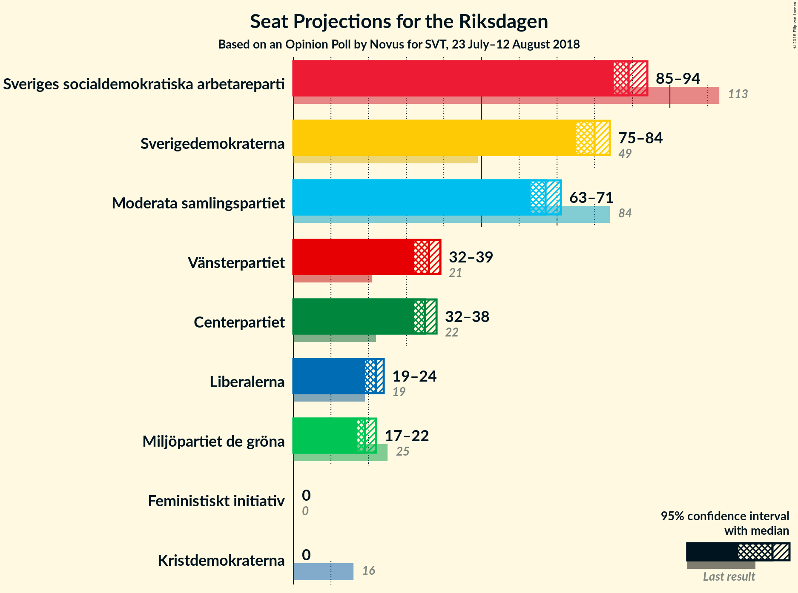
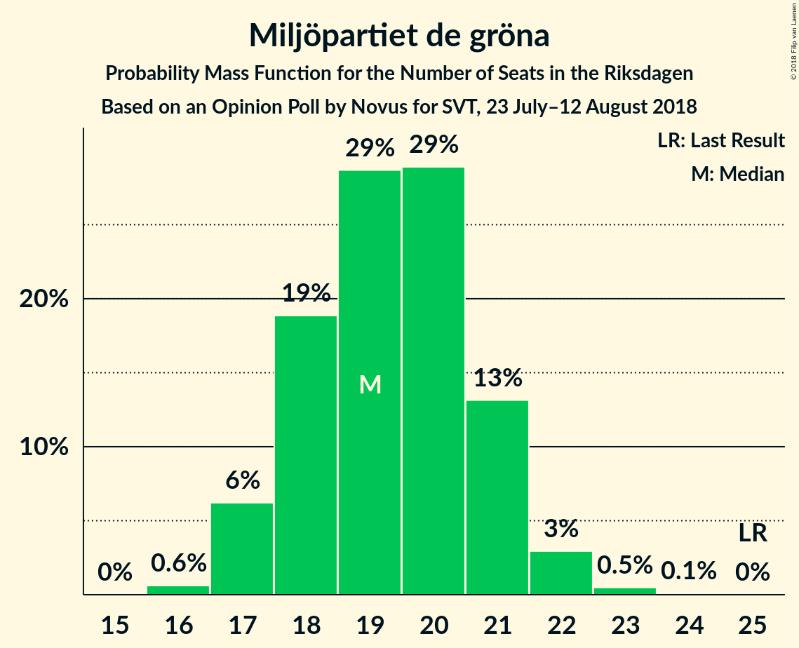

# Opinion Poll by Novus for SVT, 23 July–12 August 2018

<a href="#voting-intentions">Voting Intentions</a> | <a href="#seats">Seats</a> | <a href="#coalitions">Coalitions</a> | <a href="#technical-information">Technical Information</a>

## Voting Intentions

### Confidence Intervals

| Party | Last Result | Poll Result | 80% Confidence Interval | 90% Confidence Interval | 95% Confidence Interval | 99% Confidence Interval |
|:-----:|:-----------:|:-----------:|:-----------------------:|:-----------------------:|:-----------------------:|:-----------------------:|
| Sveriges socialdemokratiska arbetareparti | 31.0% | 24.0% | 23.2–24.9% |23.0–25.1% |22.8–25.3% |22.4–25.8% |
| Sverigedemokraterna | 12.9% | 21.4% | 20.6–22.2% |20.3–22.4% |20.2–22.6% |19.8–23.0% |
| Moderata samlingspartiet | 23.3% | 17.9% | 17.2–18.7% |17.0–18.9% |16.8–19.1% |16.4–19.5% |
| Centerpartiet | 6.1% | 9.5% | 8.9–10.1% |8.8–10.3% |8.7–10.4% |8.4–10.7% |
| Vänsterpartiet | 5.7% | 9.5% | 8.9–10.1% |8.8–10.3% |8.7–10.4% |8.4–10.7% |
| Liberalerna | 5.4% | 5.8% | 5.4–6.3% |5.3–6.5% |5.2–6.6% |5.0–6.8% |
| Miljöpartiet de gröna | 6.9% | 5.1% | 4.7–5.6% |4.6–5.7% |4.5–5.9% |4.3–6.1% |
| Kristdemokraterna | 4.6% | 3.0% | 2.7–3.3% |2.6–3.4% |2.5–3.5% |2.3–3.7% |
| Feministiskt initiativ | 3.1% | 1.2% | 1.0–1.4% |0.9–1.5% |0.9–1.6% |0.8–1.7% |

*Note:* The poll result column reflects the actual value used in the calculations. Published results may vary slightly, and in addition be rounded to fewer digits.

## Seats

### Confidence Intervals

| Party | Last Result | Median | 80% Confidence Interval | 90% Confidence Interval | 95% Confidence Interval | 99% Confidence Interval |
|:-----:|:-----------:|:------:|:-----------------------:|:-----------------------:|:-----------------------:|:-----------------------:|
| <a href="#sveriges-socialdemokratiska-arbetareparti">Sveriges socialdemokratiska arbetareparti</a> | 113 | 89 | 87–93 |86–93 |85–94 |84–96 |
| <a href="#sverigedemokraterna">Sverigedemokraterna</a> | 49 | 80 | 77–83 |76–83 |75–84 |74–86 |
| <a href="#moderata-samlingspartiet">Moderata samlingspartiet</a> | 84 | 67 | 65–69 |63–70 |63–71 |62–73 |
| <a href="#centerpartiet">Centerpartiet</a> | 22 | 35 | 35–38 |33–38 |32–38 |32–40 |
| <a href="#vänsterpartiet">Vänsterpartiet</a> | 21 | 36 | 33–37 |33–38 |32–39 |32–40 |
| <a href="#liberalerna">Liberalerna</a> | 19 | 22 | 20–24 |20–24 |19–24 |19–25 |
| <a href="#miljöpartiet-de-gröna">Miljöpartiet de gröna</a> | 25 | 19 | 18–21 |17–21 |17–22 |16–23 |
| <a href="#kristdemokraterna">Kristdemokraterna</a> | 16 | 0 | 0 |0 |0 |0 |
| <a href="#feministiskt-initiativ">Feministiskt initiativ</a> | 0 | 0 | 0 |0 |0 |0 |

### Sveriges socialdemokratiska arbetareparti

*For a full overview of the results for this party, see the [Sveriges socialdemokratiska arbetareparti](party-sverigessocialdemokratiskaarbetareparti.html) page.*

| Number of Seats | Probability | Accumulated | Special Marks |
|:---------------:|:-----------:|:-----------:|:-------------:|
| 82 | 0.1% | 100% |  |
| 83 | 0.2% | 99.9% |  |
| 84 | 1.0% | 99.7% |  |
| 85 | 2% | 98.7% |  |
| 86 | 2% | 97% |  |
| 87 | 10% | 94% |  |
| 88 | 7% | 84% |  |
| 89 | 30% | 78% | Median |
| 90 | 8% | 48% |  |
| 91 | 21% | 40% |  |
| 92 | 7% | 18% |  |
| 93 | 7% | 11% |  |
| 94 | 3% | 4% |  |
| 95 | 0.8% | 1.5% |  |
| 96 | 0.5% | 0.7% |  |
| 97 | 0.1% | 0.2% |  |
| 98 | 0.1% | 0.1% |  |
| 99 | 0% | 0% |  |
| 100 | 0% | 0% |  |
| 101 | 0% | 0% |  |
| 102 | 0% | 0% |  |
| 103 | 0% | 0% |  |
| 104 | 0% | 0% |  |
| 105 | 0% | 0% |  |
| 106 | 0% | 0% |  |
| 107 | 0% | 0% |  |
| 108 | 0% | 0% |  |
| 109 | 0% | 0% |  |
| 110 | 0% | 0% |  |
| 111 | 0% | 0% |  |
| 112 | 0% | 0% |  |
| 113 | 0% | 0% | Last Result |

### Sverigedemokraterna

*For a full overview of the results for this party, see the [Sverigedemokraterna](party-sverigedemokraterna.html) page.*

| Number of Seats | Probability | Accumulated | Special Marks |
|:---------------:|:-----------:|:-----------:|:-------------:|
| 49 | 0% | 100% | Last Result |
| 50 | 0% | 100% |  |
| 51 | 0% | 100% |  |
| 52 | 0% | 100% |  |
| 53 | 0% | 100% |  |
| 54 | 0% | 100% |  |
| 55 | 0% | 100% |  |
| 56 | 0% | 100% |  |
| 57 | 0% | 100% |  |
| 58 | 0% | 100% |  |
| 59 | 0% | 100% |  |
| 60 | 0% | 100% |  |
| 61 | 0% | 100% |  |
| 62 | 0% | 100% |  |
| 63 | 0% | 100% |  |
| 64 | 0% | 100% |  |
| 65 | 0% | 100% |  |
| 66 | 0% | 100% |  |
| 67 | 0% | 100% |  |
| 68 | 0% | 100% |  |
| 69 | 0% | 100% |  |
| 70 | 0% | 100% |  |
| 71 | 0% | 100% |  |
| 72 | 0.1% | 100% |  |
| 73 | 0.1% | 99.9% |  |
| 74 | 0.9% | 99.8% |  |
| 75 | 2% | 98.9% |  |
| 76 | 6% | 97% |  |
| 77 | 4% | 91% |  |
| 78 | 10% | 87% |  |
| 79 | 18% | 76% |  |
| 80 | 16% | 59% | Median |
| 81 | 23% | 43% |  |
| 82 | 6% | 20% |  |
| 83 | 10% | 14% |  |
| 84 | 2% | 5% |  |
| 85 | 1.4% | 2% |  |
| 86 | 0.6% | 0.8% |  |
| 87 | 0.1% | 0.2% |  |
| 88 | 0.1% | 0.1% |  |
| 89 | 0% | 0% |  |

### Moderata samlingspartiet

*For a full overview of the results for this party, see the [Moderata samlingspartiet](party-moderatasamlingspartiet.html) page.*

| Number of Seats | Probability | Accumulated | Special Marks |
|:---------------:|:-----------:|:-----------:|:-------------:|
| 60 | 0.1% | 100% |  |
| 61 | 0.4% | 99.9% |  |
| 62 | 0.9% | 99.5% |  |
| 63 | 4% | 98.6% |  |
| 64 | 4% | 95% |  |
| 65 | 17% | 91% |  |
| 66 | 12% | 74% |  |
| 67 | 35% | 62% | Median |
| 68 | 8% | 27% |  |
| 69 | 11% | 20% |  |
| 70 | 4% | 8% |  |
| 71 | 2% | 4% |  |
| 72 | 0.9% | 2% |  |
| 73 | 0.6% | 0.8% |  |
| 74 | 0.1% | 0.2% |  |
| 75 | 0% | 0% |  |
| 76 | 0% | 0% |  |
| 77 | 0% | 0% |  |
| 78 | 0% | 0% |  |
| 79 | 0% | 0% |  |
| 80 | 0% | 0% |  |
| 81 | 0% | 0% |  |
| 82 | 0% | 0% |  |
| 83 | 0% | 0% |  |
| 84 | 0% | 0% | Last Result |

### Centerpartiet

*For a full overview of the results for this party, see the [Centerpartiet](party-centerpartiet.html) page.*

| Number of Seats | Probability | Accumulated | Special Marks |
|:---------------:|:-----------:|:-----------:|:-------------:|
| 22 | 0% | 100% | Last Result |
| 23 | 0% | 100% |  |
| 24 | 0% | 100% |  |
| 25 | 0% | 100% |  |
| 26 | 0% | 100% |  |
| 27 | 0% | 100% |  |
| 28 | 0% | 100% |  |
| 29 | 0% | 100% |  |
| 30 | 0% | 100% |  |
| 31 | 0.1% | 100% |  |
| 32 | 5% | 99.9% |  |
| 33 | 0.9% | 95% |  |
| 34 | 3% | 94% |  |
| 35 | 65% | 91% | Median |
| 36 | 2% | 26% |  |
| 37 | 11% | 24% |  |
| 38 | 12% | 13% |  |
| 39 | 0.1% | 0.9% |  |
| 40 | 0.4% | 0.8% |  |
| 41 | 0.4% | 0.4% |  |
| 42 | 0% | 0% |  |

### Vänsterpartiet

*For a full overview of the results for this party, see the [Vänsterpartiet](party-vänsterpartiet.html) page.*

| Number of Seats | Probability | Accumulated | Special Marks |
|:---------------:|:-----------:|:-----------:|:-------------:|
| 21 | 0% | 100% | Last Result |
| 22 | 0% | 100% |  |
| 23 | 0% | 100% |  |
| 24 | 0% | 100% |  |
| 25 | 0% | 100% |  |
| 26 | 0% | 100% |  |
| 27 | 0% | 100% |  |
| 28 | 0% | 100% |  |
| 29 | 0% | 100% |  |
| 30 | 0% | 100% |  |
| 31 | 0.4% | 99.9% |  |
| 32 | 2% | 99.6% |  |
| 33 | 9% | 97% |  |
| 34 | 11% | 89% |  |
| 35 | 23% | 78% |  |
| 36 | 26% | 55% | Median |
| 37 | 21% | 29% |  |
| 38 | 5% | 7% |  |
| 39 | 2% | 3% |  |
| 40 | 0.7% | 0.8% |  |
| 41 | 0.1% | 0.1% |  |
| 42 | 0% | 0% |  |

### Liberalerna

*For a full overview of the results for this party, see the [Liberalerna](party-liberalerna.html) page.*

| Number of Seats | Probability | Accumulated | Special Marks |
|:---------------:|:-----------:|:-----------:|:-------------:|
| 18 | 0.2% | 100% |  |
| 19 | 4% | 99.7% | Last Result |
| 20 | 16% | 96% |  |
| 21 | 16% | 80% |  |
| 22 | 16% | 64% | Median |
| 23 | 22% | 48% |  |
| 24 | 24% | 26% |  |
| 25 | 2% | 2% |  |
| 26 | 0.2% | 0.3% |  |
| 27 | 0.1% | 0.1% |  |
| 28 | 0% | 0% |  |

### Miljöpartiet de gröna

*For a full overview of the results for this party, see the [Miljöpartiet de gröna](party-miljöpartietdegröna.html) page.*

| Number of Seats | Probability | Accumulated | Special Marks |
|:---------------:|:-----------:|:-----------:|:-------------:|
| 16 | 0.6% | 100% |  |
| 17 | 6% | 99.3% |  |
| 18 | 19% | 93% |  |
| 19 | 29% | 74% | Median |
| 20 | 29% | 46% |  |
| 21 | 13% | 17% |  |
| 22 | 3% | 4% |  |
| 23 | 0.5% | 0.6% |  |
| 24 | 0.1% | 0.1% |  |
| 25 | 0% | 0% | Last Result |

### Kristdemokraterna

*For a full overview of the results for this party, see the [Kristdemokraterna](party-kristdemokraterna.html) page.*

| Number of Seats | Probability | Accumulated | Special Marks |
|:---------------:|:-----------:|:-----------:|:-------------:|
| 0 | 100% | 100% | Median |
| 1 | 0% | 0% |  |
| 2 | 0% | 0% |  |
| 3 | 0% | 0% |  |
| 4 | 0% | 0% |  |
| 5 | 0% | 0% |  |
| 6 | 0% | 0% |  |
| 7 | 0% | 0% |  |
| 8 | 0% | 0% |  |
| 9 | 0% | 0% |  |
| 10 | 0% | 0% |  |
| 11 | 0% | 0% |  |
| 12 | 0% | 0% |  |
| 13 | 0% | 0% |  |
| 14 | 0% | 0% |  |
| 15 | 0% | 0% |  |
| 16 | 0% | 0% | Last Result |

### Feministiskt initiativ

*For a full overview of the results for this party, see the [Feministiskt initiativ](party-feministisktinitiativ.html) page.*

| Number of Seats | Probability | Accumulated | Special Marks |
|:---------------:|:-----------:|:-----------:|:-------------:|
| 0 | 100% | 100% | Last Result, Median |

## Coalitions

### Confidence Intervals

| Coalition | Last Result | Median | Majority? | 80% Confidence Interval | 90% Confidence Interval | 95% Confidence Interval | 99% Confidence Interval |
|:---------:|:-----------:|:------:|:---------:|:-----------------------:|:-----------------------:|:-----------------------:|:-----------------------:|
| Sveriges socialdemokratiska arbetareparti – Moderata samlingspartiet | 197 | 156 | 0% | 154–160 | 153–161 | 152–162 | 150–164 |
| Sverigedemokraterna – Moderata samlingspartiet | 133 | 147 | 0% | 143–150 | 143–152 | 141–152 | 140–154 |
| Sveriges socialdemokratiska arbetareparti – Vänsterpartiet – Miljöpartiet de gröna – Feministiskt initiativ | 159 | 144 | 0% | 141–148 | 140–149 | 140–150 | 138–152 |
| Sveriges socialdemokratiska arbetareparti – Vänsterpartiet – Miljöpartiet de gröna | 159 | 144 | 0% | 141–148 | 140–149 | 140–150 | 138–152 |
| Sveriges socialdemokratiska arbetareparti – Vänsterpartiet | 134 | 125 | 0% | 123–128 | 122–130 | 121–131 | 119–132 |
| Moderata samlingspartiet – Centerpartiet – Liberalerna – Kristdemokraterna | 141 | 125 | 0% | 121–128 | 120–128 | 119–130 | 118–131 |
| Moderata samlingspartiet – Centerpartiet – Liberalerna | 125 | 125 | 0% | 121–128 | 120–128 | 119–130 | 118–131 |
| Sveriges socialdemokratiska arbetareparti – Miljöpartiet de gröna | 138 | 109 | 0% | 106–112 | 105–113 | 104–114 | 103–115 |
| Moderata samlingspartiet – Centerpartiet – Kristdemokraterna | 122 | 102 | 0% | 100–105 | 98–106 | 98–107 | 96–109 |
| Moderata samlingspartiet – Centerpartiet | 106 | 102 | 0% | 100–105 | 98–106 | 98–107 | 96–109 |

