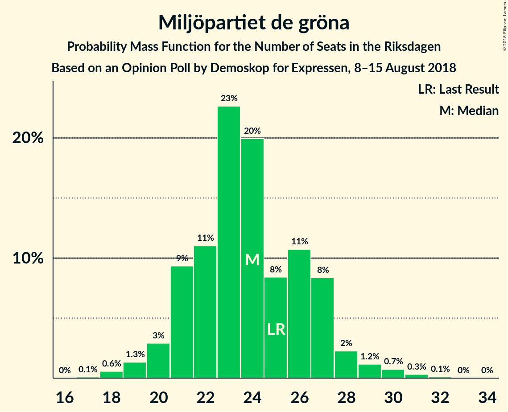

# Opinion Poll by Demoskop for Expressen, 8–15 August 2018

<a href="#voting-intentions">Voting Intentions</a> | <a href="#seats">Seats</a> | <a href="#coalitions">Coalitions</a> | <a href="#technical-information">Technical Information</a>

## Voting Intentions

### Confidence Intervals

| Party | Last Result | Poll Result | 80% Confidence Interval | 90% Confidence Interval | 95% Confidence Interval | 99% Confidence Interval |
|:-----:|:-----------:|:-----------:|:-----------------------:|:-----------------------:|:-----------------------:|:-----------------------:|
| Sveriges socialdemokratiska arbetareparti | 31.0% | 23.6% | 22.3–25.0% |21.9–25.4% |21.6–25.7% |20.9–26.4% |
| Moderata samlingspartiet | 23.3% | 19.7% | 18.5–21.0% |18.2–21.4% |17.8–21.7% |17.3–22.4% |
| Sverigedemokraterna | 12.9% | 19.6% | 18.4–20.9% |18.0–21.3% |17.7–21.6% |17.1–22.3% |
| Centerpartiet | 6.1% | 11.1% | 10.1–12.1% |9.9–12.5% |9.6–12.7% |9.2–13.2% |
| Vänsterpartiet | 5.7% | 8.8% | 7.9–9.8% |7.7–10.0% |7.5–10.3% |7.1–10.7% |
| Miljöpartiet de gröna | 6.9% | 6.5% | 5.7–7.3% |5.5–7.6% |5.4–7.8% |5.0–8.2% |
| Liberalerna | 5.4% | 4.8% | 4.2–5.5% |4.0–5.8% |3.8–6.0% |3.6–6.3% |
| Kristdemokraterna | 4.6% | 3.6% | 3.1–4.3% |2.9–4.5% |2.8–4.6% |2.6–5.0% |
| Feministiskt initiativ | 3.1% | 1.0% | 0.7–1.4% |0.7–1.5% |0.6–1.6% |0.5–1.8% |

*Note:* The poll result column reflects the actual value used in the calculations. Published results may vary slightly, and in addition be rounded to fewer digits.

## Seats

### Confidence Intervals

| Party | Last Result | Median | 80% Confidence Interval | 90% Confidence Interval | 95% Confidence Interval | 99% Confidence Interval |
|:-----:|:-----------:|:------:|:-----------------------:|:-----------------------:|:-----------------------:|:-----------------------:|
| <a href="#sveriges-socialdemokratiska-arbetareparti">Sveriges socialdemokratiska arbetareparti</a> | 113 | 87 | 80–92 |79–94 |79–96 |77–98 |
| <a href="#moderata-samlingspartiet">Moderata samlingspartiet</a> | 84 | 73 | 68–79 |66–79 |65–80 |63–84 |
| <a href="#sverigedemokraterna">Sverigedemokraterna</a> | 49 | 71 | 67–77 |66–80 |64–80 |63–84 |
| <a href="#centerpartiet">Centerpartiet</a> | 22 | 41 | 37–45 |36–46 |35–47 |34–49 |
| <a href="#vänsterpartiet">Vänsterpartiet</a> | 21 | 32 | 29–36 |28–37 |27–38 |26–40 |
| <a href="#miljöpartiet-de-gröna">Miljöpartiet de gröna</a> | 25 | 24 | 21–27 |21–27 |20–28 |18–30 |
| <a href="#liberalerna">Liberalerna</a> | 19 | 18 | 15–20 |0–21 |0–22 |0–23 |
| <a href="#kristdemokraterna">Kristdemokraterna</a> | 16 | 0 | 0–15 |0–16 |0–17 |0–18 |
| <a href="#feministiskt-initiativ">Feministiskt initiativ</a> | 0 | 0 | 0 |0 |0 |0 |

### Sveriges socialdemokratiska arbetareparti

*For a full overview of the results for this party, see the [Sveriges socialdemokratiska arbetareparti](party-sverigessocialdemokratiskaarbetareparti.html) page.*

| Number of Seats | Probability | Accumulated | Special Marks |
|:---------------:|:-----------:|:-----------:|:-------------:|
| 73 | 0% | 100% |  |
| 74 | 0.2% | 99.9% |  |
| 75 | 0.1% | 99.8% |  |
| 76 | 0.2% | 99.7% |  |
| 77 | 0.8% | 99.5% |  |
| 78 | 0.6% | 98.7% |  |
| 79 | 5% | 98% |  |
| 80 | 3% | 93% |  |
| 81 | 4% | 90% |  |
| 82 | 7% | 86% |  |
| 83 | 2% | 79% |  |
| 84 | 7% | 77% |  |
| 85 | 8% | 70% |  |
| 86 | 4% | 62% |  |
| 87 | 15% | 57% | Median |
| 88 | 11% | 43% |  |
| 89 | 9% | 31% |  |
| 90 | 10% | 23% |  |
| 91 | 3% | 13% |  |
| 92 | 3% | 10% |  |
| 93 | 2% | 8% |  |
| 94 | 2% | 6% |  |
| 95 | 1.0% | 4% |  |
| 96 | 2% | 3% |  |
| 97 | 0.5% | 1.2% |  |
| 98 | 0.4% | 0.8% |  |
| 99 | 0.2% | 0.4% |  |
| 100 | 0.1% | 0.1% |  |
| 101 | 0% | 0.1% |  |
| 102 | 0% | 0.1% |  |
| 103 | 0% | 0% |  |
| 104 | 0% | 0% |  |
| 105 | 0% | 0% |  |
| 106 | 0% | 0% |  |
| 107 | 0% | 0% |  |
| 108 | 0% | 0% |  |
| 109 | 0% | 0% |  |
| 110 | 0% | 0% |  |
| 111 | 0% | 0% |  |
| 112 | 0% | 0% |  |
| 113 | 0% | 0% | Last Result |

### Moderata samlingspartiet

*For a full overview of the results for this party, see the [Moderata samlingspartiet](party-moderatasamlingspartiet.html) page.*

| Number of Seats | Probability | Accumulated | Special Marks |
|:---------------:|:-----------:|:-----------:|:-------------:|
| 61 | 0.1% | 100% |  |
| 62 | 0.4% | 99.9% |  |
| 63 | 0.7% | 99.5% |  |
| 64 | 1.0% | 98.8% |  |
| 65 | 2% | 98% |  |
| 66 | 2% | 96% |  |
| 67 | 3% | 93% |  |
| 68 | 6% | 90% |  |
| 69 | 3% | 84% |  |
| 70 | 14% | 81% |  |
| 71 | 8% | 67% |  |
| 72 | 9% | 59% |  |
| 73 | 14% | 50% | Median |
| 74 | 5% | 37% |  |
| 75 | 5% | 31% |  |
| 76 | 5% | 26% |  |
| 77 | 4% | 21% |  |
| 78 | 4% | 17% |  |
| 79 | 10% | 13% |  |
| 80 | 1.0% | 3% |  |
| 81 | 0.9% | 2% |  |
| 82 | 0.4% | 1.3% |  |
| 83 | 0.3% | 0.9% |  |
| 84 | 0.4% | 0.6% | Last Result |
| 85 | 0.1% | 0.2% |  |
| 86 | 0% | 0.1% |  |
| 87 | 0% | 0% |  |

### Sverigedemokraterna

*For a full overview of the results for this party, see the [Sverigedemokraterna](party-sverigedemokraterna.html) page.*

| Number of Seats | Probability | Accumulated | Special Marks |
|:---------------:|:-----------:|:-----------:|:-------------:|
| 49 | 0% | 100% | Last Result |
| 50 | 0% | 100% |  |
| 51 | 0% | 100% |  |
| 52 | 0% | 100% |  |
| 53 | 0% | 100% |  |
| 54 | 0% | 100% |  |
| 55 | 0% | 100% |  |
| 56 | 0% | 100% |  |
| 57 | 0% | 100% |  |
| 58 | 0% | 100% |  |
| 59 | 0% | 100% |  |
| 60 | 0.1% | 100% |  |
| 61 | 0.1% | 99.9% |  |
| 62 | 0.2% | 99.8% |  |
| 63 | 0.6% | 99.7% |  |
| 64 | 2% | 99.1% |  |
| 65 | 2% | 97% |  |
| 66 | 2% | 95% |  |
| 67 | 4% | 93% |  |
| 68 | 6% | 89% |  |
| 69 | 6% | 83% |  |
| 70 | 18% | 77% |  |
| 71 | 12% | 60% | Median |
| 72 | 8% | 48% |  |
| 73 | 5% | 40% |  |
| 74 | 7% | 35% |  |
| 75 | 11% | 28% |  |
| 76 | 5% | 17% |  |
| 77 | 3% | 12% |  |
| 78 | 3% | 10% |  |
| 79 | 1.3% | 6% |  |
| 80 | 3% | 5% |  |
| 81 | 0.5% | 2% |  |
| 82 | 0.6% | 2% |  |
| 83 | 0.2% | 0.9% |  |
| 84 | 0.6% | 0.7% |  |
| 85 | 0.1% | 0.1% |  |
| 86 | 0% | 0% |  |

### Centerpartiet

*For a full overview of the results for this party, see the [Centerpartiet](party-centerpartiet.html) page.*

| Number of Seats | Probability | Accumulated | Special Marks |
|:---------------:|:-----------:|:-----------:|:-------------:|
| 22 | 0% | 100% | Last Result |
| 23 | 0% | 100% |  |
| 24 | 0% | 100% |  |
| 25 | 0% | 100% |  |
| 26 | 0% | 100% |  |
| 27 | 0% | 100% |  |
| 28 | 0% | 100% |  |
| 29 | 0% | 100% |  |
| 30 | 0% | 100% |  |
| 31 | 0% | 100% |  |
| 32 | 0.1% | 99.9% |  |
| 33 | 0.2% | 99.8% |  |
| 34 | 0.6% | 99.6% |  |
| 35 | 2% | 99.1% |  |
| 36 | 3% | 97% |  |
| 37 | 10% | 93% |  |
| 38 | 5% | 83% |  |
| 39 | 7% | 78% |  |
| 40 | 12% | 71% |  |
| 41 | 23% | 59% | Median |
| 42 | 12% | 36% |  |
| 43 | 11% | 24% |  |
| 44 | 3% | 13% |  |
| 45 | 4% | 11% |  |
| 46 | 4% | 6% |  |
| 47 | 1.3% | 3% |  |
| 48 | 1.0% | 2% |  |
| 49 | 0.2% | 0.5% |  |
| 50 | 0.2% | 0.3% |  |
| 51 | 0% | 0.1% |  |
| 52 | 0.1% | 0.1% |  |
| 53 | 0% | 0% |  |

### Vänsterpartiet

*For a full overview of the results for this party, see the [Vänsterpartiet](party-vänsterpartiet.html) page.*

| Number of Seats | Probability | Accumulated | Special Marks |
|:---------------:|:-----------:|:-----------:|:-------------:|
| 21 | 0% | 100% | Last Result |
| 22 | 0% | 100% |  |
| 23 | 0% | 100% |  |
| 24 | 0% | 100% |  |
| 25 | 0.2% | 99.9% |  |
| 26 | 0.5% | 99.8% |  |
| 27 | 2% | 99.2% |  |
| 28 | 4% | 97% |  |
| 29 | 7% | 93% |  |
| 30 | 21% | 86% |  |
| 31 | 11% | 65% |  |
| 32 | 6% | 55% | Median |
| 33 | 14% | 49% |  |
| 34 | 11% | 35% |  |
| 35 | 13% | 24% |  |
| 36 | 5% | 11% |  |
| 37 | 3% | 6% |  |
| 38 | 2% | 3% |  |
| 39 | 0.8% | 1.4% |  |
| 40 | 0.3% | 0.5% |  |
| 41 | 0.2% | 0.2% |  |
| 42 | 0% | 0.1% |  |
| 43 | 0% | 0% |  |

### Miljöpartiet de gröna

*For a full overview of the results for this party, see the [Miljöpartiet de gröna](party-miljöpartietdegröna.html) page.*

| Number of Seats | Probability | Accumulated | Special Marks |
|:---------------:|:-----------:|:-----------:|:-------------:|
| 17 | 0.1% | 100% |  |
| 18 | 0.6% | 99.9% |  |
| 19 | 1.3% | 99.3% |  |
| 20 | 3% | 98% |  |
| 21 | 9% | 95% |  |
| 22 | 11% | 86% |  |
| 23 | 23% | 75% |  |
| 24 | 20% | 52% | Median |
| 25 | 8% | 32% | Last Result |
| 26 | 11% | 24% |  |
| 27 | 8% | 13% |  |
| 28 | 2% | 5% |  |
| 29 | 1.2% | 2% |  |
| 30 | 0.7% | 1.2% |  |
| 31 | 0.3% | 0.5% |  |
| 32 | 0.1% | 0.1% |  |
| 33 | 0% | 0% |  |

### Liberalerna

*For a full overview of the results for this party, see the [Liberalerna](party-liberalerna.html) page.*

| Number of Seats | Probability | Accumulated | Special Marks |
|:---------------:|:-----------:|:-----------:|:-------------:|
| 0 | 7% | 100% |  |
| 1 | 0% | 93% |  |
| 2 | 0% | 93% |  |
| 3 | 0% | 93% |  |
| 4 | 0% | 93% |  |
| 5 | 0% | 93% |  |
| 6 | 0% | 93% |  |
| 7 | 0% | 93% |  |
| 8 | 0% | 93% |  |
| 9 | 0% | 93% |  |
| 10 | 0% | 93% |  |
| 11 | 0% | 93% |  |
| 12 | 0% | 93% |  |
| 13 | 0% | 93% |  |
| 14 | 0.2% | 93% |  |
| 15 | 8% | 93% |  |
| 16 | 8% | 84% |  |
| 17 | 24% | 76% |  |
| 18 | 14% | 52% | Median |
| 19 | 20% | 38% | Last Result |
| 20 | 10% | 18% |  |
| 21 | 5% | 8% |  |
| 22 | 2% | 3% |  |
| 23 | 0.6% | 1.0% |  |
| 24 | 0.3% | 0.3% |  |
| 25 | 0.1% | 0.1% |  |
| 26 | 0% | 0% |  |

### Kristdemokraterna

*For a full overview of the results for this party, see the [Kristdemokraterna](party-kristdemokraterna.html) page.*

| Number of Seats | Probability | Accumulated | Special Marks |
|:---------------:|:-----------:|:-----------:|:-------------:|
| 0 | 72% | 100% | Median |
| 1 | 0% | 28% |  |
| 2 | 0% | 28% |  |
| 3 | 0% | 28% |  |
| 4 | 0% | 28% |  |
| 5 | 0% | 28% |  |
| 6 | 0% | 28% |  |
| 7 | 0% | 28% |  |
| 8 | 0% | 28% |  |
| 9 | 0% | 28% |  |
| 10 | 0% | 28% |  |
| 11 | 0% | 28% |  |
| 12 | 0% | 28% |  |
| 13 | 0% | 28% |  |
| 14 | 6% | 28% |  |
| 15 | 15% | 22% |  |
| 16 | 5% | 7% | Last Result |
| 17 | 2% | 3% |  |
| 18 | 0.5% | 0.9% |  |
| 19 | 0.3% | 0.4% |  |
| 20 | 0% | 0% |  |

### Feministiskt initiativ

*For a full overview of the results for this party, see the [Feministiskt initiativ](party-feministisktinitiativ.html) page.*

| Number of Seats | Probability | Accumulated | Special Marks |
|:---------------:|:-----------:|:-----------:|:-------------:|
| 0 | 100% | 100% | Last Result, Median |

## Coalitions

### Confidence Intervals

| Coalition | Last Result | Median | Majority? | 80% Confidence Interval | 90% Confidence Interval | 95% Confidence Interval | 99% Confidence Interval |
|:---------:|:-----------:|:------:|:---------:|:-----------------------:|:-----------------------:|:-----------------------:|:-----------------------:|
| Sveriges socialdemokratiska arbetareparti – Moderata samlingspartiet | 197 | 160 | 0.6% | 151–166 | 150–169 | 147–171 | 145–175 |
| Moderata samlingspartiet – Sverigedemokraterna – Kristdemokraterna | 149 | 149 | 0% | 142–158 | 139–159 | 138–162 | 135–165 |
| Moderata samlingspartiet – Sverigedemokraterna | 133 | 145 | 0% | 138–152 | 135–155 | 134–155 | 130–159 |
| Sveriges socialdemokratiska arbetareparti – Vänsterpartiet – Miljöpartiet de gröna – Feministiskt initiativ | 159 | 142 | 0% | 136–150 | 133–151 | 132–153 | 130–157 |
| Sveriges socialdemokratiska arbetareparti – Vänsterpartiet – Miljöpartiet de gröna | 159 | 142 | 0% | 136–150 | 133–151 | 132–153 | 130–157 |
| Moderata samlingspartiet – Centerpartiet – Liberalerna – Kristdemokraterna | 141 | 135 | 0% | 126–143 | 122–145 | 122–147 | 114–150 |
| Moderata samlingspartiet – Centerpartiet – Liberalerna | 125 | 130 | 0% | 122–137 | 121–139 | 118–142 | 112–143 |
| Moderata samlingspartiet – Centerpartiet – Kristdemokraterna | 122 | 117 | 0% | 109–126 | 107–128 | 107–130 | 103–134 |
| Sveriges socialdemokratiska arbetareparti – Vänsterpartiet | 134 | 118 | 0% | 113–125 | 110–127 | 108–128 | 106–132 |
| Moderata samlingspartiet – Centerpartiet | 106 | 113 | 0% | 107–120 | 105–122 | 104–123 | 101–128 |
| Sveriges socialdemokratiska arbetareparti – Miljöpartiet de gröna | 138 | 111 | 0% | 103–116 | 102–119 | 101–119 | 98–123 |

### Sveriges socialdemokratiska arbetareparti – Moderata samlingspartiet

| Number of Seats | Probability | Accumulated | Special Marks |
|:---------------:|:-----------:|:-----------:|:-------------:|
| 141 | 0% | 100% |  |
| 142 | 0% | 99.9% |  |
| 143 | 0% | 99.9% |  |
| 144 | 0.2% | 99.8% |  |
| 145 | 0.2% | 99.7% |  |
| 146 | 0.5% | 99.4% |  |
| 147 | 2% | 98.9% |  |
| 148 | 0.5% | 97% |  |
| 149 | 0.8% | 97% |  |
| 150 | 5% | 96% |  |
| 151 | 3% | 91% |  |
| 152 | 3% | 88% |  |
| 153 | 1.4% | 85% |  |
| 154 | 4% | 84% |  |
| 155 | 9% | 80% |  |
| 156 | 3% | 71% |  |
| 157 | 5% | 67% |  |
| 158 | 6% | 62% |  |
| 159 | 6% | 56% |  |
| 160 | 9% | 51% | Median |
| 161 | 9% | 42% |  |
| 162 | 4% | 32% |  |
| 163 | 5% | 28% |  |
| 164 | 3% | 23% |  |
| 165 | 2% | 20% |  |
| 166 | 8% | 18% |  |
| 167 | 2% | 10% |  |
| 168 | 2% | 8% |  |
| 169 | 3% | 6% |  |
| 170 | 0.4% | 3% |  |
| 171 | 0.5% | 3% |  |
| 172 | 0.8% | 2% |  |
| 173 | 0.4% | 1.3% |  |
| 174 | 0.4% | 0.9% |  |
| 175 | 0.3% | 0.6% | Majority |
| 176 | 0.1% | 0.3% |  |
| 177 | 0.1% | 0.2% |  |
| 178 | 0% | 0.2% |  |
| 179 | 0.1% | 0.2% |  |
| 180 | 0% | 0% |  |
| 181 | 0% | 0% |  |
| 182 | 0% | 0% |  |
| 183 | 0% | 0% |  |
| 184 | 0% | 0% |  |
| 185 | 0% | 0% |  |
| 186 | 0% | 0% |  |
| 187 | 0% | 0% |  |
| 188 | 0% | 0% |  |
| 189 | 0% | 0% |  |
| 190 | 0% | 0% |  |
| 191 | 0% | 0% |  |
| 192 | 0% | 0% |  |
| 193 | 0% | 0% |  |
| 194 | 0% | 0% |  |
| 195 | 0% | 0% |  |
| 196 | 0% | 0% |  |
| 197 | 0% | 0% | Last Result |

### Moderata samlingspartiet – Sverigedemokraterna – Kristdemokraterna

| Number of Seats | Probability | Accumulated | Special Marks |
|:---------------:|:-----------:|:-----------:|:-------------:|
| 132 | 0.1% | 100% |  |
| 133 | 0.1% | 99.9% |  |
| 134 | 0.1% | 99.8% |  |
| 135 | 0.3% | 99.7% |  |
| 136 | 1.1% | 99.5% |  |
| 137 | 0.6% | 98% |  |
| 138 | 0.7% | 98% |  |
| 139 | 2% | 97% |  |
| 140 | 1.4% | 95% |  |
| 141 | 2% | 93% |  |
| 142 | 6% | 91% |  |
| 143 | 7% | 85% |  |
| 144 | 4% | 78% | Median |
| 145 | 12% | 74% |  |
| 146 | 3% | 63% |  |
| 147 | 9% | 60% |  |
| 148 | 1.3% | 52% |  |
| 149 | 4% | 50% | Last Result |
| 150 | 10% | 46% |  |
| 151 | 3% | 36% |  |
| 152 | 2% | 33% |  |
| 153 | 4% | 31% |  |
| 154 | 3% | 26% |  |
| 155 | 9% | 23% |  |
| 156 | 2% | 14% |  |
| 157 | 0.9% | 12% |  |
| 158 | 1.3% | 11% |  |
| 159 | 6% | 10% |  |
| 160 | 0.7% | 4% |  |
| 161 | 0.5% | 3% |  |
| 162 | 1.5% | 3% |  |
| 163 | 0.3% | 1.4% |  |
| 164 | 0.4% | 1.0% |  |
| 165 | 0.2% | 0.6% |  |
| 166 | 0.1% | 0.4% |  |
| 167 | 0.1% | 0.3% |  |
| 168 | 0.1% | 0.2% |  |
| 169 | 0% | 0.1% |  |
| 170 | 0% | 0.1% |  |
| 171 | 0% | 0.1% |  |
| 172 | 0% | 0% |  |

### Moderata samlingspartiet – Sverigedemokraterna

| Number of Seats | Probability | Accumulated | Special Marks |
|:---------------:|:-----------:|:-----------:|:-------------:|
| 127 | 0% | 100% |  |
| 128 | 0% | 99.9% |  |
| 129 | 0.3% | 99.9% |  |
| 130 | 0.4% | 99.6% |  |
| 131 | 0.2% | 99.2% |  |
| 132 | 0.3% | 99.0% |  |
| 133 | 0.3% | 98.7% | Last Result |
| 134 | 3% | 98% |  |
| 135 | 1.0% | 96% |  |
| 136 | 2% | 95% |  |
| 137 | 1.3% | 93% |  |
| 138 | 4% | 92% |  |
| 139 | 4% | 87% |  |
| 140 | 6% | 84% |  |
| 141 | 4% | 77% |  |
| 142 | 7% | 73% |  |
| 143 | 8% | 66% |  |
| 144 | 5% | 59% | Median |
| 145 | 15% | 53% |  |
| 146 | 3% | 38% |  |
| 147 | 9% | 36% |  |
| 148 | 3% | 27% |  |
| 149 | 2% | 24% |  |
| 150 | 10% | 22% |  |
| 151 | 2% | 13% |  |
| 152 | 1.3% | 10% |  |
| 153 | 2% | 9% |  |
| 154 | 2% | 8% |  |
| 155 | 4% | 6% |  |
| 156 | 0.3% | 2% |  |
| 157 | 0.2% | 2% |  |
| 158 | 0.4% | 1.5% |  |
| 159 | 0.8% | 1.1% |  |
| 160 | 0.1% | 0.3% |  |
| 161 | 0% | 0.2% |  |
| 162 | 0.1% | 0.2% |  |
| 163 | 0% | 0.1% |  |
| 164 | 0% | 0.1% |  |
| 165 | 0% | 0% |  |

### Sveriges socialdemokratiska arbetareparti – Vänsterpartiet – Miljöpartiet de gröna – Feministiskt initiativ

| Number of Seats | Probability | Accumulated | Special Marks |
|:---------------:|:-----------:|:-----------:|:-------------:|
| 126 | 0% | 100% |  |
| 127 | 0.1% | 99.9% |  |
| 128 | 0.1% | 99.8% |  |
| 129 | 0.1% | 99.8% |  |
| 130 | 0.6% | 99.7% |  |
| 131 | 0.4% | 99.1% |  |
| 132 | 3% | 98.7% |  |
| 133 | 0.9% | 95% |  |
| 134 | 2% | 94% |  |
| 135 | 2% | 92% |  |
| 136 | 2% | 90% |  |
| 137 | 9% | 88% |  |
| 138 | 3% | 79% |  |
| 139 | 5% | 76% |  |
| 140 | 2% | 71% |  |
| 141 | 14% | 68% |  |
| 142 | 5% | 54% |  |
| 143 | 6% | 49% | Median |
| 144 | 10% | 43% |  |
| 145 | 3% | 33% |  |
| 146 | 3% | 30% |  |
| 147 | 7% | 27% |  |
| 148 | 4% | 20% |  |
| 149 | 3% | 16% |  |
| 150 | 4% | 13% |  |
| 151 | 5% | 9% |  |
| 152 | 2% | 4% |  |
| 153 | 0.7% | 3% |  |
| 154 | 0.4% | 2% |  |
| 155 | 0.5% | 1.5% |  |
| 156 | 0.3% | 1.0% |  |
| 157 | 0.3% | 0.7% |  |
| 158 | 0.1% | 0.4% |  |
| 159 | 0.2% | 0.3% | Last Result |
| 160 | 0.1% | 0.1% |  |
| 161 | 0% | 0.1% |  |
| 162 | 0% | 0% |  |

### Sveriges socialdemokratiska arbetareparti – Vänsterpartiet – Miljöpartiet de gröna

| Number of Seats | Probability | Accumulated | Special Marks |
|:---------------:|:-----------:|:-----------:|:-------------:|
| 126 | 0% | 100% |  |
| 127 | 0.1% | 99.9% |  |
| 128 | 0.1% | 99.8% |  |
| 129 | 0.1% | 99.8% |  |
| 130 | 0.6% | 99.7% |  |
| 131 | 0.4% | 99.1% |  |
| 132 | 3% | 98.7% |  |
| 133 | 0.9% | 95% |  |
| 134 | 2% | 94% |  |
| 135 | 2% | 92% |  |
| 136 | 2% | 90% |  |
| 137 | 9% | 88% |  |
| 138 | 3% | 79% |  |
| 139 | 5% | 76% |  |
| 140 | 2% | 71% |  |
| 141 | 14% | 68% |  |
| 142 | 5% | 54% |  |
| 143 | 6% | 49% | Median |
| 144 | 10% | 43% |  |
| 145 | 3% | 33% |  |
| 146 | 3% | 30% |  |
| 147 | 7% | 27% |  |
| 148 | 4% | 20% |  |
| 149 | 3% | 16% |  |
| 150 | 4% | 13% |  |
| 151 | 5% | 9% |  |
| 152 | 2% | 4% |  |
| 153 | 0.7% | 3% |  |
| 154 | 0.4% | 2% |  |
| 155 | 0.5% | 1.5% |  |
| 156 | 0.3% | 1.0% |  |
| 157 | 0.3% | 0.7% |  |
| 158 | 0.1% | 0.4% |  |
| 159 | 0.2% | 0.3% | Last Result |
| 160 | 0.1% | 0.1% |  |
| 161 | 0% | 0.1% |  |
| 162 | 0% | 0% |  |

### Moderata samlingspartiet – Centerpartiet – Liberalerna – Kristdemokraterna

| Number of Seats | Probability | Accumulated | Special Marks |
|:---------------:|:-----------:|:-----------:|:-------------:|
| 109 | 0.1% | 100% |  |
| 110 | 0% | 99.9% |  |
| 111 | 0% | 99.9% |  |
| 112 | 0% | 99.9% |  |
| 113 | 0% | 99.9% |  |
| 114 | 0.6% | 99.8% |  |
| 115 | 0.1% | 99.2% |  |
| 116 | 0.1% | 99.1% |  |
| 117 | 0.1% | 99.0% |  |
| 118 | 0.1% | 98.9% |  |
| 119 | 0.2% | 98.8% |  |
| 120 | 0.2% | 98.6% |  |
| 121 | 0.3% | 98% |  |
| 122 | 3% | 98% |  |
| 123 | 0.9% | 95% |  |
| 124 | 2% | 94% |  |
| 125 | 1.4% | 92% |  |
| 126 | 2% | 91% |  |
| 127 | 3% | 89% |  |
| 128 | 7% | 86% |  |
| 129 | 4% | 79% |  |
| 130 | 2% | 75% |  |
| 131 | 5% | 73% |  |
| 132 | 4% | 68% | Median |
| 133 | 13% | 65% |  |
| 134 | 2% | 52% |  |
| 135 | 5% | 50% |  |
| 136 | 6% | 45% |  |
| 137 | 8% | 39% |  |
| 138 | 4% | 31% |  |
| 139 | 2% | 26% |  |
| 140 | 2% | 24% |  |
| 141 | 3% | 23% | Last Result |
| 142 | 7% | 20% |  |
| 143 | 6% | 12% |  |
| 144 | 0.7% | 7% |  |
| 145 | 2% | 6% |  |
| 146 | 1.2% | 4% |  |
| 147 | 0.5% | 3% |  |
| 148 | 0.7% | 2% |  |
| 149 | 0.2% | 1.3% |  |
| 150 | 0.8% | 1.1% |  |
| 151 | 0.1% | 0.3% |  |
| 152 | 0.1% | 0.2% |  |
| 153 | 0.1% | 0.2% |  |
| 154 | 0% | 0.1% |  |
| 155 | 0% | 0% |  |

### Moderata samlingspartiet – Centerpartiet – Liberalerna

| Number of Seats | Probability | Accumulated | Special Marks |
|:---------------:|:-----------:|:-----------:|:-------------:|
| 109 | 0.2% | 100% |  |
| 110 | 0% | 99.8% |  |
| 111 | 0.1% | 99.7% |  |
| 112 | 0.2% | 99.7% |  |
| 113 | 0.1% | 99.5% |  |
| 114 | 1.0% | 99.4% |  |
| 115 | 0.2% | 98% |  |
| 116 | 0.2% | 98% |  |
| 117 | 0.3% | 98% |  |
| 118 | 0.3% | 98% |  |
| 119 | 0.6% | 97% |  |
| 120 | 0.7% | 97% |  |
| 121 | 2% | 96% |  |
| 122 | 4% | 94% |  |
| 123 | 3% | 90% |  |
| 124 | 3% | 87% |  |
| 125 | 3% | 84% | Last Result |
| 126 | 4% | 82% |  |
| 127 | 9% | 78% |  |
| 128 | 8% | 69% |  |
| 129 | 8% | 61% |  |
| 130 | 3% | 53% |  |
| 131 | 6% | 50% |  |
| 132 | 4% | 44% | Median |
| 133 | 13% | 40% |  |
| 134 | 2% | 27% |  |
| 135 | 5% | 25% |  |
| 136 | 4% | 19% |  |
| 137 | 7% | 15% |  |
| 138 | 3% | 8% |  |
| 139 | 1.0% | 5% |  |
| 140 | 0.9% | 4% |  |
| 141 | 0.7% | 3% |  |
| 142 | 2% | 3% |  |
| 143 | 0.2% | 0.5% |  |
| 144 | 0.1% | 0.3% |  |
| 145 | 0% | 0.2% |  |
| 146 | 0.1% | 0.2% |  |
| 147 | 0.1% | 0.1% |  |
| 148 | 0% | 0% |  |

### Moderata samlingspartiet – Centerpartiet – Kristdemokraterna

| Number of Seats | Probability | Accumulated | Special Marks |
|:---------------:|:-----------:|:-----------:|:-------------:|
| 101 | 0% | 100% |  |
| 102 | 0.1% | 99.9% |  |
| 103 | 0.3% | 99.8% |  |
| 104 | 0.2% | 99.5% |  |
| 105 | 0.6% | 99.3% |  |
| 106 | 1.0% | 98.7% |  |
| 107 | 3% | 98% |  |
| 108 | 0.9% | 95% |  |
| 109 | 4% | 94% |  |
| 110 | 2% | 90% |  |
| 111 | 4% | 88% |  |
| 112 | 6% | 84% |  |
| 113 | 8% | 78% |  |
| 114 | 9% | 70% | Median |
| 115 | 3% | 61% |  |
| 116 | 6% | 58% |  |
| 117 | 4% | 53% |  |
| 118 | 4% | 49% |  |
| 119 | 4% | 45% |  |
| 120 | 8% | 41% |  |
| 121 | 3% | 33% |  |
| 122 | 6% | 30% | Last Result |
| 123 | 3% | 24% |  |
| 124 | 2% | 21% |  |
| 125 | 8% | 19% |  |
| 126 | 2% | 10% |  |
| 127 | 2% | 8% |  |
| 128 | 2% | 6% |  |
| 129 | 0.9% | 5% |  |
| 130 | 2% | 4% |  |
| 131 | 0.8% | 2% |  |
| 132 | 0.3% | 1.4% |  |
| 133 | 0.5% | 1.0% |  |
| 134 | 0.2% | 0.5% |  |
| 135 | 0.1% | 0.4% |  |
| 136 | 0.1% | 0.3% |  |
| 137 | 0% | 0.1% |  |
| 138 | 0% | 0.1% |  |
| 139 | 0.1% | 0.1% |  |
| 140 | 0% | 0% |  |

### Sveriges socialdemokratiska arbetareparti – Vänsterpartiet

| Number of Seats | Probability | Accumulated | Special Marks |
|:---------------:|:-----------:|:-----------:|:-------------:|
| 104 | 0.1% | 100% |  |
| 105 | 0.1% | 99.9% |  |
| 106 | 0.3% | 99.8% |  |
| 107 | 0.2% | 99.5% |  |
| 108 | 3% | 99.2% |  |
| 109 | 0.6% | 96% |  |
| 110 | 2% | 96% |  |
| 111 | 2% | 94% |  |
| 112 | 2% | 92% |  |
| 113 | 4% | 90% |  |
| 114 | 5% | 87% |  |
| 115 | 9% | 82% |  |
| 116 | 6% | 73% |  |
| 117 | 9% | 67% |  |
| 118 | 12% | 58% |  |
| 119 | 5% | 46% | Median |
| 120 | 3% | 41% |  |
| 121 | 8% | 38% |  |
| 122 | 3% | 29% |  |
| 123 | 5% | 26% |  |
| 124 | 5% | 21% |  |
| 125 | 8% | 16% |  |
| 126 | 3% | 9% |  |
| 127 | 2% | 6% |  |
| 128 | 2% | 4% |  |
| 129 | 0.4% | 2% |  |
| 130 | 0.4% | 1.5% |  |
| 131 | 0.3% | 1.0% |  |
| 132 | 0.2% | 0.7% |  |
| 133 | 0.1% | 0.5% |  |
| 134 | 0.1% | 0.3% | Last Result |
| 135 | 0.1% | 0.3% |  |
| 136 | 0% | 0.1% |  |
| 137 | 0.1% | 0.1% |  |
| 138 | 0% | 0% |  |

### Moderata samlingspartiet – Centerpartiet

| Number of Seats | Probability | Accumulated | Special Marks |
|:---------------:|:-----------:|:-----------:|:-------------:|
| 99 | 0.1% | 100% |  |
| 100 | 0.1% | 99.8% |  |
| 101 | 0.6% | 99.7% |  |
| 102 | 0.2% | 99.2% |  |
| 103 | 0.6% | 99.0% |  |
| 104 | 2% | 98% |  |
| 105 | 2% | 96% |  |
| 106 | 3% | 94% | Last Result |
| 107 | 5% | 92% |  |
| 108 | 2% | 87% |  |
| 109 | 5% | 84% |  |
| 110 | 8% | 79% |  |
| 111 | 9% | 71% |  |
| 112 | 7% | 63% |  |
| 113 | 9% | 56% |  |
| 114 | 10% | 47% | Median |
| 115 | 4% | 37% |  |
| 116 | 7% | 33% |  |
| 117 | 4% | 26% |  |
| 118 | 5% | 23% |  |
| 119 | 2% | 18% |  |
| 120 | 7% | 16% |  |
| 121 | 1.1% | 9% |  |
| 122 | 4% | 8% |  |
| 123 | 2% | 4% |  |
| 124 | 1.0% | 2% |  |
| 125 | 0.2% | 1.1% |  |
| 126 | 0.2% | 0.9% |  |
| 127 | 0.2% | 0.7% |  |
| 128 | 0.3% | 0.6% |  |
| 129 | 0% | 0.2% |  |
| 130 | 0% | 0.2% |  |
| 131 | 0.1% | 0.2% |  |
| 132 | 0.1% | 0.1% |  |
| 133 | 0% | 0% |  |

### Sveriges socialdemokratiska arbetareparti – Miljöpartiet de gröna

| Number of Seats | Probability | Accumulated | Special Marks |
|:---------------:|:-----------:|:-----------:|:-------------:|
| 95 | 0.1% | 100% |  |
| 96 | 0.1% | 99.9% |  |
| 97 | 0.3% | 99.9% |  |
| 98 | 0.2% | 99.6% |  |
| 99 | 0.5% | 99.4% |  |
| 100 | 0.4% | 99.0% |  |
| 101 | 1.3% | 98.6% |  |
| 102 | 2% | 97% |  |
| 103 | 5% | 95% |  |
| 104 | 3% | 90% |  |
| 105 | 4% | 87% |  |
| 106 | 4% | 83% |  |
| 107 | 9% | 79% |  |
| 108 | 4% | 70% |  |
| 109 | 3% | 66% |  |
| 110 | 7% | 63% |  |
| 111 | 19% | 56% | Median |
| 112 | 7% | 37% |  |
| 113 | 5% | 30% |  |
| 114 | 6% | 25% |  |
| 115 | 4% | 19% |  |
| 116 | 6% | 14% |  |
| 117 | 2% | 8% |  |
| 118 | 1.0% | 7% |  |
| 119 | 4% | 6% |  |
| 120 | 0.4% | 2% |  |
| 121 | 0.5% | 2% |  |
| 122 | 0.4% | 1.3% |  |
| 123 | 0.6% | 0.9% |  |
| 124 | 0.1% | 0.3% |  |
| 125 | 0.1% | 0.2% |  |
| 126 | 0.1% | 0.2% |  |
| 127 | 0% | 0% |  |
| 128 | 0% | 0% |  |
| 129 | 0% | 0% |  |
| 130 | 0% | 0% |  |
| 131 | 0% | 0% |  |
| 132 | 0% | 0% |  |
| 133 | 0% | 0% |  |
| 134 | 0% | 0% |  |
| 135 | 0% | 0% |  |
| 136 | 0% | 0% |  |
| 137 | 0% | 0% |  |
| 138 | 0% | 0% | Last Result |

## Technical Information

### Opinion Poll

+ **Polling firm:** Demoskop
+ **Commissioner(s):** Expressen
+ **Fieldwork period:** 8–15 August 2018

### Calculations

+ **Sample size:** 1607
+ **Simulations done:** 1,048,576
+ **Error estimate:** 1.40%

