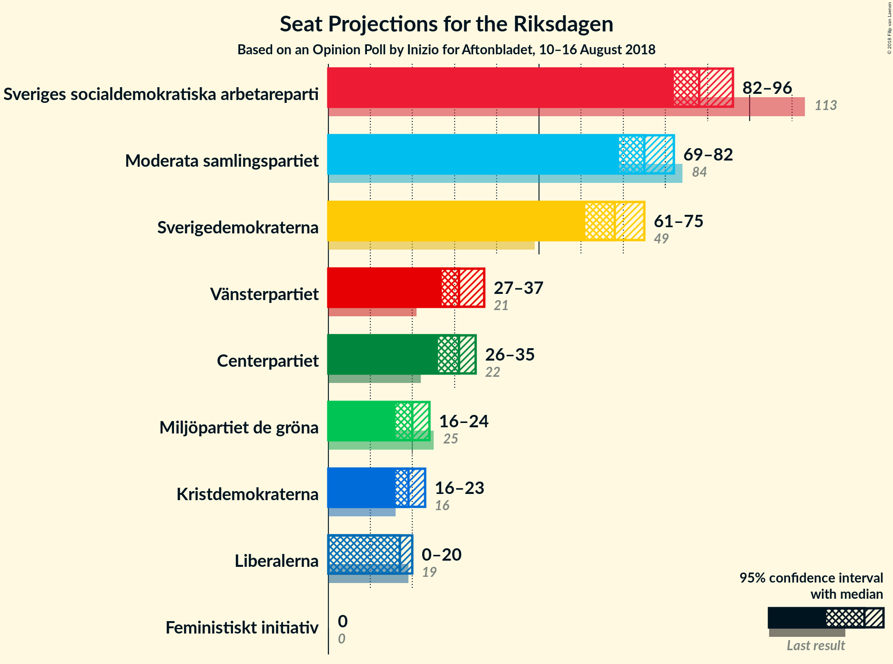

# Opinion Poll by Inizio for Aftonbladet, 10–16 August 2018

<a href="#voting-intentions">Voting Intentions</a> | <a href="#seats">Seats</a> | <a href="#coalitions">Coalitions</a> | <a href="#technical-information">Technical Information</a>

## Voting Intentions

### Confidence Intervals

| Party | Last Result | Poll Result | 80% Confidence Interval | 90% Confidence Interval | 95% Confidence Interval | 99% Confidence Interval |
|:-----:|:-----------:|:-----------:|:-----------------------:|:-----------------------:|:-----------------------:|:-----------------------:|
| Sveriges socialdemokratiska arbetareparti | 31.0% | 24.6% | 23.4–25.8% |23.1–26.2% |22.8–26.5% |22.2–27.1% |
| Moderata samlingspartiet | 23.3% | 20.9% | 19.8–22.1% |19.4–22.4% |19.2–22.7% |18.7–23.3% |
| Sverigedemokraterna | 12.9% | 18.8% | 17.7–19.9% |17.4–20.3% |17.1–20.5% |16.6–21.1% |
| Vänsterpartiet | 5.7% | 8.7% | 7.9–9.5% |7.7–9.8% |7.5–10.0% |7.2–10.4% |
| Centerpartiet | 6.1% | 8.5% | 7.7–9.3% |7.5–9.6% |7.4–9.8% |7.0–10.2% |
| Miljöpartiet de gröna | 6.9% | 5.3% | 4.7–6.0% |4.6–6.2% |4.4–6.4% |4.2–6.7% |
| Kristdemokraterna | 4.6% | 5.2% | 4.6–5.9% |4.5–6.1% |4.3–6.3% |4.1–6.6% |
| Liberalerna | 5.4% | 4.7% | 4.1–5.3% |4.0–5.5% |3.8–5.7% |3.6–6.0% |
| Feministiskt initiativ | 3.1% | 1.1% | 0.9–1.5% |0.8–1.6% |0.7–1.7% |0.6–1.9% |

*Note:* The poll result column reflects the actual value used in the calculations. Published results may vary slightly, and in addition be rounded to fewer digits.

## Seats

### Confidence Intervals

| Party | Last Result | Median | 80% Confidence Interval | 90% Confidence Interval | 95% Confidence Interval | 99% Confidence Interval |
|:-----:|:-----------:|:------:|:-----------------------:|:-----------------------:|:-----------------------:|:-----------------------:|
| <a href="#sveriges-socialdemokratiska-arbetareparti">Sveriges socialdemokratiska arbetareparti</a> | 113 | 88 | 83–93 |81–95 |80–96 |80–100 |
| <a href="#moderata-samlingspartiet">Moderata samlingspartiet</a> | 84 | 74 | 71–80 |69–82 |68–83 |68–84 |
| <a href="#sverigedemokraterna">Sverigedemokraterna</a> | 49 | 70 | 64–73 |63–73 |62–75 |61–77 |
| <a href="#vänsterpartiet">Vänsterpartiet</a> | 21 | 32 | 29–33 |28–34 |28–35 |27–38 |
| <a href="#centerpartiet">Centerpartiet</a> | 22 | 30 | 28–35 |28–36 |25–36 |25–38 |
| <a href="#miljöpartiet-de-gröna">Miljöpartiet de gröna</a> | 25 | 19 | 17–22 |16–23 |15–24 |15–24 |
| <a href="#kristdemokraterna">Kristdemokraterna</a> | 16 | 20 | 17–22 |16–22 |16–23 |15–25 |
| <a href="#liberalerna">Liberalerna</a> | 19 | 17 | 14–19 |0–20 |0–20 |0–21 |
| <a href="#feministiskt-initiativ">Feministiskt initiativ</a> | 0 | 0 | 0 |0 |0 |0 |

### Sveriges socialdemokratiska arbetareparti

*For a full overview of the results for this party, see the [Sveriges socialdemokratiska arbetareparti](party-sverigessocialdemokratiskaarbetareparti.html) page.*

| Number of Seats | Probability | Accumulated | Special Marks |
|:---------------:|:-----------:|:-----------:|:-------------:|
| 78 | 0% | 100% |  |
| 79 | 0.2% | 99.9% |  |
| 80 | 4% | 99.8% |  |
| 81 | 2% | 96% |  |
| 82 | 2% | 94% |  |
| 83 | 3% | 92% |  |
| 84 | 1.4% | 89% |  |
| 85 | 5% | 87% |  |
| 86 | 9% | 83% |  |
| 87 | 15% | 74% |  |
| 88 | 25% | 59% | Median |
| 89 | 5% | 34% |  |
| 90 | 5% | 29% |  |
| 91 | 6% | 24% |  |
| 92 | 0.7% | 19% |  |
| 93 | 8% | 18% |  |
| 94 | 4% | 10% |  |
| 95 | 1.5% | 6% |  |
| 96 | 3% | 4% |  |
| 97 | 0.2% | 2% |  |
| 98 | 0.2% | 1.4% |  |
| 99 | 0.6% | 1.1% |  |
| 100 | 0.1% | 0.5% |  |
| 101 | 0.2% | 0.4% |  |
| 102 | 0% | 0.2% |  |
| 103 | 0.1% | 0.1% |  |
| 104 | 0% | 0% |  |
| 105 | 0% | 0% |  |
| 106 | 0% | 0% |  |
| 107 | 0% | 0% |  |
| 108 | 0% | 0% |  |
| 109 | 0% | 0% |  |
| 110 | 0% | 0% |  |
| 111 | 0% | 0% |  |
| 112 | 0% | 0% |  |
| 113 | 0% | 0% | Last Result |

### Moderata samlingspartiet

*For a full overview of the results for this party, see the [Moderata samlingspartiet](party-moderatasamlingspartiet.html) page.*

| Number of Seats | Probability | Accumulated | Special Marks |
|:---------------:|:-----------:|:-----------:|:-------------:|
| 65 | 0.1% | 100% |  |
| 66 | 0.1% | 99.9% |  |
| 67 | 0.3% | 99.8% |  |
| 68 | 3% | 99.5% |  |
| 69 | 4% | 97% |  |
| 70 | 2% | 93% |  |
| 71 | 8% | 91% |  |
| 72 | 5% | 84% |  |
| 73 | 12% | 79% |  |
| 74 | 30% | 66% | Median |
| 75 | 9% | 37% |  |
| 76 | 2% | 28% |  |
| 77 | 5% | 26% |  |
| 78 | 2% | 21% |  |
| 79 | 6% | 19% |  |
| 80 | 4% | 14% |  |
| 81 | 2% | 9% |  |
| 82 | 3% | 8% |  |
| 83 | 4% | 5% |  |
| 84 | 0.3% | 0.8% | Last Result |
| 85 | 0.4% | 0.5% |  |
| 86 | 0.1% | 0.1% |  |
| 87 | 0.1% | 0.1% |  |
| 88 | 0% | 0% |  |

### Sverigedemokraterna

*For a full overview of the results for this party, see the [Sverigedemokraterna](party-sverigedemokraterna.html) page.*

| Number of Seats | Probability | Accumulated | Special Marks |
|:---------------:|:-----------:|:-----------:|:-------------:|
| 49 | 0% | 100% | Last Result |
| 50 | 0% | 100% |  |
| 51 | 0% | 100% |  |
| 52 | 0% | 100% |  |
| 53 | 0% | 100% |  |
| 54 | 0% | 100% |  |
| 55 | 0% | 100% |  |
| 56 | 0% | 100% |  |
| 57 | 0% | 100% |  |
| 58 | 0% | 100% |  |
| 59 | 0.2% | 100% |  |
| 60 | 0.2% | 99.8% |  |
| 61 | 0.4% | 99.7% |  |
| 62 | 3% | 99.3% |  |
| 63 | 3% | 97% |  |
| 64 | 4% | 93% |  |
| 65 | 2% | 89% |  |
| 66 | 4% | 87% |  |
| 67 | 15% | 82% |  |
| 68 | 7% | 67% |  |
| 69 | 3% | 61% |  |
| 70 | 29% | 57% | Median |
| 71 | 10% | 29% |  |
| 72 | 5% | 19% |  |
| 73 | 9% | 13% |  |
| 74 | 2% | 5% |  |
| 75 | 2% | 3% |  |
| 76 | 0.2% | 1.2% |  |
| 77 | 0.7% | 1.0% |  |
| 78 | 0.1% | 0.2% |  |
| 79 | 0.1% | 0.1% |  |
| 80 | 0% | 0.1% |  |
| 81 | 0% | 0.1% |  |
| 82 | 0% | 0.1% |  |
| 83 | 0% | 0% |  |

### Vänsterpartiet

*For a full overview of the results for this party, see the [Vänsterpartiet](party-vänsterpartiet.html) page.*

| Number of Seats | Probability | Accumulated | Special Marks |
|:---------------:|:-----------:|:-----------:|:-------------:|
| 21 | 0% | 100% | Last Result |
| 22 | 0% | 100% |  |
| 23 | 0% | 100% |  |
| 24 | 0% | 100% |  |
| 25 | 0% | 100% |  |
| 26 | 0.2% | 99.9% |  |
| 27 | 1.1% | 99.7% |  |
| 28 | 5% | 98.5% |  |
| 29 | 8% | 94% |  |
| 30 | 8% | 86% |  |
| 31 | 11% | 77% |  |
| 32 | 30% | 67% | Median |
| 33 | 27% | 37% |  |
| 34 | 6% | 10% |  |
| 35 | 2% | 4% |  |
| 36 | 1.0% | 2% |  |
| 37 | 0.9% | 1.4% |  |
| 38 | 0.4% | 0.5% |  |
| 39 | 0.1% | 0.1% |  |
| 40 | 0% | 0% |  |

### Centerpartiet

*For a full overview of the results for this party, see the [Centerpartiet](party-centerpartiet.html) page.*

| Number of Seats | Probability | Accumulated | Special Marks |
|:---------------:|:-----------:|:-----------:|:-------------:|
| 22 | 0% | 100% | Last Result |
| 23 | 0% | 100% |  |
| 24 | 0.2% | 100% |  |
| 25 | 2% | 99.8% |  |
| 26 | 0.8% | 97% |  |
| 27 | 2% | 97% |  |
| 28 | 8% | 95% |  |
| 29 | 13% | 87% |  |
| 30 | 29% | 74% | Median |
| 31 | 10% | 44% |  |
| 32 | 9% | 34% |  |
| 33 | 6% | 25% |  |
| 34 | 7% | 19% |  |
| 35 | 6% | 12% |  |
| 36 | 6% | 6% |  |
| 37 | 0.1% | 0.6% |  |
| 38 | 0.4% | 0.5% |  |
| 39 | 0.1% | 0.1% |  |
| 40 | 0% | 0% |  |

### Miljöpartiet de gröna

*For a full overview of the results for this party, see the [Miljöpartiet de gröna](party-miljöpartietdegröna.html) page.*

| Number of Seats | Probability | Accumulated | Special Marks |
|:---------------:|:-----------:|:-----------:|:-------------:|
| 0 | 0.3% | 100% |  |
| 1 | 0% | 99.7% |  |
| 2 | 0% | 99.7% |  |
| 3 | 0% | 99.7% |  |
| 4 | 0% | 99.7% |  |
| 5 | 0% | 99.7% |  |
| 6 | 0% | 99.7% |  |
| 7 | 0% | 99.7% |  |
| 8 | 0% | 99.7% |  |
| 9 | 0% | 99.7% |  |
| 10 | 0% | 99.7% |  |
| 11 | 0% | 99.7% |  |
| 12 | 0% | 99.7% |  |
| 13 | 0% | 99.7% |  |
| 14 | 0% | 99.7% |  |
| 15 | 2% | 99.7% |  |
| 16 | 3% | 97% |  |
| 17 | 13% | 94% |  |
| 18 | 4% | 81% |  |
| 19 | 36% | 77% | Median |
| 20 | 6% | 41% |  |
| 21 | 22% | 36% |  |
| 22 | 4% | 14% |  |
| 23 | 5% | 10% |  |
| 24 | 4% | 5% |  |
| 25 | 0.3% | 0.3% | Last Result |
| 26 | 0.1% | 0.1% |  |
| 27 | 0% | 0% |  |

### Kristdemokraterna

*For a full overview of the results for this party, see the [Kristdemokraterna](party-kristdemokraterna.html) page.*

| Number of Seats | Probability | Accumulated | Special Marks |
|:---------------:|:-----------:|:-----------:|:-------------:|
| 0 | 0.2% | 100% |  |
| 1 | 0% | 99.8% |  |
| 2 | 0% | 99.8% |  |
| 3 | 0% | 99.8% |  |
| 4 | 0% | 99.8% |  |
| 5 | 0% | 99.8% |  |
| 6 | 0% | 99.8% |  |
| 7 | 0% | 99.8% |  |
| 8 | 0% | 99.8% |  |
| 9 | 0% | 99.8% |  |
| 10 | 0% | 99.8% |  |
| 11 | 0% | 99.8% |  |
| 12 | 0% | 99.8% |  |
| 13 | 0% | 99.8% |  |
| 14 | 0% | 99.8% |  |
| 15 | 0.9% | 99.7% |  |
| 16 | 8% | 98.9% | Last Result |
| 17 | 10% | 91% |  |
| 18 | 11% | 81% |  |
| 19 | 19% | 69% |  |
| 20 | 31% | 50% | Median |
| 21 | 8% | 19% |  |
| 22 | 6% | 11% |  |
| 23 | 4% | 5% |  |
| 24 | 0.3% | 1.3% |  |
| 25 | 0.9% | 0.9% |  |
| 26 | 0% | 0% |  |

### Liberalerna

*For a full overview of the results for this party, see the [Liberalerna](party-liberalerna.html) page.*

| Number of Seats | Probability | Accumulated | Special Marks |
|:---------------:|:-----------:|:-----------:|:-------------:|
| 0 | 9% | 100% |  |
| 1 | 0% | 91% |  |
| 2 | 0% | 91% |  |
| 3 | 0% | 91% |  |
| 4 | 0% | 91% |  |
| 5 | 0% | 91% |  |
| 6 | 0% | 91% |  |
| 7 | 0% | 91% |  |
| 8 | 0% | 91% |  |
| 9 | 0% | 91% |  |
| 10 | 0% | 91% |  |
| 11 | 0% | 91% |  |
| 12 | 0% | 91% |  |
| 13 | 0% | 91% |  |
| 14 | 2% | 91% |  |
| 15 | 28% | 89% |  |
| 16 | 11% | 61% |  |
| 17 | 7% | 50% | Median |
| 18 | 15% | 43% |  |
| 19 | 19% | 28% | Last Result |
| 20 | 7% | 9% |  |
| 21 | 1.4% | 2% |  |
| 22 | 0.3% | 0.4% |  |
| 23 | 0% | 0.1% |  |
| 24 | 0% | 0% |  |

### Feministiskt initiativ

*For a full overview of the results for this party, see the [Feministiskt initiativ](party-feministisktinitiativ.html) page.*

| Number of Seats | Probability | Accumulated | Special Marks |
|:---------------:|:-----------:|:-----------:|:-------------:|
| 0 | 100% | 100% | Last Result, Median |

## Coalitions

### Confidence Intervals

| Coalition | Last Result | Median | Majority? | 80% Confidence Interval | 90% Confidence Interval | 95% Confidence Interval | 99% Confidence Interval |
|:---------:|:-----------:|:------:|:---------:|:-----------------------:|:-----------------------:|:-----------------------:|:-----------------------:|
| Moderata samlingspartiet – Sverigedemokraterna – Kristdemokraterna | 149 | 164 | 3% | 157–168 | 157–172 | 155–175 | 152–175 |
| Sveriges socialdemokratiska arbetareparti – Moderata samlingspartiet | 197 | 162 | 2% | 158–169 | 157–171 | 157–173 | 155–179 |
| Moderata samlingspartiet – Sverigedemokraterna | 133 | 144 | 0% | 139–149 | 137–151 | 136–155 | 134–155 |
| Moderata samlingspartiet – Centerpartiet – Kristdemokraterna – Liberalerna | 141 | 139 | 0% | 135–147 | 132–150 | 129–151 | 124–152 |
| Sveriges socialdemokratiska arbetareparti – Vänsterpartiet – Miljöpartiet de gröna – Feministiskt initiativ | 159 | 140 | 0% | 133–144 | 133–147 | 131–148 | 128–152 |
| Sveriges socialdemokratiska arbetareparti – Vänsterpartiet – Miljöpartiet de gröna | 159 | 140 | 0% | 133–144 | 133–147 | 131–148 | 128–152 |
| Moderata samlingspartiet – Centerpartiet – Kristdemokraterna | 122 | 124 | 0% | 119–133 | 118–134 | 118–135 | 113–136 |
| Moderata samlingspartiet – Centerpartiet – Liberalerna | 125 | 120 | 0% | 115–128 | 111–130 | 108–131 | 104–133 |
| Sveriges socialdemokratiska arbetareparti – Vänsterpartiet | 134 | 121 | 0% | 114–125 | 112–127 | 112–129 | 109–132 |
| Sveriges socialdemokratiska arbetareparti – Miljöpartiet de gröna | 138 | 107 | 0% | 103–113 | 101–115 | 101–118 | 98–119 |
| Moderata samlingspartiet – Centerpartiet | 106 | 104 | 0% | 101–112 | 100–115 | 98–115 | 96–116 |

### Moderata samlingspartiet – Sverigedemokraterna – Kristdemokraterna

| Number of Seats | Probability | Accumulated | Special Marks |
|:---------------:|:-----------:|:-----------:|:-------------:|
| 144 | 0.1% | 100% |  |
| 145 | 0% | 99.9% |  |
| 146 | 0% | 99.9% |  |
| 147 | 0% | 99.9% |  |
| 148 | 0% | 99.9% |  |
| 149 | 0% | 99.9% | Last Result |
| 150 | 0.1% | 99.8% |  |
| 151 | 0.1% | 99.8% |  |
| 152 | 0.8% | 99.7% |  |
| 153 | 0.2% | 98.8% |  |
| 154 | 0.3% | 98.6% |  |
| 155 | 1.5% | 98% |  |
| 156 | 0.7% | 97% |  |
| 157 | 7% | 96% |  |
| 158 | 6% | 89% |  |
| 159 | 6% | 84% |  |
| 160 | 7% | 77% |  |
| 161 | 5% | 70% |  |
| 162 | 4% | 65% |  |
| 163 | 5% | 61% |  |
| 164 | 31% | 56% | Median |
| 165 | 3% | 25% |  |
| 166 | 5% | 22% |  |
| 167 | 3% | 17% |  |
| 168 | 7% | 14% |  |
| 169 | 0.9% | 7% |  |
| 170 | 0.3% | 6% |  |
| 171 | 0.9% | 6% |  |
| 172 | 0.8% | 5% |  |
| 173 | 1.0% | 4% |  |
| 174 | 0.1% | 3% |  |
| 175 | 3% | 3% | Majority |
| 176 | 0.1% | 0.3% |  |
| 177 | 0% | 0.2% |  |
| 178 | 0% | 0.2% |  |
| 179 | 0% | 0.2% |  |
| 180 | 0.1% | 0.2% |  |
| 181 | 0% | 0% |  |

### Sveriges socialdemokratiska arbetareparti – Moderata samlingspartiet

| Number of Seats | Probability | Accumulated | Special Marks |
|:---------------:|:-----------:|:-----------:|:-------------:|
| 150 | 0.1% | 100% |  |
| 151 | 0% | 99.9% |  |
| 152 | 0.1% | 99.9% |  |
| 153 | 0.1% | 99.8% |  |
| 154 | 0.1% | 99.7% |  |
| 155 | 0.7% | 99.6% |  |
| 156 | 1.1% | 99.0% |  |
| 157 | 6% | 98% |  |
| 158 | 10% | 92% |  |
| 159 | 6% | 82% |  |
| 160 | 11% | 77% |  |
| 161 | 2% | 65% |  |
| 162 | 26% | 64% | Median |
| 163 | 2% | 37% |  |
| 164 | 3% | 35% |  |
| 165 | 1.0% | 32% |  |
| 166 | 9% | 31% |  |
| 167 | 3% | 22% |  |
| 168 | 6% | 19% |  |
| 169 | 3% | 13% |  |
| 170 | 4% | 10% |  |
| 171 | 0.7% | 6% |  |
| 172 | 0.6% | 5% |  |
| 173 | 2% | 4% |  |
| 174 | 0.3% | 2% |  |
| 175 | 0.1% | 2% | Majority |
| 176 | 0.2% | 2% |  |
| 177 | 0.9% | 2% |  |
| 178 | 0.1% | 0.7% |  |
| 179 | 0.2% | 0.5% |  |
| 180 | 0% | 0.3% |  |
| 181 | 0% | 0.3% |  |
| 182 | 0% | 0.3% |  |
| 183 | 0% | 0.3% |  |
| 184 | 0.2% | 0.2% |  |
| 185 | 0% | 0% |  |
| 186 | 0% | 0% |  |
| 187 | 0% | 0% |  |
| 188 | 0% | 0% |  |
| 189 | 0% | 0% |  |
| 190 | 0% | 0% |  |
| 191 | 0% | 0% |  |
| 192 | 0% | 0% |  |
| 193 | 0% | 0% |  |
| 194 | 0% | 0% |  |
| 195 | 0% | 0% |  |
| 196 | 0% | 0% |  |
| 197 | 0% | 0% | Last Result |

### Moderata samlingspartiet – Sverigedemokraterna

| Number of Seats | Probability | Accumulated | Special Marks |
|:---------------:|:-----------:|:-----------:|:-------------:|
| 131 | 0.1% | 100% |  |
| 132 | 0.1% | 99.9% |  |
| 133 | 0.1% | 99.8% | Last Result |
| 134 | 0.9% | 99.7% |  |
| 135 | 0.2% | 98.9% |  |
| 136 | 1.2% | 98.7% |  |
| 137 | 3% | 97% |  |
| 138 | 0.8% | 94% |  |
| 139 | 4% | 94% |  |
| 140 | 11% | 90% |  |
| 141 | 3% | 78% |  |
| 142 | 8% | 75% |  |
| 143 | 2% | 67% |  |
| 144 | 35% | 64% | Median |
| 145 | 9% | 29% |  |
| 146 | 3% | 20% |  |
| 147 | 2% | 17% |  |
| 148 | 3% | 15% |  |
| 149 | 5% | 12% |  |
| 150 | 2% | 7% |  |
| 151 | 0.5% | 5% |  |
| 152 | 0.9% | 5% |  |
| 153 | 0.2% | 4% |  |
| 154 | 0.1% | 4% |  |
| 155 | 3% | 4% |  |
| 156 | 0.1% | 0.3% |  |
| 157 | 0.1% | 0.2% |  |
| 158 | 0% | 0.2% |  |
| 159 | 0% | 0.2% |  |
| 160 | 0.1% | 0.1% |  |
| 161 | 0% | 0% |  |

### Moderata samlingspartiet – Centerpartiet – Kristdemokraterna – Liberalerna

| Number of Seats | Probability | Accumulated | Special Marks |
|:---------------:|:-----------:|:-----------:|:-------------:|
| 122 | 0% | 100% |  |
| 123 | 0% | 99.9% |  |
| 124 | 0.7% | 99.9% |  |
| 125 | 0% | 99.2% |  |
| 126 | 1.1% | 99.2% |  |
| 127 | 0.2% | 98% |  |
| 128 | 0.1% | 98% |  |
| 129 | 1.3% | 98% |  |
| 130 | 0.2% | 97% |  |
| 131 | 0.6% | 96% |  |
| 132 | 1.1% | 96% |  |
| 133 | 2% | 95% |  |
| 134 | 0.6% | 93% |  |
| 135 | 3% | 93% |  |
| 136 | 9% | 89% |  |
| 137 | 0.6% | 80% |  |
| 138 | 3% | 80% |  |
| 139 | 28% | 77% |  |
| 140 | 5% | 49% |  |
| 141 | 8% | 44% | Last Result, Median |
| 142 | 3% | 36% |  |
| 143 | 8% | 33% |  |
| 144 | 4% | 24% |  |
| 145 | 3% | 20% |  |
| 146 | 4% | 17% |  |
| 147 | 4% | 13% |  |
| 148 | 1.2% | 8% |  |
| 149 | 2% | 7% |  |
| 150 | 3% | 5% |  |
| 151 | 2% | 3% |  |
| 152 | 0.3% | 0.6% |  |
| 153 | 0.1% | 0.2% |  |
| 154 | 0% | 0.1% |  |
| 155 | 0% | 0.1% |  |
| 156 | 0.1% | 0.1% |  |
| 157 | 0% | 0% |  |

### Sveriges socialdemokratiska arbetareparti – Vänsterpartiet – Miljöpartiet de gröna – Feministiskt initiativ

| Number of Seats | Probability | Accumulated | Special Marks |
|:---------------:|:-----------:|:-----------:|:-------------:|
| 124 | 0.1% | 100% |  |
| 125 | 0% | 99.9% |  |
| 126 | 0.2% | 99.8% |  |
| 127 | 0.1% | 99.7% |  |
| 128 | 0.5% | 99.6% |  |
| 129 | 0% | 99.1% |  |
| 130 | 0.1% | 99.1% |  |
| 131 | 2% | 99.0% |  |
| 132 | 0.5% | 97% |  |
| 133 | 8% | 97% |  |
| 134 | 4% | 89% |  |
| 135 | 3% | 85% |  |
| 136 | 2% | 82% |  |
| 137 | 8% | 81% |  |
| 138 | 5% | 73% |  |
| 139 | 7% | 68% | Median |
| 140 | 31% | 61% |  |
| 141 | 4% | 30% |  |
| 142 | 8% | 26% |  |
| 143 | 6% | 18% |  |
| 144 | 2% | 12% |  |
| 145 | 0.8% | 10% |  |
| 146 | 3% | 9% |  |
| 147 | 1.2% | 6% |  |
| 148 | 3% | 5% |  |
| 149 | 0.2% | 2% |  |
| 150 | 0.4% | 2% |  |
| 151 | 0.2% | 2% |  |
| 152 | 1.0% | 1.3% |  |
| 153 | 0.1% | 0.3% |  |
| 154 | 0% | 0.2% |  |
| 155 | 0.1% | 0.2% |  |
| 156 | 0% | 0% |  |
| 157 | 0% | 0% |  |
| 158 | 0% | 0% |  |
| 159 | 0% | 0% | Last Result |

### Sveriges socialdemokratiska arbetareparti – Vänsterpartiet – Miljöpartiet de gröna

| Number of Seats | Probability | Accumulated | Special Marks |
|:---------------:|:-----------:|:-----------:|:-------------:|
| 124 | 0.1% | 100% |  |
| 125 | 0% | 99.9% |  |
| 126 | 0.2% | 99.8% |  |
| 127 | 0.1% | 99.7% |  |
| 128 | 0.5% | 99.6% |  |
| 129 | 0% | 99.1% |  |
| 130 | 0.1% | 99.1% |  |
| 131 | 2% | 99.0% |  |
| 132 | 0.5% | 97% |  |
| 133 | 8% | 97% |  |
| 134 | 4% | 89% |  |
| 135 | 3% | 85% |  |
| 136 | 2% | 82% |  |
| 137 | 8% | 81% |  |
| 138 | 5% | 73% |  |
| 139 | 7% | 68% | Median |
| 140 | 31% | 61% |  |
| 141 | 4% | 30% |  |
| 142 | 8% | 26% |  |
| 143 | 6% | 18% |  |
| 144 | 2% | 12% |  |
| 145 | 0.8% | 10% |  |
| 146 | 3% | 9% |  |
| 147 | 1.2% | 6% |  |
| 148 | 3% | 5% |  |
| 149 | 0.2% | 2% |  |
| 150 | 0.4% | 2% |  |
| 151 | 0.2% | 2% |  |
| 152 | 1.0% | 1.3% |  |
| 153 | 0.1% | 0.3% |  |
| 154 | 0% | 0.2% |  |
| 155 | 0.1% | 0.2% |  |
| 156 | 0% | 0% |  |
| 157 | 0% | 0% |  |
| 158 | 0% | 0% |  |
| 159 | 0% | 0% | Last Result |

### Moderata samlingspartiet – Centerpartiet – Kristdemokraterna

| Number of Seats | Probability | Accumulated | Special Marks |
|:---------------:|:-----------:|:-----------:|:-------------:|
| 107 | 0.1% | 100% |  |
| 108 | 0% | 99.9% |  |
| 109 | 0% | 99.9% |  |
| 110 | 0% | 99.9% |  |
| 111 | 0% | 99.9% |  |
| 112 | 0.2% | 99.9% |  |
| 113 | 0.2% | 99.7% |  |
| 114 | 0.1% | 99.4% |  |
| 115 | 0.4% | 99.4% |  |
| 116 | 0.1% | 98.9% |  |
| 117 | 0.9% | 98.8% |  |
| 118 | 6% | 98% |  |
| 119 | 4% | 92% |  |
| 120 | 2% | 88% |  |
| 121 | 5% | 86% |  |
| 122 | 8% | 80% | Last Result |
| 123 | 4% | 73% |  |
| 124 | 29% | 69% | Median |
| 125 | 5% | 39% |  |
| 126 | 4% | 34% |  |
| 127 | 10% | 31% |  |
| 128 | 1.1% | 21% |  |
| 129 | 2% | 20% |  |
| 130 | 5% | 18% |  |
| 131 | 0.7% | 13% |  |
| 132 | 2% | 12% |  |
| 133 | 3% | 10% |  |
| 134 | 2% | 7% |  |
| 135 | 4% | 5% |  |
| 136 | 0.4% | 0.6% |  |
| 137 | 0% | 0.3% |  |
| 138 | 0.1% | 0.3% |  |
| 139 | 0.1% | 0.1% |  |
| 140 | 0% | 0% |  |

### Moderata samlingspartiet – Centerpartiet – Liberalerna

| Number of Seats | Probability | Accumulated | Special Marks |
|:---------------:|:-----------:|:-----------:|:-------------:|
| 103 | 0% | 100% |  |
| 104 | 0.6% | 99.9% |  |
| 105 | 0.1% | 99.3% |  |
| 106 | 0.5% | 99.2% |  |
| 107 | 0.1% | 98.7% |  |
| 108 | 1.1% | 98.6% |  |
| 109 | 0.1% | 97% |  |
| 110 | 1.4% | 97% |  |
| 111 | 1.3% | 96% |  |
| 112 | 0.9% | 95% |  |
| 113 | 0.2% | 94% |  |
| 114 | 0.1% | 94% |  |
| 115 | 5% | 93% |  |
| 116 | 0.8% | 88% |  |
| 117 | 2% | 87% |  |
| 118 | 3% | 85% |  |
| 119 | 23% | 82% |  |
| 120 | 10% | 59% |  |
| 121 | 3% | 49% | Median |
| 122 | 9% | 46% |  |
| 123 | 9% | 37% |  |
| 124 | 1.3% | 28% |  |
| 125 | 6% | 27% | Last Result |
| 126 | 3% | 21% |  |
| 127 | 7% | 18% |  |
| 128 | 1.4% | 10% |  |
| 129 | 3% | 9% |  |
| 130 | 3% | 6% |  |
| 131 | 2% | 3% |  |
| 132 | 0.8% | 1.3% |  |
| 133 | 0.2% | 0.6% |  |
| 134 | 0.2% | 0.3% |  |
| 135 | 0.1% | 0.2% |  |
| 136 | 0% | 0.1% |  |
| 137 | 0% | 0% |  |

### Sveriges socialdemokratiska arbetareparti – Vänsterpartiet

| Number of Seats | Probability | Accumulated | Special Marks |
|:---------------:|:-----------:|:-----------:|:-------------:|
| 108 | 0% | 100% |  |
| 109 | 0.5% | 99.9% |  |
| 110 | 0.1% | 99.4% |  |
| 111 | 0.6% | 99.4% |  |
| 112 | 4% | 98.8% |  |
| 113 | 3% | 95% |  |
| 114 | 3% | 92% |  |
| 115 | 0.3% | 89% |  |
| 116 | 7% | 89% |  |
| 117 | 4% | 82% |  |
| 118 | 9% | 78% |  |
| 119 | 15% | 69% |  |
| 120 | 1.0% | 53% | Median |
| 121 | 29% | 52% |  |
| 122 | 2% | 24% |  |
| 123 | 3% | 22% |  |
| 124 | 4% | 19% |  |
| 125 | 7% | 14% |  |
| 126 | 2% | 8% |  |
| 127 | 1.5% | 5% |  |
| 128 | 0.9% | 4% |  |
| 129 | 2% | 3% |  |
| 130 | 0.3% | 1.1% |  |
| 131 | 0.2% | 0.8% |  |
| 132 | 0.4% | 0.6% |  |
| 133 | 0% | 0.3% |  |
| 134 | 0.1% | 0.2% | Last Result |
| 135 | 0.1% | 0.2% |  |
| 136 | 0% | 0.1% |  |
| 137 | 0% | 0% |  |

### Sveriges socialdemokratiska arbetareparti – Miljöpartiet de gröna

| Number of Seats | Probability | Accumulated | Special Marks |
|:---------------:|:-----------:|:-----------:|:-------------:|
| 92 | 0.1% | 100% |  |
| 93 | 0% | 99.8% |  |
| 94 | 0.1% | 99.8% |  |
| 95 | 0% | 99.7% |  |
| 96 | 0.1% | 99.7% |  |
| 97 | 0% | 99.6% |  |
| 98 | 0.2% | 99.6% |  |
| 99 | 0.1% | 99.4% |  |
| 100 | 1.1% | 99.3% |  |
| 101 | 6% | 98% |  |
| 102 | 2% | 92% |  |
| 103 | 5% | 90% |  |
| 104 | 3% | 85% |  |
| 105 | 8% | 83% |  |
| 106 | 2% | 75% |  |
| 107 | 32% | 73% | Median |
| 108 | 11% | 41% |  |
| 109 | 4% | 30% |  |
| 110 | 6% | 26% |  |
| 111 | 2% | 21% |  |
| 112 | 3% | 19% |  |
| 113 | 7% | 16% |  |
| 114 | 2% | 9% |  |
| 115 | 4% | 7% |  |
| 116 | 0.5% | 3% |  |
| 117 | 0.3% | 3% |  |
| 118 | 1.3% | 3% |  |
| 119 | 1.0% | 1.4% |  |
| 120 | 0.2% | 0.4% |  |
| 121 | 0.1% | 0.3% |  |
| 122 | 0.1% | 0.2% |  |
| 123 | 0.1% | 0.2% |  |
| 124 | 0% | 0% |  |
| 125 | 0% | 0% |  |
| 126 | 0% | 0% |  |
| 127 | 0% | 0% |  |
| 128 | 0% | 0% |  |
| 129 | 0% | 0% |  |
| 130 | 0% | 0% |  |
| 131 | 0% | 0% |  |
| 132 | 0% | 0% |  |
| 133 | 0% | 0% |  |
| 134 | 0% | 0% |  |
| 135 | 0% | 0% |  |
| 136 | 0% | 0% |  |
| 137 | 0% | 0% |  |
| 138 | 0% | 0% | Last Result |

### Moderata samlingspartiet – Centerpartiet

| Number of Seats | Probability | Accumulated | Special Marks |
|:---------------:|:-----------:|:-----------:|:-------------:|
| 94 | 0.1% | 100% |  |
| 95 | 0.3% | 99.8% |  |
| 96 | 0.1% | 99.6% |  |
| 97 | 0.4% | 99.5% |  |
| 98 | 2% | 99.1% |  |
| 99 | 2% | 97% |  |
| 100 | 4% | 95% |  |
| 101 | 4% | 91% |  |
| 102 | 9% | 87% |  |
| 103 | 6% | 78% |  |
| 104 | 23% | 71% | Median |
| 105 | 8% | 49% |  |
| 106 | 4% | 40% | Last Result |
| 107 | 2% | 36% |  |
| 108 | 11% | 34% |  |
| 109 | 5% | 23% |  |
| 110 | 2% | 18% |  |
| 111 | 3% | 15% |  |
| 112 | 3% | 12% |  |
| 113 | 0.8% | 9% |  |
| 114 | 3% | 8% |  |
| 115 | 5% | 6% |  |
| 116 | 0.4% | 0.7% |  |
| 117 | 0.1% | 0.3% |  |
| 118 | 0.2% | 0.3% |  |
| 119 | 0% | 0.1% |  |
| 120 | 0% | 0% |  |

## Technical Information

### Opinion Poll

+ **Polling firm:** Inizio
+ **Commissioner(s):** Aftonbladet
+ **Fieldwork period:** 10–16 August 2018

### Calculations

+ **Sample size:** 2049
+ **Simulations done:** 131,072
+ **Error estimate:** 1.43%

